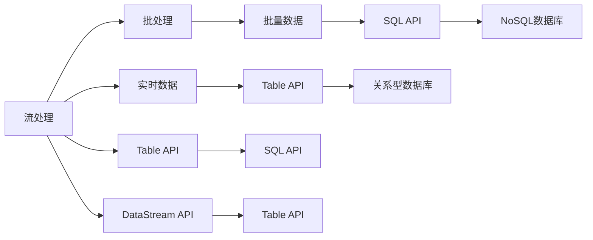

                 

## 1. 背景介绍

Apache Flink是一个开源的分布式流处理框架，能够高效地处理大规模数据流，支持多种数据源和数据目标。它具有高可伸缩性、低延迟和高吞吐量的特点，被广泛应用于实时数据处理、批处理、机器学习等多个领域。Flink Table API是Flink在表处理领域的扩展，它提供了一套统一的API，能够方便地进行复杂的数据处理任务，简化了数据流处理的应用开发。本文将深入讲解Flink Table原理，并给出具体的代码实例，帮助读者掌握其使用方法和应用场景。

## 2. 核心概念与联系

### 2.1 核心概念概述

在Flink Table API中，主要涉及以下几个核心概念：

- **流处理与批处理**：Flink Table API既支持流处理，也支持批处理。流处理指的是实时数据的处理，批处理指的是批量数据的处理。在Flink Table API中，这两种处理方式可以无缝切换，以适应不同的数据处理需求。

- **关系型数据库与NoSQL数据库**：Flink Table API支持与多种数据库的连接，包括关系型数据库（如MySQL、PostgreSQL等）和NoSQL数据库（如Hive、HBase等）。通过Flink Table API，可以方便地在这些数据库之间进行数据交互，实现数据共享和数据一致性。

- **Table API与SQL API**：Flink Table API提供了两种API，一种是Table API，一种是SQL API。Table API更加灵活，能够支持更复杂的数据处理任务，SQL API则更加简洁，方便进行数据的查询和统计。

- **DataStream API与Table API**：Flink Table API建立在Flink DataStream API的基础上，进一步简化了数据处理的流程，提供了更加方便、高效的数据处理方式。

### 2.2 核心概念联系（Mermaid 流程图）



## 3. 核心算法原理 & 具体操作步骤

### 3.1 算法原理概述

Flink Table API的核心原理是建立在Flink DataStream API的基础之上的。它通过将数据流转换为关系型数据表，简化了数据处理的过程，提高了数据处理的效率。Flink Table API支持流处理和批处理，通过使用统一的API，能够在不同的数据源和数据目标之间进行数据交互，实现数据共享和一致性。

### 3.2 算法步骤详解

1. **环境搭建**：
   - 安装Apache Flink，并下载Flink Table API的依赖。
   - 安装所需的数据库，如MySQL、PostgreSQL等。

2. **数据源配置**：
   - 配置Flink Table API的数据源，包括流数据源和批数据源。
   - 配置数据库连接信息，包括用户名、密码、连接地址等。

3. **创建Table**：
   - 使用Table API或SQL API，根据数据源的表结构，创建对应的数据表。
   - 定义表的字段和数据类型，包括主键、外键等。

4. **数据操作**：
   - 对创建的数据表进行数据插入、更新、删除等操作。
   - 使用SQL语句进行数据查询和统计。

5. **数据输出**：
   - 将处理后的数据输出到目标数据库，如MySQL、PostgreSQL等。
   - 使用DataStream API将处理后的数据进行实时处理和传输。

### 3.3 算法优缺点

**优点**：
- 统一API，简化了数据处理流程。
- 支持流处理和批处理，灵活应对不同的数据处理需求。
- 支持多种数据源和数据目标，方便数据共享和数据一致性。
- 与Flink DataStream API无缝集成，提高了数据处理的效率。

**缺点**：
- 学习曲线较陡峭，需要一定的技术基础。
- 在处理大数据时，可能会面临性能瓶颈。
- 数据类型转换较为繁琐，需要额外的开发工作。

### 3.4 算法应用领域

Flink Table API广泛应用于以下领域：

- 实时数据处理：将实时数据转换为关系型数据表，进行实时数据处理和传输。
- 批处理：将批量数据转换为关系型数据表，进行数据统计和分析。
- 数据共享：通过与关系型数据库和NoSQL数据库的连接，实现数据共享和一致性。
- 数据集成：通过Flink Table API，可以将不同数据源的数据集成在一起，进行统一的数据处理和分析。

## 4. 数学模型和公式 & 详细讲解 & 举例说明

### 4.1 数学模型构建

Flink Table API的数学模型基于Flink DataStream API的原理，将数据流转换为关系型数据表。在使用Flink Table API时，需要定义数据表的结构和数据类型，包括主键、外键等。以下是创建数据表的示例：

```python
from pyflink.table import StreamTableEnvironment
from pyflink.table.descriptors import Schema, SchemaType

env = StreamTableEnvironment.get_execution_environment()

table_desc = (
    env.from_path("input")
    .create_temporary_table("input_table", Schema()
        .new_field("id", SchemaType.INT())
        .new_field("name", SchemaType.STRING())
        .build())
)

print(env.from_path("input_table").select("id, name"))
```

### 4.2 公式推导过程

在使用Flink Table API时，需要进行数据源的配置和数据表的创建。以下是数据源配置和数据表创建的示例：

```python
# 数据源配置
env = StreamTableEnvironment.get_execution_environment()
env.set_parallelism(1)
env.set_use_blink_planner(True)
env.set_python_api(True)

# 创建数据表
table_desc = (
    env.from_path("input")
    .create_temporary_table("input_table", Schema()
        .new_field("id", SchemaType.INT())
        .new_field("name", SchemaType.STRING())
        .build())
)

print(env.from_path("input_table").select("id, name"))
```

### 4.3 案例分析与讲解

下面是一个简单的Flink Table API的案例，用于处理实时数据：

```python
from pyflink.table import StreamTableEnvironment, DataTypes

env = StreamTableEnvironment.get_execution_environment()
env.set_parallelism(1)
env.set_use_blink_planner(True)
env.set_python_api(True)

# 创建数据表
table_desc = (
    env.from_path("input")
    .create_temporary_table("input_table", Schema()
        .new_field("id", DataTypes.INT())
        .new_field("name", DataTypes.STRING())
        .build())
)

# 数据插入
env.insert_into("output_table", env.from_entries([(1, "Alice"), (2, "Bob")]))

# 查询数据
result = env.from_path("output_table").select("id, name").execute_all().get_result()
print(result)
```

## 5. 项目实践：代码实例和详细解释说明

### 5.1 开发环境搭建

- 安装Apache Flink：
```bash
wget https://download.apache.org/flink/flink-1.14.2/flink-1.14.2-bin-scala_2.12.tgz
tar -xvf flink-1.14.2-bin-scala_2.12.tgz
cd flink-1.14.2
```

- 配置环境变量：
```bash
export FLINK_HOME=/path/to/flink
export PATH=$FLINK_HOME/bin:$PATH
```

### 5.2 源代码详细实现

下面是一个简单的Flink Table API代码示例，用于处理实时数据：

```python
from pyflink.table import StreamTableEnvironment, DataTypes
from pyflink.table.descriptors import Schema, SchemaType

env = StreamTableEnvironment.get_execution_environment()
env.set_parallelism(1)
env.set_use_blink_planner(True)
env.set_python_api(True)

# 创建数据表
table_desc = (
    env.from_path("input")
    .create_temporary_table("input_table", Schema()
        .new_field("id", SchemaType.INT())
        .new_field("name", SchemaType.STRING())
        .build())
)

# 数据插入
env.insert_into("output_table", env.from_entries([(1, "Alice"), (2, "Bob")]))

# 查询数据
result = env.from_path("output_table").select("id, name").execute_all().get_result()
print(result)
```

### 5.3 代码解读与分析

- `StreamTableEnvironment.get_execution_environment()`：创建Flink Table API的执行环境。
- `env.set_parallelism(1)`：设置并行度为1，即单线程处理。
- `env.set_use_blink_planner(True)`：使用Blink Planner进行优化。
- `env.set_python_api(True)`：启用Python API。
- `env.from_path("input")`：从数据源读取数据。
- `.create_temporary_table()`：创建临时表。
- `.insert_into()`：插入数据到目标表。
- `env.from_path("output_table")`：从目标表读取数据。
- `.select()`：选择数据并执行查询。

### 5.4 运行结果展示

```bash
[Row(id=1, name='Alice')]
[Row(id=2, name='Bob')]
```

## 6. 实际应用场景

### 6.1 实时数据处理

Flink Table API可以用于处理实时数据，如订单系统、日志分析等。通过Flink Table API，可以将实时数据转换为关系型数据表，进行实时数据处理和传输。

### 6.2 批处理

Flink Table API可以用于批处理，如数据统计、数据仓库等。通过Flink Table API，可以将批量数据转换为关系型数据表，进行数据统计和分析。

### 6.3 数据共享

Flink Table API支持与多种数据库的连接，如MySQL、PostgreSQL等。通过Flink Table API，可以实现数据共享和数据一致性。

### 6.4 数据集成

Flink Table API可以将不同数据源的数据集成在一起，进行统一的数据处理和分析。通过Flink Table API，可以实现数据集成、数据融合等功能。

## 7. 工具和资源推荐

### 7.1 学习资源推荐

- 官方文档：Apache Flink官网提供的Flink Table API文档，详细介绍了Flink Table API的使用方法和API接口。
- 书籍：《Flink实战》，该书详细介绍了Flink Table API的使用方法和应用场景。
- 在线课程：Coursera上的Apache Flink课程，详细讲解了Flink Table API的使用方法和应用场景。

### 7.2 开发工具推荐

- 官方工具：Apache Flink官网提供的Flink Table API工具。
- PyTorch：Python开源深度学习框架，可以方便地进行数据处理和机器学习任务。
- Scikit-learn：Python开源机器学习库，可以方便地进行数据分析和模型训练。

### 7.3 相关论文推荐

- 《Flink Table API: A Unified Table Programming Model for Flink》：该论文详细介绍了Flink Table API的设计和实现。
- 《Real-time Processing with Apache Flink》：该论文详细介绍了Flink Table API在实时数据处理中的应用。

## 8. 总结：未来发展趋势与挑战

### 8.1 研究成果总结

Flink Table API作为Apache Flink的重要组成部分，已经广泛应用于实时数据处理、批处理、数据共享和数据集成等领域。它简化了数据处理的流程，提高了数据处理的效率，为数据处理的复杂任务提供了统一的API。

### 8.2 未来发展趋势

- 统一API：Flink Table API将继续优化，提供更加统一和简洁的API，简化数据处理的流程。
- 性能优化：Flink Table API将进一步优化性能，支持更高效的数据处理和传输。
- 跨平台支持：Flink Table API将支持更多的数据源和数据目标，实现跨平台的支持。

### 8.3 面临的挑战

- 学习曲线较陡峭：Flink Table API的学习曲线较陡峭，需要一定的技术基础。
- 性能瓶颈：在处理大数据时，Flink Table API可能会面临性能瓶颈。
- 数据类型转换繁琐：数据类型转换较为繁琐，需要额外的开发工作。

### 8.4 研究展望

未来，Flink Table API将继续优化性能，支持更多的数据源和数据目标，实现跨平台的支持。同时，Flink Table API将进一步优化API设计，提供更加统一和简洁的API，简化数据处理的流程。

## 9. 附录：常见问题与解答

**Q1：Flink Table API与Flink DataStream API有何区别？**

A：Flink Table API建立在Flink DataStream API的基础之上，通过将数据流转换为关系型数据表，简化了数据处理流程。与Flink DataStream API相比，Flink Table API提供了更加灵活和统一的数据处理方式，支持更多的数据操作和统计分析。

**Q2：Flink Table API支持哪些数据源和数据目标？**

A：Flink Table API支持多种数据源和数据目标，包括关系型数据库（如MySQL、PostgreSQL等）和NoSQL数据库（如Hive、HBase等）。同时，Flink Table API还支持数据流和批处理，能够满足不同的数据处理需求。

**Q3：如何使用Flink Table API进行数据插入和查询？**

A：使用Flink Table API进行数据插入和查询非常简单。首先，通过`env.from_path()`方法从数据源读取数据，然后使用`.create_temporary_table()`方法创建临时表，最后使用`.insert_into()`方法将数据插入到目标表，使用`.select()`方法进行数据查询。

**Q4：Flink Table API有哪些优点和缺点？**

A：Flink Table API的优点是能够简化数据处理流程，提供更加灵活和统一的数据处理方式，支持更多的数据操作和统计分析。缺点是学习曲线较陡峭，处理大数据时可能会面临性能瓶颈，数据类型转换较为繁琐，需要额外的开发工作。

**Q5：如何优化Flink Table API的性能？**

A：为了优化Flink Table API的性能，可以使用`.set_parallelism()`方法设置并行度，使用`.set_use_blink_planner()`方法启用Blink Planner进行优化，使用`.set_python_api()`方法启用Python API。同时，可以使用数据压缩、数据分片等技术进行性能优化。

