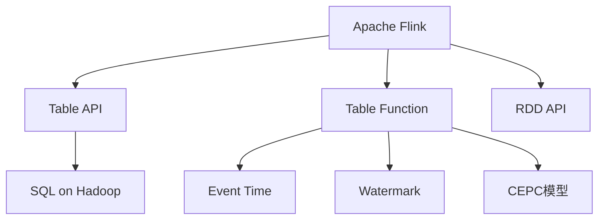

                 

# Flink Table原理与代码实例讲解

> 关键词：Apache Flink, Table API, Table Function, SQL on Hadoop, RDD API, Event Time, Watermark, CEPC

## 1. 背景介绍

### 1.1 问题由来
随着大数据技术的不断发展和深入应用，企业对实时数据处理的需求日益增长。传统的批处理框架如Hadoop MapReduce已经难以满足对低延迟、高吞吐量实时数据处理的业务需求。在这样的背景下，Apache Flink应运而生，提供了高并行度的分布式流处理框架，能够处理海量实时数据，并通过其Table API提供更加易用和直观的数据处理方式。

### 1.2 问题核心关键点
Apache Flink是Apache软件基金会在2014年开源的分布式流处理框架，基于内存计算，能够高效地处理海量实时数据。它能够与各种数据源和数据存储集成，支持低延迟、高吞吐量的数据流处理。Table API是Flink的一个重要组件，它提供了一组类SQL的API，可以简化数据流的处理过程，提高开发效率。

Table API的核心思想是将数据流作为“表”来处理，将SQL的语法和语义引入Flink，通过Table Function等机制，将SQL查询转换为Flink DataStream上的操作，实现了基于内存的、声明式的数据流处理。此外，Flink Table还支持事件时间处理、窗口处理、CEPC模型等多种复杂的数据流处理模式。

## 2. 核心概念与联系

### 2.1 核心概念概述

为更好地理解Apache Flink Table API的原理和机制，本节将介绍几个密切相关的核心概念：

- Apache Flink：Apache基金会开源的分布式流处理框架，提供高效、可靠、可扩展的数据流处理能力。
- Table API：Flink的声明式数据流处理API，提供类似SQL的语法，便于开发者构建复杂的数据流处理任务。
- Table Function：Table API中的函数，用于将SQL查询转换为Flink DataStream上的操作。
- Event Time：用于事件时间处理，保证数据流处理的正确性和一致性。
- Watermark：用于事件时间处理中的时间同步和数据处理，保证数据流处理的一致性。
- CEPC模型：Event-Counted Process with Cascading Function，Flink Table支持的模型，用于处理无界数据流。

这些核心概念之间的逻辑关系可以通过以下Mermaid流程图来展示：



这个流程图展示了这个体系的核心概念及其之间的关系：

1. Apache Flink是整个系统的核心，提供分布式流处理能力。
2. Table API是Flink提供的声明式API，用于简化数据流的处理过程。
3. Table Function是Table API中的函数，用于将SQL查询转换为Flink操作。
4. Event Time是Flink支持的事件时间处理机制，确保数据流处理的正确性和一致性。
5. Watermark是事件时间处理中的时间同步和数据处理机制，保证数据流处理的一致性。
6. CEPC模型是Flink Table支持的模型，用于处理无界数据流。

这些概念共同构成了Apache Flink Table API的基础框架，使得开发者能够高效、便捷地构建实时数据流处理任务。

## 3. 核心算法原理 & 具体操作步骤
### 3.1 算法原理概述

Apache Flink Table API的核心原理基于流式SQL查询的语义和优化，通过将SQL查询转换为Flink DataStream上的操作，利用Flink的高并行度和内存计算优势，实现高效、可靠的数据流处理。其核心算法包括：

1. SQL查询优化与执行计划生成。通过Flink的优化器，将SQL查询转换为高效的执行计划。
2. 事件时间处理与数据同步。利用Event Time和Watermark机制，确保数据流处理的正确性和一致性。
3. CEPC模型与无界数据处理。通过CEPC模型，处理无界数据流，确保数据的一致性和完整性。
4. 表函数与复杂处理。利用Table Function，实现复杂的数据流处理操作，如聚合、窗口、连接等。

### 3.2 算法步骤详解

Apache Flink Table API的算法步骤主要包括：

1. 数据流建模。利用Table API，将数据流建模为“表”，通过类SQL的语法定义数据流处理逻辑。
2. SQL查询与转换为Flink操作。将SQL查询转换为Flink DataStream上的操作，实现数据流的声明式处理。
3. 执行计划生成与优化。利用Flink的优化器，生成高效的执行计划，并进行优化。
4. 事件时间处理与数据同步。利用Event Time和Watermark机制，确保数据流处理的正确性和一致性。
5. 复杂处理与CEPC模型。通过Table Function，实现复杂的数据流处理操作，并通过CEPC模型处理无界数据流。

### 3.3 算法优缺点

Apache Flink Table API具有以下优点：

1. 高效便捷。Table API提供类似SQL的语法，易于上手，可以快速构建复杂的数据流处理任务。
2. 一致性保证。通过Event Time和Watermark机制，确保数据流处理的正确性和一致性。
3. 高性能。利用Flink的高并行度和内存计算优势，实现高效的数据流处理。
4. 可扩展性强。支持分布式流处理，能够处理海量实时数据。

同时，该方法也存在一定的局限性：

1. 学习曲线陡峭。虽然Table API提供类似SQL的语法，但对于没有SQL基础的用户，仍有一定的学习难度。
2. 性能瓶颈。在处理大规模数据流时，可能遇到内存不足、网络延迟等问题。
3. 复杂操作难调试。Table API支持复杂操作，如聚合、窗口等，但调试复杂操作的bug可能会比较困难。

尽管存在这些局限性，但就目前而言，Apache Flink Table API仍是流处理任务开发的理想选择。未来相关研究的重点在于如何进一步优化执行计划，提升性能，降低复杂操作的调试难度。

### 3.4 算法应用领域

Apache Flink Table API在诸多领域都得到了广泛的应用，例如：

- 金融风控：实时处理交易数据，检测异常交易，防范欺诈行为。
- 电商推荐：实时处理用户行为数据，推荐商品，提升用户体验。
- 社交网络：实时处理用户交互数据，分析用户行为，提高用户粘性。
- 物联网：实时处理传感器数据，进行数据分析和预测，提高设备利用率。
- 交通监控：实时处理交通数据，进行流量分析和优化，提升交通管理水平。
- 智能制造：实时处理生产数据，进行数据分析和预测，提高生产效率。

除了上述这些经典应用外，Flink Table API还被创新性地应用到更多场景中，如供应链管理、能源监控、智慧城市等，为各行各业带来了新的数据处理范式。随着Flink Table API和Apache Flink技术的不断进步，相信其在更多领域的应用前景将会更加广阔。

## 4. 数学模型和公式 & 详细讲解
### 4.1 数学模型构建

Flink Table API的数学模型主要涉及事件时间处理、窗口处理、CEPC模型等内容。这里以事件时间处理为例，详细讲解其数学模型和公式推导过程。

假设有一个数据流，数据记录的形式为 $(x_i, t_i)$，其中 $x_i$ 表示数据项，$t_i$ 表示事件时间戳。事件时间处理的目标是确保数据流处理的正确性和一致性。

在事件时间处理中，Flink引入了Watermark机制，通过Watermark来同步不同来源的事件时间，确保数据流处理的一致性。Watermark的含义是：某个事件的时间戳已经超过所有已经处理的数据流的时间戳，即 $t_{\text{Watermark}} > t_{\text{max}}$。

Watermark的生成规则为：

$$
t_{\text{Watermark}} = \max_{i \in \mathcal{I}} t_i
$$

其中 $\mathcal{I}$ 表示已处理的数据流的时间戳集合。Watermark的计算依赖于事件时间的定义，对于实时数据流，事件时间处理是基于事件时间戳的。因此，Watermark的生成过程可以表示为：

$$
\text{Watermark}_{i} = \max_{j=1}^{i} t_j
$$

### 4.2 公式推导过程

在事件时间处理中，Flink通过Watermark机制来实现数据流处理的同步和一致性。以下是其公式推导过程：

1. Watermark的生成
   - Watermark的初始值为 $t_1$。
   - 对于每个新到达的数据项 $(x_i, t_i)$，计算当前最大事件时间戳 $\max_{j=1}^{i} t_j$，更新Watermark为 $\max_{j=1}^{i} t_j$。
   
2. Watermark的同步
   - 当Watermark到达时，同步所有数据流的时间戳，更新为Watermark。
   
3. 数据流处理的同步
   - 当Watermark到达时，所有数据流的时间戳更新为Watermark，确保数据流处理的一致性。

### 4.3 案例分析与讲解

假设有一个实时数据流，记录了用户在电商平台上的行为数据，数据流的形式为：

```
(1, t1), (2, t2), (3, t3), (4, t4), (5, t5)
```

其中 $t_1 < t_2 < t_3 < t_4 < t_5$。如果事件时间的定义是事件发生时间戳，则Watermark的生成过程如下：

- 初始Watermark为 $t_1$。
- 到达 $(1, t1)$，Watermark不变。
- 到达 $(2, t2)$，Watermark更新为 $t_2$。
- 到达 $(3, t3)$，Watermark更新为 $t_3$。
- 到达 $(4, t4)$，Watermark更新为 $t_4$。
- 到达 $(5, t5)$，Watermark更新为 $t_5$。

如果事件时间的定义是事件提交时间戳，则Watermark的生成过程如下：

- 初始Watermark为 $t_1$。
- 到达 $(1, t1)$，Watermark不变。
- 到达 $(2, t2)$，Watermark不变。
- 到达 $(3, t3)$，Watermark不变。
- 到达 $(4, t4)$，Watermark不变。
- 到达 $(5, t5)$，Watermark更新为 $t_5$。

通过Watermark机制，Flink确保了数据流处理的正确性和一致性。在实际应用中，Watermark的生成和同步需要考虑各种情况，如数据流的间隔、数据流的延迟等。因此，Flink引入了Event Time机制，通过事件时间戳来定义事件时间，确保数据流处理的正确性和一致性。

## 5. 项目实践：代码实例和详细解释说明
### 5.1 开发环境搭建

在进行Flink Table API的开发实践前，需要先搭建好开发环境。以下是使用Python进行Apache Flink开发的环境配置流程：

1. 安装Java：从官网下载并安装JDK，用于Apache Flink的运行。

2. 安装Apache Flink：从官网下载并安装Apache Flink，并配置好运行环境。

3. 安装Python环境：安装Python 3.7及以上版本，并配置好依赖库。

4. 安装Pymongo：用于Python连接MongoDB数据库。

5. 安装PyFlink：Apache Flink的Python客户端库。

完成上述步骤后，即可在Flink环境下开始项目开发。

### 5.2 源代码详细实现

下面我们以实时处理用户行为数据、计算用户活跃度的项目为例，给出使用Apache Flink Table API进行开发的Python代码实现。

首先，定义Table API的连接和基本操作：

```python
from pyflink.datastream import StreamExecutionEnvironment
from pyflink.table import StreamTableEnvironment, CsvTableSource, CsvTableSink

env = StreamExecutionEnvironment.get_execution_environment()
t_env = StreamTableEnvironment.create(env)

# 定义用户行为数据表
t_env.execute_sql("""
CREATE TABLE user_behavior (
    id INT,
    user_id INT,
    event_time TIMESTAMP,
    event_type STRING,
    event_value INT
) WITH (
    'connector' = 'fs',
    'format' = 'csv',
    'path' = 'user_behavior.csv'
)
""")

# 定义用户活跃度计算表
t_env.execute_sql("""
CREATE TABLE user_activity (
    user_id INT,
    active_count INT,
    active_time INT
) WITH (
    'connector' = 'fs',
    'format' = 'csv',
    'path' = 'user_activity.csv'
)
""")

# 定义窗口聚合操作
t_env.execute_sql("""
INSERT INTO TABLE user_activity
SELECT user_id, COUNT(*) AS active_count, SUM(event_time) AS active_time
FROM user_behavior
GROUP BY user_id, active_time
WITH BATER窗口 (3 HOURS)
""")

# 插入数据
t_env.execute_sql("""
INSERT INTO TABLE user_activity
SELECT user_id, COUNT(*) AS active_count, SUM(event_time) AS active_time
FROM user_behavior
GROUP BY user_id
WITH BATER窗口 (3 HOURS)
""")
```

然后，定义Table Function和自定义操作：

```python
from pyflink.table.functions import CustomFunction

# 自定义函数
class CalculateActiveTime(CustomFunction):
    def eval(self, user_id, active_count, active_time):
        return active_time / active_count

# 注册自定义函数
t_env.register_function("calculate_active_time", CalculateActiveTime())

# 计算用户活跃度
t_env.execute_sql("""
UPDATE user_activity
SET active_time_per_day = calculate_active_time(user_id, active_count, active_time)
WITH BATER窗口 (1 DAY)
""")

# 插入数据
t_env.execute_sql("""
UPDATE user_activity
SET active_time_per_day = calculate_active_time(user_id, active_count, active_time)
WITH BATER窗口 (1 DAY)
""")
```

最后，启动数据流处理：

```python
t_env.execute("Flink Table示例")
```

以上就是使用PyFlink进行Flink Table API开发的完整代码实现。可以看到，通过Table API的语法，Flink Table API的开发变得非常简单。通过执行SQL语句，Flink Table API能够高效地处理实时数据流，并实现复杂的数据流处理操作。

### 5.3 代码解读与分析

让我们再详细解读一下关键代码的实现细节：

**Table API连接与操作**：
- `StreamExecutionEnvironment`和`StreamTableEnvironment`用于创建Flink环境。
- `CsvTableSource`和`CsvTableSink`用于定义数据源和数据流。
- `execute_sql`方法用于执行SQL语句，进行数据处理。

**Table Function和自定义操作**：
- `CustomFunction`用于定义自定义函数。
- `register_function`方法用于注册自定义函数。
- `calculate_active_time`函数用于计算用户活跃度。

**数据流处理**：
- `INSERT INTO TABLE`语句用于将处理结果插入到目标表中。
- `WITH BATER窗口`语句用于定义窗口操作。

Flink Table API通过简单的SQL语句，能够高效地进行数据流处理。通过注册自定义函数，Flink Table API还能实现复杂的数据流处理操作。在实际应用中，可以根据具体需求，灵活地使用Table API的语法，实现各种复杂的数据流处理任务。

## 6. 实际应用场景
### 6.1 智能推荐系统

Flink Table API在智能推荐系统中具有广泛的应用。推荐系统需要实时处理用户行为数据，分析用户兴趣，进行商品推荐。Flink Table API通过实时处理用户行为数据，能够快速计算用户兴趣，进行个性化推荐，提升用户体验。

在技术实现上，可以收集用户浏览、点击、购买等行为数据，定义行为数据表，通过Table API进行实时处理和分析。Flink Table API能够高效地处理海量实时数据，快速计算用户兴趣，进行个性化推荐，提升用户体验。

### 6.2 实时监控系统

Flink Table API在实时监控系统中也具有广泛的应用。实时监控系统需要实时处理各种监控数据，进行数据分析和告警。Flink Table API通过实时处理监控数据，能够高效地进行数据分析和告警，保证系统的稳定性和可靠性。

在技术实现上，可以收集各种监控数据，定义监控数据表，通过Table API进行实时处理和分析。Flink Table API能够高效地处理海量实时数据，快速进行数据分析和告警，确保系统的稳定性和可靠性。

### 6.3 实时金融交易系统

Flink Table API在实时金融交易系统中具有广泛的应用。实时金融交易系统需要实时处理交易数据，进行风险控制和欺诈检测。Flink Table API通过实时处理交易数据，能够高效地进行风险控制和欺诈检测，保证金融交易的安全性。

在技术实现上，可以收集交易数据，定义交易数据表，通过Table API进行实时处理和分析。Flink Table API能够高效地处理海量实时数据，快速进行风险控制和欺诈检测，确保金融交易的安全性。

### 6.4 未来应用展望

随着Flink Table API和Apache Flink技术的不断进步，其在更多领域的应用前景将会更加广阔。未来，Flink Table API将在以下几个方面得到广泛应用：

1. 实时数据分析：实时处理各种业务数据，进行数据分析和挖掘，提升业务洞察力。
2. 实时决策支持：实时处理决策数据，进行决策支持和优化，提升决策效率和质量。
3. 实时交易处理：实时处理交易数据，进行交易控制和优化，提升交易效率和安全性。
4. 实时监控与告警：实时处理监控数据，进行告警和预警，确保系统的稳定性和可靠性。
5. 实时推荐系统：实时处理用户行为数据，进行个性化推荐，提升用户体验。

Flink Table API以其高效、便捷、可靠的数据流处理能力，将在更多的实时业务场景中发挥重要作用。

## 7. 工具和资源推荐
### 7.1 学习资源推荐

为了帮助开发者系统掌握Flink Table API的理论基础和实践技巧，这里推荐一些优质的学习资源：

1. Apache Flink官方文档：Flink的官方文档提供了详细的API和使用指南，是学习和实践Flink Table API的重要参考。
2. Apache Flink Table User Guide：Flink Table API的官方用户手册，详细介绍了Table API的使用方法和示例。
3. Flink Table SQL教程：一些优秀的在线教程，如Flink的Table API学习教程、Table API实战教程等，提供了丰富的实践案例和代码示例。
4. PyFlink官方文档：PyFlink的官方文档，介绍了PyFlink的使用方法和示例。
5. PyFlink实战教程：一些优秀的在线教程，如PyFlink实战教程、PyFlink进阶教程等，提供了丰富的实战案例和代码示例。

通过对这些资源的学习实践，相信你一定能够快速掌握Flink Table API的精髓，并用于解决实际的业务问题。

### 7.2 开发工具推荐

高效的开发离不开优秀的工具支持。以下是几款用于Flink Table API开发的常用工具：

1. Apache Flink：Flink的官方分布式流处理框架，提供高并行度的数据流处理能力。
2. PyFlink：Apache Flink的Python客户端库，提供便捷的数据流处理API。
3. PySpark：Apache Spark的Python客户端库，提供便捷的数据流处理API，与Flink兼容。
4. Apache Kafka：Apache Kafka是Flink常用的数据流源和数据流 sink。
5. PyMongo：Python连接MongoDB数据库，用于存储和查询数据流。

合理利用这些工具，可以显著提升Flink Table API的开发效率，加快创新迭代的步伐。

### 7.3 相关论文推荐

Flink Table API的研究源于学界的持续研究。以下是几篇奠基性的相关论文，推荐阅读：

1. "Stream Processing with Apache Flink"：Flink的官方技术文档，介绍了Flink Table API的基本概念和使用方法。
2. "Data-Intensive Stream Processing"：迈克·泰勒（Mike Taylor）等人的著作，详细介绍了流处理技术的发展历程和前沿技术。
3. "Practical Stream Processing"：托尼·奥哈拉（Tony O'Hara）的著作，介绍了流处理技术的实践应用和最佳实践。
4. "Stream Processing with Kafka and Flink"：托尼·奥哈拉（Tony O'Hara）等人的著作，介绍了Kafka和Flink的集成使用，提供了丰富的实践案例。
5. "Stream Processing on Flink"：Flink的官方博客文章，介绍了Flink Table API在实际业务场景中的应用。

这些论文代表了大数据流处理技术的发展脉络。通过学习这些前沿成果，可以帮助研究者把握学科前进方向，激发更多的创新灵感。

## 8. 总结：未来发展趋势与挑战
### 8.1 研究成果总结

本文对Apache Flink Table API进行了全面系统的介绍。首先阐述了Flink Table API的研究背景和意义，明确了Flink Table API在流处理任务中的独特价值。其次，从原理到实践，详细讲解了Flink Table API的核心算法和具体操作步骤，给出了Flink Table API开发的完整代码示例。同时，本文还广泛探讨了Flink Table API在智能推荐、实时监控、金融交易等多个领域的应用前景，展示了Flink Table API的巨大潜力。此外，本文精选了Flink Table API的相关学习资源，力求为读者提供全方位的技术指引。

通过本文的系统梳理，可以看到，Apache Flink Table API正在成为流处理任务开发的理想选择，其高效、便捷、可靠的数据流处理能力，能够满足大数据时代的实时数据处理需求。Flink Table API以其类SQL的语法和强大的数据处理能力，将在更多领域得到广泛应用，为大数据时代的实时数据处理带来新的突破。

### 8.2 未来发展趋势

展望未来，Flink Table API将呈现以下几个发展趋势：

1. 高效便捷的API设计。Flink Table API将继续优化其API设计，使其更加高效、便捷，便于开发者构建复杂的数据流处理任务。
2. 高性能的优化策略。Flink Table API将继续优化其执行计划，提升数据流处理的性能，降低资源消耗。
3. 强大的处理能力。Flink Table API将继续增强其数据处理能力，支持更多复杂的数据流处理操作，如CEPC模型、事件时间处理等。
4. 多模态数据的整合。Flink Table API将继续探索多模态数据的整合，支持视觉、语音、文本等多种数据类型的协同处理。
5. 智能化的数据流处理。Flink Table API将继续探索智能化的数据流处理，如自动化数据流建模、自动化数据流优化等。

以上趋势凸显了Flink Table API的广阔前景。这些方向的探索发展，必将进一步提升Flink Table API的数据处理能力和应用范围，为大数据时代的实时数据处理带来新的突破。

### 8.3 面临的挑战

尽管Flink Table API已经取得了瞩目成就，但在迈向更加智能化、普适化应用的过程中，它仍面临着诸多挑战：

1. 学习曲线陡峭。虽然Flink Table API提供类SQL的语法，但对于没有SQL基础的用户，仍有一定的学习难度。
2. 性能瓶颈。在处理大规模数据流时，可能遇到内存不足、网络延迟等问题。
3. 复杂操作难调试。Flink Table API支持复杂操作，如聚合、窗口等，但调试复杂操作的bug可能会比较困难。
4. 数据一致性问题。在事件时间处理中，需要确保数据流处理的一致性，如何处理数据不一致性，避免数据丢失，仍是一个需要解决的问题。
5. 数据质量问题。在数据流处理中，如何保证数据质量，避免数据污染和异常，也需要进一步优化。

尽管存在这些挑战，但Flink Table API的强大功能和广泛应用前景仍然令人期待。未来相关研究的重点在于如何进一步优化执行计划，提升性能，降低复杂操作的调试难度，确保数据一致性和数据质量。

### 8.4 研究展望

面对Flink Table API面临的挑战，未来的研究需要在以下几个方面寻求新的突破：

1. 探索更高效的数据流处理策略。开发更加高效的数据流处理算法，降低资源消耗，提升数据流处理的性能。
2. 探索更加智能化的数据流处理。利用机器学习和人工智能技术，进行自动化的数据流建模和优化。
3. 探索多模态数据的整合。支持视觉、语音、文本等多种数据类型的协同处理，提高数据流处理的效率和准确性。
4. 探索数据一致性和数据质量的控制。通过数据清洗、数据验证等技术，确保数据流处理的一致性和数据质量。
5. 探索自动化数据流建模。利用自动化建模技术，减少数据流处理的开发和调试成本，提升开发效率。

这些研究方向将引领Flink Table API技术迈向更高的台阶，为大数据时代的实时数据处理带来新的突破。面向未来，Flink Table API还需要与其他大数据技术进行更深入的融合，如Hadoop、Spark等，共同推动大数据技术的发展。

## 9. 附录：常见问题与解答

**Q1：Flink Table API与Apache Flink是什么关系？**

A: Flink Table API是Apache Flink的一部分，提供了一组类SQL的API，用于简化数据流的处理过程，提高开发效率。Flink Table API的底层实现依赖于Apache Flink的分布式流处理框架，利用Flink的高并行度和内存计算优势，实现高效、可靠的数据流处理。

**Q2：Flink Table API的主要特点是什么？**

A: Flink Table API的主要特点包括：

1. 高效便捷：提供类似SQL的语法，易于上手，可以快速构建复杂的数据流处理任务。
2. 一致性保证：通过Event Time和Watermark机制，确保数据流处理的正确性和一致性。
3. 高性能：利用Flink的高并行度和内存计算优势，实现高效的数据流处理。
4. 可扩展性强：支持分布式流处理，能够处理海量实时数据。

**Q3：Flink Table API在实际应用中有哪些限制？**

A: Flink Table API在实际应用中可能面临以下限制：

1. 学习曲线陡峭：虽然提供类似SQL的语法，但对于没有SQL基础的用户，仍有一定的学习难度。
2. 性能瓶颈：在处理大规模数据流时，可能遇到内存不足、网络延迟等问题。
3. 复杂操作难调试：支持复杂操作，如聚合、窗口等，但调试复杂操作的bug可能会比较困难。
4. 数据一致性问题：在事件时间处理中，需要确保数据流处理的一致性，如何处理数据不一致性，避免数据丢失，仍是一个需要解决的问题。
5. 数据质量问题：在数据流处理中，如何保证数据质量，避免数据污染和异常，也需要进一步优化。

**Q4：Flink Table API在实际应用中如何优化性能？**

A: 在实际应用中，可以采取以下措施来优化Flink Table API的性能：

1. 数据分片和并行处理：将数据流分成多个分片，并行处理，提升处理效率。
2. 窗口优化：合理设计窗口大小和类型，避免数据丢失和重复处理。
3. 数据压缩和缓存：对数据进行压缩和缓存，减少内存消耗和网络延迟。
4. 资源优化：合理配置资源，如CPU、内存、磁盘等，确保系统的稳定性和可靠性。
5. 数据一致性控制：通过Watermark机制，确保数据流处理的一致性。

**Q5：Flink Table API如何处理数据一致性问题？**

A: Flink Table API通过Event Time和Watermark机制，确保数据流处理的一致性。Event Time是事件发生的时间戳，Watermark是数据流的时间同步机制，用于保证数据流处理的一致性。具体来说，通过Watermark机制，Flink Table API能够同步不同来源的事件时间，确保数据流处理的一致性。

**Q6：Flink Table API如何处理数据质量问题？**

A: 在数据流处理中，Flink Table API可以通过以下措施来保证数据质量：

1. 数据清洗：对数据进行去重、去噪、补全等处理，去除无效和异常数据。
2. 数据验证：对数据进行格式验证、类型验证、范围验证等，确保数据的正确性和一致性。
3. 异常处理：对数据进行异常处理，如空值处理、错误处理等，确保数据的完整性。

以上是Flink Table API的相关问题和解答，希望能对你理解和使用Flink Table API有所帮助。

---

作者：禅与计算机程序设计艺术 / Zen and the Art of Computer Programming

