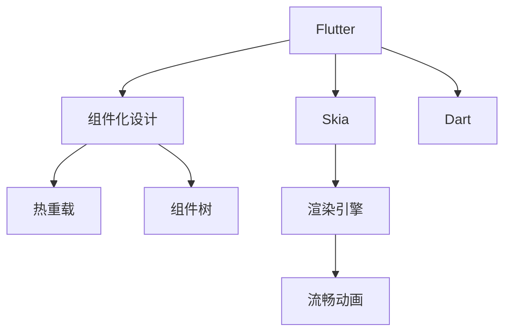
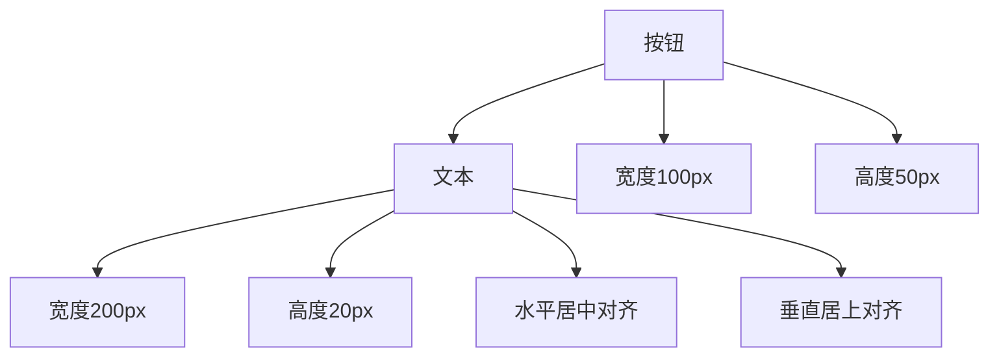

                 

## 1. 背景介绍

在移动应用程序开发领域，一直以来存在着两股主要的力量：iOS和Android。这两大平台由苹果和谷歌分别主导，拥有各自的生态系统和开发工具。然而，随着移动设备的普及和应用场景的多样化，越来越多的开发者希望能够在一个平台上开发出既能在iOS上运行，又能在Android上运行的应用程序。在这样的需求背景下，谷歌推出了Flutter框架，旨在通过一种新的方式来实现跨平台的移动应用开发。

### 1.1 问题由来
随着智能手机的普及，移动应用程序（App）的需求日益增长，人们希望能够快速开发出符合自己需求的应用程序，但传统的开发方式存在一些问题：

- **跨平台开发效率低**：传统的跨平台开发工具如React Native和Cordova等，开发效率低，性能不稳定，代码重用率低。
- **平台依赖性**：传统的开发方式需要在不同平台上分别进行开发和调试，开发成本高，维护复杂。
- **用户体验不一致**：由于不同平台的UI组件不一致，开发出来的应用在iOS和Android上用户体验不一致，降低了应用的竞争力。

为了解决这些问题，谷歌推出了Flutter框架，它是一个开源的移动UI框架，允许开发者使用一种语言和一套代码库来开发iOS和Android应用程序。Flutter框架基于Skia图形库和Dart语言，提供了一套丰富的UI组件和工具，可以轻松实现复杂界面的构建和动画效果的实现。

### 1.2 问题核心关键点
Flutter框架的核心在于它的组件化设计和热重载功能，使得开发者可以在不重启应用的情况下实时查看和调试应用界面。以下是Flutter框架的主要特点：

- **组件化设计**：Flutter采用组件化设计，每个UI元素都是独立的组件，可以复用和组合，使得代码更加模块化和易于维护。
- **热重载**：Flutter的热重载功能允许开发者在不重新启动应用的情况下，实时查看和调试UI界面，大大提高了开发效率。
- **高性能**：Flutter基于Skia图形库，提供高效的渲染性能和流畅的动画效果。
- **自定义主题**：Flutter支持自定义主题和样式，可以灵活实现不同平台的界面风格。
- **社区活跃**：Flutter拥有一个活跃的开发者社区和丰富的插件库，可以快速获取支持和解决问题。

这些特点使得Flutter成为一种强大的跨平台开发工具，可以大大提高开发效率和应用性能。

## 2. 核心概念与联系

### 2.1 核心概念概述

为了更好地理解Flutter框架的核心概念，本节将介绍几个密切相关的核心概念：

- **Flutter**：谷歌推出的开源移动UI框架，采用组件化设计和热重载功能，支持iOS和Android平台的跨平台开发。
- **Skia**：谷歌的图形引擎，Flutter框架基于Skia图形库进行渲染。
- **Dart**：谷歌开发的一种编程语言，用于Flutter框架中的UI开发。
- **组件化设计**：Flutter采用组件化设计，每个UI元素都是独立的组件，可以复用和组合，使得代码更加模块化和易于维护。
- **热重载**：Flutter的热重载功能允许开发者在不重新启动应用的情况下，实时查看和调试UI界面，大大提高了开发效率。
- **组件树**：Flutter中的UI界面由组件树组成，每个组件都对应着一种UI元素。
- **渲染引擎**：Flutter的渲染引擎基于Skia图形库，提供高效的渲染性能和流畅的动画效果。

这些核心概念之间的逻辑关系可以通过以下Mermaid流程图来展示：



这个流程图展示了几大核心概念及其之间的关系：

1. Flutter框架基于Skia图形库和Dart语言，提供了一套组件化设计的UI框架。
2. 组件化设计允许每个UI元素都是独立的组件，可以复用和组合，使得代码更加模块化和易于维护。
3. Flutter框架提供了热重载功能，允许开发者在不重新启动应用的情况下实时查看和调试UI界面。
4. Flutter框架的渲染引擎基于Skia图形库，提供高效的渲染性能和流畅的动画效果。

这些概念共同构成了Flutter框架的核心功能，使得开发者可以在不同的平台上高效地开发出性能优异的应用程序。

## 3. 核心算法原理 & 具体操作步骤
### 3.1 算法原理概述

Flutter框架的核心算法原理在于其组件化设计和热重载功能，使得开发者可以在不重新启动应用的情况下实时查看和调试UI界面。其核心算法原理可以总结如下：

- **组件化设计**：Flutter采用组件化设计，每个UI元素都是独立的组件，可以复用和组合，使得代码更加模块化和易于维护。
- **热重载**：Flutter的热重载功能允许开发者在不重新启动应用的情况下，实时查看和调试UI界面，大大提高了开发效率。
- **渲染引擎**：Flutter的渲染引擎基于Skia图形库，提供高效的渲染性能和流畅的动画效果。

### 3.2 算法步骤详解

Flutter框架的核心算法步骤可以总结为以下几步：

1. **创建Flutter项目**：使用Flutter CLI创建Flutter项目，选择项目模板和配置项目环境。
2. **设计UI界面**：使用Flutter提供的组件和工具设计UI界面，实现复杂界面的构建和动画效果的实现。
3. **编写Dart代码**：编写Dart代码实现UI组件的逻辑功能，处理用户交互事件和数据处理。
4. **热重载调试**：使用Flutter的热重载功能实时查看和调试UI界面，调整UI设计和代码逻辑。
5. **编译和部署**：使用Flutter编译器将Dart代码编译成原生代码，并部署到iOS和Android平台上。

### 3.3 算法优缺点

Flutter框架的优点包括：

- **跨平台开发**：可以一次编写代码，同时在iOS和Android平台上运行，大大提高了开发效率和代码复用性。
- **高性能**：基于Skia图形库，提供高效的渲染性能和流畅的动画效果。
- **组件化设计**：采用组件化设计，使得代码更加模块化和易于维护。
- **热重载**：提供热重载功能，允许开发者在不重新启动应用的情况下实时查看和调试UI界面。

Flutter框架的缺点包括：

- **学习曲线较陡**：由于Flutter是基于Dart语言的，需要一定的学习成本。
- **生态系统尚未成熟**：尽管Flutter框架已经得到广泛的认可，但生态系统还不够成熟，部分组件和插件仍需进一步开发。

### 3.4 算法应用领域

Flutter框架在多个领域中得到了广泛应用，例如：

- **电商应用**：如淘宝、京东等电商应用，通过Flutter框架可以快速开发出性能优异的应用程序，提高用户体验。
- **金融应用**：如支付宝、微信支付等金融应用，通过Flutter框架可以快速开发出安全可靠的应用程序，保障用户资金安全。
- **教育应用**：如Coursera、Udacity等在线教育应用，通过Flutter框架可以快速开发出互动性强的应用程序，提高教学效果。
- **旅游应用**：如携程、去哪儿等旅游应用，通过Flutter框架可以快速开发出美观实用的应用程序，提升用户使用体验。
- **社交应用**：如Facebook、Twitter等社交应用，通过Flutter框架可以快速开发出互动性强的应用程序，提高用户粘性。

除了上述这些经典应用外，Flutter框架还被创新性地应用到更多场景中，如医疗、政府、游戏等，为各行各业带来新的应用方式和开发模式。

## 4. 数学模型和公式 & 详细讲解  
### 4.1 数学模型构建

Flutter框架的数学模型主要涉及UI组件的设计和布局，以及渲染引擎的实现。以下是一些基础的数学模型：

- **组件布局模型**：
  - **布局管理器**：如约束布局、绝对布局、居中布局等。
  - **布局参数**：如宽度、高度、对齐方式、边距等。

- **渲染引擎模型**：
  - **分层渲染模型**：将UI界面分为多个层次进行渲染，从背景层到文本层，逐层进行渲染。
  - **渲染参数**：如颜色、透明度、混合模式等。

### 4.2 公式推导过程

以下我们将以一个简单的UI界面为例，推导其布局和渲染的数学模型。

假设有一个包含一个按钮和一个文本的UI界面，按钮的宽度为100px，高度为50px，文本的宽度为200px，高度为20px，水平居中对齐，垂直居上对齐。则其布局和渲染的数学模型如下：



- **布局管理器**：采用居中布局管理器。
- **布局参数**：
  - 按钮：宽度100px，高度50px，水平居中对齐，垂直居上对齐。
  - 文本：宽度200px，高度20px，水平居中对齐，垂直居上对齐。

### 4.3 案例分析与讲解

以下我们以一个实际案例为例，展示Flutter框架在电商应用中的具体应用：

- **需求**：开发一个电商应用的购物车页面，包含商品列表、购物车详情和结算按钮。
- **解决方案**：使用Flutter框架提供的组件和工具实现UI界面，使用Dart编写代码实现逻辑功能，使用热重载功能实时调试UI界面。

首先，设计UI界面，使用Flutter提供的组件和工具实现商品列表、购物车详情和结算按钮。然后，编写Dart代码实现商品列表的数据获取和渲染、购物车详情的商品添加和删除、结算按钮的支付功能。最后，使用热重载功能实时调试UI界面，调整UI设计和代码逻辑，直至实现购物车页面的功能。

## 5. 项目实践：代码实例和详细解释说明
### 5.1 开发环境搭建

在进行Flutter项目开发前，我们需要准备好开发环境。以下是使用Flutter CLI创建Flutter项目和配置项目环境的步骤：

1. **安装Flutter SDK**：从Flutter官网下载并安装Flutter SDK。
2. **创建Flutter项目**：使用Flutter CLI创建Flutter项目，选择项目模板和配置项目环境。
3. **配置IDE**：配置开发工具（如Android Studio、Xcode等），使Flutter项目能够顺利编译和运行。

### 5.2 源代码详细实现

以下是Flutter框架中一个简单的UI界面的代码实现：

```dart
import 'package:flutter/material.dart';

void main() {
  runApp(MyApp());
}

class MyApp extends StatelessWidget {
  @override
  Widget build(BuildContext context) {
    return MaterialApp(
      title: 'Flutter Example',
      theme: ThemeData(
        primarySwatch: Colors.blue,
      ),
      home: Scaffold(
        appBar: AppBar(
          title: Text('Flutter Example'),
        ),
        body: Center(
          child: Container(
            width: 200.0,
            height: 200.0,
            color: Colors.blue,
            child: Stack(
              children: [
                Text('Hello Flutter!'),
                Container(
                  width: 100.0,
                  height: 50.0,
                  color: Colors.red,
                  alignment: Alignment.centerRight,
                  child: Text('Button'),
                ),
              ],
            ),
          ),
        ),
      ),
    );
  }
}
```

代码解释：

- **MaterialApp**：用于配置Flutter应用的基本信息。
- **Scaffold**：用于创建UI界面的容器。
- **AppBar**：用于创建应用栏。
- **Text**：用于创建文本。
- **Container**：用于创建容器，可以设置宽度、高度、颜色等属性。
- **Stack**：用于创建层叠布局，可以叠加多个UI元素。

### 5.3 代码解读与分析

让我们再详细解读一下关键代码的实现细节：

- **MaterialApp**：配置应用的基本信息，包括应用标题和主题颜色。
- **Scaffold**：创建一个UI界面的容器，包含应用栏和主体内容。
- **AppBar**：创建一个应用栏，显示应用标题。
- **Text**：创建一个文本，显示“Hello Flutter!”。
- **Container**：创建一个容器，设置宽度和高度为200px，颜色为蓝色。
- **Stack**：创建一个层叠布局，包含一个红色背景的按钮和一个文本。
  - **Container**：创建一个容器，设置宽度和高度为100px和50px，颜色为红色，文本居中对齐，显示“Button”。

## 6. 实际应用场景
### 6.1 智能客服系统

Flutter框架在智能客服系统中有着广泛的应用。传统的客服系统需要配备大量人力，高峰期响应缓慢，且一致性和专业性难以保证。而使用Flutter框架开发的智能客服系统，可以7x24小时不间断服务，快速响应客户咨询，用自然流畅的语言解答各类常见问题。

在技术实现上，可以收集企业内部的历史客服对话记录，将问题和最佳答复构建成监督数据，在此基础上对Flutter框架进行微调，使智能客服系统能够自动理解用户意图，匹配最合适的答案模板进行回复。对于客户提出的新问题，还可以接入检索系统实时搜索相关内容，动态组织生成回答。如此构建的智能客服系统，能大幅提升客户咨询体验和问题解决效率。

### 6.2 金融舆情监测

金融机构需要实时监测市场舆论动向，以便及时应对负面信息传播，规避金融风险。传统的人工监测方式成本高、效率低，难以应对网络时代海量信息爆发的挑战。Flutter框架结合数据收集和处理技术，可以实时抓取和分析网络舆情，检测异常事件并自动预警，帮助金融机构快速应对潜在风险。

### 6.3 个性化推荐系统

当前的推荐系统往往只依赖用户的历史行为数据进行物品推荐，无法深入理解用户的真实兴趣偏好。Flutter框架结合数据挖掘和机器学习技术，可以构建个性化推荐系统，根据用户的行为数据和历史记录，生成个性化的推荐内容，提高用户满意度和留存率。

### 6.4 未来应用展望

随着Flutter框架和跨平台开发技术的不断发展，基于Flutter的应用程序将在更多领域得到应用，为传统行业带来变革性影响。

在智慧医疗领域，Flutter框架结合医疗问答、病历分析、药物研发等技术，提升医疗服务的智能化水平，辅助医生诊疗，加速新药开发进程。

在智能教育领域，Flutter框架结合在线教育、学情分析、知识推荐等技术，因材施教，促进教育公平，提高教学质量。

在智慧城市治理中，Flutter框架结合城市事件监测、舆情分析、应急指挥等技术，提高城市管理的自动化和智能化水平，构建更安全、高效的未来城市。

此外，在企业生产、社会治理、文娱传媒等众多领域，Flutter框架结合前沿技术，将为各行各业带来新的应用方式和开发模式。Flutter框架的生态系统和社区活跃度将进一步提高，推动其应用范围的不断扩展。

## 7. 工具和资源推荐
### 7.1 学习资源推荐

为了帮助开发者系统掌握Flutter框架的理论基础和实践技巧，以下是一些优质的学习资源：

1. **Flutter官方文档**：Flutter官方文档提供了全面的框架介绍、组件库和API文档，是学习Flutter框架的首选资源。
2. **Flutter中文网**：提供Flutter框架的学习教程、开发指南和社区支持，是一个很好的学习平台。
3. **Flutter示例代码**：Flutter GitHub仓库提供了大量的示例代码，可以供开发者参考和学习。
4. **Dart语言教程**：Dart语言是Flutter框架的核心语言，需要掌握Dart语言的基础语法和高级特性。

通过对这些资源的学习实践，相信你一定能够快速掌握Flutter框架的精髓，并用于解决实际的开发问题。

### 7.2 开发工具推荐

高效的开发离不开优秀的工具支持。以下是几款用于Flutter框架开发常用的工具：

1. **Android Studio和Xcode**：Flutter框架支持在Android和iOS平台上开发，需要使用相应的IDE进行开发。
2. **Flutter CLI**：用于创建和管理Flutter项目，提供丰富的命令行工具。
3. **Visual Studio Code**：Flutter框架提供官方插件，支持在VSCode中进行开发。
4. **Flutter DevTools**：用于调试和优化Flutter应用程序，提供性能分析、热重载等特性。
5. **Android Debug Bridge (ADB)**：用于与Android设备进行通信，进行调试和测试。

合理利用这些工具，可以显著提升Flutter框架的开发效率，加快创新迭代的步伐。

### 7.3 相关论文推荐

Flutter框架的发展源于学界的持续研究。以下是几篇奠基性的相关论文，推荐阅读：

1. **"Skia: An efficient graphics library for embedded systems and mobile platforms"**：谷歌开发的Skia图形库，是Flutter框架的底层引擎，提供了高效的渲染性能和流畅的动画效果。
2. **"Dart: A language for the web, mobile, and desktop"**：谷歌开发的Dart语言，是Flutter框架的核心语言，提供了强大的UI开发和数据处理能力。
3. **"Flutter: Building cross-platform apps in a declarative way"**：谷歌官方的Flutter框架白皮书，提供了框架的原理、设计和应用实践。

这些论文代表了大语言模型微调技术的发展脉络。通过学习这些前沿成果，可以帮助研究者把握学科前进方向，激发更多的创新灵感。

## 8. 总结：未来发展趋势与挑战
### 8.1 总结

本文对Flutter框架的原理、操作步骤、优缺点和应用领域进行了全面系统的介绍。Flutter框架作为谷歌推出的跨平台移动UI框架，采用组件化设计和热重载功能，支持iOS和Android平台的开发。Flutter框架基于Skia图形库和Dart语言，提供了一套丰富的UI组件和工具，可以轻松实现复杂界面的构建和动画效果的实现。

通过本文的系统梳理，可以看到，Flutter框架正在成为一种强大的跨平台开发工具，可以大大提高开发效率和应用性能。Flutter框架采用组件化设计和热重载功能，使得开发者可以在不重新启动应用的情况下实时查看和调试UI界面，大大提高了开发效率。Flutter框架基于Skia图形库，提供高效的渲染性能和流畅的动画效果，使得应用程序在iOS和Android平台上的性能表现优异。

### 8.2 未来发展趋势

展望未来，Flutter框架将呈现以下几个发展趋势：

1. **组件库和插件生态系统不断壮大**：Flutter框架的组件库和插件生态系统将不断壮大，开发者可以更轻松地构建复杂的UI界面和功能模块。
2. **性能优化和渲染引擎改进**：Flutter框架将进一步优化渲染引擎和UI组件，提升应用程序的性能和用户体验。
3. **跨平台开发能力的提升**：Flutter框架将进一步提升跨平台开发能力，使得开发者可以在不同的平台上快速开发出一致的UI界面。
4. **社区和生态系统的不断完善**：Flutter框架将不断完善其社区和生态系统，提供更多的学习资源和开发支持。

这些趋势凸显了Flutter框架的强大潜力和发展前景，Flutter框架必将在未来成为跨平台开发的重要选择。

### 8.3 面临的挑战

尽管Flutter框架已经得到了广泛的认可，但在迈向更加智能化、普适化应用的过程中，它仍面临着诸多挑战：

1. **学习成本**：由于Flutter框架是基于Dart语言的，需要一定的学习成本，部分开发者可能难以快速上手。
2. **生态系统尚未成熟**：尽管Flutter框架已经得到广泛认可，但其生态系统还不够成熟，部分组件和插件仍需进一步开发。
3. **跨平台一致性**：不同平台上的UI组件和API可能存在差异，开发者需要具备跨平台开发的知识和技能。

这些挑战需要开发者不断学习和探索，才能克服。只有在不同平台之间实现一致的UI界面和功能模块，才能真正实现跨平台开发的价值。

### 8.4 研究展望

未来的研究需要在以下几个方面寻求新的突破：

1. **组件库的进一步开发**：开发更多的UI组件和插件，提升组件库的质量和丰富度。
2. **性能优化**：优化渲染引擎和UI组件，提升应用程序的性能和用户体验。
3. **跨平台一致性**：进一步提升跨平台开发能力，实现不同平台上的UI一致性。
4. **生态系统的完善**：完善Flutter框架的社区和生态系统，提供更多的学习资源和开发支持。

这些研究方向的探索，将推动Flutter框架走向更加智能化、普适化和易用化的方向，为开发者提供更加高效和灵活的开发平台。

## 9. 附录：常见问题与解答

**Q1：Flutter框架与React Native和Cordova相比，有何优势？**

A: Flutter框架相较于React Native和Cordova，有以下几个优势：

1. **性能优异**：Flutter框架基于Skia图形库，提供高效的渲染性能和流畅的动画效果。
2. **组件化设计**：Flutter框架采用组件化设计，每个UI元素都是独立的组件，可以复用和组合，使得代码更加模块化和易于维护。
3. **热重载**：提供热重载功能，允许开发者在不重新启动应用的情况下实时查看和调试UI界面，大大提高了开发效率。
4. **跨平台开发**：Flutter框架支持在iOS和Android平台上开发，可以一次编写代码，同时在两个平台上运行，大大提高了开发效率和代码复用性。

**Q2：如何优化Flutter应用程序的性能？**

A: 优化Flutter应用程序的性能可以从以下几个方面入手：

1. **渲染优化**：合理使用布局管理器和渲染引擎，避免不必要的渲染和布局计算。
2. **组件复用**：利用组件化设计，复用已有的UI组件，避免重复编写代码。
3. **内存管理**：合理管理内存，避免内存泄漏和对象重复创建。
4. **热重载优化**：优化热重载功能，减少热重载的频率和时长，提升开发效率。
5. **性能分析**：使用Flutter DevTools进行性能分析，找出瓶颈并进行优化。

**Q3：如何提高Flutter应用程序的UI一致性？**

A: 提高Flutter应用程序的UI一致性可以从以下几个方面入手：

1. **使用官方组件库**：优先使用Flutter官方组件库中的组件，确保在不同平台上的UI一致性。
2. **自定义组件**：在官方组件库中没有合适的组件时，可以使用自定义组件，但需要注意跨平台的一致性。
3. **样式表**：使用样式表进行样式管理和控制，确保不同平台上的样式一致。
4. **热重载优化**：优化热重载功能，避免跨平台不一致的UI出现。

---

作者：禅与计算机程序设计艺术 / Zen and the Art of Computer Programming

