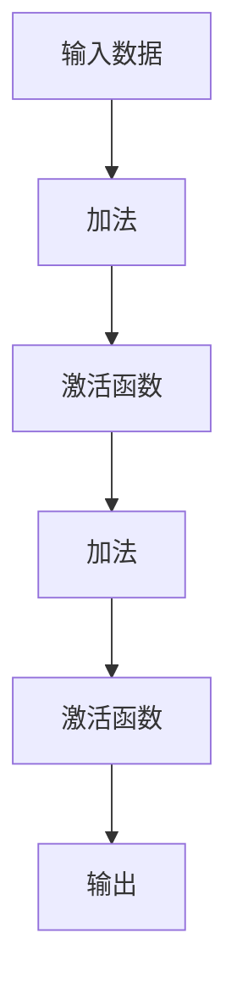

                 

# GPU在AI算力中的作用

> 关键词：GPU, AI, 深度学习, 神经网络, 算力, 计算图, 并行计算, 深度学习框架, CUDA

## 1. 背景介绍

### 1.1 问题由来

深度学习技术的快速发展，推动了人工智能(AI)领域在计算机视觉、自然语言处理、语音识别等众多方向取得突破性进展。然而，深度学习的计算需求极为庞大，单靠CPU已经无法胜任大规模深度学习模型的训练和推理任务。为了应对日益增长的计算需求，GPU成为不可或缺的计算资源。

GPU (Graphics Processing Unit) 作为图形处理芯片，原本是专为图形渲染而设计的硬件。然而，GPU的设计天然具备高度并行化的特征，在数据密集型计算任务中，其性能远远超过通用CPU。基于GPU的并行计算架构，可大幅提升深度学习模型的训练速度和推理效率，显著降低算力成本。

随着深度学习模型的规模不断扩大，传统CPU在深度学习应用中的地位逐渐被GPU所取代。GPU在AI算力中的核心作用，无论是在工业界还是学术界，都得到了广泛认可。本文旨在深入分析GPU在AI算力中的具体作用，探索其优化算力策略，以期为AI开发者提供更全面的技术指导。

### 1.2 问题核心关键点

GPU在AI算力中的关键作用主要体现在以下几个方面：

- GPU并行计算架构：通过高度并行化的设计，使得GPU能够同时处理大量数据，极大提升深度学习模型训练和推理的效率。
- 深度学习框架优化：主流深度学习框架如TensorFlow、PyTorch等，通过引入GPU支持，实现了高效的张量计算和并行运算，显著提升了框架的性能和易用性。
- CUDA加速：NVIDIA推出的CUDA并行计算平台，提供了高性能的API和优化工具，支持GPU加速的深度学习模型的开发和运行。
- 异构计算：GPU与CPU结合，能够发挥各自优势，提升AI应用的全栈性能。

本文将详细探讨这些关键点，以揭示GPU在AI算力中的核心作用，并对其未来发展进行展望。

## 2. 核心概念与联系

### 2.1 核心概念概述

为了更好地理解GPU在AI算力中的作用，本节将介绍几个密切相关的核心概念：

- **GPU (Graphics Processing Unit)**：专为图形渲染设计的硬件，具备极高的并行计算能力，是深度学习计算加速的关键。
- **深度学习(DL)**：一种模拟人脑神经网络结构的人工智能算法，通过大量数据的训练，使模型能够对新数据进行高效预测。
- **神经网络(NN)**：深度学习模型中的一种，由多层次的非线性神经元组成，能够学习输入数据的高维表示。
- **计算图(Computational Graph)**：深度学习模型在训练和推理过程中，自动构建的计算逻辑图，通过反向传播算法计算梯度，进行模型参数优化。
- **并行计算(Parallel Computing)**：利用多个处理器同时执行相同或不同的计算任务，以提升计算效率。

这些概念之间的逻辑关系可以通过以下Mermaid流程图来展示：

```mermaid
graph TB
    GPU --> Deep Learning
    GPU --> Neural Networks
    GPU --> Computational Graphs
    GPU --> Parallel Computing
    Neural Networks --> Deep Learning
    Computational Graphs --> Deep Learning
    Parallel Computing --> Deep Learning
    Neural Networks --> Computational Graphs
```

这个流程图展示了大规模计算中GPU与深度学习的密切关系：

1. GPU通过高度并行化的设计，显著提升深度学习模型的计算效率。
2. 深度学习模型通过神经网络结构学习复杂模式，实现高效的预测和分类。
3. 计算图是深度学习模型训练和推理的核心工具，通过自动构建计算逻辑图，加速模型参数优化。
4. 并行计算是GPU加速的关键技术，通过多个处理器同时计算，大幅提升深度学习模型的性能。

以上概念构成了GPU在AI算力中的核心框架，使其能够高效处理深度学习任务，优化AI应用的计算性能。

## 3. 核心算法原理 & 具体操作步骤

### 3.1 算法原理概述

GPU在AI算力中的核心原理在于其并行计算架构和高度优化的计算图处理能力。基于GPU的并行计算，可以同时处理大规模数据集，显著提升深度学习模型的训练和推理速度。

在深度学习模型训练过程中，GPU通过并行计算加速了反向传播算法的执行。反向传播算法需要计算大量的梯度值，通过高度并行化的计算，GPU可以同时计算多个样本的梯度，加速模型参数优化。同时，GPU还支持向量量化、矩阵乘法等高效计算操作，优化深度学习模型的计算过程。

### 3.2 算法步骤详解

GPU在AI算力中的应用涉及多个关键步骤，包括模型搭建、计算图构建、并行计算优化等。以下是详细的步骤介绍：

**Step 1: 模型搭建**

深度学习模型的搭建是GPU加速算力的基础。在Python深度学习框架（如TensorFlow、PyTorch）中，模型的搭建通常通过定义计算图实现。以下是一个简单的示例，展示了如何使用PyTorch搭建一个卷积神经网络(CNN)：

```python
import torch
import torch.nn as nn
import torch.nn.functional as F

class ConvNet(nn.Module):
    def __init__(self):
        super(ConvNet, self).__init__()
        self.conv1 = nn.Conv2d(3, 6, 5)
        self.pool = nn.MaxPool2d(2, 2)
        self.conv2 = nn.Conv2d(6, 16, 5)
        self.fc1 = nn.Linear(16 * 5 * 5, 120)
        self.fc2 = nn.Linear(120, 84)
        self.fc3 = nn.Linear(84, 10)

    def forward(self, x):
        x = self.pool(F.relu(self.conv1(x)))
        x = self.pool(F.relu(self.conv2(x)))
        x = x.view(-1, 16 * 5 * 5)
        x = F.relu(self.fc1(x))
        x = F.relu(self.fc2(x))
        x = self.fc3(x)
        return x
```

**Step 2: 计算图构建**

深度学习模型的计算图通过框架自动构建。在PyTorch中，通过调用`torch.autograd`模块，可以构建计算图并进行反向传播：

```python
model = ConvNet()
x = torch.randn(1, 3, 32, 32)
y = model(x)
y.backward(torch.randn(1, 10))
```

在计算图中，每个节点表示一个操作，如卷积、池化、激活等。GPU通过并行计算，可以同时计算多个节点，显著提升计算效率。

**Step 3: 并行计算优化**

GPU的并行计算架构通过CUDA等工具进行优化，使其能够高效处理深度学习任务。以下是一个简单的CUDA加速示例：

```python
import torch
import torch.cuda as cuda

model = ConvNet().cuda()
x = torch.randn(1, 3, 32, 32).cuda()
y = model(x)
y.backward(torch.randn(1, 10).cuda())
```

在上述代码中，通过`model.cuda()`和`x.cuda()`，将计算图和输入数据迁移到GPU上，实现GPU加速。同时，通过`torch.cuda.synchronize()`等方法，对GPU计算进行同步，保证并行计算的正确性。

### 3.3 算法优缺点

GPU在AI算力中的优点主要体现在以下几个方面：

- **高效并行计算**：GPU通过并行计算架构，显著提升深度学习模型的训练和推理速度。
- **深度学习框架优化**：主流深度学习框架如TensorFlow、PyTorch等，通过引入GPU支持，实现了高效的张量计算和并行运算。
- **大规模数据处理**：GPU能够同时处理大规模数据集，提升深度学习模型的泛化能力。

然而，GPU在AI算力中也存在一些局限性：

- **成本较高**：GPU硬件和维护成本较高，尤其是在大规模集群中，硬件维护和能耗成本显著增加。
- **开发复杂度增加**：深度学习模型的GPU加速开发需要熟悉并行计算和硬件优化，增加了开发难度和复杂度。
- **模型迁移性差**：GPU加速的模型通常难以迁移到其他硬件平台，增加了迁移成本和复杂度。

尽管存在这些局限性，但GPU在AI算力中的核心作用是不可替代的，特别是在深度学习模型训练和推理中，其优势尤为显著。

### 3.4 算法应用领域

GPU在AI算力中的应用已经广泛覆盖了深度学习的多个领域，具体包括：

- **计算机视觉**：如图像分类、目标检测、图像分割等任务，通过深度学习模型进行图像处理和分析。
- **自然语言处理**：如文本分类、情感分析、机器翻译等任务，通过深度学习模型进行语言理解和生成。
- **语音识别**：如自动语音识别(ASR)、语音合成(TTS)等任务，通过深度学习模型进行语音处理和生成。
- **推荐系统**：如电商推荐、广告推荐等任务，通过深度学习模型进行用户行为分析和推荐。
- **医疗健康**：如医学图像分析、基因组学分析等任务，通过深度学习模型进行生物信息处理和分析。

此外，GPU在AI算力中的应用还在不断拓展，未来将更加广泛地渗透到各个领域，推动人工智能技术的普及和应用。

## 4. 数学模型和公式 & 详细讲解 & 举例说明

### 4.1 数学模型构建

GPU在AI算力中的数学模型构建，主要涉及深度学习模型的计算图和反向传播算法。以一个简单的多层感知器(MLP)模型为例，介绍其计算图构建和反向传播算法：

**计算图构建**

计算图通常由一系列节点和边组成，每个节点表示一个计算操作，如加法、乘法、激活函数等。以下是一个简单的MLP计算图：



**反向传播算法**

反向传播算法通过计算图计算梯度，优化模型参数。以下是一个简单的反向传播算法示例：

假设输出结果为 $y$，损失函数为 $L$，模型参数为 $\theta$，计算图节点分别为 $x_1, x_2, x_3, x_4, x_5$。则反向传播算法的计算过程如下：

1. 计算输出结果 $y$：$y = f(x_1 + x_2 \cdot x_3)$
2. 计算损失函数 $L$：$L = (y - x_5)^2$
3. 计算梯度 $\nabla_{\theta} L$：
   $$
   \nabla_{\theta} L = \nabla_{\theta} y \cdot \nabla_{y} L = f'(x_1 + x_2 \cdot x_3) \cdot (x_1 + x_2 \cdot x_3 - x_5) \cdot 2
   $$
4. 更新模型参数 $\theta$：
   $$
   \theta \leftarrow \theta - \eta \cdot \nabla_{\theta} L
   $$

### 4.2 公式推导过程

以下是对反向传播算法公式的推导过程。

**梯度链式法则**

反向传播算法的核心是梯度链式法则，通过链式法则计算每个节点的梯度。以下是对梯度链式法则的推导：

假设函数 $f(x) = g(h(x))$，其中 $g$ 和 $h$ 均为可导函数，则梯度 $\nabla_x f$ 可以通过链式法则计算：

$$
\nabla_x f = \nabla_x g \cdot \nabla_{h(x)} g \cdot \nabla_{x} h
$$

**反向传播算法**

在反向传播算法中，梯度链式法则应用于计算图的各个节点。以下是对反向传播算法公式的推导：

假设输出结果为 $y$，损失函数为 $L$，模型参数为 $\theta$，计算图节点分别为 $x_1, x_2, x_3, x_4, x_5$。则反向传播算法的计算过程如下：

1. 计算输出结果 $y$：$y = f(x_1 + x_2 \cdot x_3)$
2. 计算损失函数 $L$：$L = (y - x_5)^2$
3. 计算梯度 $\nabla_{\theta} L$：
   $$
   \nabla_{\theta} L = \nabla_{\theta} y \cdot \nabla_{y} L = f'(x_1 + x_2 \cdot x_3) \cdot (x_1 + x_2 \cdot x_3 - x_5) \cdot 2
   $$

### 4.3 案例分析与讲解

以下是一个简单的反向传播算法示例，展示其在深度学习模型训练中的应用：

假设我们有一个简单的MLP模型，包含两个隐藏层，输入为 $x_1$，输出为 $y$。假设输出结果为 $y$，损失函数为 $L$，模型参数为 $\theta_1, \theta_2$。则反向传播算法的计算过程如下：

1. 计算输出结果 $y$：$y = f(x_1 + x_2 \cdot x_3)$
2. 计算损失函数 $L$：$L = (y - x_5)^2$
3. 计算梯度 $\nabla_{\theta_1} L$ 和 $\nabla_{\theta_2} L$：
   $$
   \nabla_{\theta_1} L = f'(x_1 + x_2 \cdot x_3) \cdot (x_1 + x_2 \cdot x_3 - x_5) \cdot 2
   $$
   $$
   \nabla_{\theta_2} L = f'(x_1 + x_2 \cdot x_3) \cdot (x_1 + x_2 \cdot x_3 - x_5) \cdot x_3 \cdot 2
   $$

通过反向传播算法，我们可以高效计算模型参数的梯度，实现深度学习模型的参数优化。

## 5. 项目实践：代码实例和详细解释说明

### 5.1 开发环境搭建

在进行GPU加速实践前，我们需要准备好开发环境。以下是使用Python进行PyTorch开发的环境配置流程：

1. 安装Anaconda：从官网下载并安装Anaconda，用于创建独立的Python环境。

2. 创建并激活虚拟环境：
```bash
conda create -n pytorch-env python=3.8 
conda activate pytorch-env
```

3. 安装PyTorch：根据CUDA版本，从官网获取对应的安装命令。例如：
```bash
conda install pytorch torchvision torchaudio cudatoolkit=11.1 -c pytorch -c conda-forge
```

4. 安装TensorFlow：
```bash
pip install tensorflow
```

5. 安装各类工具包：
```bash
pip install numpy pandas scikit-learn matplotlib tqdm jupyter notebook ipython
```

完成上述步骤后，即可在`pytorch-env`环境中开始GPU加速实践。

### 5.2 源代码详细实现

这里我们以一个简单的图像分类任务为例，展示如何使用GPU加速深度学习模型的训练和推理。

首先，定义模型和损失函数：

```python
import torch
import torch.nn as nn
import torchvision
import torchvision.transforms as transforms
import torch.optim as optim

class Net(nn.Module):
    def __init__(self):
        super(Net, self).__init__()
        self.conv1 = nn.Conv2d(3, 6, 5)
        self.pool = nn.MaxPool2d(2, 2)
        self.conv2 = nn.Conv2d(6, 16, 5)
        self.fc1 = nn.Linear(16 * 5 * 5, 120)
        self.fc2 = nn.Linear(120, 84)
        self.fc3 = nn.Linear(84, 10)

    def forward(self, x):
        x = self.pool(nn.functional.relu(self.conv1(x)))
        x = self.pool(nn.functional.relu(self.conv2(x)))
        x = x.view(-1, 16 * 5 * 5)
        x = nn.functional.relu(self.fc1(x))
        x = nn.functional.relu(self.fc2(x))
        x = self.fc3(x)
        return x

net = Net()
criterion = nn.CrossEntropyLoss()
optimizer = optim.SGD(net.parameters(), lr=0.001, momentum=0.9)
```

然后，加载数据集并进行GPU迁移：

```python
transform = transforms.Compose(
    [transforms.ToTensor(),
     transforms.Normalize((0.5, 0.5, 0.5), (0.5, 0.5, 0.5))])

trainset = torchvision.datasets.CIFAR10(root='./data', train=True,
                                        download=True, transform=transform)
trainloader = torch.utils.data.DataLoader(trainset, batch_size=4,
                                          shuffle=True, num_workers=2)

testset = torchvision.datasets.CIFAR10(root='./data', train=False,
                                       download=True, transform=transform)
testloader = torch.utils.data.DataLoader(testset, batch_size=4,
                                        shuffle=False, num_workers=2)

device = torch.device("cuda:0" if torch.cuda.is_available() else "cpu")
net = net.to(device)
```

接下来，定义训练和测试函数：

```python
def train(epoch):
    net.train()
    for batch_idx, (data, target) in enumerate(trainloader):
        data, target = data.to(device), target.to(device)
        optimizer.zero_grad()
        output = net(data)
        loss = criterion(output, target)
        loss.backward()
        optimizer.step()
        if batch_idx % 100 == 0:
            print('Train Epoch: {} [{}/{} ({:.0f}%)]\tLoss: {:.6f}'.format(
                epoch, batch_idx * len(data), len(trainloader.dataset),
                100. * batch_idx / len(trainloader), loss.item()))

def test():
    net.eval()
    correct = 0
    with torch.no_grad():
        for data, target in testloader:
            data, target = data.to(device), target.to(device)
            output = net(data)
            idx = output.argmax(dim=1, keepdim=True)
            correct += idx.eq(target.view_as(idx)).sum().item()

    print('\nTest set: Accuracy: {} %'.format(100 * correct / len(testloader.dataset)))
```

最后，启动训练流程并在测试集上评估：

```python
for epoch in range(10):
    train(epoch)
    test()
```

### 5.3 代码解读与分析

让我们再详细解读一下关键代码的实现细节：

**模型定义**

模型定义通过继承`nn.Module`类实现。在`__init__`方法中，定义了卷积层、池化层、全连接层等组件，并使用`forward`方法实现前向传播。

**损失函数定义**

损失函数通过`nn.CrossEntropyLoss`类实现。在训练过程中，通过最小化交叉熵损失，优化模型参数。

**GPU迁移**

在数据加载和模型定义后，通过`.to(device)`方法将数据和模型迁移到GPU上，实现GPU加速。

**训练和测试函数**

训练函数定义了模型的训练过程，包括前向传播、反向传播、参数更新等步骤。测试函数用于计算模型在测试集上的准确率。

**训练流程**

通过`for`循环，调用训练和测试函数，完成模型训练和评估。

通过上述代码实现，我们可以看到GPU在深度学习模型训练和推理中的核心作用。GPU通过并行计算架构，显著提升了深度学习模型的训练和推理速度，优化了计算图构建和反向传播算法。

## 6. 实际应用场景

### 6.1 智能推荐系统

智能推荐系统是GPU在AI算力中的重要应用场景之一。推荐系统需要处理海量用户行为数据，计算和优化复杂的推荐模型，对推荐结果进行实时计算和更新。GPU的并行计算架构，使其能够高效处理大规模数据集，提升推荐模型的性能和实时性。

在推荐系统中，GPU加速的推荐算法通常包括以下几个步骤：

1. **数据预处理**：将用户行为数据转化为张量，存储在GPU上。
2. **特征提取**：通过深度学习模型对用户和物品特征进行提取，计算相似度矩阵。
3. **模型训练**：在GPU上训练推荐模型，优化模型参数。
4. **实时推荐**：通过GPU加速的推荐算法，实时计算推荐结果，返回给用户。

### 6.2 自动驾驶

自动驾驶系统需要实时处理大量的传感器数据，如图像、雷达、激光雷达等，通过深度学习模型进行目标检测、路径规划和决策制定。GPU的并行计算架构，使其能够高效处理大规模传感器数据，提升自动驾驶系统的实时性和可靠性。

在自动驾驶系统中，GPU加速的深度学习模型通常包括以下几个步骤：

1. **数据预处理**：将传感器数据转化为张量，存储在GPU上。
2. **模型训练**：在GPU上训练深度学习模型，优化模型参数。
3. **实时推理**：通过GPU加速的深度学习模型，实时处理传感器数据，进行目标检测和路径规划。
4. **决策制定**：通过GPU加速的优化算法，制定决策方案，控制车辆行驶。

### 6.3 医疗影像分析

医疗影像分析需要处理大规模医学图像数据，如CT、MRI、PET等，通过深度学习模型进行图像分割、分类和诊断。GPU的并行计算架构，使其能够高效处理大规模医学图像数据，提升医疗影像分析的准确性和实时性。

在医疗影像分析中，GPU加速的深度学习模型通常包括以下几个步骤：

1. **数据预处理**：将医学图像数据转化为张量，存储在GPU上。
2. **模型训练**：在GPU上训练深度学习模型，优化模型参数。
3. **实时推理**：通过GPU加速的深度学习模型，实时处理医学图像，进行图像分割和分类。
4. **诊断结果**：通过GPU加速的优化算法，生成诊断结果，辅助医生进行诊断。

## 7. 工具和资源推荐

### 7.1 学习资源推荐

为了帮助开发者系统掌握GPU在AI算力中的核心作用，这里推荐一些优质的学习资源：

1. **《深度学习入门：基于Python的理论与实现》**：清华大学出版社出版的经典教材，详细介绍了深度学习的基本原理和实现方法，包括GPU加速的深度学习模型。
2. **CS231n《卷积神经网络和视觉识别》课程**：斯坦福大学开设的深度学习课程，介绍了卷积神经网络在计算机视觉领域的应用，包括GPU加速的深度学习模型。
3. **《TensorFlow深度学习教程》**：Google推出的深度学习教程，介绍了TensorFlow在深度学习中的应用，包括GPU加速的深度学习模型。
4. **PyTorch官方文档**：PyTorch的官方文档，提供了完整的深度学习框架介绍和示例，包括GPU加速的深度学习模型。
5. **CUDA官方文档**：NVIDIA推出的CUDA并行计算平台，提供了完整的GPU加速工具和API，支持深度学习模型的开发和运行。

通过对这些资源的学习实践，相信你一定能够全面掌握GPU在AI算力中的核心作用，并用于解决实际的AI问题。

### 7.2 开发工具推荐

高效的开发离不开优秀的工具支持。以下是几款用于GPU加速深度学习模型的常用工具：

1. **PyTorch**：基于Python的深度学习框架，支持GPU加速，灵活高效，广泛应用于深度学习领域。
2. **TensorFlow**：由Google主导开发的深度学习框架，支持GPU加速，适用于大规模深度学习模型的训练和推理。
3. **CUDA**：NVIDIA推出的并行计算平台，提供了高性能的API和优化工具，支持深度学习模型的开发和运行。
4. **TensorBoard**：TensorFlow配套的可视化工具，实时监测模型训练状态，提供丰富的图表呈现方式。
5. **Weights & Biases**：模型训练的实验跟踪工具，记录和可视化模型训练过程中的各项指标，方便对比和调优。

合理利用这些工具，可以显著提升深度学习模型的开发效率，加快创新迭代的步伐。

### 7.3 相关论文推荐

GPU在AI算力中的研究源于学界的持续研究。以下是几篇奠基性的相关论文，推荐阅读：

1. **《CUDA: A Parallel Computing Platform and Language》**：NVIDIA推出的CUDA并行计算平台，提供了高效的GPU编程模型和优化工具。
2. **《Parallel Programming for Deep Learning》**：Google的深度学习专家撰写的书籍，详细介绍了GPU并行计算在深度学习中的应用。
3. **《A Survey of GPUs for Deep Learning》**：Gao et al.在IEEE的综述论文，介绍了GPU在深度学习中的优化技术和发展趋势。

这些论文代表了大规模计算中GPU在AI算力中的核心作用。通过学习这些前沿成果，可以帮助研究者把握学科前进方向，激发更多的创新灵感。

## 8. 总结：未来发展趋势与挑战

### 8.1 总结

本文对GPU在AI算力中的核心作用进行了全面系统的介绍。首先阐述了GPU在并行计算和深度学习中的核心作用，明确了其在提高深度学习模型性能和效率方面的独特价值。其次，从原理到实践，详细讲解了GPU加速深度学习模型的关键步骤，给出了GPU加速的完整代码实例。同时，本文还广泛探讨了GPU在推荐系统、自动驾驶、医疗影像分析等领域的实际应用，展示了GPU加速在AI应用中的广泛前景。此外，本文精选了GPU加速的相关学习资源，力求为开发者提供全方位的技术指引。

通过本文的系统梳理，可以看到，GPU在AI算力中的核心作用是不可替代的，特别是在深度学习模型训练和推理中，其优势尤为显著。未来，伴随GPU技术的不断发展，其在AI应用中的地位还将进一步巩固，推动AI技术向更广阔的领域拓展。

### 8.2 未来发展趋势

GPU在AI算力中的未来发展趋势将呈现以下几个方面：

1. **多核并行计算**：随着多核处理器的普及，多核并行计算将成为未来的重要趋势。多核并行计算能够同时利用多个CPU核心，提升GPU计算性能。
2. **异构计算**：结合GPU和CPU的异构计算架构，能够充分发挥两者的优势，提升AI应用的全栈性能。
3. **AI芯片**：随着AI技术的发展，专门设计的AI芯片也将成为未来重要的硬件支持。AI芯片能够更加高效地处理深度学习任务，提升AI应用的全栈性能。
4. **深度学习框架优化**：深度学习框架将进一步优化GPU加速的深度学习模型，提高其性能和易用性。
5. **深度学习模型压缩**：通过模型压缩和量化技术，减少深度学习模型的存储和计算开销，提升模型效率。

以上趋势凸显了GPU在AI算力中的核心作用，并将进一步推动AI技术的普及和应用。

### 8.3 面临的挑战

尽管GPU在AI算力中的作用已经得到广泛认可，但在其普及和发展过程中，仍面临诸多挑战：

1. **硬件成本高**：GPU硬件成本较高，尤其是在大规模集群中，硬件维护和能耗成本显著增加。
2. **开发复杂度增加**：深度学习模型的GPU加速开发需要熟悉并行计算和硬件优化，增加了开发难度和复杂度。
3. **模型迁移性差**：GPU加速的模型通常难以迁移到其他硬件平台，增加了迁移成本和复杂度。
4. **实时性和稳定性**：GPU加速的深度学习模型需要在实时性和稳定性上达到更高的要求，需要优化算法的性能和可靠性。
5. **资源管理和调度**：在大规模分布式系统中，GPU资源的管理和调度成为重要问题，需要优化资源分配和任务调度策略。

尽管存在这些挑战，但GPU在AI算力中的核心作用是不可替代的，特别是在深度学习模型训练和推理中，其优势尤为显著。未来，随着硬件成本的降低和技术的成熟，GPU在AI算力中的作用将进一步提升，推动AI技术向更广阔的领域拓展。

### 8.4 研究展望

未来的研究需要在以下几个方面寻求新的突破：

1. **多核并行计算**：探索多核并行计算在深度学习中的应用，提升GPU计算性能。
2. **异构计算**：研究异构计算架构在深度学习中的应用，提升AI应用的全栈性能。
3. **AI芯片**：开发专门设计的AI芯片，提高深度学习模型的性能和效率。
4. **深度学习框架优化**：优化深度学习框架在GPU加速的应用，提高其性能和易用性。
5. **深度学习模型压缩**：通过模型压缩和量化技术，提升深度学习模型的效率。

这些研究方向的探索，必将引领GPU在AI算力中的进一步发展，为深度学习模型提供更高效的计算支持，推动AI技术向更广阔的领域拓展。

## 9. 附录：常见问题与解答

**Q1: 深度学习模型在GPU上加速的主要优势是什么？**

A: 深度学习模型在GPU上加速的主要优势包括以下几点：
1. **并行计算**：GPU具备高度并行化的设计，能够同时处理大量数据，显著提升深度学习模型的训练和推理速度。
2. **张量计算**：深度学习模型通常涉及大量的矩阵运算，GPU的张量计算能力能够高效完成这些运算。
3. **硬件加速**：GPU的硬件加速能力远高于CPU，能够提升深度学习模型的性能和效率。
4. **优化工具**：主流深度学习框架和GPU加速平台提供了丰富的优化工具，如CUDA、TensorFlow等，能够进一步提升深度学习模型的计算性能。

**Q2: 深度学习模型在GPU上加速的主要难点是什么？**

A: 深度学习模型在GPU上加速的主要难点包括以下几点：
1. **开发复杂度增加**：深度学习模型的GPU加速开发需要熟悉并行计算和硬件优化，增加了开发难度和复杂度。
2. **硬件成本高**：GPU硬件成本较高，尤其是在大规模集群中，硬件维护和能耗成本显著增加。
3. **模型迁移性差**：GPU加速的模型通常难以迁移到其他硬件平台，增加了迁移成本和复杂度。
4. **实时性和稳定性**：GPU加速的深度学习模型需要在实时性和稳定性上达到更高的要求，需要优化算法的性能和可靠性。
5. **资源管理和调度**：在大规模分布式系统中，GPU资源的管理和调度成为重要问题，需要优化资源分配和任务调度策略。

**Q3: GPU在深度学习模型训练和推理中的应用场景有哪些？**

A: GPU在深度学习模型训练和推理中的应用场景包括以下几个方面：
1. **计算机视觉**：如图像分类、目标检测、图像分割等任务，通过深度学习模型进行图像处理和分析。
2. **自然语言处理**：如文本分类、情感分析、机器翻译等任务，通过深度学习模型进行语言理解和生成。
3. **语音识别**：如自动语音识别(ASR)、语音合成(TTS)等任务，通过深度学习模型进行语音处理和生成。
4. **推荐系统**：如电商推荐、广告推荐等任务，通过深度学习模型进行用户行为分析和推荐。
5. **医疗健康**：如医学图像分析、基因组学分析等任务，通过深度学习模型进行生物信息处理和分析。
6. **智能推荐系统**：通过深度学习模型对用户行为数据进行分析和建模，实现个性化推荐。
7. **自动驾驶**：通过深度学习模型对传感器数据进行处理和分析，实现自动驾驶系统。
8. **医疗影像分析**：通过深度学习模型对医学图像进行分割和分类，辅助医生进行诊断。

通过本文的系统梳理，可以看到，GPU在深度学习模型训练和推理中的核心作用是不可替代的，特别是在深度学习模型训练和推理中，其优势尤为显著。未来，伴随GPU技术的不断发展，其在深度学习模型训练和推理中的应用前景将更加广阔。

---

作者：禅与计算机程序设计艺术 / Zen and the Art of Computer Programming

