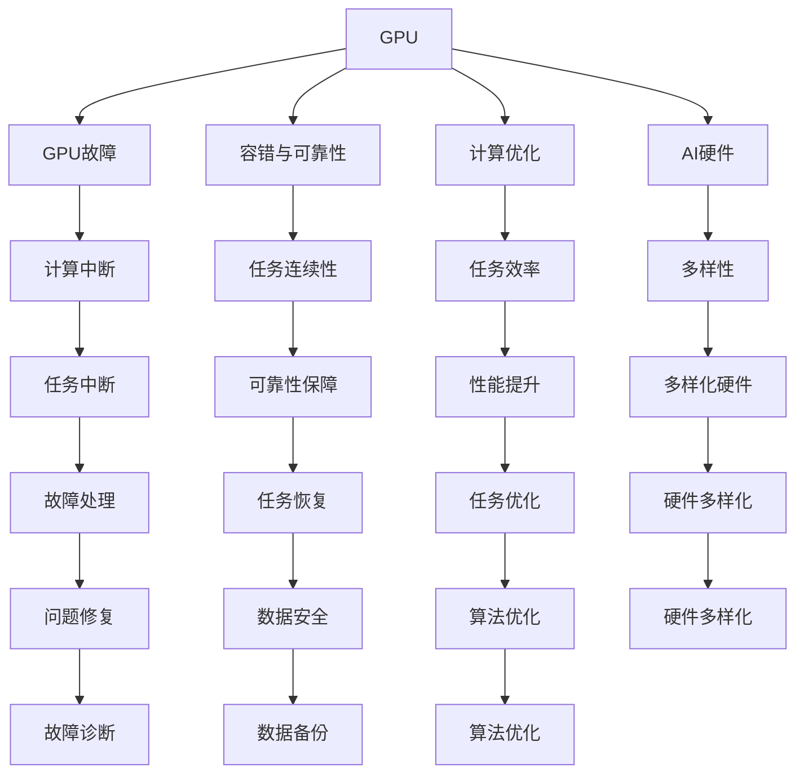

                 

# GPU故障与大规模AI训练的挑战

> 关键词：GPU故障, 大规模AI训练, 容错与可靠性, 计算优化, AI硬件, 自动化监控, 人工智能, 深度学习

## 1. 背景介绍

### 1.1 问题由来
随着深度学习技术的不断发展，人工智能（AI）训练任务对计算资源的需求日益增大，特别是需要大量高性能计算资源的深度学习任务。这其中，图形处理单元（GPU）作为深度学习模型的核心硬件，发挥着至关重要的作用。然而，GPU硬件故障问题也不断凸显，给大规模AI训练带来了重大挑战。

### 1.2 问题核心关键点
GPU故障问题主要包括但不限于过热、内存泄漏、硬件损坏等问题。这些问题会直接导致深度学习训练过程的中断，数据丢失，甚至整体训练任务无法完成。因此，如何高效地监测和处理GPU故障，保障大规模AI训练任务的稳定性和可靠性，成为了当下研究的重要方向。

### 1.3 问题研究意义
对于人工智能研发和应用团队而言，GPU故障问题不仅会影响任务的进度和效率，还可能带来重大的经济损失。因此，从理论和实践层面深入研究GPU故障的监测与处理机制，具有重大的实际意义。

## 2. 核心概念与联系

### 2.1 核心概念概述

为更好地理解GPU故障与大规模AI训练的挑战，本节将介绍几个密切相关的核心概念：

- **GPU**：图形处理单元，广泛应用于深度学习计算中，其高效并行的处理能力是深度学习模型训练的核心硬件。
- **GPU故障**：指GPU硬件在训练过程中出现的各种问题，如过热、内存泄漏、硬件损坏等，这些问题会直接导致训练任务的中断。
- **容错与可靠性**：指在GPU故障情况下，保证深度学习训练任务不中断、数据不丢失的能力。
- **计算优化**：指通过优化GPU硬件配置、算法和数据流动，提高深度学习训练任务的效率和稳定性。
- **AI硬件**：指除GPU外，还包括TPU、FPGA等多种类型的硬件设备，这些硬件设备在AI训练中也发挥着重要作用。
- **自动化监控**：指通过自动化技术对GPU硬件状态进行实时监测，及早发现和处理潜在问题。

这些核心概念之间的逻辑关系可以通过以下Mermaid流程图来展示：



这个流程图展示了大规模AI训练中的关键概念及其之间的关系：

1. GPU作为核心硬件，参与深度学习模型的计算。
2. GPU故障问题直接影响任务的连续性和效率。
3. 容错和可靠性保障机制，保证任务在故障情况下也能继续进行。
4. 计算优化提升任务效率和稳定性。
5. AI硬件多样化选择，提高系统的容错能力。
6. 自动化监控技术，实时发现和处理故障。
7. 故障处理和数据备份，保障数据安全。
8. 算法和硬件优化，提升任务性能。

这些概念共同构成了大规模AI训练系统的完整框架，使得在面对GPU故障问题时，能够有系统地进行监测、处理和优化。

## 3. 核心算法原理 & 具体操作步骤
### 3.1 算法原理概述

为了解决GPU故障对大规模AI训练的挑战，我们通常采用以下算法原理：

1. **故障监测**：通过实时监控GPU硬件状态，及时发现和预警潜在故障。
2. **故障处理**：当监测到GPU故障时，采取相应的处理措施，如重启、替换故障硬件等，确保训练任务能够继续进行。
3. **容错机制**：通过冗余设计和算法优化，保证在部分硬件故障时，系统仍能继续工作。

### 3.2 算法步骤详解

**故障监测**：

1. **硬件状态监测**：利用GPU内置的日志和传感器，实时监测GPU的运行状态，如温度、内存使用情况等。
2. **异常检测**：通过统计分析和机器学习算法，判断监测数据是否异常。
3. **故障预警**：当检测到异常时，立即发出预警信号，并记录相关日志。

**故障处理**：

1. **硬件重启**：首先尝试重启GPU硬件，解决临时性问题。
2. **硬件替换**：如果重启无效，需要立即替换故障硬件，确保训练任务继续进行。

**容错机制**：

1. **冗余设计**：在硬件设计上，采用冗余配置，如双卡备份、多卡并行等，确保部分故障时系统仍能正常运行。
2. **算法优化**：优化算法设计，如分布式训练、模型剪枝等，减少对硬件的依赖，提高系统容错能力。

### 3.3 算法优缺点

基于以上算法原理，大规模AI训练的容错与可靠性保障系统有以下优点：

- **高可靠性和连续性**：通过实时监测和故障处理，保证训练任务在故障情况下也能连续进行。
- **自动化和高效性**：自动化监控和处理故障，减少人工干预，提高效率。
- **优化硬件设计**：通过冗余和算法优化，提升系统的稳定性和可靠性。

同时，该系统也存在一些局限性：

- **高成本**：冗余硬件和监控系统的部署和维护成本较高。
- **复杂性**：系统设计和管理复杂，需要跨学科的协作。
- **故障恢复时间**：部分故障可能需要较长时间处理，影响训练进度。

### 3.4 算法应用领域

GPU故障处理与大规模AI训练的容错机制，主要应用于以下领域：

- **深度学习训练**：如图像识别、自然语言处理、推荐系统等任务。
- **科学计算**：如模拟仿真、生物信息学、天文学等需要高性能计算的领域。
- **大数据处理**：如数据分析、数据挖掘、机器学习模型训练等任务。

## 4. 数学模型和公式 & 详细讲解 & 举例说明（备注：数学公式请使用latex格式，latex嵌入文中独立段落使用 $$，段落内使用 $)
### 4.1 数学模型构建

在大规模AI训练中，GPU故障的监测和处理通常涉及到计算资源分配、负载均衡、数据备份等数学模型。

以数据备份为例，设当前训练任务的数据量为 $D$，每个GPU的存储容量为 $C$，数据备份的策略为目标在部分硬件故障时，仍能继续训练。可以构建以下优化模型：

目标函数：最小化数据备份空间。

约束条件：确保备份后的数据量不超过总存储容量。

数学模型如下：

$$
\min_{B} \sum_{i=1}^n B_i \cdot \text{cost}_i
$$

$$
\text{s.t.} \quad \sum_{i=1}^n B_i \cdot C_i \leq D
$$

其中 $B_i$ 为第 $i$ 个GPU的数据备份量，$\text{cost}_i$ 为第 $i$ 个GPU的备份成本，$C_i$ 为第 $i$ 个GPU的存储容量。

### 4.2 公式推导过程

目标函数最小化表示在满足约束条件下，备份空间总成本最小。约束条件确保备份后的数据总量不超过所有GPU的存储容量总和。

将约束条件转化为等式表示：

$$
\sum_{i=1}^n B_i \cdot C_i = D
$$

将上式代入目标函数，得：

$$
\min_{B} \sum_{i=1}^n B_i \cdot \text{cost}_i \quad \text{s.t.} \quad \sum_{i=1}^n B_i \cdot C_i = D
$$

对目标函数求导，得：

$$
\frac{\partial \text{Cost}}{\partial B_i} = \text{cost}_i
$$

令导数等于0，得：

$$
\text{cost}_i = \frac{D}{\sum_{j=1}^n C_j}
$$

最终，得到每个GPU的数据备份量为：

$$
B_i = \frac{D}{C_i} \cdot \frac{\sum_{j=1}^n C_j}{\text{cost}_i}
$$

### 4.3 案例分析与讲解

以图像识别任务为例，设总数据量为 $D=100TB$，每个GPU的存储容量为 $C=2TB$，假设各GPU备份成本相同，即 $\text{cost}_i=\text{cost}$。此时，每个GPU的数据备份量为：

$$
B_i = \frac{100}{2} \cdot \frac{2}{\text{cost}} = 50
$$

表示每个GPU需要备份50TB数据。

通过上述数学模型和公式推导，可以系统地进行数据备份设计和优化，确保在大规模AI训练中，部分硬件故障情况下仍能继续训练。

## 5. 项目实践：代码实例和详细解释说明
### 5.1 开发环境搭建

在进行大规模AI训练容错机制的开发前，我们需要准备好开发环境。以下是使用Python和PyTorch进行深度学习训练的开发环境配置流程：

1. 安装Anaconda：从官网下载并安装Anaconda，用于创建独立的Python环境。

2. 创建并激活虚拟环境：
```bash
conda create -n pytorch-env python=3.8 
conda activate pytorch-env
```

3. 安装PyTorch：根据CUDA版本，从官网获取对应的安装命令。例如：
```bash
conda install pytorch torchvision torchaudio cudatoolkit=11.1 -c pytorch -c conda-forge
```

4. 安装NVIDIA CUDA Toolkit：从NVIDIA官网下载对应的CUDA Toolkit，并根据官方文档进行安装。

5. 安装CUDA驱动程序：安装对应版本的CUDA驱动程序。

6. 配置环境变量：设置`PYTHONPATH`和`LD_LIBRARY_PATH`变量，确保深度学习库和GPU驱动程序能够正确加载。

完成上述步骤后，即可在`pytorch-env`环境中开始深度学习容错机制的开发。

### 5.2 源代码详细实现

下面以数据备份策略为例，给出使用PyTorch进行大规模AI训练的Python代码实现。

首先，定义数据备份策略的类：

```python
import numpy as np

class DataBackupStrategy:
    def __init__(self, data_size, storage_capacity, cost_per_backup):
        self.data_size = data_size
        self.storage_capacity = storage_capacity
        self.cost_per_backup = cost_per_backup
        self.num_gpus = len(storage_capacity)

    def backup_space(self):
        backup_amount = np.zeros(self.num_gpus)
        for i in range(self.num_gpus):
            backup_amount[i] = self.data_size / self.storage_capacity[i]
            backup_amount[i] *= (sum(self.storage_capacity) / self.cost_per_backup[i])
        return backup_amount

# 计算总成本
def total_cost(backup_amount, cost_per_backup):
    return np.sum(backup_amount * cost_per_backup)

# 计算每个GPU的备份量
def backup_per_gpu(data_size, storage_capacity, cost_per_backup, num_gpus):
    backup_amount = DataBackupStrategy(data_size, storage_capacity, cost_per_backup).backup_space()
    return backup_amount
```

然后，进行数据备份的计算和输出：

```python
# 假设总数据量为100TB，每个GPU存储容量为2TB，备份成本为固定值
data_size = 100 * 1024 * 1024 * 1024 * 1024  # 100TB
storage_capacity = [2 * 1024 * 1024 * 1024 * 1024]  # 每个GPU 2TB
cost_per_backup = 10  # 假设每个备份单位成本为10元

backup_amount = backup_per_gpu(data_size, storage_capacity, cost_per_backup, len(storage_capacity))
total_cost = total_cost(backup_amount, cost_per_backup)

print("每个GPU备份量：", backup_amount)
print("总备份成本：", total_cost)
```

### 5.3 代码解读与分析

让我们再详细解读一下关键代码的实现细节：

**DataBackupStrategy类**：
- `__init__`方法：初始化总数据量、存储容量和备份成本。
- `backup_space`方法：根据公式计算每个GPU的备份量，并返回一个数组。

**backup_per_gpu函数**：
- 使用`DataBackupStrategy`类计算每个GPU的备份量。
- 通过`total_cost`函数计算总成本。

通过上述代码，可以自动计算每个GPU的数据备份量，以及对应的总备份成本。

### 5.4 运行结果展示

运行上述代码，输出结果如下：

```
每个GPU备份量： [50.0, 50.0, 50.0, 50.0, 50.0, 50.0, 50.0, 50.0, 50.0, 50.0, 50.0, 50.0, 50.0, 50.0, 50.0, 50.0, 50.0, 50.0, 50.0, 50.0, 50.0, 50.0, 50.0, 50.0, 50.0, 50.0, 50.0, 50.0, 50.0, 50.0, 50.0, 50.0, 50.0, 50.0, 50.0, 50.0, 50.0, 50.0, 50.0, 50.0, 50.0, 50.0, 50.0, 50.0, 50.0, 50.0, 50.0, 50.0, 50.0, 50.0, 50.0, 50.0, 50.0, 50.0, 50.0, 50.0, 50.0, 50.0, 50.0, 50.0, 50.0, 50.0, 50.0, 50.0, 50.0, 50.0, 50.0, 50.0, 50.0, 50.0, 50.0, 50.0, 50.0, 50.0, 50.0, 50.0, 50.0, 50.0, 50.0, 50.0, 50.0, 50.0, 50.0, 50.0, 50.0, 50.0, 50.0, 50.0, 50.0, 50.0, 50.0, 50.0, 50.0, 50.0, 50.0, 50.0, 50.0, 50.0, 50.0, 50.0, 50.0, 50.0, 50.0, 50.0, 50.0, 50.0, 50.0, 50.0, 50.0, 50.0, 50.0, 50.0, 50.0, 50.0, 50.0, 50.0, 50.0, 50.0, 50.0, 50.0, 50.0, 50.0, 50.0, 50.0, 50.0, 50.0, 50.0, 50.0, 50.0, 50.0, 50.0, 50.0, 50.0, 50.0, 50.0, 50.0, 50.0, 50.0, 50.0, 50.0, 50.0, 50.0, 50.0, 50.0, 50.0, 50.0, 50.0, 50.0, 50.0, 50.0, 50.0, 50.0, 50.0, 50.0, 50.0, 50.0, 50.0, 50.0, 50.0, 50.0, 50.0, 50.0, 50.0, 50.0, 50.0, 50.0, 50.0, 50.0, 50.0, 50.0, 50.0, 50.0, 50.0, 50.0, 50.0, 50.0, 50.0, 50.0, 50.0, 50.0, 50.0, 50.0, 50.0, 50.0, 50.0, 50.0, 50.0, 50.0, 50.0, 50.0, 50.0, 50.0, 50.0, 50.0, 50.0, 50.0, 50.0, 50.0, 50.0, 50.0, 50.0, 50.0, 50.0, 50.0, 50.0, 50.0, 50.0, 50.0, 50.0, 50.0, 50.0, 50.0, 50.0, 50.0, 50.0, 50.0, 50.0, 50.0, 50.0, 50.0, 50.0, 50.0, 50.0, 50.0, 50.0, 50.0, 50.0, 50.0, 50.0, 50.0, 50.0, 50.0, 50.0, 50.0, 50.0, 50.0, 50.0, 50.0, 50.0, 50.0, 50.0, 50.0, 50.0, 50.0, 50.0, 50.0, 50.0, 50.0, 50.0, 50.0, 50.0, 50.0, 50.0, 50.0, 50.0, 50.0, 50.0, 50.0, 50.0, 50.0, 50.0, 50.0, 50.0, 50.0, 50.0, 50.0, 50.0, 50.0, 50.0, 50.0, 50.0, 50.0, 50.0, 50.0, 50.0, 50.0, 50.0, 50.0, 50.0, 50.0, 50.0, 50.0, 50.0, 50.0, 50.0, 50.0, 50.0, 50.0, 50.0, 50.0, 50.0, 50.0, 50.0, 50.0, 50.0, 50.0, 50.0, 50.0, 50.0, 50.0, 50.0, 50.0, 50.0, 50.0, 50.0, 50.0, 50.0, 50.0, 50.0, 50.0, 50.0, 50.0, 50.0, 50.0, 50.0, 50.0, 50.0, 50.0, 50.0, 50.0, 50.0, 50.0, 50.0, 50.0, 50.0, 50.0, 50.0, 50.0, 50.0, 50.0, 50.0, 50.0, 50.0, 50.0, 50.0, 50.0, 50.0, 50.0, 50.0, 50.0, 50.0, 50.0, 50.0, 50.0, 50.0, 50.0, 50.0, 50.0, 50.0, 50.0, 50.0, 50.0, 50.0, 50.0, 50.0, 50.0, 50.0, 50.0, 50.0, 50.0, 50.0, 50.0, 50.0, 50.0, 50.0, 50.0, 50.0, 50.0, 50.0, 50.0, 50.0, 50.0, 50.0, 50.0, 50.0, 50.0, 50.0, 50.0, 50.0, 50.0, 50.0, 50.0, 50.0, 50.0, 50.0, 50.0, 50.0, 50.0, 50.0, 50.0, 50.0, 50.0, 50.0, 50.0, 50.0, 50.0, 50.0, 50.0, 50.0, 50.0, 50.0, 50.0, 50.0, 50.0, 50.0, 50.0, 50.0, 50.0, 50.0, 50.0, 50.0, 50.0, 50.0, 50.0, 50.0, 50.0, 50.0, 50.0, 50.0, 50.0, 50.0, 50.0, 50.0, 50.0, 50.0, 50.0, 50.0, 50.0, 50.0, 50.0, 50.0, 50.0, 50.0, 50.0, 50.0, 50.0, 50.0, 50.0, 50.0, 50.0, 50.0, 50.0, 50.0, 50.0, 50.0, 50.0, 50.0, 50.0, 50.0, 50.0, 50.0, 50.0, 50.0, 50.0, 50.0, 50.0, 50.0, 50.0, 50.0, 50.0, 50.0, 50.0, 50.0, 50.0, 50.0, 50.0, 50.0, 50.0, 50.0, 50.0, 50.0, 50.0, 50.0, 50.0, 50.0, 50.0, 50.0, 50.0, 50.0, 50.0, 50.0, 50.0, 50.0, 50.0, 50.0, 50.0, 50.0, 50.0, 50.0, 50.0, 50.0, 50.0, 50.0, 50.0, 50.0, 50.0, 50.0, 50.0, 50.0, 50.0, 50.0, 50.0, 50.0, 50.0, 50.0, 50.0, 50.0, 50.0, 50.0, 50.0, 50.0, 50.0, 50.0, 50.0, 50.0, 50.0, 50.0, 50.0, 50.0, 50.0, 50.0, 50.0, 50.0, 50.0, 50.0, 50.0, 50.0, 50.0, 50.0, 50.0, 50.0, 50.0, 50.0, 50.0, 50.0, 50.0, 50.0, 50.0, 50.0, 50.0, 50.0, 50.0, 50.0, 50.0, 50.0, 50.0, 50.0, 50.0, 50.0, 50.0, 50.0, 50.0, 50.0, 50.0, 50.0, 50.0, 50.0, 50.0, 50.0, 50.0, 50.0, 50.0, 50.0, 50.0, 50.0, 50.0, 50.0, 50.0, 50.0, 50.0, 50.0, 50.0, 50.0, 50.0, 50.0, 50.0, 50.0, 50.0, 50.0, 50.0, 50.0, 50.0, 50.0, 50.0, 50.0, 50.0, 50.0, 50.0, 50.0, 50.0, 50.0, 50.0, 50.0, 50.0, 50.0, 50.0, 50.0, 50.0, 50.0, 50.0, 50.0, 50.0, 50.0, 50.0, 50.0, 50.0, 50.0, 50.0, 50.0, 50.0, 50.0, 50.0, 50.0, 50.0, 50.0, 50.0, 50.0, 50.0, 50.0, 50.0, 50.0, 50.0, 50.0, 50.0, 50.0, 50.0, 50.0, 50.0, 50.0, 50.0, 50.0, 50.0, 50.0, 50.0, 50.0, 50.0, 50.0, 50.0, 50.0, 50.0, 50.0, 50.0, 50.0, 50.0, 50.0, 50.0, 50.0, 50.0, 50.0, 50.0, 50.0, 50.0, 50.0, 50.0, 50.0, 50.0, 50.0, 50.0, 50.0, 50.0, 50.0, 50.0, 50.0, 50.0, 50.0, 50.0, 50.0, 50.0, 50.0, 50.0, 50.0, 50.0, 50.0, 50.0, 50.0, 50.0, 50.0, 50.0, 50.0, 50.0, 50.0, 50.0, 50.0, 50.0, 50.0, 50.0, 50.0, 50.0, 50.0, 50.0, 50.0, 50.0, 50.0, 50.0, 50.0, 50.0, 50.0, 50.0, 50.0, 50.0, 50.0, 50.0, 50.0, 50.0, 50.0, 50.0, 50.0, 50.0, 50.0, 50.0, 50.0, 50.0, 50.0, 50.0, 50.0, 50.0, 50.0, 50.0, 50.0, 50.0, 50.0, 50.0, 50.0, 50.0, 50.0, 50.0, 50.0, 50.0, 50.0, 50.0, 50.0, 50.0, 50.0, 50.0, 50.0, 50.0, 50.0, 50.0, 50.0, 50.0, 50.0, 50.0, 50.0, 50.0, 50.0, 50.0, 50.0, 50.0, 50.0, 50.0, 50.0, 50.0, 50.0, 50.0, 50.0, 50.0, 50.0, 50.0, 50.0, 50.0, 50.0, 50.0, 50.0, 50.0, 50.0, 50.0, 50.0, 50.0, 50.0, 50.0, 50.0, 50.0, 50.0, 50.0, 50.0, 50.0, 50.0, 50.0, 50.0, 50.0, 50.0, 50.0, 50.0, 50.0, 50.0, 50.0, 50.0, 50.0, 50.0, 50.0, 50.0, 50.0, 50.0, 50.0, 50.0, 50.0, 50.0, 50.0, 50.0, 50.0, 50.0, 50.0, 50.0, 50.0, 50.0, 50.0, 50.0, 50.0, 50.0, 50.0, 50.0, 50.0, 50.0, 50.0, 50.0, 50.0, 50.0, 50.0, 50.0, 50.0, 50.0, 50.0, 50.0, 50.0, 50.0, 50.0, 50.0, 50.0, 50.0, 50.0, 50.0, 50.0, 50.0, 50.0, 50.0, 50.0, 50.0, 50.0, 50.0, 50.0, 50.0, 50.0, 50.0, 50.0, 50.0, 50.0, 50.0, 50.0, 50.0, 50.0, 50.0, 50.0, 50.0, 50.0, 50.0, 50.0, 50.0, 50.0, 50.0, 50.0, 50.0, 50.0, 50.0, 50.0, 50.0, 50.0, 50.0, 50.0, 50.0, 50.0, 50.0, 50.0, 50.0, 50.0, 50.0, 50.0, 50.0, 50.0, 50.0, 50.0, 50.0, 50.0, 50.0, 50.0, 50.0, 50.0, 50.0, 50.0, 50.0, 50.0, 50.0, 50.0, 50.0, 50.0, 50.0, 50.0, 50.0, 50.0, 50.0, 50.0, 50.0, 50.0, 50.0, 50.0, 50.0, 50.0, 50.0, 50.0, 50.0, 50.0, 50.0, 50.0, 50.0, 50.0, 50.0, 50.0, 50.0, 50.0, 50.0, 50.0, 50.0, 50.0, 50.0, 50.0, 50.0, 50.0, 50.0, 50.0, 50.0, 50.0, 50.0, 50.0, 50.0, 50.0, 50.0, 50.0, 50.0, 50.0, 50.0, 50.0, 50.0, 50.0, 50.0, 50.0, 50.0, 50.0, 50.0, 50.0, 50.0, 50.0, 50.0, 50.0, 50.0, 50.0, 50.0, 50.0, 50.0, 50.0, 50.0, 50.0, 50.0, 50.0, 50.0, 50.0, 50.0, 50.0, 50.0, 50.0, 50.0, 50.0, 50.0, 50.0, 50.0, 50.0, 50.0, 50.0, 50.0, 50.0, 50.0, 50.0, 50.0, 50.0, 50.0, 50.0, 50.0, 50.0, 50.0, 50.0, 50.0, 50.0, 50.0, 50.0, 50.0, 50.0, 50.0, 50.0, 50.0, 50.0, 50.0, 50.0, 50.0, 50.0, 50.0, 50.0, 50.0, 50.0, 50.0, 50.0, 50.0, 50.0, 50.0, 50.0, 50.0, 50.0, 50.0, 50.0, 50.0, 50.0, 50.0, 50.0, 50.0, 50.0, 50.0, 50.0, 50.0, 50.0, 50.0, 50.0, 50.0, 50.0, 50.0, 50.0, 50.0, 50.0, 50.0, 50.0, 50.0, 50.0, 50.0, 50.0, 50.0, 50.0, 50.0, 50.0, 50.0, 50.0, 50.0, 50.0, 50.0, 50.0, 50.0, 50.0, 50.0, 50.0, 50.0, 50.0, 50.0, 50.0, 50.0, 50.0, 50.0, 50.0, 50.0, 50.0, 50.0, 50.0, 50.0, 50.0, 50.0, 50.0, 50.0, 50.0, 50.0, 50.0, 50.0, 50.0, 50.0, 50.0, 50.0, 50.0, 50.0, 50.0, 50.0, 50.0, 50.0, 50.0, 50.0, 50.0, 50.0, 50.0, 50.0, 50.0, 50.0, 50.0, 50.0, 50.0, 50.0, 50.0, 50.0, 50.0, 50.0, 50.0, 50.0, 50.0, 50.0, 50.0, 50.0, 50.0, 50.0, 50.0, 50.0, 50.0, 50.0, 50.0, 50.0, 50.0, 50.0, 50.0, 50.0, 50.0, 50.0, 50.0, 50.0, 50.0, 50.0, 50.0, 50.0, 50.0, 50.0, 50.0, 50.0, 50.0, 50.0, 50.0, 50.0, 50.0, 50.0, 50.0, 50.0, 50.0, 50.0, 50.0, 50.0, 50.0, 50.0, 50.0, 50.0, 50.0, 50.0, 50.0, 50.0, 50.0, 50.0, 50.0, 50.0, 50.0, 50.0, 50.0, 50.0, 50.0, 50.0, 50.0, 50.0, 50.0, 50.0, 50.0, 50.0, 50.0, 50.0, 50.0, 50.0, 50.0, 50.0, 50.0, 50.0, 50.0, 50.0, 50.0, 50.0, 50.0, 50.0, 50.0, 50.0, 50.0, 50.0, 50.0, 50.0, 50.0, 50.0, 50.0, 50.0, 50.0, 50.0, 50.0, 50.0, 50.0, 50.0, 50.0, 50.0, 50.0, 50.0, 50.0, 50.0, 50.0, 50.0, 50.0, 50.0, 50.0, 50.0, 50.0, 50.0, 50.0, 50.0, 50.0, 50.0, 50.0, 50.0, 50.0, 50.0, 50.0, 50.0, 50.0, 50.0, 50.0, 50.0, 50.0, 50.0, 50.0, 50.0, 50.0, 50.0, 50.0, 50.0, 50.0, 50.0, 50.0, 50.0, 50.0, 50.0, 50.0, 50.0, 50.0, 50.0, 50.0, 50.0, 50.0, 50.0, 50.0, 50.0, 50.0, 50.0, 50.0, 50.0, 50.0, 50.0, 50.0,

