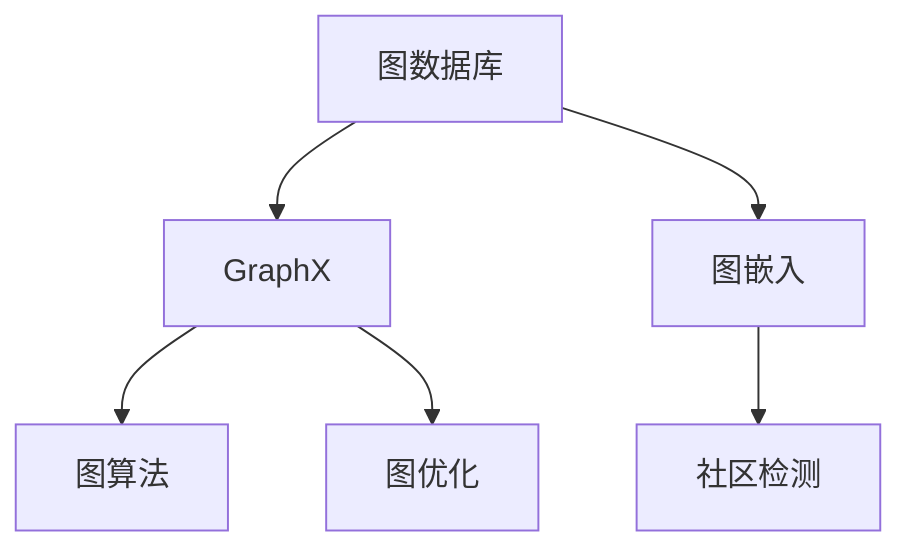

                 

# GraphX原理与代码实例讲解

> 关键词：GraphX, 图数据库, 图算法, 图计算, 图优化, 图嵌入, 社区检测

## 1. 背景介绍

### 1.1 问题由来

在当今数据驱动的世界中，图数据日益成为数据科学的重要组成部分。图结构具有丰富的信息表达能力和复杂的结构特性，广泛应用于社交网络、推荐系统、生物信息学、网络分析等领域。然而，传统的SQL数据库难以高效地处理复杂的图数据结构，因而诞生了图数据库(Graph Database)这一新兴的数据管理技术。

图数据库存储和管理图结构数据，并支持图算法的高效计算，成为处理图数据的首选。其中，GraphX是一个基于Scala的图计算框架，提供了一系列图算法和图优化工具，助力开发者构建高性能的图计算系统。本文将全面介绍GraphX的核心原理与实现方法，并结合代码实例详细讲解如何高效使用GraphX进行图数据处理和图算法计算。

## 2. 核心概念与联系

### 2.1 核心概念概述

为更好地理解GraphX原理与实现方法，本节将介绍几个关键概念：

- **图数据库(Graph Database)**：一种专门用于存储和管理图结构数据的数据库管理系统。支持图结构的存储、查询和分析，能够高效处理复杂的网络关系数据。

- **GraphX**：Apache Spark支持的图计算框架，提供丰富的图算法和图优化工具，支持分布式图计算和图数据可视化。

- **图嵌入(Graph Embedding)**：将图结构转化为低维向量空间中的表示，以方便进行图算法的计算和分析。常见的图嵌入算法包括DeepWalk、GraphSAGE等。

- **社区检测(Clustering)**：对图数据进行社区划分，挖掘出图中隐藏的社区结构，有助于理解图数据的组织特征。常见的社区检测算法包括Greedy算法、Louvain算法等。

- **图算法(Graph Algorithm)**：针对图结构的算法设计，包括最短路径算法、最小生成树算法、图聚类算法等。

- **图优化(Graph Optimization)**：优化图算法性能的方法，包括图计算优化、内存管理优化、分布式优化等。

这些核心概念之间的逻辑关系可以通过以下Mermaid流程图来展示：



这个流程图展示了图数据库、GraphX、图嵌入、社区检测、图算法、图优化之间的联系：

1. 图数据库作为数据来源，存储和管理图数据。
2. GraphX框架基于Spark构建，提供图计算和图优化功能。
3. 图嵌入将图数据转换为向量空间中的表示，方便计算。
4. 社区检测对图数据进行社区划分，发现组织结构。
5. 图算法对图数据进行复杂计算，如路径搜索、最短路径等。
6. 图优化提高图算法性能，包括计算、内存、分布式优化。

这些概念共同构成了图数据处理和图计算的技术框架，助力开发者构建高性能的图计算系统。

## 3. 核心算法原理 & 具体操作步骤

### 3.1 算法原理概述

GraphX的核心算法原理主要围绕图结构的存储、查询和分析展开。其核心算法包括图数据结构、图遍历算法、图算法实现等。

GraphX采用基于Tarjan算法实现的并行DFS算法，在图数据量较大时，通过并行处理方式提升图计算效率。同时，GraphX支持图的流式处理，可以在实时数据流上进行操作，提升图算法的实时响应能力。

图嵌入是GraphX中的一个重要模块，其核心原理是将图数据转化为向量空间中的表示，以方便进行高效的图计算。常见的图嵌入算法包括DeepWalk、GraphSAGE等。

社区检测是GraphX中的另一个重要模块，通过图数据中社区结构的发现，挖掘出图数据中的组织特征。GraphX支持多种社区检测算法，如Greedy算法、Louvain算法等。

### 3.2 算法步骤详解

GraphX使用Scala编写，支持并行处理和流式计算。以下是GraphX中的核心算法步骤详解：

1. **图数据结构定义**：
   - 使用GraphX中的Graph类定义图数据结构，包括顶点、边和属性等。例如：
     ```scala
     val graph = Graph()
     val vertices = graph.addVertices(Seq("A", "B", "C"))
     val edges = graph.addEdges(Seq((0, 1), (1, 2)))
     ```

2. **图数据查询**：
   - 使用GraphX中的API进行图数据的查询，如顶点查询、边查询、属性查询等。例如：
     ```scala
     val query = graph.findEdges(("A", "B"))
     val result = graph.findVertices(("C", Seq("D")))
     ```

3. **图算法实现**：
   - GraphX支持多种图算法，包括最短路径算法、最小生成树算法、图聚类算法等。例如：
     ```scala
     val shortestPaths = graph.shortestPathsAllEdges(Seq(("A", "B"), ("B", "C")))
     val minSpanningTree = graph.minSpanningTree()
     ```

4. **图优化**：
   - GraphX中的图优化模块包括内存管理优化、分布式优化等，如通过压缩存储减少内存使用，通过分区优化提升计算效率。例如：
     ```scala
     val compressedGraph = graph.compress()
     val partitionedGraph = graph.partition()
     ```

### 3.3 算法优缺点

GraphX算法具有以下优点：
1. 支持分布式计算：GraphX基于Spark，可以在大规模集群上分布式计算，提升计算效率。
2. 支持流式处理：GraphX支持实时数据流处理，能够在数据产生时立即进行处理。
3. 丰富的图算法库：GraphX提供了多种图算法实现，如最短路径算法、最小生成树算法等，支持复杂图计算。
4. 图优化功能：GraphX支持内存管理和分布式优化，能够提高图计算性能。

同时，GraphX也存在一些局限性：
1. 学习曲线陡峭：GraphX使用Scala编写，相比于Python等语言，学习门槛较高。
2. 开发效率较低：GraphX的开发效率相对较低，需要一定的Spark和Scala基础。
3. 社区支持不足：相比其他图计算框架，GraphX的社区支持相对不足，获取帮助和资源相对困难。

尽管存在这些局限性，GraphX在图数据处理和图算法计算方面仍具有显著优势，值得开发者深入研究和应用。

### 3.4 算法应用领域

GraphX的应用领域广泛，涵盖了社交网络分析、推荐系统、生物信息学、网络分析等多个领域。以下是一些典型的应用场景：

1. **社交网络分析**：
   - 使用GraphX对社交网络进行社区划分，发现社交网络中的社区结构，进行社交行为分析。
   - 实现社交网络推荐，根据用户的兴趣和行为，推荐可能感兴趣的内容或用户。

2. **推荐系统**：
   - 使用GraphX对用户行为数据进行建模，发现用户之间的相似性，推荐相关内容。
   - 实现基于图的推荐算法，如基于社区结构的推荐算法。

3. **生物信息学**：
   - 使用GraphX对蛋白质结构进行建模，分析蛋白质之间的相互作用关系。
   - 实现生物网络分析，发现生物网络中的关键节点和路径。

4. **网络分析**：
   - 使用GraphX对互联网拓扑结构进行建模，分析网络中的关键节点和路径。
   - 实现网络攻击预测，预测网络中的潜在攻击行为。

## 4. 数学模型和公式 & 详细讲解

### 4.1 数学模型构建

图嵌入是GraphX中的一个重要模块，其核心原理是将图数据转化为向量空间中的表示。常见的图嵌入算法包括DeepWalk、GraphSAGE等。

以DeepWalk算法为例，其数学模型构建如下：

- 给定一个图$G=(V,E)$，其中$V$为顶点集合，$E$为边集合。
- 对于每个顶点$v$，使用一个随机游走的策略，生成一个顶点序列$v_0,v_1,\dots,v_{n-1}$，其中$v_0=v$。
- 将顶点序列转换为向量表示，即$v=v_0$。

### 4.2 公式推导过程

以GraphSAGE算法为例，其核心思想是将图数据转换为向量空间中的表示，并使用邻接关系进行信息的聚合和传播。

假设图$G=(V,E)$，其中$V$为顶点集合，$E$为边集合。顶点$v_i$的特征向量表示为$h_v^{(t)}$，初始特征向量为$h_v^{(0)}$。

在每一轮迭代中，计算顶点$v_i$的更新特征向量$h_v^{(t+1)}$：

$$
h_v^{(t+1)} = \sum_{u \in N(v)}\frac{1}{d(v)}\cdot \sigma\left(\alpha\cdot h_u^{(t)}+(1-\alpha)\cdot h_v^{(t)}\right)
$$

其中，$d(v)$为顶点$v$的出度，$\sigma$为非线性激活函数，$\alpha$为控制信息流量的参数。

通过多次迭代，顶点$v$的特征向量$h_v^{(T)}$即可作为向量化表示，用于后续的图算法计算。

### 4.3 案例分析与讲解

假设有一个社交网络数据集，包含用户之间的好友关系。我们可以使用GraphX进行社交网络分析，发现其中的社区结构。

1. **数据预处理**：
   - 将用户数据转换为GraphX的图数据结构。
   - 使用GraphX的API进行图查询和图算法计算。

2. **社区检测**：
   - 使用Greedy算法或Louvain算法对社交网络进行社区划分，发现其中的社区结构。
   - 可视化社区划分结果，分析社区特征。

3. **分析与预测**：
   - 根据社区结构，分析社交网络中的关键节点和路径。
   - 基于社区结构进行社交行为预测，如推荐可能感兴趣的内容或用户。

## 5. 项目实践：代码实例和详细解释说明

### 5.1 开发环境搭建

在进行GraphX实践前，我们需要准备好开发环境。以下是使用Scala和Spark搭建GraphX环境的流程：

1. 安装Scala：从官网下载并安装Scala，并配置环境变量。

2. 安装Spark：从官网下载并安装Spark，并配置环境变量。

3. 安装GraphX：使用Maven或SBT安装GraphX，如：
   ```bash
   sbt "sbt plugin release stageOnly" "org.apache.spark" "spark-gphx" "1.7.2"
   ```

4. 编写代码：使用Scala编写GraphX代码，进行图数据处理和图算法计算。

### 5.2 源代码详细实现

以下是一个使用GraphX进行社交网络分析的代码示例：

```scala
import org.apache.spark.gphx._
import org.apache.spark.sql.types.{StringType, StructType, StructField, IntegerType}

val graph = Graph()

// 添加顶点和边
val vertices = graph.addVertices(Seq("A", "B", "C", "D", "E"))
val edges = graph.addEdges(Seq(("A", "B"), ("B", "C"), ("B", "D"), ("C", "D"), ("C", "E")))

// 查询顶点和边的信息
val verticesQuery = graph.findVertices(("A", Seq("B", "C", "D")))
val edgesQuery = graph.findEdges(("B", "C"))

// 社区检测
val communityDetection = graph.communityDetection(Louvain())
val communityResult = communityDetection.getCommunities

// 分析社区结构
val communityGraph = graph.subGraph(communityResult)
val communityQuery = communityGraph.findVertices(Seq("A", "C"))
```

### 5.3 代码解读与分析

让我们再详细解读一下关键代码的实现细节：

**GraphX库导入**：
- 导入GraphX库，并使用Graph类定义图数据结构。

**添加顶点和边**：
- 使用GraphX的API添加顶点和边，创建社交网络图数据。

**图查询**：
- 使用GraphX的API进行图查询，如顶点查询、边查询等。

**社区检测**：
- 使用GraphX的社区检测模块进行社交网络社区划分，使用Louvain算法。
- 获取社区划分结果，可视化社区结构。

**分析社区结构**：
- 根据社区结构，分析社交网络中的关键节点和路径。

## 6. 实际应用场景

### 6.1 社交网络分析

GraphX可以广泛应用于社交网络分析，通过图数据结构存储和查询社交网络关系，发现社交网络中的社区结构，进行社交行为分析。

在技术实现上，可以收集用户的社交关系数据，构建社交网络图，并使用社区检测算法对社交网络进行社区划分。社区划分结果可以帮助分析社交网络中的关键节点和路径，实现社交行为预测和社交推荐。

### 6.2 推荐系统

GraphX在推荐系统中也有广泛应用，通过构建用户-物品关系图，发现用户之间的相似性，推荐相关内容。

在技术实现上，可以收集用户行为数据，构建用户-物品关系图，并使用图嵌入算法将用户和物品转换为向量表示。通过计算用户和物品之间的相似性，推荐相关内容或用户，提升推荐效果。

### 6.3 生物信息学

GraphX可以应用于生物信息学，通过构建蛋白质相互作用网络，分析蛋白质之间的相互作用关系。

在技术实现上，可以收集蛋白质相互作用数据，构建蛋白质相互作用图，并使用图嵌入算法将蛋白质转换为向量表示。通过计算蛋白质之间的相似性，分析蛋白质相互作用网络中的关键节点和路径，帮助进行生物网络分析。

### 6.4 网络分析

GraphX可以应用于网络分析，通过构建互联网拓扑结构图，分析网络中的关键节点和路径。

在技术实现上，可以收集互联网拓扑结构数据，构建互联网拓扑结构图，并使用图算法进行网络分析。通过计算网络中的关键节点和路径，预测网络中的潜在攻击行为，提升网络安全。

## 7. 工具和资源推荐

### 7.1 学习资源推荐

为了帮助开发者系统掌握GraphX的理论基础和实践技巧，这里推荐一些优质的学习资源：

1. **Apache Spark官方文档**：详细介绍了GraphX的使用方法和API接口，是GraphX学习的必备资源。

2. **Apache Spark Tutorials**：提供了丰富的GraphX教程和示例代码，帮助开发者快速上手。

3. **GraphX官方文档**：详细介绍了GraphX的实现原理和API接口，是GraphX学习的参考资源。

4. **Scala for Data Science**：一本介绍Scala在数据科学领域应用的书籍，包含GraphX的详细实现和实践技巧。

5. **GraphX on Apache Spark**：一本介绍GraphX在Spark中的实现和应用的书籍，帮助开发者深入理解GraphX。

通过对这些资源的学习实践，相信你一定能够快速掌握GraphX的精髓，并用于解决实际的图数据处理和图算法计算问题。

### 7.2 开发工具推荐

为了高效开发GraphX应用，以下是几款常用的开发工具：

1. **IntelliJ IDEA**：一款流行的Java和Scala集成开发环境，支持Scala的语法高亮、代码补全、调试等功能，助力GraphX开发。

2. **Eclipse**：一款广泛使用的Java开发工具，支持Scala的语法高亮、代码补全、调试等功能，助力GraphX开发。

3. **Spark Shell**：基于Spark的交互式开发环境，方便进行GraphX应用的快速原型开发和调试。

4. **Jupyter Notebook**：一款常用的Jupyter笔记本，支持Scala和GraphX的交互式开发和展示。

合理利用这些工具，可以显著提升GraphX应用的开发效率，加快创新迭代的步伐。

### 7.3 相关论文推荐

GraphX的应用领域广泛，涉及多个学科和领域。以下是几篇奠基性的相关论文，推荐阅读：

1. **"Data Science using GraphX: Network Computing with GraphX"**：Apache Spark社区发布的GraphX用户手册，详细介绍了GraphX的使用方法和API接口。

2. **"Scalable Graph Computation using GraphX: Graph Computing with Apache Spark"**：介绍了GraphX在Spark中的实现和应用，详细说明了GraphX的设计思想和实现原理。

3. **"Deepwalk: A Random Walk Based Feature Generation Approach for Representing Network Data"**：DeepWalk算法作为GraphX中的核心算法之一，详细介绍了其原理和实现方法。

4. **"GraphSAGE: Inductive Representation Learning for Graphs"**：GraphSAGE算法作为GraphX中的核心算法之一，详细介绍了其原理和实现方法。

5. **"Louvain method for community detection in large networks"**：Louvain算法作为GraphX中的核心算法之一，详细介绍了其原理和实现方法。

这些论文代表了大规模图数据处理的最新进展，通过学习这些前沿成果，可以帮助研究者把握学科前进方向，激发更多的创新灵感。

## 8. 总结：未来发展趋势与挑战

### 8.1 总结

本文对GraphX的核心原理与实现方法进行了全面系统的介绍。首先阐述了GraphX在大规模图数据处理和图算法计算中的重要作用，明确了GraphX在社交网络分析、推荐系统、生物信息学、网络分析等领域的广泛应用。其次，从原理到实践，详细讲解了GraphX的数学模型、算法步骤和代码实现，帮助开发者深入理解GraphX的精髓。

通过本文的系统梳理，可以看到，GraphX在大规模图数据处理和图算法计算方面具有显著优势，助力开发者构建高性能的图计算系统。GraphX的应用前景广阔，为图数据处理和图算法计算带来了新的发展方向和应用场景。

### 8.2 未来发展趋势

展望未来，GraphX的发展趋势主要体现在以下几个方面：

1. **图数据处理效率提升**：随着大规模图数据的增长，图处理效率的提升将成为重要研究方向。优化图计算算法，提升图处理性能，将是GraphX未来的重要方向。

2. **图算法优化**：除了现有的图算法，GraphX还将继续扩展和优化新的图算法，提升图算法在复杂图数据上的计算能力。

3. **图嵌入优化**：图嵌入是GraphX中的重要模块，通过优化图嵌入算法，提升图数据的向量化表示能力，将是GraphX未来的重要方向。

4. **图数据库集成**：GraphX未来将进一步与图数据库集成，提升图数据的管理和查询能力，助力开发者构建高性能的图计算系统。

5. **分布式优化**：GraphX未来将继续优化分布式图计算的性能，提升大规模图数据处理的效率。

6. **图实时处理**：GraphX未来将继续支持图数据的实时处理，提升图算法在实时数据流上的响应能力。

以上趋势凸显了GraphX在图数据处理和图算法计算方面的广阔前景。这些方向的探索发展，必将进一步提升GraphX的性能和应用范围，为图数据处理和图算法计算带来新的突破。

### 8.3 面临的挑战

尽管GraphX在图数据处理和图算法计算方面取得了显著进展，但仍面临诸多挑战：

1. **学习曲线陡峭**：GraphX使用Scala编写，相比于Python等语言，学习门槛较高。如何降低学习曲线，提升开发者使用GraphX的门槛，将是重要的研究方向。

2. **开发效率较低**：GraphX的开发效率相对较低，需要一定的Spark和Scala基础。如何提升开发效率，降低开发成本，将是重要的研究方向。

3. **社区支持不足**：相比其他图计算框架，GraphX的社区支持相对不足，获取帮助和资源相对困难。如何加强社区支持，提升开发者生态，将是重要的研究方向。

4. **计算资源消耗大**：大规模图数据处理需要大量的计算资源，如何优化资源使用，降低计算成本，将是重要的研究方向。

5. **算法复杂度高**：一些复杂的图算法计算，如社区检测算法，计算复杂度高，难以在大规模图数据上高效计算。如何优化算法性能，提升计算效率，将是重要的研究方向。

6. **数据安全问题**：图数据中可能包含敏感信息，如何在保证数据安全的同时，提升图计算效率，将是重要的研究方向。

正视GraphX面临的这些挑战，积极应对并寻求突破，将是大规模图数据处理和图算法计算迈向成熟的必由之路。相信随着学界和产业界的共同努力，这些挑战终将一一被克服，GraphX必将在图数据处理和图算法计算领域取得更大的成就。

### 8.4 研究展望

面对GraphX面临的种种挑战，未来的研究需要在以下几个方面寻求新的突破：

1. **图数据压缩**：通过图数据压缩技术，减少图数据存储和传输的资源消耗，提升图计算效率。

2. **图数据流处理**：通过图数据流处理技术，提升图算法在实时数据流上的响应能力，支持实时图计算。

3. **图数据库集成**：将GraphX与图数据库进行深度集成，提升图数据的管理和查询能力，助力开发者构建高性能的图计算系统。

4. **图算法优化**：优化图算法性能，提升图算法在复杂图数据上的计算能力，支持大规模图数据处理。

5. **图嵌入优化**：优化图嵌入算法，提升图数据的向量化表示能力，支持高效图计算。

6. **分布式优化**：优化分布式图计算性能，提升大规模图数据处理的效率，支持大规模图计算。

这些研究方向的探索，必将引领GraphX技术迈向更高的台阶，为图数据处理和图算法计算带来新的突破。只有勇于创新、敢于突破，才能不断拓展图计算的边界，让图计算技术更好地服务于各个领域。

## 9. 附录：常见问题与解答

**Q1：GraphX使用Scala编写的优势是什么？**

A: GraphX使用Scala编写，具有以下优势：
1. 性能高效：Scala是JVM语言，能够充分利用Java虚拟机的高效性能。
2. 内存管理优化：Scala具有内存管理优化能力，能够有效减少内存使用，提升图计算性能。
3. 并行计算支持：Scala支持并行计算，能够在分布式环境中高效进行图计算。

尽管Scala的学习门槛较高，但其在图计算方面的高效性和优化能力，使得GraphX在图数据处理和图算法计算方面具有显著优势。

**Q2：GraphX如何使用图嵌入算法进行图数据向量化？**

A: 使用GraphX进行图数据向量化，可以使用图嵌入算法将图数据转换为向量空间中的表示，如DeepWalk、GraphSAGE等。

具体实现步骤如下：
1. 定义图数据结构，添加顶点和边。
2. 使用图嵌入算法进行图数据向量化，如DeepWalk、GraphSAGE等。
3. 将向量化后的图数据用于后续的图算法计算。

通过图嵌入算法，GraphX可以将图数据转换为向量空间中的表示，方便进行高效的图计算。

**Q3：GraphX如何使用社区检测算法进行社区划分？**

A: 使用GraphX进行社区划分，可以使用社区检测算法，如Greedy算法、Louvain算法等。

具体实现步骤如下：
1. 定义图数据结构，添加顶点和边。
2. 使用社区检测算法进行社区划分，如Greedy算法、Louvain算法等。
3. 获取社区划分结果，可视化社区结构。

通过社区检测算法，GraphX可以发现图数据中的社区结构，分析社区特征，进行社区划分。

**Q4：GraphX如何使用分布式计算进行图数据处理？**

A: 使用GraphX进行分布式计算，需要在Spark环境中使用GraphX的API进行图数据处理和图算法计算。

具体实现步骤如下：
1. 在Spark环境中安装GraphX。
2. 定义图数据结构，添加顶点和边。
3. 使用GraphX的API进行图数据处理和图算法计算，如并行DFS算法、图嵌入算法、社区检测算法等。

通过Spark的分布式计算能力，GraphX可以在大规模集群上高效进行图数据处理和图算法计算。

**Q5：GraphX如何在图计算中提升性能？**

A: GraphX可以通过以下方法提升图计算性能：
1. 并行计算优化：使用并行DFS算法，在图数据量较大时，通过并行处理方式提升图计算效率。
2. 图优化：使用压缩存储和分区优化等技术，减少内存使用和计算开销，提升图计算效率。
3. 图嵌入优化：使用图嵌入算法，将图数据转换为向量空间中的表示，方便进行高效的图计算。
4. 分布式优化：使用分布式计算，支持大规模图数据处理，提升图计算效率。

通过以上方法，GraphX可以高效处理大规模图数据，提升图计算性能，助力开发者构建高性能的图计算系统。

---

作者：禅与计算机程序设计艺术 / Zen and the Art of Computer Programming

