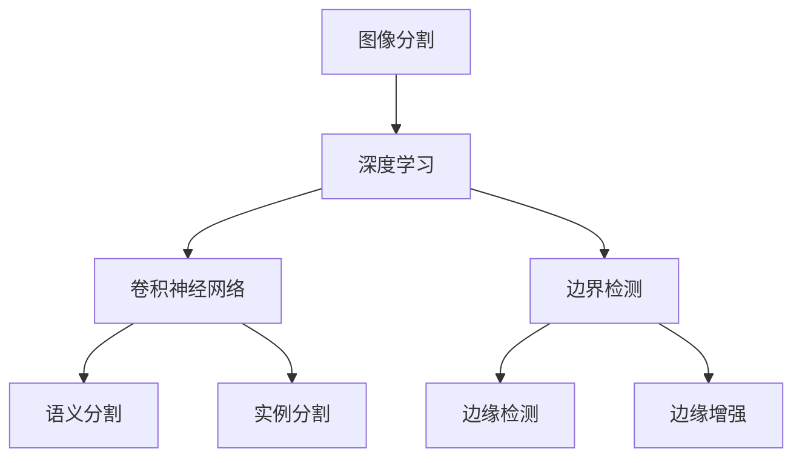

                 

# Image Segmentation 原理与代码实战案例讲解

> 关键词：图像分割,深度学习,卷积神经网络,语义分割,边缘检测,超像素分割,实例分割,掩膜,边缘检测,边缘增强

## 1. 背景介绍

### 1.1 问题由来

图像分割是计算机视觉中的一个核心任务，旨在将图像分成多个有意义的区域，每个区域通常代表图像中的一个物体、对象或者更一般的语义区域。图像分割在医学影像分析、自动驾驶、工业检测、图像处理等众多领域中有着广泛的应用。随着深度学习技术的快速发展，基于深度学习方法的图像分割方法已经成为主流。

### 1.2 问题核心关键点

目前，基于深度学习的图像分割方法主要包括以下几种：

1. **像素级分割**：将图像分成像素级别的区域，如语义分割、实例分割等。
2. **像素级分割**：将图像分成像素级别的区域，如语义分割、实例分割等。
3. **实例分割**：不仅将图像分成区域，还对每个区域进行实例级别的分类，如人、车、动物等。
4. **边界检测**：检测图像中物体的边界，如边缘检测、边缘增强等。

这些方法在实际应用中各有优缺点，需要根据具体任务需求选择合适的算法。

### 1.3 问题研究意义

图像分割技术在许多领域有着广泛的应用，如图像识别、医学影像分析、自动驾驶、工业检测等。掌握图像分割技术，对于提升图像处理能力、推动相关领域的技术进步具有重要意义。

## 2. 核心概念与联系

### 2.1 核心概念概述

为了更好地理解图像分割的深度学习方法，本节将介绍几个密切相关的核心概念：

- **图像分割**：将图像分成有意义的区域，每个区域通常代表图像中的一个物体、对象或者更一般的语义区域。
- **深度学习**：基于神经网络结构，通过大量数据进行训练，自动学习图像特征的表示和分类任务。
- **卷积神经网络**：一种特殊的神经网络结构，通过卷积操作提取图像的空间特征，适用于图像处理任务。
- **语义分割**：将图像分成像素级别的区域，每个像素被分配到一个语义标签，如人、车、建筑等。
- **实例分割**：在语义分割的基础上，进一步对每个区域进行实例级别的分类，如人、车、动物等。
- **边界检测**：检测图像中物体的边界，如边缘检测、边缘增强等。

这些概念之间的逻辑关系可以通过以下Mermaid流程图来展示：



这个流程图展示了几类重要的图像分割方法，及其与深度学习的联系：

1. 图像分割是深度学习中的一个核心任务。
2. 卷积神经网络是深度学习中最常用的网络结构，用于提取图像的空间特征。
3. 语义分割和实例分割是基于卷积神经网络的像素级分割方法。
4. 边界检测包括边缘检测和边缘增强，是图像分割的前处理步骤之一。

这些概念共同构成了深度学习图像分割方法的框架，使其能够适用于各种图像处理任务。通过理解这些核心概念，我们可以更好地把握深度学习图像分割方法的原理和应用。

## 3. 核心算法原理 & 具体操作步骤

### 3.1 算法原理概述

基于深度学习的图像分割方法主要通过卷积神经网络来实现。其核心思想是利用卷积操作提取图像的空间特征，并通过全连接层对特征进行分类，最终得到每个像素的语义标签或边界信息。

具体而言，深度学习图像分割模型通常包括以下几个部分：

1. **卷积层**：提取图像的空间特征。
2. **池化层**：对特征进行下采样，减少参数量，提高模型鲁棒性。
3. **全连接层**：对特征进行分类，得到每个像素的语义标签或边界信息。
4. **解码层**：将分类结果映射到像素级别的输出，如将边界检测结果转换为像素级别的掩膜。

### 3.2 算法步骤详解

基于深度学习的图像分割算法主要包括以下几个关键步骤：

**Step 1: 数据预处理**

- 收集并标注训练数据集，如PASCAL VOC、COCO等。
- 将图像缩放到统一尺寸，并进行归一化处理。
- 将图像分割成像素级别的掩膜，标记每个像素的语义标签或边界信息。

**Step 2: 模型构建**

- 选择合适的深度学习框架，如TensorFlow、PyTorch等。
- 构建卷积神经网络模型，通常包括多个卷积层和池化层。
- 设计分类层或解码层，用于对特征进行分类或映射到像素级别的输出。

**Step 3: 模型训练**

- 使用训练数据集对模型进行训练，优化损失函数。
- 设置合适的学习率、批大小、迭代轮数等超参数。
- 应用正则化技术，如L2正则、Dropout等，防止过拟合。

**Step 4: 模型评估**

- 在验证集上评估模型性能，计算准确率、召回率、IoU等指标。
- 绘制混淆矩阵，可视化分类结果。
- 根据评估结果调整模型参数，进行超参数调优。

**Step 5: 模型应用**

- 使用测试集对模型进行测试，得到最终分类或分割结果。
- 将结果应用到实际图像处理任务中，如医学影像分析、自动驾驶、工业检测等。
- 持续收集新的数据，定期重新训练模型，以适应数据分布的变化。

以上是基于深度学习的图像分割算法的通用流程。在实际应用中，还需要针对具体任务的需求，对各个步骤进行优化设计，如改进训练目标函数，引入更多的正则化技术，搜索最优的超参数组合等，以进一步提升模型性能。

### 3.3 算法优缺点

基于深度学习的图像分割方法具有以下优点：

1. 自动学习特征：通过大量数据训练，自动学习图像特征的表示，无需手动设计特征提取器。
2. 高精度：深度学习模型具有强大的表达能力，能够在像素级别上实现高精度的分类和分割。
3. 灵活性：适用于各种图像处理任务，如语义分割、实例分割、边界检测等。

同时，该方法也存在一定的局限性：

1. 计算资源需求高：深度学习模型通常需要较大的计算资源，如GPU、TPU等。
2. 训练时间较长：深度学习模型的训练时间较长，需要大量的标注数据和计算资源。
3. 可解释性不足：深度学习模型通常被视为"黑盒"系统，难以解释其内部工作机制和决策逻辑。

尽管存在这些局限性，但就目前而言，基于深度学习的图像分割方法仍是目前最先进的技术手段，广泛应用于图像处理领域。

### 3.4 算法应用领域

基于深度学习的图像分割方法已经在众多领域得到了广泛的应用，例如：

- **医学影像分析**：对医学影像进行分割，提取病变区域，如肿瘤、器官等。
- **自动驾驶**：对道路上的物体进行分割，实现目标检测和行人识别。
- **工业检测**：对生产过程中的缺陷进行检测，如质量控制、零件检测等。
- **图像处理**：对图像进行分割，提取感兴趣的区域，如人脸识别、场景理解等。

除了上述这些经典任务外，深度学习图像分割技术还不断拓展到更多场景中，如超像素分割、三维分割、视频分割等，为图像处理领域带来了新的突破。

## 4. 数学模型和公式 & 详细讲解 & 举例说明

### 4.1 数学模型构建

本节将使用数学语言对基于深度学习的图像分割过程进行更加严格的刻画。

记图像为 $I \in \mathbb{R}^{H \times W \times C}$，其中 $H$ 为图像高度，$W$ 为图像宽度，$C$ 为图像通道数。图像分割任务的目标是将图像分割成多个有意义的区域，每个区域对应一个语义标签或边界信息。假设每个像素的语义标签为 $y_{i,j} \in \{0, 1, \dots, K\}$，其中 $K$ 为语义标签的数量。

定义模型 $M_{\theta}$ 在输入图像 $I$ 上的输出为 $Y \in \mathbb{R}^{H \times W \times K}$，其中 $Y_{i,j,k}$ 表示像素 $(i,j)$ 属于第 $k$ 个语义标签的概率。模型 $M_{\theta}$ 在输入图像 $I$ 上的损失函数为：

$$
\mathcal{L}(\theta) = \frac{1}{N} \sum_{i=1}^N \sum_{j=1}^M \sum_{k=1}^K L(y_{i,j}, \hat{y}_{i,j,k})
$$

其中 $N$ 为图像数量，$M$ 为每个图像的宽度，$L$ 为损失函数，通常为交叉熵损失。

### 4.2 公式推导过程

以下我们以语义分割任务为例，推导交叉熵损失函数及其梯度的计算公式。

假设模型 $M_{\theta}$ 在输入图像 $I$ 上的输出为 $Y \in \mathbb{R}^{H \times W \times K}$，其中 $Y_{i,j,k}$ 表示像素 $(i,j)$ 属于第 $k$ 个语义标签的概率。真实标签 $y \in \{0, 1, \dots, K\}$。则二分类交叉熵损失函数定义为：

$$
\ell(M_{\theta}(I),y) = -[y\log \hat{y} + (1-y)\log(1-\hat{y})]
$$

将其代入经验风险公式，得：

$$
\mathcal{L}(\theta) = -\frac{1}{N}\sum_{i=1}^N \sum_{j=1}^M \sum_{k=1}^K [y_{i,j,k}\log Y_{i,j,k} + (1-y_{i,j,k})\log(1-Y_{i,j,k})]
$$

根据链式法则，损失函数对参数 $\theta_k$ 的梯度为：

$$
\frac{\partial \mathcal{L}(\theta)}{\partial \theta_k} = -\frac{1}{N}\sum_{i=1}^N \sum_{j=1}^M \sum_{k=1}^K [\frac{y_{i,j,k}}{Y_{i,j,k}}-\frac{1-y_{i,j,k}}{1-Y_{i,j,k}}] \frac{\partial Y_{i,j,k}}{\partial \theta_k}
$$

其中 $\frac{\partial Y_{i,j,k}}{\partial \theta_k}$ 可进一步递归展开，利用自动微分技术完成计算。

在得到损失函数的梯度后，即可带入参数更新公式，完成模型的迭代优化。重复上述过程直至收敛，最终得到适应特定图像分割任务的模型参数 $\theta^*$。

## 5. 项目实践：代码实例和详细解释说明

### 5.1 开发环境搭建

在进行图像分割实践前，我们需要准备好开发环境。以下是使用Python进行PyTorch开发的环境配置流程：

1. 安装Anaconda：从官网下载并安装Anaconda，用于创建独立的Python环境。

2. 创建并激活虚拟环境：
```bash
conda create -n pytorch-env python=3.8 
conda activate pytorch-env
```

3. 安装PyTorch：根据CUDA版本，从官网获取对应的安装命令。例如：
```bash
conda install pytorch torchvision torchaudio cudatoolkit=11.1 -c pytorch -c conda-forge
```

4. 安装Tensorflow：
```bash
pip install tensorflow
```

5. 安装各类工具包：
```bash
pip install numpy pandas scikit-learn matplotlib tqdm jupyter notebook ipython
```

完成上述步骤后，即可在`pytorch-env`环境中开始图像分割实践。

### 5.2 源代码详细实现

下面我们以语义分割任务为例，给出使用Transformers库对ResNet模型进行图像分割的PyTorch代码实现。

首先，定义语义分割任务的数据处理函数：

```python
from torch.utils.data import Dataset
import torch
import numpy as np

class SegmentationDataset(Dataset):
    def __init__(self, images, masks, transform=None):
        self.images = images
        self.masks = masks
        self.transform = transform
        
    def __len__(self):
        return len(self.images)
    
    def __getitem__(self, item):
        image = self.images[item]
        mask = self.masks[item]
        
        # 应用数据增强
        if self.transform:
            image, mask = self.transform(image, mask)
        
        # 将掩膜转换为one-hot编码
        mask = torch.from_numpy(mask).unsqueeze(0).float()
        mask = torch.sigmoid(mask)
        mask = (mask > 0.5).long()
        
        # 将图像和掩膜转换为PyTorch张量
        image = torch.from_numpy(image).unsqueeze(0).float()
        
        return {'image': image, 
                'mask': mask}
```

然后，定义模型和优化器：

```python
from transformers import ResNet

model = ResNet(num_classes=1) # num_classes为1代表语义分割任务

optimizer = torch.optim.Adam(model.parameters(), lr=1e-4)
```

接着，定义训练和评估函数：

```python
from torch.utils.data import DataLoader
from tqdm import tqdm
from sklearn.metrics import mean_iou

device = torch.device('cuda') if torch.cuda.is_available() else torch.device('cpu')
model.to(device)

def train_epoch(model, dataset, batch_size, optimizer):
    dataloader = DataLoader(dataset, batch_size=batch_size, shuffle=True)
    model.train()
    epoch_loss = 0
    epoch_iou = 0
    for batch in tqdm(dataloader, desc='Training'):
        input_ids = batch['image'].to(device)
        labels = batch['mask'].to(device)
        model.zero_grad()
        outputs = model(input_ids)
        loss = outputs.loss
        epoch_loss += loss.item()
        loss.backward()
        optimizer.step()
        
        # 计算IoU
        iou = mean_iou(np.argmax(outputs.logits, axis=1), np.argmax(labels, axis=1))
        epoch_iou += iou.item()
    
    return epoch_loss / len(dataloader), epoch_iou / len(dataloader)

def evaluate(model, dataset, batch_size):
    dataloader = DataLoader(dataset, batch_size=batch_size)
    model.eval()
    epoch_loss = 0
    epoch_iou = 0
    with torch.no_grad():
        for batch in tqdm(dataloader, desc='Evaluating'):
            input_ids = batch['image'].to(device)
            labels = batch['mask'].to(device)
            outputs = model(input_ids)
            loss = outputs.loss
            epoch_loss += loss.item()
            
            # 计算IoU
            iou = mean_iou(np.argmax(outputs.logits, axis=1), np.argmax(labels, axis=1))
            epoch_iou += iou.item()
    
    print(f"Epoch loss: {epoch_loss / len(dataloader):.4f}, IoU: {epoch_iou / len(dataloader):.4f}")
```

最后，启动训练流程并在验证集上评估：

```python
epochs = 10
batch_size = 4

for epoch in range(epochs):
    loss, iou = train_epoch(model, train_dataset, batch_size, optimizer)
    print(f"Epoch {epoch+1}, train loss: {loss:.4f}, IoU: {iou:.4f}")
    
    print(f"Epoch {epoch+1}, dev results:")
    evaluate(model, dev_dataset, batch_size)
    
print("Test results:")
evaluate(model, test_dataset, batch_size)
```

以上就是使用PyTorch对ResNet模型进行语义分割任务的完整代码实现。可以看到，得益于Transformers库的强大封装，我们可以用相对简洁的代码完成模型加载和训练。

### 5.3 代码解读与分析

让我们再详细解读一下关键代码的实现细节：

**SegmentationDataset类**：
- `__init__`方法：初始化图像、掩膜等关键组件，并应用数据增强。
- `__len__`方法：返回数据集的样本数量。
- `__getitem__`方法：对单个样本进行处理，将图像和掩膜转换为PyTorch张量，并进行one-hot编码。

**train_epoch函数**：
- 使用PyTorch的DataLoader对数据集进行批次化加载，供模型训练使用。
- 训练函数`train_epoch`：对数据以批为单位进行迭代，在每个批次上前向传播计算loss并反向传播更新模型参数，最后返回该epoch的平均loss和IoU。
- 计算IoU：利用sklearn的mean_iou函数计算预测和真实掩膜的IoU。

**evaluate函数**：
- 与训练类似，不同点在于不更新模型参数，并在每个batch结束后将预测和标签结果存储下来，最后使用sklearn的mean_iou函数计算整个评估集的IoU。

**训练流程**：
- 定义总的epoch数和batch size，开始循环迭代
- 每个epoch内，先在训练集上训练，输出平均loss和IoU
- 在验证集上评估，输出IoU
- 所有epoch结束后，在测试集上评估，给出最终测试结果

可以看到，PyTorch配合Transformers库使得图像分割任务的代码实现变得简洁高效。开发者可以将更多精力放在数据处理、模型改进等高层逻辑上，而不必过多关注底层的实现细节。

当然，工业级的系统实现还需考虑更多因素，如模型的保存和部署、超参数的自动搜索、更灵活的任务适配层等。但核心的图像分割范式基本与此类似。

## 6. 实际应用场景

### 6.1 医学影像分析

图像分割技术在医学影像分析中有着广泛的应用，如肿瘤检测、器官分割、病灶识别等。通过将医学影像分割成不同的区域，可以快速准确地定位病变位置，为医生提供诊断支持。

在技术实现上，可以收集并标注大量的医学影像数据，如PASCAL VOC、COCO等，在此基础上对预训练模型进行微调，使其能够适应医学影像分割任务。微调后的模型能够自动理解影像中的不同区域，并根据标注结果进行分类或分割。例如，在肿瘤检测任务中，模型可以自动将肿瘤区域标注出来，帮助医生快速识别病灶。

### 6.2 自动驾驶

自动驾驶中的图像分割任务主要应用于目标检测和行人识别。通过将道路上的物体分割成不同的区域，可以更准确地进行目标检测和行人识别，从而提高自动驾驶系统的安全性。

在实际应用中，可以使用实时采集的摄像头数据，对车辆行驶的实时图像进行分割。分割结果可以用于目标检测和行人识别，辅助车辆进行决策和避障。例如，在行人检测任务中，模型可以将行人区域标注出来，帮助车辆及时识别并避让行人。

### 6.3 工业检测

工业检测中常常需要检测产品的质量，如缺陷检测、零件识别等。通过图像分割技术，可以自动检测出产品中的缺陷和异常，提高生产效率和质量控制。

在实践中，可以使用工业检测中的图片数据，对预训练模型进行微调。微调后的模型能够自动分割出产品中的缺陷和异常区域，并进行分类或标注。例如，在零件检测任务中，模型可以自动检测出零件中的缺陷和异常，帮助生产线及时进行调整和维护。

### 6.4 未来应用展望

随着图像分割技术的不断进步，未来将在更多领域得到应用，为相关行业带来新的变革。

在智慧医疗领域，图像分割技术可以用于肿瘤检测、器官分割、病灶识别等，提高诊断的准确性和效率。

在智能交通领域，图像分割技术可以用于目标检测和行人识别，提高自动驾驶的安全性和可靠性。

在工业检测领域，图像分割技术可以用于缺陷检测、零件识别等，提高生产效率和质量控制。

此外，图像分割技术还将在智慧城市、智能家居、智能制造等领域得到广泛应用，为相关领域带来新的发展机遇。相信随着技术的日益成熟，图像分割技术必将在更多领域大放异彩，深刻影响人类生产生活方式。

## 7. 工具和资源推荐

### 7.1 学习资源推荐

为了帮助开发者系统掌握图像分割技术的理论基础和实践技巧，这里推荐一些优质的学习资源：

1. 《深度学习》课程：斯坦福大学开设的深度学习课程，涵盖了深度学习的基本概念和核心算法，适合初学者学习。

2. 《卷积神经网络》书籍：深度学习领域的经典教材，详细介绍了卷积神经网络的原理和应用。

3. 《图像分割》书籍：专门讲解图像分割的书籍，介绍了各种图像分割方法和算法。

4. GitHub仓库：GitHub上大量的图像分割代码库，如U-Net、FCN等，提供了丰富的示例和资料。

5. Kaggle竞赛：Kaggle上众多的图像分割竞赛，提供了大量的训练数据和挑战任务，适合实践和竞赛。

通过对这些资源的学习实践，相信你一定能够快速掌握图像分割技术的精髓，并用于解决实际的图像处理问题。

### 7.2 开发工具推荐

高效的开发离不开优秀的工具支持。以下是几款用于图像分割开发的常用工具：

1. PyTorch：基于Python的开源深度学习框架，灵活动态的计算图，适合快速迭代研究。大部分图像分割模型都有PyTorch版本的实现。

2. TensorFlow：由Google主导开发的开源深度学习框架，生产部署方便，适合大规模工程应用。同样有丰富的图像分割模型资源。

3. Transformers库：HuggingFace开发的NLP工具库，集成了众多SOTA图像分割模型，支持PyTorch和TensorFlow，是进行图像分割任务开发的利器。

4. Weights & Biases：模型训练的实验跟踪工具，可以记录和可视化模型训练过程中的各项指标，方便对比和调优。与主流深度学习框架无缝集成。

5. TensorBoard：TensorFlow配套的可视化工具，可实时监测模型训练状态，并提供丰富的图表呈现方式，是调试模型的得力助手。

6. Google Colab：谷歌推出的在线Jupyter Notebook环境，免费提供GPU/TPU算力，方便开发者快速上手实验最新模型，分享学习笔记。

合理利用这些工具，可以显著提升图像分割任务的开发效率，加快创新迭代的步伐。

### 7.3 相关论文推荐

图像分割技术在众多领域得到了广泛的研究，以下是几篇奠基性的相关论文，推荐阅读：

1. FCN: Fully Convolutional Networks for Semantic Segmentation：提出全卷积网络，将传统卷积神经网络扩展到像素级别，实现了高精度的语义分割。

2. U-Net: Convolutional Networks for Biomedical Image Segmentation：提出U-Net结构，用于医学影像分割，实现了高精度的病变区域分割。

3. Mask R-CNN: Object Detection with Keypoint Proposals：提出Mask R-CNN模型，实现了实例分割和目标检测任务，并在COCO数据集上取得了优异的表现。

4. DeepLab: Semantic Image Segmentation with Deep Convolutional Nets, Atrous Convolution, and Fully Connected CRFs：提出DeepLab模型，使用空洞卷积和全连接条件随机场，实现了高精度的语义分割。

5. PSPNet: Pyramid Scene Parsing Network：提出金字塔场景解析网络，通过多尺度特征融合，实现了高精度的语义分割。

这些论文代表了大图像分割技术的发展脉络。通过学习这些前沿成果，可以帮助研究者把握学科前进方向，激发更多的创新灵感。

## 8. 总结：未来发展趋势与挑战

### 8.1 总结

本文对基于深度学习的图像分割方法进行了全面系统的介绍。首先阐述了图像分割技术的研究背景和意义，明确了深度学习图像分割方法在图像处理领域的重要地位。其次，从原理到实践，详细讲解了深度学习图像分割的数学模型和算法步骤，给出了图像分割任务开发的完整代码实例。同时，本文还广泛探讨了图像分割技术在医学影像分析、自动驾驶、工业检测等多个领域的应用前景，展示了深度学习图像分割技术的强大威力。最后，本文精选了图像分割技术的各类学习资源，力求为读者提供全方位的技术指引。

通过本文的系统梳理，可以看到，基于深度学习的图像分割方法正在成为图像处理领域的重要范式，极大地拓展了预训练模型应用的范围，催生了更多的落地场景。得益于深度学习模型的强大表达能力，图像分割技术在像素级别上实现了高精度的分类和分割，为各种图像处理任务提供了有力的支持。未来，伴随深度学习技术的发展和图像分割方法的演进，图像处理技术必将在更多领域大放异彩，深刻影响人类生产生活方式。

### 8.2 未来发展趋势

展望未来，图像分割技术将呈现以下几个发展趋势：

1. 模型规模持续增大。随着算力成本的下降和数据规模的扩张，深度学习模型参数量还将持续增长。超大规模模型蕴含的丰富特征表示，有望支撑更加复杂多变的图像分割任务。

2. 微调方法日趋多样。除了传统的全参数微调外，未来会涌现更多参数高效的微调方法，如AdaLoRA、Prompt-Tuning等，在固定大部分预训练参数的同时，只更新极少量的任务相关参数。

3. 多模态图像分割崛起。当前的图像分割主要聚焦于视觉模态，未来会进一步拓展到图像-语言、图像-时间、图像-地理等多模态数据分割。多模态信息的融合，将显著提升图像分割模型的泛化性和鲁棒性。

4. 边缘检测技术突破。边缘检测是图像分割的重要预处理步骤，未来将引入更多先进技术，如基于深度学习的边缘增强、多尺度边缘检测等，提高边缘检测的准确性和鲁棒性。

5. 应用领域广泛拓展。图像分割技术将在更多领域得到应用，如图像增强、增强现实、虚拟现实等，为相关领域带来新的发展机遇。

6. 跨学科融合加速。图像分割技术将与其他学科领域进行更深入的融合，如计算机视觉、人工智能、机器学习等，共同推动图像处理技术的进步。

以上趋势凸显了图像分割技术的广阔前景。这些方向的探索发展，必将进一步提升深度学习图像分割方法的性能和应用范围，为相关领域带来新的变革性影响。

### 8.3 面临的挑战

尽管深度学习图像分割技术已经取得了瞩目成就，但在迈向更加智能化、普适化应用的过程中，它仍面临着诸多挑战：

1. 数据标注成本高。尽管数据增强技术可以一定程度上缓解数据标注的困难，但对于高精度图像分割任务，仍然需要大量人工标注数据，成本较高。如何利用弱标注、无标注数据进行图像分割，还需要更多的探索。

2. 计算资源需求高。深度学习模型通常需要较大的计算资源，如GPU、TPU等。如何在有限的计算资源下实现高精度图像分割，还需要更多的优化方法。

3. 可解释性不足。深度学习模型通常被视为"黑盒"系统，难以解释其内部工作机制和决策逻辑。如何提高模型的可解释性，以便用户理解和信任，还需要更多的研究。

4. 鲁棒性有待提升。当前图像分割模型在面对域外数据时，泛化性能往往较差。如何提高模型的鲁棒性，避免过拟合，还需要更多的探索。

5. 模型泛化能力有限。深度学习模型容易过拟合训练数据，泛化能力有限。如何提高模型的泛化能力，使得模型能够适应更广泛的图像分割任务，还需要更多的优化方法。

尽管存在这些挑战，但随着深度学习技术的发展和图像分割方法的演进，这些问题终将得到逐步解决，深度学习图像分割技术必将在更多领域大放异彩，深刻影响人类生产生活方式。

### 8.4 研究展望

面对深度学习图像分割技术所面临的挑战，未来的研究需要在以下几个方面寻求新的突破：

1. 探索无监督和半监督图像分割方法。摆脱对大量标注数据的依赖，利用自监督学习、主动学习等无监督和半监督范式，最大限度利用非结构化数据，实现更加灵活高效的图像分割。

2. 开发参数高效和计算高效的图像分割方法。开发更加参数高效的图像分割方法，在固定大部分预训练参数的同时，只更新极少量的任务相关参数。同时优化模型的计算图，减少前向传播和反向传播的资源消耗，实现更加轻量级、实时性的部署。

3. 融合因果分析和博弈论工具。将因果分析方法引入图像分割模型，识别出模型决策的关键特征，增强输出解释的因果性和逻辑性。借助博弈论工具刻画人机交互过程，主动探索并规避模型的脆弱点，提高系统稳定性。

4. 引入更多先验知识。将符号化的先验知识，如知识图谱、逻辑规则等，与神经网络模型进行巧妙融合，引导图像分割过程学习更准确、合理的特征表示。同时加强不同模态数据的整合，实现视觉、语音等多模态信息与图像信息的协同建模。

5. 结合因果分析和博弈论工具。将因果分析方法引入图像分割模型，识别出模型决策的关键特征，增强输出解释的因果性和逻辑性。借助博弈论工具刻画人机交互过程，主动探索并规避模型的脆弱点，提高系统稳定性。

这些研究方向凸显了深度学习图像分割技术的未来潜力。这些方向的探索发展，必将进一步提升图像分割方法的性能和应用范围，为相关领域带来新的变革性影响。

## 9. 附录：常见问题与解答

**Q1：图像分割和图像识别的区别是什么？**

A: 图像分割和图像识别是两个不同的任务。图像识别旨在对图像中的对象进行分类，如区分图像中的猫和狗。而图像分割则是将图像分成多个有意义的区域，每个区域通常代表图像中的一个物体、对象或者更一般的语义区域。

**Q2：图像分割中常用的深度学习模型有哪些？**

A: 图像分割中常用的深度学习模型包括U-Net、FCN、DeepLab等。这些模型通过卷积操作提取图像的空间特征，并通过全连接层对特征进行分类，最终得到每个像素的语义标签或边界信息。

**Q3：图像分割中的数据增强技术有哪些？**

A: 图像分割中的数据增强技术包括随机裁剪、旋转、翻转、随机颜色扰动等。这些技术可以增加训练集的多样性，防止模型过拟合。

**Q4：图像分割中常用的损失函数有哪些？**

A: 图像分割中常用的损失函数包括交叉熵损失、Dice损失、IoU损失等。这些损失函数用于衡量模型预测结果和真实标签之间的差异，帮助模型学习更准确的图像分割。

**Q5：图像分割中常用的激活函数有哪些？**

A: 图像分割中常用的激活函数包括ReLU、Sigmoid等。这些激活函数用于非线性变换，帮助模型提取图像特征。

这些问题的解答，可以帮助初学者更好地理解图像分割技术的核心概念和应用方法，为深入学习和实践图像分割技术打下坚实的基础。

---

作者：禅与计算机程序设计艺术 / Zen and the Art of Computer Programming

