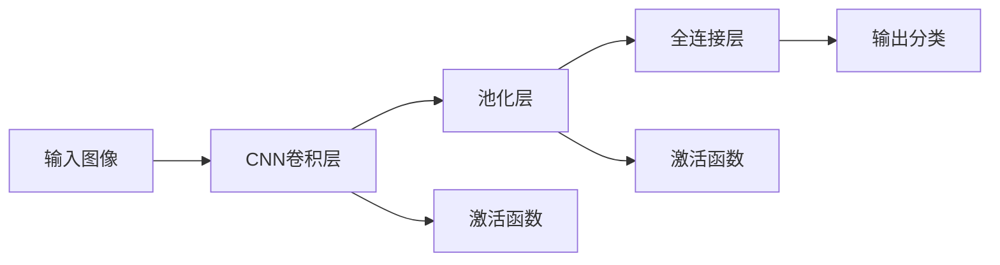

                 

## 1. 背景介绍

### 1.1 问题由来

随着深度学习技术的飞速发展，计算机视觉领域也取得了许多令人瞩目的进展。特别是在图像识别领域，ImageNet ImageNet作为世界上最大的图像数据库，催生了许多突破性的研究成果，推动了AI图像识别技术的发展。

从AlexNet在2012年ImageNet图像识别竞赛中夺冠开始，深度学习在图像识别领域逐步取代了传统方法。深度学习通过多层次的神经网络，利用卷积层、池化层、全连接层等模块，自动学习图像特征，并进行分类、检测等任务，取得了前所未有的成功。

### 1.2 问题核心关键点

ImageNet数据库及其在图像识别中的应用，对于推动深度学习技术的进步和AI图像识别的发展具有重要意义：

1. 大规模数据：ImageNet包含超过100万张高分辨率图像，涉及1000个类别，是图像识别任务中最具代表性的数据集。
2. 高精度基准：ImageNet数据集和每年的图像识别竞赛，设立了高标准的基准，推动了图像识别模型性能的持续提升。
3. 模型创新：ImageNet竞赛催生了许多先进的图像识别算法，如卷积神经网络（CNN）、残差网络（ResNet）、Inception等，为图像识别技术的发展奠定了基础。
4. 可扩展性：ImageNet数据集可以被用来进行模型微调、迁移学习等，适应多种图像识别任务。
5. 长期影响：ImageNet比赛对计算机视觉领域产生了长期影响，推动了深度学习、迁移学习等前沿技术的研究和应用。

### 1.3 问题研究意义

ImageNet数据集和图像识别竞赛对于推动AI图像识别技术的发展具有重要意义：

1. 促进技术进步：ImageNet竞赛设立了高标准的竞赛基准，推动了计算机视觉领域的学术研究和应用技术进步。
2. 加速产业化：ImageNet数据集提供了高质量的数据资源，加速了深度学习技术在图像识别等实际应用场景的产业化进程。
3. 催生人才涌现：ImageNet竞赛吸引了全球顶尖的计算机视觉研究者参与，推动了深度学习、迁移学习等前沿技术人才的培养。
4. 激发技术创新：ImageNet数据集和竞赛不断激励新的算法和模型的创新，推动了图像识别技术的持续演进。
5. 提升应用价值：通过大规模、高精度的图像识别技术，AI在医疗、自动驾驶、安防等领域的应用价值得到了提升。

## 2. 核心概念与联系

### 2.1 核心概念概述

为更好地理解ImageNet数据集和图像识别技术的发展，本节将介绍几个关键概念及其联系：

- ImageNet数据库：由斯坦福大学构建和维护的大型图像数据库，包含超过100万张高分辨率图像，涉及1000个类别，是图像识别领域最具代表性的数据集。
- 图像识别（Image Recognition）：计算机视觉领域的一种任务，指通过训练深度学习模型，将输入图像分类到指定的类别中。
- 卷积神经网络（Convolutional Neural Networks, CNNs）：深度学习中一种经典的图像识别模型，利用卷积层、池化层等模块提取图像特征，进行分类、检测等任务。
- 迁移学习（Transfer Learning）：将预训练模型（如ImageNet上训练的模型）迁移到新任务中的过程，通过微调（Fine-Tuning）提升模型在新任务上的性能。
- 自监督学习（Self-Supervised Learning）：使用无标签数据训练模型，学习数据的内在关系和规律，提升模型的泛化能力。
- 对抗训练（Adversarial Training）：通过对抗样本训练模型，提升模型对噪声、扰动等异常情况的鲁棒性。
- 模型压缩与加速（Model Compression & Acceleration）：针对大模型计算资源占用大的问题，通过剪枝、量化、模型蒸馏等技术，压缩模型大小，加速推理速度。

这些概念之间存在紧密的联系，共同构成了ImageNet数据集和图像识别技术的核心框架：

- ImageNet数据库是图像识别任务的主要数据来源，提供了丰富的标注数据。
- 卷积神经网络是图像识别任务的经典模型，通过多层次的卷积操作提取图像特征。
- 迁移学习是利用预训练模型，在特定任务上进行微调，提升模型性能的技术手段。
- 自监督学习在不依赖标签数据的情况下，提升模型的泛化能力。
- 对抗训练通过引入对抗样本，提高模型的鲁棒性和泛化能力。
- 模型压缩与加速技术，解决大模型在计算资源上的限制，提升模型的应用效率。

这些概念共同推动了AI图像识别技术的发展和应用，使得图像识别任务在多个实际场景中取得了显著成果。

## 3. 核心算法原理 & 具体操作步骤
### 3.1 算法原理概述

ImageNet图像识别技术的发展，基于深度学习中的卷积神经网络（CNN）模型。该模型通过卷积操作提取图像特征，利用池化操作减小特征维度，最后通过全连接层进行分类。

卷积神经网络的架构如图1所示：



其中，卷积层通过卷积核提取图像特征，池化层通过降采样减小特征维度，全连接层将特征映射到类别空间中。

### 3.2 算法步骤详解

基于CNN的图像识别流程主要包括以下几个关键步骤：

**Step 1: 准备数据集**

- 收集并标注ImageNet数据库中所有图像，分为训练集、验证集和测试集。
- 将图像预处理为固定尺寸和格式，供模型训练和推理使用。

**Step 2: 设计CNN模型**

- 选择适当的卷积层、池化层和全连接层，定义模型的结构和超参数。
- 设置优化器、损失函数和评估指标，准备训练和评估模型。

**Step 3: 训练模型**

- 使用训练集数据，对模型进行前向传播和反向传播训练，最小化损失函数。
- 在验证集上评估模型性能，避免过拟合。
- 周期性保存模型参数，记录训练进度和最佳模型。

**Step 4: 模型微调**

- 在特定任务上，加载预训练的CNN模型，冻结除顶层以外的所有层。
- 在目标任务的数据集上进行微调训练，更新顶层参数。
- 在测试集上评估微调后的模型性能，对比微调前后的效果。

**Step 5: 模型部署**

- 将微调后的模型部署到实际应用环境中，进行推理预测。
- 实时监控模型性能，根据数据分布变化进行持续学习。

### 3.3 算法优缺点

基于CNN的图像识别技术具有以下优点：

1. 特征提取能力强：CNN模型通过卷积操作自动提取图像特征，无需人工设计特征提取器。
2. 泛化能力强：CNN模型通过大规模数据训练，具备强大的泛化能力，在多种图像识别任务上表现优异。
3. 结构简单：CNN模型结构相对简单，易于实现和维护。
4. 迁移学习能力：通过迁移学习，可以在特定任务上进行微调，提升模型性能。

但该技术也存在一些缺点：

1. 参数量大：大规模卷积神经网络通常包含数百万甚至上亿个参数，训练和推理资源消耗大。
2. 计算复杂度高：卷积操作和池化操作计算复杂度较高，模型推理速度较慢。
3. 容易过拟合：深层网络容易过拟合，特别是在标注数据不足的情况下。
4. 可解释性不足：CNN模型通常被视为"黑盒"系统，难以解释其内部工作机制。

### 3.4 算法应用领域

基于CNN的图像识别技术在多个领域得到了广泛应用：

- 医学影像分析：利用图像分类和目标检测技术，进行疾病诊断和图像识别。
- 自动驾驶：通过图像识别技术，实现车辆自主导航和环境感知。
- 安防监控：使用图像识别技术，进行人脸识别、行为分析等应用。
- 智能家居：通过图像识别技术，实现智能家居设备联动和环境感知。
- 工业检测：利用图像分类技术，进行产品缺陷检测和质量控制。
- 司法鉴定：通过图像识别技术，进行视频监控和行为识别，提高司法公正性。

## 4. 数学模型和公式 & 详细讲解 & 举例说明

### 4.1 数学模型构建

基于CNN的图像识别模型可以表示为：

$$
f(x; \theta) = \mathbf{W}^{L}\sigma(\mathbf{W}^{L-1}\sigma(\mathbf{W}^{L-2}\sigma(\dots\sigma(\mathbf{W}^0x)\dots)) + b^L
$$

其中，$\theta$ 为模型的参数集合，$x$ 为输入图像，$y$ 为模型输出，$\sigma$ 为激活函数，$\mathbf{W}$ 为卷积核权重，$b$ 为偏置项。

### 4.2 公式推导过程

以下以AlexNet模型为例，详细推导其前向传播过程和反向传播过程。

#### 4.2.1 前向传播

AlexNet模型包含5个卷积层、3个全连接层和ReLU激活函数。其前向传播过程如下：

1. 输入图像经过第一层卷积操作，得到特征图。
2. 特征图通过ReLU激活函数，进行非线性变换。
3. 特征图通过第一层池化操作，减小特征图尺寸。
4. 特征图经过第二层卷积操作，得到更高级的特征图。
5. 特征图通过ReLU激活函数，进行非线性变换。
6. 特征图通过第二层池化操作，减小特征图尺寸。
7. 特征图经过第三层卷积操作，得到更高级的特征图。
8. 特征图通过ReLU激活函数，进行非线性变换。
9. 特征图通过第三层池化操作，减小特征图尺寸。
10. 特征图经过全连接层，映射到输出空间。
11. 输出通过Softmax函数进行分类。

#### 4.2.2 反向传播

AlexNet模型的反向传播过程如下：

1. 计算损失函数对输出层的梯度。
2. 根据梯度反向传播，计算全连接层的梯度。
3. 根据梯度反向传播，计算卷积层的梯度。
4. 根据梯度反向传播，更新卷积核权重和偏置项。
5. 更新全连接层的权重和偏置项。

### 4.3 案例分析与讲解

以图像分类任务为例，以下是一个完整的AlexNet模型训练流程：

1. 准备数据集：将图像预处理为227x227的固定尺寸，划分训练集、验证集和测试集。
2. 定义模型：选择5个卷积层、3个全连接层和ReLU激活函数。
3. 加载预训练模型：使用ImageNet数据集预训练的AlexNet模型，冻结所有层。
4. 微调模型：加载特定任务的数据集，只更新顶层参数。
5. 训练模型：使用训练集数据，对模型进行前向传播和反向传播训练，最小化损失函数。
6. 评估模型：在验证集和测试集上评估模型性能，对比微调前后的效果。
7. 部署模型：将微调后的模型部署到实际应用环境中，进行推理预测。

## 5. 项目实践：代码实例和详细解释说明
### 5.1 开发环境搭建

在进行图像识别项目实践前，我们需要准备好开发环境。以下是使用Python进行TensorFlow开发的环境配置流程：

1. 安装Anaconda：从官网下载并安装Anaconda，用于创建独立的Python环境。

2. 创建并激活虚拟环境：
```bash
conda create -n tf-env python=3.8 
conda activate tf-env
```

3. 安装TensorFlow：根据CUDA版本，从官网获取对应的安装命令。例如：
```bash
conda install tensorflow -c tensorflow -c conda-forge
```

4. 安装Keras：
```bash
pip install keras
```

5. 安装TensorBoard：
```bash
pip install tensorboard
```

6. 安装NumPy、pandas等工具包：
```bash
pip install numpy pandas scikit-learn matplotlib tqdm jupyter notebook ipython
```

完成上述步骤后，即可在`tf-env`环境中开始项目实践。

### 5.2 源代码详细实现

这里我们以图像分类任务为例，给出使用TensorFlow和Keras库对AlexNet模型进行训练的代码实现。

首先，定义图像分类任务的数据处理函数：

```python
import numpy as np
import tensorflow as tf
from keras.datasets import mnist
from keras.utils import to_categorical

def load_mnist_data(batch_size):
    (train_images, train_labels), (test_images, test_labels) = mnist.load_data()
    train_images = train_images.reshape(train_images.shape[0], 28, 28, 1).astype('float32') / 255
    test_images = test_images.reshape(test_images.shape[0], 28, 28, 1).astype('float32') / 255
    train_labels = to_categorical(train_labels, 10)
    test_labels = to_categorical(test_labels, 10)
    train_dataset = tf.data.Dataset.from_tensor_slices((train_images, train_labels))
    train_dataset = train_dataset.shuffle(60000).batch(batch_size).prefetch(tf.data.experimental.AUTOTUNE)
    test_dataset = tf.data.Dataset.from_tensor_slices((test_images, test_labels))
    test_dataset = test_dataset.batch(batch_size).prefetch(tf.data.experimental.AUTOTUNE)
    return train_dataset, test_dataset
```

然后，定义AlexNet模型：

```python
from keras.models import Sequential
from keras.layers import Conv2D, MaxPooling2D, Flatten, Dense, Activation

def alexnet_model(input_shape, num_classes):
    model = Sequential()
    model.add(Conv2D(96, (11, 11), strides=(4, 4), input_shape=input_shape))
    model.add(Activation('relu'))
    model.add(MaxPooling2D(pool_size=(3, 3), strides=(2, 2), padding='same'))
    model.add(Conv2D(256, (5, 5), padding='same'))
    model.add(Activation('relu'))
    model.add(MaxPooling2D(pool_size=(3, 3), strides=(2, 2), padding='same'))
    model.add(Conv2D(384, (3, 3), padding='same'))
    model.add(Activation('relu'))
    model.add(Conv2D(384, (3, 3), padding='same'))
    model.add(Activation('relu'))
    model.add(MaxPooling2D(pool_size=(3, 3), strides=(2, 2), padding='same'))
    model.add(Flatten())
    model.add(Dense(4096))
    model.add(Activation('relu'))
    model.add(Dropout(0.5))
    model.add(Dense(num_classes))
    model.add(Activation('softmax'))
    return model
```

接着，定义模型训练函数：

```python
from keras.callbacks import EarlyStopping, ModelCheckpoint

def train_model(model, train_dataset, test_dataset, batch_size, epochs, callbacks=[]):
    model.compile(optimizer='adam', loss='categorical_crossentropy', metrics=['accuracy'])
    model.fit(train_dataset, epochs=epochs, validation_data=test_dataset, callbacks=callbacks, batch_size=batch_size)
```

最后，启动训练流程并在测试集上评估：

```python
input_shape = (28, 28, 1)
num_classes = 10
batch_size = 128

train_dataset, test_dataset = load_mnist_data(batch_size)
model = alexnet_model(input_shape, num_classes)
callbacks = [EarlyStopping(patience=3), ModelCheckpoint('model.h5', save_best_only=True)]
train_model(model, train_dataset, test_dataset, batch_size, 10, callbacks)
```

以上就是使用TensorFlow和Keras对AlexNet模型进行图像分类任务训练的完整代码实现。可以看到，TensorFlow和Keras提供了强大的高层API，可以方便地实现模型的定义和训练，大大提高了图像识别项目的开发效率。

### 5.3 代码解读与分析

让我们再详细解读一下关键代码的实现细节：

**load_mnist_data函数**：
- 该函数定义了MNIST数据集的加载和预处理过程。
- 将图像数据转换为浮点数，并进行归一化处理，将标签数据转换为one-hot编码。
- 使用TensorFlow的DataLoader将数据集划分为训练集和测试集，并设置批次大小和预取机制。

**alexnet_model函数**：
- 该函数定义了AlexNet模型的架构。
- 包含5个卷积层、3个全连接层和ReLU激活函数。
- 通过Sequential模型，按照定义的层次结构逐层添加各层。
- 在模型顶部添加Softmax激活函数，用于输出分类结果。

**train_model函数**：
- 该函数定义了模型的编译、训练和评估过程。
- 编译模型，使用adam优化器和交叉熵损失函数。
- 在训练过程中，使用EarlyStopping和ModelCheckpoint回调函数，避免过拟合，保存最优模型。
- 在测试集上评估模型性能，输出模型精度和损失值。

**训练流程**：
- 定义输入图像尺寸、类别数量和批次大小。
- 加载MNIST数据集，并定义模型。
- 设置回调函数，避免过拟合，保存最优模型。
- 启动模型训练，在训练集和测试集上进行评估。

可以看到，TensorFlow和Keras使得图像识别模型的开发变得简洁高效。开发者可以将更多精力放在模型改进和数据处理上，而不必过多关注底层的实现细节。

当然，工业级的系统实现还需考虑更多因素，如模型的保存和部署、超参数的自动搜索、更灵活的任务适配层等。但核心的图像识别任务开发流程基本与此类似。

## 6. 实际应用场景
### 6.1 智能家居

基于AlexNet等深度学习模型的图像识别技术，可以广泛应用于智能家居领域。通过安装摄像头和传感器，收集家庭环境中的图像和视频数据，可以实现智能家居设备的联动和环境感知。

例如，使用图像识别技术，可以实现以下应用：

- 人脸识别：通过摄像头识别家庭成员，控制家电设备。
- 物体检测：检测室内环境中的物体，提供环境分析和安全监控。
- 行为分析：分析家庭成员的日常行为，提供个性化服务。

通过图像识别技术，智能家居系统可以变得更加智能化和人性化，提升家庭生活质量。

### 6.2 自动驾驶

图像识别技术在自动驾驶领域具有重要应用价值，是实现车辆自主导航和环境感知的关键技术之一。通过摄像头、激光雷达等传感器，收集道路、车辆、行人等环境信息，可以辅助车辆进行决策和控制。

例如，使用图像识别技术，可以实现以下应用：

- 目标检测：检测道路上的车辆、行人、障碍物等，提供实时感知。
- 行为识别：分析行人、车辆的行为，预测其运动轨迹。
- 车道识别：识别道路上的车道线，辅助车辆在车道内行驶。

通过图像识别技术，自动驾驶系统可以更加安全和可靠，实现自动驾驶车辆的广泛应用。

### 6.3 司法鉴定

图像识别技术在司法鉴定领域也有广泛应用。通过摄像头、指纹识别设备等，收集案件现场的图像数据，辅助鉴定人员进行行为分析、物证比对等任务。

例如，使用图像识别技术，可以实现以下应用：

- 视频监控：分析案件现场的视频监控图像，提取关键证据。
- 人脸识别：比对嫌疑人和证人的人脸信息，确认身份。
- 行为识别：分析嫌疑人的行为，确定其犯罪动机和方式。

通过图像识别技术，司法鉴定过程可以更加高效和准确，提高司法公正性。

## 7. 工具和资源推荐
### 7.1 学习资源推荐

为了帮助开发者系统掌握图像识别技术的发展，这里推荐一些优质的学习资源：

1. 《深度学习》系列书籍：由深度学习领域的专家撰写，系统介绍了深度学习的基本概念和应用场景，涵盖图像识别、自然语言处理等多个领域。
2. 《TensorFlow官方文档》：TensorFlow官方提供的文档，包含丰富的代码示例和教程，适合初学者和进阶开发者。
3. 《计算机视觉：模型、学习和推理》书籍：由计算机视觉领域的专家撰写，详细介绍了计算机视觉的原理和应用，包括图像识别、目标检测、图像分割等任务。
4. 《Keras官方文档》：Keras官方提供的文档，包含丰富的代码示例和教程，适合使用Keras进行图像识别任务开发的开发者。
5. 《Python数据科学手册》书籍：由数据科学领域的专家撰写，介绍了Python在图像识别、自然语言处理等任务中的应用，适合入门学习。

通过对这些资源的学习实践，相信你一定能够快速掌握图像识别技术的精髓，并用于解决实际的NLP问题。

### 7.2 开发工具推荐

高效的开发离不开优秀的工具支持。以下是几款用于图像识别开发的常用工具：

1. TensorFlow：由Google主导开发的深度学习框架，支持多GPU训练，适合大规模工程应用。
2. Keras：由François Chollet创建的高级神经网络API，支持快速原型设计和模型部署。
3. PyTorch：由Facebook开发的深度学习框架，具有灵活性和动态图特性，适合学术研究和原型开发。
4. Caffe：由伯克利视觉与学习中心开发的深度学习框架，适合图像分类、目标检测等任务。
5. OpenCV：开源计算机视觉库，提供了丰富的图像处理和分析功能，适合图像识别应用开发。
6. ImageNet：由斯坦福大学构建和维护的大型图像数据库，提供了大规模标注数据，适合预训练模型训练。

合理利用这些工具，可以显著提升图像识别项目的开发效率，加快创新迭代的步伐。

### 7.3 相关论文推荐

图像识别技术的发展离不开学界的持续研究。以下是几篇奠基性的相关论文，推荐阅读：

1. ImageNet Large Scale Visual Recognition Challenge：ImageNet竞赛的介绍和历史回顾，展示了图像识别任务的高标准和巨大影响。
2. AlexNet: One Million Tiny Images Training an Image Classifier：AlexNet模型的介绍和实验结果，展示了深度学习在图像识别任务上的突破。
3. VGGNet: Very Deep Convolutional Networks for Large-Scale Image Recognition：VGGNet模型的介绍和实验结果，展示了深度卷积神经网络在图像识别任务上的性能提升。
4. GoogleNet: Going Deeper with Convolutions：GoogleNet模型的介绍和实验结果，展示了卷积神经网络结构的创新。
5. ResNet: Deep Residual Learning for Image Recognition：ResNet模型的介绍和实验结果，展示了残差网络在图像识别任务上的优势。

这些论文代表了大规模图像识别任务的发展脉络。通过学习这些前沿成果，可以帮助研究者把握学科前进方向，激发更多的创新灵感。

## 8. 总结：未来发展趋势与挑战
### 8.1 总结

本文对基于卷积神经网络的图像识别技术进行了全面系统的介绍。首先阐述了ImageNet数据集及其在图像识别中的应用，明确了深度学习在图像识别领域的优势和潜力。其次，从原理到实践，详细讲解了卷积神经网络的架构和训练过程，给出了图像识别任务的完整代码实现。同时，本文还探讨了图像识别技术在智能家居、自动驾驶、司法鉴定等多个领域的应用前景，展示了其广阔的发展空间。最后，本文精选了图像识别技术的各类学习资源，力求为读者提供全方位的技术指引。

通过本文的系统梳理，可以看到，基于卷积神经网络的图像识别技术在多个实际场景中取得了显著成果，成为计算机视觉领域的重要工具。未来，随着深度学习技术的不断发展，图像识别技术必将迎来新的突破，带来更加智能和高效的应用体验。

### 8.2 未来发展趋势

展望未来，图像识别技术将呈现以下几个发展趋势：

1. 模型规模持续增大。随着算力成本的下降和数据规模的扩张，卷积神经网络模型的参数量还将持续增长。超大规模模型蕴含的丰富图像特征，有望支撑更加复杂多变的图像识别任务。
2. 迁移学习能力增强。通过迁移学习，可以在特定任务上进行微调，提升模型性能。未来将涌现更多参数高效和计算高效的迁移学习方法，使得模型在少量数据上也能取得理想效果。
3. 深度学习与硬件结合。通过深度学习与GPU、TPU等硬件的结合，提升模型的训练和推理效率，适应更复杂、更高效的图像识别应用场景。
4. 多模态融合技术发展。将视觉、语音、文本等多种模态数据融合，提升图像识别的准确性和鲁棒性。
5. 自监督学习广泛应用。利用无标签数据进行自监督学习，提升模型的泛化能力，解决标注数据不足的问题。
6. 持续学习成为常态。图像识别模型需要持续学习新数据，适应数据分布的变化，保持性能的稳定性。

这些趋势将推动图像识别技术向更高的水平演进，为智能应用带来更丰富的功能和服务。

### 8.3 面临的挑战

尽管图像识别技术已经取得了显著成果，但在迈向更加智能化、普适化应用的过程中，仍面临诸多挑战：

1. 标注数据成本高。大规模图像标注成本较高，获取高质量标注数据成为图像识别任务的瓶颈。
2. 模型复杂度高。深度卷积神经网络模型参数量较大，训练和推理资源消耗大。
3. 泛化能力不足。模型在不同数据分布上的泛化能力较差，容易过拟合。
4. 计算效率低。卷积操作和池化操作计算复杂度较高，模型推理速度较慢。
5. 数据隐私问题。图像数据涉及隐私保护，如何在保证数据隐私的前提下进行图像识别任务，是亟待解决的问题。
6. 可解释性不足。图像识别模型通常被视为"黑盒"系统，难以解释其内部工作机制和决策逻辑。

这些挑战需要研究者从数据、算法、工程等多个方面进行深入研究，以推动图像识别技术不断进步。

### 8.4 研究展望

面对图像识别技术所面临的挑战，未来的研究需要在以下几个方面寻求新的突破：

1. 探索更高效的图像表示方法。通过特征学习、降维等方法，减小模型的计算复杂度，提升图像识别效率。
2. 发展多任务学习技术。通过联合学习多个图像识别任务，提升模型的泛化能力和鲁棒性。
3. 引入对抗样本训练。通过引入对抗样本，提升图像识别模型的鲁棒性和泛化能力。
4. 研究基于少样本学习的图像识别方法。利用少量标注数据进行图像识别，减少标注成本。
5. 提升模型的可解释性和可控性。引入可解释性技术，增强图像识别模型的可信度和可控性。
6. 研究数据隐私保护技术。在保证数据隐私的前提下，实现图像识别任务的高效处理。

这些研究方向将推动图像识别技术的持续进步，为更多智能应用提供可靠的保障。

## 9. 附录：常见问题与解答

**Q1：图像识别模型是否可以应用于多个任务？**

A: 是的，图像识别模型通过迁移学习，可以在多个任务上取得良好的性能。例如，通过微调AlexNet模型，可以在物体检测、图像分割、人脸识别等任务上实现应用。

**Q2：如何处理大规模图像数据集？**

A: 处理大规模图像数据集时，可以使用分布式训练和数据并行技术，加速模型训练过程。同时，可以采用数据增强、数据采样等方法，避免过拟合和计算资源浪费。

**Q3：如何提升图像识别模型的可解释性？**

A: 提升图像识别模型的可解释性，可以通过可视化技术，如梯度可视化、特征可视化等，展示模型的内部决策过程。同时，可以引入可解释性模型，如LIME、SHAP等，帮助解释模型的输出结果。

**Q4：如何在图像识别模型中引入对抗样本？**

A: 引入对抗样本，可以通过生成对抗样本来训练模型，提高模型的鲁棒性。具体方法包括FGSM、PGD等对抗样本生成算法。同时，可以引入对抗性数据集，如CIFAR-10等，用于训练和测试模型的鲁棒性。

**Q5：如何在图像识别模型中进行迁移学习？**

A: 进行迁移学习时，可以选择一个预训练模型，如AlexNet、ResNet等，冻结底层卷积层和池化层，只微调顶层全连接层。这样可以利用预训练模型的特征提取能力，减少标注数据需求，提高模型泛化能力。

总之，基于卷积神经网络的图像识别技术已经取得了显著成果，但未来仍有广阔的发展空间。通过不断创新和突破，相信图像识别技术将在更多领域发挥重要作用，推动AI技术的发展。

---

作者：禅与计算机程序设计艺术 / Zen and the Art of Computer Programming

