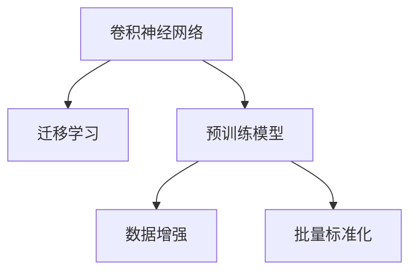

                 

# ImageNet图像识别

## 1. 背景介绍

### 1.1 问题由来
ImageNet是一个大型图像识别数据集，它由数百万张高分辨率图片和相应的标签组成。这个数据集最初是由斯坦福大学的研究团队在2009年发布的，目的是为了推动图像识别技术的发展，并作为ImageNet大挑战赛的基准数据集。由于其规模巨大和难度高，ImageNet成为了深度学习模型，特别是卷积神经网络(CNN)的重要测试平台。

在过去十年中，ImageNet大挑战赛一直是人工智能领域的一个重要里程碑，吸引了全球顶尖研究机构的关注。在这个平台上，研究人员通过不断的技术革新，推动了图像识别技术的进步。随着计算机视觉领域对图像识别技术的不断深入研究，ImageNet识别精度得到了显著提升。

### 1.2 问题核心关键点
ImageNet图像识别问题主要包括以下几个方面：

- **大规模数据集**：ImageNet包含超过一百万张图像，涵盖成千上万的类别，这为模型提供了丰富的训练数据，但也对计算资源提出了巨大挑战。
- **高分辨率图像**：ImageNet中的图片均为高分辨率，这要求模型具有强大的特征提取能力。
- **多类别识别**：ImageNet数据集中有超过一千个类别，这要求模型具有出色的泛化能力和鲁棒性。
- **复杂背景干扰**：图像中可能存在复杂的背景和干扰，这对模型的鲁棒性提出了更高的要求。

这些核心关键点使得ImageNet图像识别成为了一个极具挑战性的任务，同时也是一个推动深度学习模型发展的强大引擎。

## 2. 核心概念与联系

### 2.1 核心概念概述

为更好地理解ImageNet图像识别的过程，本节将介绍几个关键概念：

- **卷积神经网络(CNN)**：一种专门用于图像处理和识别的深度学习模型。CNN通过卷积层、池化层等结构，对图像进行特征提取，并利用全连接层进行分类。
- **迁移学习(Transfer Learning)**：指将在一个任务上训练好的模型，应用于另一个相关但不同的任务上。通过迁移学习，可以大大减少在新任务上的训练时间，提升模型性能。
- **预训练模型(Pre-trained Model)**：指在大规模数据集上预先训练好的模型。预训练模型已经学习了通用的特征提取能力，可以在新任务上快速适应。
- **数据增强(Data Augmentation)**：通过各种变换手段，扩充训练集，提高模型的鲁棒性和泛化能力。
- **批量标准化(Batch Normalization)**：通过归一化每一层的输入数据，加速模型的训练和收敛。

这些核心概念之间的逻辑关系可以通过以下Mermaid流程图来展示：



这个流程图展示了卷积神经网络与迁移学习、预训练模型、数据增强和批量标准化之间的关系。通过这些核心概念，可以构建起一个高效的图像识别模型。

## 3. 核心算法原理 & 具体操作步骤

### 3.1 算法原理概述

ImageNet图像识别的核心算法是卷积神经网络(CNN)。CNN通过多层卷积、池化、全连接等结构，对图像进行特征提取和分类。卷积神经网络的基本原理如下：

- **卷积层**：通过滑动卷积核，对输入图像进行特征提取，减小参数量。
- **池化层**：通过下采样，减小特征图的尺寸，保留关键特征。
- **全连接层**：将提取到的特征映射到输出类别上，进行分类。

CNN的训练过程一般分为预训练和微调两个阶段。在预训练阶段，模型在ImageNet大规模数据集上进行训练，学习通用的特征提取能力。在微调阶段，将预训练模型应用于新任务，通过少量标注数据进行微调，提升模型在新任务上的识别能力。

### 3.2 算法步骤详解

ImageNet图像识别的训练过程主要包括以下几个关键步骤：

**Step 1: 数据准备**
- 收集ImageNet数据集，将其划分为训练集、验证集和测试集。
- 对图像进行预处理，如裁剪、缩放、归一化等。

**Step 2: 构建预训练模型**
- 选择合适的预训练模型架构，如VGG、ResNet、Inception等。
- 在ImageNet数据集上，进行预训练，学习通用的特征提取能力。

**Step 3: 微调**
- 选择新任务的数据集，并划分为训练集和测试集。
- 在预训练模型的基础上，使用新任务的数据集进行微调。
- 选择适当的优化器（如Adam）和超参数，进行模型训练。

**Step 4: 评估和优化**
- 在测试集上评估微调后的模型性能，并进行优化。
- 根据评估结果，调整模型的超参数，重新训练。

**Step 5: 部署和应用**
- 将训练好的模型部署到实际应用中。
- 持续收集新数据，定期重新微调模型，以适应数据分布的变化。

### 3.3 算法优缺点

ImageNet图像识别的主要优点包括：

- **数据丰富**：ImageNet包含大规模标注数据，为模型提供了丰富的训练样本。
- **模型通用性**：预训练模型学习到通用的特征提取能力，可以在多种任务上应用。
- **高效训练**：迁移学习和预训练技术大大减少了在新任务上的训练时间。

然而，ImageNet图像识别也存在一些缺点：

- **计算资源需求高**：大规模数据集和复杂模型对计算资源要求较高。
- **模型过拟合风险高**：模型在预训练阶段可能过拟合训练集，需要采取数据增强等措施。
- **模型复杂度高**：深度卷积神经网络结构复杂，训练和推理速度较慢。

### 3.4 算法应用领域

ImageNet图像识别技术主要应用于计算机视觉领域，具体包括：

- **目标检测**：检测图像中特定物体的存在和位置。
- **物体分类**：识别图像中的物体类别。
- **人脸识别**：识别人脸并将其与数据库中的人脸进行比对。
- **图像分割**：将图像分割成不同的区域，用于语义理解和图像编辑。
- **图像风格迁移**：将图像的风格进行转换，如将素描风格转换为油画风格。

此外，ImageNet图像识别技术还应用于无人驾驶、医疗诊断、安防监控等多个领域，为各行业的智能化转型提供了强有力的技术支持。

## 4. 数学模型和公式 & 详细讲解 & 举例说明

### 4.1 数学模型构建

ImageNet图像识别的数学模型主要基于卷积神经网络(CNN)。CNN通过多层卷积、池化、全连接等结构，对图像进行特征提取和分类。以下是一个简单的CNN模型结构：

```
Layer 1: Conv2D (3x3, 64, stride=1)
Layer 2: ReLU
Layer 3: MaxPooling2D (2x2, stride=2)
Layer 4: Conv2D (3x3, 128, stride=1)
Layer 5: ReLU
Layer 6: MaxPooling2D (2x2, stride=2)
Layer 7: Conv2D (3x3, 256, stride=1)
Layer 8: ReLU
Layer 9: MaxPooling2D (2x2, stride=2)
Layer 10: Flatten
Layer 11: Dense (1024, activation=ReLU)
Layer 12: Dropout (0.5)
Layer 13: Dense (1000, activation=Softmax)
```

其中，Conv2D表示卷积层，ReLU表示ReLU激活函数，MaxPooling2D表示池化层，Dense表示全连接层，Dropout表示Dropout正则化。

### 4.2 公式推导过程

以卷积层为例，其公式推导如下：

设输入图像大小为$I \times J$，卷积核大小为$k \times k$，输出特征图大小为$I' \times J'$，则卷积层的输出计算公式为：

$$
Z_{i,j}=\sum_{m=0}^{k-1}\sum_{n=0}^{k-1}I_{i+m,j+n}\ast W_{m,n}
$$

其中$W$为卷积核权重，$I$为输入图像，$Z$为输出特征图。

### 4.3 案例分析与讲解

假设使用上述CNN模型进行ImageNet图像识别任务，假设输入图像大小为224x224，卷积核大小为3x3，步长为1，输出特征图大小为112x112，共有64个卷积核。假设使用Adam优化器，学习率为0.001，训练50个epoch，批大小为32。

在预训练阶段，使用ImageNet数据集对模型进行训练。在微调阶段，使用新任务的少量标注数据对模型进行微调。假设新任务包含10个类别，使用交叉熵损失函数，微调过程中冻结前10层参数，仅更新顶层全连接层。

## 5. 项目实践：代码实例和详细解释说明

### 5.1 开发环境搭建

在进行ImageNet图像识别实践前，我们需要准备好开发环境。以下是使用Python进行Keras进行深度学习开发的配置流程：

1. 安装Anaconda：从官网下载并安装Anaconda，用于创建独立的Python环境。

2. 创建并激活虚拟环境：
```bash
conda create -n pytorch-env python=3.8 
conda activate pytorch-env
```

3. 安装TensorFlow和Keras：
```bash
conda install tensorflow=2.5.0
pip install keras
```

4. 安装各类工具包：
```bash
pip install numpy pandas scikit-learn matplotlib tqdm jupyter notebook ipython
```

完成上述步骤后，即可在`pytorch-env`环境中开始ImageNet图像识别的实践。

### 5.2 源代码详细实现

以下是使用Keras进行ImageNet图像识别的完整代码实现：

```python
import tensorflow as tf
from tensorflow.keras import layers
from tensorflow.keras.preprocessing.image import ImageDataGenerator

# 定义卷积神经网络模型
model = tf.keras.Sequential([
    layers.Conv2D(32, (3, 3), activation='relu', padding='same', input_shape=(224, 224, 3)),
    layers.MaxPooling2D((2, 2)),
    layers.Conv2D(64, (3, 3), activation='relu', padding='same'),
    layers.MaxPooling2D((2, 2)),
    layers.Conv2D(128, (3, 3), activation='relu', padding='same'),
    layers.MaxPooling2D((2, 2)),
    layers.Flatten(),
    layers.Dense(256, activation='relu'),
    layers.Dropout(0.5),
    layers.Dense(10, activation='softmax')
])

# 编译模型
model.compile(optimizer=tf.keras.optimizers.Adam(0.001),
              loss=tf.keras.losses.CategoricalCrossentropy(from_logits=True),
              metrics=['accuracy'])

# 准备数据增强器
datagen = ImageDataGenerator(
    rescale=1./255,
    rotation_range=20,
    width_shift_range=0.2,
    height_shift_range=0.2,
    horizontal_flip=True
)

# 加载ImageNet数据集
train_datagen = datagen.flow_from_directory('train', target_size=(224, 224), batch_size=32, class_mode='categorical')
test_datagen = datagen.flow_from_directory('test', target_size=(224, 224), batch_size=32, class_mode='categorical')

# 训练模型
history = model.fit(train_datagen, epochs=50, validation_data=test_datagen)

# 在测试集上评估模型
test_loss, test_acc = model.evaluate(test_datagen)
print(f'Test loss: {test_loss:.4f}, Test accuracy: {test_acc:.4f}')
```

### 5.3 代码解读与分析

让我们再详细解读一下关键代码的实现细节：

**定义卷积神经网络模型**：
- 定义了卷积层、池化层、全连接层等组件，并通过Sequential结构串联起来。
- 设置了学习率、优化器、损失函数和评估指标等关键参数。

**数据增强器**：
- 通过ImageDataGenerator对输入图像进行数据增强，包括缩放、旋转、翻转等操作，以提高模型的泛化能力。

**加载数据集**：
- 使用flow_from_directory方法加载ImageNet数据集，并进行预处理，如缩放、归一化等。

**训练模型**：
- 使用fit方法对模型进行训练，循环50个epoch，在每个epoch结束后在验证集上评估模型性能。
- 在训练过程中，使用dropout正则化防止过拟合，使用Early Stopping避免模型过拟合。

**在测试集上评估模型**：
- 使用evaluate方法在测试集上评估模型性能，输出测试损失和准确率。

## 6. 实际应用场景

### 6.1 无人驾驶

ImageNet图像识别技术可以应用于无人驾驶系统中，用于物体检测和分类。无人驾驶系统需要实时识别道路上的车辆、行人、交通标志等物体，以保证行车安全。

在实际应用中，可以使用ImageNet预训练的物体检测模型，并在新任务上进行微调。通过微调，模型可以学习到更适应无人驾驶场景的特征，提高物体检测和分类的准确率。此外，还可以结合摄像头和雷达数据，进行多模态数据融合，提升系统的鲁棒性和泛化能力。

### 6.2 医疗诊断

在医疗诊断中，ImageNet图像识别技术可以用于疾病检测和图像分割。通过训练预训练模型，可以识别出X光片、CT扫描、MRI等医学图像中的异常区域，辅助医生进行诊断和治疗。

在实际应用中，可以使用ImageNet预训练的模型，并进行微调。通过微调，模型可以学习到更适应特定疾病特征的特征提取能力，提高疾病检测的准确率。此外，还可以结合领域专家的知识，对模型进行定制化训练，提升系统的诊断能力。

### 6.3 智能安防

在智能安防系统中，ImageNet图像识别技术可以用于人脸识别和行为分析。人脸识别可以用于门禁系统、人脸支付等应用场景，而行为分析可以用于异常行为检测、入侵检测等应用场景。

在实际应用中，可以使用ImageNet预训练的人脸识别模型，并进行微调。通过微调，模型可以学习到更适应特定场景的人脸特征，提高人脸识别的准确率。此外，还可以结合视频流数据，进行实时行为分析，提升系统的安全性和可靠性。

## 7. 工具和资源推荐

### 7.1 学习资源推荐

为了帮助开发者系统掌握ImageNet图像识别的理论基础和实践技巧，这里推荐一些优质的学习资源：

1. CS231n《卷积神经网络》课程：斯坦福大学开设的经典课程，深入浅出地介绍了CNN原理和实践技巧。
2. 《深度学习》书籍：Ian Goodfellow所著，全面介绍了深度学习的基本概念和实践方法。
3. TensorFlow官方文档：提供了丰富的示例代码和API文档，是Keras等深度学习框架的官方指南。
4. ImageNet大挑战赛网站：包含了历年比赛的论文、代码和数据，是学习ImageNet图像识别的重要资源。
5. PyTorch官方文档：提供了详细的Tensorflow教程和代码示例，适合学习TensorFlow的使用。

通过对这些资源的学习实践，相信你一定能够快速掌握ImageNet图像识别的精髓，并用于解决实际的计算机视觉问题。

### 7.2 开发工具推荐

高效的开发离不开优秀的工具支持。以下是几款用于ImageNet图像识别开发的常用工具：

1. TensorFlow：由Google主导开发的开源深度学习框架，适合大规模工程应用。
2. Keras：基于TensorFlow、Theano等框架构建的高级API，使用简便，适合快速开发和实验。
3. PyTorch：基于Python的开源深度学习框架，灵活高效，适合研究型项目。
4. Weights & Biases：模型训练的实验跟踪工具，可以记录和可视化模型训练过程中的各项指标。
5. TensorBoard：TensorFlow配套的可视化工具，可实时监测模型训练状态，并提供丰富的图表呈现方式。

合理利用这些工具，可以显著提升ImageNet图像识别任务的开发效率，加快创新迭代的步伐。

### 7.3 相关论文推荐

ImageNet图像识别技术的发展源于学界的持续研究。以下是几篇奠基性的相关论文，推荐阅读：

1. AlexNet: ImageNet Classification with Deep Convolutional Neural Networks：提出了第一个在ImageNet大挑战赛上取得突破的CNN模型。
2. GoogleNet: Going Deeper with Convolutions：提出了Inception模型，提高了模型深度和泛化能力。
3. ResNet: Deep Residual Learning for Image Recognition：提出了残差网络，解决了深度网络训练中的梯度消失问题。
4. EfficientNet: Rethinking Model Scaling for Convolutional Neural Networks：提出了EfficientNet模型，提高了模型的性能和参数效率。
5. ImageNet Large Scale Visual Recognition Challenge：ImageNet大挑战赛历年论文和代码，代表了ImageNet图像识别技术的发展脉络。

这些论文代表了大模型微调技术的发展脉络。通过学习这些前沿成果，可以帮助研究者把握学科前进方向，激发更多的创新灵感。

## 8. 总结：未来发展趋势与挑战

### 8.1 总结

本文对ImageNet图像识别问题进行了全面系统的介绍。首先阐述了ImageNet图像识别问题的背景和意义，明确了ImageNet在推动计算机视觉领域发展中的重要作用。其次，从原理到实践，详细讲解了ImageNet图像识别的数学原理和关键步骤，给出了ImageNet图像识别的完整代码实例。同时，本文还广泛探讨了ImageNet图像识别技术在无人驾驶、医疗诊断、智能安防等多个行业领域的应用前景，展示了ImageNet图像识别技术的巨大潜力。此外，本文精选了ImageNet图像识别技术的各类学习资源，力求为读者提供全方位的技术指引。

通过本文的系统梳理，可以看到，ImageNet图像识别技术正在成为计算机视觉领域的重要范式，极大地推动了深度学习模型的发展。ImageNet图像识别技术不仅在学术界和工业界得到了广泛应用，还为传统行业数字化转型提供了新的技术路径。未来，伴随ImageNet图像识别技术的持续演进，相信计算机视觉技术必将在更广阔的应用领域大放异彩，深刻影响人类的生产生活方式。

### 8.2 未来发展趋势

展望未来，ImageNet图像识别技术将呈现以下几个发展趋势：

1. **模型规模持续增大**：随着算力成本的下降和数据规模的扩张，深度卷积神经网络模型将进一步增大，学习到更丰富的特征表示。
2. **迁移学习变得普及**：迁移学习在大规模数据集上训练的模型，可以在新任务上进行微调，显著减少训练时间，提升模型性能。
3. **多模态数据融合**：结合视觉、听觉、文本等多模态数据，进行信息融合，提升系统的感知能力和鲁棒性。
4. **自监督学习的应用**：利用自监督学习任务，对模型进行预训练，提高模型的泛化能力和鲁棒性。
5. **模型压缩和优化**：随着模型规模的增大，如何降低计算和存储资源消耗，优化模型结构，是未来重要的研究方向。
6. **实时应用场景增多**：ImageNet图像识别技术将更多地应用于实时应用场景，如无人驾驶、智能安防等，对模型的计算和存储资源提出了更高的要求。

以上趋势凸显了ImageNet图像识别技术的广阔前景。这些方向的探索发展，必将进一步提升计算机视觉系统的性能和应用范围，为人类认知智能的进化带来深远影响。

### 8.3 面临的挑战

尽管ImageNet图像识别技术已经取得了瞩目成就，但在迈向更加智能化、普适化应用的过程中，它仍面临着诸多挑战：

1. **计算资源需求高**：深度卷积神经网络模型对计算资源和存储资源的要求较高，难以在移动设备等资源受限的设备上部署。
2. **数据隐私和安全**：在图像识别应用中，如何保护用户隐私，防止数据泄露和滥用，是一个重要问题。
3. **模型鲁棒性不足**：ImageNet预训练模型可能对某些特定类型的图像鲁棒性不足，需要进行数据增强等措施来提升鲁棒性。
4. **模型的可解释性**：深度卷积神经网络模型通常被视为"黑盒"系统，难以解释其内部工作机制和决策逻辑，这在某些应用场景下是一个重要问题。
5. **数据偏见**：ImageNet数据集中存在某些类别样本不足的问题，这可能导致模型在特定类别上表现较差，需要进行数据增强和类别平衡等措施来缓解偏见。

这些挑战凸显了ImageNet图像识别技术在实际应用中还需要进一步优化和完善。研究者需要不断探索新的技术和方法，以提升系统的性能和鲁棒性，确保应用的安全性和可靠性。

### 8.4 研究展望

面对ImageNet图像识别所面临的种种挑战，未来的研究需要在以下几个方面寻求新的突破：

1. **研究自监督学习**：自监督学习可以充分利用未标注数据，提高模型的泛化能力和鲁棒性。
2. **探索新型的模型结构**：研究新型的卷积神经网络结构，提高模型的效率和性能。
3. **结合领域知识**：结合领域专家的知识，对模型进行定制化训练，提升系统的应用能力。
4. **开发高效的模型压缩方法**：研究高效的模型压缩和优化方法，提高模型的计算和存储效率。
5. **研究模型的可解释性**：研究模型的可解释性，提高系统的透明度和可靠性。
6. **关注数据隐私和安全**：研究数据隐私和安全技术，保护用户隐私，防止数据滥用。

这些研究方向的探索，必将引领ImageNet图像识别技术迈向更高的台阶，为计算机视觉技术的发展提供新的动力。面向未来，ImageNet图像识别技术还需要与其他人工智能技术进行更深入的融合，如知识表示、因果推理、强化学习等，共同推动人工智能技术的进步。只有勇于创新、敢于突破，才能不断拓展计算机视觉技术的边界，让智能技术更好地造福人类社会。

## 9. 附录：常见问题与解答

**Q1: 预训练模型是否可以直接用于新任务？**

A: 预训练模型可以在新任务上进行微调，但通常需要根据新任务的特点进行适当的调整。预训练模型的顶层通常不需要微调，只微调任务相关的底层参数，以提高模型在新任务上的性能。

**Q2: 微调过程中如何进行超参数调优？**

A: 微调过程中，可以通过网格搜索、随机搜索、贝叶斯优化等方法进行超参数调优。常用的超参数包括学习率、批大小、优化器等。

**Q3: 如何避免模型过拟合？**

A: 为了避免模型过拟合，可以在训练过程中加入正则化技术，如L2正则、Dropout、Early Stopping等。此外，数据增强技术可以扩充训练集，提高模型的泛化能力。

**Q4: 如何提高模型的推理速度？**

A: 提高模型推理速度的方法包括模型压缩、量化加速、推理引擎优化等。其中，模型压缩可以将浮点模型转化为定点模型，减小模型大小和计算资源消耗；量化加速可以减小计算资源的消耗；推理引擎优化可以提高推理速度，如TensorRT、ONNX Runtime等。

**Q5: 模型在大规模数据集上训练时需要注意哪些问题？**

A: 在大规模数据集上训练时，需要注意以下几点：
1. 使用GPU/TPU等高性能设备进行训练。
2. 使用数据增强技术扩充训练集。
3. 使用批量标准化技术加速模型训练和收敛。
4. 使用混合精度训练提高计算效率。

---

作者：禅与计算机程序设计艺术 / Zen and the Art of Computer Programming

