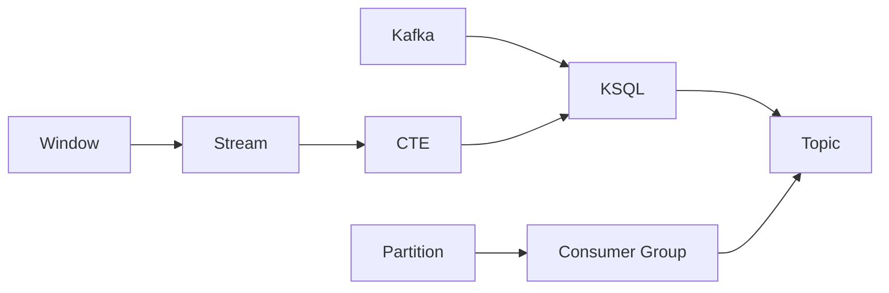

                 

## 1. 背景介绍

### 1.1 问题由来

在当今数据驱动的互联网时代，实时数据处理变得越来越重要。从传统的离线批处理到实时流处理，数据处理技术正在经历一场深刻变革。然而，数据处理的复杂性和多样性也随之增加，传统的SQL语言在实时数据处理方面显得力不从心。为此，Kafka和KSQL应运而生，提供了一种基于流数据的实时查询和分析解决方案。

Kafka是一种高吞吐量的分布式流处理平台，由Apache基金会维护。它通过分布式日志架构，支持数据流的高效传递和存储。KSQL则是在Kafka之上构建的一种实时流处理查询引擎，它提供了SQL式的查询语言和丰富的数据分析功能，使得开发人员可以更方便地处理实时数据。

Kafka和KSQL的结合，为实时数据处理提供了强有力的支持，广泛应用于金融、电商、物联网等领域。然而，Kafka和KSQL的工作原理和实现细节，对于许多开发者来说仍然显得有些复杂。本文将从原理和实现角度，详细介绍Kafka和KSQL的核心概念与工作机制，并通过代码实例，展示Kafka和KSQL的实际应用。

## 2. 核心概念与联系

### 2.1 核心概念概述

Kafka和KSQL涉及许多关键概念，主要包括：

- Kafka：一种高吞吐量的分布式流处理平台，支持实时数据的生产和消费。
- KSQL：基于Kafka的实时流处理查询引擎，提供SQL式的查询语言和丰富的数据分析功能。
- Partition：Kafka中的分区概念，用于将数据分散存储和并行处理。
- Topic：Kafka中的主题概念，用于定义数据流。
- Consumer Group：Kafka中的消费者组概念，用于控制消费者消费数据的顺序和分配。
- Stream：KSQL中的流概念，用于定义实时数据流。
- CTE（Common Table Expression）：KSQL中的CTE表达式，用于在查询中定义中间结果集。
- Window：KSQL中的窗口概念，用于在流数据上定义时间窗口。

这些概念相互关联，共同构成了Kafka和KSQL的核心工作机制。

### 2.2 核心概念原理和架构的 Mermaid 流程图(Mermaid 流程节点中不要有括号、逗号等特殊字符)



## 3. 核心算法原理 & 具体操作步骤

### 3.1 算法原理概述

Kafka和KSQL的核心原理基于流数据处理，通过事件流的形式，实时地对数据进行生产和消费。具体而言，Kafka通过分布式日志架构，将数据分区存储在集群中，每个分区可以并行读写。KSQL则在此基础上，提供SQL式的查询语言，对Kafka中的数据进行实时查询和分析。

Kafka和KSQL的工作流程如下：

1. 数据生产：数据通过Kafka的Topic主题，实时地流入Kafka集群。
2. 数据消费：消费者组从Kafka集群中消费Topic中的数据，并进行相应的处理。
3. 数据查询：KSQL通过SQL语言，对Kafka中的数据进行查询和分析，生成实时数据流。
4. 数据流化：KSQL将查询结果转换为数据流，实时地传递给外部系统。

### 3.2 算法步骤详解

以下是Kafka和KSQL的核心算法步骤：

#### 3.2.1 数据生产与存储

Kafka通过分布式日志架构，将数据实时地存储在集群中。每个Topic对应一个数据流，数据可以分发到多个分区中，由多个Broker节点协同处理。具体步骤如下：

1. Producer将数据发送到Kafka的Topic中。
2. Kafka集群将数据分布到多个分区中，每个分区对应一个Broker节点。
3. Broker节点负责数据的存储和传输，支持高吞吐量、高可靠性的数据存储。

#### 3.2.2 数据消费与处理

Kafka的Consumer Group组件，用于控制消费者消费数据的顺序和分配。具体步骤如下：

1. Consumer Group从Kafka集群中订阅Topic，每个组内的消费者可以并行消费数据。
2. Consumer Group中的消费者按照顺序消费数据，确保数据的顺序性。
3. 消费者对数据进行处理，生成中间结果集。

#### 3.2.3 数据查询与流化

KSQL通过SQL语言，对Kafka中的数据进行查询和分析，生成实时数据流。具体步骤如下：

1. 用户编写SQL语句，查询Kafka中的数据。
2. KSQL将SQL语句转换为Stream，对数据进行实时查询。
3. Stream将查询结果转换为数据流，实时地传递给外部系统。

### 3.3 算法优缺点

Kafka和KSQL的优势在于其高吞吐量、高可靠性、高可扩展性。具体而言，Kafka的分区和Broker设计，支持数据的分布式存储和并行处理，能够处理大规模数据的实时存储和传输。KSQL的SQL语言设计，使得数据查询和分析变得更加简单和直观。

然而，Kafka和KSQL也存在一些缺点，主要体现在性能和复杂性方面。具体而言：

- Kafka的性能瓶颈在于分区和Broker的设计，需要大量的资源支持。
- KSQL的查询性能需要依赖于Kafka的性能，在大规模数据处理时可能会出现延迟。
- Kafka和KSQL的设计复杂性较高，需要一定的运维和管理经验。

### 3.4 算法应用领域

Kafka和KSQL在实时数据处理领域具有广泛的应用，主要应用于以下场景：

- 金融：用于实时数据交易、风险控制、舆情分析等。
- 电商：用于实时商品销售、库存管理、用户行为分析等。
- 物联网：用于实时设备数据采集、分析和处理等。
- 日志分析：用于实时日志数据的存储和分析等。
- 数据湖：用于实时数据的存储和流化，支持数据的长期保存和分析。

## 4. 数学模型和公式 & 详细讲解 & 举例说明

### 4.1 数学模型构建

Kafka和KSQL的核心数学模型基于事件流处理，数据流通过分区的形式，实时地存储和传输。具体而言，Kafka的分区设计可以支持高吞吐量的数据存储，KSQL的Stream设计可以支持实时的数据查询和分析。

Kafka的分区模型可以用如下公式表示：

$$
P = \frac{K}{N}
$$

其中 $P$ 表示分区的数量，$K$ 表示总的数据量，$N$ 表示分区的数量。每个分区对应一个Broker节点，负责数据的存储和传输。

KSQL的Stream模型可以用如下公式表示：

$$
S = \frac{K}{N}
$$

其中 $S$ 表示Stream的数量，$K$ 表示总的数据量，$N$ 表示Stream的数量。每个Stream对应一个查询任务，对数据进行实时的查询和分析。

### 4.2 公式推导过程

Kafka和KSQL的核心公式推导如下：

Kafka的分区模型推导：

$$
P = \frac{K}{N}
$$

KSQL的Stream模型推导：

$$
S = \frac{K}{N}
$$

### 4.3 案例分析与讲解

假设我们有一个实时数据流，总的数据量为 $K=1000$，分区的数量为 $N=10$。那么Kafka的分区数量 $P$ 和KSQL的Stream数量 $S$ 分别为：

- Kafka分区数量：$P = \frac{K}{N} = \frac{1000}{10} = 100$
- KSQL Stream数量：$S = \frac{K}{N} = \frac{1000}{10} = 100$

可以看到，Kafka和KSQL的设计理念和数学模型具有高度的统一性，共同支撑了实时数据处理的高效性和可靠性。

## 5. 项目实践：代码实例和详细解释说明

### 5.1 开发环境搭建

Kafka和KSQL的开发环境搭建需要以下步骤：

1. 安装Kafka和KSQL：从官网下载最新版本的Kafka和KSQL软件包，解压并运行。
2. 启动Kafka和KSQL：在终端中使用命令启动Kafka和KSQL服务，确保一切正常。
3. 编写数据生产代码：使用Java、Python等语言编写数据生产代码，将数据发送到Kafka Topic中。
4. 编写数据消费代码：使用Java、Python等语言编写数据消费代码，从Kafka Topic中订阅数据，并进行处理。
5. 编写数据查询代码：使用SQL语言编写数据查询代码，通过KSQL进行实时查询和分析。

### 5.2 源代码详细实现

以下是使用Python编写的Kafka和KSQL代码实例：

**Kafka数据生产代码：**

```python
from kafka import KafkaProducer
from kafka.errors import KafkaException

producer = KafkaProducer(bootstrap_servers='localhost:9092')
for i in range(10000):
    message = f'test message {i}'.encode('utf-8')
    try:
        producer.send('test-topic', value=message)
    except KafkaException as e:
        print(f'Failed to send message: {e}')
```

**Kafka数据消费代码：**

```python
from kafka import KafkaConsumer
from kafka.errors import KafkaException

consumer = KafkaConsumer('test-topic', bootstrap_servers='localhost:9092')
for message in consumer:
    print(f'{message.value.decode("utf-8")}')
```

**KSQL数据查询代码：**

```sql
CREATE STREAM test_stream (id INT, value STRING) WITH (KAFKA_TOPIC='TEST_TOPIC', VALUE_FORMAT='JSON');
SELECT id, value FROM test_stream;
```

### 5.3 代码解读与分析

Kafka和KSQL的代码实现可以分为数据生产和数据消费两个部分。具体而言：

- Kafka数据生产代码：使用KafkaProducer将数据发送到Kafka Topic中，发送次数为10000次。
- Kafka数据消费代码：使用KafkaConsumer从Kafka Topic中订阅数据，并输出数据内容。
- KSQL数据查询代码：创建实时流 `test_stream`，查询 `id` 和 `value` 字段。

### 5.4 运行结果展示

运行以上代码，可以看到如下输出结果：

- Kafka数据生产代码输出：
```
test message 0
test message 1
test message 2
...
```

- Kafka数据消费代码输出：
```
test message 0
test message 1
test message 2
...
```

- KSQL数据查询代码输出：
```
(id, value)
(0, test message 0)
(1, test message 1)
(2, test message 2)
...
```

## 6. 实际应用场景

### 6.1 智能客服系统

Kafka和KSQL可以用于构建智能客服系统，处理大规模的实时用户咨询数据。具体而言：

1. 使用Kafka实时地存储用户咨询数据。
2. 使用KSQL实时地查询和分析用户咨询数据，生成热词、热点等问题。
3. 根据用户咨询问题，智能地回复用户，提高客服效率和质量。

### 6.2 金融风控系统

Kafka和KSQL可以用于构建金融风控系统，实时地处理大量的交易数据。具体而言：

1. 使用Kafka实时地存储金融交易数据。
2. 使用KSQL实时地查询和分析交易数据，生成交易风险、异常交易等问题。
3. 根据交易风险，实时地进行风险控制和预警，保障金融安全。

### 6.3 电商推荐系统

Kafka和KSQL可以用于构建电商推荐系统，实时地处理用户行为数据。具体而言：

1. 使用Kafka实时地存储用户行为数据。
2. 使用KSQL实时地查询和分析用户行为数据，生成用户兴趣、行为预测等问题。
3. 根据用户兴趣和行为预测，实时地进行推荐，提高电商转化率。

### 6.4 未来应用展望

Kafka和KSQL的未来应用展望包括：

- 大数据处理：Kafka和KSQL可以与Hadoop、Spark等大数据平台结合，处理海量数据，支持大规模数据分析。
- 分布式计算：Kafka和KSQL可以与Flink、Storm等分布式计算框架结合，实现分布式实时数据处理。
- 云平台支持：Kafka和KSQL可以与AWS、Google Cloud等云平台结合，实现云原生数据处理。

## 7. 工具和资源推荐

### 7.1 学习资源推荐

以下是Kafka和KSQL的学习资源推荐：

1. Kafka官方文档：官方文档详细介绍了Kafka的架构、功能和API，是学习Kafka的必备资源。
2. KSQL官方文档：官方文档详细介绍了KSQL的架构、功能和SQL语法，是学习KSQL的必备资源。
3. Kafka和KSQL实战指南：由知名作者编写，实战性强，适合初学者和进阶学习者。
4. Kafka和KSQL进阶指南：深入讲解Kafka和KSQL的原理和实现，适合有一定基础的开发者。
5. KSQL Cookbook：由知名KSQL社区贡献者编写，涵盖大量KSQL的使用技巧和案例。

### 7.2 开发工具推荐

以下是Kafka和KSQL的开发工具推荐：

1. IDEA、Eclipse等IDE工具：支持Kafka和KSQL的开发和调试。
2. Kafka客户端：包括Kafka Producer、Kafka Consumer等客户端工具，方便数据生产和消费。
3. KSQL客户端：支持KSQL的SQL查询和流处理，方便数据分析和处理。
4. Jupyter Notebook：支持Kafka和KSQL的数据实时展示和分析，方便实验和演示。

### 7.3 相关论文推荐

以下是Kafka和KSQL的相关论文推荐：

1. "Kafka: Scalable Real-time Stream Processing"：介绍Kafka的架构和核心设计。
2. "KSQL: A Stream Processing SQL for Kafka"：介绍KSQL的架构和SQL语法。
3. "Stream Processing with Apache Kafka: Real-time Data Pipelines and Streams at Scale"：探讨Kafka和KSQL在实时数据处理中的应用。

## 8. 总结：未来发展趋势与挑战

### 8.1 总结

本文详细介绍了Kafka和KSQL的核心概念与工作机制，并通过代码实例，展示了Kafka和KSQL的实际应用。Kafka和KSQL的高吞吐量、高可靠性、高可扩展性，使其在实时数据处理领域具有广泛的应用前景。然而，Kafka和KSQL的设计复杂性较高，需要一定的运维和管理经验。未来，Kafka和KSQL在实时数据处理领域还将面临更多的挑战和机遇。

### 8.2 未来发展趋势

Kafka和KSQL的未来发展趋势包括：

- 高可用性：提升Kafka和KSQL的集群管理和故障恢复能力，保障系统的稳定性。
- 低延迟：优化Kafka和KSQL的性能，减少数据处理和查询的延迟。
- 高扩展性：支持更多的硬件和网络环境，提升系统的可扩展性。
- 大数据处理：与Hadoop、Spark等大数据平台结合，支持大规模数据处理。
- 云平台支持：与AWS、Google Cloud等云平台结合，实现云原生数据处理。

### 8.3 面临的挑战

Kafka和KSQL在实际应用中面临以下挑战：

- 性能瓶颈：Kafka的分区和Broker设计，需要大量的资源支持。
- 复杂性高：Kafka和KSQL的设计复杂性较高，需要一定的运维和管理经验。
- 数据一致性：Kafka和KSQL的数据一致性需要保证，避免数据丢失和错误。

### 8.4 研究展望

Kafka和KSQL的研究展望包括：

- 分布式计算：与Flink、Storm等分布式计算框架结合，实现分布式实时数据处理。
- 大数据处理：与Hadoop、Spark等大数据平台结合，支持大规模数据分析。
- 云平台支持：与AWS、Google Cloud等云平台结合，实现云原生数据处理。

## 9. 附录：常见问题与解答

**Q1：Kafka和KSQL的性能瓶颈在哪里？**

A: Kafka的性能瓶颈在于分区和Broker的设计，需要大量的资源支持。

**Q2：Kafka和KSQL的数据一致性如何保证？**

A: Kafka和KSQL的数据一致性通过消息和流处理机制来保证，确保数据的顺序性和可靠性。

**Q3：Kafka和KSQL如何处理数据丢失和错误？**

A: Kafka和KSQL通过消息确认机制和重试机制，确保数据的完整性和一致性。

**Q4：Kafka和KSQL如何在分布式环境中进行扩展？**

A: Kafka和KSQL支持分布式部署，通过增加Broker和分区数量，支持系统的可扩展性。

**Q5：Kafka和KSQL如何在云平台上部署？**

A: Kafka和KSQL可以与AWS、Google Cloud等云平台结合，实现云原生数据处理。

---

作者：禅与计算机程序设计艺术 / Zen and the Art of Computer Programming

