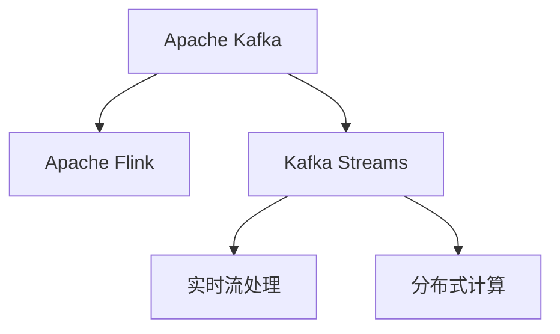

                 

## 1. 背景介绍

### 1.1 问题由来
在当今数据驱动的互联网时代，实时数据流处理变得越来越重要。随着大数据技术的发展，企业内部和外部的数据量呈指数级增长，如何高效地处理和分析这些实时数据流，成为了众多公司面临的挑战。Kafka Streams是一个开源的、分布式的流式数据处理平台，它基于Apache Kafka的消息队列和Apache Flink的流式计算引擎，提供了一种高效、可扩展、可维护的实时数据处理解决方案。

### 1.2 问题核心关键点
Kafka Streams的核心在于其基于Apache Kafka消息队列的实时流式数据处理能力。通过将Apache Kafka与Apache Flink结合，Kafka Streams能够实现数据的实时收集、处理、存储和分析，从而为企业提供了一个强大的数据处理框架。它不仅支持复杂的流式处理操作，如窗口、聚合、过滤等，还提供了丰富的API和工具，使得开发者可以轻松地构建、测试和部署流式数据处理应用。

## 2. 核心概念与联系

### 2.1 核心概念概述

为更好地理解Kafka Streams的工作原理，本节将介绍几个关键概念：

- Apache Kafka：是一个分布式的流处理平台，提供高吞吐量、低延迟的消息传递能力，是Kafka Streams的基础设施。
- Apache Flink：是一个流式数据处理引擎，支持分布式流式处理和批处理，是Kafka Streams的计算引擎。
- Kafka Streams：基于Apache Kafka和Apache Flink的流式数据处理平台，提供了简单、高效、可扩展的流式数据处理解决方案。
- 实时流处理：指在数据产生后实时进行数据收集、处理和分析的过程，与批处理不同，实时流处理强调数据的低延迟和实时性。
- 分布式计算：指将数据处理任务分布到多个计算节点上并行执行，以提高处理效率和可扩展性。

这些核心概念之间的逻辑关系可以通过以下Mermaid流程图来展示：



这个流程图展示了大数据生态系统中的核心组件及其相互关系：

1. Apache Kafka提供分布式消息队列。
2. Apache Flink提供分布式计算引擎，支持流式处理和批处理。
3. Kafka Streams基于Kafka和Flink，构建实时流式处理应用。
4. 实时流处理强调数据的低延迟和实时性。
5. 分布式计算将数据处理任务并行分配到多个节点执行，提高处理效率和可扩展性。

这些概念共同构成了Kafka Streams的流式数据处理框架，使得它能够高效、可扩展地处理实时数据流。

## 3. 核心算法原理 & 具体操作步骤
### 3.1 算法原理概述

Kafka Streams的核心算法原理基于Apache Flink的流式处理框架。它通过将数据流转化为状态流，实时计算数据状态，最终生成输出流，从而实现数据的实时处理和分析。Kafka Streams的计算过程可以分为三个阶段：数据源收集、流式处理和输出流生成。

### 3.2 算法步骤详解

Kafka Streams的计算过程可以分为以下几个关键步骤：

**Step 1: 数据源收集**

Kafka Streams的数据源可以是Apache Kafka消息队列或其他流数据源。在应用中，数据源通常被定义为一个拓扑(Topology)，一个包含多个节点(Node)的计算图。节点之间通过传递数据流的形式进行连接，每个节点定义了特定的计算逻辑。

**Step 2: 流式处理**

在拓扑中，数据流经过多个节点进行处理。节点可以执行各种流式计算操作，如过滤、聚合、窗口、变换等。数据流在节点之间传递，并根据节点的逻辑进行变换。每个节点维护一个状态流，记录中间计算结果，以便后续节点使用。

**Step 3: 输出流生成**

数据流经过处理后，最终生成输出流。输出流可以是Apache Kafka消息队列或其他数据存储系统。Kafka Streams提供多种输出方式，如插入、覆盖、追加等，开发者可以根据需求灵活选择。

### 3.3 算法优缺点

Kafka Streams具有以下优点：

1. 高效实时处理：Kafka Streams提供低延迟、高吞吐量的实时数据处理能力，适合处理大规模数据流。
2. 分布式计算：通过分布式计算，Kafka Streams支持大规模数据处理和高可用性。
3. 弹性伸缩：Kafka Streams可以动态调整计算节点数量，以应对数据量变化。
4. 丰富的API和工具：Kafka Streams提供丰富的API和工具，使得开发者可以轻松构建、测试和部署流式数据处理应用。
5. 可靠性保障：Kafka Streams基于Apache Kafka的消息传递能力和Apache Flink的流式计算引擎，提供高可靠性和容错性。

同时，Kafka Streams也存在一些局限性：

1. 学习曲线较陡：由于Kafka Streams涉及多个概念和技术，初学者需要花费一定时间学习。
2. 性能优化复杂：Kafka Streams需要开发者对分布式计算和状态管理有深入理解，才能实现性能优化。
3. 资源消耗高：由于Kafka Streams需要维护大量的状态流和计算节点，资源消耗较大，需要较高的硬件配置。
4. 数据处理复杂性：Kafka Streams的流式计算逻辑复杂，开发者需要具备较强的编程和算法能力。

尽管存在这些局限性，Kafka Streams仍然是当前最为流行和成熟的实时流处理平台之一。

### 3.4 算法应用领域

Kafka Streams的应用领域非常广泛，适用于各种需要实时数据处理和分析的业务场景：

- 实时数据监控：收集和分析实时数据流，监控系统性能、用户行为等。
- 实时推荐系统：基于用户的实时行为数据，提供个性化的推荐服务。
- 实时欺诈检测：检测实时交易数据中的异常行为，保护企业免受欺诈侵害。
- 实时日志分析：分析实时日志数据，提供故障诊断、性能优化等服务。
- 实时流式计算：进行实时统计、聚合、分析等计算任务。

Kafka Streams在金融、电商、物流、医疗等多个行业得到广泛应用，为企业提供了强大的实时数据处理能力。

## 4. 数学模型和公式 & 详细讲解 & 举例说明

### 4.1 数学模型构建

Kafka Streams的计算过程可以建模为一个数据流图，如下所示：

```
input -> Processor -> output
```

其中，$input$表示输入数据流，$Processor$表示流式处理节点，$output$表示输出数据流。

### 4.2 公式推导过程

设数据流$input$为$x_t$，处理节点为$f$，输出流为$y_t$。则数据流处理过程可以表示为：

$$
y_t = f(x_t)
$$

其中$f$表示流式处理节点的计算逻辑。由于$x_t$和$y_t$均为时间序列数据，因此可以对公式进行离散化处理：

$$
y_{t+1} = f(x_{t+1}, y_t)
$$

这意味着，每个时间步上的输出数据流，取决于当前输入数据流和上一个时间步的输出数据流。

### 4.3 案例分析与讲解

以下是一个简单的Kafka Streams拓扑示例，用于计算某个时间窗口内的数据流平均值：

```python
from kafka import KafkaConsumer
from kafka import KafkaProducer
from kafka.streams import KStreamBuilder, StreamsConfig
from kafka.streams.kstream import KStream

# 定义拓扑结构
input_topic = 'input-topic'
output_topic = 'output-topic'
window_size = 5

config = StreamsConfig(
    bootstrap_servers=['localhost:9092'],
    group_id='stream1',
    key_deserializer=str,
    value_deserializer=int,
    auto_commit_interval_ms=1000,
)

builder = KStreamBuilder()
input = builder.stream(input_topic)
windowed_stream = input.windowed_by_times(window_size)
average_stream = windowed_stream.map(lambda (key, value): (key, sum(value) / window_size))
output = average_stream.to(output_topic, value_serializer=str)
builder.add_stream(output)

# 启动拓扑
start_stream(builder, config)

# 停止拓扑
stop_stream(builder)
```

在这个例子中，我们定义了一个简单的拓扑结构，包括一个输入流、一个滑动窗口流、一个流式计算流和一个输出流。数据源为Kafka消息队列，处理逻辑为计算每个时间窗口内的平均值。最终结果输出到另一个Kafka消息队列。

## 5. 项目实践：代码实例和详细解释说明
### 5.1 开发环境搭建

在进行Kafka Streams开发前，需要先搭建好Apache Kafka和Apache Flink环境。

- Apache Kafka：可以从官网下载安装包，并按照官方文档进行安装。
- Apache Flink：可以从官网下载安装包，并按照官方文档进行安装。

安装完成后，需要配置好Kafka Streams的运行环境，包括Apache Flink的流式计算引擎和Apache Kafka的消息队列。

### 5.2 源代码详细实现

以下是一个简单的Kafka Streams程序示例，用于计算某个时间窗口内的数据流平均值：

```python
from kafka import KafkaConsumer
from kafka import KafkaProducer
from kafka.streams import KStreamBuilder, StreamsConfig
from kafka.streams.kstream import KStream

# 定义拓扑结构
input_topic = 'input-topic'
output_topic = 'output-topic'
window_size = 5

config = StreamsConfig(
    bootstrap_servers=['localhost:9092'],
    group_id='stream1',
    key_deserializer=str,
    value_deserializer=int,
    auto_commit_interval_ms=1000,
)

builder = KStreamBuilder()
input = builder.stream(input_topic)
windowed_stream = input.windowed_by_times(window_size)
average_stream = windowed_stream.map(lambda (key, value): (key, sum(value) / window_size))
output = average_stream.to(output_topic, value_serializer=str)
builder.add_stream(output)

# 启动拓扑
start_stream(builder, config)

# 停止拓扑
stop_stream(builder)
```

这个程序首先定义了一个拓扑结构，包括一个输入流、一个滑动窗口流、一个流式计算流和一个输出流。然后，使用KStreamBuilder创建KStream对象，并定义了拓扑的计算逻辑。最后，使用start_stream和stop_stream函数启动和停止拓扑。

### 5.3 代码解读与分析

让我们再详细解读一下关键代码的实现细节：

**KStreamBuilder**：
- `KStreamBuilder`：用于创建KStream对象的类，是Kafka Streams的核心API之一。
- `stream`方法：用于创建输入流，从Kafka消息队列中获取数据。
- `windowed_by_times`方法：用于创建滑动窗口流，对数据流进行时间窗口划分。
- `map`方法：用于对窗口内的数据流进行计算，计算平均值。
- `to`方法：用于创建输出流，将计算结果输出到Kafka消息队列中。

**StreamsConfig**：
- `StreamsConfig`：用于配置Kafka Streams运行环境的类，包含连接参数、分组ID、反序列化器等关键配置项。

**start_stream和stop_stream函数**：
- `start_stream`：启动Kafka Streams拓扑，开始数据流处理。
- `stop_stream`：停止Kafka Streams拓扑，关闭数据流处理。

在代码中，我们使用了Kafka Streams提供的API和工具，构建了一个简单的数据流处理拓扑，计算每个时间窗口内的平均值，并将结果输出到Kafka消息队列中。开发者可以根据具体需求，灵活使用Kafka Streams提供的各种API和工具，构建更复杂的流式数据处理应用。

### 5.4 运行结果展示

运行以上代码，可以看到计算出的平均值的实时数据流被输出到Kafka消息队列中。

## 6. 实际应用场景

### 6.1 实时数据监控

在实时数据监控应用中，Kafka Streams可以实时收集和分析企业内部的各种数据流，如日志数据、交易数据、用户行为数据等。通过对这些数据流进行实时监控，企业可以快速发现系统异常、故障或性能瓶颈，及时采取措施，保障业务稳定运行。

### 6.2 实时推荐系统

在实时推荐系统中，Kafka Streams可以实时分析用户的实时行为数据，并根据用户的兴趣和偏好，生成个性化的推荐服务。通过实时推荐，企业可以提升用户满意度，增加用户黏性，提升业务收益。

### 6.3 实时欺诈检测

在实时欺诈检测应用中，Kafka Streams可以实时分析交易数据，检测异常行为，防止欺诈行为发生。通过实时检测，企业可以及时发现和防范欺诈风险，保障资金安全。

### 6.4 实时日志分析

在实时日志分析应用中，Kafka Streams可以实时收集和分析企业的日志数据，进行故障诊断、性能优化等服务。通过实时分析，企业可以快速定位问题，提高系统稳定性和可靠性。

### 6.5 实时流式计算

在实时流式计算应用中，Kafka Streams可以实时计算数据流统计信息、聚合信息、趋势分析等，为企业提供实时数据分析服务。通过实时计算，企业可以快速获取决策依据，优化业务策略。

## 7. 工具和资源推荐

### 7.1 学习资源推荐

为了帮助开发者系统掌握Kafka Streams的理论基础和实践技巧，这里推荐一些优质的学习资源：

1. Kafka Streams官方文档：Kafka Streams的官方文档，详细介绍了Kafka Streams的API、配置和使用场景。
2. Kafka Streams实战指南：一本关于Kafka Streams的实战书籍，详细介绍了Kafka Streams的开发和优化技巧。
3. Apache Kafka官方文档：Kafka的官方文档，介绍了Kafka的消息队列原理和配置。
4. Apache Flink官方文档：Flink的官方文档，介绍了Flink的流式计算引擎和API。
5. Kafka Streams博客：Kafka Streams社区维护的博客，分享了大量的Kafka Streams开发经验和最佳实践。

通过对这些资源的学习实践，相信你一定能够快速掌握Kafka Streams的精髓，并用于解决实际的流式数据处理问题。

### 7.2 开发工具推荐

Kafka Streams开发需要依赖多个开源工具和库，以下是几款常用的开发工具：

1. Kafka：Apache Kafka是一个分布式的消息队列，是Kafka Streams的基础设施。
2. Flink：Apache Flink是一个流式数据处理引擎，是Kafka Streams的计算引擎。
3. KStreamBuilder：Kafka Streams的API之一，用于创建KStream对象。
4. StreamsConfig：Kafka Streams的API之一，用于配置Kafka Streams运行环境。
5. Confluent：Kafka Streams的官方商业版本，提供了更多的特性和工具支持。

合理利用这些工具，可以显著提升Kafka Streams的开发效率，加快创新迭代的步伐。

### 7.3 相关论文推荐

Kafka Streams的发展源于学界的持续研究。以下是几篇奠基性的相关论文，推荐阅读：

1. "Streams: Simplifying Complex Data Pipelines with Kafka and Flink"：Kafka Streams的论文，介绍了Kafka Streams的原理和设计思想。
2. "Stream Processing with Apache Flink"：Flink的论文，介绍了Flink的流式计算引擎和API。
3. "Kafka: The Scalable Message Broker"：Kafka的论文，介绍了Kafka的消息队列原理和实现。
4. "Stream Processing at Scale: A Fault Tolerant Approach to Event Stream Processing"：Flink的论文，介绍了Flink的流式处理和容错机制。

这些论文代表了大数据流处理技术的发展脉络。通过学习这些前沿成果，可以帮助研究者把握学科前进方向，激发更多的创新灵感。

## 8. 总结：未来发展趋势与挑战

### 8.1 总结

本文对Kafka Streams进行了全面系统的介绍。首先阐述了Kafka Streams的应用背景和核心概念，明确了Kafka Streams在大数据生态系统中的地位。其次，从原理到实践，详细讲解了Kafka Streams的计算过程，并给出了微调范式的代码示例。同时，本文还广泛探讨了Kafka Streams在各个行业领域的应用场景，展示了其强大的数据处理能力。

通过本文的系统梳理，可以看到，Kafka Streams是一个高效、可扩展、可维护的流式数据处理平台，是企业处理大规模实时数据流的理想选择。Kafka Streams基于Apache Kafka和Apache Flink的强大技术栈，提供了一套完整的实时数据处理解决方案，为开发者构建高质量的数据流处理应用提供了坚实的基础。

### 8.2 未来发展趋势

展望未来，Kafka Streams将呈现以下几个发展趋势：

1. 支持更多数据源：Kafka Streams将支持更多的数据源，如Apache Pulsar、Apache RocketMQ等，使得开发者可以灵活选择适合自己的数据处理平台。
2. 提升计算性能：Kafka Streams将进一步优化计算引擎，支持更多的计算操作和复杂计算任务，提高计算性能。
3. 强化数据一致性：Kafka Streams将强化数据一致性和容错性，提高数据处理的可靠性和稳定性。
4. 支持更多计算引擎：Kafka Streams将支持更多的计算引擎，如Apache Spark、Apache Beam等，提供更加灵活的数据处理解决方案。
5. 强化生态系统：Kafka Streams将进一步整合Apache生态系统，提供更加丰富的工具和库支持。

这些趋势将进一步增强Kafka Streams的竞争力，使其在未来大数据流处理市场中占据更加重要的位置。

### 8.3 面临的挑战

尽管Kafka Streams已经取得了瞩目成就，但在迈向更加智能化、普适化应用的过程中，它仍面临着诸多挑战：

1. 学习曲线较陡：Kafka Streams涉及多个概念和技术，初学者需要花费一定时间学习。
2. 性能优化复杂：Kafka Streams需要开发者对分布式计算和状态管理有深入理解，才能实现性能优化。
3. 资源消耗高：由于Kafka Streams需要维护大量的状态流和计算节点，资源消耗较大，需要较高的硬件配置。
4. 数据处理复杂性：Kafka Streams的流式计算逻辑复杂，开发者需要具备较强的编程和算法能力。

尽管存在这些挑战，但Kafka Streams仍然是当前最为流行和成熟的实时流处理平台之一。

### 8.4 未来突破

面对Kafka Streams所面临的挑战，未来的研究需要在以下几个方面寻求新的突破：

1. 简化学习曲线：通过提供更加友好易用的开发工具和文档，降低Kafka Streams的学习门槛，吸引更多开发者加入。
2. 提升性能优化：优化计算引擎和状态管理算法，提高Kafka Streams的性能和扩展性。
3. 降低资源消耗：优化状态流存储和管理，减少Kafka Streams的资源消耗。
4. 简化数据处理：提供更简洁易用的API和工具，简化Kafka Streams的数据处理逻辑。
5. 强化生态系统：进一步整合Apache生态系统，提供更多工具和库支持，提升Kafka Streams的生态系统竞争力。

这些研究方向将进一步推动Kafka Streams的成熟和发展，使其在未来大数据流处理市场中占据更加重要的位置。

## 9. 附录：常见问题与解答

**Q1：Kafka Streams如何保证数据一致性？**

A: Kafka Streams通过Apache Flink的流式处理引擎，保证数据的一致性和准确性。在Kafka Streams中，数据流被划分为多个时间窗口，每个窗口内的数据流通过累加器(Accumulator)进行计算。累加器的计算结果是最终输出流的一部分，并且保证了数据的一致性。此外，Kafka Streams还支持流式快照(Snapshot)，将状态流保存在持久化存储中，防止数据丢失和计算错误。

**Q2：Kafka Streams如何处理大规模数据流？**

A: Kafka Streams通过Apache Flink的流式计算引擎，支持大规模数据流处理。Flink的流式计算引擎能够并行化计算任务，将数据流分成多个分区，分配到多个计算节点上进行并行计算，从而提高计算效率和可扩展性。在Kafka Streams中，数据流被划分为多个分区，每个分区可以在独立的计算节点上进行并行计算，有效地处理大规模数据流。

**Q3：Kafka Streams如何进行流式状态管理？**

A: Kafka Streams通过Apache Flink的流式计算引擎，实现流式状态管理。Flink的状态管理器支持持久化和弹性化存储，能够将状态流保存在分布式文件系统中，并支持自动恢复和容错。在Kafka Streams中，状态流被保存在Flink的状态管理器中，通过并行化和分区处理，支持大规模流式状态管理。

**Q4：Kafka Streams如何优化计算性能？**

A: Kafka Streams可以通过以下方式优化计算性能：
1. 选择合适的数据源和数据分区。将数据源和数据分区进行合理分配，使得数据流能够在计算节点上进行并行化处理。
2. 优化流式计算逻辑。通过优化流式计算逻辑，减少不必要的计算和状态存储，提高计算效率。
3. 调整状态管理器配置。调整状态管理器的配置参数，如并发度、检查点间隔等，提高状态管理和计算性能。
4. 使用分布式缓存。通过使用分布式缓存，如Redis、Memcached等，提高计算性能和数据访问效率。

这些优化措施可以显著提升Kafka Streams的计算性能和可扩展性，使得其能够更好地处理大规模数据流。

**Q5：Kafka Streams如何进行容错处理？**

A: Kafka Streams通过Apache Flink的流式计算引擎，实现容错处理。Flink的状态管理器支持分布式快照和状态恢复，能够自动恢复和处理计算节点故障。在Kafka Streams中，状态流被保存在Flink的状态管理器中，通过并行化和分区处理，支持分布式快照和状态恢复。此外，Kafka Streams还支持自动恢复和重处理，能够自动重处理数据流，确保数据处理的可靠性和一致性。

这些容错机制可以显著提高Kafka Streams的可靠性和稳定性，使得其能够更好地处理大规模数据流。

---

作者：禅与计算机程序设计艺术 / Zen and the Art of Computer Programming

