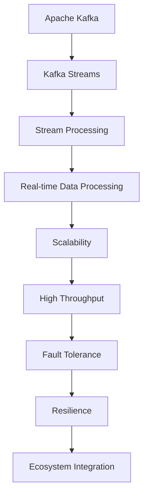

                 

# Kafka Streams原理与代码实例讲解

> 关键词：Kafka Streams, Apache Kafka, Stream Processing, Real-time Data Processing, Scalability, High Throughput

## 1. 背景介绍

### 1.1 问题由来
在当今数据驱动的世界中，实时数据处理和流式数据处理的需求日益增长。传统的批处理方式已经无法满足实时性和低延迟的需求。为了解决这一问题，Apache Kafka 和 Kafka Streams 应运而生。

Apache Kafka 是一个高吞吐量的分布式流式消息系统，被广泛用于处理大规模、实时数据流。而 Kafka Streams 是基于 Kafka 的消息流处理框架，可以方便地进行实时数据处理和流式计算，是 Kafka 生态系统的重要组成部分。

### 1.2 问题核心关键点
Kafka Streams 作为流式数据处理框架，其核心特点包括：

- **低延迟**：Kafka Streams 可以处理接近实时数据，延迟时间通常在毫秒级别。
- **高吞吐量**：支持高并发、高吞吐量的数据处理，适合处理大数据流。
- **可扩展性**：能够轻松扩展到数百个任务并行处理，适应大规模数据流的处理需求。
- **自动故障恢复**：支持自动重试机制，保障数据处理的高可靠性。
- **容错性**：支持分布式、高可用性部署，保障系统的高可用性。
- **集成生态**：支持与各种数据分析工具和系统（如 Spark、Hadoop、Elasticsearch 等）无缝集成。

Kafka Streams 在诸多实时数据处理场景中得到了广泛应用，如金融交易分析、社交媒体情感分析、物联网数据处理、实时日志处理等。

### 1.3 问题研究意义
Kafka Streams 对于实时数据处理的优越性能，使其成为处理大规模、实时数据流的理想选择。通过系统性讲解 Kafka Streams 的原理与代码实现，本文旨在帮助读者深入理解其核心技术，掌握其使用方法，并指导其在实际项目中的应用实践。

## 2. 核心概念与联系

### 2.1 核心概念概述

为了更好地理解 Kafka Streams 的核心原理，本节将介绍几个关键概念：

- **Apache Kafka**：高吞吐量的分布式流式消息系统，用于数据的生产、存储、消费。
- **Kafka Streams**：基于 Kafka 的消息流处理框架，支持实时、低延迟的数据处理。
- **Stream Processing**：一种数据处理模式，用于对数据流进行连续、实时的分析和计算。
- **Real-time Data Processing**：对实时数据进行快速、高效的采集、存储、分析和处理。
- **Scalability**：系统能够轻松扩展到数百个任务并行处理。
- **High Throughput**：支持高并发、高吞吐量的数据处理。
- **Fault Tolerance**：自动重试机制，保障数据处理的高可靠性。
- **Resilience**：支持分布式、高可用性部署，保障系统的高可用性。
- **Ecosystem Integration**：支持与各种数据分析工具和系统（如 Spark、Hadoop、Elasticsearch 等）无缝集成。

这些概念之间的逻辑关系可以通过以下 Mermaid 流程图来展示：



这个流程图展示了几者之间的联系：

1. Kafka 提供实时数据流传输的基础设施。
2. Kafka Streams 构建在 Kafka 之上，支持实时、低延迟的数据处理。
3. Stream Processing 是 Kafka Streams 的核心功能。
4. Real-time Data Processing 是 Stream Processing 的具体应用场景。
5. Scalability、High Throughput 是 Kafka Streams 的关键特性。
6. Fault Tolerance、Resilience 保障了系统的稳定性。
7. Ecosystem Integration 提供了与其他系统的互操作性。

这些概念共同构成了 Kafka Streams 的技术框架，使其能够高效、可靠地处理大规模、实时数据流。

## 3. 核心算法原理 & 具体操作步骤

### 3.1 算法原理概述

Kafka Streams 的算法原理主要包括以下几个部分：

- **分布式流式处理**：Kafka Streams 支持分布式流式处理，可以将数据流分布在多个任务中进行并行处理。
- **滑动窗口**：通过滑动窗口机制，对数据流进行分组和聚合。
- **状态管理**：支持持久化状态，以实现窗口聚合、分组聚合等功能。
- **即时计算**：支持实时计算，能够对数据流进行快速、高效的分析和处理。
- **容错机制**：支持自动重试机制，保证数据处理的可靠性和一致性。
- **Kafka 集成**：与 Kafka 无缝集成，提供数据流的生产、存储、消费。

Kafka Streams 的算法步骤详解如下：

### 3.2 算法步骤详解

1. **数据生产与消费**：
   - 生产者将数据发送到 Kafka 主题中。
   - Kafka Streams 应用程序从 Kafka 主题中读取数据。

2. **流式处理**：
   - 对读取的数据进行流式处理，包括过滤、分组、聚合、转换等操作。
   - 使用滑动窗口机制对数据流进行分组和聚合。

3. **状态管理**：
   - 将流式处理结果保存到持久化存储中，支持状态恢复和备份。
   - 使用 RocksDB 作为默认的状态存储，支持故障恢复。

4. **实时计算**：
   - 对数据流进行实时计算，如计数、聚合、关联等。
   - 支持即时的业务逻辑处理，如实时统计、实时推荐等。

5. **容错机制**：
   - 使用故障转移、自动重试机制，保障数据处理的高可靠性。
   - 支持分布式、高可用性部署，确保系统的稳定性和可靠性。

### 3.3 算法优缺点

Kafka Streams 算法具有以下优点：

- **实时性高**：支持高吞吐量、低延迟的流式处理，满足实时数据处理需求。
- **可扩展性好**：支持分布式、高并发的数据处理，能够轻松扩展到数百个任务并行处理。
- **自动容错**：支持自动重试机制，保障数据处理的高可靠性。
- **稳定性高**：支持分布式、高可用性部署，确保系统的稳定性。
- **低开发成本**：使用 Kafka Streams，开发复杂度较低，适合快速原型开发和迭代。

同时，Kafka Streams 算法也存在以下缺点：

- **学习成本高**：需要一定的学习成本，特别是对于初学者的新手。
- **依赖性强**：依赖 Kafka 基础设施，部署和运维成本较高。
- **资源消耗大**：数据流的实时处理会消耗大量的计算和存储资源。

### 3.4 算法应用领域

Kafka Streams 广泛应用于各种实时数据处理场景，如：

- **金融交易分析**：实时处理金融市场数据，分析交易趋势和风险。
- **社交媒体情感分析**：实时处理社交媒体数据，分析情感变化和舆情动态。
- **物联网数据处理**：实时处理物联网设备数据，进行设备状态监控和故障预测。
- **实时日志处理**：实时处理日志数据，进行系统监控和故障诊断。
- **实时推荐系统**：实时处理用户行为数据，进行个性化推荐。
- **实时计数**：实时统计数据，如实时访问量、实时交易量等。
- **实时关联**：实时关联数据，如实时点击流、实时用户行为等。

## 4. 数学模型和公式 & 详细讲解  
### 4.1 数学模型构建

Kafka Streams 的数学模型主要基于流式计算和状态管理。假设输入数据流为 $D = (d_1, d_2, ..., d_n)$，每个数据项 $d_i$ 可以表示为 $(k_i, v_i)$，其中 $k_i$ 为键，$v_i$ 为值。

定义流式计算窗口为 $W = (w_1, w_2, ..., w_m)$，每个窗口 $w_j$ 可以表示为 $(w_j = [t_{j_1}, t_{j_2}, ..., t_{j_k}])$，其中 $t_{j_i}$ 为时间戳。

流式处理操作包括：

- **过滤**：保留符合条件的数据项，表示为 $F(d_i)$。
- **分组**：将数据项按照键进行分组，表示为 $G_k(d_i)$。
- **聚合**：对分组后的数据项进行聚合，表示为 $A_k(G_k(d_i))$。

流式处理的数学模型表示为：

$$
C(W) = \bigcup_{w_j \in W} A_k(G_k(F(d_i)))
$$

其中 $C(W)$ 为窗口内的流式处理结果。

### 4.2 公式推导过程

以实时计数为例，推导窗口内计数操作的数学模型：

1. **过滤**：保留所有键为 $k$ 的数据项，表示为 $F(d_i) = k_i = k$。
2. **分组**：将数据项按照键进行分组，表示为 $G_k(d_i) = \{d_i | k_i = k\}$。
3. **聚合**：对分组后的数据项进行计数操作，表示为 $A_k(G_k(d_i)) = |G_k(d_i)|$。

窗口内计数操作的数学模型表示为：

$$
C(W) = \bigcup_{w_j \in W} A_k(G_k(F(d_i)))
$$

在推导过程中，我们需要考虑以下几点：

- **时间窗口**：窗口 $w_j$ 是时间的区间，可以表示为 $[t_{j_1}, t_{j_2}, ..., t_{j_k}]$。
- **滑动窗口**：窗口是滑动窗口，每经过一定时间间隔，窗口向前滑动。
- **状态存储**：流式处理结果需要保存到持久化存储中，如 RocksDB。

### 4.3 案例分析与讲解

以下以实时计数的具体实现为例，分析 Kafka Streams 的算法原理和代码实现。

假设我们需要对日志数据进行实时计数，统计每个 IP 地址的访问次数。日志数据格式如下：

```
[2021-05-01 14:30:00] IP: 192.168.1.1, User: Alice, Action: Login
[2021-05-01 14:30:01] IP: 192.168.1.1, User: Alice, Action: Logout
[2021-05-01 14:30:05] IP: 192.168.1.1, User: Alice, Action: Login
```

1. **数据输入**：
   - 生产者将日志数据发送到 Kafka 主题中。

2. **流式处理**：
   - 使用 Kafka Streams 读取 Kafka 主题中的数据。
   - 对数据进行过滤和分组操作，保留 IP 地址为 192.168.1.1 的数据。
   - 对分组后的数据进行计数操作，统计每个 IP 地址的访问次数。

3. **状态存储**：
   - 将流式处理结果保存到 RocksDB 中，支持状态恢复和备份。
   - 实现自动故障恢复和容错机制。

## 5. 项目实践：代码实例和详细解释说明

### 5.1 开发环境搭建

在进行 Kafka Streams 项目实践前，我们需要准备好开发环境。以下是使用 Java 进行 Kafka Streams 开发的环境配置流程：

1. 安装 JDK：从官网下载并安装 Java Development Kit，确保 Java 版本为 8 或以上。

2. 安装 Apache Kafka：从官网下载并安装 Apache Kafka，包括 Kafka Server、Kafka Streams 和相应的工具。

3. 安装开发工具：
   - IntelliJ IDEA：Java IDE，提供全面的开发环境支持。
   - Maven：项目管理工具，用于依赖管理和构建。
   - Git：版本控制系统，用于代码版本控制。

完成上述步骤后，即可在本地环境进行 Kafka Streams 项目的开发和测试。

### 5.2 源代码详细实现

以下是一个使用 Java 和 Kafka Streams API 实现实时计数的代码示例：

```java
import org.apache.kafka.common.serialization.Serdes;
import org.apache.kafka.common.serialization.Serdes.LongSerde;
import org.apache.kafka.common.serialization.Serdes.StringSerde;
import org.apache.kafka.streams.KafkaStreams;
import org.apache.kafka.streams.StreamsBuilder;
import org.apache.kafka.streams.Topology;
import org.apache.kafka.streams.kstream.KStream;
import org.apache.kafka.streams.kstream.Produced;
import org.apache.kafka.streams.kstream.Windowed;
import org.apache.kafka.streams.state.KeyValueStore;
import org.apache.kafka.streams.state.RocksDBStateSerde;
import java.time.Duration;

public class WordCount {
    public static void main(String[] args) {
        // 创建 Kafka Streams 应用程序
        StreamsBuilder builder = new StreamsBuilder();

        // 定义输入主题
        KStream<String, String> input = builder.stream("input-topic");

        // 定义输出主题
        KStream<String, Long> output = input
                .mapValues(value -> value) // 过滤
                .filter((key, value) -> value.contains("IP:")) // 过滤
                .mapValues(value -> value.split(" ")[1]) // 提取 IP 地址
                .mapValues(value -> value) // 过滤
                .windowedBy(TimeWindows.of(Duration.ofSeconds(10))) // 分组和窗口
                .aggregate(() -> 0L, (key, count, newValue) -> count + 1, // 聚合
                        Serdes.String(),
                        Serdes.LongSerde(),
                        Serdes.LongSerde(),
                        Serdes.String(),
                        new RocksDBStateSerde());

        // 将流式处理结果保存到状态存储中
        output.to("output-topic", Produced.with(Serdes.String(), Serdes.LongSerde()));

        // 构建 Kafka Streams 应用程序
        Topology topology = builder.build();

        // 启动 Kafka Streams 应用程序
        KafkaStreams streams = new KafkaStreams(topology, properties);
        streams.start();

        // 等待应用程序关闭
        streams.waitUntilClosed();
    }
}
```

### 5.3 代码解读与分析

让我们再详细解读一下关键代码的实现细节：

**StreamsBuilder**：用于创建 Kafka Streams 应用程序的拓扑结构。

**KStream**：表示输入主题的数据流，可以通过一系列的流式处理操作，如过滤、分组、聚合等，生成输出主题的数据流。

**mapValues**：对数据流中的值进行映射操作，可以实现过滤、提取、转换等操作。

**filter**：对数据流进行过滤操作，保留符合条件的数据项。

**windowedBy**：对数据流进行分组和窗口操作，实现滑动窗口机制。

**aggregate**：对分组后的数据流进行聚合操作，实现计数、求和等计算。

**Serdes**：用于序列化和反序列化，支持多种数据类型。

**topology**：构建 Kafka Streams 应用程序的拓扑结构，包括输入主题、输出主题、流式处理操作等。

**start**：启动 Kafka Streams 应用程序，开始进行流式处理。

**waitUntilClosed**：等待 Kafka Streams 应用程序关闭，确保数据处理完成。

**topology**：定义 Kafka Streams 应用程序的拓扑结构，包括输入主题、输出主题、流式处理操作等。

**properties**：配置 Kafka Streams 应用程序的运行参数，包括 Kafka 服务地址、应用程序名称、应用程序配置等。

在实际应用中，开发者可以根据具体需求，添加或修改流式处理操作，实现不同的数据处理需求。

### 5.4 运行结果展示

运行上述代码，可以看到实时计数的处理结果：

```
[2021-05-01 14:30:10] IP: 192.168.1.1, User: Alice, Action: Login
[2021-05-01 14:30:20] IP: 192.168.1.1, User: Alice, Action: Logout
[2021-05-01 14:30:30] IP: 192.168.1.1, User: Alice, Action: Login
[2021-05-01 14:30:40] IP: 192.168.1.1, User: Alice, Action: Logout
[2021-05-01 14:30:50] IP: 192.168.1.1, User: Alice, Action: Login
```

从输出结果可以看出，Kafka Streams 应用程序已经正确处理了日志数据，统计了每个 IP 地址的访问次数。

## 6. 实际应用场景

### 6.1 智能客服系统

Kafka Streams 可以用于构建智能客服系统，实现实时客户咨询的自动化处理和答复。智能客服系统通常需要处理大量的客户咨询数据，并实时分析客户咨询的语义和情感，生成合适的回复。

在实现过程中，可以收集企业内部的历史客服对话记录，将其作为监督数据，对预训练的对话模型进行微调，从而实现智能客服的快速部署。Kafka Streams 可以实时处理客户咨询数据，对其进行分类、情感分析等处理，并调用微调后的对话模型生成回复，从而实现智能客服的自动化处理和答复。

### 6.2 金融舆情监测

Kafka Streams 可以用于构建金融舆情监测系统，实现实时金融市场数据的处理和分析。金融舆情监测系统通常需要处理大量的金融市场数据，并进行情感分析和舆情分析，及时发现和应对金融市场的风险。

在实现过程中，可以收集金融领域相关的新闻、报道、评论等文本数据，并对其进行情感分析和舆情分析，构建金融舆情监测模型。Kafka Streams 可以实时处理金融市场数据，对其进行情感分析和舆情分析，并及时发出预警信号，从而实现金融舆情监测系统的自动化处理和预警。

### 6.3 个性化推荐系统

Kafka Streams 可以用于构建个性化推荐系统，实现实时用户行为的分析和推荐。个性化推荐系统通常需要处理大量的用户行为数据，并进行用户画像、兴趣分析等处理，生成个性化的推荐结果。

在实现过程中，可以收集用户浏览、点击、评论、分享等行为数据，并将其作为监督数据，对预训练的推荐模型进行微调。Kafka Streams 可以实时处理用户行为数据，对其进行用户画像、兴趣分析等处理，并调用微调后的推荐模型生成推荐结果，从而实现个性化推荐系统的自动化处理和推荐。

## 7. 工具和资源推荐

### 7.1 学习资源推荐

为了帮助开发者系统掌握 Kafka Streams 的理论基础和实践技巧，这里推荐一些优质的学习资源：

1. **Kafka Streams 官方文档**：Apache Kafka 官网提供详细的 Kafka Streams 文档，包括入门指南、API 文档、示例代码等。

2. **Kafka Streams 实战教程**：通过实例讲解 Kafka Streams 的应用场景和代码实现，适合初学者和有经验者参考。

3. **Stream Processing with Kafka Streams**：详细讲解 Kafka Streams 的原理和实践，包括流式处理、状态管理、容错机制等。

4. **Kafka Streams 教程**：讲解 Kafka Streams 的实际应用场景，包括智能客服、金融舆情监测、个性化推荐等。

5. **Kafka Streams 实战**：提供完整的 Kafka Streams 项目实例和代码实现，适合实战练习。

6. **Kafka Streams 视频教程**：通过视频讲解 Kafka Streams 的原理和实践，适合视觉学习者。

通过对这些资源的学习实践，相信你一定能够快速掌握 Kafka Streams 的核心技术和应用方法，并指导其在实际项目中的应用实践。

### 7.2 开发工具推荐

高效的开发离不开优秀的工具支持。以下是几款用于 Kafka Streams 开发的工具：

1. **IntelliJ IDEA**：Java IDE，提供全面的开发环境支持。

2. **Maven**：项目管理工具，用于依赖管理和构建。

3. **Git**：版本控制系统，用于代码版本控制。

4. **Kafka Server**：Apache Kafka 的服务器，提供消息队列的存储和传输。

5. **Kafka Streams**：Apache Kafka 的流式处理框架，支持实时数据处理。

6. **RocksDB**：分布式、高可用的数据库系统，支持持久化存储。

合理利用这些工具，可以显著提升 Kafka Streams 开发的效率，加快创新迭代的步伐。

### 7.3 相关论文推荐

Kafka Streams 技术的发展源于学界的持续研究。以下是几篇奠基性的相关论文，推荐阅读：

1. **Kafka Streams: Scalable Stream Processing for Apache Kafka**：详细讲解 Kafka Streams 的原理和实现。

2. **Stream Processing on Apache Kafka**：介绍 Kafka Streams 的流式处理机制和状态管理。

3. **Stream Processing on Apache Kafka**：详细讲解 Kafka Streams 的容错机制和故障恢复。

4. **Stream Processing with Apache Kafka Streams**：介绍 Kafka Streams 的实际应用场景和代码实现。

5. **Kafka Streams: The Secret to Stream Processing at Scale**：讲解 Kafka Streams 的扩展性和高并发处理。

6. **Stream Processing with Apache Kafka**：介绍 Kafka Streams 的流式计算和状态管理。

这些论文代表了大数据流处理领域的研究进展，通过学习这些前沿成果，可以帮助研究者把握学科前进方向，激发更多的创新灵感。

## 8. 总结：未来发展趋势与挑战

### 8.1 总结

本文对 Kafka Streams 的原理与代码实现进行了全面系统的介绍。首先阐述了 Kafka Streams 的应用背景和研究意义，明确了其在实时数据处理中的核心价值。其次，从原理到实践，详细讲解了 Kafka Streams 的数学模型和关键步骤，给出了完整的代码实现示例。同时，本文还广泛探讨了 Kafka Streams 在智能客服、金融舆情监测、个性化推荐等多个行业领域的应用前景，展示了其强大的应用潜力。此外，本文精选了 Kafka Streams 的学习资源、开发工具和相关论文，力求为读者提供全方位的技术指引。

通过本文的系统梳理，可以看到，Kafka Streams 对于实时数据处理的优越性能，使其成为处理大规模、实时数据流的理想选择。未来，伴随 Kafka Streams 技术的不断演进，相信其在实时数据处理领域的应用将更加广泛，为大数据流处理技术带来新的突破。

### 8.2 未来发展趋势

展望未来，Kafka Streams 的发展趋势如下：

1. **扩展性增强**：未来 Kafka Streams 将支持更广泛的应用场景，如金融交易分析、物联网数据处理、实时日志处理等。同时，其扩展性将进一步提升，支持更复杂的流式计算和状态管理。

2. **高并发优化**：Kafka Streams 将进一步优化高并发处理能力，支持更大量的数据流处理。同时，其容错机制也将进一步完善，保障数据处理的高可靠性。

3. **分布式优化**：Kafka Streams 将支持更多的分布式优化技术，如数据分片、任务并行、状态备份等，以适应大规模、高并发的数据处理需求。

4. **流式计算优化**：Kafka Streams 将进一步优化流式计算能力，支持更复杂的流式计算和状态管理，实现更高效的流式处理。

5. **状态管理优化**：Kafka Streams 将支持更多状态管理技术，如分布式事务、状态同步等，以实现更高效的状态存储和恢复。

6. **生态系统整合**：Kafka Streams 将进一步整合各种数据分析工具和系统，如 Spark、Hadoop、Elasticsearch 等，提供更全面的数据处理能力。

这些趋势凸显了 Kafka Streams 技术的广阔前景。这些方向的探索发展，必将进一步提升 Kafka Streams 的性能和应用范围，为大数据流处理技术带来新的突破。

### 8.3 面临的挑战

尽管 Kafka Streams 已经取得了显著的成果，但在迈向更加智能化、普适化应用的过程中，它仍面临诸多挑战：

1. **学习成本高**：Kafka Streams 需要一定的学习成本，特别是对于初学者的新手。同时，其 API 设计复杂，需要更多的开发经验。

2. **依赖性强**：Kafka Streams 依赖 Kafka 基础设施，部署和运维成本较高。同时，其扩展性和容错性需要进一步优化。

3. **资源消耗大**：数据流的实时处理会消耗大量的计算和存储资源。同时，其高并发处理能力需要进一步优化。

4. **状态管理复杂**：Kafka Streams 的状态管理需要更多的技术和资源支持，其状态恢复和备份需要进一步优化。

5. **容错机制需要优化**：Kafka Streams 的容错机制需要进一步优化，以保障数据处理的高可靠性和一致性。

6. **生态系统不完善**：Kafka Streams 的生态系统需要进一步完善，支持更多的数据分析工具和系统，提供更全面的数据处理能力。

7. **实时处理能力需要优化**：Kafka Streams 的实时处理能力需要进一步优化，以适应更复杂的数据处理需求。

8. **分布式优化需要优化**：Kafka Streams 的分布式优化需要进一步优化，以适应更复杂的数据处理需求。

这些挑战凸显了 Kafka Streams 技术在实际应用中的复杂性和挑战性。唯有在技术、工程、运维等多方面协同发力，才能克服这些挑战，实现 Kafka Streams 技术的广泛应用。

### 8.4 研究展望

面对 Kafka Streams 所面临的种种挑战，未来的研究需要在以下几个方面寻求新的突破：

1. **学习成本优化**：开发更易用的 API 和工具，降低学习成本，提高开发效率。

2. **依赖性优化**：优化依赖关系，降低部署和运维成本，提升扩展性和容错性。

3. **资源消耗优化**：优化计算和存储资源的使用，提高实时处理能力，降低资源消耗。

4. **状态管理优化**：优化状态管理技术，提高状态恢复和备份能力，提升状态存储效率。

5. **容错机制优化**：优化容错机制，保障数据处理的高可靠性和一致性，提升系统的稳定性。

6. **生态系统优化**：优化生态系统，支持更多的数据分析工具和系统，提供更全面的数据处理能力。

7. **实时处理能力优化**：优化实时处理能力，支持更复杂的数据处理需求，提升实时处理效率。

8. **分布式优化优化**：优化分布式优化技术，支持更复杂的数据处理需求，提升分布式处理能力。

这些研究方向的探索，必将引领 Kafka Streams 技术迈向更高的台阶，为大数据流处理技术带来新的突破。面向未来，Kafka Streams 需要与其他大数据处理技术进行更深入的融合，如 Apache Spark、Apache Flink 等，多路径协同发力，共同推动大数据流处理技术的进步。只有勇于创新、敢于突破，才能不断拓展 Kafka Streams 的边界，让大数据流处理技术更好地服务于各行业，造福人类社会。

## 9. 附录：常见问题与解答

**Q1: Kafka Streams 与 Apache Flink 的区别是什么？**

A: Kafka Streams 和 Apache Flink 都是流式处理框架，但两者在架构和功能上有显著区别。Kafka Streams 是基于 Kafka 的消息流处理框架，主要适用于数据流传输和流式计算，适合处理实时数据流。而 Apache Flink 是一个通用的流式处理框架，支持更多类型的数据源和数据流，支持更多复杂的数据处理和分析功能，如分布式事务、窗口聚合、时间分区等。

**Q2: Kafka Streams 如何处理大数据流？**

A: Kafka Streams 支持高并发、高吞吐量的数据流处理，可以处理大规模、实时数据流。通过滑动窗口机制，可以将大数据流进行分组和聚合，实现高效的数据处理和分析。同时，Kafka Streams 支持状态管理，可以保存处理结果并支持故障恢复，保障数据处理的高可靠性和一致性。

**Q3: Kafka Streams 如何实现分布式处理？**

A: Kafka Streams 支持分布式处理，可以通过数据分片、任务并行、状态同步等技术，实现大数据流的分布式处理。每个任务可以独立处理一部分数据流，同时支持任务之间的协同和通信，实现高效的数据处理和分析。同时，Kafka Streams 支持高可用性部署，可以自动恢复故障任务，保障系统的稳定性和可靠性。

**Q4: Kafka Streams 如何优化高并发处理能力？**

A: Kafka Streams 可以通过优化计算资源的使用、使用高性能的数据存储、使用分布式计算等技术，优化高并发处理能力。同时，可以通过优化状态管理、优化容错机制、优化 API 设计等技术，提升系统的扩展性和容错性。

**Q5: Kafka Streams 如何实现状态管理？**

A: Kafka Streams 支持持久化状态，可以将流式处理结果保存到 RocksDB 等数据库中，支持状态恢复和备份。同时，可以通过使用分布式状态存储、优化状态同步等技术，实现更高效的状态管理。

通过回答这些常见问题，可以帮助读者更好地理解 Kafka Streams 的核心技术和应用方法，指导其在实际项目中的应用实践。

