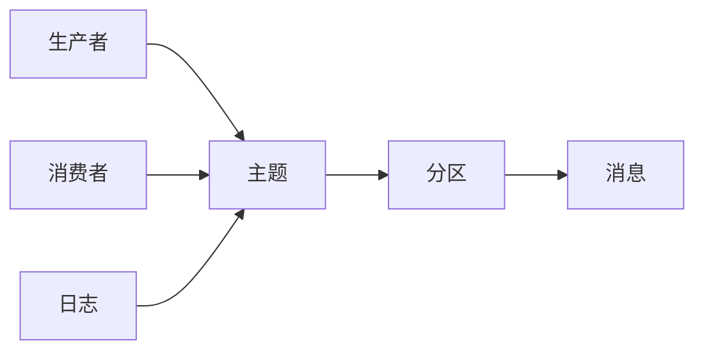

                 

# Kafka分布式消息队列原理与代码实例讲解

> 关键词：Kafka, 分布式消息队列, 生产者消费者模型, 异步IO, 实时流处理, 零拷贝技术

## 1. 背景介绍

### 1.1 问题由来

在现代信息时代，数据产生和流动的方式正在发生重大变革。随着互联网、物联网、云计算等技术的普及，数据的产生速度和规模呈指数级增长，企业和组织需要对海量数据进行高效、可靠的处理。消息队列作为一种异步通信机制，在数据流动的各个环节中被广泛应用，如日志记录、事件驱动、异步通信等。其中，Apache Kafka作为一个成熟的分布式消息队列系统，因其高吞吐量、高可靠性、可伸缩性等特性，被大量企业和组织采用，成为大数据处理的基础设施之一。

Kafka最初由LinkedIn开发，用于公司内部的消息传递，后来开源化并迅速成为全球最受欢迎的分布式消息队列之一。截至2023年，Kafka的最新版本Kafka 3.0已发布，Kafka平台的使用规模和生态体系得到了进一步的扩展和完善。

## 2. 核心概念与联系

### 2.1 核心概念概述

- **Kafka**: Apache Kafka是一个开源的分布式消息队列系统，用于处理实时数据流。Kafka的核心组件包括生产者(Producer)、消费者(Consumer)、主题(Topic)、分区(Partition)和日志(Zookeeper)等。

- **生产者(Producer)**: 生产者负责将数据写入Kafka主题，生产者可以批量发送数据，支持异步IO，能够提高数据写入的吞吐量。

- **消费者(Consumer)**: 消费者从Kafka主题中读取数据，可以处理高吞吐量、高可靠性的数据流，支持并行消费和流式处理。

- **主题(Topic)**: 主题是Kafka中消息的容器，用于存储数据流，每个主题由多个分区(Partition)组成。

- **分区(Partition)**: 分区是Kafka中最基本的数据单位，每个分区由一系列有序的消息组成，可以通过分区实现数据的冗余和负载均衡。

- **日志(Zookeeper)**: Kafka依赖于Apache Zookeeper来管理集群元数据，如生产者、消费者、主题、分区等。

### 2.2 核心概念原理和架构的 Mermaid 流程图



这个流程图展示了Kafka系统的主要组成部分及其关系。生产者将消息写入主题，每个主题由多个分区组成，消费者从分区中读取数据，而Zookeeper用于管理集群元数据。

## 3. 核心算法原理 & 具体操作步骤

### 3.1 算法原理概述

Kafka的核心算法原理主要包括以下几个方面：

- **生产者-消费者模型(Producer-Consumer Model)**: Kafka采用发布-订阅模式，生产者发布消息到Kafka主题，消费者从主题中订阅消息，实现异步通信和数据解耦。

- **异步IO和零拷贝技术**: Kafka使用异步IO和零拷贝技术，减少了数据复制和传输的开销，提高了数据写入和读取的效率。

- **分区和副本机制**: Kafka通过分区和副本机制实现数据冗余和负载均衡，提高系统的可靠性和可扩展性。

- **流式处理和实时性保障**: Kafka支持流式处理，通过并行消费、流式编程等方式，实现实时数据处理和流式计算。

### 3.2 算法步骤详解

1. **生产者步骤**:
   - 创建KafkaProducer对象，连接Kafka集群。
   - 创建生产者配置，包括Bootstrap Servers、KeySerializer、ValueSerializer等。
   - 使用send()方法将数据写入Kafka主题，可以设置生产者端点、分区策略等参数。
   - 监听生产者状态，通过回调函数处理异常和数据发送情况。

2. **消费者步骤**:
   - 创建KafkaConsumer对象，连接Kafka集群。
   - 创建消费者配置，包括Bootstrap Servers、KeyDeserializer、ValueDeserializer等。
   - 使用subscribe()方法订阅一个或多个主题，并设置消费偏移量。
   - 从主题中读取数据，可以通过并行消费和流式编程等方式处理数据。
   - 监听消费者状态，通过回调函数处理异常和数据消费情况。

### 3.3 算法优缺点

#### 优点：
- **高吞吐量和低延迟**: Kafka采用异步IO和零拷贝技术，能够处理高吞吐量、低延迟的数据流。
- **可扩展性和高可靠性**: Kafka通过分区和副本机制实现数据冗余和负载均衡，提高系统的可扩展性和可靠性。
- **灵活性和易用性**: Kafka支持多种编程语言和数据格式，能够满足不同的业务需求。

#### 缺点：
- **延迟写入和复杂性**: Kafka的生产者和消费者需要编写复杂的代码，且初始配置可能较为复杂。
- **数据一致性和消息丢失**: Kafka的分区机制可能导致数据不一致，且在高吞吐量下可能丢失部分消息。
- **资源消耗高**: Kafka的分区和副本机制需要占用大量内存和磁盘空间，可能对系统性能产生影响。

### 3.4 算法应用领域

Kafka广泛应用于各种数据流处理场景，如日志记录、事件驱动、实时流处理、异步通信等。以下是Kafka在实际应用中的几个典型场景：

1. **日志记录**: Kafka可以用于记录和存储日志数据，实现高吞吐量、高可靠性的日志记录和查询。

2. **事件驱动**: Kafka可以用于事件驱动架构，实现异步通信和事件处理。

3. **实时流处理**: Kafka可以与Apache Flink、Apache Spark等流处理引擎集成，实现实时数据处理和流式计算。

4. **异步通信**: Kafka可以用于异步通信，实现服务间的消息传递和通信解耦。

5. **流数据采集**: Kafka可以用于采集和处理流数据，如监控数据、物联网数据等。

6. **微服务架构**: Kafka可以用于微服务架构中的消息传递，实现服务间的异步通信和解耦。

## 4. 数学模型和公式 & 详细讲解

### 4.1 数学模型构建

Kafka的核心算法模型可以抽象为一个生产者-消费者模型，其中生产者负责将数据写入Kafka主题，消费者从主题中读取数据。假设每个主题有$N$个分区，每个分区的大小为$M$字节，生产者每秒发送$B$字节数据，消费者每秒处理$C$字节数据。

- **生产者模型**: 生产者每秒发送的数据量可以表示为$B$，发送速率取决于消息大小和发送频率。

- **消费者模型**: 消费者每秒处理的数据量可以表示为$C$，处理速率取决于消息大小和处理频率。

- **系统吞吐量**: Kafka的吞吐量可以表示为$T = \min(B, C)$，即生产者和消费者中较慢的一方的处理速率。

### 4.2 公式推导过程

假设每个分区大小为$M$字节，生产者每秒发送$B$字节数据，消费者每秒处理$C$字节数据。则生产者每秒写入的消息数为$B/M$，消费者每秒读取的消息数为$C/M$。

设每个分区有$P$个生产者和$R$个消费者，则生产者每秒写入的消息总数为$P \times B/M$，消费者每秒读取的消息总数为$R \times C/M$。

由于每个分区大小固定，因此生产者每秒写入的消息数和消费者每秒读取的消息数必须相等，即$P \times B/M = R \times C/M$。化简得$P = R \times C/B$。

Kafka系统吞吐量为$T = \min(B, C)$，即生产者和消费者中较慢的一方的处理速率。

### 4.3 案例分析与讲解

假设每个分区大小为1MB，生产者每秒发送10MB数据，消费者每秒处理5MB数据。则生产者每秒写入的消息数为10/1M = 10k，消费者每秒读取的消息数为5/1M = 5k。

设每个分区有3个生产者和5个消费者，则生产者每秒写入的消息总数为$3 \times 10k = 30k$，消费者每秒读取的消息总数为$5 \times 5k = 25k$。

由于每个分区大小固定，生产者每秒写入的消息数和消费者每秒读取的消息数必须相等，即$30k = 25k$。

Kafka系统吞吐量为$T = \min(10MB/s, 5MB/s) = 5MB/s$，即生产者和消费者中较慢的一方的处理速率。

## 5. 项目实践：代码实例和详细解释说明

### 5.1 开发环境搭建

Kafka的开发环境搭建包括以下几个步骤：

1. **安装Java开发环境**: Kafka是基于Java开发的，需要安装JDK 8及以上版本。

2. **安装Kafka环境**: 从Kafka官网下载最新版本的Kafka安装包，解压缩并安装。

3. **配置Kafka环境**: 修改配置文件，设置Bootstrap Servers、Zookeeper地址等。

4. **启动Kafka集群**: 启动Kafka集群，检查集群是否正常启动。

### 5.2 源代码详细实现

以下是使用Java编写的Kafka生产者和消费者的代码实现：

**生产者代码**:

```java
import org.apache.kafka.clients.producer.KafkaProducer;
import org.apache.kafka.clients.producer.ProducerRecord;
import org.apache.kafka.clients.producer.ProducerConfig;

import java.util.Properties;

public class KafkaProducerExample {
    public static void main(String[] args) {
        Properties props = new Properties();
        props.put(ProducerConfig.BOOTSTRAP_SERVERS_CONFIG, "localhost:9092");
        props.put(ProducerConfig.KEY_SERIALIZER_CLASS_CONFIG, StringSerializer.class);
        props.put(ProducerConfig.VALUE_SERIALIZER_CLASS_CONFIG, StringSerializer.class);

        KafkaProducer<String, String> producer = new KafkaProducer<>(props);

        for (int i = 0; i < 100; i++) {
            String key = "key-" + i;
            String value = "value-" + i;
            ProducerRecord<String, String> record = new ProducerRecord<>("my-topic", key, value);
            producer.send(record);
        }

        producer.close();
    }
}
```

**消费者代码**:

```java
import org.apache.kafka.clients.consumer.ConsumerConfig;
import org.apache.kafka.clients.consumer.KafkaConsumer;
import org.apache.kafka.clients.consumer.ConsumerRecord;
import org.apache.kafka.clients.consumer.ConsumerRecords;

import java.util.Properties;
import java.util.Arrays;

public class KafkaConsumerExample {
    public static void main(String[] args) {
        Properties props = new Properties();
        props.put(ConsumerConfig.BOOTSTRAP_SERVERS_CONFIG, "localhost:9092");
        props.put(ConsumerConfig.GROUP_ID_CONFIG, "my-group");
        props.put(ConsumerConfig.KEY_DESERIALIZER_CLASS_CONFIG, StringDeserializer.class);
        props.put(ConsumerConfig.VALUE_DESERIALIZER_CLASS_CONFIG, StringDeserializer.class);
        props.put(ConsumerConfig.AUTO_OFFSET_RESET_CONFIG, "earliest");

        KafkaConsumer<String, String> consumer = new KafkaConsumer<>(props);
        consumer.subscribe(Arrays.asList("my-topic"));

        while (true) {
            ConsumerRecords<String, String> records = consumer.poll(100);
            for (ConsumerRecord<String, String> record : records) {
                System.out.printf("key: %s, value: %s%n", record.key(), record.value());
            }
        }
    }
}
```

### 5.3 代码解读与分析

**生产者代码解读**:

- 使用KafkaProducer类创建生产者对象，并设置Bootstrap Servers、KeySerializer、ValueSerializer等配置。
- 使用send()方法将数据写入Kafka主题，可以设置生产者端点、分区策略等参数。
- 通过循环发送100条数据，模拟生产者持续写入数据的情况。

**消费者代码解读**:

- 使用KafkaConsumer类创建消费者对象，并设置Bootstrap Servers、Group ID、Key Deserializer、Value Deserializer等配置。
- 使用subscribe()方法订阅一个或多个主题，并设置消费偏移量。
- 从主题中读取数据，通过循环消费100条数据，并输出每个记录的关键字和值。

### 5.4 运行结果展示

通过运行上述代码，可以观察到生产者和消费者成功连接到Kafka集群，生产者持续向Kafka主题写入数据，消费者从主题中读取数据并输出结果。

## 6. 实际应用场景

### 6.1 金融数据处理

Kafka在金融数据处理中得到广泛应用，如交易数据记录、风险监控、高频交易等。金融机构可以将交易数据通过Kafka流式采集，实现实时监控和风险预警。

### 6.2 物流订单处理

Kafka可以用于物流订单处理，实现订单数据的实时记录和处理。通过Kafka流式采集订单数据，可以实时监控订单状态，实现快速处理和响应。

### 6.3 新闻推荐系统

Kafka可以用于新闻推荐系统，实现新闻数据的实时采集和处理。通过Kafka流式采集新闻数据，可以实时推荐相关新闻，提升用户体验。

### 6.4 社交媒体分析

Kafka可以用于社交媒体分析，实现社交数据的实时采集和处理。通过Kafka流式采集社交媒体数据，可以实时分析用户行为和舆情趋势。

### 6.5 智能客服系统

Kafka可以用于智能客服系统，实现客户咨询数据的实时记录和处理。通过Kafka流式采集客户咨询数据，可以实现实时分析和响应，提升客户服务体验。

## 7. 工具和资源推荐

### 7.1 学习资源推荐

1. **Kafka官方文档**: Kafka官方文档详细介绍了Kafka的各个组件和API，是学习Kafka的最佳入门资料。

2. **Kafka高级教程**: Kafka官方提供的高级教程，涵盖Kafka的架构设计、原理实现和最佳实践，适合深入学习。

3. **Kafka中文社区**: Kafka中文社区提供了丰富的教程、文档和案例，是学习和交流Kafka的良好平台。

4. **Kafka实战指南**: 《Kafka实战指南》是一本实用的Kafka入门书籍，涵盖了Kafka的各个组件和应用场景。

5. **Kafka高阶技术**: 《Kafka高阶技术》是一本深入介绍Kafka核心技术的书籍，适合有经验的开发者阅读。

### 7.2 开发工具推荐

1. **IntelliJ IDEA**: IntelliJ IDEA是一款强大的Java开发工具，支持Kafka开发环境搭建和代码调试。

2. **Eclipse**: Eclipse是另一款流行的Java开发工具，支持Kafka开发环境搭建和代码编写。

3. **Visual Studio Code**: Visual Studio Code是一款跨平台的代码编辑器，支持Kafka开发环境搭建和调试。

4. **Kafdrop**: Kafdrop是一款开源的Kafka可视化管理工具，用于监控和管理Kafka集群。

5. **Kafka Manager**: Kafka Manager是一款企业级Kafka管理工具，支持Kafka集群监控、故障排除等。

### 7.3 相关论文推荐

1. **Kafka: A Real-Time Distributed Streams Processing Platform**: 《Kafka: A Real-Time Distributed Streams Processing Platform》是Kafka的原始论文，详细介绍了Kafka的架构设计和实现。

2. **Kafka Internals**: 《Kafka Internals》是一本介绍Kafka内部机制和实现原理的书籍，适合深入理解Kafka的工作原理。

3. **Kafka Streams: Building High-Performance, Distributed Streaming Applications**: 《Kafka Streams: Building High-Performance, Distributed Streaming Applications》介绍了Kafka Streams的高性能流处理架构和实现。

4. **Kafka Design Patterns**: 《Kafka Design Patterns》介绍了Kafka中的设计模式和最佳实践，适合学习和应用Kafka的开发者阅读。

## 8. 总结：未来发展趋势与挑战

### 8.1 研究成果总结

Kafka作为分布式消息队列，已经在数据流处理的各个领域得到了广泛应用，成为大数据处理的基础设施之一。Kafka的成功源于其高效、可靠、可扩展的架构设计，以及丰富的生态系统和社区支持。

### 8.2 未来发展趋势

Kafka的未来发展趋势主要包括以下几个方面：

1. **流式处理和实时计算**: Kafka将继续扩展流式处理和实时计算的能力，支持更多流处理框架和数据源。

2. **Kafka Streams**: Kafka Streams将继续优化和扩展，支持更多的数据处理和流计算场景。

3. **分布式状态管理**: Kafka将进一步支持分布式状态管理，实现更高效的数据处理和分析。

4. **安全性和隐私保护**: Kafka将加强安全性、隐私保护和合规性管理，提升系统的可靠性和安全性。

5. **云原生支持**: Kafka将进一步支持云原生技术，实现更灵活的部署和管理。

### 8.3 面临的挑战

Kafka虽然已经取得了巨大的成功，但在未来发展过程中仍然面临以下挑战：

1. **复杂度和易用性**: Kafka的架构设计复杂，配置和运维成本较高，如何简化使用和提升易用性是一个重要挑战。

2. **性能瓶颈**: Kafka在高吞吐量和高延迟场景下可能遇到性能瓶颈，需要进一步优化和提升。

3. **数据一致性**: Kafka在分布式系统中的数据一致性问题仍需进一步研究和解决。

4. **生态系统整合**: Kafka与其他数据处理和分析工具的整合问题仍需解决，实现更灵活的数据处理生态系统。

5. **社区支持和持续创新**: Kafka的持续创新和社区支持仍需加强，保持技术领先和生态繁荣。

### 8.4 研究展望

面对未来发展的挑战，Kafka需要在以下几个方面进行持续研究和改进：

1. **简化使用和提升易用性**: 简化Kafka的使用和配置，提升开发和运维效率。

2. **优化性能和提升可靠性**: 优化Kafka的性能和可靠性，提升高吞吐量和高延迟场景下的处理能力。

3. **解决数据一致性问题**: 解决Kafka在分布式系统中的数据一致性问题，提升系统的可靠性和稳定性。

4. **整合生态系统和开源社区**: 整合Kafka与其他数据处理和分析工具，构建更灵活、更高效的数据处理生态系统。

5. **持续创新和社区支持**: 持续推动Kafka的技术创新和社区支持，保持技术领先和生态繁荣。

## 9. 附录：常见问题与解答

**Q1: Kafka的分区机制如何影响数据一致性？**

A: Kafka的分区机制能够提高系统的可扩展性和吞吐量，但也可能影响数据一致性。由于每个分区是独立的，多个分区之间可能会出现数据不一致的情况。为解决这一问题，Kafka提供了一些机制，如分区同步、延迟时间控制、延迟监控等，以保证数据一致性。

**Q2: Kafka的分区大小如何影响性能？**

A: Kafka的分区大小直接影响系统的吞吐量和延迟。分区大小越大，单个分区处理的数据量就越大，吞吐量越高，但延迟也可能增加。分区大小应根据具体的业务需求和数据量进行合理设置，以达到最优性能。

**Q3: Kafka的流式处理能力如何？**

A: Kafka的流式处理能力非常强大，支持实时数据流处理、流式计算、流式分析等。通过Kafka流式处理，可以实现数据的实时采集、存储、处理和分析，满足各种业务需求。

**Q4: Kafka的延迟写入和消费如何处理？**

A: Kafka的延迟写入和消费问题可以通过一些优化策略来解决，如批量写入、异步IO、优化网络传输等。同时，Kafka还提供了一些高级特性，如延迟时间控制、延迟监控等，保证数据的实时性和可靠性。

**Q5: Kafka的消费者如何实现并行消费？**

A: Kafka的消费者可以通过多个线程实现并行消费。在Java代码中，可以通过设置线程数和消费偏移量，实现多线程并发消费。同时，Kafka还提供了一些优化策略，如分区合并、延迟时间控制等，提升消费效率和系统性能。

---

作者：禅与计算机程序设计艺术 / Zen and the Art of Computer Programming

