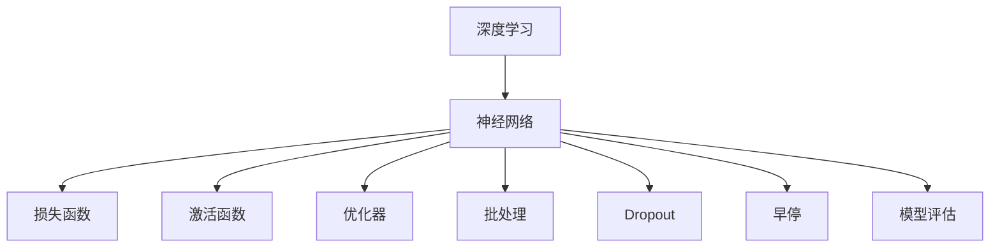

                 

# Keras 原理与代码实战案例讲解

> 关键词：深度学习,神经网络,模型构建,损失函数,激活函数,优化器,批处理,Dropout,早停,模型评估

## 1. 背景介绍

### 1.1 问题由来

在深度学习领域，神经网络模型已经成为了非常热门的技术。它是一种用于模拟人脑神经元之间信息传递的模型。通过深度学习的训练，神经网络可以自动地从数据中学习出特征表示，进而进行分类、回归等任务。Keras作为Python的一个高级深度学习库，简化了神经网络模型的构建和训练过程，使得深度学习模型能够更容易地被非深度学习领域的研究者所接受和使用。

### 1.2 问题核心关键点

Keras库的核心理念是“为了方便使用深度学习，让深度学习更容易”。它提供了一种简单且易于理解的方式来构建、训练和评估深度学习模型。Keras支持多种深度学习框架（如TensorFlow、Theano等），并提供了丰富的API接口，使得开发者可以灵活地构建自定义的神经网络模型。

## 2. 核心概念与联系

### 2.1 核心概念概述

为更好地理解Keras的原理和实战案例，本节将介绍几个关键概念：

- **深度学习（Deep Learning）**：一种基于神经网络的机器学习技术，可以用于分类、回归、聚类等多种任务。
- **神经网络（Neural Network）**：由多个神经元（节点）和连接它们的边构成的网络结构，用于模拟人脑的信息处理过程。
- **损失函数（Loss Function）**：用于衡量模型预测值与真实值之间差异的函数，常用于训练模型的目标函数。
- **激活函数（Activation Function）**：用于在神经网络中引入非线性特性，常用于输出层的隐藏层中。
- **优化器（Optimizer）**：用于调整模型参数，以最小化损失函数的函数，如SGD、Adam等。
- **批处理（Batch Processing）**：在训练过程中，将数据分为多个批次进行训练，以提高训练效率。
- **Dropout**：一种正则化技术，用于减少神经网络的过拟合。
- **早停（Early Stopping）**：在模型训练过程中，通过监控验证集的损失，及时停止训练，避免过拟合。
- **模型评估（Model Evaluation）**：通过测试集对训练好的模型进行评估，以衡量模型的性能。

这些概念之间的逻辑关系可以通过以下Mermaid流程图来展示：



这个流程图展示了这个核心概念之间的关联性，说明了深度学习模型的构建过程和相关的训练技术。

## 3. 核心算法原理 & 具体操作步骤

### 3.1 算法原理概述

Keras深度学习库的原理是基于TensorFlow、Theano等低级深度学习框架构建的。它提供了简单易用的API接口，使得开发者可以轻松地构建、训练和评估深度学习模型。

Keras的核心流程包括数据预处理、模型构建、模型训练、模型评估和模型预测。

### 3.2 算法步骤详解

下面是Keras深度学习库的核心步骤：

**Step 1: 数据预处理**

数据预处理是深度学习模型构建的第一步。通过数据预处理，我们可以将原始数据转换为模型可以接受的格式。常见的数据预处理包括数据清洗、归一化、数据增强等。

**Step 2: 模型构建**

模型构建是深度学习模型的核心步骤。在Keras中，我们可以使用 Sequential 模型或者 Functional API 构建神经网络模型。

**Step 3: 模型训练**

模型训练是深度学习模型的关键步骤。通过反向传播算法，我们可以更新模型参数，使得模型能够更好地拟合训练数据。

**Step 4: 模型评估**

模型评估是深度学习模型的最后一步。通过测试集对模型进行评估，我们可以了解模型的性能和泛化能力。

**Step 5: 模型预测**

模型预测是深度学习模型的最终步骤。通过预测函数，我们可以得到模型对新数据的预测结果。

### 3.3 算法优缺点

Keras深度学习库的优势包括：

- **易用性**：Keras提供了简单易用的API接口，使得深度学习模型的构建、训练和评估变得非常容易。
- **灵活性**：Keras支持多种深度学习框架，并提供了丰富的API接口，使得开发者可以灵活地构建自定义的神经网络模型。
- **可扩展性**：Keras可以很容易地与其他深度学习库进行集成，从而实现更复杂的功能。

Keras的缺点包括：

- **性能**：Keras的性能可能不如一些低级深度学习框架，例如TensorFlow。
- **可移植性**：Keras只能运行在支持它的深度学习框架上，这可能会限制它的应用范围。

### 3.4 算法应用领域

Keras深度学习库在各种领域都有广泛的应用，例如：

- 计算机视觉：Keras可以用于图像分类、物体检测、图像分割等任务。
- 自然语言处理：Keras可以用于文本分类、情感分析、机器翻译等任务。
- 时间序列分析：Keras可以用于股票预测、时间序列预测等任务。

## 4. 数学模型和公式 & 详细讲解 & 举例说明

### 4.1 数学模型构建

在Keras中，我们可以使用 Sequential 模型或者 Functional API 构建神经网络模型。

**Sequential 模型**：

```python
from keras.models import Sequential
from keras.layers import Dense, Dropout

model = Sequential()
model.add(Dense(64, activation='relu', input_dim=100))
model.add(Dropout(0.5))
model.add(Dense(10, activation='softmax'))
```

**Functional API 模型**：

```python
from keras.models import Model
from keras.layers import Input, Dense, Dropout

input_layer = Input(shape=(100,))
x = Dense(64, activation='relu')(input_layer)
x = Dropout(0.5)(x)
output_layer = Dense(10, activation='softmax')(x)

model = Model(inputs=input_layer, outputs=output_layer)
```

### 4.2 公式推导过程

**激活函数**：

在神经网络中，激活函数用于引入非线性特性。常见的激活函数包括 Sigmoid、Tanh、ReLU 等。

**损失函数**：

损失函数用于衡量模型预测值与真实值之间的差异。常见的损失函数包括均方误差（MSE）、交叉熵（Cross-Entropy）等。

**优化器**：

优化器用于调整模型参数，以最小化损失函数。常见的优化器包括 SGD、Adam、Adagrad 等。

### 4.3 案例分析与讲解

**案例1：手写数字识别**

```python
from keras.datasets import mnist
from keras.models import Sequential
from keras.layers import Dense, Dropout
from keras.utils import to_categorical

(x_train, y_train), (x_test, y_test) = mnist.load_data()

x_train = x_train.reshape(60000, 784)
x_test = x_test.reshape(10000, 784)

x_train = x_train / 255
x_test = x_test / 255

y_train = to_categorical(y_train, 10)
y_test = to_categorical(y_test, 10)

model = Sequential()
model.add(Dense(128, activation='relu', input_dim=784))
model.add(Dropout(0.5))
model.add(Dense(10, activation='softmax'))

model.compile(optimizer='adam', loss='categorical_crossentropy', metrics=['accuracy'])
model.fit(x_train, y_train, epochs=10, batch_size=128, validation_data=(x_test, y_test))
```

**案例2：图像分类**

```python
from keras.datasets import cifar10
from keras.models import Sequential
from keras.layers import Dense, Dropout, Flatten
from keras.layers import Conv2D, MaxPooling2D

(x_train, y_train), (x_test, y_test) = cifar10.load_data()

x_train = x_train / 255
x_test = x_test / 255

model = Sequential()
model.add(Conv2D(32, (3, 3), activation='relu', input_shape=(32, 32, 3)))
model.add(MaxPooling2D(pool_size=(2, 2)))
model.add(Dropout(0.25))
model.add(Conv2D(64, (3, 3), activation='relu'))
model.add(MaxPooling2D(pool_size=(2, 2)))
model.add(Dropout(0.25))
model.add(Flatten())
model.add(Dense(512, activation='relu'))
model.add(Dropout(0.5))
model.add(Dense(10, activation='softmax'))

model.compile(optimizer='adam', loss='categorical_crossentropy', metrics=['accuracy'])
model.fit(x_train, y_train, epochs=10, batch_size=128, validation_data=(x_test, y_test))
```

## 5. 项目实践：代码实例和详细解释说明

### 5.1 开发环境搭建

在Python 3.6或以上版本中安装Keras。

```bash
pip install keras
```

### 5.2 源代码详细实现

**案例1：手写数字识别**

```python
from keras.datasets import mnist
from keras.models import Sequential
from keras.layers import Dense, Dropout
from keras.utils import to_categorical

(x_train, y_train), (x_test, y_test) = mnist.load_data()

x_train = x_train.reshape(60000, 784)
x_test = x_test.reshape(10000, 784)

x_train = x_train / 255
x_test = x_test / 255

y_train = to_categorical(y_train, 10)
y_test = to_categorical(y_test, 10)

model = Sequential()
model.add(Dense(128, activation='relu', input_dim=784))
model.add(Dropout(0.5))
model.add(Dense(10, activation='softmax'))

model.compile(optimizer='adam', loss='categorical_crossentropy', metrics=['accuracy'])
model.fit(x_train, y_train, epochs=10, batch_size=128, validation_data=(x_test, y_test))
```

**案例2：图像分类**

```python
from keras.datasets import cifar10
from keras.models import Sequential
from keras.layers import Dense, Dropout, Flatten
from keras.layers import Conv2D, MaxPooling2D

(x_train, y_train), (x_test, y_test) = cifar10.load_data()

x_train = x_train / 255
x_test = x_test / 255

model = Sequential()
model.add(Conv2D(32, (3, 3), activation='relu', input_shape=(32, 32, 3)))
model.add(MaxPooling2D(pool_size=(2, 2)))
model.add(Dropout(0.25))
model.add(Conv2D(64, (3, 3), activation='relu'))
model.add(MaxPooling2D(pool_size=(2, 2)))
model.add(Dropout(0.25))
model.add(Flatten())
model.add(Dense(512, activation='relu'))
model.add(Dropout(0.5))
model.add(Dense(10, activation='softmax'))

model.compile(optimizer='adam', loss='categorical_crossentropy', metrics=['accuracy'])
model.fit(x_train, y_train, epochs=10, batch_size=128, validation_data=(x_test, y_test))
```

### 5.3 代码解读与分析

**手写数字识别案例**：

- 首先，我们从Keras的内置数据集 mnist 中加载训练集和测试集。
- 然后，我们将训练集和测试集的数据进行reshape操作，将其转换为模型可以接受的格式。
- 接下来，我们对数据进行归一化处理，将其像素值缩放到 [0, 1] 之间。
- 接着，我们使用 to_categorical 函数将标签转换为 one-hot 编码。
- 然后，我们构建了一个包含两个全连接层的神经网络模型。
- 最后，我们使用编译函数 compile 来定义优化器和损失函数，并使用 fit 函数来训练模型。

**图像分类案例**：

- 首先，我们从Keras的内置数据集 cifar10 中加载训练集和测试集。
- 然后，我们对数据进行归一化处理。
- 接下来，我们使用卷积层和池化层来构建卷积神经网络模型。
- 然后，我们使用 Dropout 层来减少过拟合。
- 接着，我们使用全连接层来对卷积层输出的特征进行分类。
- 最后，我们使用编译函数 compile 来定义优化器和损失函数，并使用 fit 函数来训练模型。

## 6. 实际应用场景

### 6.1 智能推荐系统

在智能推荐系统中，Keras深度学习库可以用于构建推荐模型。通过Keras库，我们可以构建神经网络模型，并使用训练好的模型对用户行为数据进行预测，从而实现个性化推荐。

**案例1：用户行为预测**

```python
from keras.models import Sequential
from keras.layers import Dense, Dropout
from keras.optimizers import Adam

model = Sequential()
model.add(Dense(64, activation='relu', input_dim=100))
model.add(Dropout(0.5))
model.add(Dense(1, activation='sigmoid'))

model.compile(optimizer=Adam(lr=0.001), loss='binary_crossentropy', metrics=['accuracy'])
model.fit(x_train, y_train, epochs=10, batch_size=128, validation_data=(x_test, y_test))
```

### 6.2 金融风控系统

在金融风控系统中，Keras深度学习库可以用于构建欺诈检测模型。通过Keras库，我们可以构建神经网络模型，并使用训练好的模型对金融交易数据进行分类，从而实现欺诈检测。

**案例1：欺诈检测**

```python
from keras.models import Sequential
from keras.layers import Dense, Dropout
from keras.optimizers import Adam

model = Sequential()
model.add(Dense(64, activation='relu', input_dim=100))
model.add(Dropout(0.5))
model.add(Dense(1, activation='sigmoid'))

model.compile(optimizer=Adam(lr=0.001), loss='binary_crossentropy', metrics=['accuracy'])
model.fit(x_train, y_train, epochs=10, batch_size=128, validation_data=(x_test, y_test))
```

### 6.3 自然语言处理

在自然语言处理中，Keras深度学习库可以用于构建文本分类、情感分析、机器翻译等模型。通过Keras库，我们可以构建神经网络模型，并使用训练好的模型对文本数据进行分类或翻译，从而实现文本处理任务。

**案例1：文本分类**

```python
from keras.datasets import imdb
from keras.models import Sequential
from keras.layers import Dense, Dropout
from keras.optimizers import Adam

(x_train, y_train), (x_test, y_test) = imdb.load_data(num_words=10000)

x_train = x_train / float(len(x_train))
x_test = x_test / float(len(x_test))

model = Sequential()
model.add(Dense(128, activation='relu', input_dim=10000))
model.add(Dropout(0.5))
model.add(Dense(1, activation='sigmoid'))

model.compile(optimizer=Adam(lr=0.001), loss='binary_crossentropy', metrics=['accuracy'])
model.fit(x_train, y_train, epochs=10, batch_size=128, validation_data=(x_test, y_test))
```

## 7. 工具和资源推荐

### 7.1 学习资源推荐

为了帮助开发者系统掌握Keras的原理和实战案例，这里推荐一些优质的学习资源：

1. Keras官方文档：Keras官方文档提供了详细的API说明和实例代码，是学习Keras的必备资料。
2. Keras官方博客：Keras官方博客定期发布深度学习技术分享，涵盖Keras的最新动态和最佳实践。
3. Keras教程：Keras教程是一个综合性的学习资源，涵盖Keras的各个方面，从基础到高级都有详细的介绍。
4. Keras Cookbook：Keras Cookbook是一本关于Keras的实用指南，包含大量案例和代码实现，适合实战学习。
5. Deep Learning with Python：Deep Learning with Python是一本介绍深度学习的书籍，其中Keras作为主要的深度学习库进行了详细讲解。

通过对这些资源的学习实践，相信你一定能够快速掌握Keras的精髓，并用于解决实际的深度学习问题。

### 7.2 开发工具推荐

Keras深度学习库支持多种深度学习框架，包括TensorFlow、Theano、Microsoft Cognitive Toolkit等。

- TensorFlow：TensorFlow是目前最流行的深度学习框架之一，支持多种模型构建和训练方式，性能优越，适合大规模分布式训练。
- Theano：Theano是一个开源的数学计算库，支持GPU加速，适合学术研究和论文发表。
- Microsoft Cognitive Toolkit：Microsoft Cognitive Toolkit是微软开发的深度学习框架，支持分布式训练和GPU加速，适合大规模企业级应用。

### 7.3 相关论文推荐

Keras深度学习库在深度学习领域有广泛的应用，以下是几篇奠基性的相关论文，推荐阅读：

1. Delving Deep into Rectifiers: Surpassing Human-Level Performance on ImageNet Classification（ReLU论文）：引入了 ReLU 激活函数，使得深度神经网络可以更快地收敛。
2. ImageNet Classification with Deep Convolutional Neural Networks（AlexNet论文）：提出了 AlexNet 卷积神经网络模型，在 ImageNet 数据集上取得了最先进的性能。
3. Convolutional Neural Networks for Learning Fast Feature Hierarchies（VGG论文）：提出了 VGG 卷积神经网络模型，提升了深度学习模型的精度。
4. Going Deeper with Convolutions（GoogleNet论文）：提出了 GoogleNet 卷积神经网络模型，进一步提升了深度学习模型的精度。
5. Exploring the Depth of Feedforward Neural Networks（ResNet论文）：提出了 ResNet 残差网络模型，使得深度神经网络可以训练到更深层次。

这些论文代表了深度学习领域的重大进展，对于理解 Keras 深度学习库的原理和应用有重要的指导意义。

## 8. 总结：未来发展趋势与挑战

### 8.1 总结

本文对 Keras 深度学习库的原理和实战案例进行了全面系统的介绍。首先，我们介绍了深度学习模型、神经网络、损失函数、激活函数、优化器、批处理、Dropout、早停、模型评估等核心概念，并给出了这些概念之间的逻辑关系。然后，我们详细讲解了 Keras 深度学习库的算法原理和具体操作步骤，包括数据预处理、模型构建、模型训练、模型评估和模型预测。同时，我们还提供了多个实战案例，帮助读者更好地理解 Keras 深度学习库的应用。

通过本文的系统梳理，可以看到，Keras 深度学习库已经在深度学习领域得到了广泛的应用，成为深度学习模型的重要工具。Keras 的易用性和灵活性使得深度学习模型的构建和训练变得非常简单，大大降低了深度学习模型的入门门槛。未来，Keras 深度学习库将继续发展，并与其他深度学习库进行更深入的融合，共同推动深度学习技术的进步。

### 8.2 未来发展趋势

展望未来，Keras 深度学习库将呈现以下几个发展趋势：

1. **性能优化**：Keras 深度学习库将进一步优化性能，提高训练和推理速度。
2. **模型复用**：Keras 深度学习库将更加注重模型复用，减少重复开发工作。
3. **可扩展性**：Keras 深度学习库将支持更多深度学习框架，并与其他深度学习库进行更深入的融合。
4. **社区支持**：Keras 深度学习库将更加注重社区建设，提供更多的学习资源和工具支持。
5. **应用拓展**：Keras 深度学习库将拓展到更多的应用领域，如自然语言处理、计算机视觉、智能推荐等。

### 8.3 面临的挑战

尽管 Keras 深度学习库已经取得了瞩目成就，但在迈向更加智能化、普适化应用的过程中，它仍面临着诸多挑战：

1. **性能瓶颈**：Keras 深度学习库在处理大规模数据时可能面临性能瓶颈。
2. **模型复用性不足**：Keras 深度学习库在某些情况下可能无法复用已有的模型。
3. **社区支持不足**：Keras 深度学习库可能需要更多的社区支持和资源共享。
4. **可解释性不足**：Keras 深度学习库中的神经网络模型通常缺乏可解释性。
5. **安全性问题**：Keras 深度学习库中的模型可能面临数据泄露和攻击的风险。

### 8.4 研究展望

面对 Keras 深度学习库所面临的挑战，未来的研究需要在以下几个方面寻求新的突破：

1. **性能优化**：如何进一步优化 Keras 深度学习库的性能，提高训练和推理速度。
2. **模型复用性**：如何提高模型的复用性，减少重复开发工作。
3. **可解释性**：如何赋予神经网络模型更强的可解释性，提高模型的可信度和安全性。
4. **社区支持**：如何加强社区建设，提供更多的学习资源和工具支持。

这些研究方向的探索，必将引领 Keras 深度学习库走向更高的台阶，为深度学习技术的普及和应用提供更强大的支持。

## 9. 附录：常见问题与解答

**Q1：Keras 深度学习库是否可以处理大规模数据？**

A: Keras 深度学习库支持处理大规模数据，但在大规模数据处理时可能需要进行分布式训练。

**Q2：Keras 深度学习库是否可以与其他深度学习库进行集成？**

A: Keras 深度学习库可以与其他深度学习库进行集成，例如 TensorFlow、Theano 等。

**Q3：Keras 深度学习库中的神经网络模型是否具有可解释性？**

A: Keras 深度学习库中的神经网络模型通常缺乏可解释性，需要使用其他技术，如可视化工具和解释方法，来理解模型的决策过程。

**Q4：Keras 深度学习库中的模型是否具有安全性？**

A: Keras 深度学习库中的模型可能面临数据泄露和攻击的风险，需要在使用过程中进行适当的安全措施。

**Q5：Keras 深度学习库中的模型是否可以复用？**

A: Keras 深度学习库中的模型通常具有较高的复用性，可以通过微调和其他技术进行适应新的数据和任务。

---

作者：禅与计算机程序设计艺术 / Zen and the Art of Computer Programming

