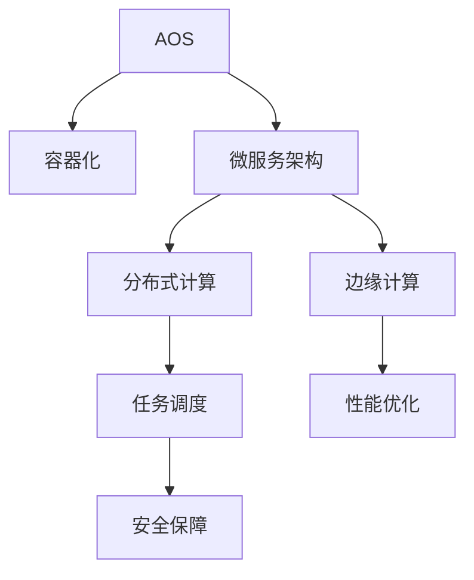

                 

# LLM OS:AI操作系统的未来愿景

## 1. 背景介绍

### 1.1 问题由来
随着人工智能技术的飞速发展，特别是深度学习和大数据技术的广泛应用，人工智能（AI）已经渗透到各个领域，包括自然语言处理（NLP）、计算机视觉、语音识别、自动驾驶等。然而，这些AI技术往往依赖于大量的数据和计算资源，模型的开发和部署成本高昂，难以在大规模应用中推广。

为解决这一问题，AI操作系统（AI OS）应运而生。AI OS 是一种新兴的操作系统，旨在提供一个高效、灵活、可扩展的平台，以促进AI技术的落地应用。目前，AI OS 尚处于起步阶段，但其潜力和应用前景已经引起了广泛关注。

### 1.2 问题核心关键点
AI OS的核心目标是将AI技术与操作系统紧密结合，为各类AI应用提供统一的基础设施和运行环境。其核心关键点包括：

- **模型管理**：自动管理模型训练、推理、部署等生命周期全流程。
- **数据管理**：提供高效的数据存储、访问、处理机制。
- **任务调度**：实现模型任务的高效调度与资源管理。
- **性能优化**：提供多种性能优化手段，提升AI应用的速度与准确性。
- **安全保障**：保证数据隐私和模型安全，防止模型泄露和攻击。

这些关键点决定了AI OS的未来发展方向和应用潜力。通过这些技术手段，AI OS有望成为AI技术应用的核心基础设施，推动AI技术的普及和应用。

## 2. 核心概念与联系

### 2.1 核心概念概述

为更好地理解AI OS的构建原理和核心技术，本节将介绍几个关键概念：

- **AI OS**：一种专为AI应用设计的操作系统，提供模型管理、数据处理、任务调度、性能优化和安全保障等功能。
- **容器化**：通过容器技术将AI应用隔离，实现模型和数据的高效管理。
- **微服务架构**：将AI应用拆分成多个微服务，提高系统的可扩展性和可靠性。
- **分布式计算**：利用多台机器协同工作，提升AI模型的训练和推理效率。
- **边缘计算**：在靠近数据源的设备上部署AI模型，提升数据处理效率和模型响应速度。

这些概念之间的逻辑关系可以通过以下Mermaid流程图来展示：



这个流程图展示了AI OS的核心概念及其之间的关系：

1. **AI OS**：AI OS 提供了容器化、微服务、分布式计算和边缘计算等基础设施，为AI应用的部署和管理提供支撑。
2. **容器化**：通过容器技术实现模型的隔离和独立部署，简化模型管理。
3. **微服务架构**：将AI应用拆分为多个服务，提高系统的灵活性和可扩展性。
4. **分布式计算**：利用多台机器协同工作，提升模型的训练和推理效率。
5. **边缘计算**：在数据源附近部署AI模型，提升数据处理速度和模型响应速度。
6. **任务调度**：实现模型任务的合理调度与资源管理，提升系统效率。
7. **性能优化**：通过优化算法和硬件资源配置，提升AI应用的性能。
8. **安全保障**：通过加密、权限控制等手段，保障数据隐私和模型安全。

这些概念共同构成了AI OS的基础框架，使其能够高效支持各类AI应用的部署和管理。

## 3. 核心算法原理 & 具体操作步骤
### 3.1 算法原理概述

AI OS的核心算法原理主要围绕模型管理、数据处理、任务调度、性能优化和安全保障等方面展开。以下是各部分的核心算法原理概述：

- **模型管理**：采用容器化技术封装模型，通过微服务架构实现模型的灵活部署和扩展。
- **数据处理**：利用分布式存储和计算框架，实现大规模数据的存储、访问和处理。
- **任务调度**：采用先进调度算法和分布式资源管理技术，实现模型任务的合理调度与资源分配。
- **性能优化**：通过硬件资源配置优化、模型压缩和量化等技术手段，提升AI应用的性能。
- **安全保障**：采用数据加密、权限控制和审计记录等技术手段，保障数据隐私和模型安全。

### 3.2 算法步骤详解

以下将详细讲解AI OS的核心算法步骤，以帮助读者全面理解其实现机制。

**Step 1: 模型封装与管理**

1. **容器化封装**：将AI模型封装成容器镜像，通过容器编排工具（如Kubernetes）进行部署和管理。容器镜像包括模型文件、依赖库和配置文件等，确保模型的一致性和独立性。
2. **模型版本管理**：采用版本控制工具（如Git）对模型进行版本管理，记录模型的更新历史和变化日志。
3. **模型上线流程**：通过CI/CD流程自动化管理模型的训练、测试和部署，提升模型上线效率。

**Step 2: 数据处理与存储**

1. **分布式存储**：利用分布式存储系统（如Hadoop、Ceph等）实现大规模数据的存储和管理。通过多副本机制和数据一致性协议，保证数据的高可用性和可靠性。
2. **数据访问优化**：采用缓存、索引和查询优化技术，提升数据访问效率。
3. **数据可视化**：通过可视化工具（如Grafana）展示数据指标和处理状态，帮助用户监控和管理数据流。

**Step 3: 任务调度与资源管理**

1. **任务调度算法**：采用先进调度算法（如Kubernetes的调度器）实现模型任务的合理分配和调度。通过资源优先级和亲和性等策略，优化任务执行路径。
2. **资源管理**：利用资源监控和管理系统（如Prometheus）监控资源使用情况，及时调整资源配置。采用弹性伸缩策略，根据负载动态调整资源规模。

**Step 4: 性能优化**

1. **硬件资源配置优化**：采用自动调参和资源分配技术，优化模型训练和推理的硬件资源配置。通过GPU、CPU和内存等资源的合理分配，提升性能。
2. **模型压缩和量化**：通过模型压缩和量化技术，减少模型大小和计算量，提升模型推理速度。
3. **算法优化**：采用高效算法和数据结构，提升模型的计算效率。

**Step 5: 安全保障**

1. **数据加密**：采用加密技术保护数据传输和存储的安全性。对敏感数据进行加密，防止数据泄露。
2. **权限控制**：采用权限控制机制（如RBAC）管理用户和角色的访问权限，保障数据隐私和模型安全。
3. **审计记录**：记录模型和数据的访问日志，进行安全审计和异常检测。

### 3.3 算法优缺点

AI OS的算法原理具有以下优点：

- **灵活性高**：通过容器化和微服务架构，实现模型的灵活部署和扩展。
- **可靠性高**：利用分布式存储和计算，提升系统的可靠性和可用性。
- **性能优化**：通过多种性能优化手段，提升AI应用的性能。
- **安全性高**：通过数据加密、权限控制和安全审计，保障数据隐私和模型安全。

同时，AI OS也存在一些缺点：

- **开发复杂度较高**：需要掌握多种技术栈和工具，增加了开发难度。
- **资源消耗较大**：分布式计算和容器化增加了系统资源消耗，需要高效管理。
- **应用场景有限**：目前主要应用于大型企业和科研机构，对于中小型企业和个人用户，应用门槛较高。

### 3.4 算法应用领域

AI OS的算法原理和应用场景广泛，涵盖以下几个方面：

- **智能客服**：通过AI OS部署语音识别、自然语言处理等模型，实现智能客服系统。
- **智能安防**：利用AI OS部署图像识别和视频分析模型，实现智能安防监控。
- **自动驾驶**：采用AI OS部署感知、决策和控制等模型，实现自动驾驶系统。
- **医疗健康**：通过AI OS部署医学影像分析和健康预测模型，提升医疗服务水平。
- **金融风控**：利用AI OS部署风险评估和欺诈检测模型，提升金融风险管理能力。
- **智能制造**：采用AI OS部署质量检测和设备维护模型，提升智能制造效率和精度。

## 4. 数学模型和公式 & 详细讲解

### 4.1 数学模型构建

本节将使用数学语言对AI OS的核心算法原理进行更加严格的刻画。

假设AI OS的任务是训练一个深度学习模型 $M$，模型的参数向量为 $\theta$，训练数据集为 $\mathcal{D}=\{(x_i, y_i)\}_{i=1}^N$。

定义模型的损失函数为 $\ell(\theta)$，其中 $\ell$ 是常用的损失函数，如均方误差、交叉熵等。AI OS的目标是最小化损失函数 $\ell(\theta)$，即：

$$
\hat{\theta} = \mathop{\arg\min}_{\theta} \ell(\theta)
$$

在AI OS中，模型的训练和推理通常涉及多个模块，包括数据加载、模型初始化、训练器、优化器等。各模块的输入输出关系可以表示为：

$$
\mathcal{D} \xrightarrow{\text{数据加载}} \mathcal{X}, \mathcal{Y} \xrightarrow{\text{模型初始化}} M_{\theta} \xrightarrow{\text{训练器}} \hat{\theta} \xrightarrow{\text{优化器}} \theta \xrightarrow{\text{推理}} \mathcal{Y'}
$$

其中 $\mathcal{X}$ 为训练数据特征，$\mathcal{Y}$ 为训练数据标签，$\mathcal{Y'}$ 为模型推理输出。

### 4.2 公式推导过程

以下我们以一个简单的线性回归模型为例，推导AI OS在模型训练中的计算流程。

假设模型的训练数据集 $\mathcal{D}=\{(x_i, y_i)\}_{i=1}^N$，其中 $x_i \in \mathbb{R}^d$，$y_i \in \mathbb{R}$。定义模型的线性回归函数为 $M(x; \theta) = Wx + b$，其中 $W \in \mathbb{R}^{d\times 1}$，$b \in \mathbb{R}$，$\theta = (W, b)$。模型的损失函数为均方误差损失：

$$
\ell(\theta) = \frac{1}{N}\sum_{i=1}^N (y_i - M(x_i; \theta))^2
$$

在AI OS中，模型的训练流程如下：

1. **数据加载**：从数据存储系统中读取训练数据集 $\mathcal{D}$。
2. **模型初始化**：创建模型 $M_{\theta}$，并随机初始化参数 $W$ 和 $b$。
3. **训练器**：通过前向传播计算模型的预测输出 $M(x_i; \theta)$，计算损失函数 $\ell(\theta)$，并返回梯度 $\frac{\partial \ell(\theta)}{\partial \theta}$。
4. **优化器**：采用梯度下降算法更新模型参数 $\theta$：

$$
\theta \leftarrow \theta - \eta \frac{\partial \ell(\theta)}{\partial \theta}
$$

其中 $\eta$ 为学习率。

重复上述步骤，直到损失函数收敛，训练结束。

### 4.3 案例分析与讲解

以智能安防系统为例，分析AI OS在实际应用中的计算流程。

假设智能安防系统需要实时监控视频流，并利用图像识别模型检测入侵行为。AI OS在数据加载模块中，从摄像头和存储设备中读取视频流，并提取关键帧。在模型初始化模块中，创建并加载预训练的图像识别模型。在训练器模块中，将关键帧输入模型，计算损失函数，并返回梯度。在优化器模块中，使用梯度下降算法更新模型参数，优化模型性能。最终，在推理模块中，将新视频流输入模型，得到实时检测结果。

## 5. 项目实践：代码实例和详细解释说明

### 5.1 开发环境搭建

在进行AI OS实践前，我们需要准备好开发环境。以下是使用Python和Docker进行环境配置的流程：

1. 安装Docker：从官网下载并安装Docker，用于容器化开发和部署。

2. 安装Kubernetes：从官网下载并安装Kubernetes，用于容器编排和资源管理。

3. 安装TensorFlow：根据CUDA版本，从官网获取对应的安装命令。例如：

```bash
pip install tensorflow
```

4. 安装Keras：

```bash
pip install keras
```

5. 安装TensorFlow Serving：

```bash
pip install tensorflow-serving-api
```

完成上述步骤后，即可在Docker和Kubernetes环境中开始AI OS的实践。

### 5.2 源代码详细实现

以下是一个简单的AI OS项目实现，用于训练和部署一个图像识别模型。

**1. 训练模型**

```python
import tensorflow as tf
from tensorflow.keras.layers import Conv2D, MaxPooling2D, Flatten, Dense
from tensorflow.keras.models import Sequential

model = Sequential()
model.add(Conv2D(32, kernel_size=(3, 3), activation='relu', input_shape=(32, 32, 3)))
model.add(MaxPooling2D(pool_size=(2, 2)))
model.add(Conv2D(64, kernel_size=(3, 3), activation='relu'))
model.add(MaxPooling2D(pool_size=(2, 2)))
model.add(Flatten())
model.add(Dense(64, activation='relu'))
model.add(Dense(10, activation='softmax'))

model.compile(loss='categorical_crossentropy', optimizer='adam', metrics=['accuracy'])

model.fit(train_images, train_labels, epochs=10, batch_size=32, validation_data=(test_images, test_labels))
```

**2. 部署模型**

```python
import tensorflow_serving.apis as apis
from tensorflow_serving.apis import predict_pb2
from tensorflow_serving.apis import prediction_service_pb2

server = apis.start predict_server_pb2.PredictServerDef(
  model_spec=tf.saved_model_tag_constants.SERVING,
  base_path='./model')
```

**3. 调用模型**

```python
with tf.Session(server.target) as sess:
  input_tensor = sess.graph.get_tensor_by_name('serving_default/image_tensor:0')
  output_tensor = sess.graph.get_tensor_by_name('serving_default/predictions:0')

  predictions = sess.run(output_tensor, feed_dict={input_tensor: test_images})

print(predictions)
```

### 5.3 代码解读与分析

让我们再详细解读一下关键代码的实现细节：

**训练模型**

1. **模型构建**：使用Keras构建卷积神经网络（CNN）模型，包含卷积层、池化层和全连接层。
2. **模型编译**：定义损失函数、优化器和评估指标，编译模型。
3. **模型训练**：使用训练数据集和测试数据集，训练模型10个epoch。

**部署模型**

1. **启动服务**：使用TensorFlow Serving启动预测服务，指定模型路径和输出路径。
2. **调用模型**：通过TensorFlow Session调用预测服务，获取模型输出。

**代码解读**

- **TensorFlow**：TensorFlow是深度学习框架，提供了丰富的API和工具，支持模型训练和推理。
- **Keras**：Keras是TensorFlow的高级API，简化了模型构建和训练过程。
- **TensorFlow Serving**：TensorFlow Serving是TensorFlow的模型服务框架，支持模型的部署和调用。

## 6. 实际应用场景

### 6.1 智能客服

智能客服系统是AI OS的重要应用场景之一。通过AI OS部署语音识别、自然语言处理和对话生成等模型，可以实现智能客服系统，提升客户服务效率和体验。

在实际应用中，AI OS可以将客户对话数据输入到训练好的模型中，实时分析客户需求和情绪，并生成合适的回复。同时，AI OS可以与其他系统（如CRM、知识库）协同工作，提供更全面、准确的服务。

### 6.2 智能安防

智能安防系统利用AI OS部署图像识别和视频分析模型，实现实时监控和异常检测。

在实际应用中，AI OS可以从摄像头和存储设备中读取视频流，进行实时分析，识别出异常行为和潜在威胁。同时，AI OS可以将检测结果输出到安防平台，进行告警和处理。

### 6.3 自动驾驶

自动驾驶系统是AI OS的另一个重要应用场景。通过AI OS部署感知、决策和控制等模型，可以实现自动驾驶功能。

在实际应用中，AI OS可以将车辆传感器数据输入到训练好的模型中，进行实时分析和决策。同时，AI OS可以与其他系统（如地图、导航）协同工作，提供更安全、高效的自动驾驶体验。

## 7. 工具和资源推荐

### 7.1 学习资源推荐

为了帮助开发者系统掌握AI OS的理论基础和实践技巧，这里推荐一些优质的学习资源：

1. **TensorFlow官方文档**：TensorFlow官方文档详细介绍了TensorFlow框架的使用方法，包括模型训练、推理和部署等。
2. **Kubernetes官方文档**：Kubernetes官方文档介绍了容器编排和资源管理的方法，提供了丰富的示例和配置指南。
3. **TensorFlow Serving文档**：TensorFlow Serving官方文档介绍了模型服务的部署和调用方法，提供了详细的API文档和使用示例。
4. **深度学习入门课程**：Coursera上的深度学习入门课程，由斯坦福大学Andrew Ng教授主讲，系统讲解了深度学习的基本概念和实践方法。
5. **AI OS实战指南**：《AI OS实战指南》一书，介绍了AI OS的构建方法和应用场景，提供了丰富的案例和代码示例。

通过对这些资源的学习实践，相信你一定能够快速掌握AI OS的构建方法和应用技巧。

### 7.2 开发工具推荐

高效的开发离不开优秀的工具支持。以下是几款用于AI OS开发的常用工具：

1. **TensorFlow**：TensorFlow是深度学习框架，支持模型训练和推理。
2. **Kubernetes**：Kubernetes是容器编排工具，支持大规模分布式计算。
3. **TensorFlow Serving**：TensorFlow Serving是模型服务框架，支持模型的部署和调用。
4. **Prometheus**：Prometheus是资源监控工具，用于监控和管理AI应用的性能。
5. **Grafana**：Grafana是数据可视化工具，用于展示AI应用的运行状态和性能指标。

合理利用这些工具，可以显著提升AI OS的开发效率和应用效果。

### 7.3 相关论文推荐

AI OS的研究源于学界的持续研究。以下是几篇奠基性的相关论文，推荐阅读：

1. **TensorFlow: A System for Large-Scale Machine Learning**：Google发布的文章，介绍了TensorFlow框架的架构和设计思想。
2. **Distributed Machine Learning with TensorFlow**：Google发布的文章，介绍了TensorFlow在分布式计算中的应用方法。
3. **TensorFlow Serving: A Generic, High-Performance, Real-Time TensorFlow Serving System**：Google发布的文章，介绍了TensorFlow Serving的架构和设计思想。
4. **Kubernetes: Scaling Distributed Systems**：Google发布的文章，介绍了Kubernetes的架构和设计思想。
5. **分布式深度学习系统**：IEEE文章，介绍了分布式深度学习系统的构建方法，包括模型训练、推理和部署等。

这些论文代表了大规模AI应用的基础架构技术的发展脉络。通过学习这些前沿成果，可以帮助研究者把握AI OS的未来发展方向，激发更多的创新灵感。

## 8. 总结：未来发展趋势与挑战

### 8.1 总结

本文对AI OS的构建原理和核心技术进行了全面系统的介绍。首先阐述了AI OS的研究背景和意义，明确了其在AI技术应用中的重要地位。其次，从原理到实践，详细讲解了AI OS的核心算法和实现方法，给出了AI OS项目开发的完整代码示例。同时，本文还广泛探讨了AI OS在智能客服、智能安防、自动驾驶等多个领域的应用前景，展示了AI OS的广阔应用空间。此外，本文精选了AI OS相关的学习资源和开发工具，力求为读者提供全方位的技术指引。

通过本文的系统梳理，可以看到，AI OS作为一种新兴的操作系统，正在成为AI技术应用的核心基础设施，推动AI技术的普及和应用。未来，伴随AI OS技术的不断演进，相信AI技术将更加广泛地应用于各个领域，为人类社会带来深刻的变革。

### 8.2 未来发展趋势

展望未来，AI OS将呈现以下几个发展趋势：

1. **开源普及**：随着开源社区的不断发展，更多的AI OS项目将涌现，推动AI OS技术的普及和应用。
2. **云计算支持**：越来越多的云服务提供商将提供AI OS支持，使AI OS成为云计算平台的标准配置。
3. **边缘计算融合**：AI OS将与边缘计算技术结合，实现更高效、实时的数据处理和模型推理。
4. **跨平台兼容**：AI OS将支持多种操作系统和硬件平台，实现跨平台的模型部署和应用。
5. **安全性提升**：随着安全威胁的不断增加，AI OS将加强安全保障机制，防止模型泄露和攻击。
6. **性能优化**：通过硬件资源配置优化、模型压缩和量化等技术手段，提升AI应用的性能。

以上趋势凸显了AI OS的未来发展前景。这些方向的探索发展，必将进一步推动AI技术的普及和应用，带来更多的创新和突破。

### 8.3 面临的挑战

尽管AI OS已经取得了一定的进展，但在迈向更加智能化、普适化应用的过程中，它仍面临诸多挑战：

1. **开发复杂度较高**：需要掌握多种技术栈和工具，增加了开发难度。
2. **资源消耗较大**：分布式计算和容器化增加了系统资源消耗，需要高效管理。
3. **应用场景有限**：目前主要应用于大型企业和科研机构，对于中小型企业和个人用户，应用门槛较高。
4. **安全风险高**：模型泄露和攻击的风险较高，需要加强安全保障机制。
5. **性能优化困难**：大模型和高并发负载下，优化模型性能和提升系统效率是重要挑战。

### 8.4 研究展望

面对AI OS面临的挑战，未来的研究需要在以下几个方面寻求新的突破：

1. **模型压缩和量化**：通过模型压缩和量化技术，减少模型大小和计算量，提升模型推理速度。
2. **高效资源管理**：利用自动调参和资源分配技术，优化模型训练和推理的硬件资源配置。
3. **安全保障机制**：采用数据加密、权限控制和审计记录等技术手段，保障数据隐私和模型安全。
4. **跨平台兼容性**：开发跨平台的AI OS，支持多种操作系统和硬件平台，实现模型和应用的灵活部署。
5. **实时性提升**：通过边缘计算和分布式计算技术，提升AI应用的实时性和响应速度。

这些研究方向的探索，必将引领AI OS技术迈向更高的台阶，为构建安全、可靠、高效、普适的AI操作系统铺平道路。面向未来，AI OS还需要与其他AI技术进行更深入的融合，如知识表示、因果推理、强化学习等，多路径协同发力，共同推动人工智能技术的进步。只有勇于创新、敢于突破，才能真正实现人工智能技术在垂直行业的规模化落地。总之，AI OS需要从数据、算法、工程、业务等多个维度协同发力，才能真正实现人工智能技术在各个领域的应用。

## 9. 附录：常见问题与解答

**Q1: AI OS是否适用于所有AI应用场景？**

A: AI OS适用于大多数AI应用场景，特别是在需要大规模数据处理和高效模型推理的任务中。但对于一些特定场景，如低资源设备、实时性要求极高的应用等，AI OS的应用可能存在限制。需要根据具体应用场景进行选择和优化。

**Q2: 如何优化AI OS的性能？**

A: AI OS的性能优化可以从多个方面入手，包括硬件资源配置优化、模型压缩和量化、算法优化等。具体而言，可以通过以下方法提升性能：

1. **硬件资源配置优化**：采用自动调参和资源分配技术，优化模型训练和推理的硬件资源配置。通过GPU、CPU和内存等资源的合理分配，提升性能。
2. **模型压缩和量化**：通过模型压缩和量化技术，减少模型大小和计算量，提升模型推理速度。
3. **算法优化**：采用高效算法和数据结构，提升模型的计算效率。

**Q3: AI OS的安全性如何保障？**

A: AI OS的安全性保障主要通过数据加密、权限控制和安全审计等手段实现。具体而言，可以采用以下方法：

1. **数据加密**：采用加密技术保护数据传输和存储的安全性。对敏感数据进行加密，防止数据泄露。
2. **权限控制**：采用权限控制机制，管理用户和角色的访问权限，保障数据隐私和模型安全。
3. **安全审计**：记录模型和数据的访问日志，进行安全审计和异常检测。

**Q4: AI OS如何处理跨平台兼容性问题？**

A: AI OS的跨平台兼容性可以通过以下方法实现：

1. **平台抽象层**：开发平台抽象层，实现对不同操作系统和硬件平台的兼容。
2. **容器化技术**：利用容器技术实现模型和数据的隔离和独立部署，提升跨平台的模型部署和应用。
3. **API标准化**：采用标准化的API和接口，实现跨平台的模型调用和数据访问。

**Q5: AI OS的未来发展方向是什么？**

A: AI OS的未来发展方向包括但不限于：

1. **开源普及**：随着开源社区的不断发展，更多的AI OS项目将涌现，推动AI OS技术的普及和应用。
2. **云计算支持**：越来越多的云服务提供商将提供AI OS支持，使AI OS成为云计算平台的标准配置。
3. **边缘计算融合**：AI OS将与边缘计算技术结合，实现更高效、实时的数据处理和模型推理。
4. **跨平台兼容性**：开发跨平台的AI OS，支持多种操作系统和硬件平台，实现模型和应用的灵活部署。
5. **安全性提升**：随着安全威胁的不断增加，AI OS将加强安全保障机制，防止模型泄露和攻击。
6. **性能优化**：通过硬件资源配置优化、模型压缩和量化等技术手段，提升AI应用的性能。

---

作者：禅与计算机程序设计艺术 / Zen and the Art of Computer Programming

