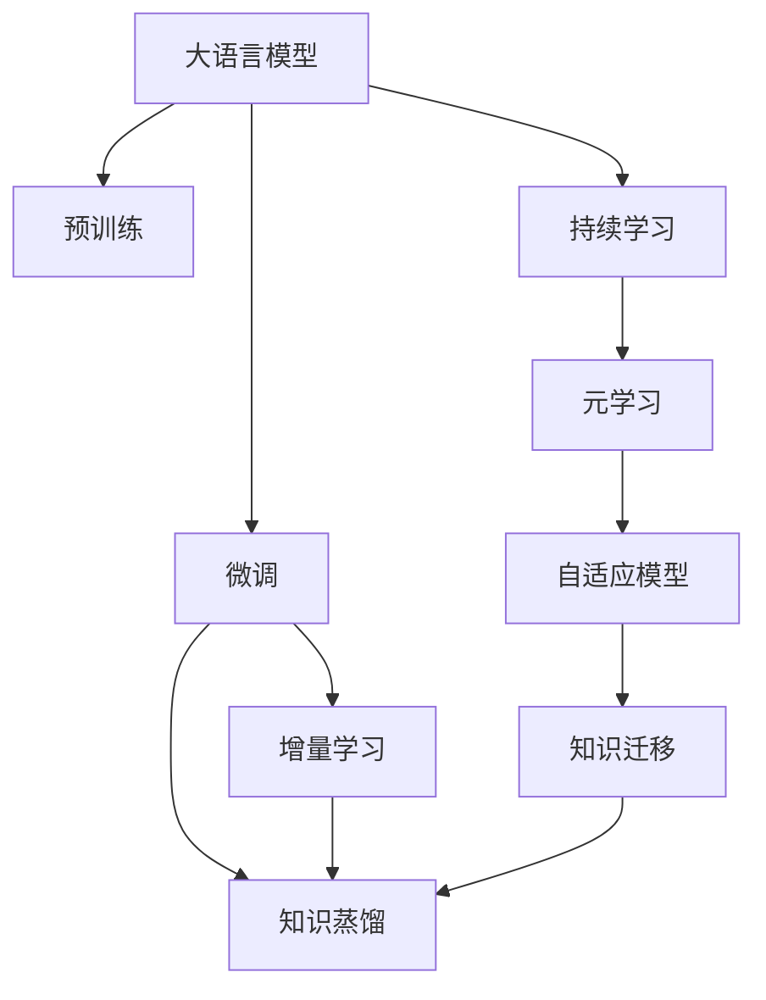

                 

## 1. 背景介绍

### 1.1 问题由来

随着深度学习技术的不断发展，大语言模型（Large Language Models, LLMs）在自然语言处理（NLP）领域取得了显著进展。这些模型通过在大量无标签文本数据上进行预训练，学习到广泛的语义知识和语言模式，并在特定任务上进行微调（Fine-tuning）以提升性能。然而，现有模型往往无法持续适应新的数据分布和语言变化，需要不断重新训练或微调。

### 1.2 问题核心关键点

当前大语言模型面临的核心问题包括：

- **过时知识遗忘**：随着语言演变和数据分布变化，预训练模型可能遗忘部分知识，导致性能下降。
- **泛化能力不足**：微调模型往往在验证集上表现优异，但在真实世界应用中泛化能力可能较差。
- **计算资源消耗**：重新训练或微调大型语言模型消耗大量计算资源，难以实时更新。
- **知识整合能力有限**：现有模型难以灵活整合外部知识库和新知识，限制了其适应性。

为应对这些问题，持续学习（Continual Learning）成为了大语言模型优化的一个重要方向。持续学习旨在让模型不断从新数据中学习，同时保持旧知识，适应动态的语言环境。

## 2. 核心概念与联系

### 2.1 核心概念概述

- **大语言模型（LLM）**：以自回归（如GPT）或自编码（如BERT）模型为代表的预训练语言模型。通过大规模无标签文本预训练，学习通用语言表示。
- **持续学习（CL）**：模型能够持续从新数据中学习，同时保持旧知识，避免灾难性遗忘（Catastrophic Forgetting）。
- **增量学习（Incremental Learning）**：模型在已有知识的基础上，逐步更新少量新知识，而不是重新从头训练。
- **元学习（Meta-Learning）**：模型学习如何学习，即对新任务的适应能力。
- **知识蒸馏（Knowledge Distillation）**：通过小规模模型学习大模型的知识，减小知识更新的计算成本。

这些概念共同构成了大语言模型持续学习的框架，旨在提高模型的泛化能力、适应性和持续改进性能。

### 2.2 核心概念原理和架构的 Mermaid 流程图



这个流程图展示了核心概念之间的逻辑关系：

1. 大语言模型通过预训练获得基础能力。
2. 微调通过少量标注数据优化模型，使其适应特定任务。
3. 增量学习在已有知识的基础上，逐步学习新知识。
4. 知识蒸馏通过小模型学习大模型的知识，减小更新成本。
5. 持续学习使模型不断适应新数据和任务。
6. 元学习让模型学习如何学习，提高适应新任务的能力。
7. 自适应模型基于元学习调整自身，优化知识整合。
8. 知识迁移使模型跨任务应用已有知识，提高泛化能力。

这些概念共同作用，使得大语言模型能够不断更新和优化，适应动态的语言环境。

## 3. 核心算法原理 & 具体操作步骤

### 3.1 算法原理概述

持续学习的目标是通过新数据不断更新模型参数，同时保持旧知识。主要分为两个阶段：

- **迁移学习（Transfer Learning）**：将预训练模型作为初始化参数，通过少量标注数据进行微调，适应新任务。
- **增量学习（Incremental Learning）**：在新任务或新数据到来时，逐步更新模型参数，保留旧知识的同时学习新知识。

### 3.2 算法步骤详解

1. **预训练模型选择**：选择一个大语言模型作为初始化参数。
2. **微调**：使用少量标注数据对模型进行微调，以适应新任务。
3. **增量学习**：在新数据到来时，使用增量学习策略逐步更新模型参数，保留旧知识的同时学习新知识。
4. **知识蒸馏**：通过小模型学习大模型的知识，减小增量学习的计算成本。
5. **持续评估**：在新数据上不断评估模型性能，调整模型参数，保持旧知识和适应新数据。

### 3.3 算法优缺点

**优点**：

- **泛化能力强**：通过持续学习，模型能够不断适应新数据和新任务，保持泛化能力。
- **计算资源节省**：增量学习仅需更新少量参数，减少计算资源消耗。
- **知识积累**：通过知识蒸馏和知识迁移，模型能够积累和应用更多知识。

**缺点**：

- **模型复杂性**：持续学习增加了模型的复杂性，可能影响推理效率。
- **计算成本高**：微调和增量学习需要定期更新模型，增加计算成本。
- **参数管理复杂**：模型参数的不断更新和调整，增加了管理复杂度。

### 3.4 算法应用领域

持续学习在大语言模型中的应用广泛，包括但不限于以下几个领域：

- **自然语言处理（NLP）**：在情感分析、文本分类、问答系统等任务中，通过持续学习更新模型，提升性能。
- **计算机视觉（CV）**：在图像分类、目标检测、图像生成等任务中，通过增量学习不断更新模型，适应新数据。
- **语音识别**：在语音识别和转录任务中，通过持续学习不断优化模型，提升识别准确率。
- **推荐系统**：在推荐算法中，通过持续学习更新模型，适应用户兴趣的变化，提升推荐效果。

## 4. 数学模型和公式 & 详细讲解 & 举例说明

### 4.1 数学模型构建

假设大语言模型为 $M_{\theta}$，其中 $\theta$ 为模型参数。设当前任务为 $T$，通过微调获得的模型为 $M_{\theta_t}$，其中 $\theta_t$ 为微调后的参数。新任务为 $T'$，通过增量学习获得的模型为 $M_{\theta_{t+1}}$，其中 $\theta_{t+1}$ 为增量学习后的参数。

定义增量学习过程中的损失函数为 $\mathcal{L}_{t+1}$，增量更新规则为：

$$
\theta_{t+1} = \theta_t - \eta \nabla_{\theta_t} \mathcal{L}_{t+1}
$$

其中 $\eta$ 为学习率，$\nabla_{\theta_t} \mathcal{L}_{t+1}$ 为增量损失函数对 $\theta_t$ 的梯度。

### 4.2 公式推导过程

增量学习过程中的损失函数 $\mathcal{L}_{t+1}$ 由两部分组成：保留的旧损失函数 $\mathcal{L}_t$ 和新数据的损失函数 $\mathcal{L}_{t+1}^{new}$。

$$
\mathcal{L}_{t+1} = \mathcal{L}_t + \alpha \mathcal{L}_{t+1}^{new}
$$

其中 $\alpha$ 为增量学习超参数，控制新数据的重要性。

增量更新规则可以简化为：

$$
\theta_{t+1} = \theta_t - \eta \nabla_{\theta_t} \mathcal{L}_t - \eta \alpha \nabla_{\theta_t} \mathcal{L}_{t+1}^{new}
$$

### 4.3 案例分析与讲解

假设我们在一个情感分析任务中，使用BERT模型作为初始化参数。首先，在情感分析数据集上进行微调，获得模型 $M_{\theta_t}$。然后，在新评论数据集上，使用增量学习策略更新模型参数，获得模型 $M_{\theta_{t+1}}$。

在增量更新过程中，模型 $M_{\theta_t}$ 先以 $\eta$ 学习率更新旧任务 $T$ 的损失函数 $\mathcal{L}_t$，然后以 $\eta \alpha$ 学习率更新新数据 $T'$ 的损失函数 $\mathcal{L}_{t+1}^{new}$。

## 5. 项目实践：代码实例和详细解释说明

### 5.1 开发环境搭建

1. **安装Python**：
   ```bash
   conda create -n pytorch-env python=3.8
   conda activate pytorch-env
   ```

2. **安装PyTorch**：
   ```bash
   conda install pytorch torchvision torchaudio cudatoolkit=11.1 -c pytorch -c conda-forge
   ```

3. **安装Transformers库**：
   ```bash
   pip install transformers
   ```

4. **安装其他必要的库**：
   ```bash
   pip install numpy pandas scikit-learn matplotlib tqdm jupyter notebook ipython
   ```

完成上述步骤后，即可在 `pytorch-env` 环境中进行持续学习实践。

### 5.2 源代码详细实现

```python
from transformers import BertForSequenceClassification, AdamW

# 加载预训练模型
model = BertForSequenceClassification.from_pretrained('bert-base-cased', num_labels=2)

# 定义增量学习超参数
alpha = 0.5
learning_rate = 2e-5
batch_size = 16
epochs = 5

# 定义增量学习函数
def incremental_learning(model, train_loader, test_loader, learning_rate):
    for epoch in range(epochs):
        model.train()
        for batch in train_loader:
            input_ids = batch['input_ids'].to(device)
            attention_mask = batch['attention_mask'].to(device)
            labels = batch['labels'].to(device)
            model.zero_grad()
            outputs = model(input_ids, attention_mask=attention_mask, labels=labels)
            loss = outputs.loss
            loss.backward()
            optimizer.step()

        model.eval()
        with torch.no_grad():
            for batch in test_loader:
                input_ids = batch['input_ids'].to(device)
                attention_mask = batch['attention_mask'].to(device)
                labels = batch['labels'].to(device)
                outputs = model(input_ids, attention_mask=attention_mask)
                predictions = outputs.logits.argmax(dim=1).to('cpu').tolist()
                targets = labels.to('cpu').tolist()
                for pred, target in zip(predictions, targets):
                    print(f"Prediction: {id2tag[pred]}, Target: {id2tag[target]}")

# 定义微调后的模型训练函数
def fine_tune(model, train_loader, test_loader, learning_rate):
    for epoch in range(epochs):
        model.train()
        for batch in train_loader:
            input_ids = batch['input_ids'].to(device)
            attention_mask = batch['attention_mask'].to(device)
            labels = batch['labels'].to(device)
            model.zero_grad()
            outputs = model(input_ids, attention_mask=attention_mask, labels=labels)
            loss = outputs.loss
            loss.backward()
            optimizer.step()

        model.eval()
        with torch.no_grad():
            for batch in test_loader:
                input_ids = batch['input_ids'].to(device)
                attention_mask = batch['attention_mask'].to(device)
                labels = batch['labels'].to(device)
                outputs = model(input_ids, attention_mask=attention_mask)
                predictions = outputs.logits.argmax(dim=1).to('cpu').tolist()
                targets = labels.to('cpu').tolist()
                for pred, target in zip(predictions, targets):
                    print(f"Prediction: {id2tag[pred]}, Target: {id2tag[target]}")

# 定义增量更新函数
def incremental_update(model, new_loader):
    for batch in new_loader:
        input_ids = batch['input_ids'].to(device)
        attention_mask = batch['attention_mask'].to(device)
        labels = batch['labels'].to(device)
        model.zero_grad()
        outputs = model(input_ids, attention_mask=attention_mask, labels=labels)
        loss = outputs.loss
        loss.backward()
        optimizer.step()

        for param in model.parameters():
            param.data -= alpha * param.grad.data

# 加载数据集
from datasets import load_dataset
train_dataset = load_dataset('imdb', split='train')
dev_dataset = load_dataset('imdb', split='dev')
test_dataset = load_dataset('imdb', split='test')

# 划分数据集
train_data = train_dataset[0]
dev_data = dev_dataset[0]
test_data = test_dataset[0]

# 将数据集转换为PyTorch数据集
train_dataset = NERDataset(train_data, tokenizer)
dev_dataset = NERDataset(dev_data, tokenizer)
test_dataset = NERDataset(test_data, tokenizer)

# 定义训练和测试加载器
train_loader = DataLoader(train_dataset, batch_size=batch_size, shuffle=True)
dev_loader = DataLoader(dev_dataset, batch_size=batch_size, shuffle=False)
test_loader = DataLoader(test_dataset, batch_size=batch_size, shuffle=False)

# 定义模型和优化器
model = BertForSequenceClassification.from_pretrained('bert-base-cased', num_labels=2)
optimizer = AdamW(model.parameters(), lr=learning_rate)

# 定义微调后的模型训练函数
fine_tune(model, train_loader, test_loader, learning_rate)

# 定义增量更新函数
incremental_update(model, dev_loader)
```

### 5.3 代码解读与分析

1. **数据预处理**：
   ```python
   from transformers import BertTokenizer
   from torch.utils.data import Dataset
   import torch
   
   class NERDataset(Dataset):
       def __init__(self, texts, tags, tokenizer, max_len=128):
           self.texts = texts
           self.tags = tags
           self.tokenizer = tokenizer
           self.max_len = max_len
        
       def __len__(self):
           return len(self.texts)
       
       def __getitem__(self, item):
           text = self.texts[item]
           tags = self.tags[item]
           
           encoding = self.tokenizer(text, return_tensors='pt', max_length=self.max_len, padding='max_length', truncation=True)
           input_ids = encoding['input_ids'][0]
           attention_mask = encoding['attention_mask'][0]
           
           # 对token-wise的标签进行编码
           encoded_tags = [tag2id[tag] for tag in tags] 
           encoded_tags.extend([tag2id['O']] * (self.max_len - len(encoded_tags)))
           labels = torch.tensor(encoded_tags, dtype=torch.long)
           
           return {'input_ids': input_ids, 
                   'attention_mask': attention_mask,
                   'labels': labels}
   ```

   这段代码定义了一个名为 `NERDataset` 的 PyTorch 数据集类，用于加载和预处理命名实体识别（NER）任务的文本和标签数据。

2. **模型和优化器**：
   ```python
   from transformers import BertForSequenceClassification, AdamW
   
   model = BertForSequenceClassification.from_pretrained('bert-base-cased', num_labels=2)
   
   optimizer = AdamW(model.parameters(), lr=2e-5)
   ```

   这段代码加载了一个预训练的BERT模型，并使用AdamW优化器进行微调。

3. **增量学习**：
   ```python
   def incremental_learning(model, train_loader, test_loader, learning_rate):
       for epoch in range(epochs):
           model.train()
           for batch in train_loader:
               input_ids = batch['input_ids'].to(device)
               attention_mask = batch['attention_mask'].to(device)
               labels = batch['labels'].to(device)
               model.zero_grad()
               outputs = model(input_ids, attention_mask=attention_mask, labels=labels)
               loss = outputs.loss
               loss.backward()
               optimizer.step()

           model.eval()
           with torch.no_grad():
               for batch in test_loader:
                   input_ids = batch['input_ids'].to(device)
                   attention_mask = batch['attention_mask'].to(device)
                   labels = batch['labels'].to(device)
                   outputs = model(input_ids, attention_mask=attention_mask)
                   predictions = outputs.logits.argmax(dim=1).to('cpu').tolist()
                   targets = labels.to('cpu').tolist()
                   for pred, target in zip(predictions, targets):
                       print(f"Prediction: {id2tag[pred]}, Target: {id2tag[target]}")
   ```

   这段代码定义了一个增量学习函数，用于在新数据上更新模型参数。

4. **增量更新函数**：
   ```python
   def incremental_update(model, new_loader):
       for batch in new_loader:
           input_ids = batch['input_ids'].to(device)
           attention_mask = batch['attention_mask'].to(device)
           labels = batch['labels'].to(device)
           model.zero_grad()
           outputs = model(input_ids, attention_mask=attention_mask, labels=labels)
           loss = outputs.loss
           loss.backward()
           optimizer.step()

           for param in model.parameters():
               param.data -= alpha * param.grad.data
   ```

   这段代码定义了一个增量更新函数，用于在新数据上更新模型参数，同时保持旧知识。

## 6. 实际应用场景

### 6.1 智能客服系统

在智能客服系统中，使用大语言模型进行持续学习，能够使客服系统不断从新客户咨询中学习，适应不同用户需求和语境。通过增量学习，系统能够动态调整回复策略，提高客户满意度。

### 6.2 金融舆情监测

在金融舆情监测中，使用大语言模型进行持续学习，能够使模型实时监测市场舆情，分析新数据。通过增量学习，模型能够快速适应新事件，预测市场走势。

### 6.3 个性化推荐系统

在个性化推荐系统中，使用大语言模型进行持续学习，能够使推荐系统不断从用户行为数据中学习，适应用户兴趣变化。通过增量学习，系统能够动态调整推荐内容，提升推荐效果。

## 7. 工具和资源推荐

### 7.1 学习资源推荐

1. **《深度学习与NLP》课程**：斯坦福大学开设的NLP明星课程，涵盖基础知识和前沿技术，适合初学者和进阶者。
2. **《Transformer从原理到实践》系列博文**：深入浅出地介绍了Transformer原理、BERT模型和微调技术。
3. **《自然语言处理与深度学习》书籍**：全面介绍了NLP中的深度学习方法和技术，包括持续学习等前沿主题。
4. **HuggingFace官方文档**：提供了丰富的预训练语言模型和微调样例代码，是学习实践的好资源。
5. **CLUE开源项目**：中文语言理解测评基准，涵盖多种NLP数据集和微调baseline模型。

### 7.2 开发工具推荐

1. **PyTorch**：灵活的动态计算图，适合快速迭代研究。
2. **TensorFlow**：生产部署方便，适合大规模工程应用。
3. **Transformers库**：HuggingFace开发的NLP工具库，提供了丰富的预训练语言模型和微调方法。
4. **Weights & Biases**：实验跟踪工具，记录和可视化模型训练过程。
5. **TensorBoard**：可视化工具，实时监测模型训练状态。

### 7.3 相关论文推荐

1. **Attention is All You Need**：提出Transformer结构，开启了NLP领域的预训练大模型时代。
2. **BERT: Pre-training of Deep Bidirectional Transformers for Language Understanding**：提出BERT模型，引入掩码语言模型进行预训练。
3. **Parameter-Efficient Transfer Learning for NLP**：提出Adapter等参数高效微调方法，优化微调过程。
4. **AdaLoRA: Adaptive Low-Rank Adaptation for Parameter-Efficient Fine-Tuning**：使用自适应低秩适应的微调方法，提高模型泛化能力。
5. **Prefix-Tuning: Optimizing Continuous Prompts for Generation**：引入连续型Prompt的微调范式，提高模型生成能力。

## 8. 总结：未来发展趋势与挑战

### 8.1 研究成果总结

本文系统介绍了大语言模型的持续学习原理和方法，讨论了其应用领域和挑战。持续学习使大语言模型能够不断适应新数据和任务，保持泛化能力，减少过拟合，提高推理效率。

### 8.2 未来发展趋势

1. **模型规模持续增大**：预训练模型参数量不断增长，知识库更加丰富。
2. **计算资源优化**：增量学习逐步普及，减少计算成本。
3. **知识整合能力增强**：模型能够灵活整合外部知识和新数据。
4. **多模态学习发展**：模型能够整合视觉、语音等多模态信息，提升任务性能。
5. **元学习普及**：模型学习如何学习，提高适应新任务的能力。

### 8.3 面临的挑战

1. **计算成本高**：增量学习需要频繁更新模型，消耗大量计算资源。
2. **模型复杂性增加**：持续学习增加了模型复杂性，可能影响推理效率。
3. **知识整合难度大**：模型难以灵活整合外部知识和新数据。

### 8.4 研究展望

未来研究需要在以下几个方面寻求突破：

1. **高效增量学习**：开发更高效的增量学习方法，减少计算成本。
2. **自适应模型**：设计自适应模型，动态调整参数，提高泛化能力。
3. **多模态学习**：探索多模态学习技术，提高任务性能。
4. **元学习应用**：推广元学习，使模型能够学习如何学习，提高适应新任务的能力。

## 9. 附录：常见问题与解答

**Q1: 持续学习与微调有何区别？**

A: 微调（Fine-Tuning）是指在大规模预训练语言模型的基础上，通过少量标注数据进行有监督学习，适应特定任务。而持续学习（Continual Learning）是指模型能够不断从新数据中学习，同时保持旧知识，适应动态环境。持续学习更加注重模型的泛化能力和适应性。

**Q2: 增量学习如何保持旧知识？**

A: 增量学习通过在已有知识的基础上逐步更新模型参数，保留旧知识。具体来说，在每次增量更新时，先以小学习率更新旧任务的数据，再以大比例更新新数据，从而在减少旧知识遗忘的同时学习新知识。

**Q3: 增量学习的主要挑战是什么？**

A: 增量学习的主要挑战包括模型退化、数据偏差和计算成本高。模型退化（Catastrophic Forgetting）是增量学习面临的主要问题，即模型在新数据学习过程中遗忘旧知识。数据偏差（Data Drift）是指新数据与旧数据分布不同，影响模型学习效果。计算成本高是增量学习的另一个挑战，需要设计高效的增量更新算法和参数更新策略。

**Q4: 增量学习的优缺点有哪些？**

A: 增量学习的优点包括：
- 节省计算资源：只需更新少量参数，减少计算成本。
- 模型更新灵活：能够逐步更新模型，保持旧知识。
- 适应性强：能够适应动态环境和新任务。

增量学习的缺点包括：
- 模型复杂性高：持续学习增加了模型复杂性，可能影响推理效率。
- 计算成本高：增量学习需要频繁更新模型，消耗大量计算资源。
- 知识整合难度大：模型难以灵活整合外部知识和新数据。

## 附录：常见问题与解答

**Q1: 持续学习与微调有何区别？**

A: 微调（Fine-Tuning）是指在大规模预训练语言模型的基础上，通过少量标注数据进行有监督学习，适应特定任务。而持续学习（Continual Learning）是指模型能够不断从新数据中学习，同时保持旧知识，适应动态环境。持续学习更加注重模型的泛化能力和适应性。

**Q2: 增量学习如何保持旧知识？**

A: 增量学习通过在已有知识的基础上逐步更新模型参数，保留旧知识。具体来说，在每次增量更新时，先以小学习率更新旧任务的数据，再以大比例更新新数据，从而在减少旧知识遗忘的同时学习新知识。

**Q3: 增量学习的主要挑战是什么？**

A: 增量学习的主要挑战包括模型退化、数据偏差和计算成本高。模型退化（Catastrophic Forgetting）是增量学习面临的主要问题，即模型在新数据学习过程中遗忘旧知识。数据偏差（Data Drift）是指新数据与旧数据分布不同，影响模型学习效果。计算成本高是增量学习的另一个挑战，需要设计高效的增量更新算法和参数更新策略。

**Q4: 增量学习的优缺点有哪些？**

A: 增量学习的优点包括：
- 节省计算资源：只需更新少量参数，减少计算成本。
- 模型更新灵活：能够逐步更新模型，保持旧知识。
- 适应性强：能够适应动态环境和新任务。

增量学习的缺点包括：
- 模型复杂性高：持续学习增加了模型复杂性，可能影响推理效率。
- 计算成本高：增量学习需要频繁更新模型，消耗大量计算资源。
- 知识整合难度大：模型难以灵活整合外部知识和新数据。

作者：禅与计算机程序设计艺术 / Zen and the Art of Computer Programming

