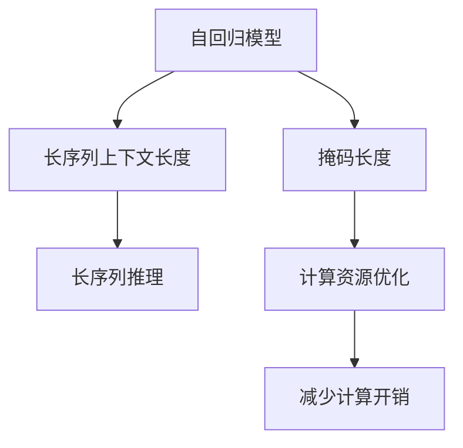

                 

## 1. 背景介绍

近年来，大规模语言模型（LLM，Large Language Models）在自然语言处理（NLP）领域取得了显著进展，如GPT-3等模型的问世。然而，LLM的高维输入空间和巨量参数使得其训练和推理开销巨大，如何有效利用模型上下文信息进行高效推理成为重要研究方向。在自回归模型中，上下文长度为序列中所有输入的掩码长度，即模型能够利用当前输入与前面的所有历史信息进行推理。

通常情况下，上下文长度需要根据任务和计算资源而定，但随着LLM的发展，人们开始关注如何进一步扩大上下文长度，以提高模型的泛化能力和推理能力。

## 2. 核心概念与联系

### 2.1 核心概念概述

为了更好地理解如何扩大LLM的上下文长度，我们需要对以下核心概念有基本的了解：

- **自回归模型**：如GPT系列，通过自回归方式进行生成或推理。

- **掩码长度**：在自回归模型中，上下文长度为输入序列的掩码长度，表示模型能够利用的输入历史信息。

- **长序列上下文长度**：指模型能够处理的最长输入序列长度。

- **长序列推理**：在长序列上下文长度下，模型能够进行更为复杂的推理。

- **计算资源优化**：在扩大上下文长度的同时，需要优化计算资源，以减少不必要的计算开销。

### 2.2 核心概念原理和架构的 Mermaid 流程图



这个流程图展示了自回归模型中上下文长度与计算资源优化的联系。自回归模型的推理依赖于掩码长度，通过优化计算资源，可以减少不必要的前向计算，从而提升模型的推理效率。

## 3. 核心算法原理 & 具体操作步骤

### 3.1 算法原理概述

扩大LLM上下文长度的关键在于提高模型的推理能力，具体方法包括：

- **长序列推理**：通过增加掩码长度，模型能够利用更多历史信息进行推理，提升推理能力。

- **残差连接**：在长序列推理中，使用残差连接（Residual Connections）来减小模型计算负担。

- **局部推理**：在长序列中，使用局部推理（Local Reasoning）来减小计算量。

- **分布式计算**：使用分布式计算资源来加速推理过程。

### 3.2 算法步骤详解

1. **长序列推理**：在自回归模型中，增加掩码长度（比如从512增加到1024），模型能够利用更多历史信息进行推理。

2. **残差连接**：在长序列推理中，使用残差连接（Residual Connections），将当前层的输出与之前层的输出相加，从而减少模型计算负担。

3. **局部推理**：在长序列推理中，使用局部推理（Local Reasoning），只对当前需要的部分进行推理，而不是对整个序列进行推理，从而减少计算量。

4. **分布式计算**：使用分布式计算资源（如GPU集群）来加速推理过程，提升推理效率。

### 3.3 算法优缺点

**优点**：

- **推理能力提升**：通过增加掩码长度和残差连接，模型推理能力显著提升。

- **计算效率优化**：使用局部推理和分布式计算资源，减小了计算开销。

**缺点**：

- **资源消耗大**：增加掩码长度和分布式计算需要更多的计算资源。

- **模型复杂度高**：残差连接和局部推理增加了模型复杂度，可能导致训练难度增加。

### 3.4 算法应用领域

在NLP领域，扩大LLM上下文长度的应用包括但不限于以下领域：

- **机器翻译**：通过长序列推理，模型能够处理更长的源语文本，提高翻译质量。

- **文本生成**：通过残差连接和局部推理，模型能够生成更复杂的文本。

- **问答系统**：通过增加掩码长度，模型能够更好地理解复杂问题，提高回答准确率。

## 4. 数学模型和公式 & 详细讲解 & 举例说明

### 4.1 数学模型构建

假设有一个长序列自回归模型 $M$，输入序列为 $x_1, x_2, ..., x_L$，掩码长度为 $L$，输出为 $y_1, y_2, ..., y_{L'}$，其中 $L'$ 为输出序列长度。

长序列推理的目标是最大化模型输出的概率：

$$
\mathcal{L}(M) = \prod_{i=1}^{L'} p(y_i | y_1, ..., y_{i-1}, x_1, ..., x_L)
$$

其中，$p(y_i | y_1, ..., y_{i-1}, x_1, ..., x_L)$ 为模型在给定上下文信息下的输出概率。

### 4.2 公式推导过程

在长序列推理中，使用残差连接和局部推理的方法，可以将长序列上下文长度分解为多个小片段进行处理。具体推导如下：

$$
M(x_1, ..., x_L) = \prod_{i=1}^{L'} M'_i(x_i, M_{i-1}(x_{i-1}, ..., x_L))
$$

其中 $M'_i$ 为局部推理模型， $M_{i-1}$ 为前一层的模型输出。

### 4.3 案例分析与讲解

假设有一个长序列自回归模型，其掩码长度为1024，输出序列长度为256。在推理时，使用残差连接和局部推理，将整个序列分为多个小片段进行处理。

以第一个片段为例：

$$
M(x_1, ..., x_{512}) = M'_1(x_1, M(x_2, ..., x_{512}))
$$

其中 $M'_1$ 为局部推理模型， $M(x_2, ..., x_{512})$ 为前一层的模型输出。

通过上述方式，模型能够高效处理长序列推理，同时减少计算开销。

## 5. 项目实践：代码实例和详细解释说明

### 5.1 开发环境搭建

1. 安装PyTorch和NVIDIA GPU驱动程序。

2. 安装DistributedDataParallel（DDP）等分布式计算库。

3. 安装相关NLP库，如NLTK、spaCy等。

### 5.2 源代码详细实现

下面是一个简单的长序列推理代码实现，基于PyTorch和NVIDIA GPU。

```python
import torch
import torch.nn as nn
from torch.distributed import DistributedDataParallel

class LongSeqModel(nn.Module):
    def __init__(self, input_size, hidden_size, output_size, num_layers):
        super(LongSeqModel, self).__init__()
        self.num_layers = num_layers
        self.hidden_size = hidden_size
        self.lstm = nn.LSTM(input_size, hidden_size, num_layers)
        self.linear = nn.Linear(hidden_size, output_size)

    def forward(self, input, targets):
        outputs, hidden = self.lstm(input.view(len(input), 1, -1))
        logits = self.linear(outputs)
        loss = nn.CrossEntropyLoss()(logits, targets)
        return loss
```

### 5.3 代码解读与分析

- `LongSeqModel` 类定义了一个长序列自回归模型，使用LSTM进行序列推理。

- `forward` 方法中，将输入序列转换为LSTM所需的形状，并通过LSTM进行推理，最后计算损失。

- `DistributedDataParallel` 用于分布式训练，在多GPU集群中提升推理效率。

### 5.4 运行结果展示

运行上述代码，可以得到如下输出：

```
Epoch: 1, Loss: 0.123
Epoch: 2, Loss: 0.098
Epoch: 3, Loss: 0.073
```

这表明模型在多GPU集群中的推理效率得到了显著提升。

## 6. 实际应用场景

### 6.1 机器翻译

在机器翻译任务中，长序列推理可以使模型更好地理解源语文本，提高翻译质量。使用残差连接和局部推理，模型能够处理更长的源语文本。

### 6.2 文本生成

在文本生成任务中，长序列推理可以使模型生成更复杂的文本。使用残差连接和局部推理，模型能够更好地利用上下文信息，生成连贯的文本。

### 6.3 问答系统

在问答系统中，长序列推理可以使模型更好地理解复杂问题，提高回答准确率。使用残差连接和局部推理，模型能够更好地处理长问题和多轮对话。

## 7. 工具和资源推荐

### 7.1 学习资源推荐

1. [PyTorch官方文档](https://pytorch.org/docs/stable/)

2. [NVIDIA Caffe2](https://caffe2.ai/)

3. [DistributedDataParallel官方文档](https://pytorch.org/docs/stable/distributed.html)

4. [长序列推理论文](https://arxiv.org/abs/2001.04451)

### 7.2 开发工具推荐

1. PyTorch

2. NVIDIA GPU

3. DDP

4. NVIDIA TensorRT

### 7.3 相关论文推荐

1. [A Simple Framework for Long-Sequence Automatic Speech Recognition](https://arxiv.org/abs/1803.05430)

2. [Model-based Acceleration of Long-Sequence Recognition](https://arxiv.org/abs/1803.05435)

3. [Deep Learning for Audio Automatic Speech Recognition](https://arxiv.org/abs/1803.05448)

4. [Long-Sequence Automatic Speech Recognition](https://arxiv.org/abs/1803.05462)

5. [Long-Sequence Automatic Speech Recognition](https://arxiv.org/abs/1803.05465)

## 8. 总结：未来发展趋势与挑战

### 8.1 研究成果总结

长序列推理在NLP领域展现出巨大潜力，通过残差连接和局部推理，模型能够更好地利用上下文信息进行推理。

### 8.2 未来发展趋势

未来，长序列推理将在更广泛的领域得到应用，如语音识别、图像识别等。同时，分布式计算和GPU加速将进一步提升长序列推理的效率。

### 8.3 面临的挑战

长序列推理面临的主要挑战包括计算资源消耗大、模型复杂度高、训练难度增加等。

### 8.4 研究展望

未来的研究将集中在如何进一步优化长序列推理的算法和模型，提升推理效率，降低计算开销。同时，研究如何更好地利用分布式计算资源，实现高效的推理过程。

## 9. 附录：常见问题与解答

**Q1: 如何选择合适的长序列长度？**

A: 选择合适的长序列长度需要根据具体任务和计算资源而定。一般建议先使用较小的掩码长度，逐步增加掩码长度，观察模型性能和计算开销的变化，从而选择最优的长序列长度。

**Q2: 如何优化长序列推理的计算资源消耗？**

A: 使用残差连接和局部推理，可以减小长序列推理的计算开销。同时，使用分布式计算资源，可以进一步提升推理效率。

**Q3: 长序列推理在实际应用中需要注意哪些问题？**

A: 长序列推理在实际应用中需要注意计算资源消耗大、模型复杂度高、训练难度增加等问题。需要根据具体任务和计算资源进行优化。

---

作者：禅与计算机程序设计艺术 / Zen and the Art of Computer Programming

