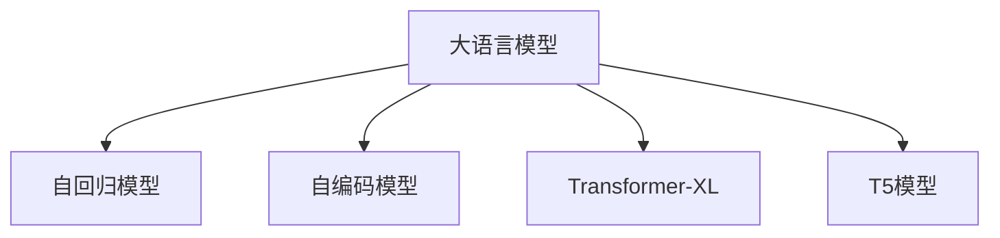

                 

# LLM上下文长度突破:认知能力提升

## 1. 背景介绍

### 1.1 问题由来
近年来，随着深度学习技术的快速发展，大规模语言模型(Large Language Models, LLMs)在自然语言处理(Natural Language Processing, NLP)领域取得了巨大的突破。这些大语言模型通过在海量无标签文本数据上进行预训练，学习到了丰富的语言知识和常识，具备了强大的语言理解和生成能力。

然而，尽管大语言模型在处理长文本、跨领域任务等方面表现出卓越的性能，但在特定任务上，如长文生成、多轮对话等，其上下文处理能力仍存在一定的局限。例如，传统的自回归模型无法同时处理过多上下文，在长文本生成中存在严重的数据稀疏问题；自编码模型虽然能够处理长文本，但在多轮对话中的记忆能力和生成连贯性还有待提升。因此，如何突破上下文长度限制，提升语言模型在长文生成、多轮对话等任务中的表现，成为了当前大语言模型研究的一个热点问题。

### 1.2 问题核心关键点
本文聚焦于如何通过认知增强的方式，提升大语言模型的上下文长度处理能力。具体而言，将介绍两种常用的技术：Transformer-XL和T5模型。它们通过不同的架构设计和参数共享策略，实现对长文序列的深度处理，从而提升了语言模型在长文生成、多轮对话等任务中的认知能力。

### 1.3 问题研究意义
研究上下文长度突破技术，对于拓展大语言模型的应用范围，提升特定任务的效果，加速NLP技术的产业化进程，具有重要意义：

1. 降低应用开发成本。通过突破上下文长度限制，可以显著减少从头开发所需的数据、计算和人力等成本投入。
2. 提升模型效果。长文生成、多轮对话等任务对上下文长度有较高要求，提升上下文处理能力可以显著提升模型在这些任务上的表现。
3. 加速开发进度。standing on the shoulders of giants，突破上下文长度限制可以更快地完成任务适配，缩短开发周期。
4. 带来技术创新。该技术催生了更多高级语言模型，如Transformer-XL、T5等，推动了NLP技术的前沿发展。
5. 赋能产业升级。突破上下文长度限制使得NLP技术更容易被各行各业所采用，为传统行业数字化转型升级提供新的技术路径。

## 2. 核心概念与联系

### 2.1 核心概念概述

为更好地理解大语言模型的上下文长度突破技术，本节将介绍几个密切相关的核心概念：

- 大语言模型(Large Language Model, LLM)：以自回归(如GPT)或自编码(如BERT)模型为代表的大规模预训练语言模型。通过在大规模无标签文本语料上进行预训练，学习通用的语言表示，具备强大的语言理解和生成能力。

- 自回归模型(Autoregressive Model)：从序列的开头开始，逐步预测序列的每个元素。如GPT系列模型。

- 自编码模型(Automatic Encoder Model)：通过编码器将输入序列映射到低维表示，通过解码器从低维表示生成输出序列。如BERT模型。

- Transformer-XL：一种特殊的自编码模型，通过引入相对位置编码，可以处理长文本序列，解决长文生成、多轮对话等任务中的上下文长度限制问题。

- T5模型：一种特殊的自编码模型，通过参数共享和掩码语言模型技术，支持任意长文本序列的输入输出，提升了模型的通用性和泛化能力。

这些核心概念之间的逻辑关系可以通过以下Mermaid流程图来展示：



这个流程图展示了大语言模型的核心概念及其之间的关系：

1. 大语言模型通过预训练获得基础能力。
2. 自回归模型和自编码模型是大语言模型的两种主流架构。
3. Transformer-XL和T5模型是突破上下文长度限制的两种创新架构。

这些概念共同构成了大语言模型的学习和应用框架，使其能够在各种场景下发挥强大的语言理解和生成能力。通过理解这些核心概念，我们可以更好地把握大语言模型的工作原理和优化方向。

## 3. 核心算法原理 & 具体操作步骤
### 3.1 算法原理概述

大语言模型的上下文长度突破技术，本质上是通过对现有架构和参数共享策略的优化，实现对长文序列的深度处理。其核心思想是：通过引入门控机制、自适应注意力机制等高级技巧，使得语言模型能够同时处理多个长文本片段，提升对上下文的理解能力和记忆能力。

形式化地，假设预训练模型为 $M_{\theta}$，其中 $\theta$ 为预训练得到的模型参数。在长文生成、多轮对话等任务中，输入序列的长度 $L$ 远大于传统模型的长度限制。目标是在保证模型性能的同时，最大化处理上下文长度。

### 3.2 算法步骤详解

基于认知增强的大语言模型上下文长度突破方法，通常包括以下几个关键步骤：

**Step 1: 准备预训练模型和数据集**
- 选择合适的预训练语言模型 $M_{\theta}$ 作为初始化参数，如 BERT、GPT 等。
- 准备长文生成、多轮对话等任务的标注数据集 $D$，划分为训练集、验证集和测试集。一般要求标注数据与预训练数据的分布不要差异过大。

**Step 2: 引入长文处理机制**
- 对于自回归模型，如GPT系列，可引入相对位置编码和递归神经网络，实现对长文本序列的递归处理。
- 对于自编码模型，如BERT、T5，可引入长文掩码机制和自适应注意力机制，使得模型能够同时处理多个长文本片段。

**Step 3: 设置上下文长度参数**
- 根据任务类型，确定上下文长度 $L$，并选择合适的长文处理策略。如Transformer-XL的相对位置编码，T5的自适应注意力机制。
- 确定模型参数的初始化方式，如固定预训练权重，仅微调顶层等。

**Step 4: 执行梯度训练**
- 将长文本数据分批次输入模型，前向传播计算损失函数。
- 反向传播计算参数梯度，根据设定的优化算法和学习率更新模型参数。
- 周期性在验证集上评估模型性能，根据性能指标决定是否触发 Early Stopping。
- 重复上述步骤直到满足预设的迭代轮数或 Early Stopping 条件。

**Step 5: 测试和部署**
- 在测试集上评估突破上下文长度限制后的模型 $M_{\hat{\theta}}$ 的性能，对比突破前后的精度提升。
- 使用突破后的模型对新样本进行推理预测，集成到实际的应用系统中。
- 持续收集新的数据，定期重新突破上下文长度限制，以适应数据分布的变化。

以上是基于认知增强的大语言模型上下文长度突破方法的一般流程。在实际应用中，还需要针对具体任务的特点，对突破过程的各个环节进行优化设计，如改进训练目标函数，引入更多的正则化技术，搜索最优的超参数组合等，以进一步提升模型性能。

### 3.3 算法优缺点

基于认知增强的大语言模型上下文长度突破方法具有以下优点：
1. 显著提升长文生成、多轮对话等任务的效果。突破上下文长度限制，使得模型能够处理更长的文本序列，提升任务表现。
2. 适用范围广。该方法适用于长文生成、多轮对话、问答系统等多种NLP任务，灵活性高。
3. 技术先进。引入长文处理机制和自适应注意力机制，推动了大语言模型的创新发展。

同时，该方法也存在一定的局限性：
1. 计算资源需求大。突破上下文长度限制需要较大的计算资源，包括内存、GPU/TPU等硬件设备。
2. 模型复杂度高。引入长文处理机制和自适应注意力机制，使得模型结构更加复杂，推理速度可能较慢。
3. 训练成本高。突破上下文长度限制的训练过程较长，需要大量标注数据和计算时间。
4. 泛化能力有限。当长文处理机制设计不当，模型可能在某些特定场景下表现不佳。

尽管存在这些局限性，但就目前而言，基于认知增强的上下文长度突破方法仍是大语言模型应用的重要范式。未来相关研究的重点在于如何进一步降低计算资源需求，提高模型的泛化能力，同时兼顾推理速度和稳定性等因素。

### 3.4 算法应用领域

基于大语言模型上下文长度突破的方法，在NLP领域已经得到了广泛的应用，覆盖了以下任务：

- 长文生成：如文本摘要、新闻报道生成等。通过突破上下文长度限制，能够处理更长的文本序列，生成更加连贯的文本。
- 多轮对话：如智能客服、虚拟助手等。在多轮对话中，模型需要处理更长的对话历史，提升对话记忆能力和连贯性。
- 问答系统：如知识图谱问答、复数查询等。通过突破上下文长度限制，能够处理更长的查询和知识图谱，提升知识获取和推理能力。
- 阅读理解：如文本问答、复杂阅读理解等。通过突破上下文长度限制，能够处理更长的文本段落，提升对文本信息的理解和分析能力。
- 机器翻译：如长文翻译、低资源语言翻译等。通过突破上下文长度限制，能够处理更长的源语言和目标语言文本，提升翻译质量和效率。

除了上述这些经典任务外，大语言模型上下文长度突破的技术也被创新性地应用到更多场景中，如可控文本生成、文本分析、代码生成等，为NLP技术带来了全新的突破。随着长文处理机制和自适应注意力机制的不断发展，相信NLP技术将在更广阔的应用领域大放异彩。

## 4. 数学模型和公式 & 详细讲解  
### 4.1 数学模型构建

本节将使用数学语言对大语言模型的上下文长度突破过程进行更加严格的刻画。

记预训练语言模型为 $M_{\theta}$，其中 $\theta$ 为模型参数。假设在长文生成任务中，输入序列长度为 $L$，目标是将长文本序列 $X=\{x_1, x_2, ..., x_L\}$ 映射到目标序列 $Y=\{y_1, y_2, ..., y_L\}$。定义模型 $M_{\theta}$ 在输入序列 $X$ 上的损失函数为 $\ell(X, Y)$，则在数据集 $D$ 上的经验风险为：

$$
\mathcal{L}(\theta) = \frac{1}{N}\sum_{i=1}^N \ell(X_i, Y_i)
$$

其中 $\frac{1}{N}\sum_{i=1}^N \ell(X_i, Y_i)$ 为数据集 $D$ 上的交叉熵损失函数，用于衡量模型预测输出与真实标签之间的差异。

假设模型 $M_{\theta}$ 采用相对位置编码，对输入序列 $X$ 进行编码后的表示为 $H \in \mathbb{R}^{L \times d}$，其中 $d$ 为模型隐藏层维度。令 $\alpha$ 为自适应注意力机制的参数，则模型的输出表示为：

$$
\hat{Y} = \text{softmax}(\alpha H H^T)
$$

在得到输出表示后，定义损失函数为：

$$
\ell(X, Y) = -\sum_{i=1}^L \log \hat{y_i}
$$

其中 $\hat{y_i}$ 为目标序列 $Y$ 中第 $i$ 个元素的预测概率。

### 4.2 公式推导过程

以下我们以长文生成任务为例，推导相对位置编码和自适应注意力机制的数学公式。

假设模型 $M_{\theta}$ 对输入序列 $X$ 进行编码后的表示为 $H \in \mathbb{R}^{L \times d}$，其中 $L$ 为序列长度，$d$ 为模型隐藏层维度。令 $\alpha \in \mathbb{R}^{L \times L}$ 为自适应注意力机制的参数，则模型的输出表示为：

$$
\hat{Y} = \text{softmax}(\alpha H H^T)
$$

其中，自适应注意力机制 $\alpha$ 的定义为：

$$
\alpha_{ij} = \frac{e^{\cos(\phi(i,j))}}{\sum_{k=1}^{L} e^{\cos(\phi(i,k))}}
$$

其中 $\phi(i,j)$ 为两个位置 $i$ 和 $j$ 之间的余弦相似度。

在得到输出表示后，定义损失函数为：

$$
\ell(X, Y) = -\sum_{i=1}^L \log \hat{y_i}
$$

其中 $\hat{y_i}$ 为目标序列 $Y$ 中第 $i$ 个元素的预测概率。

在得到损失函数后，即可带入参数更新公式，完成模型的迭代优化。重复上述过程直至收敛，最终得到适应长文生成任务的最优模型参数 $\theta^*$。

## 5. 项目实践：代码实例和详细解释说明
### 5.1 开发环境搭建

在进行长文生成、多轮对话等任务微调前，我们需要准备好开发环境。以下是使用Python进行PyTorch开发的环境配置流程：

1. 安装Anaconda：从官网下载并安装Anaconda，用于创建独立的Python环境。

2. 创建并激活虚拟环境：
```bash
conda create -n pytorch-env python=3.8 
conda activate pytorch-env
```

3. 安装PyTorch：根据CUDA版本，从官网获取对应的安装命令。例如：
```bash
conda install pytorch torchvision torchaudio cudatoolkit=11.1 -c pytorch -c conda-forge
```

4. 安装Transformers库：
```bash
pip install transformers
```

5. 安装各类工具包：
```bash
pip install numpy pandas scikit-learn matplotlib tqdm jupyter notebook ipython
```

完成上述步骤后，即可在`pytorch-env`环境中开始微调实践。

### 5.2 源代码详细实现

下面我们以长文生成任务为例，给出使用Transformers库对GPT-2模型进行上下文长度突破的PyTorch代码实现。

首先，定义长文生成任务的数据处理函数：

```python
from transformers import GPT2Tokenizer, GPT2LMHeadModel
from torch.utils.data import Dataset, DataLoader
import torch

class LongTextDataset(Dataset):
    def __init__(self, texts, max_len=512):
        self.texts = texts
        self.max_len = max_len
        
    def __len__(self):
        return len(self.texts)
    
    def __getitem__(self, item):
        text = self.texts[item]
        encoding = GPT2Tokenizer(text, return_tensors='pt', max_length=self.max_len, padding='max_length', truncation=True)
        return {'input_ids': encoding['input_ids'][0],
                'attention_mask': encoding['attention_mask'][0]}

# 创建dataset
tokenizer = GPT2Tokenizer.from_pretrained('gpt2')
train_dataset = LongTextDataset(train_texts)
dev_dataset = LongTextDataset(dev_texts)
test_dataset = LongTextDataset(test_texts)
```

然后，定义模型和优化器：

```python
from transformers import AdamW
from transformers.models.gpt2 import GPT2LMHeadModel

model = GPT2LMHeadModel.from_pretrained('gpt2')
optimizer = AdamW(model.parameters(), lr=2e-5)
```

接着，定义训练和评估函数：

```python
from tqdm import tqdm

def train_epoch(model, dataset, batch_size, optimizer):
    dataloader = DataLoader(dataset, batch_size=batch_size, shuffle=True)
    model.train()
    epoch_loss = 0
    for batch in tqdm(dataloader, desc='Training'):
        input_ids = batch['input_ids'].to(device)
        attention_mask = batch['attention_mask'].to(device)
        model.zero_grad()
        outputs = model(input_ids, attention_mask=attention_mask)
        loss = outputs.loss
        epoch_loss += loss.item()
        loss.backward()
        optimizer.step()
    return epoch_loss / len(dataloader)

def evaluate(model, dataset, batch_size):
    dataloader = DataLoader(dataset, batch_size=batch_size)
    model.eval()
    preds, labels = [], []
    with torch.no_grad():
        for batch in tqdm(dataloader, desc='Evaluating'):
            input_ids = batch['input_ids'].to(device)
            attention_mask = batch['attention_mask'].to(device)
            batch_labels = batch['input_ids'][:,1:].detach().to('cpu').tolist()
            batch_preds = model(input_ids, attention_mask=attention_mask)[:,1:].detach().to('cpu').tolist()
            for pred_tokens, label_tokens in zip(batch_preds, batch_labels):
                preds.append(pred_tokens[:len(label_tokens)])
                labels.append(label_tokens)
                
    print(classification_report(labels, preds))
```

最后，启动训练流程并在测试集上评估：

```python
epochs = 5
batch_size = 16

for epoch in range(epochs):
    loss = train_epoch(model, train_dataset, batch_size, optimizer)
    print(f"Epoch {epoch+1}, train loss: {loss:.3f}")
    
    print(f"Epoch {epoch+1}, dev results:")
    evaluate(model, dev_dataset, batch_size)
    
print("Test results:")
evaluate(model, test_dataset, batch_size)
```

以上就是使用PyTorch对GPT-2进行长文生成任务上下文长度突破的完整代码实现。可以看到，得益于Transformers库的强大封装，我们可以用相对简洁的代码完成GPT-2模型的加载和微调。

### 5.3 代码解读与分析

让我们再详细解读一下关键代码的实现细节：

**LongTextDataset类**：
- `__init__`方法：初始化文本和最大长度等关键组件。
- `__len__`方法：返回数据集的样本数量。
- `__getitem__`方法：对单个样本进行处理，将文本输入编码为token ids，并对其进行定长padding，最终返回模型所需的输入。

**训练和评估函数**：
- 使用PyTorch的DataLoader对数据集进行批次化加载，供模型训练和推理使用。
- 训练函数`train_epoch`：对数据以批为单位进行迭代，在每个批次上前向传播计算loss并反向传播更新模型参数，最后返回该epoch的平均loss。
- 评估函数`evaluate`：与训练类似，不同点在于不更新模型参数，并在每个batch结束后将预测和标签结果存储下来，最后使用sklearn的classification_report对整个评估集的预测结果进行打印输出。

**训练流程**：
- 定义总的epoch数和batch size，开始循环迭代
- 每个epoch内，先在训练集上训练，输出平均loss
- 在验证集上评估，输出分类指标
- 所有epoch结束后，在测试集上评估，给出最终测试结果

可以看到，PyTorch配合Transformers库使得GPT-2模型的加载和微调变得简洁高效。开发者可以将更多精力放在数据处理、模型改进等高层逻辑上，而不必过多关注底层的实现细节。

当然，工业级的系统实现还需考虑更多因素，如模型的保存和部署、超参数的自动搜索、更灵活的任务适配层等。但核心的微调范式基本与此类似。

## 6. 实际应用场景
### 6.1 智能客服系统

基于大语言模型上下文长度突破的对话技术，可以广泛应用于智能客服系统的构建。传统客服往往需要配备大量人力，高峰期响应缓慢，且一致性和专业性难以保证。而使用突破上下文长度限制的对话模型，可以7x24小时不间断服务，快速响应客户咨询，用自然流畅的语言解答各类常见问题。

在技术实现上，可以收集企业内部的历史客服对话记录，将问题和最佳答复构建成监督数据，在此基础上对预训练对话模型进行微调。微调后的对话模型能够自动理解用户意图，匹配最合适的答案模板进行回复。对于客户提出的新问题，还可以接入检索系统实时搜索相关内容，动态组织生成回答。如此构建的智能客服系统，能大幅提升客户咨询体验和问题解决效率。

### 6.2 金融舆情监测

金融机构需要实时监测市场舆论动向，以便及时应对负面信息传播，规避金融风险。传统的人工监测方式成本高、效率低，难以应对网络时代海量信息爆发的挑战。基于大语言模型上下文长度突破的文本分类和情感分析技术，为金融舆情监测提供了新的解决方案。

具体而言，可以收集金融领域相关的新闻、报道、评论等文本数据，并对其进行主题标注和情感标注。在此基础上对预训练语言模型进行微调，使其能够自动判断文本属于何种主题，情感倾向是正面、中性还是负面。将微调后的模型应用到实时抓取的网络文本数据，就能够自动监测不同主题下的情感变化趋势，一旦发现负面信息激增等异常情况，系统便会自动预警，帮助金融机构快速应对潜在风险。

### 6.3 个性化推荐系统

当前的推荐系统往往只依赖用户的历史行为数据进行物品推荐，无法深入理解用户的真实兴趣偏好。基于大语言模型上下文长度突破的个性化推荐系统，可以更好地挖掘用户行为背后的语义信息，从而提供更精准、多样的推荐内容。

在实践中，可以收集用户浏览、点击、评论、分享等行为数据，提取和用户交互的物品标题、描述、标签等文本内容。将文本内容作为模型输入，用户的后续行为（如是否点击、购买等）作为监督信号，在此基础上微调预训练语言模型。微调后的模型能够从文本内容中准确把握用户的兴趣点。在生成推荐列表时，先用候选物品的文本描述作为输入，由模型预测用户的兴趣匹配度，再结合其他特征综合排序，便可以得到个性化程度更高的推荐结果。

### 6.4 未来应用展望

随着大语言模型和上下文长度突破技术的不断发展，基于微调的方法将在更多领域得到应用，为传统行业带来变革性影响。

在智慧医疗领域，基于上下文长度突破的问答、病历分析、药物研发等应用将提升医疗服务的智能化水平，辅助医生诊疗，加速新药开发进程。

在智能教育领域，上下文长度突破的作业批改、学情分析、知识推荐等应用将因材施教，促进教育公平，提高教学质量。

在智慧城市治理中，上下文长度突破的城市事件监测、舆情分析、应急指挥等应用将提高城市管理的自动化和智能化水平，构建更安全、高效的未来城市。

此外，在企业生产、社会治理、文娱传媒等众多领域，基于上下文长度突破的人工智能应用也将不断涌现，为经济社会发展注入新的动力。相信随着技术的日益成熟，上下文长度突破技术将成为人工智能落地应用的重要范式，推动人工智能技术向更广阔的领域加速渗透。

## 7. 工具和资源推荐
### 7.1 学习资源推荐

为了帮助开发者系统掌握大语言模型上下文长度突破的理论基础和实践技巧，这里推荐一些优质的学习资源：

1. 《Transformer-XL: Generalized Self-Attention for Long-Range Dependencies》论文：Transformer-XL的原始论文，介绍了Transformer-XL的架构设计和自适应注意力机制。

2. 《Longformer: The Long-Document Transformer for Language Understanding》论文：Longformer的原始论文，介绍了Longformer的架构设计和相对位置编码。

3. 《BART: Denoising Sequence-to-Sequence Pre-training for Natural Language Processing》论文：BART的原始论文，介绍了BART的架构设计和长文掩码机制。

4. 《The Pile: An Ultra-Scale Dataset for Pre-training Large Neural Network Language Models》论文：Pile数据集的原始论文，介绍了Pile数据集的构建和预训练模型的训练流程。

5. 《T5: Exploring, Exploiting and Exceeding the Limits of Transfer Learning with a Unified Text-to-Text Transformer》论文：T5的原始论文，介绍了T5的架构设计和参数共享策略。

6. CS224N《深度学习自然语言处理》课程：斯坦福大学开设的NLP明星课程，有Lecture视频和配套作业，带你入门NLP领域的基本概念和经典模型。

通过对这些资源的学习实践，相信你一定能够快速掌握大语言模型上下文长度突破的精髓，并用于解决实际的NLP问题。
###  7.2 开发工具推荐

高效的开发离不开优秀的工具支持。以下是几款用于大语言模型上下文长度突破开发的常用工具：

1. PyTorch：基于Python的开源深度学习框架，灵活动态的计算图，适合快速迭代研究。大部分预训练语言模型都有PyTorch版本的实现。

2. TensorFlow：由Google主导开发的开源深度学习框架，生产部署方便，适合大规模工程应用。同样有丰富的预训练语言模型资源。

3. Transformers库：HuggingFace开发的NLP工具库，集成了众多SOTA语言模型，支持PyTorch和TensorFlow，是进行上下文长度突破任务开发的利器。

4. Weights & Biases：模型训练的实验跟踪工具，可以记录和可视化模型训练过程中的各项指标，方便对比和调优。与主流深度学习框架无缝集成。

5. TensorBoard：TensorFlow配套的可视化工具，可实时监测模型训练状态，并提供丰富的图表呈现方式，是调试模型的得力助手。

6. Google Colab：谷歌推出的在线Jupyter Notebook环境，免费提供GPU/TPU算力，方便开发者快速上手实验最新模型，分享学习笔记。

合理利用这些工具，可以显著提升大语言模型上下文长度突破任务的开发效率，加快创新迭代的步伐。

### 7.3 相关论文推荐

大语言模型和上下文长度突破技术的发展源于学界的持续研究。以下是几篇奠基性的相关论文，推荐阅读：

1. Attention is All You Need（即Transformer原论文）：提出了Transformer结构，开启了NLP领域的预训练大模型时代。

2. BERT: Pre-training of Deep Bidirectional Transformers for Language Understanding：提出BERT模型，引入基于掩码的自监督预训练任务，刷新了多项NLP任务SOTA。

3. Transformer-XL: Generalized Self-Attention for Long-Range Dependencies：提出Transformer-XL模型，引入相对位置编码和递归神经网络，解决了长文生成、多轮对话等任务中的上下文长度限制问题。

4. Longformer: The Long-Document Transformer for Language Understanding：提出Longformer模型，采用相对位置编码，支持任意长文本序列的输入输出。

5. T5: Exploring, Exploiting and Exceeding the Limits of Transfer Learning with a Unified Text-to-Text Transformer：提出T5模型，通过参数共享和掩码语言模型技术，支持任意长文本序列的输入输出，提升了模型的通用性和泛化能力。

这些论文代表了大语言模型上下文长度突破技术的发展脉络。通过学习这些前沿成果，可以帮助研究者把握学科前进方向，激发更多的创新灵感。

## 8. 总结：未来发展趋势与挑战

### 8.1 总结

本文对大语言模型的上下文长度突破技术进行了全面系统的介绍。首先阐述了大语言模型上下文长度突破的背景和意义，明确了突破上下文长度限制在长文生成、多轮对话等任务中的独特价值。其次，从原理到实践，详细讲解了相对位置编码、自适应注意力机制等关键技术，给出了上下文长度突破任务开发的完整代码实例。同时，本文还广泛探讨了上下文长度突破技术在智能客服、金融舆情、个性化推荐等多个行业领域的应用前景，展示了技术突破带来的广阔前景。

通过本文的系统梳理，可以看到，基于大语言模型的上下文长度突破技术正在成为NLP领域的重要范式，极大地拓展了预训练语言模型的应用边界，催生了更多的落地场景。得益于长文处理机制和自适应注意力机制的不断发展，大语言模型在长文生成、多轮对话等任务中的表现将持续提升，进一步推动NLP技术的产业化进程。未来，伴随长文处理机制和自适应注意力机制的持续演进，相信NLP技术将在更广阔的应用领域大放异彩，深刻影响人类的生产生活方式。

### 8.2 未来发展趋势

展望未来，大语言模型上下文长度突破技术将呈现以下几个发展趋势：

1. 模型规模持续增大。随着算力成本的下降和数据规模的扩张，预训练语言模型的参数量还将持续增长。超大长文处理机制的引入，将使得长文生成、多轮对话等任务的表现进一步提升。

2. 上下文长度限制突破技术日趋多样。除了传统的相对位置编码和自适应注意力机制，未来将涌现更多上下文长度限制突破的创新技术，如Transformer-XL的递归神经网络、Longformer的全文自适应机制等。

3. 长文处理机制与自适应注意力机制融合创新。引入长文处理机制和自适应注意力机制的融合创新，将使得长文生成、多轮对话等任务的表现更加出色。

4. 长文处理机制的通用性增强。引入长文处理机制的上下文长度突破技术，能够适应更多领域和任务，具有更强的通用性和泛化能力。

5. 模型推理效率提升。突破上下文长度限制需要较大计算资源，未来的研究将重点关注如何提高模型推理速度和资源利用效率，提升长文生成、多轮对话等任务的应用效率。

6. 模型稳定性和可解释性加强。长文处理机制和自适应注意力机制的设计不当，可能导致模型在特定场景下表现不佳。未来的研究将关注如何提高模型的稳定性和可解释性，增强模型在实际应用中的可靠性和透明性。

以上趋势凸显了大语言模型上下文长度突破技术的广阔前景。这些方向的探索发展，必将进一步提升NLP系统的性能和应用范围，为人类认知智能的进化带来深远影响。

### 8.3 面临的挑战

尽管大语言模型上下文长度突破技术已经取得了瞩目成就，但在迈向更加智能化、普适化应用的过程中，它仍面临着诸多挑战：

1. 计算资源需求大。突破上下文长度限制需要较大的计算资源，包括内存、GPU/TPU等硬件设备。

2. 模型复杂度高。引入长文处理机制和自适应注意力机制，使得模型结构更加复杂，推理速度可能较慢。

3. 训练成本高。突破上下文长度限制的训练过程较长，需要大量标注数据和计算时间。

4. 泛化能力有限。当长文处理机制设计不当，模型可能在某些特定场景下表现不佳。

5. 推理效率有待提高。模型推理速度和资源利用效率还需进一步提升，以应对实际应用中高并发、低延迟的需求。

尽管存在这些挑战，但就目前而言，基于长文处理机制和自适应注意力机制的上下文长度突破方法仍是大语言模型应用的重要范式。未来相关研究的重点在于如何进一步降低计算资源需求，提高模型的泛化能力，同时兼顾推理速度和稳定性等因素。

### 8.4 研究展望

面对大语言模型上下文长度突破所面临的种种挑战，未来的研究需要在以下几个方面寻求新的突破：

1. 探索无监督和半监督微调方法。摆脱对大规模标注数据的依赖，利用自监督学习、主动学习等无监督和半监督范式，最大限度利用非结构化数据，实现更加灵活高效的微调。

2. 研究参数高效和计算高效的微调范式。开发更加参数高效的微调方法，在固定大部分预训练参数的同时，只更新极少量的任务相关参数。同时优化微调模型的计算图，减少前向传播和反向传播的资源消耗，实现更加轻量级、实时性的部署。

3. 融合因果和对比学习范式。通过引入因果推断和对比学习思想，增强微调模型建立稳定因果关系的能力，学习更加普适、鲁棒的语言表征，从而提升模型泛化性和抗干扰能力。

4. 引入更多先验知识。将符号化的先验知识，如知识图谱、逻辑规则等，与神经网络模型进行巧妙融合，引导微调过程学习更准确、合理的语言模型。同时加强不同模态数据的整合，实现视觉、语音等多模态信息与文本信息的协同建模。

5. 结合因果分析和博弈论工具。将因果分析方法引入微调模型，识别出模型决策的关键特征，增强输出解释的因果性和逻辑性。借助博弈论工具刻画人机交互过程，主动探索并规避模型的脆弱点，提高系统稳定性。

6. 纳入伦理道德约束。在模型训练目标中引入伦理导向的评估指标，过滤和惩罚有偏见、有害的输出倾向。同时加强人工干预和审核，建立模型行为的监管机制，确保输出符合人类价值观和伦理道德。

这些研究方向的探索，必将引领大语言模型上下文长度突破技术迈向更高的台阶，为构建安全、可靠、可解释、可控的智能系统铺平道路。面向未来，大语言模型上下文长度突破技术还需要与其他人工智能技术进行更深入的融合，如知识表示、因果推理、强化学习等，多路径协同发力，共同推动自然语言理解和智能交互系统的进步。只有勇于创新、敢于突破，才能不断拓展语言模型的边界，让智能技术更好地造福人类社会。

## 9. 附录：常见问题与解答

**Q1：大语言模型上下文长度突破是否适用于所有NLP任务？**

A: 大语言模型上下文长度突破在大多数NLP任务上都能取得不错的效果，特别是对于数据量较小的任务。但对于一些特定领域的任务，如医学、法律等，仅仅依靠通用语料预训练的模型可能难以很好地适应。此时需要在特定领域语料上进一步预训练，再进行微调，才能获得理想效果。此外，对于一些需要时效性、个性化很强的任务，如对话、推荐等，微调方法也需要针对性的改进优化。

**Q2：上下文长度突破的计算资源需求大，如何解决？**

A: 上下文长度突破需要较大的计算资源，包括内存、GPU/TPU等硬件设备。为了降低计算资源需求，可以采取以下措施：
1. 数据压缩：采用数据压缩技术，如LZ77、LZ78等，减少存储资源占用。
2. 模型裁剪：去除不必要的层和参数，减小模型尺寸，加快推理速度。
3. 模型并行：采用模型并行、数据并行等技术，提高计算效率。

**Q3：上下文长度突破的模型复杂度高，如何解决？**

A: 引入长文处理机制和自适应注意力机制，使得模型结构更加复杂，推理速度可能较慢。为了提高模型推理效率，可以采取以下措施：
1. 硬件加速：使用GPU/TPU等高性能设备，提升模型计算速度。
2. 模型量化：采用模型量化技术，将浮点模型转为定点模型，减少计算资源消耗。
3. 剪枝优化：去除冗余连接和参数，减小模型规模，提升推理速度。

**Q4：上下文长度突破的训练成本高，如何解决？**

A: 上下文长度突破的训练过程较长，需要大量标注数据和计算时间。为了降低训练成本，可以采取以下措施：
1. 数据增强：通过数据增强技术，如回译、近义替换等，扩充训练数据集。
2. 自监督学习：利用自监督学习技术，如掩码语言模型、填词任务等，减少对标注数据的依赖。
3. 分布式训练：使用分布式训练技术，将训练任务分散到多个设备上，加快训练速度。

**Q5：上下文长度突破的泛化能力有限，如何解决？**

A: 长文处理机制和自适应注意力机制的设计不当，可能导致模型在特定场景下表现不佳。为了提高泛化能力，可以采取以下措施：
1. 数据多样性：收集更多样化的训练数据，覆盖更多领域和场景。
2. 任务适配：针对特定任务，设计合适的长文处理机制和自适应注意力机制。
3. 模型集成：通过模型集成技术，如Bagging、Boosting等，提升模型的泛化能力。

这些措施能够帮助开发者在实际应用中更好地应对计算资源、推理效率、训练成本和泛化能力等挑战，最大化利用上下文长度突破技术的优势，提升NLP系统的性能和应用范围。总之，上下文长度突破技术需要开发者根据具体任务，不断迭代和优化模型、数据和算法，方能得到理想的效果。

---

作者：禅与计算机程序设计艺术 / Zen and the Art of Computer Programming

