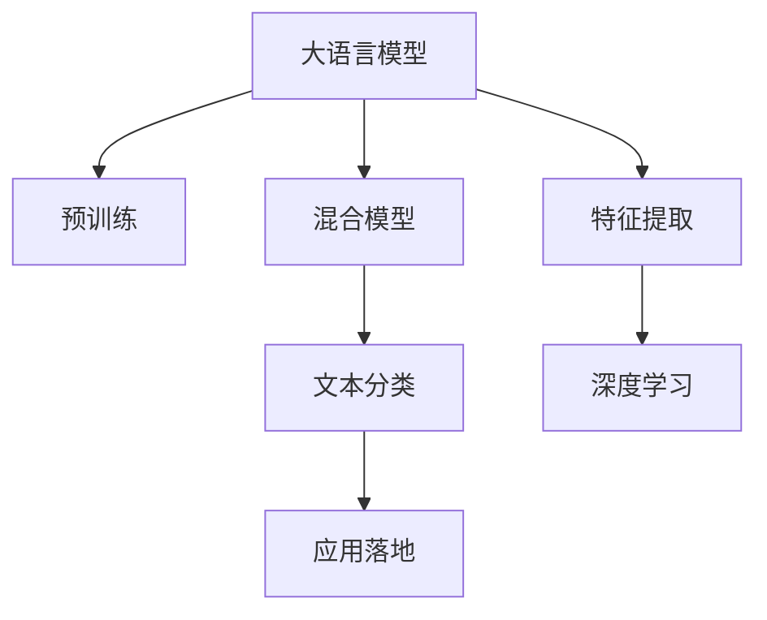

                 

# LLM与传统文本分类技术的结合：文本分析新方向

> 关键词：大语言模型(Large Language Model, LLM), 文本分类, 混合模型(Mixed Model), 预训练模型(Pre-trained Model), 特征提取(Feature Extraction), 深度学习(Deep Learning), 应用落地(Application Deployment)

## 1. 背景介绍

随着自然语言处理(Natural Language Processing, NLP)技术的不断进步，大语言模型(Large Language Model, LLM)在文本分析领域取得了令人瞩目的成果。大语言模型通过在海量文本数据上预训练，学习到丰富的语言知识，具备强大的自然语言理解和生成能力。然而，面对具体的文本分类任务，仅仅依赖大语言模型预训练权重往往效果有限。这促使研究者探索将大语言模型与传统文本分类技术结合的新方法。

文本分类作为NLP中最基础的任务之一，涵盖了新闻分类、垃圾邮件过滤、情感分析等多个场景。传统文本分类方法通过手工特征工程提取文本的统计特征，再通过机器学习算法（如朴素贝叶斯、支持向量机、随机森林等）进行模型训练和预测。而大语言模型则可以自动学习到更深层次的语言表示，并在下游任务上直接进行分类。本文旨在探讨如何将大语言模型与传统文本分类技术进行有效结合，以实现更高效、准确的文本分析。

## 2. 核心概念与联系

### 2.1 核心概念概述

为更好地理解大语言模型与传统文本分类技术结合的原理，本节将介绍几个密切相关的核心概念：

- **大语言模型(LLM)**：如GPT、BERT等，通过在大规模文本语料上预训练得到的模型。具备自动学习语言知识的能力，可以用于各种文本生成、分类、匹配等任务。

- **文本分类**：将文本按照某个分类维度进行分类，如新闻分类、情感分析、垃圾邮件过滤等。传统方法主要基于手工提取的统计特征和机器学习算法。

- **混合模型(Mixed Model)**：将大语言模型与传统文本分类技术结合，使用预训练模型的编码器作为特征提取器，结合手工提取的特征，通过机器学习算法进行训练和预测。

- **预训练模型**：通过在大规模无标签数据上进行训练，学习通用语言表示的模型，如BERT、GPT等。可以在特定任务上进行微调，提升任务性能。

- **特征提取**：从文本中提取有利于分类的统计特征，如词频、TF-IDF、N-gram等。传统文本分类方法依赖于手工特征提取，而大语言模型可以自动提取深层次的语言特征。

- **深度学习**：利用深度神经网络进行文本分类任务的方法。可以处理大规模高维数据，自适应学习复杂模式。

- **应用落地**：将文本分类模型部署到实际应用场景中，进行文本分析和处理。

这些概念之间的逻辑关系可以通过以下Mermaid流程图来展示：



这个流程图展示了大语言模型与文本分类的核心概念及其之间的关系：

1. 大语言模型通过预训练获得基础能力。
2. 混合模型使用预训练模型进行特征提取，结合传统文本分类算法，提升分类性能。
3. 文本分类模型使用混合模型或深度学习算法进行训练和预测。
4. 应用落地环节将模型部署到实际应用场景中，进行文本分析和处理。

## 3. 核心算法原理 & 具体操作步骤
### 3.1 算法原理概述

将大语言模型与传统文本分类技术结合，本质上是一个特征增强与模型融合的过程。其核心思想是：利用预训练大语言模型的强大语言理解能力，提取文本的高层次语言特征，再结合手工提取的统计特征，使用机器学习算法进行分类。

具体而言，假设文本序列为 $x = \{x_1, x_2, \ldots, x_n\}$，大语言模型为 $M_{\theta}$，其中 $\theta$ 为预训练得到的模型参数。将文本 $x$ 输入模型 $M_{\theta}$，得到特征表示 $\mathbf{h} = M_{\theta}(x)$。传统文本分类算法通过手工提取的统计特征 $f(x)$ 和预训练特征 $\mathbf{h}$ 共同组成输入特征向量 $\mathbf{z} = [f(x), \mathbf{h}]$，然后使用机器学习算法（如朴素贝叶斯、SVM、随机森林等）进行分类。

### 3.2 算法步骤详解

结合大语言模型与传统文本分类的过程一般包括以下几个关键步骤：

**Step 1: 准备预训练模型和数据集**
- 选择合适的预训练语言模型 $M_{\theta}$，如BERT、GPT等。
- 准备文本分类任务的标注数据集 $D=\{(x_i, y_i)\}_{i=1}^N, x_i \in \mathcal{X}, y_i \in \{0,1\}$，其中 $\mathcal{X}$ 为文本空间，$\{0,1\}$ 为分类标签。

**Step 2: 设计文本分类任务**
- 确定文本分类的维度，如情感分析、主题分类、垃圾邮件过滤等。
- 设计手工提取的统计特征，如词频、TF-IDF、N-gram等。

**Step 3: 添加任务适配层**
- 将预训练模型的输出 $\mathbf{h}$ 作为特征提取器的输出，结合手工提取的特征 $f(x)$。
- 使用机器学习算法进行训练，分类器可选用朴素贝叶斯、支持向量机、随机森林等。

**Step 4: 设置训练参数**
- 选择合适的训练超参数，如学习率、正则化强度、迭代轮数等。
- 训练算法可选用梯度下降、随机梯度下降等。

**Step 5: 执行训练**
- 将标注数据集 $D$ 以批次为单位输入模型，前向传播计算损失函数。
- 反向传播计算参数梯度，根据设定的优化算法更新模型参数。
- 周期性在验证集上评估模型性能，根据性能指标决定是否触发Early Stopping。
- 重复上述步骤直到满足预设的迭代轮数或Early Stopping条件。

**Step 6: 测试和部署**
- 在测试集上评估微调后模型 $M_{\hat{\theta}}$ 的性能，对比微调前后的精度提升。
- 使用微调后的模型对新样本进行推理预测，集成到实际的应用系统中。

以上就是大语言模型与传统文本分类结合的一般流程。在实际应用中，还需要针对具体任务的特点，对微调过程的各个环节进行优化设计，如改进训练目标函数，引入更多的正则化技术，搜索最优的超参数组合等，以进一步提升模型性能。

### 3.3 算法优缺点

结合大语言模型与传统文本分类技术的方法，具有以下优点：

1. 特征增强：大语言模型可以自动提取高层次语言特征，提升分类效果。
2. 鲁棒性：结合传统特征，可以有效抑制大语言模型可能的过拟合。
3. 适应性强：手工特征提取灵活，可以适应各种文本分类任务。
4. 可解释性：传统分类算法具有较好的可解释性，便于理解和调试。

同时，该方法也存在一定的局限性：

1. 资源消耗：大语言模型需要大量计算资源进行预训练和微调，对计算资源要求较高。
2. 推理开销：大语言模型推理速度较慢，部署到实际应用中可能面临资源瓶颈。
3. 标签依赖：手工特征提取需要大量标注数据，标签标注成本较高。
4. 模型复杂：混合模型结构复杂，调试和维护难度较大。

尽管存在这些局限性，但就目前而言，大语言模型与传统文本分类技术的结合，仍是大规模语言模型在文本分类应用中的主要范式。未来相关研究的重点在于如何进一步降低大语言模型的计算资源消耗，提高推理效率，降低标注成本，以及简化模型结构。

### 3.4 算法应用领域

结合大语言模型与传统文本分类技术的方法，已经在多个文本分析领域得到应用，包括：

- 新闻分类：将新闻文章按照主题、情感、来源等维度进行分类。
- 垃圾邮件过滤：自动识别垃圾邮件和正常邮件。
- 情感分析：判断文本的情感极性，如正面、负面、中性等。
- 主题分类：将文本按照主题进行分类，如体育、政治、经济等。
- 产品评价分析：分析客户对产品的评价，判断评价极性。

除了这些经典任务外，大语言模型与传统文本分类技术的结合方法，还广泛应用于情感分析、舆情监测、市场趋势预测等更多场景中，为文本分析带来新的思路和突破。

## 4. 数学模型和公式 & 详细讲解 & 举例说明
### 4.1 数学模型构建

在本节中，我们将使用数学语言对大语言模型与传统文本分类技术结合的过程进行更加严格的刻画。

假设文本分类任务为二分类问题，即 $y \in \{0,1\}$。预训练语言模型 $M_{\theta}$ 的输出为 $\mathbf{h} = M_{\theta}(x)$，手工提取的特征向量为 $f(x) \in \mathbb{R}^d$。则混合模型可以表示为：

$$
\mathbf{z} = \begin{bmatrix} f(x) \\ \mathbf{h} \end{bmatrix}
$$

其中 $f(x) = [f_1(x), f_2(x), \ldots, f_d(x)]$，$\mathbf{h} = [h_1, h_2, \ldots, h_n]$。混合模型的预测函数为：

$$
p(y=1|\mathbf{z}) = \sigma(\mathbf{w}^T \mathbf{z} + b)
$$

其中 $\mathbf{w}$ 和 $b$ 为分类器参数，$\sigma$ 为sigmoid函数。目标是最小化损失函数：

$$
\mathcal{L} = -\frac{1}{N} \sum_{i=1}^N [y_i \log p(y_i=1|\mathbf{z}_i) + (1-y_i) \log (1-p(y_i=1|\mathbf{z}_i))]
$$

### 4.2 公式推导过程

以下我们将对上述数学模型进行推导，以证明分类器的损失函数。

首先，目标函数可以展开为：

$$
\begin{aligned}
\mathcal{L} &= -\frac{1}{N} \sum_{i=1}^N [y_i \log p(y_i=1|\mathbf{z}_i) + (1-y_i) \log (1-p(y_i=1|\mathbf{z}_i)] \\
&= -\frac{1}{N} \sum_{i=1}^N [y_i \log \sigma(\mathbf{w}^T \mathbf{z}_i + b) + (1-y_i) \log (1-\sigma(\mathbf{w}^T \mathbf{z}_i + b))]
\end{aligned}
$$

利用sigmoid函数的性质，可以得到：

$$
\begin{aligned}
\mathcal{L} &= -\frac{1}{N} \sum_{i=1}^N [y_i \log \sigma(\mathbf{w}^T \mathbf{z}_i + b) + (1-y_i) \log (1-\sigma(\mathbf{w}^T \mathbf{z}_i + b))] \\
&= -\frac{1}{N} \sum_{i=1}^N [y_i (\mathbf{w}^T \mathbf{z}_i + b) - y_i \log \sigma(\mathbf{w}^T \mathbf{z}_i + b) + (1-y_i) (\log (1-\sigma(\mathbf{w}^T \mathbf{z}_i + b))] \\
&= -\frac{1}{N} \sum_{i=1}^N [-y_i \log \sigma(\mathbf{w}^T \mathbf{z}_i + b) + (1-y_i) \log (1-\sigma(\mathbf{w}^T \mathbf{z}_i + b))] \\
&= \mathcal{L}_{CE} + \mathcal{L}_{KL}
\end{aligned}
$$

其中 $\mathcal{L}_{CE}$ 为交叉熵损失，$\mathcal{L}_{KL}$ 为KL散度损失。上述推导过程展示了混合模型的损失函数设计，可以用于优化分类器参数。

### 4.3 案例分析与讲解

为了更直观地理解混合模型的优化过程，这里以情感分析任务为例，详细讲解模型构建和训练过程。

假设情感分析任务的数据集为 $\{(x_i, y_i)\}_{i=1}^N$，其中 $x_i$ 为文本，$y_i \in \{1,0\}$ 为情感标签。预训练模型为BERT，手工提取的特征为TF-IDF特征。

首先，使用BERT模型对文本进行编码，得到表示向量 $\mathbf{h} = M_{\theta}(x)$。然后，将文本的TF-IDF特征向量 $f(x)$ 和表示向量 $\mathbf{h}$ 拼接，组成特征向量 $\mathbf{z} = [f(x), \mathbf{h}]$。接着，使用逻辑回归算法作为分类器，优化目标函数：

$$
\mathcal{L} = -\frac{1}{N} \sum_{i=1}^N [y_i \log p(y_i=1|\mathbf{z}_i) + (1-y_i) \log (1-p(y_i=1|\mathbf{z}_i))]
$$

通过反向传播算法更新分类器的参数 $\mathbf{w}$ 和 $b$，最小化损失函数 $\mathcal{L}$，最终得到情感分类模型。

## 5. 项目实践：代码实例和详细解释说明
### 5.1 开发环境搭建

在进行混合模型项目实践前，我们需要准备好开发环境。以下是使用Python进行PyTorch开发的环境配置流程：

1. 安装Anaconda：从官网下载并安装Anaconda，用于创建独立的Python环境。

2. 创建并激活虚拟环境：
```bash
conda create -n text-classification-env python=3.8 
conda activate text-classification-env
```

3. 安装PyTorch：根据CUDA版本，从官网获取对应的安装命令。例如：
```bash
conda install pytorch torchvision torchaudio cudatoolkit=11.1 -c pytorch -c conda-forge
```

4. 安装Transformers库：
```bash
pip install transformers
```

5. 安装各类工具包：
```bash
pip install numpy pandas scikit-learn matplotlib tqdm jupyter notebook ipython
```

完成上述步骤后，即可在`text-classification-env`环境中开始混合模型实践。

### 5.2 源代码详细实现

下面我们以情感分析任务为例，给出使用Transformers库对BERT模型进行混合模型的PyTorch代码实现。

首先，定义情感分类任务的数据处理函数：

```python
from transformers import BertTokenizer
from torch.utils.data import Dataset
import torch

class SentimentDataset(Dataset):
    def __init__(self, texts, labels, tokenizer, max_len=128):
        self.texts = texts
        self.labels = labels
        self.tokenizer = tokenizer
        self.max_len = max_len
        
    def __len__(self):
        return len(self.texts)
    
    def __getitem__(self, item):
        text = self.texts[item]
        label = self.labels[item]
        
        encoding = self.tokenizer(text, return_tensors='pt', max_length=self.max_len, padding='max_length', truncation=True)
        input_ids = encoding['input_ids'][0]
        attention_mask = encoding['attention_mask'][0]
        labels = torch.tensor(label, dtype=torch.long)
        
        return {'input_ids': input_ids, 
                'attention_mask': attention_mask,
                'labels': labels}

# 标签编码
label2id = {'negative': 0, 'positive': 1}
id2label = {0: 'negative', 1: 'positive'}

# 创建dataset
tokenizer = BertTokenizer.from_pretrained('bert-base-cased')

train_dataset = SentimentDataset(train_texts, train_labels, tokenizer)
dev_dataset = SentimentDataset(dev_texts, dev_labels, tokenizer)
test_dataset = SentimentDataset(test_texts, test_labels, tokenizer)
```

然后，定义模型和优化器：

```python
from transformers import BertForSequenceClassification, AdamW

model = BertForSequenceClassification.from_pretrained('bert-base-cased', num_labels=len(label2id))

optimizer = AdamW(model.parameters(), lr=2e-5)
```

接着，定义训练和评估函数：

```python
from torch.utils.data import DataLoader
from tqdm import tqdm
from sklearn.metrics import classification_report

device = torch.device('cuda') if torch.cuda.is_available() else torch.device('cpu')
model.to(device)

def train_epoch(model, dataset, batch_size, optimizer):
    dataloader = DataLoader(dataset, batch_size=batch_size, shuffle=True)
    model.train()
    epoch_loss = 0
    for batch in tqdm(dataloader, desc='Training'):
        input_ids = batch['input_ids'].to(device)
        attention_mask = batch['attention_mask'].to(device)
        labels = batch['labels'].to(device)
        model.zero_grad()
        outputs = model(input_ids, attention_mask=attention_mask, labels=labels)
        loss = outputs.loss
        epoch_loss += loss.item()
        loss.backward()
        optimizer.step()
    return epoch_loss / len(dataloader)

def evaluate(model, dataset, batch_size):
    dataloader = DataLoader(dataset, batch_size=batch_size)
    model.eval()
    preds, labels = [], []
    with torch.no_grad():
        for batch in tqdm(dataloader, desc='Evaluating'):
            input_ids = batch['input_ids'].to(device)
            attention_mask = batch['attention_mask'].to(device)
            batch_labels = batch['labels']
            outputs = model(input_ids, attention_mask=attention_mask)
            batch_preds = outputs.logits.argmax(dim=1).to('cpu').tolist()
            batch_labels = batch_labels.to('cpu').tolist()
            for pred, label in zip(batch_preds, batch_labels):
                preds.append(id2label[pred])
                labels.append(id2label[label])
                
    print(classification_report(labels, preds))
```

最后，启动训练流程并在测试集上评估：

```python
epochs = 5
batch_size = 16

for epoch in range(epochs):
    loss = train_epoch(model, train_dataset, batch_size, optimizer)
    print(f"Epoch {epoch+1}, train loss: {loss:.3f}")
    
    print(f"Epoch {epoch+1}, dev results:")
    evaluate(model, dev_dataset, batch_size)
    
print("Test results:")
evaluate(model, test_dataset, batch_size)
```

以上就是使用PyTorch对BERT进行情感分析任务混合模型的完整代码实现。可以看到，得益于Transformers库的强大封装，我们可以用相对简洁的代码完成BERT模型的加载和混合模型的训练。

### 5.3 代码解读与分析

让我们再详细解读一下关键代码的实现细节：

**SentimentDataset类**：
- `__init__`方法：初始化文本、标签、分词器等关键组件。
- `__len__`方法：返回数据集的样本数量。
- `__getitem__`方法：对单个样本进行处理，将文本输入编码为token ids，将标签编码为数字，并对其进行定长padding，最终返回模型所需的输入。

**label2id和id2label字典**：
- 定义了标签与数字id之间的映射关系，用于将预测结果解码回真实标签。

**训练和评估函数**：
- 使用PyTorch的DataLoader对数据集进行批次化加载，供模型训练和推理使用。
- 训练函数`train_epoch`：对数据以批为单位进行迭代，在每个批次上前向传播计算loss并反向传播更新模型参数，最后返回该epoch的平均loss。
- 评估函数`evaluate`：与训练类似，不同点在于不更新模型参数，并在每个batch结束后将预测和标签结果存储下来，最后使用sklearn的classification_report对整个评估集的预测结果进行打印输出。

**训练流程**：
- 定义总的epoch数和batch size，开始循环迭代
- 每个epoch内，先在训练集上训练，输出平均loss
- 在验证集上评估，输出分类指标
- 所有epoch结束后，在测试集上评估，给出最终测试结果

可以看到，PyTorch配合Transformers库使得BERT混合模型的代码实现变得简洁高效。开发者可以将更多精力放在数据处理、模型改进等高层逻辑上，而不必过多关注底层的实现细节。

当然，工业级的系统实现还需考虑更多因素，如模型的保存和部署、超参数的自动搜索、更灵活的任务适配层等。但核心的混合模型过程基本与此类似。

## 6. 实际应用场景
### 6.1 智能客服系统

基于大语言模型与传统文本分类技术的混合方法，可以广泛应用于智能客服系统的构建。传统客服往往需要配备大量人力，高峰期响应缓慢，且一致性和专业性难以保证。而使用混合模型构建的智能客服系统，可以7x24小时不间断服务，快速响应客户咨询，用自然流畅的语言解答各类常见问题。

在技术实现上，可以收集企业内部的历史客服对话记录，将问题和最佳答复构建成监督数据，在此基础上对BERT等预训练模型进行混合，训练模型学习问题与回复的映射关系。混合模型可以自动理解客户意图，匹配最合适的答复模板进行回复。对于客户提出的新问题，还可以接入检索系统实时搜索相关内容，动态组织生成回答。如此构建的智能客服系统，能大幅提升客户咨询体验和问题解决效率。

### 6.2 金融舆情监测

金融机构需要实时监测市场舆论动向，以便及时应对负面信息传播，规避金融风险。传统的人工监测方式成本高、效率低，难以应对网络时代海量信息爆发的挑战。基于混合模型的文本分类方法，为金融舆情监测提供了新的解决方案。

具体而言，可以收集金融领域相关的新闻、报道、评论等文本数据，并对其进行主题标注和情感标注。在此基础上对BERT等预训练模型进行混合，训练模型学习文本的情感倾向和主题类别。将混合模型应用到实时抓取的网络文本数据，就能够自动监测不同主题下的情感变化趋势，一旦发现负面信息激增等异常情况，系统便会自动预警，帮助金融机构快速应对潜在风险。

### 6.3 个性化推荐系统

当前的推荐系统往往只依赖用户的历史行为数据进行物品推荐，无法深入理解用户的真实兴趣偏好。基于混合模型的文本分类方法，个性化推荐系统可以更好地挖掘用户行为背后的语义信息，从而提供更精准、多样的推荐内容。

在实践中，可以收集用户浏览、点击、评论、分享等行为数据，提取和用户交互的物品标题、描述、标签等文本内容。将文本内容作为模型输入，用户的后续行为（如是否点击、购买等）作为监督信号，在此基础上对BERT等预训练模型进行混合，训练模型学习物品与用户兴趣点的映射关系。混合模型能够从文本内容中准确把握用户的兴趣点。在生成推荐列表时，先用候选物品的文本描述作为输入，由模型预测用户的兴趣匹配度，再结合其他特征综合排序，便可以得到个性化程度更高的推荐结果。

### 6.4 未来应用展望

随着大语言模型与传统文本分类技术的不断发展，混合模型将在更多领域得到应用，为传统行业带来变革性影响。

在智慧医疗领域，基于混合模型的问答、病历分析、药物研发等应用将提升医疗服务的智能化水平，辅助医生诊疗，加速新药开发进程。

在智能教育领域，混合模型可应用于作业批改、学情分析、知识推荐等方面，因材施教，促进教育公平，提高教学质量。

在智慧城市治理中，混合模型可应用于城市事件监测、舆情分析、应急指挥等环节，提高城市管理的自动化和智能化水平，构建更安全、高效的未来城市。

此外，在企业生产、社会治理、文娱传媒等众多领域，基于混合模型的文本分析方法也将不断涌现，为经济社会发展注入新的动力。相信随着技术的日益成熟，混合模型必将成为文本分析的重要范式，推动人工智能技术在垂直行业的规模化落地。

## 7. 工具和资源推荐
### 7.1 学习资源推荐

为了帮助开发者系统掌握大语言模型与传统文本分类技术的结合原理和实践技巧，这里推荐一些优质的学习资源：

1. 《Transformer从原理到实践》系列博文：由大模型技术专家撰写，深入浅出地介绍了Transformer原理、BERT模型、混合模型等前沿话题。

2. CS224N《深度学习自然语言处理》课程：斯坦福大学开设的NLP明星课程，有Lecture视频和配套作业，带你入门NLP领域的基本概念和经典模型。

3. 《Natural Language Processing with Transformers》书籍：Transformers库的作者所著，全面介绍了如何使用Transformers库进行NLP任务开发，包括混合模型在内的诸多范式。

4. HuggingFace官方文档：Transformers库的官方文档，提供了海量预训练模型和完整的混合模型样例代码，是上手实践的必备资料。

5. CLUE开源项目：中文语言理解测评基准，涵盖大量不同类型的中文NLP数据集，并提供了基于混合模型的baseline模型，助力中文NLP技术发展。

通过对这些资源的学习实践，相信你一定能够快速掌握大语言模型与传统文本分类技术的结合精髓，并用于解决实际的NLP问题。
###  7.2 开发工具推荐

高效的开发离不开优秀的工具支持。以下是几款用于混合模型开发的常用工具：

1. PyTorch：基于Python的开源深度学习框架，灵活动态的计算图，适合快速迭代研究。大部分预训练语言模型都有PyTorch版本的实现。

2. TensorFlow：由Google主导开发的开源深度学习框架，生产部署方便，适合大规模工程应用。同样有丰富的预训练语言模型资源。

3. Transformers库：HuggingFace开发的NLP工具库，集成了众多SOTA语言模型，支持PyTorch和TensorFlow，是进行混合模型开发的利器。

4. Weights & Biases：模型训练的实验跟踪工具，可以记录和可视化模型训练过程中的各项指标，方便对比和调优。与主流深度学习框架无缝集成。

5. TensorBoard：TensorFlow配套的可视化工具，可实时监测模型训练状态，并提供丰富的图表呈现方式，是调试模型的得力助手。

6. Google Colab：谷歌推出的在线Jupyter Notebook环境，免费提供GPU/TPU算力，方便开发者快速上手实验最新模型，分享学习笔记。

合理利用这些工具，可以显著提升混合模型的开发效率，加快创新迭代的步伐。

### 7.3 相关论文推荐

大语言模型与混合文本分类技术的发展源于学界的持续研究。以下是几篇奠基性的相关论文，推荐阅读：

1. Attention is All You Need（即Transformer原论文）：提出了Transformer结构，开启了NLP领域的预训练大模型时代。

2. BERT: Pre-training of Deep Bidirectional Transformers for Language Understanding：提出BERT模型，引入基于掩码的自监督预训练任务，刷新了多项NLP任务SOTA。

3. Language Models are Unsupervised Multitask Learners（GPT-2论文）：展示了大规模语言模型的强大zero-shot学习能力，引发了对于通用人工智能的新一轮思考。

4. Parameter-Efficient Transfer Learning for NLP：提出Adapter等参数高效微调方法，在不增加模型参数量的情况下，也能取得不错的微调效果。

5. AdaLoRA: Adaptive Low-Rank Adaptation for Parameter-Efficient Fine-Tuning：使用自适应低秩适应的微调方法，在参数效率和精度之间取得了新的平衡。

6. Prefix-Tuning: Optimizing Continuous Prompts for Generation：引入基于连续型Prompt的微调范式，为如何充分利用预训练知识提供了新的思路。

这些论文代表了大语言模型与混合文本分类技术的发展脉络。通过学习这些前沿成果，可以帮助研究者把握学科前进方向，激发更多的创新灵感。

## 8. 总结：未来发展趋势与挑战

### 8.1 总结

本文对大语言模型与传统文本分类技术的结合进行了全面系统的介绍。首先阐述了混合模型的研究背景和意义，明确了混合模型在拓展预训练模型应用、提升下游任务性能方面的独特价值。其次，从原理到实践，详细讲解了混合模型的数学原理和关键步骤，给出了混合模型任务开发的完整代码实例。同时，本文还广泛探讨了混合模型在智能客服、金融舆情、个性化推荐等多个行业领域的应用前景，展示了混合模型范式的巨大潜力。此外，本文精选了混合模型技术的各类学习资源，力求为读者提供全方位的技术指引。

通过本文的系统梳理，可以看到，大语言模型与传统文本分类技术的结合方法，正在成为NLP领域的重要范式，极大地拓展了预训练语言模型的应用边界，催生了更多的落地场景。受益于大规模语料的预训练和传统特征的结合，混合模型可以在保证性能的同时，降低资源消耗，提高可解释性，具有强大的应用潜力。未来，伴随预训练语言模型和混合模型方法的不断演进，相信NLP技术将在更广阔的应用领域大放异彩，深刻影响人类的生产生活方式。

### 8.2 未来发展趋势

展望未来，混合模型的发展将呈现以下几个趋势：

1. 模型规模持续增大。随着算力成本的下降和数据规模的扩张，预训练语言模型的参数量还将持续增长。超大规模语言模型蕴含的丰富语言知识，有望支撑更加复杂多变的文本分类任务。

2. 混合模型结构优化。未来将涌现更多混合模型结构优化方法，如注意力机制、残差连接等，增强模型对长文本和复杂文本的处理能力。

3. 知识图谱与混合模型的融合。将知识图谱与混合模型结合，引入结构化知识，提升模型对文本的理解和推理能力。

4. 迁移学习能力增强。混合模型可以通过迁移学习，从预训练模型中提取通用的语言知识，应用于更多下游任务，提升模型的泛化能力。

5. 多模态融合。当前的混合模型主要聚焦于纯文本数据，未来会进一步拓展到图像、视频、语音等多模态数据微调。多模态信息的融合，将显著提升混合模型对现实世界的理解和建模能力。

6. 个性化推荐系统：混合模型可以应用于个性化推荐系统，通过文本分类和特征提取，学习用户兴趣点，生成个性化推荐结果。

以上趋势凸显了混合模型的广阔前景。这些方向的探索发展，必将进一步提升混合模型的性能和应用范围，为NLP技术在垂直行业的规模化落地提供更多可能性。

### 8.3 面临的挑战

尽管混合模型已经取得了一定的应用效果，但在迈向更加智能化、普适化应用的过程中，它仍面临诸多挑战：

1. 资源消耗：大语言模型需要大量计算资源进行预训练和微调，对计算资源要求较高。GPU/TPU等高性能设备是必不可少的，但即便如此，超大批次的训练和推理也可能遇到资源瓶颈。

2. 推理开销：大语言模型推理速度较慢，部署到实际应用中可能面临推理效率问题。

3. 标注成本：手工特征提取需要大量标注数据，标签标注成本较高。

4. 模型复杂：混合模型结构复杂，调试和维护难度较大。

尽管存在这些局限性，但就目前而言，混合模型仍是预训练语言模型在文本分类应用中的主要范式。未来相关研究的重点在于如何进一步降低大语言模型的计算资源消耗，提高推理效率，降低标注成本，以及简化模型结构。

### 8.4 研究展望

面向未来，混合模型技术的研究方向可能包括：

1. 探索无监督和半监督混合模型方法。摆脱对大规模标注数据的依赖，利用自监督学习、主动学习等无监督和半监督范式，最大限度利用非结构化数据，实现更加灵活高效的混合模型。

2. 研究知识图谱与混合模型的融合。将知识图谱与混合模型结合，引入结构化知识，提升模型对文本的理解和推理能力。

3. 引入更多先验知识。将符号化的先验知识，如知识图谱、逻辑规则等，与神经网络模型进行巧妙融合，引导混合模型学习更准确、合理的语言模型。

4. 结合因果分析和博弈论工具。将因果分析方法引入混合模型，识别出模型决策的关键特征，增强输出解释的因果性和逻辑性。借助博弈论工具刻画人机交互过程，主动探索并规避模型的脆弱点，提高系统稳定性。

5. 纳入伦理道德约束。在模型训练目标中引入伦理导向的评估指标，过滤和惩罚有偏见、有害的输出倾向。同时加强人工干预和审核，建立模型行为的监管机制，确保输出符合人类价值观和伦理道德。

这些研究方向的探索，必将引领混合模型技术迈向更高的台阶，为构建安全、可靠、可解释、可控的智能系统铺平道路。面向未来，混合模型技术还需要与其他人工智能技术进行更深入的融合，如知识表示、因果推理、强化学习等，多路径协同发力，共同推动自然语言理解和智能交互系统的进步。只有勇于创新、敢于突破，才能不断拓展语言模型的边界，让智能技术更好地造福人类社会。

## 9. 附录：常见问题与解答

**Q1：混合模型是否适用于所有文本分类任务？**

A: 混合模型在大多数文本分类任务上都能取得不错的效果，特别是对于数据量较小的任务。但对于一些特定领域的任务，如医学、法律等，仅仅依靠通用语料预训练的模型可能难以很好地适应。此时需要在特定领域语料上进一步预训练，再进行混合，才能获得理想效果。此外，对于一些需要时效性、个性化很强的任务，如对话、推荐等，混合模型也需要针对性的改进优化。

**Q2：混合模型如何平衡预训练模型和手工特征的重要性？**

A: 混合模型需要同时考虑预训练模型和手工特征的重要性。预训练模型能够提供深层次的语言表示，有助于提高模型的泛化能力和鲁棒性。手工特征则提供具体的统计信息，能够增强模型对特定领域知识的理解。因此，在混合模型设计中，通常需要设计合适的特征融合策略，如线性拼接、注意力机制等，在预训练模型和手工特征之间找到最优的权衡点。

**Q3：混合模型在实际应用中是否需要调整超参数？**

A: 混合模型在实际应用中同样需要调整超参数。与传统机器学习模型类似，超参数的调整是混合模型性能优化的关键环节。常见的超参数包括学习率、正则化强度、批次大小、迭代轮数等。通过网格搜索、随机搜索等方法，可以找到最优的超参数组合，提升混合模型的效果。

**Q4：混合模型在落地部署时需要注意哪些问题？**

A: 将混合模型转化为实际应用，还需要考虑以下因素：
1. 模型裁剪：去除不必要的层和参数，减小模型尺寸，加快推理速度。
2. 量化加速：将浮点模型转为定点模型，压缩存储空间，提高计算效率。
3. 服务化封装：将模型封装为标准化服务接口，便于集成调用。
4. 弹性伸缩：根据请求流量动态调整资源配置，平衡服务质量和成本。
5. 监控告警：实时采集系统指标，设置异常告警阈值，确保服务稳定性。
6. 安全防护：采用访问鉴权、数据脱敏等措施，保障数据和模型安全。

混合模型为NLP应用开启了广阔的想象空间，但如何将强大的性能转化为稳定、高效、安全的业务价值，还需要工程实践的不断打磨。唯有从数据、算法、工程、业务等多个维度协同发力，才能真正实现人工智能技术在垂直行业的规模化落地。总之，混合模型需要开发者根据具体任务，不断迭代和优化模型、数据和算法，方能得到理想的效果。

---

作者：禅与计算机程序设计艺术 / Zen and the Art of Computer Programming

