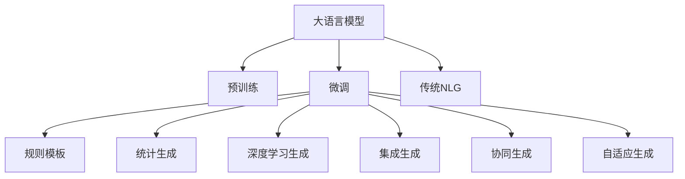

                 

# LLM与传统自然语言生成技术的对比与融合

大语言模型（Large Language Models, LLMs）的出现，无疑给自然语言生成（Natural Language Generation, NLG）领域带来了革命性的变化。本文将对大语言模型与传统自然语言生成技术进行全面系统的对比与融合，探讨其优缺点，并提供实际应用示例，以便更好地理解和应用这两种技术。

## 1. 背景介绍

### 1.1 问题由来

传统自然语言生成技术主要依赖于规则或模板，如语言分析、逻辑推理、统计建模等方法，生成结构化或半结构化的文本。但这些技术往往需要大量的人工设计和规则编写，成本高，灵活性差，且生成的文本质量依赖于规则和模板的质量。而大语言模型则通过大规模无标签文本数据的自监督预训练，学习到语言的知识表示，具有强大的语言生成能力，能够生成自然流畅、富有情感和创意的文本。

### 1.2 问题核心关键点

大语言模型与传统自然语言生成技术的核心关键点在于：
1. **数据依赖**：大语言模型高度依赖于预训练数据的丰富性和多样性，而传统方法则主要依赖于人工规则和模板。
2. **生成能力**：大语言模型可以生成更加多样、富有创意的文本，而传统方法生成的文本较为单调、固定。
3. **灵活性**：大语言模型具有高度的灵活性，能够根据任务需求进行微调，而传统方法则需要重新设计和开发。
4. **可解释性**：大语言模型缺乏可解释性，难以理解其生成文本的逻辑和依据，而传统方法则有较强的可解释性。

## 2. 核心概念与联系

### 2.1 核心概念概述

为更好地理解大语言模型与传统自然语言生成技术的对比与融合，本节将介绍几个密切相关的核心概念：

- 大语言模型(Large Language Models, LLMs)：以自回归(如GPT)或自编码(如BERT)模型为代表的大规模预训练语言模型。通过在大规模无标签文本语料上进行预训练，学习到语言的通用表示，具备强大的语言理解和生成能力。

- 自然语言生成(Natural Language Generation, NLG)：将结构化或半结构化数据转换为自然语言的文本。常见的任务包括自动摘要、文本生成、对话系统等。

- 预训练(Pre-training)：指在大规模无标签文本语料上，通过自监督学习任务训练通用语言模型的过程。常见的预训练任务包括掩码语言模型、下一步预测等。

- 微调(Fine-tuning)：指在预训练模型的基础上，使用下游任务的少量标注数据，通过有监督学习优化模型在该任务上的性能。

- 规则模板生成(模板驱动NLG)：通过定义语法和语义规则，生成符合规则的文本。依赖人工设计和规则编写，生成效率高，但灵活性差。

- 统计生成(统计驱动NLG)：基于统计模型，通过训练模型生成符合分布的文本。依赖大量标注数据，生成效率高，但需要人工标注。

- 深度学习驱动NLG：利用深度学习模型进行文本生成，如RNN、CNN、Transformer等。生成效果好，但依赖大量标注数据和计算资源。

- 集成生成(集成学习)：将多个生成模型进行组合，利用其优点，生成效果更好。依赖于模型融合技术，生成效率高。

- 协同生成(Co-generative)：多个模型协同工作，生成效果更好。依赖于模型通信和协同技术，生成效率高。

- 自适应生成(Adaptive NLG)：根据输入数据的变化，动态调整生成模型，生成效果更好。依赖于模型自适应技术，生成效率高。

这些核心概念之间的逻辑关系可以通过以下Mermaid流程图来展示：



这个流程图展示了大语言模型、微调技术、传统NLG及其衍生技术之间的联系，说明了大语言模型可以通过微调生成各类文本，同时也可以与传统NLG技术进行融合，提升生成效果。

## 3. 核心算法原理 & 具体操作步骤
### 3.1 算法原理概述

大语言模型与传统自然语言生成技术的核心算法原理主要体现在以下几个方面：

1. **预训练**：大语言模型通过大规模无标签文本数据的自监督预训练，学习到语言的通用表示，而传统自然语言生成技术依赖于人工规则和模板。

2. **微调**：大语言模型通过微调优化特定任务的表现，而传统自然语言生成技术依赖于人工规则和模板的调整。

3. **生成**：大语言模型可以生成自然流畅、富有创意的文本，而传统自然语言生成技术生成效果依赖于规则和模板的质量。

4. **融合**：大语言模型与传统自然语言生成技术的融合，可以取长补短，提升生成效果。

### 3.2 算法步骤详解

#### 大语言模型微调步骤详解

1. **准备预训练模型和数据集**：选择合适的预训练语言模型，准备下游任务的数据集。
2. **添加任务适配层**：根据任务类型，在预训练模型顶层设计合适的输出层和损失函数。
3. **设置微调超参数**：选择合适的优化算法及其参数，如AdamW、SGD等，设置学习率、批大小、迭代轮数等。
4. **执行梯度训练**：将训练集数据分批次输入模型，前向传播计算损失函数。反向传播计算参数梯度，根据设定的优化算法和学习率更新模型参数。
5. **测试和部署**：在测试集上评估微调后模型，使用微调后的模型进行文本生成，集成到实际的应用系统中。

#### 传统自然语言生成技术步骤详解

1. **设计规则和模板**：根据任务需求，设计语法和语义规则，或编写生成模板。
2. **生成文本**：根据输入数据，利用规则和模板生成文本。
3. **优化生成效果**：根据生成文本的质量，不断调整规则和模板，提升生成效果。

### 3.3 算法优缺点

#### 大语言模型的优点

1. **生成效果好**：大语言模型可以生成自然流畅、富有创意的文本。
2. **灵活性强**：大语言模型可以根据任务需求进行微调，提升生成效果。
3. **数据利用率高**：大语言模型可以充分利用大规模无标签数据进行预训练，提升模型效果。

#### 大语言模型的缺点

1. **计算资源消耗大**：大语言模型需要大量的计算资源进行预训练和微调。
2. **依赖数据**：大语言模型依赖于大规模无标签数据的预训练，生成效果依赖于数据质量。
3. **缺乏可解释性**：大语言模型缺乏可解释性，难以理解其生成文本的逻辑和依据。

#### 传统自然语言生成技术的优点

1. **生成效率高**：传统自然语言生成技术生成效率高，适用于需要快速生成的场景。
2. **依赖规则和模板**：传统自然语言生成技术依赖规则和模板，易于调整和优化。
3. **生成效果稳定**：传统自然语言生成技术生成效果稳定，受规则和模板质量影响较小。

#### 传统自然语言生成技术的缺点

1. **灵活性差**：传统自然语言生成技术灵活性差，难以应对复杂多变的任务需求。
2. **生成效果单一**：传统自然语言生成技术生成效果单一，难以生成富有创意的文本。
3. **依赖人工**：传统自然语言生成技术依赖人工规则和模板的编写，成本高，周期长。

### 3.4 算法应用领域

大语言模型与传统自然语言生成技术在各个应用领域都有广泛的应用，例如：

#### 医疗领域

1. **病历生成**：通过预训练模型微调，生成病历文本。
2. **药物说明书**：生成药物的说明书，包含药理、用法、副作用等信息。
3. **医学报告**：生成医学报告，提供疾病诊断和分析。

#### 金融领域

1. **金融新闻**：生成金融市场新闻，提供实时行情分析。
2. **投资报告**：生成投资报告，提供市场分析和投资建议。
3. **客户服务**：生成客户服务文本，提供自动客服解决方案。

#### 教育领域

1. **自动生成试卷**：生成各类学科的试卷和答案。
2. **教材生成**：生成教材内容，提供教育资源。
3. **作业批改**：生成作业批改文本，提供自动评分和反馈。

#### 媒体领域

1. **新闻生成**：生成新闻报道，提供实时资讯。
2. **文章生成**：生成各类文章，如科技、体育、娱乐等。
3. **广告文案**：生成广告文案，提升营销效果。

## 4. 数学模型和公式 & 详细讲解

### 4.1 数学模型构建

#### 大语言模型

大语言模型的数学模型通常使用Transformer架构，包含多个自注意力机制层和全连接层。以Transformer为例，其数学模型可以表示为：

$$
\text{Self-Attention}(Q, K, V) = \text{Softmax}(\frac{QK^T}{\sqrt{d_k}})V
$$

其中，$Q$、$K$、$V$分别为查询、键、值向量，$d_k$为向量维度。

#### 传统自然语言生成技术

传统自然语言生成技术的数学模型通常使用统计模型，如隐马尔可夫模型(HMM)、条件随机场(CRF)等。以条件随机场为例，其数学模型可以表示为：

$$
P(Y|X) = \frac{1}{Z}\prod_{i=1}^{n}\phi(X_i, Y_i)
$$

其中，$X$为输入文本，$Y$为生成文本，$n$为文本长度，$\phi$为条件概率模型，$Z$为归一化因子。

### 4.2 公式推导过程

#### 大语言模型

以Transformer为例，其生成过程可以表示为：

$$
P(x_t|x_{<t}) = \frac{\exp(\text{Score}(x_t, x_{<t}))}{\sum_{i=1}^{v}\exp(\text{Score}(x_i, x_{<t}))}
$$

其中，$x_t$为生成文本的第$t$个词，$x_{<t}$为前$t-1$个词。

#### 传统自然语言生成技术

以条件随机场为例，其生成过程可以表示为：

$$
P(y_t|x_t, y_{<t}) = \frac{\phi(x_t, y_t)\prod_{i=1}^{t-1}\phi(x_i, y_i)}{\sum_{y_t}\phi(x_t, y_t)\prod_{i=1}^{t-1}\phi(x_i, y_i)}
$$

其中，$y_t$为生成文本的第$t$个词，$x_t$为输入文本的第$t$个词。

### 4.3 案例分析与讲解

#### 大语言模型案例分析

1. **GPT-3生成文本**：通过预训练模型微调，生成富有创意和情感的文本。
2. **BERT生成文本**：通过微调，生成新闻摘要、产品描述等文本。

#### 传统自然语言生成技术案例分析

1. **规则模板生成新闻**：根据规则和模板，生成新闻报道。
2. **统计生成药物说明书**：根据统计模型，生成药物说明书。

## 5. 项目实践：代码实例和详细解释说明

### 5.1 开发环境搭建

在进行大语言模型与传统自然语言生成技术的融合实践前，我们需要准备好开发环境。以下是使用Python进行PyTorch开发的环境配置流程：

1. 安装Anaconda：从官网下载并安装Anaconda，用于创建独立的Python环境。

2. 创建并激活虚拟环境：
```bash
conda create -n pytorch-env python=3.8 
conda activate pytorch-env
```

3. 安装PyTorch：根据CUDA版本，从官网获取对应的安装命令。例如：
```bash
conda install pytorch torchvision torchaudio cudatoolkit=11.1 -c pytorch -c conda-forge
```

4. 安装Transformers库：
```bash
pip install transformers
```

5. 安装各类工具包：
```bash
pip install numpy pandas scikit-learn matplotlib tqdm jupyter notebook ipython
```

完成上述步骤后，即可在`pytorch-env`环境中开始融合实践。

### 5.2 源代码详细实现

下面以医疗领域的应用为例，给出使用Transformers库对BERT模型进行微调的PyTorch代码实现。

首先，定义医疗领域的命名实体识别任务：

```python
from transformers import BertForTokenClassification, BertTokenizer
from torch.utils.data import Dataset
import torch

class MedicalNERDataset(Dataset):
    def __init__(self, texts, tags, tokenizer, max_len=128):
        self.texts = texts
        self.tags = tags
        self.tokenizer = tokenizer
        self.max_len = max_len
        
    def __len__(self):
        return len(self.texts)
    
    def __getitem__(self, item):
        text = self.texts[item]
        tags = self.tags[item]
        
        encoding = self.tokenizer(text, return_tensors='pt', max_length=self.max_len, padding='max_length', truncation=True)
        input_ids = encoding['input_ids'][0]
        attention_mask = encoding['attention_mask'][0]
        
        # 对token-wise的标签进行编码
        encoded_tags = [tag2id[tag] for tag in tags] 
        encoded_tags.extend([tag2id['O']] * (self.max_len - len(encoded_tags)))
        labels = torch.tensor(encoded_tags, dtype=torch.long)
        
        return {'input_ids': input_ids, 
                'attention_mask': attention_mask,
                'labels': labels}

# 标签与id的映射
tag2id = {'O': 0, 'B-PER': 1, 'I-PER': 2, 'B-LOC': 3, 'I-LOC': 4}
id2tag = {v: k for k, v in tag2id.items()}

# 创建dataset
tokenizer = BertTokenizer.from_pretrained('bert-base-cased')

train_dataset = MedicalNERDataset(train_texts, train_tags, tokenizer)
dev_dataset = MedicalNERDataset(dev_texts, dev_tags, tokenizer)
test_dataset = MedicalNERDataset(test_texts, test_tags, tokenizer)
```

然后，定义模型和优化器：

```python
from transformers import BertForTokenClassification, AdamW

model = BertForTokenClassification.from_pretrained('bert-base-cased', num_labels=len(tag2id))

optimizer = AdamW(model.parameters(), lr=2e-5)
```

接着，定义训练和评估函数：

```python
from torch.utils.data import DataLoader
from tqdm import tqdm
from sklearn.metrics import classification_report

device = torch.device('cuda') if torch.cuda.is_available() else torch.device('cpu')
model.to(device)

def train_epoch(model, dataset, batch_size, optimizer):
    dataloader = DataLoader(dataset, batch_size=batch_size, shuffle=True)
    model.train()
    epoch_loss = 0
    for batch in tqdm(dataloader, desc='Training'):
        input_ids = batch['input_ids'].to(device)
        attention_mask = batch['attention_mask'].to(device)
        labels = batch['labels'].to(device)
        model.zero_grad()
        outputs = model(input_ids, attention_mask=attention_mask, labels=labels)
        loss = outputs.loss
        epoch_loss += loss.item()
        loss.backward()
        optimizer.step()
    return epoch_loss / len(dataloader)

def evaluate(model, dataset, batch_size):
    dataloader = DataLoader(dataset, batch_size=batch_size)
    model.eval()
    preds, labels = [], []
    with torch.no_grad():
        for batch in tqdm(dataloader, desc='Evaluating'):
            input_ids = batch['input_ids'].to(device)
            attention_mask = batch['attention_mask'].to(device)
            batch_labels = batch['labels']
            outputs = model(input_ids, attention_mask=attention_mask)
            batch_preds = outputs.logits.argmax(dim=2).to('cpu').tolist()
            batch_labels = batch_labels.to('cpu').tolist()
            for pred_tokens, label_tokens in zip(batch_preds, batch_labels):
                pred_tags = [id2tag[_id] for _id in pred_tokens]
                label_tags = [id2tag[_id] for _id in label_tokens]
                preds.append(pred_tags[:len(label_tags)])
                labels.append(label_tags)
                
    print(classification_report(labels, preds))
```

最后，启动训练流程并在测试集上评估：

```python
epochs = 5
batch_size = 16

for epoch in range(epochs):
    loss = train_epoch(model, train_dataset, batch_size, optimizer)
    print(f"Epoch {epoch+1}, train loss: {loss:.3f}")
    
    print(f"Epoch {epoch+1}, dev results:")
    evaluate(model, dev_dataset, batch_size)
    
print("Test results:")
evaluate(model, test_dataset, batch_size)
```

以上就是使用PyTorch对BERT进行医疗领域命名实体识别任务微调的完整代码实现。可以看到，得益于Transformers库的强大封装，我们可以用相对简洁的代码完成BERT模型的加载和微调。

### 5.3 代码解读与分析

让我们再详细解读一下关键代码的实现细节：

**MedicalNERDataset类**：
- `__init__`方法：初始化文本、标签、分词器等关键组件。
- `__len__`方法：返回数据集的样本数量。
- `__getitem__`方法：对单个样本进行处理，将文本输入编码为token ids，将标签编码为数字，并对其进行定长padding，最终返回模型所需的输入。

**tag2id和id2tag字典**：
- 定义了标签与数字id之间的映射关系，用于将token-wise的预测结果解码回真实的标签。

**训练和评估函数**：
- 使用PyTorch的DataLoader对数据集进行批次化加载，供模型训练和推理使用。
- 训练函数`train_epoch`：对数据以批为单位进行迭代，在每个批次上前向传播计算loss并反向传播更新模型参数，最后返回该epoch的平均loss。
- 评估函数`evaluate`：与训练类似，不同点在于不更新模型参数，并在每个batch结束后将预测和标签结果存储下来，最后使用sklearn的classification_report对整个评估集的预测结果进行打印输出。

**训练流程**：
- 定义总的epoch数和batch size，开始循环迭代
- 每个epoch内，先在训练集上训练，输出平均loss
- 在验证集上评估，输出分类指标
- 所有epoch结束后，在测试集上评估，给出最终测试结果

可以看到，PyTorch配合Transformers库使得BERT微调的代码实现变得简洁高效。开发者可以将更多精力放在数据处理、模型改进等高层逻辑上，而不必过多关注底层的实现细节。

当然，工业级的系统实现还需考虑更多因素，如模型的保存和部署、超参数的自动搜索、更灵活的任务适配层等。但核心的微调范式基本与此类似。

## 6. 实际应用场景

### 6.1 智能客服系统

基于大语言模型微调的对话技术，可以广泛应用于智能客服系统的构建。传统客服往往需要配备大量人力，高峰期响应缓慢，且一致性和专业性难以保证。而使用微调后的对话模型，可以7x24小时不间断服务，快速响应客户咨询，用自然流畅的语言解答各类常见问题。

在技术实现上，可以收集企业内部的历史客服对话记录，将问题和最佳答复构建成监督数据，在此基础上对预训练对话模型进行微调。微调后的对话模型能够自动理解用户意图，匹配最合适的答案模板进行回复。对于客户提出的新问题，还可以接入检索系统实时搜索相关内容，动态组织生成回答。如此构建的智能客服系统，能大幅提升客户咨询体验和问题解决效率。

### 6.2 金融舆情监测

金融机构需要实时监测市场舆论动向，以便及时应对负面信息传播，规避金融风险。传统的人工监测方式成本高、效率低，难以应对网络时代海量信息爆发的挑战。基于大语言模型微调的文本分类和情感分析技术，为金融舆情监测提供了新的解决方案。

具体而言，可以收集金融领域相关的新闻、报道、评论等文本数据，并对其进行主题标注和情感标注。在此基础上对预训练语言模型进行微调，使其能够自动判断文本属于何种主题，情感倾向是正面、中性还是负面。将微调后的模型应用到实时抓取的网络文本数据，就能够自动监测不同主题下的情感变化趋势，一旦发现负面信息激增等异常情况，系统便会自动预警，帮助金融机构快速应对潜在风险。

### 6.3 个性化推荐系统

当前的推荐系统往往只依赖用户的历史行为数据进行物品推荐，无法深入理解用户的真实兴趣偏好。基于大语言模型微调技术，个性化推荐系统可以更好地挖掘用户行为背后的语义信息，从而提供更精准、多样的推荐内容。

在实践中，可以收集用户浏览、点击、评论、分享等行为数据，提取和用户交互的物品标题、描述、标签等文本内容。将文本内容作为模型输入，用户的后续行为（如是否点击、购买等）作为监督信号，在此基础上微调预训练语言模型。微调后的模型能够从文本内容中准确把握用户的兴趣点。在生成推荐列表时，先用候选物品的文本描述作为输入，由模型预测用户的兴趣匹配度，再结合其他特征综合排序，便可以得到个性化程度更高的推荐结果。

### 6.4 未来应用展望

随着大语言模型微调技术的发展，其在各个应用领域的应用前景也将不断拓展。

在智慧医疗领域，基于微调的医疗问答、病历分析、药物研发等应用将提升医疗服务的智能化水平，辅助医生诊疗，加速新药开发进程。

在智能教育领域，微调技术可应用于作业批改、学情分析、知识推荐等方面，因材施教，促进教育公平，提高教学质量。

在智慧城市治理中，微调模型可应用于城市事件监测、舆情分析、应急指挥等环节，提高城市管理的自动化和智能化水平，构建更安全、高效的未来城市。

此外，在企业生产、社会治理、文娱传媒等众多领域，基于大模型微调的人工智能应用也将不断涌现，为传统行业带来变革性影响。相信随着技术的日益成熟，微调方法将成为人工智能落地应用的重要范式，推动人工智能技术在垂直行业的规模化落地。总之，大语言模型微调技术在未来将具有广阔的应用前景，必将深刻影响人类的生产生活方式。

## 7. 工具和资源推荐

### 7.1 学习资源推荐

为了帮助开发者系统掌握大语言模型与传统自然语言生成技术的理论基础和实践技巧，这里推荐一些优质的学习资源：

1. 《Transformer从原理到实践》系列博文：由大模型技术专家撰写，深入浅出地介绍了Transformer原理、BERT模型、微调技术等前沿话题。

2. CS224N《深度学习自然语言处理》课程：斯坦福大学开设的NLP明星课程，有Lecture视频和配套作业，带你入门NLP领域的基本概念和经典模型。

3. 《Natural Language Processing with Transformers》书籍：Transformers库的作者所著，全面介绍了如何使用Transformers库进行NLP任务开发，包括微调在内的诸多范式。

4. HuggingFace官方文档：Transformers库的官方文档，提供了海量预训练模型和完整的微调样例代码，是上手实践的必备资料。

5. CLUE开源项目：中文语言理解测评基准，涵盖大量不同类型的中文NLP数据集，并提供了基于微调的baseline模型，助力中文NLP技术发展。

通过对这些资源的学习实践，相信你一定能够快速掌握大语言模型与传统自然语言生成技术的精髓，并用于解决实际的NLP问题。

### 7.2 开发工具推荐

高效的开发离不开优秀的工具支持。以下是几款用于大语言模型与传统自然语言生成技术融合开发的常用工具：

1. PyTorch：基于Python的开源深度学习框架，灵活动态的计算图，适合快速迭代研究。大部分预训练语言模型都有PyTorch版本的实现。

2. TensorFlow：由Google主导开发的开源深度学习框架，生产部署方便，适合大规模工程应用。同样有丰富的预训练语言模型资源。

3. Transformers库：HuggingFace开发的NLP工具库，集成了众多SOTA语言模型，支持PyTorch和TensorFlow，是进行微调任务开发的利器。

4. Weights & Biases：模型训练的实验跟踪工具，可以记录和可视化模型训练过程中的各项指标，方便对比和调优。与主流深度学习框架无缝集成。

5. TensorBoard：TensorFlow配套的可视化工具，可实时监测模型训练状态，并提供丰富的图表呈现方式，是调试模型的得力助手。

6. Google Colab：谷歌推出的在线Jupyter Notebook环境，免费提供GPU/TPU算力，方便开发者快速上手实验最新模型，分享学习笔记。

合理利用这些工具，可以显著提升大语言模型与传统自然语言生成技术的融合开发效率，加快创新迭代的步伐。

### 7.3 相关论文推荐

大语言模型与传统自然语言生成技术的发展源于学界的持续研究。以下是几篇奠基性的相关论文，推荐阅读：

1. Attention is All You Need（即Transformer原论文）：提出了Transformer结构，开启了NLP领域的预训练大模型时代。

2. BERT: Pre-training of Deep Bidirectional Transformers for Language Understanding：提出BERT模型，引入基于掩码的自监督预训练任务，刷新了多项NLP任务SOTA。

3. Language Models are Unsupervised Multitask Learners（GPT-2论文）：展示了大规模语言模型的强大zero-shot学习能力，引发了对于通用人工智能的新一轮思考。

4. Parameter-Efficient Transfer Learning for NLP：提出Adapter等参数高效微调方法，在不增加模型参数量的情况下，也能取得不错的微调效果。

5. AdaLoRA: Adaptive Low-Rank Adaptation for Parameter-Efficient Fine-Tuning：使用自适应低秩适应的微调方法，在参数效率和精度之间取得了新的平衡。

6. Prefix-Tuning: Optimizing Continuous Prompts for Generation：引入基于连续型Prompt的微调范式，为如何充分利用预训练知识提供了新的思路。

这些论文代表了大语言模型与传统自然语言生成技术的发展脉络。通过学习这些前沿成果，可以帮助研究者把握学科前进方向，激发更多的创新灵感。

## 8. 总结：未来发展趋势与挑战

### 8.1 总结

本文对大语言模型与传统自然语言生成技术进行了全面系统的对比与融合，探讨了其优缺点，并提供了实际应用示例。通过本文的系统梳理，可以看到，大语言模型与传统自然语言生成技术在各自擅长的领域和应用场景中都具有独特的优势，融合后可以取长补短，提升生成效果。

通过本文的系统梳理，可以看到，大语言模型与传统自然语言生成技术在各自擅长的领域和应用场景中都具有独特的优势，融合后可以取长补短，提升生成效果。

### 8.2 未来发展趋势

展望未来，大语言模型与传统自然语言生成技术的融合发展将呈现以下几个趋势：

1. **模型规模持续增大**：随着算力成本的下降和数据规模的扩张，预训练语言模型的参数量还将持续增长。超大规模语言模型蕴含的丰富语言知识，有望支撑更加复杂多变的生成任务。

2. **微调方法日趋多样**：除了传统的全参数微调外，未来会涌现更多参数高效的微调方法，如Prefix-Tuning、LoRA等，在节省计算资源的同时也能保证生成效果。

3. **协同生成兴起**：多模型协同工作，生成效果更好。依赖于模型通信和协同技术，生成效率更高。

4. **自适应生成普及**：根据输入数据的变化，动态调整生成模型，生成效果更好。依赖于模型自适应技术，生成效率更高。

5. **多模态生成崛起**：多模态信息的融合，将显著提升语言模型对现实世界的理解和建模能力。

6. **深度融合应用**：大语言模型与传统自然语言生成技术的深度融合，将提升生成效果，覆盖更多应用场景。

以上趋势凸显了大语言模型与传统自然语言生成技术融合发展的广阔前景。这些方向的探索发展，必将进一步提升生成文本的质量和多样性，推动自然语言生成技术迈向更高的台阶。

### 8.3 面临的挑战

尽管大语言模型与传统自然语言生成技术的融合发展取得了不少进展，但在迈向更加智能化、普适化应用的过程中，仍面临诸多挑战：

1. **计算资源消耗大**：大语言模型需要大量的计算资源进行预训练和微调。GPU/TPU等高性能设备是必不可少的，但即便如此，超大批次的训练和推理也可能遇到显存不足的问题。

2. **数据依赖**：大语言模型依赖于大规模无标签数据的预训练，生成效果依赖于数据质量。对于标注数据较少的任务，微调效果可能不佳。

3. **缺乏可解释性**：大语言模型缺乏可解释性，难以理解其生成文本的逻辑和依据。这对于需要高可信度输出的应用场景，如医疗、金融等，是一个难题。

4. **负面效果传递**：预训练模型的固有偏见、有害信息等，可能通过微调传递到下游任务，造成负面影响。

5. **伦理与安全**：大语言模型可能生成有害、偏见的文本，带来伦理和安全问题。如何控制生成内容的合理性，是一个重要的研究方向。

6. **隐私保护**：在生成过程中，如何保护用户隐私，避免敏感信息泄露，也是一大挑战。

这些挑战凸显了大语言模型与传统自然语言生成技术融合发展的复杂性。解决这些挑战，需要跨学科的协作和多方面的努力。

### 8.4 研究展望

面对大语言模型与传统自然语言生成技术融合发展所面临的挑战，未来的研究需要在以下几个方面寻求新的突破：

1. **降低计算资源消耗**：开发更加高效的模型架构和训练方法，减少计算资源消耗。

2. **提升数据利用率**：开发无监督和半监督微调方法，降低对标注数据的需求。

3. **增强可解释性**：引入可解释性技术，如因果推理、注意力机制等，提升模型的可解释性。

4. **消除模型偏见**：在模型训练过程中引入伦理约束，消除模型偏见，确保生成内容的合理性。

5. **保护隐私安全**：在生成过程中，采用隐私保护技术，如差分隐私、联邦学习等，保护用户隐私。

6. **多模态融合**：将多模态信息与文本信息进行协同建模，提升生成效果和鲁棒性。

这些研究方向，将引领大语言模型与传统自然语言生成技术的融合发展，为自然语言生成技术的未来应用提供新的思路和方向。相信随着学界和产业界的共同努力，这些挑战终将一一被克服，大语言模型与传统自然语言生成技术的融合应用将迎来新的突破。

## 9. 附录：常见问题与解答

**Q1：大语言模型与传统自然语言生成技术的区别是什么？**

A: 大语言模型主要依赖于大规模无标签数据进行自监督预训练，生成效果好，但灵活性和可解释性较差。而传统自然语言生成技术依赖于人工规则和模板，生成效果稳定，但灵活性和生成效果较弱。

**Q2：如何选择合适的大语言模型进行微调？**

A: 选择合适的大语言模型主要考虑以下几个因素：
1. 任务类型：不同任务适合不同的预训练模型，如BERT适合文本分类，GPT适合对话生成。
2. 数据量：预训练模型需要大量数据进行预训练，数据量越大，模型效果越好。
3. 计算资源：不同预训练模型对计算资源的需求不同，需要根据实际情况选择合适的模型。

**Q3：如何优化大语言模型的生成效果？**

A: 优化大语言模型的生成效果可以从以下几个方面入手：
1. 数据增强：通过数据增强技术，扩充训练集，提高模型鲁棒性。
2. 正则化：使用正则化技术，如L2正则、Dropout等，防止过拟合。
3. 模型压缩：采用模型压缩技术，减少模型大小，提升推理速度。
4. 联合训练：将多个模型进行联合训练，提升生成效果。

**Q4：如何保证生成内容的合理性？**

A: 保证生成内容的合理性可以从以下几个方面入手：
1. 引入伦理约束：在模型训练过程中引入伦理约束，确保生成内容的合理性。
2. 可解释性技术：引入可解释性技术，如因果推理、注意力机制等，提升模型的可解释性。
3. 人工审核：在生成过程中，引入人工审核机制，确保生成内容符合伦理和安全要求。

**Q5：大语言模型与传统自然语言生成技术融合的难点是什么？**

A: 大语言模型与传统自然语言生成技术融合的难点主要在于以下几个方面：
1. 计算资源消耗大：大语言模型需要大量的计算资源进行预训练和微调。
2. 数据依赖：大语言模型依赖于大规模无标签数据的预训练，生成效果依赖于数据质量。
3. 缺乏可解释性：大语言模型缺乏可解释性，难以理解其生成文本的逻辑和依据。

这些难点需要跨学科的协作和多方面的努力，才能在大语言模型与传统自然语言生成技术的融合发展中取得突破。

---

作者：禅与计算机程序设计艺术 / Zen and the Art of Computer Programming

