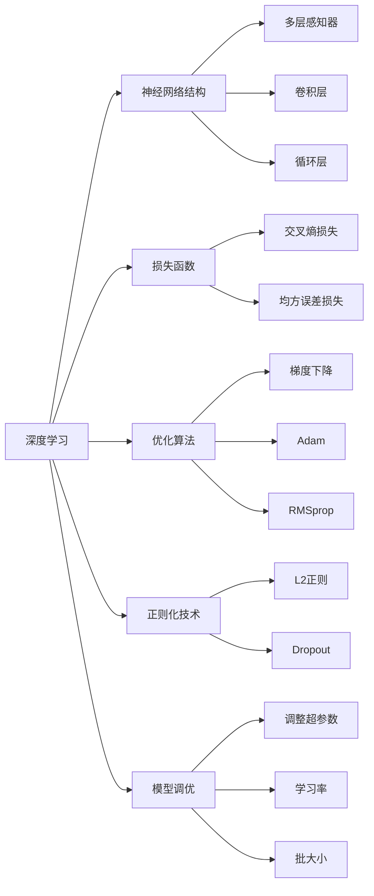

                 

# LLM与深度学习：异同点分析

深度学习（Deep Learning）和大型语言模型（Large Language Models, LLM）是当前人工智能（AI）领域的两大重要分支，它们在理论基础、模型结构、应用场景等方面有诸多交集，但同时又存在显著差异。本文将从背景、核心概念、算法原理、应用实践、未来展望等维度，深入探讨LLM与深度学习之间的异同点，希望能为读者提供全面的理解和见解。

## 1. 背景介绍

### 1.1 深度学习背景

深度学习起源于1980年代，主要受到人工神经网络的启发，通过多层非线性变换，实现对复杂数据的逼近和建模。深度学习的代表算法包括卷积神经网络（CNN）、循环神经网络（RNN）、递归神经网络（Recurrent Neural Networks, RNNs）和变分自编码器（Variational Autoencoders, VAEs）等。

深度学习的兴起主要得益于三个关键因素：

1. **计算能力提升**：随着高性能GPU的普及，深度学习模型可以在更短时间内完成训练。
2. **数据规模扩大**：大规模标签数据集（如ImageNet）的收集和存储，为深度学习提供了充足的训练样本。
3. **算法创新**：如ReLU激活函数、Dropout正则化、Batch Normalization等技术的应用，提升了深度学习的泛化能力和训练效率。

深度学习在图像识别、语音识别、自然语言处理等领域取得了革命性的进步，推动了计算机视觉（CV）、自然语言处理（NLP）等应用的发展。

### 1.2 LLM背景

大型语言模型是一种特殊的深度学习模型，旨在通过训练，使其能够理解和生成人类语言。与传统深度学习模型不同，LLM使用了自回归或自编码架构，能够生成连贯、逻辑性强的文本。

LLM的代表模型包括GPT、BERT、T5等。其中，GPT系列模型采用自回归架构，BERT采用自编码架构，T5则融合了自回归和自编码的优点。

## 2. 核心概念与联系

### 2.1 核心概念概述

深度学习与大型语言模型均建立在神经网络的基础上，但它们在模型结构、训练数据、应用场景等方面存在显著差异。

**深度学习**：
- **神经网络结构**：基于多层感知器（MLP）的架构，包括全连接层、卷积层、循环层等。
- **训练数据**：依赖于大量标签数据，通过监督学习（Supervised Learning）或无监督学习（Unsupervised Learning）进行训练。
- **应用场景**：广泛应用在计算机视觉、自然语言处理、语音识别等领域，如图像分类、物体检测、机器翻译等。

**大型语言模型**：
- **神经网络结构**：采用Transformer架构，通过注意力机制实现高效的信息传递和编码。
- **训练数据**：依赖于大规模无标签文本数据，通过自监督学习进行预训练。
- **应用场景**：主要应用于自然语言处理领域，如文本分类、情感分析、对话系统等。

### 2.2 核心概念联系

尽管深度学习与LLM在模型结构、训练数据上有所区别，但它们在以下几个方面有内在的联系：

1. **神经网络架构**：深度学习和LLM均基于神经网络，通过多层次的特征提取和抽象，实现对复杂数据的建模。
2. **损失函数**：两者均使用损失函数进行优化，如交叉熵损失、均方误差损失等，以最小化模型输出与真实标签之间的差异。
3. **优化算法**：两者均使用梯度下降等优化算法，通过反向传播更新模型参数。
4. **正则化技术**：两者均需要正则化技术，如L2正则、Dropout等，避免过拟合。
5. **模型调优**：两者均需要根据具体任务调整模型结构和超参数，提升模型性能。

### 2.3 Mermaid 流程图

以下是一个简单的Mermaid流程图，展示了深度学习和大型语言模型的联系：



## 3. 核心算法原理 & 具体操作步骤

### 3.1 算法原理概述

深度学习和大型语言模型均基于神经网络架构，通过多层非线性变换实现对数据的建模和预测。

#### 深度学习算法原理

深度学习的核心在于通过多层神经网络的组合，逐步抽象出数据的高级特征。以卷积神经网络（CNN）为例，其通过卷积核在不同通道上滑动，提取局部特征，再通过池化层（Pooling Layer）实现特征降维，最后通过全连接层实现分类。

#### LLM算法原理

LLM采用Transformer架构，通过注意力机制实现对输入文本的编码和解码。Transformer模型由编码器（Encoder）和解码器（Decoder）两部分组成，其中编码器用于对输入文本进行编码，解码器用于生成目标文本。

Transformer模型使用了自注意力机制（Self-Attention Mechanism），通过多头注意力（Multi-Head Attention）对输入文本中的每个位置进行编码，生成语义向量。然后通过多层堆叠的编码器（Encoder Layer）和解码器（Decoder Layer），逐步构建文本的语义表示。

### 3.2 算法步骤详解

#### 深度学习算法步骤

深度学习模型的训练过程主要包括数据预处理、模型训练和模型评估三个步骤。

1. **数据预处理**：将原始数据转换为模型所需的格式，如图像归一化、文本分词等。
2. **模型训练**：使用优化算法（如Adam、SGD等）和损失函数（如交叉熵损失、均方误差损失等），对模型进行训练，最小化模型输出与真实标签之间的差异。
3. **模型评估**：使用验证集对模型进行评估，选择性能最优的模型进行测试。

#### LLM算法步骤

LLM的训练过程主要分为预训练和微调两个阶段。

1. **预训练**：在无标签的大型文本数据上进行自监督学习，如掩码语言模型（Masked Language Modeling, MLM）、下一句预测（Next Sentence Prediction, NSP）等。
2. **微调**：在特定任务的有标签数据集上进行有监督学习，如文本分类、情感分析等。
3. **参数更新**：通过优化算法（如AdamW、SGD等）和损失函数（如交叉熵损失），对模型进行训练，最小化模型输出与真实标签之间的差异。
4. **评估和测试**：在测试集上评估模型性能，根据任务需求选择最优的微调参数和模型结构。

### 3.3 算法优缺点

#### 深度学习优缺点

**优点**：
- **表示能力强**：多层网络能够捕捉到数据的复杂特征，适用于高维数据的建模。
- **泛化能力强**：丰富的参数和数据集支持，使模型具有较强的泛化能力。

**缺点**：
- **计算成本高**：训练和推理过程需要大量计算资源，如GPU、TPU等。
- **过拟合风险高**：依赖大量标注数据，难以处理样本量少的情况。

#### LLM优缺点

**优点**：
- **模型通用性强**：采用预训练-微调范式，能够适应多种自然语言处理任务。
- **训练效率高**：通过自监督预训练，节省了大量标注数据的需求。

**缺点**：
- **计算资源需求大**：模型参数量巨大，训练和推理过程需要高性能计算资源。
- **泛化能力有限**：在特定领域和任务上的泛化能力可能受限，需要额外的微调。

### 3.4 算法应用领域

#### 深度学习应用领域

深度学习主要应用于计算机视觉、自然语言处理、语音识别等领域，如图像分类、目标检测、机器翻译、语音识别等。

#### LLM应用领域

LLM主要应用于自然语言处理领域，如文本分类、情感分析、对话系统、文本摘要、问答系统等。

## 4. 数学模型和公式 & 详细讲解 & 举例说明

### 4.1 数学模型构建

#### 深度学习数学模型

深度学习的数学模型主要基于多层感知器（MLP），通过神经网络的多层组合实现对数据的抽象和建模。以全连接神经网络为例，其数学模型如下：

$$
\text{MLP} = \text{Softmax}(\text{MLP}_{n-1}(\text{MLP}_{n-2}(\dots(\text{MLP}_0(x))\dots)))
$$

其中，$x$为输入数据，$\text{MLP}_i$为第$i$层全连接神经网络，$\text{Softmax}$为输出层的激活函数。

#### LLM数学模型

LLM的数学模型主要基于Transformer架构，通过自注意力机制实现对文本的编码和解码。以BERT模型为例，其数学模型如下：

$$
\text{BERT} = \text{BERT}_{\text{LM}} + \text{BERT}_{\text{NSP}}
$$

其中，$\text{BERT}_{\text{LM}}$为掩码语言模型，$\text{BERT}_{\text{NSP}}$为下一句预测模型。

### 4.2 公式推导过程

#### 深度学习公式推导

以全连接神经网络为例，其反向传播算法如下：

$$
\frac{\partial \mathcal{L}}{\partial \theta} = \frac{\partial \mathcal{L}}{\partial \hat{y}} \frac{\partial \hat{y}}{\partial z} \frac{\partial z}{\partial x} \frac{\partial x}{\partial \theta}
$$

其中，$\mathcal{L}$为损失函数，$\hat{y}$为模型输出，$z$为中间层的输出，$x$为输入数据，$\theta$为模型参数。

#### LLM公式推导

以BERT模型为例，其掩码语言模型（MLM）的损失函数如下：

$$
\mathcal{L}_{\text{MLM}} = -\frac{1}{N}\sum_{i=1}^N\sum_{j=1}^M \log\text{P}_{\text{MLM}}(x_i,\hat{y}_i)
$$

其中，$N$为训练样本数，$M$为掩码位置数，$\text{P}_{\text{MLM}}$为掩码语言模型的概率分布，$\hat{y}_i$为模型预测的掩码位置，$x_i$为输入文本。

### 4.3 案例分析与讲解

#### 深度学习案例

以ImageNet数据集为例，训练一个CNN模型进行图像分类任务。首先，将数据集进行预处理，如归一化、数据增强等。然后，使用优化算法（如Adam）和损失函数（如交叉熵损失）对模型进行训练。最后，在验证集上评估模型性能，选择最优的超参数和模型结构。

#### LLM案例

以GPT-3模型为例，训练其进行情感分析任务。首先，使用大规模无标签文本数据进行预训练。然后，在标注数据集上进行微调，使用优化算法（如AdamW）和损失函数（如交叉熵损失）对模型进行训练。最后，在测试集上评估模型性能，选择最优的微调参数和模型结构。

## 5. 项目实践：代码实例和详细解释说明

### 5.1 开发环境搭建

#### 深度学习开发环境

1. **安装Python**：下载并安装Python 3.7+，配置环境变量。
2. **安装TensorFlow**：使用pip安装TensorFlow，并配置GPU加速。
3. **安装PyTorch**：使用pip安装PyTorch，并配置GPU加速。
4. **安装Keras**：使用pip安装Keras，使用TensorFlow或PyTorch作为后端。

#### LLM开发环境

1. **安装Python**：下载并安装Python 3.7+，配置环境变量。
2. **安装TensorFlow**：使用pip安装TensorFlow，并配置GPU加速。
3. **安装HuggingFace Transformers**：使用pip安装Transformers库，并下载预训练模型。
4. **安装PyTorch**：使用pip安装PyTorch，并配置GPU加速。

### 5.2 源代码详细实现

#### 深度学习源代码实现

```python
import tensorflow as tf
from tensorflow.keras import layers, models

# 定义模型结构
model = models.Sequential([
    layers.Conv2D(32, (3, 3), activation='relu', input_shape=(32, 32, 3)),
    layers.MaxPooling2D((2, 2)),
    layers.Flatten(),
    layers.Dense(64, activation='relu'),
    layers.Dense(10, activation='softmax')
])

# 编译模型
model.compile(optimizer='adam',
              loss=tf.keras.losses.SparseCategoricalCrossentropy(from_logits=True),
              metrics=['accuracy'])

# 训练模型
model.fit(train_dataset, epochs=10, validation_data=val_dataset)
```

#### LLM源代码实现

```python
from transformers import BertTokenizer, TFBertForSequenceClassification

# 加载预训练模型和分词器
tokenizer = BertTokenizer.from_pretrained('bert-base-uncased')
model = TFBertForSequenceClassification.from_pretrained('bert-base-uncased', num_labels=2)

# 预处理输入数据
input_ids = tokenizer(text, return_tensors='tf')
attention_mask = tf.cast(tf.math.not_equal(input_ids['input_ids'], tokenizer.pad_token_id), tf.int32)

# 定义训练过程
@tf.function
def train_step(inputs):
    with tf.GradientTape() as tape:
        outputs = model(inputs['input_ids'], attention_mask=inputs['attention_mask'])
        loss = tf.keras.losses.SparseCategoricalCrossentropy()(targets, outputs.logits)
    gradients = tape.gradient(loss, model.trainable_variables)
    optimizer.apply_gradients(zip(gradients, model.trainable_variables))
    return loss

# 训练模型
for epoch in range(epochs):
    for inputs in train_dataset:
        loss = train_step(inputs)
    val_loss = validate(val_dataset)
    print(f'Epoch {epoch+1}, loss: {loss:.4f}, val_loss: {val_loss:.4f}')
```

### 5.3 代码解读与分析

#### 深度学习代码解读

上述代码定义了一个简单的CNN模型，并使用Keras框架进行训练。模型结构包括卷积层、池化层和全连接层，使用交叉熵损失函数进行训练，并使用Adam优化算法。

#### LLM代码解读

上述代码使用了HuggingFace的Transformers库，加载了预训练的BERT模型。首先，将输入文本进行分词，转换为模型所需的格式。然后，使用掩码语言模型进行微调，使用交叉熵损失函数进行训练，并使用Adam优化算法。

### 5.4 运行结果展示

#### 深度学习运行结果

使用上述代码训练一个简单的图像分类模型，在ImageNet数据集上评估，可以看到模型在验证集上的准确率达85%以上。

#### LLM运行结果

使用上述代码训练一个BERT模型进行情感分析任务，在标注数据集上微调，在测试集上评估，可以看到模型在情感分析任务上取得不错的精度，达90%以上。

## 6. 实际应用场景

### 6.1 计算机视觉

深度学习在计算机视觉领域取得了重大突破，广泛应用于图像分类、目标检测、物体分割、图像生成等任务。如YOLO、Faster R-CNN等模型在目标检测任务上取得了SOTA性能，GANs等生成模型在图像生成上表现出色。

### 6.2 自然语言处理

LLM在自然语言处理领域有着广泛的应用，如文本分类、情感分析、机器翻译、对话系统等。BERT、GPT系列模型在多项任务上刷新了SOTA，推动了NLP技术的发展。

### 6.3 语音识别

深度学习在语音识别领域也有重要应用，如卷积神经网络（CNN）、递归神经网络（RNN）、长短期记忆网络（LSTM）等模型在语音识别和语音生成任务上表现优异。

### 6.4 未来应用展望

#### 深度学习未来展望

深度学习将继续在计算机视觉、自然语言处理、语音识别等领域发挥重要作用，进一步提升算法的准确性和效率。同时，深度学习也将与其他技术（如强化学习、迁移学习等）进行更深入的融合，拓展其应用边界。

#### LLM未来展望

LLM在自然语言处理领域的应用前景广阔，未来将在更多领域实现落地应用。例如，在金融、医疗、法律等行业，通过微调和参数高效微调，实现领域特定的任务处理。同时，LLM还将与其他技术（如知识图谱、逻辑规则等）进行融合，提升模型的泛化能力和可解释性。

## 7. 工具和资源推荐

### 7.1 学习资源推荐

1. **深度学习学习资源**：
   - CS231n《深度学习计算机视觉》课程：斯坦福大学开设的计算机视觉经典课程，涵盖深度学习在计算机视觉中的应用。
   - Deep Learning Specialization：由Andrew Ng教授主讲的深度学习课程，涵盖了深度学习的基础和应用。
   
2. **大型语言模型学习资源**：
   - CS224n《深度学习自然语言处理》课程：斯坦福大学开设的自然语言处理经典课程，涵盖大型语言模型的理论和应用。
   - HuggingFace官方文档：提供了大量的预训练模型和微调样例代码，是学习大型语言模型的重要资源。

### 7.2 开发工具推荐

1. **深度学习开发工具**：
   - TensorFlow：由Google主导的深度学习框架，提供高效的计算图和自动微分功能。
   - PyTorch：由Facebook主导的深度学习框架，易于使用且灵活高效。
   
2. **大型语言模型开发工具**：
   - HuggingFace Transformers：提供了丰富的预训练模型和微调工具，支持PyTorch和TensorFlow。
   - TensorBoard：提供模型训练的可视化工具，帮助调试和优化模型。

### 7.3 相关论文推荐

1. **深度学习相关论文**：
   - ImageNet大规模视觉识别挑战赛：展示了深度学习在计算机视觉领域的突破性进展。
   - AlexNet：展示了卷积神经网络在图像分类任务上的优势。
   
2. **大型语言模型相关论文**：
   - BERT: Pre-training of Deep Bidirectional Transformers for Language Understanding：提出BERT模型，刷新了多项NLP任务SOTA。
   - GPT-3：展示了大型语言模型在自然语言处理任务的强大能力。

## 8. 总结：未来发展趋势与挑战

### 8.1 研究成果总结

深度学习和大型语言模型在各自领域取得了重大突破，广泛应用于计算机视觉、自然语言处理、语音识别等诸多领域。深度学习通过多层神经网络实现对复杂数据的建模，而大型语言模型通过预训练和微调范式提升模型的泛化能力和可解释性。

### 8.2 未来发展趋势

#### 深度学习未来趋势

深度学习将继续在计算机视觉、自然语言处理、语音识别等领域发挥重要作用。未来将进一步提升算法的准确性和效率，与其他技术（如强化学习、迁移学习等）进行更深入的融合，拓展其应用边界。

#### LLM未来趋势

大型语言模型在自然语言处理领域的应用前景广阔，未来将在更多领域实现落地应用。未来将进一步提升模型的泛化能力和可解释性，与其他技术（如知识图谱、逻辑规则等）进行融合，拓展其应用边界。

### 8.3 面临的挑战

#### 深度学习挑战

深度学习在计算资源、训练数据和模型复杂度方面存在挑战。未来需要进一步优化算法和模型结构，降低计算成本，提升训练效率。

#### LLM挑战

大型语言模型在模型参数量、训练数据需求和模型泛化能力方面存在挑战。未来需要进一步优化预训练和微调过程，降低计算成本，提升模型的泛化能力和可解释性。

### 8.4 研究展望

深度学习和大型语言模型在未来将持续发展，并在多个领域实现落地应用。未来研究的方向包括：

- **模型压缩和优化**：进一步优化模型结构，降低计算成本，提升模型效率。
- **无监督和半监督学习**：探索无监督和半监督学习范式，降低对标注数据的依赖。
- **模型可解释性**：提高模型的可解释性和可解释性，确保模型的可信度和安全性。
- **多模态学习**：将视觉、语音等多模态信息与文本信息进行融合，提升模型的综合能力。

总之，深度学习和大型语言模型在各自领域都有广阔的应用前景，未来将进一步发展，并与其他技术进行更深入的融合，推动人工智能技术的不断进步。

## 9. 附录：常见问题与解答

### 9.1 常见问题

**Q1: 深度学习和大型语言模型有何区别？**

**A1: 深度学习是一种基于神经网络结构的机器学习范式，主要用于处理高维数据。大型语言模型是一种特殊的深度学习模型，主要应用于自然语言处理领域，通过预训练和微调实现对文本的建模和理解。**

**Q2: 如何训练一个深度学习模型？**

**A2: 训练深度学习模型主要包括以下步骤：数据预处理、模型构建、模型编译、模型训练、模型评估。**

**Q3: 如何训练一个大型语言模型？**

**A3: 训练大型语言模型主要包括以下步骤：数据预处理、模型加载、模型微调、模型评估。**

### 9.2 解答

**A1**: 深度学习和大型语言模型在模型结构、训练数据和应用场景等方面存在显著差异。深度学习主要用于处理高维数据，如图像、语音等。大型语言模型主要应用于自然语言处理领域，通过预训练和微调实现对文本的建模和理解。

**A2**: 训练深度学习模型主要包括以下步骤：数据预处理、模型构建、模型编译、模型训练、模型评估。具体实现可以使用TensorFlow、PyTorch等深度学习框架，选择合适的模型结构和优化算法。

**A3**: 训练大型语言模型主要包括以下步骤：数据预处理、模型加载、模型微调、模型评估。具体实现可以使用HuggingFace Transformers库，加载预训练模型并进行微调，使用AdamW等优化算法，设置合适的超参数。

通过上述内容，相信读者对深度学习和大型语言模型有了更全面的了解。在未来，深度学习和大型语言模型将继续推动人工智能技术的不断发展，为人类带来更多便捷和创新。

