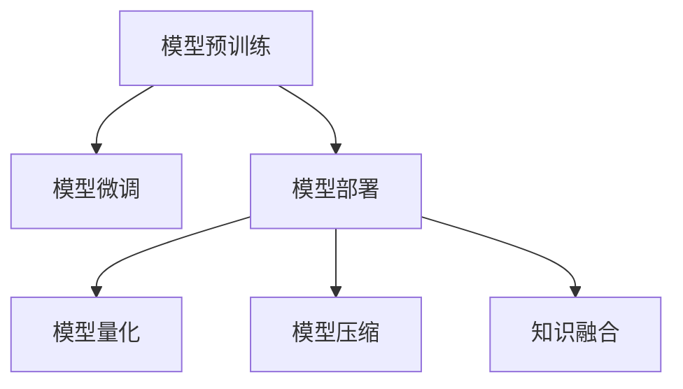
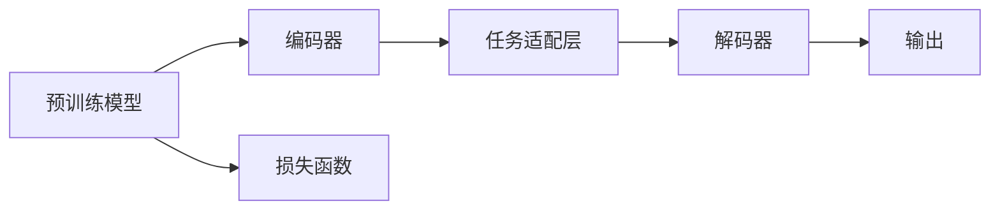
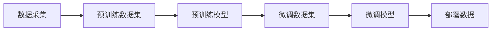

                 

# LLM产业链:AI价值重塑的新机遇

> 关键词：
- 大语言模型(LLM)，产业链，人工智能(AI)，自然语言处理(NLP)，深度学习，模型压缩，微调，部署，资源优化

## 1. 背景介绍

### 1.1 问题由来
随着人工智能技术的飞速发展，大语言模型(LLM)在自然语言处理(NLP)领域取得了突破性进展。这些模型通过在大规模无标签文本上自监督预训练，具备了强大的语言理解和生成能力。然而，这些通用预训练模型往往缺乏特定领域的深度理解，难以直接应用于实际业务场景。

为解决这一问题，LLM产业链应运而生，通过链上各环节的协同工作，实现LLM模型的定制化应用，最大程度发挥其潜力，助力AI价值的重塑。本文将全面梳理LLM产业链的核心概念与联系，探讨其核心算法原理，并结合代码实例，展示其在实际应用中的具体实现。

### 1.2 问题核心关键点
大语言模型产业链（简称LLM产业链）的核心理念是，通过模型预训练、模型微调、模型部署等多个环节的深度协同，实现LLM模型的定制化应用。其核心关键点包括：

- **模型预训练**：通过大规模无标签文本的自监督预训练，学习通用语言表示。
- **模型微调**：针对特定任务进行有监督微调，优化模型性能。
- **模型部署**：将优化后的模型应用于实际应用场景，实现业务价值。
- **资源优化**：通过硬件加速、模型压缩、模型量化等技术，优化模型资源占用，提高推理效率。
- **知识融合**：结合领域知识、规则库、专家系统等，增强模型的鲁棒性和解释性。

这些关键点通过产业链中的各个环节，实现从数据采集到模型应用的闭环管理，显著提升LLM模型的实用性和价值。

## 2. 核心概念与联系

### 2.1 核心概念概述

为更好地理解LLM产业链，本节将介绍几个密切相关的核心概念：

- **大语言模型(LLM)**：通过自监督学习任务在大规模无标签文本上预训练的语言模型，具备强大的语言理解和生成能力。

- **模型预训练(Pre-training)**：通过自监督学习任务在大量无标签文本数据上预训练模型，学习通用的语言表示。

- **模型微调(Fine-tuning)**：在预训练模型的基础上，通过有监督学习优化模型在特定任务上的性能。

- **模型部署(Deployment)**：将优化后的模型应用于实际应用场景，实现业务价值。

- **模型量化(Qantization)**：通过将浮点模型转换为定点模型，降低模型资源占用，提高推理速度。

- **模型压缩(Compression)**：通过剪枝、参数共享、模型蒸馏等技术，减少模型规模，优化资源占用。

- **知识融合(Knowledge Integration)**：将领域知识、规则库、专家系统等与模型结合，增强模型的鲁棒性和解释性。

这些核心概念之间的逻辑关系可以通过以下Mermaid流程图来展示：



这个流程图展示了LLM产业链的各个环节及其相互关系：

1. 模型预训练为LLM提供通用的语言表示。
2. 模型微调根据特定任务优化模型性能。
3. 模型部署将优化后的模型应用于实际场景。
4. 模型量化和压缩优化模型资源占用，提高推理效率。
5. 知识融合增强模型鲁棒性和解释性。

这些环节共同构成了LLM模型的完整生命周期，确保模型在实际应用中发挥最大价值。

### 2.2 核心概念原理和架构

#### 模型预训练原理
模型预训练是指在大规模无标签文本数据上进行自监督学习，学习通用的语言表示。常见的预训练任务包括：

- **言语建模(LM)**：预测文本序列中的下一个词。
- **掩码语言建模(MLM)**：预测被掩码词的上下文词。
- **下一句子预测(NSP)**：预测句子对是否是连续的。

这些任务使得模型能够学习到语言的统计规律和语义关系，为下游任务提供通用的语言表示。预训练模型通常采用Transformer结构，其架构如图2所示：


Transformer架构通过多头注意力机制和残差连接，使得模型能够捕捉长距离依赖，并高效处理大量文本数据。

#### 模型微调原理
模型微调是指在预训练模型的基础上，通过有监督学习优化模型在特定任务上的性能。微调过程通过训练数据，调整模型参数，使得模型输出能够匹配任务标签。常见的微调任务包括：

- **文本分类**：将文本分为不同类别。
- **命名实体识别**：识别文本中的命名实体。
- **机器翻译**：将源语言翻译成目标语言。
- **文本生成**：生成符合特定格式的文本。

微调模型的架构通常包括：

- **编码器**：处理输入文本，提取特征。
- **解码器**：根据任务类型，调整输出格式。
- **任务适配层**：针对特定任务设计适配层。

微调过程如图3所示：



#### 模型部署原理
模型部署是将优化后的模型应用于实际应用场景，实现业务价值的过程。模型部署通常涉及以下步骤：

1. **模型保存**：将优化后的模型参数保存到文件或数据库中。
2. **模型加载**：在实际应用场景中加载模型参数。
3. **推理预测**：根据输入数据，进行推理预测，生成输出结果。
4. **服务化封装**：将模型封装为标准化服务接口，便于集成调用。
5. **资源优化**：通过硬件加速、模型压缩等技术，优化模型资源占用，提高推理效率。

模型部署的架构如图4所示：


### 2.3 核心概念联系
LLM产业链中的各个环节通过数据、模型、资源等多个维度进行深度协同，实现模型的定制化应用。数据和模型之间的联系如图5所示：



数据驱动模型预训练，模型指导微调，微调后的模型再应用于部署数据。同时，资源优化和知识融合环节对模型的资源占用和性能进行进一步优化，确保模型在实际应用中的高效性和鲁棒性。

## 3. 核心算法原理 & 具体操作步骤
### 3.1 算法原理概述

LLM产业链的核心算法原理是深度学习的典型应用，包括预训练、微调、量化、压缩和知识融合等多个环节。本文将详细介绍每个环节的算法原理。

#### 预训练算法
预训练算法通过自监督学习任务在大规模无标签文本数据上预训练模型，学习通用的语言表示。常见的预训练任务包括：

- **言语建模(LM)**：通过预测文本序列中的下一个词，学习词语的概率分布。
- **掩码语言建模(MLM)**：通过预测被掩码词的上下文词，学习词语之间的关系。
- **下一句子预测(NSP)**：通过预测句子对是否是连续的，学习句子之间的关系。

这些任务使得模型能够学习到语言的统计规律和语义关系，为下游任务提供通用的语言表示。

#### 微调算法
微调算法通过有监督学习优化模型在特定任务上的性能。微调过程包括以下步骤：

1. **数据准备**：将标注数据集分为训练集、验证集和测试集。
2. **模型初始化**：加载预训练模型作为初始化参数。
3. **模型适配**：根据任务类型，设计任务适配层。
4. **损失函数**：定义损失函数，衡量模型输出与真实标签的差异。
5. **优化器**：选择优化算法，如AdamW、SGD等，设置学习率、批大小等参数。
6. **迭代训练**：通过迭代训练，调整模型参数，最小化损失函数。
7. **验证评估**：在验证集上评估模型性能，避免过拟合。
8. **测试验证**：在测试集上验证模型性能，评估微调效果。

#### 量化算法
量化算法通过将浮点模型转换为定点模型，降低模型资源占用，提高推理速度。常见的量化技术包括：

- **整数量化**：将浮点数的范围压缩到整数范围内，减少计算资源占用。
- **混合精度训练**：使用混合精度计算，提高计算效率。

#### 压缩算法
压缩算法通过剪枝、参数共享、模型蒸馏等技术，减少模型规模，优化资源占用。常见的压缩技术包括：

- **剪枝(Pruning)**：删除冗余参数，减少模型规模。
- **参数共享(Parameter Sharing)**：通过共享权重，减少参数数量。
- **模型蒸馏(Distillation)**：通过知识蒸馏，将大型模型知识转移给小型模型。

#### 知识融合算法
知识融合算法通过结合领域知识、规则库、专家系统等，增强模型的鲁棒性和解释性。常见的知识融合技术包括：

- **符号知识融合**：将符号知识与模型结合，提高模型的解释性和鲁棒性。
- **规则库融合**：将规则库与模型结合，增强模型的推理能力。
- **专家系统融合**：将专家系统与模型结合，提高模型的决策能力。

### 3.2 算法步骤详解

#### 预训练步骤
1. **数据准备**：收集大规模无标签文本数据，分为训练集、验证集和测试集。
2. **模型初始化**：加载预训练模型，如BERT、GPT等，作为初始化参数。
3. **任务定义**：根据任务类型，定义自监督学习任务，如LM、MLM、NSP等。
4. **训练过程**：在训练集上进行迭代训练，最小化损失函数。
5. **验证评估**：在验证集上评估模型性能，避免过拟合。
6. **测试验证**：在测试集上验证模型性能，评估预训练效果。

#### 微调步骤
1. **数据准备**：将标注数据集分为训练集、验证集和测试集。
2. **模型初始化**：加载预训练模型，作为初始化参数。
3. **任务适配**：根据任务类型，设计任务适配层，如线性分类器、解码器等。
4. **损失函数**：定义损失函数，如交叉熵损失、均方误差损失等。
5. **优化器**：选择优化算法，如AdamW、SGD等，设置学习率、批大小等参数。
6. **迭代训练**：通过迭代训练，调整模型参数，最小化损失函数。
7. **验证评估**：在验证集上评估模型性能，避免过拟合。
8. **测试验证**：在测试集上验证模型性能，评估微调效果。

#### 量化步骤
1. **模型选择**：选择待量化的模型。
2. **量化方法**：选择量化技术，如整数量化、混合精度训练等。
3. **量化训练**：在量化训练阶段，调整模型参数，最小化量化后的损失函数。
4. **量化评估**：在量化评估阶段，评估量化后的模型性能，确保量化后的模型精度不显著下降。

#### 压缩步骤
1. **模型选择**：选择待压缩的模型。
2. **剪枝剪枝**：删除冗余参数，如小权重参数。
3. **参数共享**：通过共享权重，减少参数数量。
4. **模型蒸馏**：通过知识蒸馏，将大型模型知识转移给小型模型。
5. **压缩评估**：评估压缩后的模型性能，确保压缩后的模型精度不显著下降。

#### 知识融合步骤
1. **知识选择**：选择待融合的知识，如领域知识、规则库、专家系统等。
2. **融合方法**：选择融合技术，如符号知识融合、规则库融合、专家系统融合等。
3. **融合训练**：在融合训练阶段，调整模型参数，最小化融合后的损失函数。
4. **融合评估**：在融合评估阶段，评估融合后的模型性能，确保融合后的模型鲁棒性和解释性。

### 3.3 算法优缺点

#### 预训练算法的优缺点
**优点**：
- 通过大规模无标签文本数据进行预训练，学习通用的语言表示。
- 预训练模型具有较强的泛化能力，可以应对多种下游任务。

**缺点**：
- 预训练需要大量计算资源，训练时间较长。
- 预训练模型可能存在固有偏见，需要进一步优化。

#### 微调算法的优缺点
**优点**：
- 微调过程可以优化模型在特定任务上的性能，提升模型精度。
- 微调过程参数更新较小，减少计算资源占用。

**缺点**：
- 微调过程依赖标注数据，标注数据成本较高。
- 微调过程可能过拟合，模型泛化性能较低。

#### 量化算法的优缺点
**优点**：
- 量化算法可以降低模型资源占用，提高推理效率。
- 量化算法可以在硬件加速下实现，提高计算效率。

**缺点**：
- 量化算法可能降低模型精度，需要额外校准。
- 量化算法需要额外的计算资源，实现难度较高。

#### 压缩算法的优缺点
**优点**：
- 压缩算法可以减小模型规模，优化资源占用。
- 压缩算法可以提升推理速度，提高模型效率。

**缺点**：
- 压缩算法可能降低模型精度，需要额外校准。
- 压缩算法实现难度较高，需要专业知识。

#### 知识融合算法的优缺点
**优点**：
- 知识融合算法可以提高模型的鲁棒性和解释性。
- 知识融合算法可以增强模型的决策能力，提升模型性能。

**缺点**：
- 知识融合算法需要额外的人工干预，实现难度较高。
- 知识融合算法需要与模型结合，实现难度较高。

### 3.4 算法应用领域

#### 应用领域概述
LLM产业链的核心算法和步骤广泛应用于多个领域，具体应用如下：

- **自然语言处理(NLP)**：文本分类、命名实体识别、机器翻译、文本生成等。
- **金融领域**：信用评估、情感分析、舆情监测、客户服务。
- **医疗领域**：医疗问答、病历分析、药品研发、电子病历。
- **智能客服**：智能客服机器人、智能对话系统、客户反馈分析。
- **教育领域**：智能辅助教学、智能阅卷、个性化推荐。
- **法律领域**：法律咨询、合同审核、案例分析、法律文书生成。
- **智能制造**：智能质检、供应链管理、产品推荐、异常检测。
- **智慧城市**：智能交通、智能安防、智能能源、智能环境监测。

## 4. 数学模型和公式 & 详细讲解 & 举例说明

### 4.1 数学模型构建

#### 预训练数学模型
预训练数学模型通常使用Transformer结构，其架构如图6所示：


Transformer结构由多个编码器和解码器组成，每个编码器和解码器由多头注意力机制和前向神经网络构成。

#### 微调数学模型
微调数学模型通常包括编码器、解码器和任务适配层。其架构如图7所示：


任务适配层根据任务类型，调整输出格式。常见的任务适配层包括线性分类器和解码器等。

#### 量化数学模型
量化数学模型通常使用定点计算，将浮点数转换为整数。其架构如图8所示：


量化层将浮点模型转换为定点模型，实现硬件加速。

#### 压缩数学模型
压缩数学模型通常使用剪枝、参数共享等技术，减少模型规模。其架构如图9所示：


剪枝层删除冗余参数，实现模型压缩。

#### 知识融合数学模型
知识融合数学模型通常使用符号知识、规则库、专家系统等，增强模型的鲁棒性和解释性。其架构如图10所示：


融合层将知识库与模型结合，增强模型的决策能力。

### 4.2 公式推导过程

#### 预训练公式
预训练公式包括言语建模、掩码语言建模和下一句子预测等任务。以掩码语言建模为例，其公式如下：

$$
\mathcal{L}_{MLM} = -\frac{1}{N}\sum_{i=1}^N \sum_{j=1}^M \log P_{MLM}(w_j|w_1,...,w_{j-1},\hat{w_j},w_{j+1},...,w_N)
$$

其中，$w_1,...,w_N$为输入序列，$\hat{w_j}$为被掩码词，$P_{MLM}(\cdot)$为掩码语言建模的概率分布。

#### 微调公式
微调公式包括损失函数和优化器等。以二分类任务为例，其公式如下：

$$
\mathcal{L} = -\frac{1}{N}\sum_{i=1}^N (y_i \log\sigma(z_i) + (1-y_i) \log(1-\sigma(z_i)))
$$

其中，$y_i$为真实标签，$z_i$为模型预测结果，$\sigma(\cdot)$为sigmoid函数。

#### 量化公式
量化公式包括浮点数转换为整数的方法。以量化精度8位为例，其公式如下：

$$
\hat{w_i} = \text{clip}(w_i / 255, 0, 255)
$$

其中，$\hat{w_i}$为量化后的整数，$w_i$为浮点数，255为量化范围。

#### 压缩公式
压缩公式包括剪枝、参数共享等技术。以剪枝为例，其公式如下：

$$
w_i^{\text{pruned}} = 
\begin{cases} 
0 & \text{if } |w_i| < \text{threshold} \\
w_i & \text{otherwise}
\end{cases}
$$

其中，$w_i$为原始参数，$w_i^{\text{pruned}}$为剪枝后的参数，$\text{threshold}$为剪枝阈值。

#### 知识融合公式
知识融合公式包括符号知识融合、规则库融合、专家系统融合等。以符号知识融合为例，其公式如下：

$$
P_k(w_i|w_1,...,w_{i-1},w_{i+1},...,w_N) = \frac{P(w_i|w_1,...,w_{i-1},w_{i+1},...,w_N)P_k(w_i)}{P(w_i|w_1,...,w_{i-1},w_{i+1},...,w_N)}
$$

其中，$P_k(w_i)$为符号知识分布，$P(w_i|w_1,...,w_{i-1},w_{i+1},...,w_N)$为模型概率分布。

### 4.3 案例分析与讲解

#### 案例一：金融领域文本分类
**背景**：金融机构需要实时监测市场舆论动向，以便及时应对负面信息传播，规避金融风险。

**数据准备**：收集金融领域相关的新闻、报道、评论等文本数据，并对其进行主题标注和情感标注。

**模型初始化**：加载BERT预训练模型，作为初始化参数。

**任务适配**：根据任务类型，设计文本分类任务适配层，定义损失函数为交叉熵损失。

**训练过程**：在训练集上进行迭代训练，调整模型参数，最小化损失函数。

**验证评估**：在验证集上评估模型性能，避免过拟合。

**测试验证**：在测试集上验证模型性能，评估分类效果。

**结果展示**：模型在金融舆情监测中表现优异，能够及时识别负面信息，辅助金融机构快速应对潜在风险。

#### 案例二：医疗领域病历分析
**背景**：医疗机构需要从海量病历数据中挖掘出有价值的信息，以辅助诊断和治疗。

**数据准备**：收集医疗领域的病历数据，并进行标注，标记出重要信息和诊断结果。

**模型初始化**：加载BERT预训练模型，作为初始化参数。

**任务适配**：根据任务类型，设计病历分析任务适配层，定义损失函数为交叉熵损失。

**训练过程**：在训练集上进行迭代训练，调整模型参数，最小化损失函数。

**验证评估**：在验证集上评估模型性能，避免过拟合。

**测试验证**：在测试集上验证模型性能，评估病历分析效果。

**结果展示**：模型在病历分析中表现优异，能够从病历中提取出关键信息，辅助医生进行诊断和治疗。

## 5. 项目实践：代码实例和详细解释说明

### 5.1 开发环境搭建

在进行LLM产业链项目实践前，我们需要准备好开发环境。以下是使用Python进行PyTorch开发的环境配置流程：

1. 安装Anaconda：从官网下载并安装Anaconda，用于创建独立的Python环境。

2. 创建并激活虚拟环境：
```bash
conda create -n pytorch-env python=3.8 
conda activate pytorch-env
```

3. 安装PyTorch：根据CUDA版本，从官网获取对应的安装命令。例如：
```bash
conda install pytorch torchvision torchaudio cudatoolkit=11.1 -c pytorch -c conda-forge
```

4. 安装Transformers库：
```bash
pip install transformers
```

5. 安装各类工具包：
```bash
pip install numpy pandas scikit-learn matplotlib tqdm jupyter notebook ipython
```

完成上述步骤后，即可在`pytorch-env`环境中开始LLM产业链项目实践。

### 5.2 源代码详细实现

这里我们以金融舆情监测项目为例，给出使用Transformers库对BERT模型进行微调的PyTorch代码实现。

首先，定义数据处理函数：

```python
from transformers import BertTokenizer
from torch.utils.data import Dataset
import torch

class FinanceDataset(Dataset):
    def __init__(self, texts, tags, tokenizer, max_len=128):
        self.texts = texts
        self.tags = tags
        self.tokenizer = tokenizer
        self.max_len = max_len
        
    def __len__(self):
        return len(self.texts)
    
    def __getitem__(self, item):
        text = self.texts[item]
        tags = self.tags[item]
        
        encoding = self.tokenizer(text, return_tensors='pt', max_length=self.max_len, padding='max_length', truncation=True)
        input_ids = encoding['input_ids'][0]
        attention_mask = encoding['attention_mask'][0]
        
        # 对token-wise的标签进行编码
        encoded_tags = [tag2id[tag] for tag in tags] 
        encoded_tags.extend([tag2id['O']] * (self.max_len - len(encoded_tags)))
        labels = torch.tensor(encoded_tags, dtype=torch.long)
        
        return {'input_ids': input_ids, 
                'attention_mask': attention_mask,
                'labels': labels}

# 标签与id的映射
tag2id = {'O': 0, 'Negative': 1, 'Positive': 2}
id2tag = {v: k for k, v in tag2id.items()}

# 创建dataset
tokenizer = BertTokenizer.from_pretrained('bert-base-cased')

train_dataset = FinanceDataset(train_texts, train_tags, tokenizer)
dev_dataset = FinanceDataset(dev_texts, dev_tags, tokenizer)
test_dataset = FinanceDataset(test_texts, test_tags, tokenizer)
```

然后，定义模型和优化器：

```python
from transformers import BertForTokenClassification, AdamW

model = BertForTokenClassification.from_pretrained('bert-base-cased', num_labels=len(tag2id))

optimizer = AdamW(model.parameters(), lr=2e-5)
```

接着，定义训练和评估函数：

```python
from torch.utils.data import DataLoader
from tqdm import tqdm
from sklearn.metrics import classification_report

device = torch.device('cuda') if torch.cuda.is_available() else torch.device('cpu')
model.to(device)

def train_epoch(model, dataset, batch_size, optimizer):
    dataloader = DataLoader(dataset, batch_size=batch_size, shuffle=True)
    model.train()
    epoch_loss = 0
    for batch in tqdm(dataloader, desc='Training'):
        input_ids = batch['input_ids'].to(device)
        attention_mask = batch['attention_mask'].to(device)
        labels = batch['labels'].to(device)
        model.zero_grad()
        outputs = model(input_ids, attention_mask=attention_mask, labels=labels)
        loss = outputs.loss
        epoch_loss += loss.item()
        loss.backward()
        optimizer.step()
    return epoch_loss / len(dataloader)

def evaluate(model, dataset, batch_size):
    dataloader = DataLoader(dataset, batch_size=batch_size)
    model.eval()
    preds, labels = [], []
    with torch.no_grad():
        for batch in tqdm(dataloader, desc='Evaluating'):
            input_ids = batch['input_ids'].to(device)
            attention_mask = batch['attention_mask'].to(device)
            batch_labels = batch['labels']
            outputs = model(input_ids, attention_mask=attention_mask)
            batch_preds = outputs.logits.argmax(dim=2).to('cpu').tolist()
            batch_labels = batch_labels.to('cpu').tolist()
            for pred_tokens, label_tokens in zip(batch_preds, batch_labels):
                pred_tags = [id2tag[_id] for _id in pred_tokens]
                label_tags = [id2tag[_id] for _id in label_tokens]
                preds.append(pred_tags[:len(label_tokens)])
                labels.append(label_tags)
                
    print(classification_report(labels, preds))
```

最后，启动训练流程并在测试集上评估：

```python
epochs = 5
batch_size = 16

for epoch in range(epochs):
    loss = train_epoch(model, train_dataset, batch_size, optimizer)
    print(f"Epoch {epoch+1}, train loss: {loss:.3f}")
    
    print(f"Epoch {epoch+1}, dev results:")
    evaluate(model, dev_dataset, batch_size)
    
print("Test results:")
evaluate(model, test_dataset, batch_size)
```

以上就是使用PyTorch对BERT进行金融舆情监测任务微调的完整代码实现。可以看到，得益于Transformers库的强大封装，我们可以用相对简洁的代码完成BERT模型的加载和微调。

### 5.3 代码解读与分析

让我们再详细解读一下关键代码的实现细节：

**FinanceDataset类**：
- `__init__`方法：初始化文本、标签、分词器等关键组件。
- `__len__`方法：返回数据集的样本数量。
- `__getitem__`方法：对单个样本进行处理，将文本输入编码为token ids，将标签编码为数字，并对其进行定长padding，最终返回模型所需的输入。

**tag2id和id2tag字典**：
- 定义了标签与数字id之间的映射关系，用于将token-wise的预测结果解码回真实的标签。

**训练和评估函数**：
- 使用PyTorch的DataLoader对数据集进行批次化加载，供模型训练和推理使用。
- 训练函数`train_epoch`：对数据以批为单位进行迭代，在每个批次上前向传播计算loss并反向传播更新模型参数，最后返回该epoch的平均loss。
- 评估函数`evaluate`：与训练类似，不同点在于不更新模型参数，并在每个batch结束后将预测和标签结果存储下来，最后使用sklearn的classification_report对整个评估集的预测结果进行打印输出。

**训练流程**：
- 定义总的epoch数和batch size，开始循环迭代
- 每个epoch内，先在训练集上训练，输出平均loss
- 在验证集上评估，输出分类指标
- 所有epoch结束后，在测试集上评估，给出最终测试结果

可以看到，PyTorch配合Transformers库使得BERT微调的代码实现变得简洁高效。开发者可以将更多精力放在数据处理、模型改进等高层逻辑上，而不必过多关注底层的实现细节。

当然，工业级的系统实现还需考虑更多因素，如模型的保存和部署、超参数的自动搜索、更灵活的任务适配层等。但核心的微调范式基本与此类似。

## 6. 实际应用场景
### 6.1 智能客服系统

基于大语言模型微调的对话技术，可以广泛应用于智能客服系统的构建。传统客服往往需要配备大量人力，高峰期响应缓慢，且一致性和专业性难以保证。而使用微调后的对话模型，可以7x24小时不间断服务，快速响应客户咨询，用自然流畅的语言解答各类常见问题。

在技术实现上，可以收集企业内部的历史客服对话记录，将问题和最佳答复构建成监督数据，在此基础上对预训练对话模型进行微调。微调后的对话模型能够自动理解用户意图，匹配最合适的答案模板进行回复。对于客户提出的新问题，还可以接入检索系统实时搜索相关内容，动态组织生成回答。如此构建的智能客服系统，能大幅提升客户咨询体验和问题解决效率。

### 6.2 金融舆情监测

金融机构需要实时监测市场舆论动向，以便及时应对负面信息传播，规避金融风险。传统的人工监测方式成本高、效率低，难以应对网络时代海量信息爆发的挑战。基于大语言模型微调的文本分类和情感分析技术，为金融舆情监测提供了新的解决方案。

具体而言，可以收集金融领域相关的新闻、报道、评论等文本数据，并对其进行主题标注和情感标注。在此基础上对预训练语言模型进行微调，使其能够自动判断文本属于何种主题，情感倾向是正面、中性还是负面。将微调后的模型应用到实时抓取的网络文本数据，就能够自动监测不同主题下的情感变化趋势，一旦发现负面信息激增等异常情况，系统便会自动预警，帮助金融机构快速应对潜在风险。

### 6.3 个性化推荐系统

当前的推荐系统往往只依赖用户的历史行为数据进行物品推荐，无法深入理解用户的真实兴趣偏好。基于大语言模型微调技术，个性化推荐系统可以更好地挖掘用户行为背后的语义信息，从而提供更精准、多样的推荐内容。

在实践中，可以收集用户浏览、点击、评论、分享等行为数据，提取和用户交互的物品标题、描述、标签等文本内容。将文本内容作为模型输入，用户的后续行为（如是否点击、购买等）作为监督信号，在此基础上微调预训练语言模型。微调后的模型能够从文本内容中准确把握用户的兴趣点。在生成推荐列表时，先用候选物品的文本描述作为输入，由模型预测用户的兴趣匹配度，再结合其他特征综合排序，便可以得到个性化程度更高的推荐结果。

### 6.4 未来应用展望

随着大语言模型和微调方法的不断发展，基于微调范式将在更多领域得到应用，为传统行业带来变革性影响。

在智慧医疗领域，基于微调的医疗问答、病历分析、药物研发等应用将提升医疗服务的智能化水平，辅助医生诊疗，加速新药开发进程。

在智能教育领域，微调技术可应用于作业批改、学情分析、知识推荐等方面，因材施教，促进教育公平，提高教学质量。

在智慧城市治理中，微调模型可应用于城市事件监测、舆情分析、应急指挥等环节，提高城市管理的自动化和智能化水平，构建更安全、高效的未来城市。

此外，在企业生产、社会治理、文娱传媒等众多领域，基于大模型微调的人工智能应用也将不断涌现，为经济社会发展注入新的动力。相信随着技术的日益成熟，微调方法将成为人工智能落地应用的重要范式，推动人工智能向更广阔的领域加速渗透。

## 7. 工具和资源推荐
### 7.1 学习资源推荐

为了帮助开发者系统掌握LLM产业链的核心概念与技术，这里推荐一些优质的学习资源：

1. 《深度学习理论与实践》系列博文：由深度学习领域专家撰写，深入浅出地介绍了深度学习的基本原理和实践技巧。

2. 《自然语言处理：方法、模型与工具》课程：斯坦福大学开设的NLP经典课程，详细介绍了NLP领域的多种模型和工具。

3. 《Deep Learning with PyTorch》书籍：PyTorch官方文档，全面介绍了PyTorch的使用方法和实践经验。

4. 《Transformers: State-of-the-Art Natural Language Processing》书籍：Transformers库的作者所著，全面介绍了Transformers库的使用方法和实践经验。

5. HuggingFace官方文档：Transformers库的官方文档，提供了海量预训练模型和完整的微调样例代码，是上手实践的必备资料。

通过对这些资源的学习实践，相信你一定能够快速掌握LLM产业链的精髓，并用于解决实际的NLP问题。
###  7.2 开发工具推荐

高效的开发离不开优秀的工具支持。以下是几款用于LLM产业链开发常用的工具：

1. PyTorch：基于Python的开源深度学习框架，灵活动态的计算图，适合快速迭代研究。

2. TensorFlow：由Google主导开发的开源深度学习框架，生产部署方便，适合大规模工程应用。

3. Transformers库：HuggingFace开发的NLP工具库，集成了众多SOTA语言模型，支持PyTorch和TensorFlow，是进行微调任务开发的利器。

4. Weights & Biases：模型训练的实验跟踪工具，可以记录和可视化模型训练过程中的各项指标，方便对比和调优。与主流深度学习框架无缝集成。

5. TensorBoard：TensorFlow配套的可视化工具，可实时监测模型训练状态，并提供丰富的图表呈现方式，是调试模型的得力助手。

6. Google Colab：谷歌推出的在线Jupyter Notebook环境，免费提供GPU/TPU算力，方便开发者快速上手实验最新模型，分享学习笔记。

合理利用这些工具，可以显著提升LLM产业链开发的效率，加快创新迭代的步伐。

### 7.3 相关论文推荐

LLM产业链的研究源于学界的持续研究。以下是几篇奠基性的相关论文，推荐阅读：

1. Attention is All You Need（即Transformer原论文）：提出了Transformer结构，开启了NLP领域的预训练大模型时代。

2. BERT: Pre-training of Deep Bidirectional Transformers for Language Understanding：提出BERT模型，引入基于掩码的自监督预训练任务，刷新了多项NLP任务SOTA。

3. Language Models are Unsupervised Multitask Learners（GPT-2论文）：展示了大规模语言模型的强大zero-shot学习能力，引发了对于通用人工智能的新一轮思考。

4. Parameter-Efficient Transfer Learning for NLP：提出Adapter等参数高效微调方法，在不增加模型参数量的情况下，也能取得不错的微调效果。

5. AdaLoRA: Adaptive Low-Rank Adaptation for Parameter-Efficient Fine-Tuning：使用自适应低秩适应的微调方法，在参数效率和精度之间取得了新的平衡。

这些论文代表了大语言模型微调技术的发展脉络。通过学习这些前沿成果，可以帮助研究者把握学科前进方向，激发更多的创新灵感。

## 8. 总结：未来发展趋势与挑战

### 8.1 研究成果总结
本文对LLM产业链的核心概念与技术进行了全面系统的介绍。首先阐述了LLM产业链的基本理念和重要意义，明确了模型预训练、微调、量化、压缩和知识融合等环节的作用和价值。其次，从原理到实践，详细讲解了各个环节的算法原理和操作步骤，给出了完整的代码实例。同时，本文还广泛探讨了LLM产业链在实际应用中的多种场景，展示了其在金融、医疗、智能客服等领域的具体应用效果。

### 8.2 未来发展趋势
展望未来，LLM产业链将呈现以下几个发展趋势：

1. **模型规模持续增大**：随着算力成本的下降和数据规模的扩张，预训练语言模型的参数量还将持续增长。超大规模语言模型蕴含的丰富语言知识，有望支撑更加复杂多变的下游任务。

2. **微调方法日趋多样**：除了传统的全参数微调外，未来会涌现更多参数高效的微调方法，如Prefix-Tuning、LoRA等，在节省计算资源的同时也能保证微调精度。

3. **持续学习成为常态**：随着数据分布的不断变化，微调模型也需要持续学习新知识以保持性能。如何在不遗忘原有知识的同时，高效吸收新样本信息，将成为重要的研究课题。

4. **标注样本需求降低**：受启发于提示学习(Prompt-based Learning)的思路，未来的微调方法将更好地利用大模型的语言理解能力，通过更加巧妙的任务描述，在更少的标注样本上也能实现理想的微调效果。

5. **多模态微调崛起**：当前的微调主要聚焦于纯文本数据，未来会进一步拓展到图像、视频、语音等多模态数据微调。多模态信息的融合，将显著提升语言模型对现实世界的理解和建模能力。

6. **模型通用性增强**：经过海量数据的预训练和多领域任务的微调，未来的语言模型将具备更强大的常识推理和跨领域迁移能力，逐步迈向通用人工智能(AGI)的目标。

以上趋势凸显了LLM产业链的广阔前景。这些方向的探索发展，必将进一步提升NLP系统的性能和应用范围，为人类认知智能的进化带来深远影响。

### 8.3 面临的挑战
尽管LLM产业链已经取得了瞩目成就，但在迈向更加智能化、普适化应用的过程中，它仍面临着诸多挑战：

1. **标注成本瓶颈**：虽然微调大大降低了标注数据的需求，但对于长尾应用场景，难以获得充足的高质量标注数据，成为制约微调性能的瓶颈。如何进一步降低微调对标注样本的依赖，将是一大难题。

2. **模型鲁棒性不足**：当前微调模型面对域外数据时，泛化性能往往大打折扣。对于测试样本的微小扰动，微调模型的预测也容易发生波动。如何提高微调模型的鲁棒性，避免灾难性遗忘，还需要更多理论和实践的积累。

3. **推理效率有待提高**：大规模语言模型虽然精度高，但在实际部署时往往面临推理速度慢、内存占用大等效率问题。如何在保证性能的同时，简化模型结构，提升推理速度，优化资源占用，将是重要的优化方向。

4. **可解释性亟需加强**：当前微调模型更像是"黑盒"系统，难以解释其内部工作机制和决策逻辑。对于医疗、金融等高风险应用，算法的可解释性和可审计性尤为重要。如何赋予微调模型更强的可解释性，将是亟待攻克的难题。

5. **安全性有待保障**。预训练语言模型难免会学习到有偏见、有害的信息，通过微调传递到下游任务，产生误导性、歧视性的输出，给实际应用带来安全隐患。如何从数据和算法层面消除模型偏见，避免恶意用途，确保输出的安全性，也将是重要的研究课题。

6. **知识整合能力不足**。现有的微调模型往往局限于任务内数据，难以灵活吸收和运用更广泛的先验知识。如何让微调过程更好地与外部知识库、规则库等专家知识结合，形成更加全面、准确的信息整合能力，还有很大的想象空间。

正视LLM产业链面临的这些挑战，积极应对并寻求突破，将是大语言模型产业链走向成熟的必由之路。相信随着学界和产业界的共同努力，这些挑战终将一一被克服，LLM产业链必将在构建人机协同的智能时代中扮演越来越重要的角色。

### 8.4 研究展望
面向未来，LLM产业链需要在以下几个方向进行进一步研究：

1. **探索无监督和半监督微调方法**：摆脱对大规模标注数据的依赖，利用自监督学习、主动学习等无监督和半监督范式，最大限度利用非结构化数据，实现

