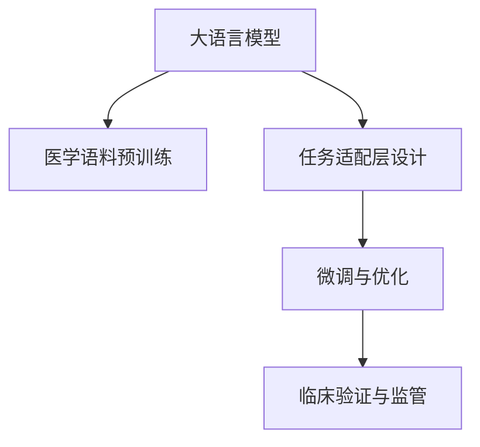

                 

# LLM在医疗诊断中的应用可能性

> 关键词：大语言模型, 医疗诊断, 自然语言处理, 疾病预测, 诊断系统, 电子病历, 临床决策支持

## 1. 背景介绍

### 1.1 问题由来

随着人工智能技术的飞速发展，自然语言处理(Natural Language Processing, NLP)技术在医疗领域的应用前景日益明朗。大语言模型(Large Language Model, LLM)作为NLP技术的最新进展，因其强大的语言理解和生成能力，被认为有可能极大地改变医疗诊断和治疗的方式。

然而，医疗诊断涉及大量的专业知识与丰富的临床经验，传统的NLP技术难以直接应用于复杂的医疗场景。大语言模型需要融合医学知识，构建能够理解医学文本、辅助医生决策的系统。本文将探讨大语言模型在医疗诊断中的可能应用，并讨论其优缺点及潜在风险。

### 1.2 问题核心关键点

大语言模型在医疗诊断中的应用，主要涉及以下几个关键点：

- **医学语料预训练**：构建包含大量医学文本的语料库，对模型进行预训练，使其具备对医学语义的理解能力。
- **任务适配层设计**：针对具体医疗诊断任务设计合适的任务适配层，如症状识别、疾病预测、诊断报告生成等。
- **微调与优化**：在少量标注数据上，通过微调优化模型参数，提升其在特定诊断任务上的表现。
- **临床验证与监管**：在真实临床数据上进行验证，确保模型输出的诊断建议可靠，避免误诊和误治。

## 2. 核心概念与联系

### 2.1 核心概念概述

为更好地理解大语言模型在医疗诊断中的应用，本节将介绍几个关键概念：

- **大语言模型**：以自回归(如GPT)或自编码(如BERT)模型为代表的大规模预训练语言模型。通过在海量文本数据上进行预训练，学习通用的语言表示，具备强大的语言理解和生成能力。

- **医学语料预训练**：构建包含大量医学文献、电子病历、医学文献等文本的语料库，对模型进行预训练，使其具备对医学语义的理解能力。

- **任务适配层设计**：针对具体医疗诊断任务设计合适的输出层和损失函数，如分类任务、序列标注任务等。

- **微调与优化**：在少量标注数据上，通过微调优化模型参数，提升其在特定诊断任务上的表现。

- **临床验证与监管**：在真实临床数据上进行验证，确保模型输出的诊断建议可靠，避免误诊和误治。

这些概念之间的逻辑关系可以通过以下Mermaid流程图来展示：



这个流程图展示了大语言模型在医疗诊断中的关键过程：

1. 大语言模型通过医学语料预训练获得基础能力。
2. 任务适配层设计，使模型适应具体医疗诊断任务。
3. 微调优化模型参数，提升模型在特定任务上的性能。
4. 在真实临床数据上进行验证，确保诊断建议的可靠性。

## 3. 核心算法原理 & 具体操作步骤
### 3.1 算法原理概述

大语言模型在医疗诊断中的应用，主要通过以下两个步骤：

1. **医学语料预训练**：构建包含大量医学文献、电子病历、医学文献等文本的语料库，对模型进行预训练，使其具备对医学语义的理解能力。这一步通常使用自监督学习任务，如掩码语言模型、下一句预测等。

2. **微调与优化**：在少量标注数据上，通过微调优化模型参数，提升其在特定诊断任务上的表现。这一步通常使用监督学习任务，如分类任务、序列标注任务等。

### 3.2 算法步骤详解

#### 3.2.1 医学语料预训练

1. **数据准备**：收集和整理医学文献、电子病历、医学报告等文本数据，构建包含丰富医学信息的语料库。
2. **模型选择**：选择适合大语言模型的架构，如BERT、GPT等，并选择合适的预训练方法，如掩码语言模型、下一句预测等。
3. **模型预训练**：使用大量未标注的医学文本进行预训练，构建医学语义表示。预训练过程中，模型会自动学习医学术语的含义、疾病症状的描述、治疗方案等。

#### 3.2.2 微调与优化

1. **任务适配层设计**：根据具体医疗诊断任务，设计合适的输出层和损失函数。例如，针对症状识别任务，可以设计一个二分类输出层，并使用交叉熵损失函数。
2. **微调数据准备**：准备少量标注数据，包括疾病名称、症状描述、临床表现等。
3. **模型微调**：使用微调数据对模型进行训练，更新模型参数以适应特定任务。微调过程中，通常使用较小的学习率，以避免破坏预训练的权重。
4. **性能评估**：在测试数据集上评估模型的性能，并根据评估结果调整微调参数。

### 3.3 算法优缺点

#### 3.3.1 优点

- **高效性**：相较于从头训练模型，微调方法可以利用预训练模型的强大能力，以较少的标注数据快速提升模型性能。
- **鲁棒性**：微调方法可以使模型更好地泛化，适应各种不同的诊断场景。
- **灵活性**：微调方法可以适应多种诊断任务，如症状识别、疾病预测、诊断报告生成等。

#### 3.3.2 缺点

- **数据依赖**：微调方法需要大量的标注数据，而这些数据的获取和标注成本较高。
- **模型复杂性**：预训练和微调步骤繁琐，对模型的设计和训练要求较高。
- **潜在风险**：预训练模型的固有偏见、有害信息等可能通过微调传递到下游任务，影响诊断的准确性。

## 4. 数学模型和公式 & 详细讲解

### 4.1 数学模型构建

假设预训练语言模型为 $M_{\theta}$，其中 $\theta$ 为预训练得到的模型参数。给定医疗诊断任务 $T$ 的标注数据集 $D=\{(x_i,y_i)\}_{i=1}^N$，微调的目标是找到新的模型参数 $\hat{\theta}$，使得：

$$
\hat{\theta}=\mathop{\arg\min}_{\theta} \mathcal{L}(M_{\theta},D)
$$

其中 $\mathcal{L}$ 为针对任务 $T$ 设计的损失函数，用于衡量模型预测输出与真实标签之间的差异。常见的损失函数包括交叉熵损失、均方误差损失等。

### 4.2 公式推导过程

以下以二分类任务为例，推导交叉熵损失函数及其梯度的计算公式。

假设模型 $M_{\theta}$ 在输入 $x$ 上的输出为 $\hat{y}=M_{\theta}(x) \in [0,1]$，表示样本属于正类的概率。真实标签 $y \in \{0,1\}$。则二分类交叉熵损失函数定义为：

$$
\ell(M_{\theta}(x),y) = -[y\log \hat{y} + (1-y)\log (1-\hat{y})]
$$

将其代入经验风险公式，得：

$$
\mathcal{L}(\theta) = -\frac{1}{N}\sum_{i=1}^N [y_i\log M_{\theta}(x_i)+(1-y_i)\log(1-M_{\theta}(x_i))]
$$

根据链式法则，损失函数对参数 $\theta_k$ 的梯度为：

$$
\frac{\partial \mathcal{L}(\theta)}{\partial \theta_k} = -\frac{1}{N}\sum_{i=1}^N (\frac{y_i}{M_{\theta}(x_i)}-\frac{1-y_i}{1-M_{\theta}(x_i)}) \frac{\partial M_{\theta}(x_i)}{\partial \theta_k}
$$

其中 $\frac{\partial M_{\theta}(x_i)}{\partial \theta_k}$ 可进一步递归展开，利用自动微分技术完成计算。

### 4.3 案例分析与讲解

#### 4.3.1 症状识别

症状识别任务要求模型能够识别出文本中描述的症状，并将其分类到预定义的疾病中。例如，对于输入“发热、咳嗽、咽痛”，模型需要判断是否为“感冒”。

1. **模型选择与预训练**：选择适合的症状识别任务，如BERT模型，并对其进行预训练，使其能够理解医学症状的语义。
2. **任务适配层设计**：设计一个二分类输出层，并使用交叉熵损失函数。
3. **微调数据准备**：准备包含症状描述和疾病名称的标注数据。
4. **模型微调**：使用标注数据对模型进行微调，优化症状识别能力。
5. **性能评估**：在测试数据集上评估模型的性能，并根据评估结果调整微调参数。

## 5. 项目实践：代码实例和详细解释说明
### 5.1 开发环境搭建

在进行微调实践前，我们需要准备好开发环境。以下是使用Python进行PyTorch开发的环境配置流程：

1. 安装Anaconda：从官网下载并安装Anaconda，用于创建独立的Python环境。

2. 创建并激活虚拟环境：
```bash
conda create -n pytorch-env python=3.8 
conda activate pytorch-env
```

3. 安装PyTorch：根据CUDA版本，从官网获取对应的安装命令。例如：
```bash
conda install pytorch torchvision torchaudio cudatoolkit=11.1 -c pytorch -c conda-forge
```

4. 安装Transformers库：
```bash
pip install transformers
```

5. 安装各类工具包：
```bash
pip install numpy pandas scikit-learn matplotlib tqdm jupyter notebook ipython
```

完成上述步骤后，即可在`pytorch-env`环境中开始微调实践。

### 5.2 源代码详细实现

这里我们以症状识别任务为例，给出使用Transformers库对BERT模型进行微调的PyTorch代码实现。

首先，定义症状识别任务的数据处理函数：

```python
from transformers import BertTokenizer
from torch.utils.data import Dataset
import torch

class SymptomDataset(Dataset):
    def __init__(self, texts, labels, tokenizer, max_len=128):
        self.texts = texts
        self.labels = labels
        self.tokenizer = tokenizer
        self.max_len = max_len
        
    def __len__(self):
        return len(self.texts)
    
    def __getitem__(self, item):
        text = self.texts[item]
        label = self.labels[item]
        
        encoding = self.tokenizer(text, return_tensors='pt', max_length=self.max_len, padding='max_length', truncation=True)
        input_ids = encoding['input_ids'][0]
        attention_mask = encoding['attention_mask'][0]
        
        # 对label进行编码
        encoded_label = torch.tensor(label, dtype=torch.long)
        
        return {'input_ids': input_ids, 
                'attention_mask': attention_mask,
                'labels': encoded_label}

# 标签与id的映射
label2id = {'感冒': 1, '流感': 2, '过敏': 3, '发烧': 4, '其他': 0}

# 创建dataset
tokenizer = BertTokenizer.from_pretrained('bert-base-cased')

train_dataset = SymptomDataset(train_texts, train_labels, tokenizer)
dev_dataset = SymptomDataset(dev_texts, dev_labels, tokenizer)
test_dataset = SymptomDataset(test_texts, test_labels, tokenizer)
```

然后，定义模型和优化器：

```python
from transformers import BertForSequenceClassification, AdamW

model = BertForSequenceClassification.from_pretrained('bert-base-cased', num_labels=len(label2id))

optimizer = AdamW(model.parameters(), lr=2e-5)
```

接着，定义训练和评估函数：

```python
from torch.utils.data import DataLoader
from tqdm import tqdm
from sklearn.metrics import classification_report

device = torch.device('cuda') if torch.cuda.is_available() else torch.device('cpu')
model.to(device)

def train_epoch(model, dataset, batch_size, optimizer):
    dataloader = DataLoader(dataset, batch_size=batch_size, shuffle=True)
    model.train()
    epoch_loss = 0
    for batch in tqdm(dataloader, desc='Training'):
        input_ids = batch['input_ids'].to(device)
        attention_mask = batch['attention_mask'].to(device)
        labels = batch['labels'].to(device)
        model.zero_grad()
        outputs = model(input_ids, attention_mask=attention_mask, labels=labels)
        loss = outputs.loss
        epoch_loss += loss.item()
        loss.backward()
        optimizer.step()
    return epoch_loss / len(dataloader)

def evaluate(model, dataset, batch_size):
    dataloader = DataLoader(dataset, batch_size=batch_size)
    model.eval()
    preds, labels = [], []
    with torch.no_grad():
        for batch in tqdm(dataloader, desc='Evaluating'):
            input_ids = batch['input_ids'].to(device)
            attention_mask = batch['attention_mask'].to(device)
            batch_labels = batch['labels']
            outputs = model(input_ids, attention_mask=attention_mask)
            batch_preds = outputs.logits.argmax(dim=2).to('cpu').tolist()
            batch_labels = batch_labels.to('cpu').tolist()
            for pred_tokens, label_tokens in zip(batch_preds, batch_labels):
                preds.append(pred_tokens)
                labels.append(label_tokens)
                
    print(classification_report(labels, preds))
```

最后，启动训练流程并在测试集上评估：

```python
epochs = 5
batch_size = 16

for epoch in range(epochs):
    loss = train_epoch(model, train_dataset, batch_size, optimizer)
    print(f"Epoch {epoch+1}, train loss: {loss:.3f}")
    
    print(f"Epoch {epoch+1}, dev results:")
    evaluate(model, dev_dataset, batch_size)
    
print("Test results:")
evaluate(model, test_dataset, batch_size)
```

以上就是使用PyTorch对BERT进行症状识别任务微调的完整代码实现。可以看到，得益于Transformers库的强大封装，我们可以用相对简洁的代码完成BERT模型的加载和微调。

### 5.3 代码解读与分析

让我们再详细解读一下关键代码的实现细节：

**SymptomDataset类**：
- `__init__`方法：初始化文本、标签、分词器等关键组件。
- `__len__`方法：返回数据集的样本数量。
- `__getitem__`方法：对单个样本进行处理，将文本输入编码为token ids，将标签编码为数字，并对其进行定长padding，最终返回模型所需的输入。

**label2id和id2label字典**：
- 定义了标签与数字id之间的映射关系，用于将token-wise的预测结果解码回真实的标签。

**训练和评估函数**：
- 使用PyTorch的DataLoader对数据集进行批次化加载，供模型训练和推理使用。
- 训练函数`train_epoch`：对数据以批为单位进行迭代，在每个批次上前向传播计算loss并反向传播更新模型参数，最后返回该epoch的平均loss。
- 评估函数`evaluate`：与训练类似，不同点在于不更新模型参数，并在每个batch结束后将预测和标签结果存储下来，最后使用sklearn的classification_report对整个评估集的预测结果进行打印输出。

**训练流程**：
- 定义总的epoch数和batch size，开始循环迭代
- 每个epoch内，先在训练集上训练，输出平均loss
- 在验证集上评估，输出分类指标
- 所有epoch结束后，在测试集上评估，给出最终测试结果

可以看到，PyTorch配合Transformers库使得BERT微调的代码实现变得简洁高效。开发者可以将更多精力放在数据处理、模型改进等高层逻辑上，而不必过多关注底层的实现细节。

当然，工业级的系统实现还需考虑更多因素，如模型的保存和部署、超参数的自动搜索、更灵活的任务适配层等。但核心的微调范式基本与此类似。

## 6. 实际应用场景
### 6.1 智能诊断系统

智能诊断系统是基于大语言模型在医疗诊断中最重要的应用之一。该系统能够通过分析电子病历、实验室报告、影像资料等，自动提取患者的症状、体征、病史等信息，并给出诊断建议和进一步的治疗方案。

在技术实现上，可以收集大量电子病历数据，构建包含丰富医学信息的语料库，对BERT等大语言模型进行预训练。随后，设计一个包含多个输出层的任务适配层，每个输出层对应一个诊断任务，如症状识别、疾病诊断、治疗方案等。通过微调优化模型参数，使模型能够针对每个任务提供精准的诊断建议。

### 6.2 电子病历摘要

电子病历摘要任务要求模型能够自动提取和总结患者的病史信息，减轻医生负担。传统的摘要方法依赖于规则和模板，无法灵活处理复杂的医疗文本。大语言模型可以通过对大量电子病历数据的预训练，学习到文本压缩和总结的高级技能。

在具体实现中，可以构建包含大量电子病历数据的语料库，对BERT等模型进行预训练。随后，设计一个二分类输出层，并使用交叉熵损失函数。在少量标注数据上，通过微调优化模型参数，使其能够自动提取和总结病史信息。

### 6.3 智能医疗问答系统

智能医疗问答系统能够回答患者的常见问题，如疾病诊断、治疗方案、用药指导等。通过收集和整理患者咨询问题及其最佳答复，构建监督数据集，对BERT等模型进行微调。微调后的模型能够理解患者的问题，并给出准确的答复。

在实际应用中，可以将患者咨询问题作为输入，模型输出最佳答复。通过不断的微调和优化，可以逐步提升模型的问答效果，并扩展到更多的医疗场景和领域。

### 6.4 未来应用展望

随着大语言模型和微调方法的不断发展，基于微调范式将在更多领域得到应用，为医疗领域带来变革性影响。

在智慧医疗领域，基于微调的智能诊断系统、电子病历摘要、智能问答系统等应用，将提升医疗服务的智能化水平，辅助医生诊疗，加速新药开发进程。

在智能医疗设备中，微调模型可以与传感器、影像设备等硬件结合，实现智能病患监测、远程诊断等功能。通过实时收集生理数据，微调模型能够提供准确的诊断建议，提高医疗服务的便捷性和及时性。

此外，在医疗数据管理、医疗知识图谱构建等方面，微调技术也将发挥重要作用。通过与自然语言处理技术的结合，微调模型能够自动解析和整合医疗文本，构建丰富、准确的医疗知识图谱，为医疗研究和应用提供有力支撑。

## 7. 工具和资源推荐
### 7.1 学习资源推荐

为了帮助开发者系统掌握大语言模型在医疗诊断中的应用，这里推荐一些优质的学习资源：

1. 《Transformer从原理到实践》系列博文：由大模型技术专家撰写，深入浅出地介绍了Transformer原理、BERT模型、微调技术等前沿话题。

2. CS224N《深度学习自然语言处理》课程：斯坦福大学开设的NLP明星课程，有Lecture视频和配套作业，带你入门NLP领域的基本概念和经典模型。

3. 《Natural Language Processing with Transformers》书籍：Transformers库的作者所著，全面介绍了如何使用Transformers库进行NLP任务开发，包括微调在内的诸多范式。

4. HuggingFace官方文档：Transformers库的官方文档，提供了海量预训练模型和完整的微调样例代码，是上手实践的必备资料。

5. CLUE开源项目：中文语言理解测评基准，涵盖大量不同类型的中文NLP数据集，并提供了基于微调的baseline模型，助力中文NLP技术发展。

通过对这些资源的学习实践，相信你一定能够快速掌握大语言模型在医疗诊断中的应用技巧，并用于解决实际的医疗问题。
### 7.2 开发工具推荐

高效的开发离不开优秀的工具支持。以下是几款用于大语言模型微调开发的常用工具：

1. PyTorch：基于Python的开源深度学习框架，灵活动态的计算图，适合快速迭代研究。大部分预训练语言模型都有PyTorch版本的实现。

2. TensorFlow：由Google主导开发的开源深度学习框架，生产部署方便，适合大规模工程应用。同样有丰富的预训练语言模型资源。

3. Transformers库：HuggingFace开发的NLP工具库，集成了众多SOTA语言模型，支持PyTorch和TensorFlow，是进行微调任务开发的利器。

4. Weights & Biases：模型训练的实验跟踪工具，可以记录和可视化模型训练过程中的各项指标，方便对比和调优。与主流深度学习框架无缝集成。

5. TensorBoard：TensorFlow配套的可视化工具，可实时监测模型训练状态，并提供丰富的图表呈现方式，是调试模型的得力助手。

6. Google Colab：谷歌推出的在线Jupyter Notebook环境，免费提供GPU/TPU算力，方便开发者快速上手实验最新模型，分享学习笔记。

合理利用这些工具，可以显著提升大语言模型微调任务的开发效率，加快创新迭代的步伐。

### 7.3 相关论文推荐

大语言模型在医疗诊断中的应用，得益于学界的持续研究。以下是几篇奠基性的相关论文，推荐阅读：

1. Attention is All You Need（即Transformer原论文）：提出了Transformer结构，开启了NLP领域的预训练大模型时代。

2. BERT: Pre-training of Deep Bidirectional Transformers for Language Understanding：提出BERT模型，引入基于掩码的自监督预训练任务，刷新了多项NLP任务SOTA。

3. Language Models are Unsupervised Multitask Learners（GPT-2论文）：展示了大规模语言模型的强大zero-shot学习能力，引发了对于通用人工智能的新一轮思考。

4. Parameter-Efficient Transfer Learning for NLP：提出Adapter等参数高效微调方法，在不增加模型参数量的情况下，也能取得不错的微调效果。

5. Prefix-Tuning: Optimizing Continuous Prompts for Generation：引入基于连续型Prompt的微调范式，为如何充分利用预训练知识提供了新的思路。

6. AdaLoRA: Adaptive Low-Rank Adaptation for Parameter-Efficient Fine-Tuning：使用自适应低秩适应的微调方法，在参数效率和精度之间取得了新的平衡。

这些论文代表了大语言模型微调技术的发展脉络。通过学习这些前沿成果，可以帮助研究者把握学科前进方向，激发更多的创新灵感。

## 8. 总结：未来发展趋势与挑战
### 8.1 总结

本文对大语言模型在医疗诊断中的应用进行了全面系统的介绍。首先阐述了医疗诊断涉及的专业知识与丰富的临床经验，传统NLP技术难以直接应用于复杂的医疗场景。其次，从原理到实践，详细讲解了基于大语言模型的微调方法，给出了微调任务开发的完整代码实例。同时，本文还广泛探讨了大语言模型在医疗诊断中的实际应用场景，展示了其潜在的巨大价值。

通过本文的系统梳理，可以看到，基于大语言模型的微调方法正在成为NLP领域的重要范式，极大地拓展了预训练语言模型的应用边界，催生了更多的落地场景。受益于大规模语料的预训练，微调模型以更低的时间和标注成本，在小样本条件下也能取得理想的性能，为医疗诊断领域带来了革命性改变。

### 8.2 未来发展趋势

展望未来，大语言模型微调技术将呈现以下几个发展趋势：

1. **模型规模持续增大**：随着算力成本的下降和数据规模的扩张，预训练语言模型的参数量还将持续增长。超大规模语言模型蕴含的丰富语言知识，有望支撑更加复杂多变的医疗诊断任务。

2. **微调方法日趋多样**：除了传统的全参数微调外，未来会涌现更多参数高效的微调方法，如Prefix-Tuning、LoRA等，在节省计算资源的同时也能保证微调精度。

3. **持续学习成为常态**：随着数据分布的不断变化，微调模型也需要持续学习新知识以保持性能。如何在不遗忘原有知识的同时，高效吸收新样本信息，将成为重要的研究课题。

4. **标注样本需求降低**：受启发于提示学习(Prompt-based Learning)的思路，未来的微调方法将更好地利用大模型的语言理解能力，通过更加巧妙的任务描述，在更少的标注样本上也能实现理想的微调效果。

5. **多模态微调崛起**：当前的微调主要聚焦于纯文本数据，未来会进一步拓展到图像、视频、语音等多模态数据微调。多模态信息的融合，将显著提升语言模型对现实世界的理解和建模能力。

6. **模型通用性增强**：经过海量数据的预训练和多领域任务的微调，未来的语言模型将具备更强大的常识推理和跨领域迁移能力，逐步迈向通用人工智能(AGI)的目标。

以上趋势凸显了大语言模型微调技术的广阔前景。这些方向的探索发展，必将进一步提升医疗诊断系统的性能和应用范围，为人类医疗健康带来深远影响。

### 8.3 面临的挑战

尽管大语言模型微调技术已经取得了瞩目成就，但在迈向更加智能化、普适化应用的过程中，它仍面临着诸多挑战：

1. **标注成本瓶颈**：医疗诊断涉及专业性强、数据量大的标注工作，获取高质量标注数据的成本较高。如何进一步降低微调对标注样本的依赖，将是一大难题。

2. **模型鲁棒性不足**：当前微调模型面对域外数据时，泛化性能往往大打折扣。对于测试样本的微小扰动，微调模型的预测也容易发生波动。如何提高微调模型的鲁棒性，避免灾难性遗忘，还需要更多理论和实践的积累。

3. **推理效率有待提高**：大规模语言模型虽然精度高，但在实际部署时往往面临推理速度慢、内存占用大等效率问题。如何在保证性能的同时，简化模型结构，提升推理速度，优化资源占用，将是重要的优化方向。

4. **可解释性亟需加强**：当前微调模型更像是"黑盒"系统，难以解释其内部工作机制和决策逻辑。对于医疗、金融等高风险应用，算法的可解释性和可审计性尤为重要。如何赋予微调模型更强的可解释性，将是亟待攻克的难题。

5. **安全性有待保障**：预训练语言模型难免会学习到有偏见、有害的信息，通过微调传递到下游任务，影响诊断的准确性。如何从数据和算法层面消除模型偏见，避免恶意用途，确保输出的安全性，也将是重要的研究课题。

6. **知识整合能力不足**：现有的微调模型往往局限于任务内数据，难以灵活吸收和运用更广泛的先验知识。如何让微调过程更好地与外部知识库、规则库等专家知识结合，形成更加全面、准确的信息整合能力，还有很大的想象空间。

正视微调面临的这些挑战，积极应对并寻求突破，将是大语言模型微调走向成熟的必由之路。相信随着学界和产业界的共同努力，这些挑战终将一一被克服，大语言模型微调必将在构建安全、可靠、可解释、可控的智能系统铺平道路。

### 8.4 研究展望

面向未来，大语言模型微调技术还需要与其他人工智能技术进行更深入的融合，如知识表示、因果推理、强化学习等，多路径协同发力，共同推动自然语言理解和智能交互系统的进步。只有勇于创新、敢于突破，才能不断拓展语言模型的边界，让智能技术更好地造福人类社会。

## 9. 附录：常见问题与解答

**Q1：大语言模型微调是否适用于所有医疗诊断任务？**

A: 大语言模型微调在大多数医疗诊断任务上都能取得不错的效果，特别是对于数据量较小的任务。但对于一些特定领域的任务，如医学、法律等，仅仅依靠通用语料预训练的模型可能难以很好地适应。此时需要在特定领域语料上进一步预训练，再进行微调，才能获得理想效果。此外，对于一些需要时效性、个性化很强的任务，如对话、推荐等，微调方法也需要针对性的改进优化。

**Q2：如何选择合适的学习率？**

A: 微调的学习率一般要比预训练时小1-2个数量级，如果使用过大的学习率，容易破坏预训练权重，导致过拟合。一般建议从1e-5开始调参，逐步减小学习率，直至收敛。也可以使用warmup策略，在开始阶段使用较小的学习率，再逐渐过渡到预设值。需要注意的是，不同的优化器(如AdamW、Adafactor等)以及不同的学习率调度策略，可能需要设置不同的学习率阈值。

**Q3：采用大模型微调时会面临哪些资源瓶颈？**

A: 目前主流的预训练大模型动辄以亿计的参数规模，对算力、内存、存储都提出了很高的要求。GPU/TPU等高性能设备是必不可少的，但即便如此，超大批次的训练和推理也可能遇到显存不足的问题。因此需要采用一些资源优化技术，如梯度积累、混合精度训练、模型并行等，来突破硬件瓶颈。同时，模型的存储和读取也可能占用大量时间和空间，需要采用模型压缩、稀疏化存储等方法进行优化。

**Q4：如何缓解微调过程中的过拟合问题？**

A: 过拟合是微调面临的主要挑战，尤其是在标注数据不足的情况下。常见的缓解策略包括：
1. 数据增强：通过回译、近义替换等方式扩充训练集
2. 正则化：使用L2正则、Dropout、Early Stopping等避免过拟合
3. 对抗训练：引入对抗样本，提高模型鲁棒性
4. 参数高效微调：只调整少量参数(如Adapter、Prefix等)，减小过拟合风险
5. 多模型集成：训练多个微调模型，取平均输出，抑制过拟合

这些策略往往需要根据具体任务和数据特点进行灵活组合。只有在数据、模型、训练、推理等各环节进行全面优化，才能最大限度地发挥大模型微调的威力。

**Q5：微调模型在落地部署时需要注意哪些问题？**

A: 将微调模型转化为实际应用，还需要考虑以下因素：
1. 模型裁剪：去除不必要的层和参数，减小模型尺寸，加快推理速度
2. 量化加速：将浮点模型转为定点模型，压缩存储空间，提高计算效率
3. 服务化封装：将模型封装为标准化服务接口，便于集成调用
4. 弹性伸缩：根据请求流量动态调整资源配置，平衡服务质量和成本
5. 监控告警：实时采集系统指标，设置异常告警阈值，确保服务稳定性
6. 安全防护：采用访问鉴权、数据脱敏等措施，保障数据和模型安全

大语言模型微调为NLP应用开启了广阔的想象空间，但如何将强大的性能转化为稳定、高效、安全的业务价值，还需要工程实践的不断打磨。唯有从数据、算法、工程、业务等多个维度协同发力，才能真正实现人工智能技术在垂直行业的规模化落地。总之，微调需要开发者根据具体任务，不断迭代和优化模型、数据和算法，方能得到理想的效果。

---

作者：禅与计算机程序设计艺术 / Zen and the Art of Computer Programming

