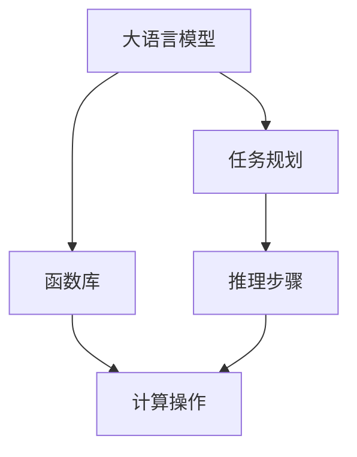

                 

# LLM的图灵完备性：任务规划与函数库的魔力

> 关键词：图灵完备性, 大语言模型(LLM), 任务规划, 函数库, 人工智能(AI), 神经网络, 深度学习

## 1. 背景介绍

### 1.1 问题由来

在大语言模型(Large Language Model, LLM)的迅速发展中，人们逐渐意识到这些模型在图灵完备性（Turing completeness）方面已经取得了显著进展。这意味着，对于任何可以通过有限步骤计算解决的问题，大语言模型理论上都可以通过其内部的逻辑推理和函数调用来完成。因此，图灵完备性成为了当前人工智能(AI)领域中的一个重要研究方向，其探讨的不仅是技术上的突破，更是对于人工智能如何应用于实际问题的深刻思考。

### 1.2 问题核心关键点

当前，大语言模型图灵完备性的研究集中在两个主要方面：任务规划与函数库。

- 任务规划：指的是如何将一个复杂的问题分解成多个子任务，并利用模型内部的逻辑推理逐步解决这些子任务，最终得到问题的答案。
- 函数库：指的是模型内部预先定义的函数和操作，这些函数可以被模型调用来完成各种复杂的计算和操作。

这两个方面相辅相成，共同构成了大语言模型图灵完备性的核心。任务规划提供了指导模型如何进行计算的框架，而函数库则提供了实现这些计算的具体工具和手段。

## 2. 核心概念与联系

### 2.1 核心概念概述

为了更好地理解图灵完备性在大语言模型中的应用，下面简要介绍几个关键概念：

- 图灵完备性：如果一个计算模型能够计算任何图灵可计算函数，那么它就是图灵完备的。
- 大语言模型(LLM)：一种基于深度学习技术构建的，能够理解和生成自然语言的模型。常见的LLM包括GPT、BERT等。
- 任务规划：将一个大问题分解成多个小问题，并设计一系列的推理步骤来逐步解决这些小问题。
- 函数库：模型内部预先定义的函数和操作，可以用于实现复杂的计算和操作。
- 深度学习：一种基于神经网络的机器学习方法，能够自动学习输入数据中的特征和模式。

这些概念之间的逻辑关系可以通过以下Mermaid流程图来展示：



这个流程图展示了大语言模型的核心概念及其之间的联系：

1. 大语言模型通过深度学习获得基础能力。
2. 任务规划将问题分解成多个子问题，逐步解决。
3. 函数库提供实现复杂计算的具体工具。
4. 推理步骤通过函数库和任务规划完成计算。

这些概念共同构成了大语言模型的逻辑框架，使其能够处理各种复杂的自然语言处理任务。

## 3. 核心算法原理 & 具体操作步骤

### 3.1 算法原理概述

基于图灵完备性的大语言模型，其核心算法原理在于通过任务规划和函数库的配合，逐步将一个大问题分解成多个小问题，并利用模型内部的逻辑推理逐步解决这些小问题。

具体来说，这个过程可以分为以下几个步骤：

1. **问题分解**：将一个大问题分解成多个小问题，每个小问题都可以独立求解。
2. **函数调用**：利用模型内部的函数库，对每个小问题进行计算。
3. **推理整合**：将各个小问题的计算结果整合起来，得到原始问题的答案。

这个过程可以通过图灵机（Turing Machine）的概念来进一步解释。图灵机是一种简单的计算模型，它可以执行任何图灵可计算函数。在大语言模型中，函数库和任务规划相当于图灵机的读写头，可以执行各种复杂的计算操作，而模型的逻辑推理则相当于图灵机的状态转移函数。

### 3.2 算法步骤详解

基于图灵完备性的大语言模型微调一般包括以下几个关键步骤：

**Step 1: 任务规划**

任务规划是实现图灵完备性的第一步。对于一个大问题，首先需要将其分解成多个小问题。这些小问题可以是单词级别的，也可以是句子级别的。

**Step 2: 函数调用**

在分解问题后，利用模型内部的函数库对每个小问题进行计算。函数库可以包含各种常见的数学函数、逻辑运算、条件判断等操作。

**Step 3: 推理整合**

将各个小问题的计算结果整合起来，得到原始问题的答案。这个过程可以通过模型的逻辑推理来实现，例如通过连结前后文信息、逻辑判断等操作。

### 3.3 算法优缺点

基于图灵完备性的大语言模型微调方法具有以下优点：

- **灵活性高**：通过任务规划，可以将各种复杂的问题分解成多个小问题，适应性强。
- **可扩展性好**：模型内部的函数库可以不断扩展和优化，提高模型处理复杂问题的能力。
- **易于维护**：通过模块化的设计，各个小问题的计算可以独立维护，减少了代码的复杂度。

同时，该方法也存在一定的局限性：

- **计算资源消耗大**：由于需要进行多次函数调用和逻辑推理，计算资源消耗较大。
- **模型难以调试**：由于模型内部的计算过程复杂，调试和优化难度较大。

尽管存在这些局限性，但就目前而言，基于图灵完备性的微调方法仍是大语言模型应用的重要方向。未来相关研究的重点在于如何进一步降低计算资源消耗，提高模型的调试和优化效率。

### 3.4 算法应用领域

基于图灵完备性的大语言模型微调方法，在NLP领域已经得到了广泛的应用，覆盖了各种任务，例如：

- 文本分类：如情感分析、主题分类等。通过任务规划和函数库，模型能够学习文本-标签映射。
- 命名实体识别：识别文本中的人名、地名、机构名等特定实体。利用函数库实现实体边界和类型判定。
- 关系抽取：从文本中抽取实体之间的语义关系。通过任务规划和函数库，模型学习实体-关系三元组。
- 问答系统：对自然语言问题给出答案。利用任务规划和函数库，模型能够匹配问题-答案对。
- 机器翻译：将源语言文本翻译成目标语言。通过函数库实现语言-语言映射。
- 文本摘要：将长文本压缩成简短摘要。利用函数库实现摘要生成。
- 对话系统：使机器能够与人自然对话。利用函数库实现多轮对话处理。

除了上述这些经典任务外，大语言模型图灵完备性还适用于各种其他场景，如可控文本生成、常识推理、代码生成、数据增强等，为NLP技术带来了新的突破。

## 4. 数学模型和公式 & 详细讲解

### 4.1 数学模型构建

假设有一个大问题 $P$，可以将其分解成 $n$ 个小问题 $P_1, P_2, ..., P_n$。对于每个小问题 $P_i$，可以设计一个函数 $f_i$ 来求解。那么，大问题的求解过程可以表示为：

$$
P = f_n(f_{n-1}(f_2(f_1(P))))
$$

其中，$f_i$ 是模型内部预先定义的函数。

### 4.2 公式推导过程

以文本分类为例，假设有一个文本 $x$ 需要被分类到 $m$ 个类别中的一个。首先，将文本 $x$ 分解成多个单词 $x_1, x_2, ..., x_n$。对于每个单词 $x_i$，可以设计一个函数 $f_i$ 来计算其与各个类别的相似度。那么，文本分类的求解过程可以表示为：

$$
y = \max_{i=1}^m \sum_{j=1}^n f_j(x_j)
$$

其中，$f_j$ 是模型内部预先定义的函数，用于计算单词 $x_j$ 与类别 $i$ 的相似度。

### 4.3 案例分析与讲解

以命名实体识别为例，假设有一个句子 $s = "John works at Google in New York."$ 需要识别出其中的实体。首先，将句子分解成单词 $s_1, s_2, ..., s_n$。对于每个单词 $s_i$，可以设计一个函数 $f_i$ 来识别其是否为实体。如果 $s_i$ 是实体，则设计另一个函数 $g_i$ 来进一步识别其类型。那么，命名实体识别的求解过程可以表示为：

$$
E = \max_{i=1}^n f_i(s_i) \land \max_{j=1}^n g_j(s_j)
$$

其中，$f_i$ 和 $g_j$ 分别是模型内部预先定义的函数，分别用于识别单词 $s_i$ 是否为实体和识别实体的类型。

## 5. 项目实践：代码实例和详细解释说明

### 5.1 开发环境搭建

在进行图灵完备性的大语言模型微调实践前，我们需要准备好开发环境。以下是使用Python进行PyTorch开发的环境配置流程：

1. 安装Anaconda：从官网下载并安装Anaconda，用于创建独立的Python环境。

2. 创建并激活虚拟环境：
```bash
conda create -n pytorch-env python=3.8 
conda activate pytorch-env
```

3. 安装PyTorch：根据CUDA版本，从官网获取对应的安装命令。例如：
```bash
conda install pytorch torchvision torchaudio cudatoolkit=11.1 -c pytorch -c conda-forge
```

4. 安装Transformers库：
```bash
pip install transformers
```

5. 安装各类工具包：
```bash
pip install numpy pandas scikit-learn matplotlib tqdm jupyter notebook ipython
```

完成上述步骤后，即可在`pytorch-env`环境中开始图灵完备性的大语言模型微调实践。

### 5.2 源代码详细实现

这里以命名实体识别(NER)任务为例，给出使用Transformers库对BERT模型进行微调的PyTorch代码实现。

首先，定义NER任务的数据处理函数：

```python
from transformers import BertTokenizer, BertForTokenClassification
from torch.utils.data import Dataset, DataLoader
import torch

class NERDataset(Dataset):
    def __init__(self, texts, tags, tokenizer):
        self.texts = texts
        self.tags = tags
        self.tokenizer = tokenizer
        
    def __len__(self):
        return len(self.texts)
    
    def __getitem__(self, item):
        text = self.texts[item]
        tags = self.tags[item]
        
        encoding = self.tokenizer(text, return_tensors='pt', truncation=True)
        input_ids = encoding['input_ids'][0]
        attention_mask = encoding['attention_mask'][0]
        
        # 对token-wise的标签进行编码
        encoded_tags = [tag2id[tag] for tag in tags] 
        encoded_tags.extend([tag2id['O']] * (len(input_ids) - len(encoded_tags)))
        labels = torch.tensor(encoded_tags, dtype=torch.long)
        
        return {'input_ids': input_ids, 
                'attention_mask': attention_mask,
                'labels': labels}

# 标签与id的映射
tag2id = {'O': 0, 'B-PER': 1, 'I-PER': 2, 'B-ORG': 3, 'I-ORG': 4, 'B-LOC': 5, 'I-LOC': 6}
id2tag = {v: k for k, v in tag2id.items()}

# 创建dataset
tokenizer = BertTokenizer.from_pretrained('bert-base-cased')

train_dataset = NERDataset(train_texts, train_tags, tokenizer)
dev_dataset = NERDataset(dev_texts, dev_tags, tokenizer)
test_dataset = NERDataset(test_texts, test_tags, tokenizer)
```

然后，定义模型和优化器：

```python
from transformers import BertForTokenClassification, AdamW

model = BertForTokenClassification.from_pretrained('bert-base-cased', num_labels=len(tag2id))

optimizer = AdamW(model.parameters(), lr=2e-5)
```

接着，定义训练和评估函数：

```python
from torch.utils.data import DataLoader
from tqdm import tqdm
from sklearn.metrics import classification_report

device = torch.device('cuda') if torch.cuda.is_available() else torch.device('cpu')
model.to(device)

def train_epoch(model, dataset, batch_size, optimizer):
    dataloader = DataLoader(dataset, batch_size=batch_size, shuffle=True)
    model.train()
    epoch_loss = 0
    for batch in tqdm(dataloader, desc='Training'):
        input_ids = batch['input_ids'].to(device)
        attention_mask = batch['attention_mask'].to(device)
        labels = batch['labels'].to(device)
        model.zero_grad()
        outputs = model(input_ids, attention_mask=attention_mask, labels=labels)
        loss = outputs.loss
        epoch_loss += loss.item()
        loss.backward()
        optimizer.step()
    return epoch_loss / len(dataloader)

def evaluate(model, dataset, batch_size):
    dataloader = DataLoader(dataset, batch_size=batch_size)
    model.eval()
    preds, labels = [], []
    with torch.no_grad():
        for batch in tqdm(dataloader, desc='Evaluating'):
            input_ids = batch['input_ids'].to(device)
            attention_mask = batch['attention_mask'].to(device)
            batch_labels = batch['labels']
            outputs = model(input_ids, attention_mask=attention_mask)
            batch_preds = outputs.logits.argmax(dim=2).to('cpu').tolist()
            batch_labels = batch_labels.to('cpu').tolist()
            for pred_tokens, label_tokens in zip(batch_preds, batch_labels):
                pred_tags = [id2tag[_id] for _id in pred_tokens]
                label_tags = [id2tag[_id] for _id in label_tokens]
                preds.append(pred_tags[:len(label_tokens)])
                labels.append(label_tags)
                
    print(classification_report(labels, preds))
```

最后，启动训练流程并在测试集上评估：

```python
epochs = 5
batch_size = 16

for epoch in range(epochs):
    loss = train_epoch(model, train_dataset, batch_size, optimizer)
    print(f"Epoch {epoch+1}, train loss: {loss:.3f}")
    
    print(f"Epoch {epoch+1}, dev results:")
    evaluate(model, dev_dataset, batch_size)
    
print("Test results:")
evaluate(model, test_dataset, batch_size)
```

以上就是使用PyTorch对BERT进行命名实体识别任务微调的完整代码实现。可以看到，得益于Transformers库的强大封装，我们可以用相对简洁的代码完成BERT模型的加载和微调。

### 5.3 代码解读与分析

让我们再详细解读一下关键代码的实现细节：

**NERDataset类**：
- `__init__`方法：初始化文本、标签、分词器等关键组件。
- `__len__`方法：返回数据集的样本数量。
- `__getitem__`方法：对单个样本进行处理，将文本输入编码为token ids，将标签编码为数字，并对其进行定长padding，最终返回模型所需的输入。

**tag2id和id2tag字典**：
- 定义了标签与数字id之间的映射关系，用于将token-wise的预测结果解码回真实的标签。

**训练和评估函数**：
- 使用PyTorch的DataLoader对数据集进行批次化加载，供模型训练和推理使用。
- 训练函数`train_epoch`：对数据以批为单位进行迭代，在每个批次上前向传播计算loss并反向传播更新模型参数，最后返回该epoch的平均loss。
- 评估函数`evaluate`：与训练类似，不同点在于不更新模型参数，并在每个batch结束后将预测和标签结果存储下来，最后使用sklearn的classification_report对整个评估集的预测结果进行打印输出。

**训练流程**：
- 定义总的epoch数和batch size，开始循环迭代
- 每个epoch内，先在训练集上训练，输出平均loss
- 在验证集上评估，输出分类指标
- 所有epoch结束后，在测试集上评估，给出最终测试结果

可以看到，PyTorch配合Transformers库使得BERT微调的代码实现变得简洁高效。开发者可以将更多精力放在数据处理、模型改进等高层逻辑上，而不必过多关注底层的实现细节。

当然，工业级的系统实现还需考虑更多因素，如模型的保存和部署、超参数的自动搜索、更灵活的任务适配层等。但核心的微调范式基本与此类似。

## 6. 实际应用场景

### 6.1 智能客服系统

基于图灵完备性的大语言模型微调技术，可以广泛应用于智能客服系统的构建。传统客服往往需要配备大量人力，高峰期响应缓慢，且一致性和专业性难以保证。而使用微调后的对话模型，可以7x24小时不间断服务，快速响应客户咨询，用自然流畅的语言解答各类常见问题。

在技术实现上，可以收集企业内部的历史客服对话记录，将问题和最佳答复构建成监督数据，在此基础上对预训练对话模型进行微调。微调后的对话模型能够自动理解用户意图，匹配最合适的答案模板进行回复。对于客户提出的新问题，还可以接入检索系统实时搜索相关内容，动态组织生成回答。如此构建的智能客服系统，能大幅提升客户咨询体验和问题解决效率。

### 6.2 金融舆情监测

金融机构需要实时监测市场舆论动向，以便及时应对负面信息传播，规避金融风险。传统的人工监测方式成本高、效率低，难以应对网络时代海量信息爆发的挑战。基于图灵完备性的大语言模型微调技术，可以应用于金融舆情监测。

具体而言，可以收集金融领域相关的新闻、报道、评论等文本数据，并对其进行主题标注和情感标注。在此基础上对预训练语言模型进行微调，使其能够自动判断文本属于何种主题，情感倾向是正面、中性还是负面。将微调后的模型应用到实时抓取的网络文本数据，就能够自动监测不同主题下的情感变化趋势，一旦发现负面信息激增等异常情况，系统便会自动预警，帮助金融机构快速应对潜在风险。

### 6.3 个性化推荐系统

当前的推荐系统往往只依赖用户的历史行为数据进行物品推荐，无法深入理解用户的真实兴趣偏好。基于图灵完备性的大语言模型微调技术，个性化推荐系统可以更好地挖掘用户行为背后的语义信息，从而提供更精准、多样的推荐内容。

在实践中，可以收集用户浏览、点击、评论、分享等行为数据，提取和用户交互的物品标题、描述、标签等文本内容。将文本内容作为模型输入，用户的后续行为（如是否点击、购买等）作为监督信号，在此基础上微调预训练语言模型。微调后的模型能够从文本内容中准确把握用户的兴趣点。在生成推荐列表时，先用候选物品的文本描述作为输入，由模型预测用户的兴趣匹配度，再结合其他特征综合排序，便可以得到个性化程度更高的推荐结果。

### 6.4 未来应用展望

随着图灵完备性的大语言模型微调技术不断发展，基于微调范式将在更多领域得到应用，为传统行业带来变革性影响。

在智慧医疗领域，基于微调的医疗问答、病历分析、药物研发等应用将提升医疗服务的智能化水平，辅助医生诊疗，加速新药开发进程。

在智能教育领域，微调技术可应用于作业批改、学情分析、知识推荐等方面，因材施教，促进教育公平，提高教学质量。

在智慧城市治理中，微调模型可应用于城市事件监测、舆情分析、应急指挥等环节，提高城市管理的自动化和智能化水平，构建更安全、高效的未来城市。

此外，在企业生产、社会治理、文娱传媒等众多领域，基于大模型微调的人工智能应用也将不断涌现，为NLP技术带来了全新的突破。相信随着预训练语言模型和微调方法的不断进步，大语言模型微调必将在构建人机协同的智能时代中扮演越来越重要的角色。

## 7. 工具和资源推荐

### 7.1 学习资源推荐

为了帮助开发者系统掌握图灵完备性的大语言模型微调的理论基础和实践技巧，这里推荐一些优质的学习资源：

1. 《Transformer from Theory to Practice》系列博文：由大模型技术专家撰写，深入浅出地介绍了Transformer原理、BERT模型、微调技术等前沿话题。

2. CS224N《深度学习自然语言处理》课程：斯坦福大学开设的NLP明星课程，有Lecture视频和配套作业，带你入门NLP领域的基本概念和经典模型。

3. 《Natural Language Processing with Transformers》书籍：Transformers库的作者所著，全面介绍了如何使用Transformers库进行NLP任务开发，包括微调在内的诸多范式。

4. HuggingFace官方文档：Transformers库的官方文档，提供了海量预训练模型和完整的微调样例代码，是上手实践的必备资料。

5. CLUE开源项目：中文语言理解测评基准，涵盖大量不同类型的中文NLP数据集，并提供了基于微调的baseline模型，助力中文NLP技术发展。

通过对这些资源的学习实践，相信你一定能够快速掌握图灵完备性的大语言模型微调的精髓，并用于解决实际的NLP问题。

### 7.2 开发工具推荐

高效的开发离不开优秀的工具支持。以下是几款用于大语言模型微调开发的常用工具：

1. PyTorch：基于Python的开源深度学习框架，灵活动态的计算图，适合快速迭代研究。大部分预训练语言模型都有PyTorch版本的实现。

2. TensorFlow：由Google主导开发的开源深度学习框架，生产部署方便，适合大规模工程应用。同样有丰富的预训练语言模型资源。

3. Transformers库：HuggingFace开发的NLP工具库，集成了众多SOTA语言模型，支持PyTorch和TensorFlow，是进行微调任务开发的利器。

4. Weights & Biases：模型训练的实验跟踪工具，可以记录和可视化模型训练过程中的各项指标，方便对比和调优。与主流深度学习框架无缝集成。

5. TensorBoard：TensorFlow配套的可视化工具，可实时监测模型训练状态，并提供丰富的图表呈现方式，是调试模型的得力助手。

6. Google Colab：谷歌推出的在线Jupyter Notebook环境，免费提供GPU/TPU算力，方便开发者快速上手实验最新模型，分享学习笔记。

合理利用这些工具，可以显著提升图灵完备性的大语言模型微调任务的开发效率，加快创新迭代的步伐。

### 7.3 相关论文推荐

图灵完备性的大语言模型微调技术的发展源于学界的持续研究。以下是几篇奠基性的相关论文，推荐阅读：

1. Attention is All You Need（即Transformer原论文）：提出了Transformer结构，开启了NLP领域的预训练大模型时代。

2. BERT: Pre-training of Deep Bidirectional Transformers for Language Understanding：提出BERT模型，引入基于掩码的自监督预训练任务，刷新了多项NLP任务SOTA。

3. Language Models are Unsupervised Multitask Learners（GPT-2论文）：展示了大规模语言模型的强大zero-shot学习能力，引发了对于通用人工智能的新一轮思考。

4. Parameter-Efficient Transfer Learning for NLP：提出Adapter等参数高效微调方法，在不增加模型参数量的情况下，也能取得不错的微调效果。

5. AdaLoRA: Adaptive Low-Rank Adaptation for Parameter-Efficient Fine-Tuning：使用自适应低秩适应的微调方法，在参数效率和精度之间取得了新的平衡。

6. Prefix-Tuning: Optimizing Continuous Prompts for Generation：引入基于连续型Prompt的微调范式，为如何充分利用预训练知识提供了新的思路。

这些论文代表了大语言模型微调技术的发展脉络。通过学习这些前沿成果，可以帮助研究者把握学科前进方向，激发更多的创新灵感。

## 8. 总结：未来发展趋势与挑战

### 8.1 总结

本文对图灵完备性在大语言模型中的应用进行了全面系统的介绍。首先阐述了图灵完备性的概念，明确了其在大语言模型微调中的重要性。其次，从原理到实践，详细讲解了图灵完备性的核心算法原理和操作步骤，给出了微调任务开发的完整代码实例。同时，本文还广泛探讨了图灵完备性在智能客服、金融舆情、个性化推荐等多个行业领域的应用前景，展示了图灵完备性微调范式的巨大潜力。此外，本文精选了图灵完备性相关的学习资源，力求为读者提供全方位的技术指引。

通过本文的系统梳理，可以看到，图灵完备性在大语言模型中的应用正在成为NLP领域的重要方向，极大地拓展了预训练语言模型的应用边界，催生了更多的落地场景。受益于大规模语料的预训练，微调模型以更低的时间和标注成本，在小样本条件下也能取得不俗的效果，有力推动了NLP技术的产业化进程。未来，伴随预训练语言模型和微调方法的持续演进，图灵完备性技术必将进一步提升NLP系统的性能和应用范围，为人类认知智能的进化带来深远影响。

### 8.2 未来发展趋势

展望未来，图灵完备性的大语言模型微调技术将呈现以下几个发展趋势：

1. 模型规模持续增大。随着算力成本的下降和数据规模的扩张，预训练语言模型的参数量还将持续增长。超大规模语言模型蕴含的丰富语言知识，有望支撑更加复杂多变的下游任务微调。

2. 图灵完备性进一步提升。未来的大语言模型将进一步提升其在逻辑推理和函数调用方面的能力，能够处理更加复杂和抽象的问题。

3. 多模态融合加深。图灵完备性技术将更多地与视觉、语音等模态信息融合，实现跨模态的智能推理和决策。

4. 知识整合能力增强。将符号化的先验知识，如知识图谱、逻辑规则等，与神经网络模型进行巧妙融合，引导微调过程学习更准确、合理的语言模型。

5. 增强模型的可解释性和可控性。未来的图灵完备性模型将更多地考虑其决策过程的透明度和可解释性，使得用户能够理解和信任模型的输出。

6. 引入更广泛的应用场景。图灵完备性技术将不仅限于自然语言处理领域，还将广泛应用于医疗、金融、法律等垂直行业，解决实际问题。

以上趋势凸显了图灵完备性在大语言模型微调中的巨大潜力。这些方向的探索发展，必将进一步提升图灵完备性模型的性能和应用范围，为构建更加智能化的系统铺平道路。

### 8.3 面临的挑战

尽管图灵完备性的大语言模型微调技术已经取得了显著进展，但在迈向更加智能化、普适化应用的过程中，仍面临诸多挑战：

1. 标注成本瓶颈。虽然图灵完备性技术可以降低对标注样本的依赖，但对于一些特定领域，获取高质量标注数据依然困难。如何进一步降低标注成本，将是一个重要的研究方向。

2. 模型鲁棒性不足。图灵完备性模型在处理域外数据时，泛化性能往往不足，容易受到输入数据噪声的影响。如何提高模型的鲁棒性和泛化能力，将是一个亟需解决的问题。

3. 推理效率有待提高。尽管图灵完备性模型具备强大的计算能力，但在实际部署时，推理速度和资源消耗依然较大。如何优化模型的推理效率，降低计算资源消耗，将是一个重要研究方向。

4. 可解释性不足。图灵完备性模型往往具有较强的复杂度，难以解释其内部的推理过程。如何增强模型的可解释性，提高用户信任度，将是一个重要的研究方向。

5. 安全性有待保障。图灵完备性模型可能学习到有偏见、有害的信息，通过微调传递到下游任务，产生误导性、歧视性的输出。如何从数据和算法层面消除模型偏见，确保输出安全，将是一个重要的研究方向。

6. 技术演进迅速，人才短缺。图灵完备性技术涉及深度学习、自然语言处理、计算图等多个领域，需要多学科知识支撑。如何培养和吸引更多的高端人才，将是一个重要的挑战。

正视图灵完备性微调面临的这些挑战，积极应对并寻求突破，将是大语言模型微调走向成熟的必由之路。相信随着学界和产业界的共同努力，这些挑战终将一一被克服，图灵完备性技术必将在构建安全、可靠、可解释、可控的智能系统中发挥更大的作用。

### 8.4 研究展望

面对图灵完备性微调所面临的挑战，未来的研究需要在以下几个方面寻求新的突破：

1. 探索无监督和半监督微调方法。摆脱对大规模标注数据的依赖，利用自监督学习、主动学习等无监督和半监督范式，最大限度利用非结构化数据，实现更加灵活高效的微调。

2. 研究参数高效和计算高效的微调范式。开发更加参数高效的微调方法，在固定大部分预训练参数的同时，只更新极少量的任务相关参数。同时优化微调模型的计算图，减少前向传播和反向传播的资源消耗，实现更加轻量级、实时性的部署。

3. 融合因果和对比学习范式。通过引入因果推断和对比学习思想，增强图灵完备性模型建立稳定因果关系的能力，学习更加普适、鲁棒的语言表征，从而提升模型泛化性和抗干扰能力。

4. 引入更多先验知识。将符号化的先验知识，如知识图谱、逻辑规则等，与神经网络模型进行巧妙融合，引导微调过程学习更准确、合理的语言模型。同时加强不同模态数据的整合，实现视觉、语音等多模态信息与文本信息的协同建模。

5. 结合因果分析和博弈论工具。将因果分析方法引入图灵完备性模型，识别出模型决策的关键特征，增强输出解释的因果性和逻辑性。借助博弈论工具刻画人机交互过程，主动探索并规避模型的脆弱点，提高系统稳定性。

6. 纳入伦理道德约束。在模型训练目标中引入伦理导向的评估指标，过滤和惩罚有偏见、有害的输出倾向。同时加强人工干预和审核，建立模型行为的监管机制，确保输出符合人类价值观和伦理道德。

这些研究方向的探索，必将引领图灵完备性微调技术迈向更高的台阶，为构建安全、可靠、可解释、可控的智能系统铺平道路。面向未来，图灵完备性大语言模型微调技术还需要与其他人工智能技术进行更深入的融合，如知识表示、因果推理、强化学习等，多路径协同发力，共同推动自然语言理解和智能交互系统的进步。只有勇于创新、敢于突破，才能不断拓展语言模型的边界，让智能技术更好地造福人类社会。

## 9. 附录：常见问题与解答

**Q1：图灵完备性是否适用于所有NLP任务？**

A: 图灵完备性适用于大多数NLP任务，特别是那些可以通过逻辑推理和函数调用解决的任务。但对于一些特定领域的任务，如图表生成、知识图谱构建等，图灵完备性可能无法直接应用。此时需要在特定领域语料上进一步预训练，再进行微调，才能获得理想效果。

**Q2：图灵完备性模型是否可以处理动态环境中的问题？**

A: 图灵完备性模型在处理动态环境中的问题时，可能会面临一些挑战。由于模型的逻辑推理和函数调用依赖于固定的输入数据，因此在动态环境中，模型需要能够快速适应输入数据的变化，才能保持性能的稳定性。这需要对模型进行动态训练和优化，或者引入更灵活的模型结构，如时序模型、变分自编码器等。

**Q3：图灵完备性模型在推理过程中是否容易产生错误？**

A: 图灵完备性模型在推理过程中，可能会因为输入数据的噪声、模型参数的不稳定性等因素，产生推理错误。因此，需要对模型进行细致的调试和优化，以提高其鲁棒性和泛化能力。常见的优化方法包括数据增强、正则化、对抗训练等。

**Q4：图灵完备性模型在实际应用中如何避免计算资源消耗过大？**

A: 为了降低计算资源消耗，可以采用以下方法：
1. 参数剪枝：去除模型中不重要的参数，减小模型规模。
2. 模型压缩：通过量化、剪枝等技术，减小模型参数的存储空间和计算量。
3. 分布式训练：使用多台机器并行训练，提高训练效率。
4. 推理优化：使用高效推理算法，如剪枝、量化等，减小推理过程中的计算量。

**Q5：图灵完备性模型在实际应用中如何保证其安全性？**

A: 为了保证图灵完备性模型的安全性，可以采用以下方法：
1. 数据脱敏：在模型训练和推理过程中，对敏感数据进行脱敏处理，防止信息泄露。
2. 模型审计：定期对模型进行安全审计，检测是否有恶意输入导致模型输出错误。
3. 异常检测：在模型推理过程中，实时监测输入数据和输出结果，检测异常行为。
4. 用户干预：引入人工干预机制，当模型输出结果与预期不符时，自动进入人工校验环节。

通过上述方法，可以有效地提高图灵完备性模型的安全性，确保其输出结果可靠、可信。

---

作者：禅与计算机程序设计艺术 / Zen and the Art of Computer Programming

