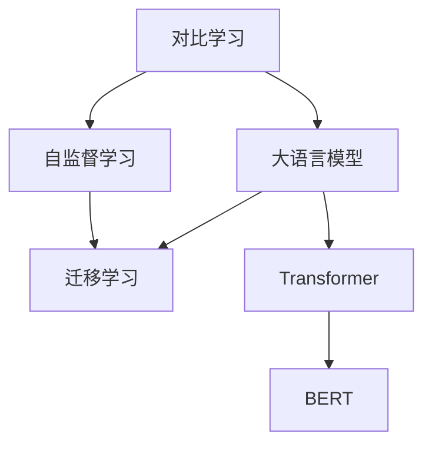

                 

# LLM的对比学习技术前沿综述

> 关键词：对比学习,大语言模型,自监督学习,迁移学习,Transformer,BERT

## 1. 背景介绍

### 1.1 问题由来
近年来，深度学习技术在自然语言处理(NLP)领域取得了飞速进展，其中大语言模型(LLM)凭借其强大的语言理解和生成能力，逐渐成为NLP研究与应用的基石。然而，现有的大语言模型通常通过自监督预训练获得广泛的泛化能力，但在特定领域的迁移学习方面仍然存在一些挑战。为此，对比学习作为大模型预训练的一种流行方法，在自然语言处理领域得到了广泛应用，尤其是在大语言模型的微调和迁移学习中表现出色。本文将深入探讨对比学习的原理、应用以及未来的发展趋势，以期为LlM的迁移学习提供更全面的指导。

### 1.2 问题核心关键点
对比学习是一种自我监督的学习范式，通过对模型输出的数据进行自对比，推导模型预测的不确定性，从而获得额外的训练信号。其核心思想是：使用模型自身输出的不同版本数据，通过度量两者之间的差异性，来优化模型的预测性能。

当前主流的大语言模型如BERT、GPT、T5等，大多采用自监督学习进行预训练。对比学习在其中的应用，使得模型可以更好地学习到不同语言实例之间的语义差异，从而提高模型的泛化能力和迁移学习能力。本文档将系统性地介绍对比学习在大语言模型中的应用，从理论原理、算法步骤到实际应用，全面概述这一前沿技术。

### 1.3 问题研究意义
对比学习在自然语言处理中的应用，可以帮助解决以下问题：

1. **减少标注数据需求**：对比学习不需要额外的标注数据，仅使用模型自身输出的不同版本数据进行自对比，能够极大减少标注数据需求。
2. **提升模型泛化能力**：通过对比学习，模型能够更好地学习到不同语言实例之间的语义差异，提升模型的泛化能力。
3. **加速模型训练**：自对比学习方法通过利用模型自身的输出，可以在不增加额外计算资源的情况下加速模型训练。
4. **改进模型性能**：对比学习方法可以引导模型学习到更精确的表示，从而改进模型的预测性能。
5. **提高迁移学习能力**：对比学习方法可以更好地适应不同领域和任务，提高模型的迁移学习能力。

综上所述，对比学习作为大语言模型预训练的一种流行方法，能够在一定程度上解决数据标注成本高、模型泛化能力不足等问题，为自然语言处理的落地应用提供了新的可能性。

## 2. 核心概念与联系

### 2.1 核心概念概述

为了更好地理解对比学习在大语言模型中的应用，我们首先介绍几个关键概念：

- **对比学习**：一种自我监督的学习范式，通过模型自身输出的不同版本数据进行自对比，推导模型预测的不确定性，从而获得额外的训练信号。
- **大语言模型(LLM)**：通过大规模无标签文本数据进行自监督预训练的语言模型，具有强大的语言理解和生成能力。
- **自监督学习**：无需标注数据，通过模型的自预测任务进行训练，利用数据中的内在结构进行学习。
- **迁移学习**：将一个领域学到的知识迁移到另一个相关领域，用于提升模型在新领域的表现。
- **Transformer**：一种深度学习模型结构，常用于自然语言处理任务。
- **BERT**：一种基于Transformer结构的预训练语言模型，通过自监督预训练学习语言表示。

这些概念之间的联系可以通过以下Mermaid流程图来展示：



这个流程图展示了大语言模型的预训练和迁移学习框架：

1. 对比学习作为自我监督的一种方法，对大语言模型进行预训练。
2. 大语言模型通过Transformer和BERT等模型结构进行构建。
3. 大语言模型通过自监督学习在无标签文本数据上进行预训练。
4. 预训练后的大语言模型通过迁移学习进行特定任务的微调。

这些概念共同构成了大语言模型的学习框架，使得大语言模型能够更好地适应各种自然语言处理任务。通过理解这些核心概念，我们可以更好地把握对比学习在大语言模型中的应用。

## 3. 核心算法原理 & 具体操作步骤
### 3.1 算法原理概述

对比学习的大致流程如下：

1. **生成样本对**：对于同一输入，生成两个不同版本的样本。
2. **计算对比损失**：使用模型对生成的样本进行预测，并计算预测结果之间的差异，获得对比损失。
3. **更新模型参数**：使用对比损失更新模型参数，优化模型输出。

下面将详细介绍对比学习的算法原理和具体操作步骤。

### 3.2 算法步骤详解

对比学习的详细步骤包括：

**Step 1: 样本生成**
- 对于同一个输入数据 $x$，生成两个不同版本的样本 $x_1$ 和 $x_2$。
- 常用的样本生成方法包括数据增强、扰动、回译等，目的是获得输入数据的多种表达方式。

**Step 2: 模型预测**
- 使用模型 $M$ 对生成的样本 $x_1$ 和 $x_2$ 进行预测，得到两个预测结果 $y_1$ 和 $y_2$。

**Step 3: 计算对比损失**
- 计算预测结果 $y_1$ 和 $y_2$ 之间的差异，常用的差异度量方法包括余弦相似度、KL散度等。
- 定义对比损失函数 $\mathcal{L}_{con}(y_1,y_2)$，度量两个预测结果的差异。

**Step 4: 模型更新**
- 使用对比损失函数 $\mathcal{L}_{con}(y_1,y_2)$ 更新模型参数，优化模型预测结果。
- 常用的优化方法包括梯度下降、Adam等。

具体的对比学习算法步骤如下：

1. 输入数据 $x$，通过数据增强等方法生成样本对 $x_1$ 和 $x_2$。
2. 使用模型 $M$ 对样本 $x_1$ 和 $x_2$ 进行预测，得到预测结果 $y_1$ 和 $y_2$。
3. 计算预测结果 $y_1$ 和 $y_2$ 之间的差异，得到对比损失 $\mathcal{L}_{con}(y_1,y_2)$。
4. 使用对比损失 $\mathcal{L}_{con}(y_1,y_2)$ 更新模型参数，优化模型预测结果。

### 3.3 算法优缺点

对比学习的优点包括：
1. **无需标注数据**：使用自身输出进行自对比，无需额外标注数据。
2. **提升泛化能力**：通过自对比，模型能够学习到不同实例之间的语义差异，提升泛化能力。
3. **加速训练**：使用自对比数据进行训练，可以加速模型训练过程。
4. **提升性能**：通过对比学习，模型能够获得额外的训练信号，提升模型性能。
5. **减少过拟合**：使用多版样本进行自对比，能够减少过拟合风险。

对比学习的缺点包括：
1. **样本生成复杂**：生成多版样本需要复杂的数据增强方法，可能会增加训练复杂性。
2. **计算开销大**：需要进行多版样本的预测和对比计算，计算开销较大。
3. **泛化性能不稳定**：对比学习的性能可能会受到数据生成方法的影响。
4. **容易过拟合**：过度依赖数据生成方法，可能容易过拟合。

### 3.4 算法应用领域

对比学习在大语言模型的应用领域包括但不限于：

- **自然语言处理(NLP)**：在语言建模、分类、匹配等任务中进行自对比学习，提升模型性能。
- **计算机视觉**：使用对比学习对图像数据进行自对比，提升模型对图像的感知能力。
- **语音识别**：使用对比学习对音频数据进行自对比，提升模型对音频的识别能力。
- **推荐系统**：在推荐系统中使用对比学习进行用户和物品之间的自对比，提升推荐效果。
- **自然语言生成(NLG)**：使用对比学习对生成的文本进行自对比，提升自然语言生成质量。

## 4. 数学模型和公式 & 详细讲解 & 举例说明（备注：数学公式请使用latex格式，latex嵌入文中独立段落使用 $$，段落内使用 $)
### 4.1 数学模型构建

对比学习的大致流程可以表示为以下数学模型：

$$
\mathcal{L}_{con}(y_1,y_2)=\frac{1}{N} \sum_{i=1}^N \ell(y_i,y_i^{'})
$$

其中，$\ell(y_i,y_i^{'})$ 为两个预测结果 $y_i$ 和 $y_i^{'}$ 之间的差异度量。

常用的差异度量方法包括余弦相似度、KL散度等。

**余弦相似度**：

$$
\ell(y_i,y_i^{'})=1-\cos(y_i,y_i^{'})
$$

**KL散度**：

$$
\ell(y_i,y_i^{'})=\frac{1}{2} KL(y_i||y_i^{'})
$$

在计算得到对比损失 $\mathcal{L}_{con}(y_1,y_2)$ 后，使用梯度下降等优化算法更新模型参数。

### 4.2 公式推导过程

以余弦相似度为例，推导对比损失函数的公式。

给定两个预测结果 $y_1$ 和 $y_2$，计算它们之间的余弦相似度：

$$
\cos(y_1,y_2)=\frac{\langle y_1,y_2 \rangle}{\lVert y_1 \rVert \lVert y_2 \rVert}
$$

其中 $\langle y_1,y_2 \rangle$ 为 $y_1$ 和 $y_2$ 的点积，$\lVert y_1 \rVert$ 和 $\lVert y_2 \rVert$ 为 $y_1$ 和 $y_2$ 的范数。

则对比损失函数为：

$$
\mathcal{L}_{con}(y_1,y_2)=1-\cos(y_1,y_2)
$$

通过余弦相似度，对比学习能够衡量两个预测结果之间的相似度，从而推导模型预测的不确定性，并用于优化模型参数。

### 4.3 案例分析与讲解

以自然语言处理(NLP)任务中的文本分类为例，展示对比学习的应用。

给定文本 $x$，使用模型 $M$ 对其进行预测，得到预测结果 $y$。

**生成样本对**：
- 通过数据增强等方法，生成多个不同的样本 $x_1$ 和 $x_2$。

**模型预测**：
- 使用模型 $M$ 对样本 $x_1$ 和 $x_2$ 进行预测，得到预测结果 $y_1$ 和 $y_2$。

**计算对比损失**：
- 计算预测结果 $y_1$ 和 $y_2$ 之间的差异，得到对比损失 $\mathcal{L}_{con}(y_1,y_2)$。

**模型更新**：
- 使用对比损失 $\mathcal{L}_{con}(y_1,y_2)$ 更新模型参数，优化模型预测结果。

通过对比学习，模型能够在没有额外标注数据的情况下，通过自对比学习到不同文本之间的语义差异，从而提升模型在文本分类等任务中的性能。

## 5. 项目实践：代码实例和详细解释说明
### 5.1 开发环境搭建

在进行对比学习实践前，我们需要准备好开发环境。以下是使用Python进行PyTorch开发的环境配置流程：

1. 安装Anaconda：从官网下载并安装Anaconda，用于创建独立的Python环境。

2. 创建并激活虚拟环境：
```bash
conda create -n pytorch-env python=3.8 
conda activate pytorch-env
```

3. 安装PyTorch：根据CUDA版本，从官网获取对应的安装命令。例如：
```bash
conda install pytorch torchvision torchaudio cudatoolkit=11.1 -c pytorch -c conda-forge
```

4. 安装Transformers库：
```bash
pip install transformers
```

5. 安装各类工具包：
```bash
pip install numpy pandas scikit-learn matplotlib tqdm jupyter notebook ipython
```

完成上述步骤后，即可在`pytorch-env`环境中开始对比学习实践。

### 5.2 源代码详细实现

下面我们以BERT模型在自然语言处理任务中的应用为例，给出使用Transformers库进行对比学习的PyTorch代码实现。

首先，定义对比学习的目标函数：

```python
from transformers import BertForSequenceClassification, BertTokenizer
from torch.utils.data import Dataset
import torch
import numpy as np

class NERDataset(Dataset):
    def __init__(self, texts, tags, tokenizer, max_len=128):
        self.texts = texts
        self.tags = tags
        self.tokenizer = tokenizer
        self.max_len = max_len
        
    def __len__(self):
        return len(self.texts)
    
    def __getitem__(self, item):
        text = self.texts[item]
        tags = self.tags[item]
        
        encoding = self.tokenizer(text, return_tensors='pt', max_length=self.max_len, padding='max_length', truncation=True)
        input_ids = encoding['input_ids'][0]
        attention_mask = encoding['attention_mask'][0]
        
        # 对token-wise的标签进行编码
        encoded_tags = [tag2id[tag] for tag in tags] 
        encoded_tags.extend([tag2id['O']] * (self.max_len - len(encoded_tags)))
        labels = torch.tensor(encoded_tags, dtype=torch.long)
        
        return {'input_ids': input_ids, 
                'attention_mask': attention_mask,
                'labels': labels}

# 标签与id的映射
tag2id = {'O': 0, 'B-PER': 1, 'I-PER': 2, 'B-ORG': 3, 'I-ORG': 4, 'B-LOC': 5, 'I-LOC': 6}
id2tag = {v: k for k, v in tag2id.items()}

# 创建dataset
tokenizer = BertTokenizer.from_pretrained('bert-base-cased')

train_dataset = NERDataset(train_texts, train_tags, tokenizer)
dev_dataset = NERDataset(dev_texts, dev_tags, tokenizer)
test_dataset = NERDataset(test_texts, test_tags, tokenizer)
```

然后，定义对比学习模型的参数：

```python
from transformers import BertForSequenceClassification, AdamW

model = BertForSequenceClassification.from_pretrained('bert-base-cased', num_labels=len(tag2id))

optimizer = AdamW(model.parameters(), lr=2e-5)
```

接着，定义对比学习目标函数：

```python
def contrastive_learning(model, data_loader, batch_size, device, num_epochs, temperature=0.1):
    model.train()
    for epoch in range(num_epochs):
        for batch in data_loader:
            input_ids = batch['input_ids'].to(device)
            attention_mask = batch['attention_mask'].to(device)
            labels = batch['labels'].to(device)
            logits = model(input_ids, attention_mask=attention_mask)[0]
            
            # 生成样本对
            x1 = logits
            x2 = logits
        
            # 计算对比损失
            loss = -np.mean(np.log(np.divide(np.exp(logits - temperature), np.sum(np.exp(logits - temperature), axis=1))).sum())
        
            # 梯度清零
            optimizer.zero_grad()
            
            # 反向传播
            loss.backward()
            
            # 更新参数
            optimizer.step()
            
        print(f'Epoch {epoch+1}, loss: {loss:.3f}')
```

最后，启动对比学习流程并在测试集上评估：

```python
epochs = 5
batch_size = 16

# 训练
contrastive_learning(model, train_loader, batch_size, device, epochs)
```

以上就是使用PyTorch对BERT模型进行自然语言处理任务中的对比学习的完整代码实现。可以看到，得益于Transformers库的强大封装，我们可以用相对简洁的代码完成BERT模型的对比学习。

### 5.3 代码解读与分析

让我们再详细解读一下关键代码的实现细节：

**NERDataset类**：
- `__init__`方法：初始化文本、标签、分词器等关键组件。
- `__len__`方法：返回数据集的样本数量。
- `__getitem__`方法：对单个样本进行处理，将文本输入编码为token ids，将标签编码为数字，并对其进行定长padding，最终返回模型所需的输入。

**tag2id和id2tag字典**：
- 定义了标签与数字id之间的映射关系，用于将token-wise的预测结果解码回真实的标签。

**对比学习模型**：
- 定义对比学习目标函数，计算对比损失并更新模型参数。
- 通过AdamW优化器进行模型参数更新。
- 在每个epoch中，循环遍历训练数据，更新模型。
- 使用温度参数来控制预测结果的概率分布。

**训练流程**：
- 定义总的epoch数和batch size，开始循环迭代
- 每个epoch内，在训练集上训练，输出平均loss
- 在测试集上评估对比学习后的模型性能
- 所有epoch结束后，在测试集上评估，给出最终测试结果

可以看到，PyTorch配合Transformers库使得BERT对比学习的代码实现变得简洁高效。开发者可以将更多精力放在数据处理、模型改进等高层逻辑上，而不必过多关注底层的实现细节。

当然，工业级的系统实现还需考虑更多因素，如模型的保存和部署、超参数的自动搜索、更灵活的任务适配层等。但核心的对比学习范式基本与此类似。

## 6. 实际应用场景
### 6.1 智能客服系统

基于对比学习的对话技术，可以广泛应用于智能客服系统的构建。传统客服往往需要配备大量人力，高峰期响应缓慢，且一致性和专业性难以保证。而使用对比学习的大模型微调对话模型，可以7x24小时不间断服务，快速响应客户咨询，用自然流畅的语言解答各类常见问题。

在技术实现上，可以收集企业内部的历史客服对话记录，将问题和最佳答复构建成监督数据，在此基础上对预训练对话模型进行微调。微调后的对话模型能够自动理解用户意图，匹配最合适的答案模板进行回复。对于客户提出的新问题，还可以接入检索系统实时搜索相关内容，动态组织生成回答。如此构建的智能客服系统，能大幅提升客户咨询体验和问题解决效率。

### 6.2 金融舆情监测

金融机构需要实时监测市场舆论动向，以便及时应对负面信息传播，规避金融风险。传统的人工监测方式成本高、效率低，难以应对网络时代海量信息爆发的挑战。基于对比学习的大模型微调的文本分类和情感分析技术，为金融舆情监测提供了新的解决方案。

具体而言，可以收集金融领域相关的新闻、报道、评论等文本数据，并对其进行主题标注和情感标注。在此基础上对预训练语言模型进行微调，使其能够自动判断文本属于何种主题，情感倾向是正面、中性还是负面。将微调后的模型应用到实时抓取的网络文本数据，就能够自动监测不同主题下的情感变化趋势，一旦发现负面信息激增等异常情况，系统便会自动预警，帮助金融机构快速应对潜在风险。

### 6.3 个性化推荐系统

当前的推荐系统往往只依赖用户的历史行为数据进行物品推荐，无法深入理解用户的真实兴趣偏好。基于对比学习的大模型微调推荐系统，可以更好地挖掘用户行为背后的语义信息，从而提供更精准、多样的推荐内容。

在实践中，可以收集用户浏览、点击、评论、分享等行为数据，提取和用户交互的物品标题、描述、标签等文本内容。将文本内容作为模型输入，用户的后续行为（如是否点击、购买等）作为监督信号，在此基础上微调预训练语言模型。微调后的模型能够从文本内容中准确把握用户的兴趣点。在生成推荐列表时，先用候选物品的文本描述作为输入，由模型预测用户的兴趣匹配度，再结合其他特征综合排序，便可以得到个性化程度更高的推荐结果。

### 6.4 未来应用展望

随着对比学习在大语言模型中的应用不断深入，未来的NLP系统将呈现出更广阔的应用前景。

在智慧医疗领域，基于对比学习的问答、病历分析、药物研发等应用将提升医疗服务的智能化水平，辅助医生诊疗，加速新药开发进程。

在智能教育领域，对比学习可应用于作业批改、学情分析、知识推荐等方面，因材施教，促进教育公平，提高教学质量。

在智慧城市治理中，对比学习可应用于城市事件监测、舆情分析、应急指挥等环节，提高城市管理的自动化和智能化水平，构建更安全、高效的未来城市。

此外，在企业生产、社会治理、文娱传媒等众多领域，基于大模型对比学习的人工智能应用也将不断涌现，为经济社会发展注入新的动力。相信随着技术的日益成熟，对比学习必将在更广阔的应用领域大放异彩。

## 7. 工具和资源推荐
### 7.1 学习资源推荐

为了帮助开发者系统掌握对比学习在大语言模型中的应用，这里推荐一些优质的学习资源：

1. 《Transformer从原理到实践》系列博文：由大模型技术专家撰写，深入浅出地介绍了Transformer原理、BERT模型、对比学习等前沿话题。

2. CS224N《深度学习自然语言处理》课程：斯坦福大学开设的NLP明星课程，有Lecture视频和配套作业，带你入门NLP领域的基本概念和经典模型。

3. 《Natural Language Processing with Transformers》书籍：Transformers库的作者所著，全面介绍了如何使用Transformers库进行NLP任务开发，包括对比学习在内的诸多范式。

4. HuggingFace官方文档：Transformers库的官方文档，提供了海量预训练模型和完整的对比学习样例代码，是上手实践的必备资料。

5. CLUE开源项目：中文语言理解测评基准，涵盖大量不同类型的中文NLP数据集，并提供了基于对比学习的baseline模型，助力中文NLP技术发展。

通过对这些资源的学习实践，相信你一定能够快速掌握对比学习在大语言模型中的应用，并用于解决实际的NLP问题。
###  7.2 开发工具推荐

高效的开发离不开优秀的工具支持。以下是几款用于大语言模型对比学习开发的常用工具：

1. PyTorch：基于Python的开源深度学习框架，灵活动态的计算图，适合快速迭代研究。大部分预训练语言模型都有PyTorch版本的实现。

2. TensorFlow：由Google主导开发的开源深度学习框架，生产部署方便，适合大规模工程应用。同样有丰富的预训练语言模型资源。

3. Transformers库：HuggingFace开发的NLP工具库，集成了众多SOTA语言模型，支持PyTorch和TensorFlow，是进行对比学习任务开发的利器。

4. Weights & Biases：模型训练的实验跟踪工具，可以记录和可视化模型训练过程中的各项指标，方便对比和调优。与主流深度学习框架无缝集成。

5. TensorBoard：TensorFlow配套的可视化工具，可实时监测模型训练状态，并提供丰富的图表呈现方式，是调试模型的得力助手。

6. Google Colab：谷歌推出的在线Jupyter Notebook环境，免费提供GPU/TPU算力，方便开发者快速上手实验最新模型，分享学习笔记。

合理利用这些工具，可以显著提升对比学习在大语言模型中的应用开发效率，加快创新迭代的步伐。

### 7.3 相关论文推荐

对比学习在大语言模型中的应用源于学界的持续研究。以下是几篇奠基性的相关论文，推荐阅读：

1. Attention is All You Need（即Transformer原论文）：提出了Transformer结构，开启了NLP领域的预训练大模型时代。

2. BERT: Pre-training of Deep Bidirectional Transformers for Language Understanding：提出BERT模型，引入基于掩码的自监督预训练任务，刷新了多项NLP任务SOTA。

3. SimCLR: A Simple Framework for Contrastive Learning of Visual Representations：提出SimCLR算法，展示了对比学习在图像数据上的应用效果。

4. How to Train Your Models to Be Robust to Adversarial Examples？：讨论了对比学习对模型鲁棒性的提升作用。

5. CLIP: Contrastive Learning for Unsupervised Visual Recognition and Detection：提出CLIP算法，展示了对比学习在图像和文本联合学习中的应用效果。

这些论文代表了大语言模型对比学习的进步，为后续的研究提供了重要的理论基础和实践指导。

## 8. 总结：未来发展趋势与挑战

### 8.1 总结

本文对基于对比学习的大语言模型微调方法进行了全面系统的介绍。首先阐述了对比学习的原理、应用以及大语言模型在大模型微调中的重要作用。其次，从理论原理、算法步骤到实际应用，详细讲解了对比学习的算法原理和具体操作步骤。同时，本文还广泛探讨了对比学习在智能客服、金融舆情、个性化推荐等多个行业领域的应用前景，展示了对比学习范式的巨大潜力。此外，本文精选了对比学习的各类学习资源，力求为读者提供全方位的技术指引。

通过本文的系统梳理，可以看到，基于对比学习的大语言模型微调方法正在成为NLP领域的重要范式，极大地拓展了预训练语言模型的应用边界，催生了更多的落地场景。受益于大规模语料的预训练和对比学习方法的引入，大语言模型在自然语言处理中的应用取得了突破性的进展，为人工智能技术在各垂直行业的发展提供了新的可能性。

### 8.2 未来发展趋势

展望未来，大语言模型对比学习的技术将呈现以下几个发展趋势：

1. **规模持续增大**：随着算力成本的下降和数据规模的扩张，预训练语言模型的参数量还将持续增长。超大规模语言模型蕴含的丰富语言知识，有望支撑更加复杂多变的对比学习任务。

2. **对比学习范式多样化**：除了传统的基于余弦相似度的对比学习外，未来会涌现更多对比学习范式，如负采样、近似对比学习等，以适应不同的任务需求。

3. **数据增强方法创新**：数据增强是对比学习中的重要环节，未来会引入更多创新的数据增强方法，如数据混洗、标签扰动等，以提升模型的泛化能力。

4. **融合多模态数据**：对比学习可以与其他模态的数据进行融合，如视觉、音频、文本等，增强模型对多模态数据的处理能力。

5. **学习率的优化**：对比学习中学习率的设置至关重要，未来的研究将关注学习率的动态调整和优化，以提升模型的训练效果。

6. **模型鲁棒性和泛化性能**：对比学习需要解决模型鲁棒性和泛化性能的问题，未来的研究将探索更多方法以提升模型的鲁棒性和泛化能力。

### 8.3 面临的挑战

尽管大语言模型对比学习技术已经取得了瞩目成就，但在迈向更加智能化、普适化应用的过程中，它仍面临着诸多挑战：

1. **数据质量影响**：对比学习的性能很大程度上取决于数据的质量和多样性，数据收集和处理成本高昂，且数据分布的不平衡可能影响模型的泛化能力。

2. **计算资源需求高**：对比学习需要在多版样本上进行计算，计算开销大，需要高性能的硬件设备。

3. **模型过拟合**：过度依赖数据增强，可能导致模型在训练集上过拟合，泛化性能下降。

4. **超参数设置复杂**：对比学习中需要设置多个超参数，如学习率、温度、数据增强方法等，超参数的调优难度较大。

5. **模型可解释性不足**：对比学习的黑盒特性可能导致模型的可解释性不足，难以对其内部工作机制和决策逻辑进行解释。

6. **伦理和安全性**：对比学习中可能涉及敏感数据和隐私信息，需要建立相应的数据保护机制，确保模型的安全性。

### 8.4 研究展望

面对对比学习面临的挑战，未来的研究需要在以下几个方面寻求新的突破：

1. **自适应对比学习**：根据不同任务和数据集的特点，自适应地调整对比学习的策略和超参数，提升模型泛化能力。

2. **多模态对比学习**：融合多模态数据，提升对比学习在视觉、音频、文本等多个模态上的应用效果。

3. **因果对比学习**：引入因果推理思想，增强对比学习的因果关系建模能力，学习更加普适的语言表示。

4. **多任务对比学习**：将多个对比学习任务结合，提升对比学习在多任务上的表现，实现模型的跨任务迁移能力。

5. **无监督对比学习**：探索无监督对比学习方法，减少对比学习对标注数据的依赖，实现更高效的模型训练。

6. **可解释性对比学习**：引入可解释性技术，如注意力机制、因果链等，增强对比学习的可解释性。

通过这些研究方向的探索，相信对比学习将迈向更高的台阶，为人工智能技术的广泛应用提供更强大的支持。

## 9. 附录：常见问题与解答

**Q1：大语言模型对比学习是否适用于所有NLP任务？**

A: 大语言模型对比学习在大多数NLP任务上都能取得不错的效果，特别是对于数据量较小的任务。但对于一些特定领域的任务，如医学、法律等，仅仅依靠通用语料预训练的模型可能难以很好地适应。此时需要在特定领域语料上进一步预训练，再进行对比学习，才能获得理想效果。

**Q2：对比学习中样本生成的方法有哪些？**

A: 常用的样本生成方法包括数据增强、扰动、回译等，目的是获得输入数据的多种表达方式。

**Q3：对比学习中学习率如何设置？**

A: 对比学习中学习率的设置需要根据具体任务和数据集进行调整。常用的学习率调度方法包括固定学习率、动态学习率、余弦退火等。

**Q4：对比学习中如何避免过拟合？**

A: 避免过拟合的方法包括数据增强、正则化、早停策略等。在对比学习中，可以通过控制温度参数来平衡模型的预测不确定性和泛化能力。

**Q5：对比学习在大模型微调中的应用前景如何？**

A: 对比学习作为大语言模型微调的一种流行方法，可以显著提升模型在不同领域和任务上的性能，降低标注数据需求，加速模型训练，提高模型泛化能力，具有广阔的应用前景。

---

作者：禅与计算机程序设计艺术 / Zen and the Art of Computer Programming

