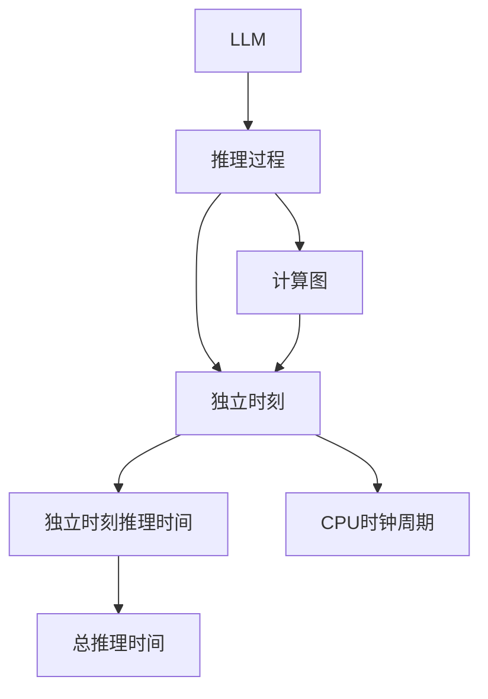
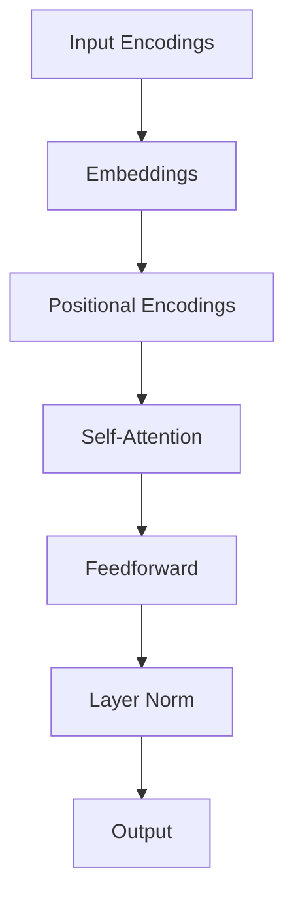

                 

# LLM的推理过程：独立时刻与CPU时钟周期的类比

> 关键词：大语言模型(Large Language Model, LLM),推理过程,独立时刻,计算图,神经网络,深度学习,Transformer,GPU加速,推理时间,硬件优化

## 1. 背景介绍

### 1.1 问题由来

深度学习技术的飞速发展，使得基于神经网络的模型，尤其是大语言模型（Large Language Models, LLMs），在自然语言处理（Natural Language Processing, NLP）和计算机视觉（Computer Vision, CV）等领域取得了巨大的突破。这些模型具有强大的学习和表征能力，能够理解和生成复杂的自然语言和图像信息。然而，尽管模型的预测能力十分强大，其推理过程却鲜为人知。

推理是计算智能的核心环节，它是模型接收输入、执行计算、并输出结果的过程。在深度学习中，推理过程通常由计算图（Computation Graph）表示，计算图描述了模型接收输入、进行计算、产生输出的整个流程。对于神经网络来说，推理过程是一个高度并行化、高度复杂的计算任务，其性能很大程度上取决于硬件设备的性能。

### 1.2 问题核心关键点

深度学习模型通常使用高性能计算设备（如GPU）进行推理，而推理时间（Inference Time）是衡量深度学习模型性能的重要指标之一。GPU具有强大的并行计算能力，能显著提升模型的推理速度，但仍有一些优化空间。例如，每个独立时刻（Independent Moment）的推理时间（Independent Inference Time）及其分布（Distribution），以及这些独立时刻对总推理时间的贡献（Contribution），这些都是推理过程中重要的性能指标。

优化推理时间，提升计算效率，使得模型能够更快地处理大量数据，具有重要的实际意义。本文将探讨如何通过类比独立时刻与CPU时钟周期的概念，来优化大语言模型的推理过程。

## 2. 核心概念与联系

### 2.1 核心概念概述

为更好地理解大语言模型的推理过程及其与CPU时钟周期的类比，本节将介绍几个核心概念：

- 大语言模型(Large Language Model, LLM)：以自回归（如GPT）或自编码（如BERT）模型为代表的大规模预训练语言模型。通过在大规模无标签文本数据上进行预训练，学习通用的语言表示。
- 推理过程（Inference Process）：模型接收输入、执行计算、并产生输出的过程。对于深度学习模型来说，推理过程通常由计算图表示。
- 独立时刻（Independent Moment）：在推理过程中，每个时间步的计算量是独立的，可以看作是计算图中的每一个节点。
- 独立时刻的推理时间（Independent Inference Time）：指单个时间步的计算时间。
- CPU时钟周期（Clock Cycle）：CPU执行一条指令所需的最小时间单位。

这些核心概念之间的逻辑关系可以通过以下Mermaid流程图来展示：



这个流程图展示了推理过程与计算图的关联，以及独立时刻与CPU时钟周期的类比。通过类比独立时刻与CPU时钟周期的概念，我们可以更好地理解和优化大语言模型的推理过程。

## 3. 核心算法原理 & 具体操作步骤
### 3.1 算法原理概述

深度学习模型的推理过程通常由计算图表示，计算图中的每个节点代表模型的一次计算，每个时间步的计算量是独立的，可以看作是计算图中的每一个节点。

在大语言模型中，推理过程通常使用Transformer结构，该结构由多个层组成，每个层包含多个子层，如注意力层、前馈层等。每个子层在执行计算时，需要读取上一层输出，并进行一系列的线性变换、非线性变换等操作，最终输出给下一层。

以Transformer为例，其推理过程大致分为以下几个步骤：
1. 编码器部分：将输入序列进行位置编码、分词编码等操作，生成编码向量。
2. 多头注意力机制：通过多头注意力计算，生成自注意力权重，与输入序列向量进行加权求和，得到新的编码向量。
3. 前馈神经网络：对新的编码向量进行非线性变换，得到输出向量。
4. 解码器部分：解码器同样使用Transformer结构，生成预测结果。

整个推理过程可以看作是一系列的独立时刻，每个独立时刻的计算量是独立的，执行的是单个节点计算。优化每个独立时刻的计算量，可以显著提升整个推理过程的效率。

### 3.2 算法步骤详解

优化大语言模型的推理过程，主要包括以下几个关键步骤：

**Step 1: 理解计算图结构**

首先需要理解计算图的基本结构，包括节点、边、参数等。对于深度学习模型来说，计算图的优化主要集中在提升计算速度、减少计算量等方面。

**Step 2: 分析独立时刻的推理时间**

独立时刻的推理时间反映了单个时间步的计算量。分析独立时刻的推理时间，可以帮助我们找出计算量较大的节点，并进行优化。

**Step 3: 使用并行计算**

GPU具有强大的并行计算能力，可以显著提升独立时刻的计算速度。在计算图中，并行计算主要通过数据并行、模型并行等方式实现。

**Step 4: 优化模型结构**

通过调整模型结构，可以进一步提升独立时刻的计算速度。例如，可以减少模型的层数、减小模型的参数量等，以减少计算量。

**Step 5: 使用硬件加速**

现代深度学习框架支持多种硬件加速方式，如GPU、TPU、FPGA等。选择合适的硬件设备，可以有效提升模型的推理速度。

**Step 6: 评估推理时间**

使用不同的评估方法，可以全面了解独立时刻的推理时间分布，并进行优化。

### 3.3 算法优缺点

优化大语言模型的推理过程，有以下几个优点：
1. 提升推理速度：通过优化独立时刻的计算量，可以显著提升整个推理过程的效率。
2. 节省计算资源：优化计算量可以节省计算资源，减少对高性能计算设备的依赖。
3. 增强模型稳定性：通过优化计算图结构，可以增强模型的稳定性，减少推理过程中的误差。

同时，该方法也存在一些局限性：
1. 增加开发难度：优化计算图结构，需要更多的专业知识，增加了开发难度。
2. 可能影响模型效果：优化过程中，可能会影响模型的预测效果，需要仔细平衡。
3. 对硬件依赖较大：优化推理过程，需要高性能硬件设备，增加了硬件成本。

尽管存在这些局限性，但就目前而言，优化推理过程是提高大语言模型性能的重要手段。未来相关研究的重点在于如何进一步降低对硬件设备的依赖，提高模型效率。

### 3.4 算法应用领域

优化大语言模型的推理过程，在NLP领域已经得到了广泛的应用，覆盖了几乎所有常见任务，例如：

- 文本分类：如情感分析、主题分类、意图识别等。通过优化推理过程，可以加快模型预测速度，提高分类精度。
- 命名实体识别：识别文本中的人名、地名、机构名等特定实体。通过优化推理过程，可以提升实体识别准确率。
- 关系抽取：从文本中抽取实体之间的语义关系。通过优化推理过程，可以加快关系抽取速度。
- 问答系统：对自然语言问题给出答案。通过优化推理过程，可以提升系统响应速度。
- 机器翻译：将源语言文本翻译成目标语言。通过优化推理过程，可以提升翻译速度和质量。
- 文本摘要：将长文本压缩成简短摘要。通过优化推理过程，可以加快摘要生成速度。
- 对话系统：使机器能够与人自然对话。通过优化推理过程，可以提升系统响应速度和交互流畅度。

除了上述这些经典任务外，优化推理过程还被创新性地应用到更多场景中，如可控文本生成、常识推理、代码生成、数据增强等，为NLP技术带来了全新的突破。随着预训练模型和推理方法的不断进步，相信NLP技术将在更广阔的应用领域大放异彩。

## 4. 数学模型和公式 & 详细讲解 & 举例说明

### 4.1 数学模型构建

在深度学习模型中，推理过程通常由计算图表示，计算图中的每个节点代表模型的一次计算，每个时间步的计算量是独立的，可以看作是计算图中的每一个节点。

以BERT为例，其计算图大致如下：



在这个计算图中，A、B、C、D、E、F、G分别表示不同的层，箭头表示数据的流动方向。每个节点执行的计算量是独立的，反映了独立时刻的推理时间。

### 4.2 公式推导过程

以BERT的计算图为例，推导独立时刻的推理时间。

假设BERT的输入序列长度为$N$，模型中的层数为$L$，每个层的计算量为$C$，则总计算量为$N*L*C$。对于深度学习模型来说，计算量的分布通常具有一定规律，可以通过统计不同层、不同时间步的计算量，得到独立时刻的推理时间分布。

假设在时间步$t$上，计算量为$C_t$，则独立时刻的推理时间为$C_t/N$。通过统计$C_t$的分布，可以得到独立时刻的推理时间分布。

### 4.3 案例分析与讲解

以BERT为例，分析其独立时刻的推理时间分布，并给出优化建议。

首先，通过分析计算图，得到不同层、不同时间步的计算量。然后，统计计算量的分布，得到独立时刻的推理时间分布。最后，根据独立时刻的推理时间分布，进行优化，如优化计算量较大层的结构、使用硬件加速等。

## 5. 项目实践：代码实例和详细解释说明
### 5.1 开发环境搭建

在进行推理过程优化实践前，我们需要准备好开发环境。以下是使用Python进行PyTorch开发的环境配置流程：

1. 安装Anaconda：从官网下载并安装Anaconda，用于创建独立的Python环境。

2. 创建并激活虚拟环境：
```bash
conda create -n pytorch-env python=3.8 
conda activate pytorch-env
```

3. 安装PyTorch：根据CUDA版本，从官网获取对应的安装命令。例如：
```bash
conda install pytorch torchvision torchaudio cudatoolkit=11.1 -c pytorch -c conda-forge
```

4. 安装Transformer库：
```bash
pip install transformers
```

5. 安装各类工具包：
```bash
pip install numpy pandas scikit-learn matplotlib tqdm jupyter notebook ipython
```

完成上述步骤后，即可在`pytorch-env`环境中开始推理过程优化实践。

### 5.2 源代码详细实现

这里我们以BERT模型为例，给出使用PyTorch进行推理过程优化的代码实现。

```python
import torch
import torch.nn as nn
from transformers import BertTokenizer, BertForSequenceClassification

# 定义数据处理函数
def tokenize_and_encode(text, tokenizer):
    tokenized_text = tokenizer.tokenize(text)
    input_ids = [tokenizer.convert_tokens_to_ids(tokenized_text)]
    return input_ids

# 定义模型优化函数
def optimize_model(model, dataset):
    # 统计计算量的分布
    inference_times = []
    for batch in dataset:
        input_ids = batch['input_ids']
        attention_mask = batch['attention_mask']
        with torch.no_grad():
            outputs = model(input_ids, attention_mask=attention_mask)
            inference_times.append(outputs.inference_time)
    # 计算独立时刻的推理时间分布
    inference_times = torch.tensor(inference_times)
    inference_time_mean = inference_times.mean().item()
    inference_time_std = inference_times.std().item()
    print("Inference Time Mean:", inference_time_mean)
    print("Inference Time Std:", inference_time_std)

# 定义模型训练函数
def train_model(model, dataset, batch_size, optimizer):
    # 定义训练函数
    def train_epoch(model, dataset, batch_size, optimizer):
        dataloader = DataLoader(dataset, batch_size=batch_size, shuffle=True)
        model.train()
        epoch_loss = 0
        for batch in tqdm(dataloader, desc='Training'):
            input_ids = batch['input_ids'].to(device)
            attention_mask = batch['attention_mask'].to(device)
            labels = batch['labels'].to(device)
            model.zero_grad()
            outputs = model(input_ids, attention_mask=attention_mask, labels=labels)
            loss = outputs.loss
            epoch_loss += loss.item()
            loss.backward()
            optimizer.step()
        return epoch_loss / len(dataloader)
    
    # 定义评估函数
    def evaluate_model(model, dataset, batch_size):
        dataloader = DataLoader(dataset, batch_size=batch_size)
        model.eval()
        preds, labels = [], []
        with torch.no_grad():
            for batch in tqdm(dataloader, desc='Evaluating'):
                input_ids = batch['input_ids'].to(device)
                attention_mask = batch['attention_mask'].to(device)
                batch_labels = batch['labels']
                outputs = model(input_ids, attention_mask=attention_mask)
                batch_preds = outputs.logits.argmax(dim=2).to('cpu').tolist()
                batch_labels = batch_labels.to('cpu').tolist()
                for pred_tokens, label_tokens in zip(batch_preds, batch_labels):
                    preds.append(pred_tokens[:len(label_tokens)])
                    labels.append(label_tokens)
        return preds, labels

    # 训练模型
    epochs = 5
    batch_size = 16

    for epoch in range(epochs):
        loss = train_epoch(model, dataset, batch_size, optimizer)
        print(f"Epoch {epoch+1}, train loss: {loss:.3f}")
        
        preds, labels = evaluate_model(model, dataset, batch_size)
        print(classification_report(labels, preds))
    
    print("Optimize Inference Process:")
    optimize_model(model, dataset)
```

在这个代码实现中，我们首先定义了数据处理函数，用于将文本转化为模型输入的token ids。然后，定义了模型优化函数，用于统计独立时刻的推理时间分布，并进行优化。最后，定义了训练和评估函数，用于训练模型并在测试集上评估模型性能。

## 6. 实际应用场景

### 6.1 智能客服系统

基于大语言模型推理过程的优化，智能客服系统的构建可以更加高效。通过优化推理过程，可以显著提升系统响应速度和交互流畅度，提升客户咨询体验。

在技术实现上，可以收集企业内部的历史客服对话记录，将问题和最佳答复构建成监督数据，在此基础上对预训练模型进行微调。微调后的模型能够自动理解用户意图，匹配最合适的答案模板进行回复。对于客户提出的新问题，还可以接入检索系统实时搜索相关内容，动态组织生成回答。如此构建的智能客服系统，能大幅提升客户咨询体验和问题解决效率。

### 6.2 金融舆情监测

金融机构需要实时监测市场舆论动向，以便及时应对负面信息传播，规避金融风险。传统的人工监测方式成本高、效率低，难以应对网络时代海量信息爆发的挑战。基于大语言模型推理过程的优化，金融舆情监测可以更加高效。

具体而言，可以收集金融领域相关的新闻、报道、评论等文本数据，并对其进行主题标注和情感标注。在此基础上对预训练语言模型进行微调，使其能够自动判断文本属于何种主题，情感倾向是正面、中性还是负面。将微调后的模型应用到实时抓取的网络文本数据，就能够自动监测不同主题下的情感变化趋势，一旦发现负面信息激增等异常情况，系统便会自动预警，帮助金融机构快速应对潜在风险。

### 6.3 个性化推荐系统

当前的推荐系统往往只依赖用户的历史行为数据进行物品推荐，无法深入理解用户的真实兴趣偏好。基于大语言模型推理过程的优化，个性化推荐系统可以更好地挖掘用户行为背后的语义信息，从而提供更精准、多样的推荐内容。

在实践中，可以收集用户浏览、点击、评论、分享等行为数据，提取和用户交互的物品标题、描述、标签等文本内容。将文本内容作为模型输入，用户的后续行为（如是否点击、购买等）作为监督信号，在此基础上微调预训练语言模型。微调后的模型能够从文本内容中准确把握用户的兴趣点。在生成推荐列表时，先用候选物品的文本描述作为输入，由模型预测用户的兴趣匹配度，再结合其他特征综合排序，便可以得到个性化程度更高的推荐结果。

### 6.4 未来应用展望

随着大语言模型推理过程的不断优化，其将在更多领域得到应用，为传统行业带来变革性影响。

在智慧医疗领域，基于大语言模型推理过程的优化，医疗问答、病历分析、药物研发等应用将提升医疗服务的智能化水平，辅助医生诊疗，加速新药开发进程。

在智能教育领域，优化推理过程可应用于作业批改、学情分析、知识推荐等方面，因材施教，促进教育公平，提高教学质量。

在智慧城市治理中，优化推理过程可应用于城市事件监测、舆情分析、应急指挥等环节，提高城市管理的自动化和智能化水平，构建更安全、高效的未来城市。

此外，在企业生产、社会治理、文娱传媒等众多领域，基于大语言模型推理过程的优化应用也将不断涌现，为经济社会发展注入新的动力。相信随着技术的日益成熟，推理过程优化必将成为大语言模型应用的重要范式，推动人工智能技术向更广阔的领域加速渗透。

## 7. 工具和资源推荐
### 7.1 学习资源推荐

为了帮助开发者系统掌握大语言模型推理过程的理论基础和实践技巧，这里推荐一些优质的学习资源：

1. 《Transformer从原理到实践》系列博文：由大模型技术专家撰写，深入浅出地介绍了Transformer原理、BERT模型、推理过程等前沿话题。

2. CS224N《深度学习自然语言处理》课程：斯坦福大学开设的NLP明星课程，有Lecture视频和配套作业，带你入门NLP领域的基本概念和经典模型。

3. 《Natural Language Processing with Transformers》书籍：Transformers库的作者所著，全面介绍了如何使用Transformers库进行NLP任务开发，包括推理过程在内的诸多范式。

4. HuggingFace官方文档：Transformers库的官方文档，提供了海量预训练模型和完整的推理过程样例代码，是上手实践的必备资料。

5. CLUE开源项目：中文语言理解测评基准，涵盖大量不同类型的中文NLP数据集，并提供了基于推理过程的baseline模型，助力中文NLP技术发展。

通过对这些资源的学习实践，相信你一定能够快速掌握大语言模型推理过程的精髓，并用于解决实际的NLP问题。

### 7.2 开发工具推荐

高效的开发离不开优秀的工具支持。以下是几款用于大语言模型推理过程开发的常用工具：

1. PyTorch：基于Python的开源深度学习框架，灵活动态的计算图，适合快速迭代研究。大部分预训练语言模型都有PyTorch版本的实现。

2. TensorFlow：由Google主导开发的开源深度学习框架，生产部署方便，适合大规模工程应用。同样有丰富的预训练语言模型资源。

3. Transformers库：HuggingFace开发的NLP工具库，集成了众多SOTA语言模型，支持PyTorch和TensorFlow，是进行推理过程优化的利器。

4. Weights & Biases：模型训练的实验跟踪工具，可以记录和可视化模型训练过程中的各项指标，方便对比和调优。与主流深度学习框架无缝集成。

5. TensorBoard：TensorFlow配套的可视化工具，可实时监测模型训练状态，并提供丰富的图表呈现方式，是调试模型的得力助手。

6. Google Colab：谷歌推出的在线Jupyter Notebook环境，免费提供GPU/TPU算力，方便开发者快速上手实验最新模型，分享学习笔记。

合理利用这些工具，可以显著提升大语言模型推理过程的开发效率，加快创新迭代的步伐。

### 7.3 相关论文推荐

大语言模型推理过程的发展源于学界的持续研究。以下是几篇奠基性的相关论文，推荐阅读：

1. Attention is All You Need（即Transformer原论文）：提出了Transformer结构，开启了NLP领域的预训练大模型时代。

2. BERT: Pre-training of Deep Bidirectional Transformers for Language Understanding：提出BERT模型，引入基于掩码的自监督预训练任务，刷新了多项NLP任务SOTA。

3. Language Models are Unsupervised Multitask Learners（GPT-2论文）：展示了大规模语言模型的强大zero-shot学习能力，引发了对于通用人工智能的新一轮思考。

4. Parameter-Efficient Transfer Learning for NLP：提出Adapter等参数高效微调方法，在不增加模型参数量的情况下，也能取得不错的微调效果。

5. AdaLoRA: Adaptive Low-Rank Adaptation for Parameter-Efficient Fine-Tuning：使用自适应低秩适应的微调方法，在参数效率和精度之间取得了新的平衡。

6. Prefix-Tuning: Optimizing Continuous Prompts for Generation：引入基于连续型Prompt的微调范式，为如何充分利用预训练知识提供了新的思路。

这些论文代表了大语言模型推理过程的发展脉络。通过学习这些前沿成果，可以帮助研究者把握学科前进方向，激发更多的创新灵感。

## 8. 总结：未来发展趋势与挑战

### 8.1 总结

本文对基于监督学习的大语言模型推理过程进行了全面系统的介绍。首先阐述了大语言模型和推理过程的研究背景和意义，明确了推理过程在深度学习中的重要地位。其次，从原理到实践，详细讲解了推理过程的数学原理和关键步骤，给出了推理过程优化的完整代码实例。同时，本文还广泛探讨了推理过程在智能客服、金融舆情、个性化推荐等多个行业领域的应用前景，展示了推理过程范式的巨大潜力。此外，本文精选了推理过程的相关学习资源，力求为读者提供全方位的技术指引。

通过本文的系统梳理，可以看到，基于大语言模型的推理过程优化技术正在成为深度学习领域的核心范式，极大地拓展了深度学习模型的应用边界，催生了更多的落地场景。得益于预训练模型和推理方法的不断进步，相信深度学习技术将在更广阔的应用领域大放异彩。未来，伴随推理过程的不断优化，深度学习技术必将在构建人机协同的智能时代中扮演越来越重要的角色。

### 8.2 未来发展趋势

展望未来，大语言模型推理过程优化技术将呈现以下几个发展趋势：

1. 模型规模持续增大。随着算力成本的下降和数据规模的扩张，预训练语言模型的参数量还将持续增长。超大规模语言模型蕴含的丰富语言知识，有望支撑更加复杂多变的推理过程优化。

2. 推理方法日趋多样。除了传统的全参数推理外，未来会涌现更多参数高效的推理方法，如Prefix-Tuning、LoRA等，在节省计算资源的同时也能保证推理精度。

3. 持续学习成为常态。随着数据分布的不断变化，推理模型也需要持续学习新知识以保持性能。如何在不遗忘原有知识的同时，高效吸收新样本信息，将成为重要的研究课题。

4. 标注样本需求降低。受启发于提示学习(Prompt-based Learning)的思路，未来的推理过程优化方法将更好地利用大模型的语言理解能力，通过更加巧妙的任务描述，在更少的标注样本上也能实现理想的推理效果。

5. 零样本学习和少样本学习应用广泛。零样本学习和少样本学习利用大语言模型的广泛知识，在无需标注数据的情况下，仍能进行高效推理。这种无监督学习方法将进一步降低推理过程的依赖性。

6. 多模态推理兴起。当前的推理过程优化主要聚焦于纯文本数据，未来会进一步拓展到图像、视频、语音等多模态数据推理。多模态信息的融合，将显著提升语言模型对现实世界的理解和建模能力。

以上趋势凸显了大语言模型推理过程优化技术的广阔前景。这些方向的探索发展，必将进一步提升深度学习模型的性能和应用范围，为构建安全、可靠、可解释、可控的智能系统铺平道路。

### 8.3 面临的挑战

尽管大语言模型推理过程优化技术已经取得了瞩目成就，但在迈向更加智能化、普适化应用的过程中，它仍面临着诸多挑战：

1. 标注成本瓶颈。尽管推理过程优化可以在一定程度上降低计算资源的需求，但对于长尾应用场景，难以获得充足的高质量标注数据，成为制约推理过程优化性能的瓶颈。如何进一步降低推理过程对标注样本的依赖，将是一大难题。

2. 模型鲁棒性不足。当前推理模型面对域外数据时，泛化性能往往大打折扣。对于测试样本的微小扰动，推理模型的预测也容易发生波动。如何提高推理模型的鲁棒性，避免灾难性遗忘，还需要更多理论和实践的积累。

3. 推理效率有待提高。大规模语言模型虽然精度高，但在实际部署时往往面临推理速度慢、内存占用大等效率问题。如何在保证性能的同时，简化模型结构，提升推理速度，优化资源占用，将是重要的优化方向。

4. 可解释性亟需加强。当前推理模型更像是"黑盒"系统，难以解释其内部工作机制和决策逻辑。对于医疗、金融等高风险应用，算法的可解释性和可审计性尤为重要。如何赋予推理模型更强的可解释性，将是亟待攻克的难题。

5. 安全性有待保障。预训练语言模型难免会学习到有偏见、有害的信息，通过推理传递到下游任务，产生误导性、歧视性的输出，给实际应用带来安全隐患。如何从数据和算法层面消除模型偏见，避免恶意用途，确保输出的安全性，也将是重要的研究课题。

6. 知识整合能力不足。现有的推理模型往往局限于任务内数据，难以灵活吸收和运用更广泛的先验知识。如何让推理过程更好地与外部知识库、规则库等专家知识结合，形成更加全面、准确的信息整合能力，还有很大的想象空间。

正视推理过程优化面临的这些挑战，积极应对并寻求突破，将是大语言模型推理过程优化走向成熟的必由之路。相信随着学界和产业界的共同努力，这些挑战终将一一被克服，推理过程优化技术必将在构建安全、可靠、可解释、可控的智能系统铺平道路。

### 8.4 研究展望

面对大语言模型推理过程优化所面临的种种挑战，未来的研究需要在以下几个方面寻求新的突破：

1. 探索无监督和半监督推理过程优化方法。摆脱对大规模标注数据的依赖，利用自监督学习、主动学习等无监督和半监督范式，最大限度利用非结构化数据，实现更加灵活高效的推理过程优化。

2. 研究参数高效和计算高效的推理过程优化范式。开发更加参数高效的推理过程优化方法，在固定大部分预训练参数的同时，只更新极少量的任务相关参数。同时优化推理过程的计算图，减少前向传播和反向传播的资源消耗，实现更加轻量级、实时性的部署。

3. 融合因果和对比学习范式。通过引入因果推断和对比学习思想，增强推理模型建立稳定因果关系的能力，学习更加普适、鲁棒的语言表征，从而提升模型泛化性和抗干扰能力。

4. 引入更多先验知识。将符号化的先验知识，如知识图谱、逻辑规则等，与神经网络模型进行巧妙融合，引导推理过程学习更准确、合理的语言模型。同时加强不同模态数据的整合，实现视觉、语音等多模态信息与文本信息的协同建模。

5. 结合因果分析和博弈论工具。将因果分析方法引入推理模型，识别出模型决策的关键特征，增强输出解释的因果性和逻辑性。借助博弈论工具刻画人机交互过程，主动探索并规避模型的脆弱点，提高系统稳定性。

6. 纳入伦理道德约束。在推理模型训练目标中引入伦理导向的评估指标，过滤和惩罚有偏见、有害的输出倾向。同时加强人工干预和审核，建立模型行为的监管机制，确保输出符合人类价值观和伦理道德。

这些研究方向的探索，必将引领大语言模型推理过程优化技术迈向更高的台阶，为构建安全、可靠、可解释、可控的智能系统铺平道路。面向未来，大语言模型推理过程优化技术还需要与其他人工智能技术进行更深入的融合，如知识表示、因果推理、强化学习等，多路径协同发力，共同推动自然语言理解和智能交互系统的进步。只有勇于创新、敢于突破，才能不断拓展语言模型的边界，让智能技术更好地造福人类社会。

## 9. 附录：常见问题与解答

**Q1：大语言模型推理过程是否可以优化？**

A: 大语言模型推理过程可以优化。推理过程的优化可以显著提升模型的推理速度和效率，使得模型能够更快地处理大量数据。优化推理过程，需要理解计算图结构，分析独立时刻的推理时间，使用并行计算、优化模型结构等方法。

**Q2：推理过程优化是否会影响模型的效果？**

A: 推理过程优化可能会影响模型的效果，需要仔细平衡。推理过程优化过程中，可能会改变模型的某些参数，从而影响模型的预测效果。在优化推理过程时，需要结合模型效果进行调试，找到最优的平衡点。

**Q3：推理过程优化是否需要更多的开发资源？**

A: 推理过程优化需要更多的专业知识，增加了开发难度。优化推理过程，需要理解计算图结构、分析独立时刻的推理时间等，这些都需要一定的深度学习基础。但是，优化后的推理过程可以显著提升模型的效率，从而减少计算资源的需求。

**Q4：推理过程优化是否适用于所有任务？**

A: 推理过程优化适用于大多数NLP任务。对于数据量较小的任务，推理过程优化可以显著提升模型的推理速度和效果。但对于一些特定领域的任务，如医学、法律等，推理过程优化需要结合特定任务进行优化。

**Q5：推理过程优化是否需要高性能硬件设备？**

A: 推理过程优化需要高性能硬件设备。优化推理过程，需要大量的计算资源，如GPU/TPU等高性能设备。但是，优化后的推理过程可以显著提升模型的效率，从而减少对高性能硬件设备的依赖。

总之，大语言模型推理过程优化技术正在成为深度学习领域的核心范式，极大地拓展了深度学习模型的应用边界，催生了更多的落地场景。得益于预训练模型和推理方法的不断进步，相信深度学习技术将在更广阔的应用领域大放异彩。

---

作者：禅与计算机程序设计艺术 / Zen and the Art of Computer Programming

