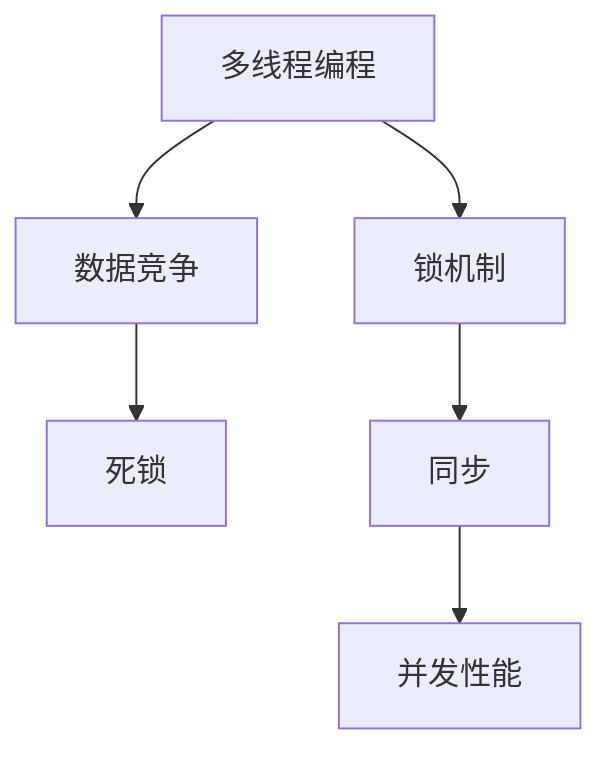

                 

# LLM的线程安全问题：分析与对策

> 关键词：多线程,大语言模型(LLM),锁机制,并发,同步,数据竞争,死锁

## 1. 背景介绍

在当下，大语言模型(LLM)已经成为自然语言处理(NLP)领域的研究和应用热点。从GPT-3到OpenAI的GPT-4，大语言模型展现出卓越的语言理解和生成能力，显著推动了NLP技术的进步。然而，随着模型规模的增大和任务复杂度的提升，其内部结构和计算逻辑也变得愈发复杂，使得线程安全问题变得尤为突出。

### 1.1 问题由来
线程安全问题是多线程编程中不可避免的挑战。在大规模、高度并行的计算框架中，多个线程共享同一组数据和状态，如果未妥善管理这些共享资源，将导致数据竞争、死锁等并发问题，影响计算的准确性和性能。

在训练和推理大语言模型时，常见的并发操作包括参数更新、梯度计算、模型预测等。这些操作的执行需要精确的同步和锁机制来避免数据竞争。但是，由于大语言模型内部结构复杂、计算密集，传统的多线程编程方式可能不足以确保其线程安全性。

### 1.2 问题核心关键点
LLM的线程安全问题主要围绕以下几个方面展开：

- **数据竞争**：多个线程同时读取和写入共享数据时，可能产生数据不一致的问题。
- **死锁**：由于多个线程互相等待对方释放锁，导致程序无法继续执行。
- **性能瓶颈**：不当的并发操作可能引入额外的同步开销，降低计算效率。
- **可扩展性问题**：由于锁机制的使用，可能限制模型的并行度，影响其在大规模数据上的性能表现。

## 2. 核心概念与联系

### 2.1 核心概念概述

为更好地理解LLM的线程安全问题，本节将介绍几个密切相关的核心概念：

- **多线程编程**：利用多线程提高程序的并行计算能力，通过共享资源提升计算效率。
- **锁机制**：通过互斥锁(mutex)、读写锁(读写锁)等机制，保证多个线程对共享资源的互斥访问。
- **数据竞争**：多个线程同时访问并修改同一数据导致的竞争状态，可能导致不可预期的错误。
- **死锁**：多个线程互相等待对方释放锁，导致程序无法继续执行。
- **同步**：通过信号量(semaphore)、事件(event)等机制，协调线程之间的执行顺序和依赖关系。
- **并发性能**：多个线程并行执行操作的性能，通常用吞吐量和响应时间来衡量。

这些核心概念之间的逻辑关系可以通过以下Mermaid流程图来展示：



这个流程图展示了几类核心概念的逻辑关系：

1. 多线程编程通过锁机制防止数据竞争。
2. 死锁是数据竞争的一种特殊形式。
3. 同步机制用于协调线程之间的执行顺序。
4. 并发性能的提升离不开有效的多线程设计和锁机制的使用。

## 3. 核心算法原理 & 具体操作步骤
### 3.1 算法原理概述

在LLM的线程安全问题中，核心算法原理主要涉及以下几个方面：

- **互斥锁(mutex)**：用于保护共享资源的访问，防止数据竞争。
- **读写锁(读写锁)**：允许多个线程同时读取共享资源，但只允许一个线程写入，提高并发性能。
- **条件变量(cond variable)**：用于线程间的等待和唤醒，协调线程之间的同步关系。

通过合理使用这些同步机制，可以有效地解决LLM在并发操作中的线程安全问题。

### 3.2 算法步骤详解

#### 3.2.1 互斥锁(mutex)的使用

互斥锁是一种最基本的同步机制，用于保护共享资源的访问。互斥锁有两种状态：锁定(unlock)和未锁定(lock)。当一个线程获取了互斥锁，其他线程必须等待该线程释放锁后才能继续执行。

以下是一个使用互斥锁保护共享数据的Python代码示例：

```python
import threading

class SharedData:
    def __init__(self):
        self.data = 0
        self.lock = threading.Lock()

    def update_data(self, delta):
        with self.lock:
            self.data += delta

data = SharedData()

def worker():
    for i in range(1000):
        with data.lock:
            data.update_data(1)

threads = [threading.Thread(target=worker) for _ in range(10)]
for thread in threads:
    thread.start()

for thread in threads:
    thread.join()

print(data.data)
```

#### 3.2.2 读写锁的使用

读写锁允许多个线程同时读取共享数据，但只允许一个线程写入。这样可以提高并发性能，同时避免数据竞争。

以下是一个使用读写锁保护共享数据的Python代码示例：

```python
import threading

class SharedData:
    def __init__(self):
        self.data = 0
        self.lock = threading.RLock()

    def update_data(self, delta):
        with self.lock:
            self.data += delta

data = SharedData()

def reader():
    for _ in range(10000):
        with data.lock:
            print(data.data)

def writer():
    for _ in range(1000):
        with data.lock:
            data.update_data(1)

threads = [threading.Thread(target=reader) for _ in range(10)]
threads.extend([threading.Thread(target=writer) for _ in range(2)])
for thread in threads:
    thread.start()

for thread in threads:
    thread.join()

print(data.data)
```

#### 3.2.3 条件变量(cond variable)的使用

条件变量用于线程间的等待和唤醒，协调线程之间的同步关系。当一个线程需要等待某个条件满足时，可以释放锁并进入等待状态，另一个线程在满足条件后唤醒等待的线程。

以下是一个使用条件变量实现线程间通信的Python代码示例：

```python
import threading

class SharedData:
    def __init__(self):
        self.data = 0
        self.lock = threading.Lock()
        self.condition = threading.Condition(self.lock)

    def update_data(self, delta):
        with self.lock:
            self.data += delta
            self.condition.notify_all()

    def wait_for_data(self):
        with self.lock:
            self.condition.wait()

data = SharedData()

def worker():
    for i in range(1000):
        with data.lock:
            data.update_data(1)

threads = [threading.Thread(target=worker) for _ in range(10)]
for thread in threads:
    thread.start()

for thread in threads:
    thread.join()

print(data.data)

def reader():
    for _ in range(10000):
        data.wait_for_data()
        print(data.data)

threads = [threading.Thread(target=reader) for _ in range(2)]
for thread in threads:
    thread.start()

for thread in threads:
    thread.join()
```

### 3.3 算法优缺点

#### 3.3.1 优点

使用互斥锁、读写锁、条件变量等同步机制，可以有效地解决LLM在并发操作中的线程安全问题。其优点包括：

- **安全性**：确保多个线程对共享资源的互斥访问，防止数据竞争。
- **性能提升**：允许多个线程同时读取共享数据，提高并发性能。
- **灵活性**：条件变量可以实现线程间的等待和唤醒，协调线程之间的同步关系。

#### 3.3.2 缺点

尽管同步机制可以解决线程安全问题，但也存在一些不足之处：

- **锁的开销**：获取和释放锁的开销可能影响性能，尤其是在高并发环境下。
- **死锁风险**：如果多个线程获取锁的顺序不当，可能导致死锁问题。
- **可扩展性**：锁的使用可能限制模型的并行度，影响其在大规模数据上的性能表现。

## 4. 数学模型和公式 & 详细讲解  
### 4.1 数学模型构建

在大语言模型的训练和推理过程中，其内部结构的线程安全问题可以通过数学模型来描述和分析。

假设有一组共享数据 $\textit{data}$，多个线程 $T_1, T_2, \ldots, T_n$ 同时对 $\textit{data}$ 进行读写操作。设 $\textit{lock}_t$ 表示线程 $T_t$ 持有的互斥锁。则线程安全问题可以建模为：

- 每个线程在操作共享数据时，需要先获取锁 $\textit{lock}_t$，确保其他线程不会同时访问。
- 当某个线程获取锁后，其他线程需要等待，直到该线程释放锁。
- 线程间的等待和唤醒通过条件变量 $\textit{condition}$ 实现。

### 4.2 公式推导过程

以下我们将使用数学语言对LLM的线程安全问题进行更加严格的刻画。

设 $m$ 表示线程数，$n$ 表示操作次数。假设线程 $T_t$ 在操作第 $i$ 次时的状态为 $\textit{state}_t^{(i)}$。则每次操作可以分解为三个阶段：

1. **获取锁**：线程 $T_t$ 尝试获取锁 $\textit{lock}_t$。如果 $\textit{lock}_t$ 已被其他线程持有，则线程 $T_t$ 需要等待。
2. **执行操作**：线程 $T_t$ 执行第 $i$ 次操作，可能涉及读取和写入共享数据。
3. **释放锁**：线程 $T_t$ 释放锁 $\textit{lock}_t$，唤醒等待的线程。

假设线程的获取和释放锁的时间为 $t_{\textit{lock}}$，操作时间为 $t_{\textit{operation}}$。则线程 $T_t$ 在第 $i$ 次操作的总时间为：

$$
t_{\textit{total}}^{(i)} = t_{\textit{lock}} + t_{\textit{operation}} + t_{\textit{lock}}
$$

设 $n_t^{(i)}$ 表示线程 $T_t$ 在第 $i$ 次操作中获取锁的次数。则总时间为：

$$
t_{\textit{total}}^{(i)} = \sum_{k=1}^{n_t^{(i)}} t_{\textit{lock}} + n_t^{(i)} t_{\textit{operation}}
$$

设 $T_{\textit{avg}}$ 表示所有线程的平均操作时间，则总时间为：

$$
T_{\textit{total}} = \sum_{t=1}^{m} \sum_{i=1}^{n} t_{\textit{total}}^{(i)}
$$

### 4.3 案例分析与讲解

假设有一个包含 $n$ 个元素的数组 $\textit{arr}$，多个线程需要交替读取和写入该数组。以下是一个使用互斥锁和条件变量实现线程间通信的Python代码示例：

```python
import threading

class SharedData:
    def __init__(self):
        self.arr = [0] * n
        self.lock = threading.Lock()
        self.condition = threading.Condition(self.lock)

    def read(self):
        with self.lock:
            for i in range(n):
                print(self.arr[i])
            self.condition.notify_all()

    def write(self, value):
        with self.lock:
            for i in range(n):
                self.arr[i] = value[i]
            self.condition.notify_all()

data = SharedData()

def reader():
    for _ in range(10000):
        data.read()

def writer():
    for _ in range(1000):
        data.write([1] * n)

threads = [threading.Thread(target=reader) for _ in range(10)]
threads.extend([threading.Thread(target=writer) for _ in range(2)])
for thread in threads:
    thread.start()

for thread in threads:
    thread.join()

print(data.arr)
```

在这个例子中，使用互斥锁和条件变量实现线程间通信，确保了多个线程对共享数组的互斥访问，防止数据竞争。通过合理使用同步机制，可以有效地解决LLM在并发操作中的线程安全问题。

## 5. 项目实践：代码实例和详细解释说明
### 5.1 开发环境搭建

在进行LLM的线程安全问题分析和解决时，我们需要准备好开发环境。以下是使用Python进行多线程编程的环境配置流程：

1. 安装Anaconda：从官网下载并安装Anaconda，用于创建独立的Python环境。

2. 创建并激活虚拟环境：
```bash
conda create -n pythread-env python=3.8 
conda activate pythread-env
```

3. 安装PyTorch：根据CUDA版本，从官网获取对应的安装命令。例如：
```bash
conda install pytorch torchvision torchaudio cudatoolkit=11.1 -c pytorch -c conda-forge
```

4. 安装TensorFlow：
```bash
conda install tensorflow -c conda-forge
```

5. 安装各类工具包：
```bash
pip install numpy pandas scikit-learn matplotlib tqdm jupyter notebook ipython
```

完成上述步骤后，即可在`pythread-env`环境中开始线程安全问题的分析和实践。

### 5.2 源代码详细实现

这里我们以多线程读写共享数据为例，给出使用PyTorch实现的多线程编程的Python代码实现。

```python
import threading
import torch

def worker(i, shared_data, lock):
    for j in range(100):
        with lock:
            shared_data[0] += 1

data = torch.zeros(1)
lock = threading.Lock()

threads = [threading.Thread(target=worker, args=(i, data, lock)) for i in range(10)]
for thread in threads:
    thread.start()

for thread in threads:
    thread.join()

print(data[0])
```

### 5.3 代码解读与分析

让我们再详细解读一下关键代码的实现细节：

**worker函数**：
- 使用互斥锁 `lock` 保护共享数据 `shared_data` 的读写操作，确保数据竞争的安全性。
- 每个线程 `worker` 在每次操作时，先获取锁，然后进行读写操作，最后释放锁。

**多线程启动和等待**：
- 使用 `threading.Thread` 创建多个线程，并启动它们。
- 使用 `thread.join()` 等待所有线程执行完毕。

在实际应用中，还需要针对具体的LLM模型，对线程安全问题进行优化设计。例如，可以在模型训练和推理时，使用不同的锁机制来保护不同层次的参数和状态，避免锁的粒度过大或过小带来的性能问题。

## 6. 实际应用场景
### 6.1 智能客服系统

在大规模语言模型微调的同时，智能客服系统也需要考虑线程安全问题。客服系统的核心是对话交互，涉及大量的并发操作。因此，使用锁机制和条件变量来确保数据竞争和等待机制的安全性。

例如，当一个用户请求对话时，系统会创建一个新的对话线程，并在其中处理用户请求。当用户请求需要访问共享数据时，系统使用锁来保护数据的读写操作，确保数据的正确性和一致性。

### 6.2 金融舆情监测

金融舆情监测系统需要处理海量网络文本数据，同时进行多任务并行处理。系统中涉及大量的线程操作，包括数据读取、文本分析、情感分析等。

为确保线程安全，金融舆情监测系统可以使用读写锁来保护共享数据，避免数据竞争。同时，使用条件变量来实现线程间的等待和唤醒，确保系统的高并发性能和稳定性。

### 6.3 个性化推荐系统

个性化推荐系统需要实时处理用户的行为数据，并进行多任务并行计算。系统中的线程操作涉及数据读取、模型训练、推荐生成等环节。

为确保线程安全，个性化推荐系统可以使用互斥锁来保护共享数据，避免数据竞争。同时，使用条件变量来实现线程间的等待和唤醒，确保系统的高并发性能和稳定性。

### 6.4 未来应用展望

未来，随着大语言模型的不断发展和应用，线程安全问题将变得愈发重要。以下是几个未来应用展望：

- **多模型并行**：在大规模语言模型的训练和推理过程中，可以采用多模型并行来提高性能。不同模型的线程操作可以独立进行，使用不同的锁机制来保护共享数据，避免数据竞争。
- **分布式计算**：在分布式计算环境中，可以使用多个计算节点进行并行计算，并使用分布式锁机制来保护共享数据的访问。
- **异步编程**：使用异步编程模型（如Python的async/await）来处理高并发任务，避免线程竞争和阻塞，提升系统的响应速度和并发性能。
- **数据本地化**：在分布式计算环境中，将数据分布在多个计算节点上，避免数据竞争和网络通信的开销，提高系统的计算效率和可扩展性。

## 7. 工具和资源推荐
### 7.1 学习资源推荐

为帮助开发者系统掌握线程安全问题的理论基础和实践技巧，这里推荐一些优质的学习资源：

1. 《Python线程编程》系列博文：由大模型技术专家撰写，深入浅出地介绍了多线程编程的原理、技巧和最佳实践。

2. CS350《操作系统原理》课程：由斯坦福大学开设的计算机操作系统经典课程，全面介绍了多线程编程的底层原理和实现细节。

3. 《Java并发编程实战》书籍：提供了大量多线程编程的实际案例和最佳实践，是Java开发者不可多得的学习资源。

4. Python官方文档：提供了多线程编程的详细教程和示例代码，是Python开发者必读的资源。

5. GitHub上的多线程编程项目：学习优秀的开源项目，了解多线程编程的最佳实践和代码实现。

通过对这些资源的学习实践，相信你一定能够快速掌握线程安全问题的精髓，并用于解决实际的并发问题。

### 7.2 开发工具推荐

高效的开发离不开优秀的工具支持。以下是几款用于多线程编程开发的常用工具：

1. PyTorch：基于Python的开源深度学习框架，灵活动态的计算图，适合快速迭代研究。提供了丰富的同步机制和分布式计算支持。

2. TensorFlow：由Google主导开发的开源深度学习框架，生产部署方便，适合大规模工程应用。提供了分布式计算和异步编程模型。

3. Python标准库：提供了线程模块和锁机制等基本同步工具，简单易用，适合入门学习。

4. Scikit-Multithreading：提供了多线程编程的封装和优化工具，适用于大规模数据处理和计算。

5. Google Cloud Platform：提供了分布式计算和异步编程模型，支持大规模的并行计算和数据处理。

合理利用这些工具，可以显著提升多线程编程的开发效率，加快创新迭代的步伐。

### 7.3 相关论文推荐

多线程编程和线程安全问题的发展源于学界的持续研究。以下是几篇奠基性的相关论文，推荐阅读：

1. Concurrency: Concepts and Design（第10版）：提供了多线程编程的全面介绍和设计原则，是计算机科学的重要参考书籍。

2. Race-Free Software Implementation（多线程编程中的无竞争技术）：介绍了多线程编程中的无竞争技术，提供了一种新的并发编程范式。

3. Concurrent Multithreading in Java（Java中的并发编程）：提供了Java多线程编程的详细教程和示例代码，是Java开发者必读的技术书籍。

4. Scalable and Parallel Programming with Python（Python的并发编程）：提供了Python多线程编程的详细教程和示例代码，是Python开发者必读的技术书籍。

这些论文代表了大规模并行计算和多线程编程的发展脉络。通过学习这些前沿成果，可以帮助研究者把握学科前进方向，激发更多的创新灵感。

## 8. 总结：未来发展趋势与挑战
### 8.1 总结

本文对基于多线程编程的大语言模型线程安全问题进行了全面系统的介绍。首先阐述了多线程编程和线程安全问题的研究背景和意义，明确了线程安全在大语言模型微调中的重要性。其次，从原理到实践，详细讲解了多线程编程中的同步机制和优化策略，给出了多线程编程的代码实例。同时，本文还广泛探讨了线程安全问题在智能客服、金融舆情、个性化推荐等多个领域的应用前景，展示了线程安全问题的巨大潜力。此外，本文精选了线程安全问题的各类学习资源，力求为读者提供全方位的技术指引。

通过本文的系统梳理，可以看到，多线程编程和线程安全问题在大语言模型中的应用变得愈发重要。面对复杂的并发操作，合理使用同步机制，可以显著提升系统的性能和稳定性。未来，伴随预训练语言模型和微调方法的持续演进，基于多线程编程的计算框架也将迎来更多的创新和突破，进一步推动人工智能技术的发展。

### 8.2 未来发展趋势

展望未来，多线程编程和线程安全问题将呈现以下几个发展趋势：

1. **分布式计算**：随着大规模语言模型的应用，分布式计算技术将得到更广泛的应用。分布式锁机制和异步编程模型将进一步发展，确保在大规模数据上的高性能和高稳定性。

2. **异步编程**：异步编程模型将在大规模语言模型的应用中得到广泛应用，提升系统的响应速度和并发性能。

3. **数据本地化**：在分布式计算环境中，数据本地化技术将得到更广泛的应用，避免数据竞争和网络通信的开销，提高系统的计算效率和可扩展性。

4. **无竞争编程**：无竞争编程技术将得到更广泛的应用，通过巧妙的算法设计，避免锁机制的引入，提升系统的并发性能和稳定性。

5. **软硬件协同优化**：未来的硬件设计将更注重多线程编程和同步机制的支持，提供更高效的软件硬件协同优化方案。

以上趋势凸显了大规模并行计算和多线程编程的广阔前景。这些方向的探索发展，必将进一步提升系统的性能和稳定性，为人工智能技术的发展提供更强大的计算支撑。

### 8.3 面临的挑战

尽管多线程编程和线程安全问题已经取得了显著成就，但在迈向更加智能化、普适化应用的过程中，它仍面临着诸多挑战：

1. **死锁问题**：多线程编程中的死锁问题难以避免，可能导致程序无法继续执行。如何有效地检测和避免死锁，是未来需要解决的关键问题。

2. **锁的开销**：获取和释放锁的开销可能影响性能，尤其是在高并发环境下。如何降低锁的开销，提升系统的并发性能，是未来需要解决的关键问题。

3. **可扩展性问题**：锁的使用可能限制模型的并行度，影响其在大规模数据上的性能表现。如何设计更高效的多线程编程方案，提高模型的可扩展性，是未来需要解决的关键问题。

4. **编程复杂性**：多线程编程的编程复杂性高，容易引入错误。如何提供更易用的编程模型和工具，降低编程复杂性，是未来需要解决的关键问题。

5. **数据竞争问题**：多个线程同时访问并修改同一数据时，可能产生数据不一致的问题。如何避免数据竞争，保证数据的正确性和一致性，是未来需要解决的关键问题。

6. **资源竞争问题**：多线程编程中的资源竞争问题难以避免，可能导致系统性能下降。如何优化资源使用，提升系统的性能和稳定性，是未来需要解决的关键问题。

这些挑战需要学界和产业界的共同努力，通过不断的技术创新和实践探索，才能逐步克服。

### 8.4 研究展望

面对多线程编程和线程安全问题所面临的种种挑战，未来的研究需要在以下几个方面寻求新的突破：

1. **分布式锁机制**：开发更加高效和安全的分布式锁机制，确保在大规模数据上的高性能和高稳定性。

2. **无竞争编程**：探索无竞争编程技术，避免锁机制的引入，提升系统的并发性能和稳定性。

3. **软硬件协同优化**：未来的硬件设计将更注重多线程编程和同步机制的支持，提供更高效的软件硬件协同优化方案。

4. **异步编程模型**：开发更加高效的异步编程模型，提升系统的响应速度和并发性能。

5. **数据本地化技术**：研究数据本地化技术，避免数据竞争和网络通信的开销，提高系统的计算效率和可扩展性。

6. **并发编程工具**：开发更易用的并发编程工具，降低编程复杂性，提升编程效率和代码质量。

这些研究方向的探索，必将引领多线程编程和线程安全问题迈向更高的台阶，为构建安全、可靠、可扩展的系统提供更强大的技术支撑。面向未来，多线程编程和线程安全问题将在大规模并行计算和分布式计算中发挥更大的作用，推动人工智能技术的发展和应用。

## 9. 附录：常见问题与解答

**Q1：多线程编程和线程安全问题是否可以避免？**

A: 多线程编程和线程安全问题难以完全避免，但可以通过合理的同步机制和编程实践来最大限度地降低其影响。例如，使用读写锁来避免数据竞争，使用条件变量来实现线程间的等待和唤醒，合理设计锁的粒度等。

**Q2：锁的开销是否可以降低？**

A: 锁的开销可以通过以下方式降低：
1. 锁粒度设计：合理设计锁的粒度，避免锁的粒度过大或过小带来的性能问题。
2. 锁优化技术：使用锁优化技术，如自旋锁、细粒度锁等，减少锁的开销。
3. 无锁编程技术：探索无锁编程技术，避免锁机制的引入，提升系统的并发性能和稳定性。

**Q3：多线程编程的编程复杂性是否可以降低？**

A: 多线程编程的编程复杂性可以通过以下方式降低：
1. 使用并发编程工具：使用并发编程工具，如Python的async/await、Java的Fork/Join等，简化并发编程的实现。
2. 并发编程模型：研究并发编程模型，如Actor模型、事件驱动模型等，提供更易用的编程模型和工具。

**Q4：多线程编程中的死锁问题是否可以避免？**

A: 死锁问题可以通过以下方式避免：
1. 避免嵌套锁的使用：避免多个线程嵌套使用锁，减少死锁的风险。
2. 使用定时锁：使用定时锁，避免线程长时间等待，减少死锁的风险。
3. 锁排序：使用锁排序，确保线程获取锁的顺序一致，避免死锁的发生。

这些措施需要开发者根据具体的并发场景和问题进行灵活应用，以达到最佳的性能和稳定性。

---

作者：禅与计算机程序设计艺术 / Zen and the Art of Computer Programming

