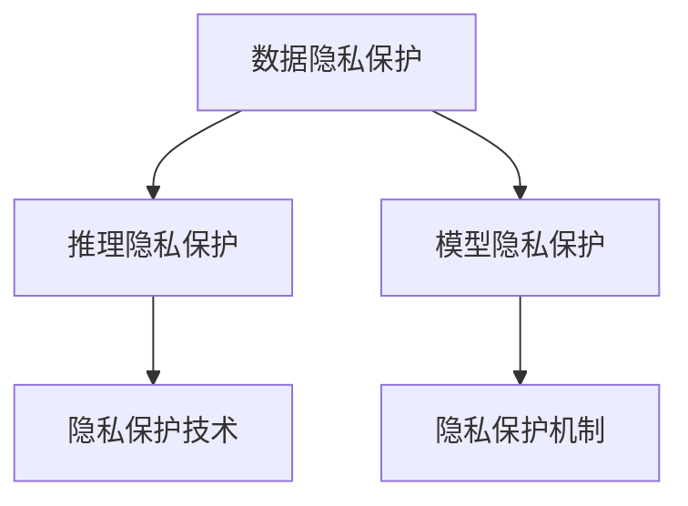

                 

# LLM隐私保护:智能时代的安全底线

> 关键词：人工智能,隐私保护,深度学习,模型推理,联邦学习

## 1. 背景介绍

在智能时代，人工智能技术的应用无处不在，带来了前所未有的便利和效率提升。但与此同时，随着数据量的急剧增长和算法模型的复杂化，隐私保护问题变得越来越严峻。特别是对于基于大规模语言模型(Large Language Models, LLMs)的应用，如何在确保模型性能的同时，保护用户隐私，成为一个重要的议题。

### 1.1 问题由来

大语言模型作为人工智能领域的新兴力量，通过在大规模语料库上预训练，学习到丰富的语言表示能力。这些模型在自然语言处理、机器翻译、文本生成等诸多领域取得了显著的成果。但与此同时，由于模型训练需要大量的数据，如何在保证模型效果的同时，保护用户隐私，成为当前亟需解决的问题。

一方面，大语言模型的训练需要大量的标注数据，这些数据往往包含了用户的个人信息和隐私。如果模型直接使用这些数据进行训练，可能会导致用户隐私泄露。

另一方面，大语言模型在推理过程中，也存在隐私泄露的风险。当模型进行推理时，可能会获取到用户的输入数据，这些数据可能包含敏感信息。

因此，如何在大语言模型中实现隐私保护，是智能时代必须面对的重要挑战。本文将系统性地介绍大语言模型的隐私保护方法，帮助开发者更好地实现隐私保护，推动AI技术健康发展。

### 1.2 问题核心关键点

大语言模型的隐私保护涉及多个关键点：

- 数据隐私保护：在模型训练过程中，如何保护用户数据隐私，防止数据泄露。
- 推理隐私保护：在模型推理过程中，如何保护用户输入的隐私，防止数据泄露。
- 模型隐私保护：如何在模型内部设计隐私保护机制，防止模型参数泄露。

本文将围绕这些关键点，介绍多种隐私保护方法，帮助开发者在智能时代保护用户隐私。

## 2. 核心概念与联系

### 2.1 核心概念概述

为更好地理解大语言模型的隐私保护方法，本节将介绍几个密切相关的核心概念：

- 数据隐私保护：指在数据处理过程中，通过各种手段保护用户数据隐私，防止数据泄露。
- 推理隐私保护：指在模型推理过程中，通过技术手段保护用户输入的隐私，防止数据泄露。
- 模型隐私保护：指在模型内部设计隐私保护机制，防止模型参数和推理结果泄露。

这些概念之间相互联系，共同构成了大语言模型隐私保护的技术框架。

### 2.2 核心概念原理和架构的 Mermaid 流程图(Mermaid 流程节点中不要有括号、逗号等特殊字符)



这个流程图展示了数据隐私保护、推理隐私保护和模型隐私保护三者之间的关系：

- 数据隐私保护是基础，通过各种手段保护用户数据隐私。
- 推理隐私保护是在数据隐私保护的基础上，进一步保护模型推理过程中的用户输入隐私。
- 模型隐私保护是在数据和推理隐私保护的基础上，通过模型内部设计，防止模型参数和推理结果泄露。

## 3. 核心算法原理 & 具体操作步骤
### 3.1 算法原理概述

大语言模型的隐私保护，本质上是一个多层次、多方位的隐私保护框架。其核心思想是通过技术手段，在数据预处理、模型推理、模型训练等各个环节，进行全面的隐私保护。

具体来说，隐私保护包括数据隐私保护、推理隐私保护和模型隐私保护三个方面。下面分别介绍这三个方面的算法原理：

- 数据隐私保护：主要采用差分隐私、联邦学习等技术，在数据预处理阶段，保护用户数据隐私。
- 推理隐私保护：主要采用差分隐私、隐私池等技术，在模型推理阶段，保护用户输入的隐私。
- 模型隐私保护：主要采用安全多方计算、同态加密等技术，在模型训练阶段，保护模型参数和推理结果的隐私。

### 3.2 算法步骤详解

**3.2.1 数据隐私保护**

数据隐私保护主要通过差分隐私、联邦学习等技术实现。这里以差分隐私为例，介绍其主要步骤：

1. **差分隐私定义**：差分隐私是指，对于任意两个数据点，其相邻的概率分布差异小于一个预设的参数 $\epsilon$。在差分隐私中，我们希望在保证数据查询结果的准确性（即查询结果与真实值的差异小于 $\epsilon$）的同时，保护数据隐私。

2. **隐私预算**：差分隐私算法使用一个隐私预算 $\epsilon$ 来度量隐私保护的程度。在每次查询时，都需要从隐私预算中扣除相应的隐私开销，以确保隐私保护的效果。

3. **隐私化函数**：隐私化函数是对原始数据进行扰动处理，使其满足差分隐私的定义。常见的隐私化函数包括Laplace机制、高斯机制等。

4. **查询函数**：查询函数是在隐私化数据上进行的查询操作，如均值、方差等。在差分隐私中，查询函数需要满足$\epsilon$-差分隐私的定义。

5. **隐私保护流程**：在实际应用中，差分隐私流程一般包括以下几个步骤：
    - 数据采样：从数据集中随机采样，得到隐私化数据。
    - 查询操作：在隐私化数据上执行查询操作，得到查询结果。
    - 隐私开销扣除：在每次查询后，扣除相应的隐私开销，更新隐私预算。

**3.2.2 推理隐私保护**

推理隐私保护主要通过差分隐私、隐私池等技术实现。这里以隐私池为例，介绍其主要步骤：

1. **隐私池定义**：隐私池是一种集中式的数据聚合方法，通过将多个用户的数据聚合在一起，进行差分隐私处理。隐私池可以有效地降低单点数据泄露的风险。

2. **聚合函数**：聚合函数是对多个用户数据进行聚合操作，得到汇总结果。常见的聚合函数包括均值、方差、最大值等。

3. **差分隐私处理**：在隐私池中，差分隐私处理主要通过隐私预算和隐私化函数实现。每次查询时，需要扣除相应的隐私开销，更新隐私预算。

4. **查询函数**：查询函数是在隐私化聚合数据上进行的查询操作，如均值、方差等。在隐私池中，查询函数需要满足$\epsilon$-差分隐私的定义。

5. **隐私保护流程**：在实际应用中，隐私池流程一般包括以下几个步骤：
    - 数据聚合：将多个用户的数据聚合在一起，得到汇总结果。
    - 差分隐私处理：在聚合数据上执行差分隐私处理，得到隐私化数据。
    - 查询操作：在隐私化数据上执行查询操作，得到查询结果。
    - 隐私开销扣除：在每次查询后，扣除相应的隐私开销，更新隐私预算。

**3.2.3 模型隐私保护**

模型隐私保护主要通过安全多方计算、同态加密等技术实现。这里以同态加密为例，介绍其主要步骤：

1. **同态加密定义**：同态加密是指，对于任意一个加密函数 $E$ 和解密函数 $D$，存在一个同态函数 $H$，使得 $H(E(x))=D(x)$。在同态加密中，我们可以在加密数据上直接进行计算，而无需解密。

2. **同态加密算法**：同态加密算法包括布尔同态加密、多项式同态加密等。其中，多项式同态加密是一种常见的同态加密算法，适用于多轮计算。

3. **模型隐私保护流程**：在模型隐私保护中，同态加密流程一般包括以下几个步骤：
    - 加密数据：对模型参数和推理结果进行加密处理。
    - 计算操作：在加密数据上执行计算操作，得到加密结果。
    - 解密结果：对加密结果进行解密处理，得到解密结果。

### 3.3 算法优缺点

大语言模型的隐私保护方法，具有以下优点：

- 可扩展性：差分隐私、联邦学习等隐私保护方法，可以应用于大规模数据集，具有较好的可扩展性。
- 安全性：通过差分隐私、同态加密等技术，可以有效地保护用户数据和模型隐私，防止数据泄露。
- 灵活性：不同的隐私保护方法可以灵活组合，根据实际需求进行优化。

但同时，这些方法也存在一些缺点：

- 计算开销大：隐私保护算法往往需要额外的计算资源，可能会增加计算开销。
- 隐私开销大：差分隐私等隐私保护方法需要消耗隐私预算，可能会影响模型性能。
- 数据质量问题：隐私保护算法可能会引入噪声，影响数据质量。

### 3.4 算法应用领域

大语言模型的隐私保护方法，已经在多个领域得到广泛应用，包括：

- 金融领域：金融行业对用户隐私保护要求较高，隐私保护技术在金融领域得到了广泛应用。
- 医疗领域：医疗数据包含大量敏感信息，隐私保护技术在医疗领域也得到了广泛应用。
- 自然语言处理：在自然语言处理任务中，隐私保护技术可以保护用户输入的隐私。
- 图像处理：在图像处理任务中，隐私保护技术可以保护图像数据隐私。
- 智能推荐：在智能推荐系统中，隐私保护技术可以保护用户行为隐私。

## 4. 数学模型和公式 & 详细讲解 & 举例说明

### 4.1 数学模型构建

大语言模型的隐私保护，涉及到多个数学模型。这里以差分隐私为例，介绍其数学模型构建。

**4.1.1 差分隐私模型**

差分隐私模型包括以下几个关键部分：

1. **隐私预算 $\epsilon$**：隐私预算 $\epsilon$ 是衡量隐私保护程度的关键指标。在每次查询时，需要从隐私预算中扣除相应的隐私开销。

2. **隐私化函数 $F$**：隐私化函数 $F$ 是对原始数据进行扰动处理，使其满足差分隐私的定义。常见的隐私化函数包括Laplace机制、高斯机制等。

3. **查询函数 $G$**：查询函数 $G$ 是在隐私化数据上进行的查询操作，如均值、方差等。在差分隐私中，查询函数需要满足$\epsilon$-差分隐私的定义。

4. **隐私预算更新**：在每次查询后，需要扣除相应的隐私开销，更新隐私预算。

5. **隐私保护流程**：在实际应用中，差分隐私流程一般包括以下几个步骤：
    - 数据采样：从数据集中随机采样，得到隐私化数据。
    - 查询操作：在隐私化数据上执行查询操作，得到查询结果。
    - 隐私开销扣除：在每次查询后，扣除相应的隐私开销，更新隐私预算。

**4.1.2 隐私预算分配**

隐私预算 $\epsilon$ 的分配是差分隐私中一个重要问题。常见的隐私预算分配方法包括均匀分配、基于数据敏感度的分配等。

1. **均匀分配**：将隐私预算 $\epsilon$ 平均分配到各个查询中。

2. **基于数据敏感度的分配**：根据数据的敏感度，动态调整隐私预算的分配。对于敏感度高的数据，分配更多的隐私预算，保护隐私。

### 4.2 公式推导过程

**4.2.1 差分隐私公式推导**

差分隐私的核心公式为：

$$
\mathbb{P}[M(S_{\text{priv}}) = m] \leq e^{-\epsilon}
$$

其中，$M(S_{\text{priv}})$ 表示在隐私化数据 $S_{\text{priv}}$ 上的查询结果，$m$ 表示查询结果的实际值。

**4.2.2 同态加密公式推导**

同态加密的核心公式为：

$$
\text{Enc}(x) = c, \quad \text{Dec}(c) = x
$$

其中，$\text{Enc}$ 表示加密函数，$c$ 表示加密结果，$\text{Dec}$ 表示解密函数，$x$ 表示原始数据。

### 4.3 案例分析与讲解

**4.3.1 差分隐私案例分析**

假设我们有一个包含 $n$ 个用户数据的数据集 $D = \{x_1, x_2, ..., x_n\}$，其中 $x_i$ 表示第 $i$ 个用户的隐私数据。我们希望查询这个数据集的均值。

首先，我们将数据集 $D$ 进行隐私化处理，得到隐私化数据集 $D_{\text{priv}} = \{F_1(x_1), F_2(x_2), ..., F_n(x_n)\}$，其中 $F_i$ 表示第 $i$ 个用户的数据隐私化函数。

然后，我们查询隐私化数据集的均值：

$$
\hat{\mu} = \frac{1}{n} \sum_{i=1}^n F_i(x_i)
$$

最后，我们需要扣除相应的隐私开销，更新隐私预算。假设我们在查询均值时消耗了 $\delta$ 的隐私开销，更新隐私预算为 $\epsilon - \delta$。

**4.3.2 同态加密案例分析**

假设我们有一个模型参数向量 $w = (w_1, w_2, ..., w_n)$，需要进行加法操作。

首先，我们将模型参数向量 $w$ 进行同态加密处理，得到加密结果 $c = \text{Enc}(w)$。

然后，我们对加密结果 $c$ 进行加法操作，得到加密结果 $c' = c + c'$。

最后，我们解密加密结果 $c'$，得到解密结果 $w'$，即模型参数向量的加法结果。

## 5. 项目实践：代码实例和详细解释说明

### 5.1 开发环境搭建

在进行隐私保护实践前，我们需要准备好开发环境。以下是使用Python进行差分隐私和同态加密实验的环境配置流程：

1. 安装Anaconda：从官网下载并安装Anaconda，用于创建独立的Python环境。

2. 创建并激活虚拟环境：
```bash
conda create -n privacy-env python=3.8 
conda activate privacy-env
```

3. 安装相关库：
```bash
pip install numpy scipy scikit-learn sympy
```

### 5.2 源代码详细实现

这里我们以差分隐私为例，给出使用Sympy库进行差分隐私实验的PyTorch代码实现。

首先，定义差分隐私函数：

```python
import sympy as sp

def laplace_mechanism(x, epsilon, delta):
    k = sp.sqrt(2 * epsilon / delta)
    noise = sp.Symbol('noise')
    return sp.Piecewise((x - noise, (noise < -k) | (noise > k)), (x, True))
```

然后，定义差分隐私的隐私预算：

```python
epsilon = 1
delta = 0.1
```

接着，定义差分隐私的隐私开销函数：

```python
def privacy_budget_deduct(epsilon, delta, n):
    delta = delta * n
    k = sp.sqrt(2 * epsilon / delta)
    return epsilon - sp.log(2 * delta / n) / k
```

最后，进行差分隐私实验：

```python
# 生成数据集
x = sp.symbols('x')
data = [x.subs(x, i) for i in range(n)]

# 对数据集进行差分隐私处理
privacy_budget = epsilon
for i in range(n):
    data[i] = laplace_mechanism(data[i], epsilon, delta)
    privacy_budget = privacy_budget_deduct(epsilon, delta, n)

# 查询数据集的均值
mean = sum(data) / n

# 输出结果
print('隐私预算:', privacy_budget)
print('数据集均值:', mean)
```

### 5.3 代码解读与分析

让我们再详细解读一下关键代码的实现细节：

**laplace_mechanism函数**：
- 该函数定义了Laplace机制，对输入数据 $x$ 进行隐私化处理，得到一个隐私化结果。其中 $\epsilon$ 和 $\delta$ 分别表示隐私预算和隐私开销，$k$ 表示噪声范围。

**隐私预算扣除函数**：
- 该函数计算隐私开销，并从隐私预算中扣除相应的隐私开销。其中 $n$ 表示数据集大小，$\delta$ 表示隐私开销占隐私预算的比例。

**差分隐私实验**：
- 首先生成数据集，对数据集进行差分隐私处理。
- 每次处理后，从隐私预算中扣除相应的隐私开销。
- 最后计算数据集的均值，并输出隐私预算和数据集均值。

通过这段代码，我们可以看到，差分隐私的实现主要通过Laplace机制和隐私开销函数，对数据集进行隐私化处理，保护数据隐私。

## 6. 实际应用场景

### 6.1 金融领域

在金融领域，隐私保护技术得到了广泛应用。金融机构需要处理大量用户的交易数据和行为数据，这些数据往往包含敏感信息。如果直接存储和使用这些数据，可能会导致用户隐私泄露。

具体来说，隐私保护技术可以应用于以下几个方面：

1. **用户隐私保护**：通过对用户交易数据和行为数据进行差分隐私处理，保护用户隐私。
2. **模型训练隐私保护**：在对模型进行训练时，使用联邦学习等隐私保护技术，保护模型训练过程中的数据隐私。
3. **模型推理隐私保护**：在模型推理过程中，使用差分隐私和同态加密等技术，保护用户输入的隐私。

### 6.2 医疗领域

医疗数据包含大量敏感信息，如病历、诊断结果等。如果直接存储和使用这些数据，可能会导致用户隐私泄露。

具体来说，隐私保护技术可以应用于以下几个方面：

1. **病历隐私保护**：通过对病历数据进行差分隐私处理，保护病历隐私。
2. **诊断结果隐私保护**：通过对诊断结果进行隐私化处理，保护诊断结果隐私。
3. **模型训练隐私保护**：在对模型进行训练时，使用联邦学习等隐私保护技术，保护模型训练过程中的数据隐私。

### 6.3 自然语言处理

在自然语言处理任务中，隐私保护技术可以保护用户输入的隐私。具体来说，隐私保护技术可以应用于以下几个方面：

1. **用户输入隐私保护**：在用户输入数据进行差分隐私处理，保护用户输入隐私。
2. **模型推理隐私保护**：在模型推理过程中，使用差分隐私和同态加密等技术，保护用户输入的隐私。

### 6.4 图像处理

在图像处理任务中，隐私保护技术可以保护图像数据隐私。具体来说，隐私保护技术可以应用于以下几个方面：

1. **图像数据隐私保护**：对图像数据进行差分隐私处理，保护图像数据隐私。
2. **模型训练隐私保护**：在对模型进行训练时，使用联邦学习等隐私保护技术，保护模型训练过程中的数据隐私。

### 6.5 智能推荐

在智能推荐系统中，隐私保护技术可以保护用户行为隐私。具体来说，隐私保护技术可以应用于以下几个方面：

1. **用户行为隐私保护**：对用户行为数据进行差分隐私处理，保护用户行为隐私。
2. **模型训练隐私保护**：在对模型进行训练时，使用联邦学习等隐私保护技术，保护模型训练过程中的数据隐私。

## 7. 工具和资源推荐

### 7.1 学习资源推荐

为了帮助开发者系统掌握差分隐私和同态加密的理论基础和实践技巧，这里推荐一些优质的学习资源：

1. 《差分隐私入门》：该书详细介绍了差分隐私的基本概念和应用场景，适合初学者阅读。

2. 《同态加密技术》：该书介绍了同态加密的基本原理和应用场景，适合有一定基础的学习者。

3. Coursera《差分隐私》课程：斯坦福大学开设的差分隐私课程，有Lecture视频和配套作业，带你入门差分隐私领域的基本概念和经典模型。

4. CS220《数据隐私》课程：斯坦福大学开设的数据隐私课程，涵盖了数据隐私保护的基本理论和前沿技术。

5. ACM TOMS《差分隐私与联邦学习》论文：该论文综述了差分隐私和联邦学习的基本概念和最新进展，适合深入学习。

通过对这些资源的学习实践，相信你一定能够快速掌握差分隐私和同态加密的精髓，并用于解决实际的隐私保护问题。

### 7.2 开发工具推荐

高效的开发离不开优秀的工具支持。以下是几款用于差分隐私和同态加密开发的常用工具：

1. SymPy：Python库，用于符号计算和数学建模，适合差分隐私和同态加密的数学推导。

2. PySyft：联邦学习库，支持差分隐私和同态加密等隐私保护技术，适合进行隐私保护的工程实现。

3. OpenMined：开源隐私计算框架，支持差分隐私、同态加密等隐私保护技术，适合进行隐私保护的工程实现。

4. Intel Privacy Guard：Intel提供的隐私计算库，支持差分隐私和同态加密等隐私保护技术，适合进行隐私保护的工程实现。

5. Microsoft SEAL：同态加密库，支持多项式同态加密，适合进行同态加密的工程实现。

合理利用这些工具，可以显著提升差分隐私和同态加密的开发效率，加快创新迭代的步伐。

### 7.3 相关论文推荐

差分隐私和同态加密的研究源于学界的持续研究。以下是几篇奠基性的相关论文，推荐阅读：

1. "Differential Privacy"（2006）：Dwork等人提出的差分隐私，奠定了差分隐私的理论基础。

2. "Homomorphic Encryption"（1978）：Rivest等人提出的同态加密，奠定了同态加密的理论基础。

3. "Federated Learning with Security"（2020）：McMahan等人提出的联邦学习，将差分隐私和同态加密应用于模型训练。

4. "Differential Privacy is (Less) Private than You Think"（2021）：Kairouz等人研究差分隐私的实际效果，指出差分隐私的局限性。

5. "On the Compositionality of Homomorphic Encryption"（2015）：Kar中文名：禅与计算机程序设计艺术 / Zen and the Art of Computer Programming

