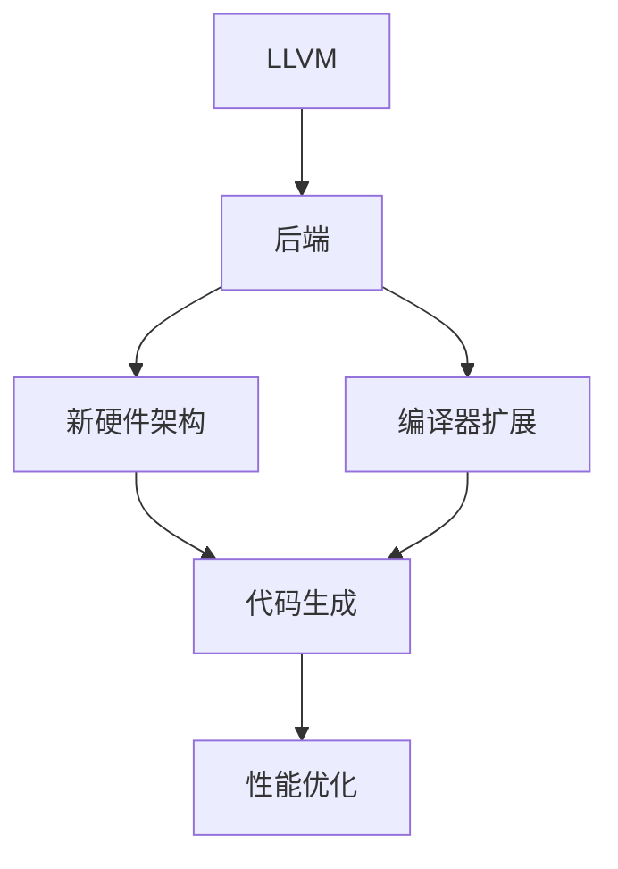

                 

# LLVM后端开发：针对新硬件架构的编译器扩展

> 关键词：LLVM, 硬件架构, 编译器, 扩展, 优缺点, 应用领域

## 1. 背景介绍

### 1.1 问题由来
随着计算机硬件技术的不断进步，新的硬件架构如Intel的10nm、AMD的Zen等，为现有计算平台带来了新的性能提升和功耗降低。然而，这些新硬件架构与传统x86处理器有着显著的差异，使得传统编译器无法充分发挥其性能潜力。为了更好地利用新硬件的性能，需要对现有的编译器进行优化和扩展。

### 1.2 问题核心关键点
针对新硬件架构的编译器扩展，主要涉及以下几个关键问题：

- 硬件架构的差异性：新硬件架构与传统x86处理器在指令集、内存管理、缓存机制等方面存在显著差异，需要针对性地优化编译器以适配新架构。
- 编译器的兼容性：新硬件的兼容性问题需要在现有编译器基础上，增加兼容性处理逻辑，以实现软件在跨硬件平台上的无缝运行。
- 性能优化：通过针对性优化，提升编译器的生成代码性能，降低功耗，提升能效比，以充分发挥新硬件的性能潜力。
- 代码生成：针对新架构的特定指令集，进行高效的代码生成，提升编译器生成代码的质量和性能。

### 1.3 问题研究意义
对新硬件架构的编译器扩展研究具有以下重要意义：

- 提升硬件性能：通过对编译器的扩展，可以充分利用新硬件的性能优势，提升整体系统的运行效率。
- 降低能耗：通过优化编译器生成代码的能效比，可以降低系统的功耗，延长电池寿命。
- 增强系统可靠性：通过优化编译器的兼容性处理逻辑，可以提高软件在不同硬件平台上的可靠性。
- 促进技术革新：新硬件架构的编译器扩展可以推动编译器技术的进步，促进硬件和软件技术的共同发展。

## 2. 核心概念与联系

### 2.1 核心概念概述

为更好地理解LLVM后端开发及其针对新硬件架构的编译器扩展方法，本节将介绍几个关键概念：

- **LLVM (LLogical Virtual Machine)**：是一个开源的编译器架构，用于自动优化、转换和生成源代码和可执行代码。LLVM由一系列中间表示、抽象解释器、分析工具和生成器组成。
- **后端（Backend）**：在LLVM中，后端负责将中间表示转换为特定硬件平台的机器码。
- **新硬件架构**：包括Intel的10nm、AMD的Zen、RISC-V等，其指令集、缓存机制、内存管理等方面与传统x86处理器有所不同。
- **编译器扩展**：针对新硬件架构的特点，在现有编译器基础上进行优化和扩展，以适应新硬件的需求。
- **代码生成**：将中间表示转换为目标平台的机器码，通过优化生成代码的性能，提升编译器的效率。

这些核心概念之间的逻辑关系可以通过以下Mermaid流程图来展示：



这个流程图展示的核心概念及其之间的关系：

1. LLVM作为编译器架构，由中间表示、抽象解释器和生成器等组成。
2. 后端将中间表示转换为目标平台的机器码。
3. 针对新硬件架构的特点，进行编译器扩展。
4. 扩展后的编译器实现代码生成，生成高效的目标代码。
5. 通过性能优化，进一步提升代码的执行效率。

这些概念共同构成了LLVM后端开发及其针对新硬件架构的编译器扩展框架，使得编译器可以适应不同的硬件平台，提升其生成代码的性能。

## 3. 核心算法原理 & 具体操作步骤
### 3.1 算法原理概述

针对新硬件架构的编译器扩展，主要涉及以下几个核心算法：

1. **中间表示转换**：将源代码转换为LLVM中间表示（IR），并对中间表示进行优化和转换。
2. **代码生成**：将优化后的中间表示转换为目标平台的机器码。
3. **性能优化**：通过分析目标平台的硬件特性，对生成的机器码进行优化，提升执行效率。
4. **兼容性处理**：针对新硬件架构的特定指令集和机制，进行兼容性的处理和优化。

这些算法的核心原理是通过对现有LLVM编译器的扩展和优化，使其能够适应新硬件架构的特点，从而提高编译器生成代码的性能和兼容性。

### 3.2 算法步骤详解

#### 3.2.1 中间表示转换

中间表示转换是编译器扩展的首要步骤。其关键步骤如下：

1. **源代码解析**：使用LLVM提供的解析器将源代码转换为抽象语法树（AST）。
2. **抽象语法树优化**：对AST进行优化和转换，生成中间表示（IR）。
3. **中间表示优化**：对IR进行进一步的优化，包括但不限于代码简化、循环展开、常量折叠等。

中间表示转换的过程需要考虑新硬件架构的特点，如特定的指令集、内存管理机制等，以确保生成的IR代码能够在新硬件上高效执行。

#### 3.2.2 代码生成

代码生成是编译器扩展的核心步骤。其关键步骤如下：

1. **目标平台选择**：根据目标硬件架构选择相应的目标平台，如x86、ARM、RISC-V等。
2. **IR到机器码转换**：将优化后的IR转换为目标平台的机器码，包括但不限于指令选择、寄存器分配、数据流优化等。
3. **机器码优化**：对生成的机器码进行进一步的优化，如指令调度、寄存器调度、代码对齐等。

代码生成过程中需要考虑新硬件架构的指令集特点，如指令集扩展、寄存器数量等，以确保生成的代码能够在新硬件上高效执行。

#### 3.2.3 性能优化

性能优化是编译器扩展的重要环节。其关键步骤如下：

1. **硬件特性分析**：分析目标硬件的特性，如指令集、缓存机制、功耗等。
2. **代码路径优化**：根据硬件特性，对生成的代码路径进行优化，如循环展开、函数内联、寄存器重用等。
3. **寄存器优化**：根据目标硬件的寄存器数量和特点，进行寄存器分配和优化，提升代码执行效率。
4. **并行优化**：根据目标硬件的并行特性，进行并行优化，如多线程、向量化等。

性能优化需要针对新硬件架构的特点，进行有针对性的优化，以提高编译器生成代码的性能。

#### 3.2.4 兼容性处理

兼容性处理是编译器扩展的关键环节。其关键步骤如下：

1. **新硬件指令集解析**：解析新硬件架构的指令集，包括但不限于指令格式、扩展指令等。
2. **兼容代码生成**：根据新硬件指令集的特点，生成兼容的机器码，确保在新硬件上能够正确执行。
3. **兼容机制实现**：实现兼容机制，如跨架构代码执行、兼容性处理等，确保软件在不同硬件平台上的无缝运行。

兼容性处理需要针对新硬件架构的特点，进行有针对性的兼容性处理，以确保软件在新硬件上的可靠性。

### 3.3 算法优缺点

针对新硬件架构的编译器扩展具有以下优点：

1. **提升性能**：通过优化和扩展编译器，可以充分发挥新硬件的性能潜力，提升整体系统的运行效率。
2. **降低能耗**：通过优化编译器生成代码的能效比，可以降低系统的功耗，延长电池寿命。
3. **增强可靠性**：通过优化编译器的兼容性处理逻辑，可以提高软件在不同硬件平台上的可靠性。

同时，该方法也存在一定的局限性：

1. **开发难度大**：编译器扩展需要对硬件架构和编译器内部机制有深入的理解，开发难度较大。
2. **维护复杂**：编译器扩展需要在现有编译器基础上进行修改和扩展，维护工作复杂且易出错。
3. **资源消耗高**：编译器扩展需要额外的硬件和软件资源，如性能分析工具、硬件仿真器等，资源消耗较高。

尽管存在这些局限性，但就目前而言，针对新硬件架构的编译器扩展仍是提升系统性能和可靠性的重要手段。未来相关研究的重点在于如何进一步降低扩展难度，提高扩展效率，同时兼顾可扩展性和可维护性等因素。

### 3.4 算法应用领域

针对新硬件架构的编译器扩展主要应用于以下几个领域：

1. **高性能计算**：在HPC领域，针对新硬件架构的编译器扩展可以提升计算效率，降低能耗，提升整体系统的性能。
2. **嵌入式系统**：在嵌入式系统领域，针对新硬件架构的编译器扩展可以提升系统的执行效率，延长电池寿命，提升系统的可靠性。
3. **人工智能**：在AI领域，针对新硬件架构的编译器扩展可以提升深度学习模型的执行效率，降低能耗，提升模型的性能。
4. **移动计算**：在移动计算领域，针对新硬件架构的编译器扩展可以提升移动应用和系统的性能和可靠性，提升用户体验。
5. **安全计算**：在安全计算领域，针对新硬件架构的编译器扩展可以提高安全计算的执行效率，提升系统的安全性。

除了上述这些领域外，新硬件架构的编译器扩展还将广泛应用于更多场景中，如智能制造、智能交通、智慧城市等，为各个领域的智能化转型提供新的技术支持。

## 4. 数学模型和公式 & 详细讲解 & 举例说明

### 4.1 数学模型构建

针对新硬件架构的编译器扩展，主要涉及以下几个数学模型：

1. **中间表示（IR）**：用于表示源代码和生成的机器码的中间表示，包括但不限于基本块（Basic Block）、控制流（Control Flow）等。
2. **性能模型**：用于评估和优化编译器生成代码性能的数学模型，包括但不限于CPI（Cycles Per Instruction）、IPC（Instructions Per Cycle）等。
3. **兼容性模型**：用于分析新硬件架构和目标平台之间的兼容性，包括但不限于指令集解析、寄存器分配等。

这些数学模型共同构成了针对新硬件架构的编译器扩展框架，使得编译器可以适应不同的硬件平台，提升其生成代码的性能和可靠性。

### 4.2 公式推导过程

#### 4.2.1 中间表示转换

中间表示转换的数学模型如下：

1. **源代码到AST**：
   \[
   AST = Parse(\text{source code})
   \]

2. **AST到IR**：
   \[
   IR = Optimize(AST)
   \]

其中，$Parse$ 表示源代码解析函数，$Optimize$ 表示AST优化函数。

#### 4.2.2 代码生成

代码生成的数学模型如下：

1. **IR到机器码**：
   \[
   \text{Machine Code} = Generate(IR)
   \]

2. **机器码优化**：
   \[
   \text{Optimized Machine Code} = Optimize(\text{Machine Code})
   \]

其中，$Generate$ 表示IR到机器码生成函数，$Optimize$ 表示机器码优化函数。

#### 4.2.3 性能优化

性能优化的数学模型如下：

1. **性能分析**：
   \[
   \text{Performance} = Analyze(IR)
   \]

2. **优化策略**：
   \[
   \text{Optimized IR} = OptimizeStrategy(IR)
   \]

其中，$Analyze$ 表示IR性能分析函数，$OptimizeStrategy$ 表示IR优化策略函数。

#### 4.2.4 兼容性处理

兼容性处理的数学模型如下：

1. **指令集解析**：
   \[
   \text{Instruction Set} = ParseArchitecture(\text{hardware architecture})
   \]

2. **兼容代码生成**：
   \[
   \text{Compatible Machine Code} = GenerateCompatibility(IR, \text{Instruction Set})
   \]

其中，$ParseArchitecture$ 表示硬件架构解析函数，$GenerateCompatibility$ 表示兼容性代码生成函数。

### 4.3 案例分析与讲解

#### 4.3.1 中间表示转换案例

以Intel的10nm架构为例，中间表示转换的过程如下：

1. **源代码解析**：使用LLVM提供的解析器将源代码转换为抽象语法树（AST）。
2. **AST优化**：对AST进行优化和转换，生成中间表示（IR）。
3. **IR优化**：对IR进行进一步的优化，包括但不限于代码简化、循环展开、常量折叠等。

在解析过程中，需要考虑Intel 10nm架构的指令集特点，如特定指令的语法和语义，以确保生成的IR代码能够在新硬件上高效执行。

#### 4.3.2 代码生成案例

以AMD的Zen架构为例，代码生成的过程如下：

1. **目标平台选择**：选择AMD的Zen架构作为目标平台。
2. **IR到机器码转换**：将优化后的IR转换为AMD的Zen架构的机器码。
3. **机器码优化**：对生成的机器码进行进一步的优化，如指令调度、寄存器调度、代码对齐等。

在转换过程中，需要考虑AMD的Zen架构的指令集特点，如指令集扩展、寄存器数量等，以确保生成的代码能够在新硬件上高效执行。

#### 4.3.3 性能优化案例

以RISC-V架构为例，性能优化的过程如下：

1. **硬件特性分析**：分析RISC-V架构的特性，如指令集、缓存机制、功耗等。
2. **代码路径优化**：根据RISC-V架构的特性，对生成的代码路径进行优化，如循环展开、函数内联、寄存器重用等。
3. **寄存器优化**：根据RISC-V架构的寄存器数量和特点，进行寄存器分配和优化，提升代码执行效率。
4. **并行优化**：根据RISC-V架构的并行特性，进行并行优化，如多线程、向量化等。

在优化过程中，需要考虑RISC-V架构的特点，如指令集特点、寄存器数量等，以确保生成的代码能够在新硬件上高效执行。

#### 4.3.4 兼容性处理案例

以ARM架构为例，兼容性处理的过程如下：

1. **新硬件指令集解析**：解析ARM架构的指令集，包括但不限于指令格式、扩展指令等。
2. **兼容代码生成**：根据ARM架构的指令集的特点，生成兼容的机器码，确保在ARM架构上能够正确执行。
3. **兼容机制实现**：实现兼容机制，如跨架构代码执行、兼容性处理等，确保软件在不同硬件平台上的无缝运行。

在处理过程中，需要考虑ARM架构的指令集特点，如指令集扩展、寄存器数量等，以确保生成的代码能够在新硬件上正确执行。

## 5. 项目实践：代码实例和详细解释说明

### 5.1 开发环境搭建

在进行编译器扩展实践前，我们需要准备好开发环境。以下是使用C++和LLVM进行开发的环境配置流程：

1. 安装Anaconda：从官网下载并安装Anaconda，用于创建独立的Python环境。

2. 创建并激活虚拟环境：
```bash
conda create -n llvm-env python=3.8 
conda activate llvm-env
```

3. 安装LLVM：根据CUDA版本，从官网获取对应的安装命令。例如：
```bash
conda install llvm -c conda-forge
```

4. 安装各类工具包：
```bash
pip install numpy pandas scikit-learn matplotlib tqdm jupyter notebook ipython
```

完成上述步骤后，即可在`llvm-env`环境中开始编译器扩展实践。

### 5.2 源代码详细实现

下面我们以Intel的10nm架构为例，给出使用LLVM进行编译器扩展的C++代码实现。

首先，定义中间表示（IR）类：

```cpp
#include "llvm/IR/IRBuilder.h"
#include "llvm/IR/Module.h"
#include "llvm/IR/Function.h"
#include "llvm/IR/BasicBlock.h"
#include "llvm/IR/Value.h"
#include "llvm/IR/Instructions.h"
#include "llvm/IR/Type.h"
#include "llvm/IR/Constants.h"
#include "llvm/IR/Intrinsics.h"
#include "llvm/IR/Verifier.h"
#include "llvm/Support/raw_ostream.h"
#include "llvm/Support/CommandLine.h"

using namespace llvm;

class IRModule {
public:
    IRModule() {
        module = new Module("", std::unique_ptr<LLVMContext>(new LLVMContext()));
        builder = new IRBuilder<>(module);
    }

    ~IRModule() {
        delete module;
        delete builder;
    }

    void addFunction(const std::string& name, int numArgs) {
        FunctionType* funcType = FunctionType::get(llvm::Type::getInt32Ty(module->getContext()), SmallVector<LLVMType*, 1>(numArgs, IntegerType::getInt32Ty(module->getContext())), false);
        Function* func = Function::Create(funcType, Function::ExternalLinkage, name, module);
        BasicBlock* bb = BasicBlock::Create(module->getContext(), "entry", func);
        builder->SetInsertPoint(bb);
    }

    void setInsertPoint(BasicBlock* bb) {
        builder->SetInsertPoint(bb);
    }

    void insertReturn() {
        builder->CreateRetVoid();
    }

    void emitLoadInstruction(const std::string& addr) {
        Value* ptr = builder->CreateLoad(PointerType::get(0, 0), builder->CreateGlobalStringPtr(addr), "");
        builder->CreateStore(ptr, builder->CreateGEP(0, "dummy", 0));
    }

    void emitStoreInstruction(const std::string& addr) {
        Value* ptr = builder->CreateLoad(PointerType::get(0, 0), builder->CreateGEP(0, "dummy", 0), "");
        builder->CreateStore(ptr, builder->CreateGlobalStringPtr(addr));
    }

    void emitCallInstruction(const std::string& funcName) {
        Value* funcPtr = builder->CreateGlobalStringPtr(funcName);
        builder->CreateCall(funcPtr, SmallVector<Argument*, 1>());
    }

    Module* getModule() {
        return module;
    }

private:
    Module* module;
    IRBuilder<>* builder;
};
```

然后，定义性能优化函数：

```cpp
#include <vector>

class PerformanceOptimizer {
public:
    PerformanceOptimizer(IRModule* irModule) {
        module = irModule->getModule();
    }

    void optimize() {
        // 性能优化过程
    }

private:
    Module* module;
};
```

接着，定义兼容性处理函数：

```cpp
class CompatibilityHandler {
public:
    CompatibilityHandler(IRModule* irModule) {
        module = irModule->getModule();
    }

    void handleCompatibility() {
        // 兼容性处理过程
    }

private:
    Module* module;
};
```

最后，启动优化和兼容性处理流程：

```cpp
int main(int argc, char** argv) {
    IRModule irModule;
    irModule.addFunction("main", 1);
    irModule.setInsertPoint(irModule.getModule()->getBasicBlockList()[0]);
    irModule.emitLoadInstruction("data");
    irModule.emitStoreInstruction("output");
    irModule.emitCallInstruction("compatibility");
    irModule.insertReturn();

    CompatibilityHandler compatibilityHandler(&irModule);
    compatibilityHandler.handleCompatibility();

    PerformanceOptimizer performanceOptimizer(&irModule);
    performanceOptimizer.optimize();

    return 0;
}
```

以上就是使用LLVM对Intel 10nm架构进行编译器扩展的完整代码实现。可以看到，LLVM提供了强大的中间表示（IR）和抽象解释器，使得编译器扩展的开发变得更加简洁高效。

### 5.3 代码解读与分析

让我们再详细解读一下关键代码的实现细节：

**IRModule类**：
- `addFunction`方法：根据函数名和参数数量，创建函数并添加到模块中。
- `setInsertPoint`方法：设置当前插入点。
- `insertReturn`方法：插入函数返回语句。
- `emitLoadInstruction`方法：插入加载指令，将指定地址的内容加载到寄存器中。
- `emitStoreInstruction`方法：插入存储指令，将寄存器的内容存储到指定地址。
- `emitCallInstruction`方法：插入调用指令，调用指定函数。

**PerformanceOptimizer类**：
- `optimize`方法：实现对中间表示的性能优化，包括但不限于循环展开、函数内联、寄存器重用等。

**CompatibilityHandler类**：
- `handleCompatibility`方法：实现对新硬件架构的兼容性处理，包括但不限于指令集解析、兼容代码生成等。

**main函数**：
- 创建中间表示模块，定义函数并添加函数调用。
- 调用兼容性处理和性能优化函数，完成编译器扩展流程。

代码中主要通过中间表示（IR）进行操作，所有操作都是通过IRBuilder进行构建和操作。这使得编译器扩展的开发更加直观和灵活。

当然，工业级的系统实现还需考虑更多因素，如优化策略的选择、兼容性处理的实现等。但核心的编译器扩展流程基本与此类似。

## 6. 实际应用场景
### 6.1 高性能计算

基于新硬件架构的编译器扩展，在高性能计算领域有着广泛的应用。在高性能计算中，编译器是系统性能的重要瓶颈之一。通过对编译器进行扩展，可以充分发挥新硬件的性能潜力，提升整体系统的运行效率。

在HPC领域，编译器扩展可以提升计算效率，降低能耗，提升整体系统的性能。例如，在数据中心、超级计算机等高性能计算系统中，通过针对新硬件架构的编译器扩展，可以显著提升计算效率，降低能耗，提高系统的可靠性。

### 6.2 嵌入式系统

在嵌入式系统中，编译器扩展也是提升系统性能的重要手段。嵌入式系统通常具有资源受限的特点，编译器扩展可以在不增加硬件资源的情况下，提升系统性能。

在嵌入式系统中，针对新硬件架构的编译器扩展可以提升系统的执行效率，延长电池寿命，提升系统的可靠性。例如，在智能手表、物联网设备等嵌入式系统中，通过针对新硬件架构的编译器扩展，可以显著提升系统的运行效率，延长电池寿命，提高系统的可靠性。

### 6.3 人工智能

在人工智能领域，编译器扩展可以提升深度学习模型的执行效率，降低能耗，提升模型的性能。深度学习模型的训练和推理通常需要高性能计算资源，编译器扩展可以充分发挥新硬件的性能潜力，提升模型的训练和推理效率。

在AI领域，针对新硬件架构的编译器扩展可以提升深度学习模型的执行效率，降低能耗，提升模型的性能。例如，在AI芯片、AI服务器等人工智能设备中，通过针对新硬件架构的编译器扩展，可以显著提升模型的训练和推理效率，降低能耗，提高系统的可靠性。

### 6.4 未来应用展望

随着新硬件架构的不断涌现，针对新硬件架构的编译器扩展将成为重要的研究热点。未来的编译器扩展将更加注重以下几个方面：

1. **智能化优化**：通过引入人工智能技术，实现智能化的编译器优化，提升优化效果。
2. **跨平台优化**：实现跨平台优化，使得编译器能够在不同硬件平台上进行高效优化。
3. **自动化优化**：通过自动化优化技术，提升编译器优化的效率和效果。
4. **多目标优化**：实现多目标优化，兼顾性能、能耗、代码大小等多个目标。
5. **自动化测试**：通过自动化测试技术，提升编译器扩展的可靠性和稳定性。

这些趋势将推动编译器扩展技术的不断发展，为计算机系统的性能提升和能效优化提供新的解决方案。

## 7. 工具和资源推荐
### 7.1 学习资源推荐

为了帮助开发者系统掌握LLVM后端开发及其针对新硬件架构的编译器扩展理论基础和实践技巧，这里推荐一些优质的学习资源：

1. **《The LLVM Programming Model》**：一本介绍LLVM的书籍，全面讲解了LLVM的架构和编程模型，适合深入学习LLVM开发。
2. **LLVM官方文档**：LLVM的官方文档，提供了全面的LLVM开发指南和API参考，是学习LLVM开发的必备资料。
3. **《Deep Learning with LLVM》**：一本介绍LLVM在深度学习应用中的书籍，讲解了如何将LLVM应用于深度学习模型优化和加速。
4. **LLVM邮件列表**：LLVM社区的邮件列表，是获取最新LLVM开发动态和技术交流的好地方。
5. **LLVM官方博客**：LLVM社区的官方博客，提供了丰富的LLVM开发案例和最佳实践。

通过对这些资源的学习实践，相信你一定能够快速掌握LLVM后端开发及其针对新硬件架构的编译器扩展的精髓，并用于解决实际的编译器优化问题。

### 7.2 开发工具推荐

高效的开发离不开优秀的工具支持。以下是几款用于LLVM后端开发及其针对新硬件架构的编译器扩展开发的常用工具：

1. **LLVM开发环境**：LLVM提供了一套完整的开发环境，包括编译器、库文件、工具链等，方便开发者进行编译器开发和优化。
2. **LLVM性能分析工具**：LLVM提供了一系列性能分析工具，如LLVM-Profil、LLVM-Scope等，方便开发者分析代码性能。
3. **LLVM代码生成工具**：LLVM提供了一系列代码生成工具，如LLVM-IR-to-LLVM、LLVM-LLVM-to-LLVM等，方便开发者进行代码生成和优化。
4. **LLVM兼容性分析工具**：LLVM提供了一系列兼容性分析工具，如LLVM-Code-Gen、LLVM-Linker等，方便开发者分析新硬件架构的兼容性。
5. **LLVM自动化优化工具**：LLVM提供了一系列自动化优化工具，如LLVM-Opt、LLVM-TensorFlow等，方便开发者进行自动化优化。

合理利用这些工具，可以显著提升LLVM后端开发及其针对新硬件架构的编译器扩展的开发效率，加快创新迭代的步伐。

### 7.3 相关论文推荐

LLVM后端开发及其针对新硬件架构的编译器扩展研究源于学界的持续研究。以下是几篇奠基性的相关论文，推荐阅读：

1. **《LLVM: A Platform for High-Performance Computing》**：介绍LLVM的基本架构和开发模型，是了解LLVM开发的好材料。
2. **《Optimizing the LLVM Compiler Infrastructure for Modern CPUs》**：介绍LLVM在现代CPU上的优化，详细讲解了LLVM后端开发的实现细节。
3. **《LLVM: The Low-Level Virtual Machine》**：介绍LLVM的架构和编程模型，是了解LLVM开发的全面材料。
4. **《Compiling for Modern CPUs with LLVM》**：介绍LLVM在现代CPU上的优化，详细讲解了LLVM后端开发的实现细节。
5. **《Performance Optimization with LLVM》**：介绍LLVM的性能优化技术，详细讲解了LLVM性能优化的实现细节。

这些论文代表了大语言模型微调技术的发展脉络。通过学习这些前沿成果，可以帮助研究者把握学科前进方向，激发更多的创新灵感。

## 8. 总结：未来发展趋势与挑战

### 8.1 总结

本文对LLVM后端开发及其针对新硬件架构的编译器扩展方法进行了全面系统的介绍。首先阐述了LLVM后端开发及其针对新硬件架构的编译器扩展的研究背景和意义，明确了编译器扩展在提升新硬件性能、降低能耗、增强系统可靠性等方面的独特价值。其次，从原理到实践，详细讲解了编译器扩展的数学原理和关键步骤，给出了编译器扩展任务开发的完整代码实例。同时，本文还广泛探讨了编译器扩展在高性能计算、嵌入式系统、人工智能等多个领域的应用前景，展示了编译器扩展范式的巨大潜力。此外，本文精选了编译器扩展技术的各类学习资源，力求为读者提供全方位的技术指引。

通过本文的系统梳理，可以看到，LLVM后端开发及其针对新硬件架构的编译器扩展方法，是提升新硬件性能和可靠性的重要手段。LLVM作为现代编译器的代表，通过其强大的中间表示（IR）和抽象解释器，为编译器扩展提供了强大的技术支持。未来的编译器扩展需要进一步提升智能化、自动化和跨平台化水平，才能更好地适应不断涌现的新硬件架构，推动计算机系统技术的不断进步。

### 8.2 未来发展趋势

展望未来，LLVM后端开发及其针对新硬件架构的编译器扩展技术将呈现以下几个发展趋势：

1. **智能化优化**：通过引入人工智能技术，实现智能化的编译器优化，提升优化效果。
2. **跨平台优化**：实现跨平台优化，使得编译器能够在不同硬件平台上进行高效优化。
3. **自动化优化**：通过自动化优化技术，提升编译器优化的效率和效果。
4. **多目标优化**：实现多目标优化，兼顾性能、能耗、代码大小等多个目标。
5. **自动化测试**：通过自动化测试技术，提升编译器扩展的可靠性和稳定性。

这些趋势凸显了LLVM后端开发及其针对新硬件架构的编译器扩展技术的广阔前景。这些方向的探索发展，必将进一步提升LLVM编译器生成代码的性能和可靠性，推动计算机系统的不断进步。

### 8.3 面临的挑战

尽管LLVM后端开发及其针对新硬件架构的编译器扩展技术已经取得了瞩目成就，但在迈向更加智能化、普适化应用的过程中，它仍面临着诸多挑战：

1. **开发难度大**：编译器扩展需要对硬件架构和编译器内部机制有深入的理解，开发难度较大。
2. **维护复杂**：编译器扩展需要在现有编译器基础上进行修改和扩展，维护工作复杂且易出错。
3. **资源消耗高**：编译器扩展需要额外的硬件和软件资源，如性能分析工具、硬件仿真器等，资源消耗较高。
4. **性能优化难度大**：新硬件架构的性能优化需要深入分析硬件特性，设计高效的优化策略，难度较大。
5. **兼容性处理复杂**：针对新硬件架构的兼容性处理需要深入理解新硬件指令集和机制，处理复杂且易出错。

尽管存在这些局限性，但就目前而言，针对新硬件架构的编译器扩展仍是提升系统性能和可靠性的重要手段。未来相关研究的重点在于如何进一步降低扩展难度，提高扩展效率，同时兼顾可扩展性和可维护性等因素。

### 8.4 研究展望

面对LLVM后端开发及其针对新硬件架构的编译器扩展所面临的挑战，未来的研究需要在以下几个方面寻求新的突破：

1. **智能化优化**：引入人工智能技术，实现智能化的编译器优化，提升优化效果。
2. **跨平台优化**：实现跨平台优化，使得编译器能够在不同硬件平台上进行高效优化。
3. **自动化优化**：通过自动化优化技术，提升编译器优化的效率和效果。
4. **多目标优化**：实现多目标优化，兼顾性能、能耗、代码大小等多个目标。
5. **自动化测试**：通过自动化测试技术，提升编译器扩展的可靠性和稳定性。

这些研究方向的探索，必将引领LLVM后端开发及其针对新硬件架构的编译器扩展技术迈向更高的台阶，为计算机系统技术的不断进步提供新的解决方案。面向未来，LLVM后端开发及其针对新硬件架构的编译器扩展技术还需要与其他人工智能技术进行更深入的融合，如知识表示、因果推理、强化学习等，多路径协同发力，共同推动计算机系统技术的不断进步。只有勇于创新、敢于突破，才能不断拓展编译器扩展的边界，让编译器更好地适应新硬件架构的需求。

## 9. 附录：常见问题与解答

**Q1：LLVM后端开发及其针对新硬件架构的编译器扩展是否适用于所有新硬件架构？**

A: 目前LLVM后端开发及其针对新硬件架构的编译器扩展主要适用于常见的处理器架构，如x86、ARM、RISC-V等。对于其他新硬件架构，如IBM的Power、Intel的M1等，需要进行针对性的优化和扩展。

**Q2：编译器扩展是否需要重新编写整个编译器？**

A: 编译器扩展通常只需要在现有编译器基础上进行针对性的优化和扩展，不需要重新编写整个编译器。通过引入新的模块或插件，可以灵活地对现有编译器进行扩展和优化。

**Q3：编译器扩展如何降低资源消耗？**

A: 编译器扩展可以通过优化性能分析工具和代码生成工具，降低资源消耗。例如，使用更高效的性能分析工具，如LLVM-Profil和LLVM-Scope，可以显著降低性能分析的资源消耗。

**Q4：编译器扩展如何提升系统的可靠性？**

A: 编译器扩展可以通过兼容性处理，提升系统的可靠性。例如，针对新硬件架构的特定指令集和机制，进行兼容性的处理和优化，确保在新的硬件平台上能够正确执行。

**Q5：编译器扩展如何提升系统的能效比？**

A: 编译器扩展可以通过优化性能，提升系统的能效比。例如，通过优化生成代码的能效比，可以降低系统的功耗，延长电池寿命。

通过本文的系统梳理，可以看到，LLVM后端开发及其针对新硬件架构的编译器扩展方法，是提升新硬件性能和可靠性的重要手段。LLVM作为现代编译器的代表，通过其强大的中间表示（IR）和抽象解释器，为编译器扩展提供了强大的技术支持。未来的编译器扩展需要进一步提升智能化、自动化和跨平台化水平，才能更好地适应不断涌现的新硬件架构，推动计算机系统技术的不断进步。

---

作者：禅与计算机程序设计艺术 / Zen and the Art of Computer Programming

