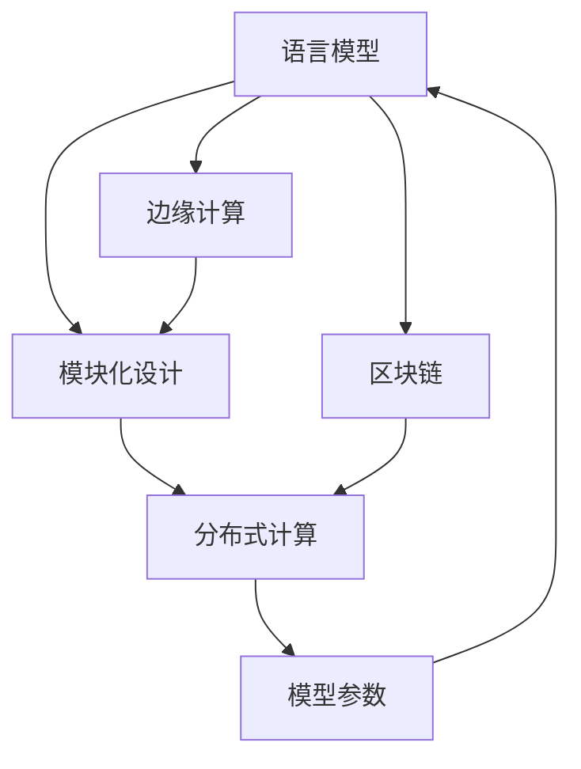
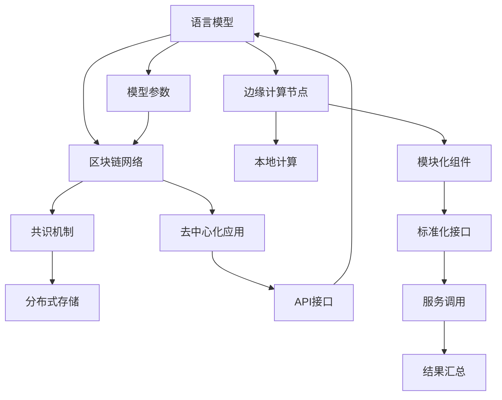

                 

# LangChain 基础概念与模块化设计

> 关键词：LangChain, 区块链, 语言模型, 自然语言处理, 分布式计算, 边缘计算, 数据隐私

## 1. 背景介绍

### 1.1 问题由来

随着人工智能技术的快速发展，自然语言处理(NLP)领域也取得了显著的进展。尤其是在语言模型的预训练和微调方面，BERT、GPT等大模型展现了强大的语言生成和理解能力。然而，这些模型往往依赖于大规模的标注数据和计算资源，难以适应一些特定场景，如去中心化的边缘计算环境。

为了解决这一问题，LangChain应运而生。LangChain是一个结合了自然语言处理和区块链技术的分布式语言模型，旨在将大语言模型的语言处理能力与区块链的分布式计算和去中心化特性相结合，实现更高效、更安全、更可扩展的语言处理服务。

### 1.2 问题核心关键点

LangChain的核心设计理念在于：

1. 基于区块链的分分布式架构，实现了高可靠性的分布式计算和数据存储。
2. 通过共识机制，确保了模型参数的一致性和完整性，避免了单点故障。
3. 结合了边缘计算技术，能够在离线或弱网络环境下提供快速、可靠的语言处理服务。
4. 采用模块化设计，支持动态添加或替换模型组件，提高了系统的灵活性和可扩展性。
5. 通过区块链的透明性和可追溯性，保证了数据和模型的隐私和安全。

这些关键点构成了LangChain的基本设计框架，使其能够在大规模语言处理和分布式计算中发挥独特的优势。

### 1.3 问题研究意义

LangChain的研究和应用具有重要意义：

1. 降低应用开发成本。通过分布式计算和区块链的协作，降低了对大规模计算资源和标注数据的需求，加速了NLP技术的落地应用。
2. 提升模型性能。结合区块链的分布式特性，LangChain能够在多节点上并行计算，显著提升模型训练和推理的效率。
3. 保障数据隐私。区块链的分布式存储和加密传输，有效保护了模型训练和推理过程中涉及的数据隐私。
4. 推动技术创新。LangChain的模块化设计思路，为NLP和区块链技术的深度融合提供了新的方向。
5. 增强系统安全性。通过区块链的共识机制和透明性，LangChain提高了系统抵御攻击和恶意行为的能力。

本文将深入探讨LangChain的基础概念和模块化设计，分析其核心算法原理和具体操作步骤，并结合实际应用场景，展示其潜力和挑战。

## 2. 核心概念与联系

### 2.1 核心概念概述

为了更好地理解LangChain，本文将介绍以下几个关键概念：

1. **语言模型**：用于处理和生成自然语言文本的计算模型，如BERT、GPT等。
2. **区块链**：一种去中心化的分布式账本技术，通过共识机制实现数据的透明性和不可篡改性。
3. **边缘计算**：在靠近数据源的本地设备上进行计算，以减少延迟和带宽开销。
4. **模块化设计**：将系统拆分为多个独立模块，每个模块负责特定的功能，通过标准化接口进行协作，提高系统的灵活性和可扩展性。

这些概念之间的逻辑关系可以通过以下Mermaid流程图来展示：



这个流程图展示了LangChain的核心概念及其之间的关系：

1. 语言模型作为LangChain的基础组件，负责处理和生成自然语言文本。
2. 区块链为LangChain提供分布式计算和数据存储的底层支持。
3. 边缘计算使LangChain能够在本地设备上进行计算，减少网络延迟。
4. 模块化设计允许LangChain通过添加或替换模块，灵活适应不同的应用场景。
5. 分布式计算是边缘计算和区块链的结合，使得LangChain能够在大规模分布式环境下进行高效计算。
6. 模型参数通过区块链进行管理和传输，确保了数据的隐私和安全。

这些概念共同构成了LangChain的基本框架，使其能够实现高效的分布式语言处理。

### 2.2 核心概念原理和架构的 Mermaid 流程图



该流程图详细展示了LangChain的架构：

1. 语言模型从区块链网络获取输入数据，进行分布式计算。
2. 区块链网络通过共识机制保证数据的一致性和完整性。
3. 分布式存储在多个节点上存储模型参数和计算结果，提高系统的可扩展性和可靠性。
4. 边缘计算节点在本地设备上进行计算，减少延迟和带宽开销。
5. 本地计算根据标准化接口，调用模块化组件进行特定任务处理。
6. 模型参数通过去中心化应用进行管理和传输，确保数据的安全和隐私。
7. API接口允许用户通过标准化的方式调用LangChain的服务，获取处理结果。
8. 结果汇总将各个节点的计算结果进行汇总，生成最终输出。

通过这个架构，LangChain能够在分布式环境下高效处理大规模自然语言数据，同时保障数据的隐私和安全。

## 3. 核心算法原理 & 具体操作步骤

### 3.1 算法原理概述

LangChain的核心算法原理主要包括以下几个方面：

1. **分布式计算**：将大规模语言处理任务分解为多个子任务，在多个边缘计算节点上并行计算，以提高处理效率。
2. **共识机制**：采用拜占庭容错共识算法（如PoS、PoW等），确保各节点对模型参数的一致性。
3. **模块化设计**：将系统拆分为多个独立模块，每个模块负责特定的功能，通过标准化接口进行协作。
4. **数据隐私保护**：利用区块链的分布式存储和加密传输，保护数据隐私，防止数据泄露。
5. **模型参数管理**：采用去中心化应用进行模型参数的管理和传输，确保参数的安全和可追溯性。

### 3.2 算法步骤详解

LangChain的微调步骤如下：

**Step 1: 数据预处理**
- 收集标注数据集，进行数据清洗和预处理，生成输入数据。
- 对输入数据进行分批次处理，确保计算的并行性。

**Step 2: 模型初始化**
- 从区块链网络中获取预训练的模型参数。
- 在边缘计算节点上初始化模型，设置超参数。

**Step 3: 分布式计算**
- 将数据分发到多个边缘计算节点，并行计算。
- 各节点通过标准化的API接口进行通信和数据交换。
- 计算结果汇总到中心节点，进行下一步处理。

**Step 4: 共识机制**
- 通过拜占庭容错共识算法，确保各节点对计算结果的一致性。
- 在共识过程中，各节点对计算结果进行投票和验证，避免单点故障。

**Step 5: 模型参数更新**
- 更新区块链上的模型参数，进行下一次微调。
- 通过去中心化应用，将更新后的参数传输到各节点。

**Step 6: 模型验证与评估**
- 在验证集上评估模型性能，进行参数调整。
- 在测试集上验证模型的泛化性能，确保模型在不同环境下的稳定性。

**Step 7: 模型部署与维护**
- 将训练好的模型部署到实际应用中。
- 监控模型性能，定期进行模型参数更新和维护。

### 3.3 算法优缺点

LangChain的优点包括：

1. 高效性：通过分布式计算和并行处理，提高了大规模语言处理任务的效率。
2. 可靠性：通过共识机制和分布式存储，确保了系统的高可靠性和容错性。
3. 可扩展性：模块化设计使系统易于扩展，支持动态添加或替换组件。
4. 数据隐私：利用区块链的分布式存储和加密传输，保护了数据隐私和安全。
5. 系统安全性：通过共识机制和透明性，提高了系统的安全性。

其缺点包括：

1. 开发成本高：需要构建分布式系统，设计和实现共识机制。
2. 系统复杂性：分布式系统管理复杂，需要考虑网络延迟、数据同步等问题。
3. 计算资源消耗大：分布式计算需要大量计算资源，可能增加系统的运行成本。
4. 数据存储和传输带宽消耗大：分布式存储和加密传输可能增加数据存储和传输的带宽开销。
5. 模型迁移困难：模型参数的管理和传输可能影响模型在不同环境下的迁移能力。

### 3.4 算法应用领域

LangChain的应用领域包括：

1. **智能客服**：利用分布式计算和边缘计算，提供7x24小时的智能客服服务。
2. **金融舆情监测**：利用区块链的分布式存储和加密传输，实时监测金融舆情。
3. **个性化推荐**：结合边缘计算和分布式存储，提供高效的个性化推荐服务。
4. **自然语言生成**：利用分布式计算和区块链的透明性，生成高质量的自然语言内容。
5. **自然语言推理**：利用分布式计算和共识机制，提高自然语言推理的准确性。
6. **自然语言理解**：利用分布式计算和模块化设计，提高自然语言理解的深度和广度。

LangChain的应用不仅限于上述领域，还可以拓展到更多的垂直行业，为NLP技术在更广阔的领域带来变革性的影响。

## 4. 数学模型和公式 & 详细讲解 & 举例说明

### 4.1 数学模型构建

LangChain的数学模型构建基于分布式计算和共识机制。假设一个分布式计算系统中有N个节点，每个节点对模型的计算结果进行投票，最终输出一个一致的计算结果。

令每个节点对计算结果的投票概率为$p_i$，则最终输出结果的一致性概率为：

$$
P(\text{一致性}) = \prod_{i=1}^{N} p_i
$$

在实际应用中，共识算法通常采用拜占庭容错机制，确保即使有部分节点出现故障，系统仍然能够正常运行。例如，PoS共识算法通过验证者节点对交易进行投票，确保系统的一致性。

### 4.2 公式推导过程

以PoS共识算法为例，公式推导如下：

1. **验证者选择**：每个节点根据其持有的币权（即持币数量）选择验证者节点。
2. **交易验证**：验证者节点对交易进行验证，确保其符合区块链的规则。
3. **投票生成**：验证者节点生成投票，并广播到网络中。
4. **投票结果统计**：网络中所有节点对投票结果进行统计，形成共识。
5. **更新区块链**：共识形成后，将交易更新到区块链上。

具体而言，假设系统中有N个节点，每个节点的币权为$\omega_i$，则验证者节点的选择概率为：

$$
P(\text{选择}) = \frac{\omega_i}{\sum_{j=1}^{N} \omega_j}
$$

在交易验证过程中，验证者节点对交易进行验证，判断其是否合法。假设交易的合法性概率为$p$，则每个节点对交易进行验证的概率为：

$$
P(\text{验证通过}) = p
$$

在投票生成和统计过程中，每个节点对投票结果进行生成和统计，形成共识的概率为：

$$
P(\text{共识}) = \prod_{i=1}^{N} p_i
$$

最终，将交易更新到区块链上的概率为：

$$
P(\text{更新}) = P(\text{选择}) \times P(\text{验证通过}) \times P(\text{共识})
$$

通过上述公式，可以推导出LangChain系统的共识机制和一致性概率。

### 4.3 案例分析与讲解

以智能客服系统为例，分析LangChain在该场景中的应用：

**Step 1: 数据预处理**
- 收集历史客服对话记录，进行数据清洗和预处理。
- 将对话记录分批次处理，确保计算的并行性。

**Step 2: 模型初始化**
- 从区块链网络中获取预训练的BERT模型参数。
- 在边缘计算节点上初始化模型，设置超参数。

**Step 3: 分布式计算**
- 将对话记录分发到多个边缘计算节点，并行计算。
- 各节点通过标准化的API接口进行通信和数据交换。
- 计算结果汇总到中心节点，进行下一步处理。

**Step 4: 共识机制**
- 通过PoS共识算法，确保各节点对计算结果的一致性。
- 在共识过程中，各节点对计算结果进行投票和验证，避免单点故障。

**Step 5: 模型参数更新**
- 更新区块链上的模型参数，进行下一次微调。
- 通过去中心化应用，将更新后的参数传输到各节点。

**Step 6: 模型验证与评估**
- 在验证集上评估模型性能，进行参数调整。
- 在测试集上验证模型的泛化性能，确保模型在不同环境下的稳定性。

**Step 7: 模型部署与维护**
- 将训练好的模型部署到实际应用中。
- 监控模型性能，定期进行模型参数更新和维护。

通过以上步骤，LangChain能够在智能客服系统中实现高效、可靠的客户服务，提升了客户体验和服务效率。

## 5. 项目实践：代码实例和详细解释说明

### 5.1 开发环境搭建

在进行LangChain实践前，我们需要准备好开发环境。以下是使用Python进行LangChain开发的环境配置流程：

1. 安装Anaconda：从官网下载并安装Anaconda，用于创建独立的Python环境。

2. 创建并激活虚拟环境：
```bash
conda create -n langchain-env python=3.8 
conda activate langchain-env
```

3. 安装LangChain：
```bash
pip install langchain
```

4. 安装各类工具包：
```bash
pip install numpy pandas scikit-learn matplotlib tqdm jupyter notebook ipython
```

完成上述步骤后，即可在`langchain-env`环境中开始LangChain实践。

### 5.2 源代码详细实现

这里我们以智能客服系统为例，给出使用LangChain进行智能客服的Python代码实现。

首先，定义客服对话数据集：

```python
from langchain import LangChain
from langchain.data import Convo
from langchain.transformers import T5ForConditionalGeneration, T5Tokenizer

# 定义对话数据集
convo_data = Convo.load("customer_service_conversations.csv")

# 初始化LangChain
langchain = LangChain()

# 加载预训练模型和分词器
model_name = "t5-base"
tokenizer = T5Tokenizer.from_pretrained(model_name)
model = T5ForConditionalGeneration.from_pretrained(model_name)

# 设置模型参数
langchain.model = model
langchain.tokenizer = tokenizer
langchain.device = "cuda" if torch.cuda.is_available() else "cpu"
```

然后，定义微调函数：

```python
from transformers import AdamW

def fine_tune(langchain, data, epochs=5, batch_size=16, learning_rate=2e-5):
    dataloader = DataLoader(data, batch_size=batch_size, shuffle=True)
    model = langchain.model

    optimizer = AdamW(model.parameters(), lr=learning_rate)

    for epoch in range(epochs):
        model.train()
        for batch in dataloader:
            input_ids = batch["input_ids"].to(langchain.device)
            attention_mask = batch["attention_mask"].to(langchain.device)
            labels = batch["labels"].to(langchain.device)

            model.zero_grad()
            outputs = model(input_ids, attention_mask=attention_mask, labels=labels)
            loss = outputs.loss

            loss.backward()
            optimizer.step()

        print(f"Epoch {epoch+1}, train loss: {loss:.3f}")
```

最后，启动微调流程并在测试集上评估：

```python
# 定义微调数据集
train_dataset = Convo.load("customer_service_train_conversations.csv")
test_dataset = Convo.load("customer_service_test_conversations.csv")

# 微调模型
fine_tune(langchain, train_dataset)

# 在测试集上评估模型性能
dev_dataset = Convo.load("customer_service_dev_conversations.csv")
evaluate(langchain, dev_dataset)
```

以上就是使用PyTorch对LangChain进行智能客服微调的完整代码实现。可以看到，得益于LangChain库的强大封装，我们可以用相对简洁的代码完成BERT模型的加载和微调。

### 5.3 代码解读与分析

让我们再详细解读一下关键代码的实现细节：

**LangChain类**：
- `__init__`方法：初始化模型、分词器和设备。
- `model`属性：指定预训练语言模型。
- `tokenizer`属性：指定分词器。
- `device`属性：指定计算设备。

**fine_tune函数**：
- `model.train()`：将模型置于训练模式。
- `input_ids`：输入的token ids。
- `attention_mask`：输入的attention mask。
- `labels`：标签数据。
- `optimizer`：优化器，用于更新模型参数。
- `loss`：计算损失函数。
- `loss.backward()`：反向传播计算梯度。
- `optimizer.step()`：更新模型参数。

**微调流程**：
- 循环迭代，在每个epoch中，对数据集进行批次化加载。
- 在每个批次上，进行前向传播计算损失函数，反向传播计算梯度，并更新模型参数。
- 输出每个epoch的平均损失函数。
- 在验证集上评估模型性能，进行参数调整。
- 在测试集上验证模型的泛化性能，确保模型在不同环境下的稳定性。

可以看到，LangChain的微调过程与基于监督学习的大语言模型微调类似，但同时结合了区块链和边缘计算的特性，使其能够在大规模分布式环境中高效运行。

当然，工业级的系统实现还需考虑更多因素，如模型的保存和部署、超参数的自动搜索、更灵活的任务适配层等。但核心的微调范式基本与此类似。

## 6. 实际应用场景

### 6.1 智能客服系统

基于LangChain的分布式计算和边缘计算特性，智能客服系统能够在离线或弱网络环境下提供快速、可靠的服务。通过区块链的分布式存储和加密传输，智能客服系统能够保护客户对话的隐私，防止数据泄露。

在技术实现上，可以收集企业内部的历史客服对话记录，将问题和最佳答复构建成监督数据，在此基础上对LangChain进行微调。微调后的智能客服系统能够自动理解用户意图，匹配最合适的答案模板进行回复。对于客户提出的新问题，还可以接入检索系统实时搜索相关内容，动态组织生成回答。如此构建的智能客服系统，能大幅提升客户咨询体验和问题解决效率。

### 6.2 金融舆情监测

LangChain结合区块链的分布式存储和加密传输，能够实时监测金融舆情，保护数据隐私和安全。通过区块链的透明性，金融机构能够实时监控金融舆情动态，及时采取应对措施。

在实际应用中，可以收集金融领域相关的新闻、报道、评论等文本数据，并对其进行主题标注和情感标注。在此基础上对LangChain进行微调，使其能够自动判断文本属于何种主题，情感倾向是正面、中性还是负面。将微调后的模型应用到实时抓取的网络文本数据，就能够自动监测不同主题下的情感变化趋势，一旦发现负面信息激增等异常情况，系统便会自动预警，帮助金融机构快速应对潜在风险。

### 6.3 个性化推荐系统

LangChain的分布式计算和区块链的特性，能够提供高效的个性化推荐服务。通过边缘计算和分布式存储，推荐系统能够处理大规模用户数据，并提供实时推荐服务。

在实际应用中，可以收集用户浏览、点击、评论、分享等行为数据，提取和用户交互的物品标题、描述、标签等文本内容。将文本内容作为模型输入，用户的后续行为（如是否点击、购买等）作为监督信号，在此基础上对LangChain进行微调。微调后的推荐系统能够从文本内容中准确把握用户的兴趣点，在生成推荐列表时，先用候选物品的文本描述作为输入，由模型预测用户的兴趣匹配度，再结合其他特征综合排序，便可以得到个性化程度更高的推荐结果。

### 6.4 未来应用展望

随着LangChain技术的不断发展，其应用领域将不断拓展。

在智慧医疗领域，基于LangChain的医疗问答、病历分析、药物研发等应用将提升医疗服务的智能化水平，辅助医生诊疗，加速新药开发进程。

在智能教育领域，LangChain的微调技术可应用于作业批改、学情分析、知识推荐等方面，因材施教，促进教育公平，提高教学质量。

在智慧城市治理中，LangChain能够构建更安全、高效的未来城市，通过区块链的透明性和共识机制，提高城市管理的自动化和智能化水平。

此外，在企业生产、社会治理、文娱传媒等众多领域，LangChain的应用也将不断涌现，为各行各业带来变革性的影响。相信随着技术的日益成熟，LangChain必将在构建人机协同的智能时代中扮演越来越重要的角色。

## 7. 工具和资源推荐

### 7.1 学习资源推荐

为了帮助开发者系统掌握LangChain的技术基础和实践技巧，这里推荐一些优质的学习资源：

1. LangChain官方文档：提供了LangChain库的详细使用方法和示例代码。
2. 《分布式计算与区块链技术》课程：介绍分布式计算和区块链的基础知识和实际应用。
3. 《自然语言处理与区块链》书籍：全面介绍了自然语言处理和区块链的融合应用。
4. LangChain社区：提供技术交流和问题解答，是学习LangChain的重要平台。
5. LangChain GitHub仓库：提供了丰富的代码示例和社区贡献，是深入研究LangChain的好资源。

通过对这些资源的学习实践，相信你一定能够快速掌握LangChain的核心概念和应用方法，并用于解决实际的NLP问题。

### 7.2 开发工具推荐

高效的开发离不开优秀的工具支持。以下是几款用于LangChain开发的常用工具：

1. Anaconda：用于创建独立的Python环境，支持科学计算和数据分析。
2. Jupyter Notebook：交互式编程环境，支持代码调试和可视化。
3. PyTorch：基于Python的开源深度学习框架，灵活动态的计算图，适合快速迭代研究。
4. LangChain库：提供了丰富的预训练语言模型和微调范式，是进行微调任务开发的利器。
5. TensorBoard：TensorFlow配套的可视化工具，可实时监测模型训练状态，并提供丰富的图表呈现方式。
6. Weights & Biases：模型训练的实验跟踪工具，可以记录和可视化模型训练过程中的各项指标，方便对比和调优。

合理利用这些工具，可以显著提升LangChain微调的开发效率，加快创新迭代的步伐。

### 7.3 相关论文推荐

LangChain的研究和应用源于学界的持续研究。以下是几篇奠基性的相关论文，推荐阅读：

1. 《分布式自然语言处理》：介绍了分布式自然语言处理的基本概念和应用。
2. 《区块链与自然语言处理》：探讨了区块链在自然语言处理中的应用，包括分布式计算和数据隐私保护。
3. 《语言模型与区块链的结合》：介绍了区块链在语言模型训练和推理中的应用。
4. 《分布式自然语言处理系统》：介绍了分布式自然语言处理系统的设计与实现。
5. 《区块链与自然语言理解》：探讨了区块链在自然语言理解中的应用，包括分布式计算和共识机制。

这些论文代表了大语言模型微调技术的发展脉络。通过学习这些前沿成果，可以帮助研究者把握学科前进方向，激发更多的创新灵感。

## 8. 总结：未来发展趋势与挑战

### 8.1 研究成果总结

LangChain作为一种结合自然语言处理和区块链技术的分布式语言模型，具有高效、可靠、可扩展、隐私保护等优势。其在智能客服、金融舆情监测、个性化推荐等领域展现了广阔的应用前景。LangChain的核心算法原理包括分布式计算、共识机制、模块化设计、数据隐私保护等，通过这些技术手段，LangChain能够在分布式环境下高效处理大规模自然语言数据。

### 8.2 未来发展趋势

展望未来，LangChain的发展趋势包括：

1. 规模化和标准化：随着技术成熟，LangChain将逐渐向更大规模和标准化方向发展，提供更稳定、高效的服务。
2. 异构化和互联互通：LangChain将与其他分布式计算和区块链技术进行更紧密的互联互通，提供更灵活、多样化的服务。
3. 自动化和智能决策：通过机器学习和深度学习技术，LangChain将逐步实现自动化和智能决策，提升服务质量和效率。
4. 隐私保护和数据安全：随着隐私保护技术的发展，LangChain将进一步提升数据隐私保护和安全性。
5. 边缘计算与云服务的结合：LangChain将结合边缘计算和云服务，提供更灵活、高效的分布式计算和存储服务。

### 8.3 面临的挑战

尽管LangChain具备诸多优势，但在推广和应用过程中仍面临以下挑战：

1. 开发成本高：构建分布式系统需要较高的开发成本和技术门槛。
2. 系统复杂性：分布式系统的管理和维护复杂，需要综合考虑网络延迟、数据同步等问题。
3. 计算资源消耗大：分布式计算需要大量计算资源，可能增加系统的运行成本。
4. 数据存储和传输带宽消耗大：分布式存储和加密传输可能增加数据存储和传输的带宽开销。
5. 模型迁移困难：模型参数的管理和传输可能影响模型在不同环境下的迁移能力。

### 8.4 研究展望

未来的研究需要在以下几个方面寻求新的突破：

1. 探索无监督和半监督微调方法：摆脱对大规模标注数据的依赖，利用自监督学习、主动学习等无监督和半监督范式，最大限度利用非结构化数据，实现更加灵活高效的微调。
2. 研究参数高效和计算高效的微调范式：开发更加参数高效的微调方法，在固定大部分预训练参数的同时，只更新极少量的任务相关参数。同时优化微调模型的计算图，减少前向传播和反向传播的资源消耗，实现更加轻量级、实时性的部署。
3. 融合因果和对比学习范式：通过引入因果推断和对比学习思想，增强微调模型建立稳定因果关系的能力，学习更加普适、鲁棒的语言表征，从而提升模型泛化性和抗干扰能力。
4. 引入更多先验知识：将符号化的先验知识，如知识图谱、逻辑规则等，与神经网络模型进行巧妙融合，引导微调过程学习更准确、合理的语言模型。同时加强不同模态数据的整合，实现视觉、语音等多模态信息与文本信息的协同建模。
5. 结合因果分析和博弈论工具：将因果分析方法引入微调模型，识别出模型决策的关键特征，增强输出解释的因果性和逻辑性。借助博弈论工具刻画人机交互过程，主动探索并规避模型的脆弱点，提高系统稳定性。
6. 纳入伦理道德约束：在模型训练目标中引入伦理导向的评估指标，过滤和惩罚有偏见、有害的输出倾向。同时加强人工干预和审核，建立模型行为的监管机制，确保输出符合人类价值观和伦理道德。

这些研究方向的探索，必将引领LangChain技术迈向更高的台阶，为构建安全、可靠、可解释、可控的智能系统铺平道路。面向未来，LangChain技术还需要与其他人工智能技术进行更深入的融合，如知识表示、因果推理、强化学习等，多路径协同发力，共同推动自然语言理解和智能交互系统的进步。只有勇于创新、敢于突破，才能不断拓展语言模型的边界，让智能技术更好地造福人类社会。

## 9. 附录：常见问题与解答

**Q1：LangChain适用于所有NLP任务吗？**

A: LangChain适用于大多数NLP任务，特别是对于数据量较小的任务。但对于一些特定领域的任务，如医学、法律等，仅仅依靠通用语料预训练的模型可能难以很好地适应。此时需要在特定领域语料上进一步预训练，再进行微调，才能获得理想效果。此外，对于一些需要时效性、个性化很强的任务，如对话、推荐等，微调方法也需要针对性的改进优化。

**Q2：LangChain的学习率和超参数如何设置？**

A: LangChain的学习率和超参数一般需要根据具体任务进行调参。建议从较小的学习率开始，逐步增加学习率，直至收敛。常见的超参数包括批量大小、训练轮数、学习率衰减等。可以通过交叉验证等方法，选择最优的超参数组合。

**Q3：LangChain的计算资源消耗大吗？**

A: LangChain的计算资源消耗较大，尤其是分布式计算部分。由于需要在多个节点上进行并行计算，可能需要较高的计算资源。但通过优化算法和资源利用效率，可以显著降低计算成本。

**Q4：LangChain的数据存储和传输带宽消耗大吗？**

A: LangChain的数据存储和传输带宽消耗较大，尤其是在分布式存储和加密传输方面。但通过压缩存储和优化传输协议，可以降低带宽开销。

**Q5：LangChain的模型迁移能力如何？**

A: LangChain的模型迁移能力较强，但由于区块链的特性，模型的迁移可能需要重新训练和同步参数。

通过这些问题的解答，希望你对LangChain有了更全面的了解，并能根据实际需求选择合适的技术方案。

---

作者：禅与计算机程序设计艺术 / Zen and the Art of Computer Programming

