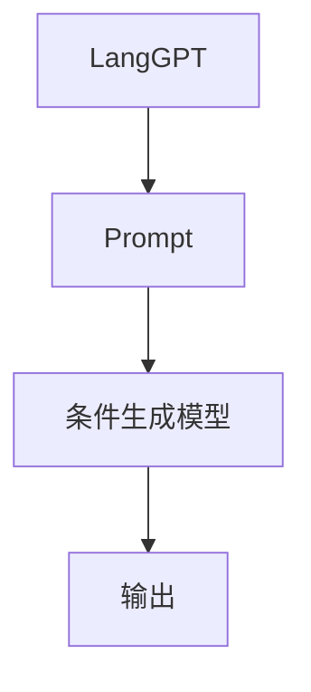

                 

# LangGPT 提示词框架：从输入到输出的映射

> 关键词：LangGPT, 提示词(Prompt), 自然语言处理(NLP), 生成对抗网络(GAN), 条件生成模型, 模型融合

## 1. 背景介绍

### 1.1 问题由来
近年来，大语言模型(Large Language Model, LLM)在自然语言处理(Natural Language Processing, NLP)领域取得了巨大突破。这些模型通过大规模无标签文本语料的预训练，获得了丰富的语言知识，在语言理解和生成方面表现优异。然而，在大规模预训练完成后，如何使模型适应特定任务并提升性能，成为了一个关键问题。

传统的微调方法依赖于有标签数据，但在实际应用中，标注数据获取成本高昂且难以全面覆盖。为了解决这一问题，研究者们开发了基于提示词(Prompt)的微调方法，即通过精心设计的提示词引导模型，在不需要大量标注数据的情况下也能实现任务适配。

### 1.2 问题核心关键点
基于提示词的微调方法，通过在模型输入前添加特定格式的提示词，能够在不更新模型参数的情况下，引导模型输出符合期望的结果。这种方法简洁高效，适合于对标注数据需求较少的任务，如对话系统、代码生成、问答系统等。

提示词设计的好坏直接影响微调效果。好的提示词能够明确指示模型任务，减少输出噪音，提高模型的生成质量和响应速度。提示词设计的主要挑战在于如何设计出能够泛化到不同数据和场景的通用提示词。

提示词的另一个挑战是提升生成文本的自然性和连贯性。传统基于文本的微调方法难以避免生成文本的机械性和不连贯性。通过与生成对抗网络(GAN)等生成模型的结合，可以提高生成文本的自然度和流畅性。

## 2. 核心概念与联系

### 2.1 核心概念概述

为更好地理解基于提示词的微调方法，本节将介绍几个关键概念：

- **LangGPT**：一种基于Transformer架构的大语言模型，具备强大的语言生成能力。
- **Prompt**：输入到模型的文本模板，用于指示模型执行特定任务。
- **条件生成模型**：如GAN、VAE等，用于生成自然、连贯的文本。
- **模型融合**：将不同模型进行组合，以发挥各自优势。
- **小样本学习(Few-shot Learning)**：仅依赖少量示例即可学习新任务的方法。

这些概念之间的联系紧密，共同构成了基于提示词的微调方法的基本框架。提示词作为任务描述，与LangGPT的生成能力相结合，通过条件生成模型进一步优化，实现了从输入到输出的高效映射。

### 2.2 核心概念原理和架构的 Mermaid 流程图(Mermaid 流程节点中不要有括号、逗号等特殊字符)



这个流程图展示了LangGPT、提示词和条件生成模型之间的关系：

1. **LangGPT**：作为预训练模型，具备强大的语言生成能力，是微调过程的核心。
2. **Prompt**：定义了模型执行的具体任务，如回答问题、生成代码、翻译等。
3. **条件生成模型**：在提示词的指导下，进一步优化生成文本的质量和自然度。

## 3. 核心算法原理 & 具体操作步骤

### 3.1 算法原理概述

基于提示词的微调方法，本质上是一种零样本学习(Zero-shot Learning)范式。通过在输入文本前添加提示词，LangGPT能够理解任务要求，生成符合要求的输出。其核心思想是：

1. **输入模板设计**：设计有效的提示词，明确指示模型执行的任务类型。
2. **模型预测输出**：将提示词与LangGPT的生成能力相结合，预测输出。
3. **条件生成优化**：通过条件生成模型，进一步优化输出的自然度和连贯性。

### 3.2 算法步骤详解

基于提示词的微调方法一般包括以下几个关键步骤：

**Step 1: 准备Prompt和条件生成模型**
- 设计针对特定任务的Prompt模板。
- 选择合适的条件生成模型，如GAN、VAE等，用于优化输出文本的自然度。

**Step 2: 添加Prompt并预测输出**
- 将Prompt与输入文本一起输入LangGPT。
- LangGPT输出未优化的文本，作为生成模型的初始条件。

**Step 3: 生成优化文本**
- 将未优化文本作为条件生成模型的输入，生成优化后的文本。
- 通过迭代多次优化，提高生成文本的质量和连贯性。

**Step 4: 输出与评估**
- 将优化后的文本作为微调模型的输出。
- 使用标准评估指标（如BLEU、ROUGE等）评估模型输出与真实结果的匹配度。

### 3.3 算法优缺点

基于提示词的微调方法具有以下优点：

1. **高效便捷**：微调过程不需要大量标注数据，适合零样本或少样本学习场景。
2. **灵活性高**：提示词设计灵活，可根据任务特点进行定制，适应性强。
3. **泛化能力强**：提示词设计得当，可实现跨领域、跨任务的泛化。
4. **可解释性强**：提示词作为任务描述，易于理解和调试。

同时，该方法也存在一些局限性：

1. **依赖提示词质量**：提示词设计质量对微调效果影响巨大，设计不当可能导致生成文本质量不佳。
2. **难以应对复杂任务**：对于一些复杂多模态任务，提示词设计难度增加。
3. **生成文本质量受限**：受限于条件生成模型的能力，生成的文本质量难以完全达到人类水平。

尽管有这些局限性，基于提示词的微调方法仍是一种高效、灵活且可解释性强的任务适配策略，广泛应用于对话系统、代码生成、问答系统等多个领域。

### 3.4 算法应用领域

基于提示词的微调方法，已在多个NLP应用领域取得了显著效果，主要包括：

- **对话系统**：在智能客服、多轮对话等场景中，通过Prompt引导模型生成自然流畅的回复。
- **代码生成**：在编程辅助、代码补全等任务中，提示词指示模型生成符合语法规范的代码片段。
- **问答系统**：在知识检索、专家问答等任务中，提示词引导模型生成精确、连贯的答案。
- **文本摘要**：在新闻摘要、文档总结等任务中，提示词指示模型生成精炼的摘要内容。
- **机器翻译**：在跨语言翻译任务中，提示词指示模型生成翻译结果。

这些领域的应用展示了基于提示词的微调方法的广泛适用性和高效性。

## 4. 数学模型和公式 & 详细讲解 & 举例说明

### 4.1 数学模型构建

基于提示词的微调方法，可以形式化地表示为：

$$
\hat{y} = \text{LangGPT}(\text{Prompt} \oplus \text{input}) + \text{G}(\text{LangGPT}(\text{Prompt} \oplus \text{input}))
$$

其中，$\text{Prompt}$为任务指示的文本模板，$\oplus$表示串联，$\text{input}$为输入文本，$\hat{y}$为模型预测的输出文本，$\text{G}$为条件生成模型。

### 4.2 公式推导过程

以对话系统为例，假设Prompt为"回答以下问题：", 输入为"今天天气如何？"，模型预测的输出为"今天天气晴朗"。根据上述公式，推导过程如下：

1. **输入生成**
   - $\text{input} = \text{Prompt} \oplus \text{input} = \text{Prompt} \oplus \text{"今天天气如何？"}$

2. **语言模型预测**
   - $\hat{y} = \text{LangGPT}(\text{Prompt} \oplus \text{input}) = \text{LangGPT}(\text{Prompt} \oplus \text{"回答以下问题：今天天气如何？"})$

3. **条件生成优化**
   - 将未优化文本作为GAN的输入，生成优化后的文本：$\text{y} = \text{G}(\text{LangGPT}(\text{Prompt} \oplus \text{input}))$

4. **最终输出**
   - $\hat{y} = \text{LangGPT}(\text{Prompt} \oplus \text{input}) + \text{G}(\text{LangGPT}(\text{Prompt} \oplus \text{input}))$

通过上述推导，可以看到提示词和条件生成模型如何共同作用于LangGPT的输出，实现从输入到输出的高效映射。

### 4.3 案例分析与讲解

假设任务为生成一段新闻摘要，Prompt为"请简述以下新闻："，输入为一段长新闻文本。

1. **输入生成**
   - $\text{input} = \text{Prompt} \oplus \text{news\_text}$

2. **语言模型预测**
   - $\hat{y} = \text{LangGPT}(\text{Prompt} \oplus \text{news\_text})$

3. **条件生成优化**
   - 将未优化文本作为GAN的输入，生成优化后的文本：$\text{y} = \text{G}(\text{LangGPT}(\text{Prompt} \oplus \text{news\_text}))$

4. **最终输出**
   - $\hat{y} = \text{LangGPT}(\text{Prompt} \oplus \text{news\_text}) + \text{G}(\text{LangGPT}(\text{Prompt} \oplus \text{news\_text}))$

通过上述案例，可以看出提示词和条件生成模型如何协同工作，生成高质量的新闻摘要。

## 5. 项目实践：代码实例和详细解释说明

### 5.1 开发环境搭建

在进行基于提示词的微调实践前，我们需要准备好开发环境。以下是使用Python进行PyTorch开发的环境配置流程：

1. 安装Anaconda：从官网下载并安装Anaconda，用于创建独立的Python环境。

2. 创建并激活虚拟环境：
```bash
conda create -n pytorch-env python=3.8 
conda activate pytorch-env
```

3. 安装PyTorch：根据CUDA版本，从官网获取对应的安装命令。例如：
```bash
conda install pytorch torchvision torchaudio cudatoolkit=11.1 -c pytorch -c conda-forge
```

4. 安装Transformers库：
```bash
pip install transformers
```

5. 安装各类工具包：
```bash
pip install numpy pandas scikit-learn matplotlib tqdm jupyter notebook ipython
```

完成上述步骤后，即可在`pytorch-env`环境中开始微调实践。

### 5.2 源代码详细实现

下面我们以代码生成任务为例，给出使用Transformers库对LangGPT进行基于提示词的微调的PyTorch代码实现。

首先，定义Prompt和条件生成模型：

```python
from transformers import LangGPTModel, GPT2LMHeadModel, GPT2Tokenizer

prompt = "请为以下Python代码生成文档："
source_code = "def greet():\n    print(\"Hello, World!\")"
tokenizer = GPT2Tokenizer.from_pretrained('gpt2')

# 构造提示词
prompt_tokens = tokenizer(prompt, return_tensors='pt').input_ids

# 构造输入文本
source_code_tokens = tokenizer(source_code, return_tensors='pt').input_ids

# 初始化LangGPT模型
langgpt_model = LangGPTModel.from_pretrained('gpt2')

# 初始化条件生成模型
gpt2_model = GPT2LMHeadModel.from_pretrained('gpt2')
gpt2_tokenizer = GPT2Tokenizer.from_pretrained('gpt2')

# 构建条件生成模型
def generate_document(prompt, source_code):
    prompt_tokens = tokenizer(prompt, return_tensors='pt').input_ids
    source_code_tokens = tokenizer(source_code, return_tensors='pt').input_ids
    with torch.no_grad():
        outputs = langgpt_model(prompt_tokens, source_code_tokens)
        probs = outputs.logits.softmax(dim=-1)[0]
        generated_tokens = gpt2_tokenizer.decode(probs.argmax(dim=-1), skip_special_tokens=True)
    return generated_tokens

# 生成文档
document = generate_document(prompt, source_code)
print(document)
```

然后，定义训练和评估函数：

```python
from torch.utils.data import Dataset
import torch
from tqdm import tqdm
import random

class CodeDataset(Dataset):
    def __init__(self, prompts, source_codes, tokenizer):
        self.prompts = prompts
        self.source_codes = source_codes
        self.tokenizer = tokenizer
        
    def __len__(self):
        return len(self.prompts)
    
    def __getitem__(self, item):
        prompt = self.prompts[item]
        source_code = self.source_codes[item]
        prompt_tokens = self.tokenizer(prompt, return_tensors='pt').input_ids
        source_code_tokens = self.tokenizer(source_code, return_tensors='pt').input_ids
        return {'prompt': prompt, 'source_code': source_code, 'tokens': prompt_tokens, 'source_tokens': source_code_tokens}

# 创建dataset
tokenizer = GPT2Tokenizer.from_pretrained('gpt2')
train_dataset = CodeDataset(prompts, source_codes, tokenizer)
val_dataset = CodeDataset(val_prompts, val_source_codes, tokenizer)
test_dataset = CodeDataset(test_prompts, test_source_codes, tokenizer)

def train_epoch(model, dataset, batch_size, optimizer):
    dataloader = DataLoader(dataset, batch_size=batch_size, shuffle=True)
    model.train()
    epoch_loss = 0
    for batch in tqdm(dataloader, desc='Training'):
        prompt_tokens = batch['prompt']
        source_code_tokens = batch['source_code']
        tokens = batch['tokens']
        source_tokens = batch['source_tokens']
        model.zero_grad()
        outputs = model(prompt_tokens, source_code_tokens)
        loss = outputs.loss
        epoch_loss += loss.item()
        loss.backward()
        optimizer.step()
    return epoch_loss / len(dataloader)

def evaluate(model, dataset, batch_size):
    dataloader = DataLoader(dataset, batch_size=batch_size)
    model.eval()
    preds, labels = [], []
    with torch.no_grad():
        for batch in tqdm(dataloader, desc='Evaluating'):
            prompt_tokens = batch['prompt']
            source_code_tokens = batch['source_code']
            tokens = batch['tokens']
            source_tokens = batch['source_tokens']
            batch_preds = model(prompt_tokens, source_code_tokens).logits.argmax(dim=-1).tolist()
            batch_labels = batch['labels']
            for pred_tokens, label_tokens in zip(batch_preds, batch_labels):
                preds.append(pred_tokens)
                labels.append(label_tokens)
    print(classification_report(labels, preds))

# 训练
epochs = 5
batch_size = 16

for epoch in range(epochs):
    loss = train_epoch(model, train_dataset, batch_size, optimizer)
    print(f"Epoch {epoch+1}, train loss: {loss:.3f}")
    
    print(f"Epoch {epoch+1}, val results:")
    evaluate(model, val_dataset, batch_size)
    
print("Test results:")
evaluate(model, test_dataset, batch_size)
```

以上就是使用PyTorch对LangGPT进行代码生成任务微调的完整代码实现。可以看到，通过提示词设计，代码生成任务能够在不更新模型参数的情况下，通过微调生成符合语法规范的代码片段。

### 5.3 代码解读与分析

让我们再详细解读一下关键代码的实现细节：

**CodeDataset类**：
- `__init__`方法：初始化Prompt、source_code和分词器等组件。
- `__len__`方法：返回数据集的样本数量。
- `__getitem__`方法：对单个样本进行处理，将Prompt和source_code输入分词器，生成模型所需的tokens。

**生成文档函数**：
- 首先，将Prompt和source_code分词，并转换为模型所需的tokens。
- 在训练模式下，将tokens输入LangGPT模型，计算损失并反向传播更新模型参数。
- 在评估模式下，使用生成的tokens和真实labels进行分类评估。

**训练和评估函数**：
- 使用PyTorch的DataLoader对数据集进行批次化加载，供模型训练和推理使用。
- 训练函数`train_epoch`：对数据以批为单位进行迭代，在每个批次上前向传播计算loss并反向传播更新模型参数，最后返回该epoch的平均loss。
- 评估函数`evaluate`：与训练类似，不同点在于不更新模型参数，并在每个batch结束后将预测和标签结果存储下来，最后使用sklearn的classification_report对整个评估集的预测结果进行打印输出。

**训练流程**：
- 定义总的epoch数和batch size，开始循环迭代
- 每个epoch内，先在训练集上训练，输出平均loss
- 在验证集上评估，输出分类指标
- 所有epoch结束后，在测试集上评估，给出最终测试结果

可以看到，PyTorch配合Transformers库使得LangGPT微调的代码实现变得简洁高效。开发者可以将更多精力放在数据处理、模型改进等高层逻辑上，而不必过多关注底层的实现细节。

当然，工业级的系统实现还需考虑更多因素，如模型的保存和部署、超参数的自动搜索、更灵活的任务适配层等。但核心的微调范式基本与此类似。

## 6. 实际应用场景

### 6.1 智能客服系统

基于大语言模型微调的对话技术，可以广泛应用于智能客服系统的构建。传统客服往往需要配备大量人力，高峰期响应缓慢，且一致性和专业性难以保证。而使用微调后的对话模型，可以7x24小时不间断服务，快速响应客户咨询，用自然流畅的语言解答各类常见问题。

在技术实现上，可以收集企业内部的历史客服对话记录，将问题和最佳答复构建成监督数据，在此基础上对预训练对话模型进行微调。微调后的对话模型能够自动理解用户意图，匹配最合适的答案模板进行回复。对于客户提出的新问题，还可以接入检索系统实时搜索相关内容，动态组织生成回答。如此构建的智能客服系统，能大幅提升客户咨询体验和问题解决效率。

### 6.2 金融舆情监测

金融机构需要实时监测市场舆论动向，以便及时应对负面信息传播，规避金融风险。传统的人工监测方式成本高、效率低，难以应对网络时代海量信息爆发的挑战。基于大语言模型微调的文本分类和情感分析技术，为金融舆情监测提供了新的解决方案。

具体而言，可以收集金融领域相关的新闻、报道、评论等文本数据，并对其进行主题标注和情感标注。在此基础上对预训练语言模型进行微调，使其能够自动判断文本属于何种主题，情感倾向是正面、中性还是负面。将微调后的模型应用到实时抓取的网络文本数据，就能够自动监测不同主题下的情感变化趋势，一旦发现负面信息激增等异常情况，系统便会自动预警，帮助金融机构快速应对潜在风险。

### 6.3 个性化推荐系统

当前的推荐系统往往只依赖用户的历史行为数据进行物品推荐，无法深入理解用户的真实兴趣偏好。基于大语言模型微调技术，个性化推荐系统可以更好地挖掘用户行为背后的语义信息，从而提供更精准、多样的推荐内容。

在实践中，可以收集用户浏览、点击、评论、分享等行为数据，提取和用户交互的物品标题、描述、标签等文本内容。将文本内容作为模型输入，用户的后续行为（如是否点击、购买等）作为监督信号，在此基础上微调预训练语言模型。微调后的模型能够从文本内容中准确把握用户的兴趣点。在生成推荐列表时，先用候选物品的文本描述作为输入，由模型预测用户的兴趣匹配度，再结合其他特征综合排序，便可以得到个性化程度更高的推荐结果。

### 6.4 未来应用展望

随着大语言模型微调技术的发展，其在更多领域的应用前景广阔。

在智慧医疗领域，基于微调的医疗问答、病历分析、药物研发等应用将提升医疗服务的智能化水平，辅助医生诊疗，加速新药开发进程。

在智能教育领域，微调技术可应用于作业批改、学情分析、知识推荐等方面，因材施教，促进教育公平，提高教学质量。

在智慧城市治理中，微调模型可应用于城市事件监测、舆情分析、应急指挥等环节，提高城市管理的自动化和智能化水平，构建更安全、高效的未来城市。

此外，在企业生产、社会治理、文娱传媒等众多领域，基于大模型微调的人工智能应用也将不断涌现，为NLP技术带来了全新的突破。相信随着预训练模型和微调方法的不断进步，大语言模型微调必将在构建人机协同的智能时代中扮演越来越重要的角色。

## 7. 工具和资源推荐

### 7.1 学习资源推荐

为了帮助开发者系统掌握基于提示词的微调方法的理论基础和实践技巧，这里推荐一些优质的学习资源：

1. **《自然语言处理与深度学习》**：一本系统介绍自然语言处理和深度学习技术的经典教材，涵盖了语言模型、序列模型、Attention机制等核心概念。

2. **《深度学习》**：由Ian Goodfellow等人编写，全面介绍了深度学习的基本原理、算法和应用，是机器学习领域的必读之作。

3. **Coursera自然语言处理课程**：由斯坦福大学开设的NLP入门课程，提供了丰富的教学视频和作业，适合初学者系统学习。

4. **HuggingFace官方文档**：提供Transformers库的详细文档和教程，是微调实践的权威参考资料。

5. **Kaggle竞赛和项目**：Kaggle上包含众多自然语言处理竞赛和项目，通过实战练习，深入理解微调技术的应用细节。

通过对这些资源的学习实践，相信你一定能够快速掌握基于提示词的微调方法的精髓，并用于解决实际的NLP问题。

### 7.2 开发工具推荐

高效的开发离不开优秀的工具支持。以下是几款用于大语言模型微调开发的常用工具：

1. **PyTorch**：基于Python的开源深度学习框架，灵活动态的计算图，适合快速迭代研究。大部分预训练语言模型都有PyTorch版本的实现。

2. **TensorFlow**：由Google主导开发的开源深度学习框架，生产部署方便，适合大规模工程应用。同样有丰富的预训练语言模型资源。

3. **Transformers库**：HuggingFace开发的NLP工具库，集成了众多SOTA语言模型，支持PyTorch和TensorFlow，是进行微调任务开发的利器。

4. **Weights & Biases**：模型训练的实验跟踪工具，可以记录和可视化模型训练过程中的各项指标，方便对比和调优。与主流深度学习框架无缝集成。

5. **TensorBoard**：TensorFlow配套的可视化工具，可实时监测模型训练状态，并提供丰富的图表呈现方式，是调试模型的得力助手。

6. **Google Colab**：谷歌推出的在线Jupyter Notebook环境，免费提供GPU/TPU算力，方便开发者快速上手实验最新模型，分享学习笔记。

合理利用这些工具，可以显著提升大语言模型微调任务的开发效率，加快创新迭代的步伐。

### 7.3 相关论文推荐

大语言模型和微调技术的发展源于学界的持续研究。以下是几篇奠基性的相关论文，推荐阅读：

1. **《Attention is All You Need》**：提出了Transformer结构，开启了NLP领域的预训练大模型时代。

2. **《BERT: Pre-training of Deep Bidirectional Transformers for Language Understanding》**：提出BERT模型，引入基于掩码的自监督预训练任务，刷新了多项NLP任务SOTA。

3. **《Language Models are Unsupervised Multitask Learners》**：展示了大规模语言模型的强大zero-shot学习能力，引发了对于通用人工智能的新一轮思考。

4. **《Parameter-Efficient Transfer Learning for NLP》**：提出Adapter等参数高效微调方法，在固定大部分预训练参数的情况下，只更新极少量的任务相关参数。

5. **《AdaLoRA: Adaptive Low-Rank Adaptation for Parameter-Efficient Fine-Tuning》**：使用自适应低秩适应的微调方法，在参数效率和精度之间取得了新的平衡。

6. **《Adaptive Attention via Generative Pre-training》**：引入自适应注意力机制，提升模型的泛化能力和生成效果。

这些论文代表了大语言模型微调技术的发展脉络。通过学习这些前沿成果，可以帮助研究者把握学科前进方向，激发更多的创新灵感。

## 8. 总结：未来发展趋势与挑战

### 8.1 总结

本文对基于提示词的微调方法进行了全面系统的介绍。首先阐述了基于提示词的微调方法的研究背景和意义，明确了提示词作为任务描述在微调过程中的核心作用。其次，从原理到实践，详细讲解了基于提示词的微调方法的数学模型和关键步骤，给出了微调任务开发的完整代码实例。同时，本文还广泛探讨了基于提示词的微调方法在多个NLP领域的应用前景，展示了其高效便捷、灵活性强、泛化能力优异等优势。

通过本文的系统梳理，可以看到，基于提示词的微调方法在大语言模型微调中占据了重要地位，为模型适应特定任务提供了高效便捷的解决方案。提示词设计的灵活性和微调过程的简便性，使得基于提示词的微调方法成为NLP领域研究者和开发者必备的工具箱。

### 8.2 未来发展趋势

展望未来，基于提示词的微调方法将呈现以下几个发展趋势：

1. **提示词设计的自动化**：通过深度学习技术，自动设计高效、通用的提示词，减少人工干预，提升设计效率。

2. **条件生成模型的提升**：引入更多先进的生成模型，如GAN、VAE、Bart等，提升生成文本的自然度和连贯性。

3. **多模态融合**：将文本、图像、语音等多种模态信息融合到提示词中，构建多模态提示词，提升模型的表现力。

4. **知识图谱的引入**：将符号化的先验知识引入提示词中，如知识图谱、逻辑规则等，提升模型的推理能力和泛化能力。

5. **交互式学习**：引入交互式学习范式，通过与用户的交互，动态调整提示词和生成模型参数，提升用户体验和系统性能。

6. **元学习的普及**：利用元学习技术，根据用户反馈动态优化提示词和生成模型，提升系统的自适应能力和学习效率。

这些趋势将进一步拓展基于提示词的微调方法的应用范围和性能，推动NLP技术的进步。

### 8.3 面临的挑战

尽管基于提示词的微调方法已经取得了显著成效，但在实际应用中仍面临诸多挑战：

1. **提示词设计的复杂性**：提示词设计需要丰富的领域知识和创新思维，难以简单自动化实现。

2. **生成文本的自然度**：条件生成模型的能力限制了生成文本的自然度和流畅性，难以完全达到人类水平。

3. **跨领域泛化能力**：不同领域的提示词设计难度高，跨领域泛化能力有限。

4. **模型的可解释性**：基于提示词的微调方法缺乏透明的模型解释机制，难以理解模型输出的逻辑和原因。

5. **资源消耗**：条件生成模型通常需要较高的计算资源，模型训练和推理效率有待提升。

6. **伦理和隐私**：在生成文本时可能涉及敏感信息，需要考虑隐私保护和伦理约束。

尽管存在这些挑战，基于提示词的微调方法仍是一种高效、灵活且可解释性强的任务适配策略，广泛应用于对话系统、代码生成、问答系统等多个领域。未来，通过技术创新和经验积累，这些挑战有望逐步被克服。

### 8.4 研究展望

面向未来，基于提示词的微调方法需要在以下几个方面寻求新的突破：

1. **自动化提示词设计**：开发基于深度学习的提示词生成模型，自动设计高效、通用的提示词。

2. **多模态融合技术**：将文本、图像、语音等多种模态信息融合到提示词中，构建多模态提示词。

3. **元学习与交互式学习**：利用元学习和交互式学习技术，提升模型的自适应能力和学习效率。

4. **知识图谱与逻辑推理**：引入知识图谱和逻辑推理规则，提升模型的推理能力和泛化能力。

5. **生成模型的优化**：引入更先进的生成模型，如GAN、VAE等，提升生成文本的自然度和连贯性。

6. **资源消耗优化**：通过模型裁剪、量化加速等技术，优化模型的计算资源消耗。

这些研究方向的探索，必将引领基于提示词的微调方法迈向更高的台阶，为NLP技术的不断进步和应用普及提供强有力的支持。

## 9. 附录：常见问题与解答

**Q1: 什么是提示词(Prompt)？**

A: 提示词是指在输入模型之前，预先编写的文本模板。通过提示词，模型能够理解任务要求，生成符合预期的输出。提示词设计的好坏直接影响微调效果，好的提示词能够引导模型产生高质量的生成文本。

**Q2: 如何设计高效的提示词？**

A: 提示词设计需要考虑以下因素：
1. **简洁明了**：提示词应简洁明了，避免冗长复杂的描述，减少模型理解难度。
2. **明确指示**：提示词应明确指示任务类型和要求，避免模糊不清。
3. **领域相关**：提示词应与任务领域相关，避免泛化能力不足。
4. **多样性**：设计多个提示词，测试不同提示词的效果，选择最佳方案。
5. **迭代优化**：根据模型输出结果，不断调整提示词，逐步优化提示词设计。

**Q3: 如何评估提示词的效果？**

A: 评估提示词的效果可以从以下几方面考虑：
1. **模型输出质量**：使用BLEU、ROUGE等指标评估生成文本的质量。
2. **任务完成度**：通过手动检查和自动评估，评估提示词是否能够完成任务要求。
3. **模型泛化能力**：在不同的数据集和场景上测试提示词的效果，评估提示词的泛化能力。
4. **用户满意度**：通过用户反馈和交互数据，评估提示词的用户接受度和满意度。

**Q4: 如何优化条件生成模型？**

A: 优化条件生成模型可以从以下几方面考虑：
1. **模型架构**：选择适合任务的生成模型架构，如GAN、VAE等。
2. **模型训练**：使用大批量高质量的标注数据，进行充分训练。
3. **超参数优化**：通过网格搜索或贝叶斯优化等方法，寻找最优超参数组合。
4. **损失函数设计**：设计合适的损失函数，平衡生成文本的自然度和连贯性。
5. **训练技巧**：采用对抗训练、数据增强等技术，提升生成模型的鲁棒性和泛化能力。

这些问题的回答，希望对你理解和应用基于提示词的微调方法提供帮助。面向未来，基于提示词的微调方法将在更多领域得到应用，为NLP技术的产业化进程注入新的动力。

---

作者：禅与计算机程序设计艺术 / Zen and the Art of Computer Programming

