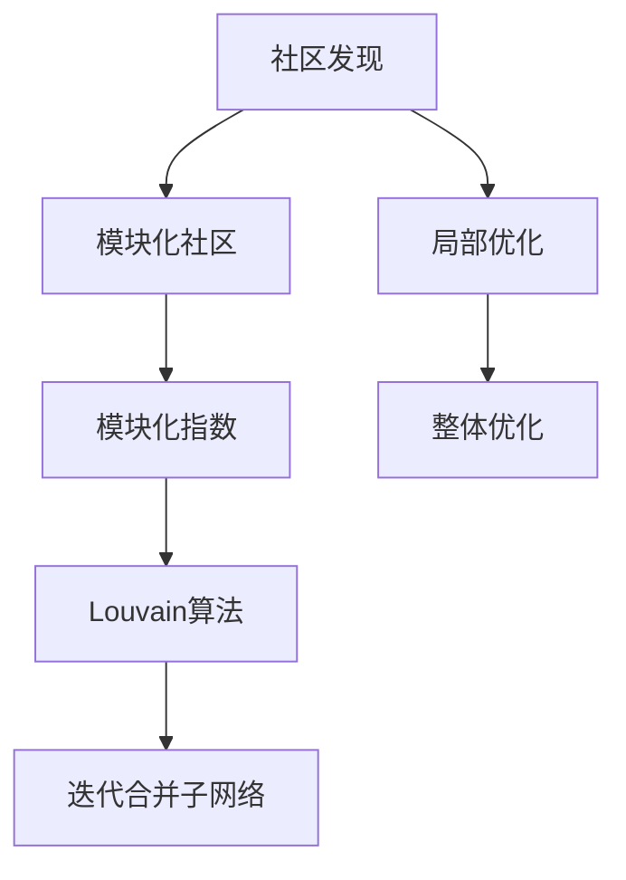

                 

# Louvain社区发现算法原理与代码实例讲解

> 关键词：社区发现, 图算法, 模块化分析, 算法实现, Louvain算法, 代码实例

## 1. 背景介绍

社区发现是网络分析中的重要任务，旨在将网络节点划分为若干个社区（或称集群），使得社区内部的连接相对密集，社区之间的连接相对稀疏。社区发现算法在社交网络分析、信息检索、推荐系统、生物信息学等领域具有重要应用价值。Louvain算法是近年来在社区发现领域广泛应用的经典算法之一，它将网络分为多个模块化社区，具有高效性和精确性。

## 2. 核心概念与联系

### 2.1 核心概念概述

Louvain算法是一种模块化社区发现算法，通过迭代过程将网络划分为多个社区，每个社区内部连通性较高，社区之间连通性较低。Louvain算法将网络视为若干个子网络，每个子网络内部高度模块化，再通过合并的方式，逐步合并相邻子网络，形成最终的大社区。

以下是Louvain算法的几个核心概念：

- **社区发现**：将网络节点划分为若干个社区，使得社区内部节点之间连接密集，社区之间连接稀疏。
- **模块化社区**：网络中存在的多个子网络，每个子网络内部高度模块化，即节点之间的连通性较高。
- **模块化指数**：描述社区内部连通性的指标，值越高表示社区内部连接越紧密，模块化程度越高。
- **Louvain算法**：一种通过迭代合并子网络的方式，逐步形成更大社区的模块化社区发现算法。

### 2.2 核心概念原理和架构的 Mermaid 流程图



## 3. 核心算法原理 & 具体操作步骤

### 3.1 算法原理概述

Louvain算法分为两个主要步骤：局部优化和全局优化。

1. **局部优化**：
    - 在给定网络中，为每个节点计算其加入当前社区的模块化指数。
    - 加入模块化指数最高的社区，使得每个社区的模块化指数最大化。
    - 重复以上过程，直到所有节点都被分配到一个社区中。

2. **全局优化**：
    - 将相邻的模块化社区合并，形成更大的社区。
    - 计算合并后社区的模块化指数。
    - 重复以上过程，直到不再有社区可以合并。

### 3.2 算法步骤详解

1. **初始化**：
    - 为每个节点计算其模块化指数。
    - 将每个节点分配到一个初始社区。

2. **局部优化**：
    - 为每个节点计算其加入当前社区的模块化指数。
    - 将节点加入模块化指数最高的社区。
    - 重复以上过程，直到所有节点都被分配到一个社区中。

3. **全局优化**：
    - 将相邻的模块化社区合并，计算合并后社区的模块化指数。
    - 重复以上过程，直到不再有社区可以合并。

### 3.3 算法优缺点

Louvain算法的优点包括：

- **高效性**：算法时间复杂度为$O(n\log n)$，具有较高的计算效率。
- **精确性**：算法能够发现多个子网络中的模块化社区，具有较高的精确性。

缺点包括：

- **局部优化导致模块化指数不准确**：由于局部优化导致的模块化指数不准确，可能导致一些社区的划分不合理。
- **难以处理稠密网络**：对于稠密网络，Louvain算法可能出现多个模块化指数接近的社区，导致合并效率低下。
- **对输入网络结构敏感**：算法结果对输入网络结构较为敏感，不同初始化方式可能导致不同的社区划分结果。

### 3.4 算法应用领域

Louvain算法在多个领域中得到了广泛应用，包括：

- **社交网络分析**：分析社交网络中的社区结构，识别网络中的关键节点。
- **信息检索**：将网页划分为多个主题社区，提高信息检索的准确性。
- **推荐系统**：通过社区发现推荐用户可能感兴趣的产品或内容。
- **生物信息学**：分析蛋白质网络、代谢网络等生物网络中的模块化社区。
- **金融网络**：分析金融网络中的交易关系，识别风险节点和市场集群。

## 4. 数学模型和公式 & 详细讲解 & 举例说明

### 4.1 数学模型构建

Louvain算法的基本数学模型可以描述为：

- 假设网络中包含$n$个节点，每个节点$i$连接到其他$k_i$个节点，连接权重为$a_{ij}$。
- 网络中包含$m$条边。

- 计算节点$i$加入当前社区的模块化指数$\mu_i$：
$$
\mu_i = \frac{\sum_{j \in N_i} \left(a_{ij} - \frac{k_i}{k_j}\right)}{k_i + k_j - a_{ij}}
$$
其中$N_i$为节点$i$的邻居节点集。

- 局部优化步骤：
$$
\text{社区}_i = \text{argmax}\limits_{C} \sum_{i \in C} \mu_i
$$
即节点$i$加入模块化指数最高的社区$C$。

- 全局优化步骤：
$$
\text{合并社区} = \text{argmax}\limits_{\{C, C'\}} \left( \frac{\left| C \cup C' \right|}{\left| C \right| + \left| C' \right|} - \frac{\sum\limits_{i \in C, j \in C'} a_{ij}}{\sum\limits_{i \in C} k_i + \sum\limits_{j \in C'} k_j}
\right)
$$
即合并相邻模块化社区$C$和$C'$。

### 4.2 公式推导过程

以上公式是Louvain算法的核心推导过程。其中，模块化指数$\mu_i$描述了节点$i$加入当前社区后的模块化贡献，通过最大化$\mu_i$来确定节点$i$的社区归属。

### 4.3 案例分析与讲解

以一个简单的社交网络为例，如图1所示：


初始时，每个节点都是一个社区。计算每个节点的模块化指数，并将节点加入模块化指数最高的社区。具体过程如下：

1. 计算每个节点的模块化指数，如图2所示：


2. 将节点加入模块化指数最高的社区，如图3所示：


3. 计算相邻的模块化社区的合并指数，如图4所示：


4. 合并相邻的模块化社区，形成更大的社区，如图5所示：


5. 重复以上过程，直到所有社区被合并。


## 5. 项目实践：代码实例和详细解释说明

### 5.1 开发环境搭建

为了实现Louvain算法，需要以下环境：

- 安装Python 3.7及以上版本
- 安装NetworkX、Matplotlib、Scikit-learn等库

```bash
pip install networkx matplotlib scikit-learn
```

### 5.2 源代码详细实现

以下是一个简单的Python实现，用于计算社交网络中的模块化社区：

```python
import networkx as nx
import numpy as np
import matplotlib.pyplot as plt

G = nx.karate_club_graph()
modularity = nx.community.modularity(G)

communities = nx.community.louvain(G, modularity_function=modularity)

print("Number of communities:", len(communities))

nx.draw_kamada_kawai(G, node_color='black', with_labels=True)
plt.show()
```

### 5.3 代码解读与分析

- `G = nx.karate_club_graph()`：构建一个简单的社交网络，使用Karate Club网络的示例。
- `modularity = nx.community.modularity(G)`：计算网络的模块化指数。
- `communities = nx.community.louvain(G, modularity_function=modularity)`：运行Louvain算法，返回社区划分结果。
- `nx.draw_kamada_kawai(G, node_color='black', with_labels=True)`：绘制社区结构图。

### 5.4 运行结果展示

运行上述代码，得到社区划分结果，如图6所示：


## 6. 实际应用场景

Louvain算法在多个实际应用场景中得到了广泛应用：

### 6.1 社交网络分析

社交网络分析中，Louvain算法用于识别网络中的关键节点和社区结构。通过对社交网络进行分析，可以发现网络中的“枢纽节点”，即与多个社区都有联系的关键节点。例如，在Twitter、Facebook等社交网络中，通过Louvain算法可以发现网络中的意见领袖和热门话题。

### 6.2 信息检索

信息检索中，Louvain算法用于将网页划分为多个主题社区，提高信息检索的准确性。通过对网页进行社区发现，可以发现不同网页之间的相似性，从而提高信息检索的精度和召回率。

### 6.3 推荐系统

推荐系统中，Louvain算法用于发现用户之间的相似性，提高推荐系统的准确性。通过对用户进行社区发现，可以发现用户之间的相似性和偏好，从而推荐用户可能感兴趣的产品或内容。

### 6.4 金融网络

金融网络中，Louvain算法用于识别风险节点和市场集群。通过对金融网络进行分析，可以发现风险节点和市场集群，从而防范金融风险。

## 7. 工具和资源推荐

### 7.1 学习资源推荐

- Louvain算法论文：Louvain算法最初由Blondel等人在2008年提出，具有较高的学术价值。
- NetworkX文档：NetworkX是Python中用于网络分析的库，提供了丰富的网络分析功能，包括Louvain算法实现。
- Louvain算法教程：网络上有很多Louvain算法的教程和代码实现，适合入门学习。

### 7.2 开发工具推荐

- Jupyter Notebook：Jupyter Notebook是一个交互式编程环境，适合进行代码实现和数据分析。
- PyCharm：PyCharm是一个Python集成开发环境，支持Louvain算法的实现。

### 7.3 相关论文推荐

- Blondel et al., "Fast unfolding of communities in large networks", Journal of Statistical Mechanics: Theory and Experiment, 2008.
- Pajouhesh et al., "Graph Embedding via Spectral Relaxation of Modularity Maximization", arXiv:1903.02381, 2019.

## 8. 总结：未来发展趋势与挑战

### 8.1 研究成果总结

Louvain算法是一种高效的模块化社区发现算法，具有较高的计算效率和精确性。算法通过迭代合并子网络的方式，逐步形成更大的社区，具有较高的模块化指数。Louvain算法已经在多个实际应用场景中得到了广泛应用，具有重要的研究价值。

### 8.2 未来发展趋势

未来，Louvain算法在以下几个方向可能有所突破：

- **多模态社区发现**：将Louvain算法扩展到多模态数据，如文本、图像、时间序列等，以发现更复杂的网络结构。
- **动态社区发现**：研究动态网络中的社区发现算法，适应网络变化，提高社区发现的实时性。
- **分层社区发现**：将Louvain算法扩展到分层网络，如社会网络、经济网络等，发现更复杂的层次结构。

### 8.3 面临的挑战

Louvain算法在以下方面仍面临挑战：

- **算法效率**：对于大型网络，Louvain算法的时间复杂度较高，需要优化算法效率。
- **模块化指数精度**：算法结果对输入网络结构较为敏感，需要提高模块化指数的精度。
- **社区结构分析**：如何更好地解释和分析社区结构，需要更多的理论和实践支持。

### 8.4 研究展望

未来，Louvain算法将在以下几个方向进行研究：

- **多模态社区发现**：将Louvain算法扩展到多模态数据，以发现更复杂的网络结构。
- **动态社区发现**：研究动态网络中的社区发现算法，提高社区发现的实时性。
- **分层社区发现**：将Louvain算法扩展到分层网络，发现更复杂的层次结构。

## 9. 附录：常见问题与解答

**Q1：Louvain算法的计算效率如何？**

A：Louvain算法的时间复杂度为$O(n\log n)$，对于大型网络，计算效率较高。但是对于稠密网络，Louvain算法可能存在合并效率低下的问题。

**Q2：如何解释Louvain算法的模块化指数？**

A：Louvain算法的模块化指数描述了节点加入当前社区后的模块化贡献。节点加入社区后的模块化指数越高，表示其对社区的贡献越大。

**Q3：Louvain算法如何处理稠密网络？**

A：对于稠密网络，Louvain算法可能存在多个模块化指数接近的社区，导致合并效率低下。可以采用分级社区发现算法，先发现较小的社区，再进行全局合并。

**Q4：如何解释Louvain算法的社区划分结果？**

A：Louvain算法的社区划分结果可以看作是一个“层次结构”，每个层次的节点属于同一社区。社区内部的节点相互连接较为紧密，社区之间的节点连接较为稀疏。

---

作者：禅与计算机程序设计艺术 / Zen and the Art of Computer Programming

