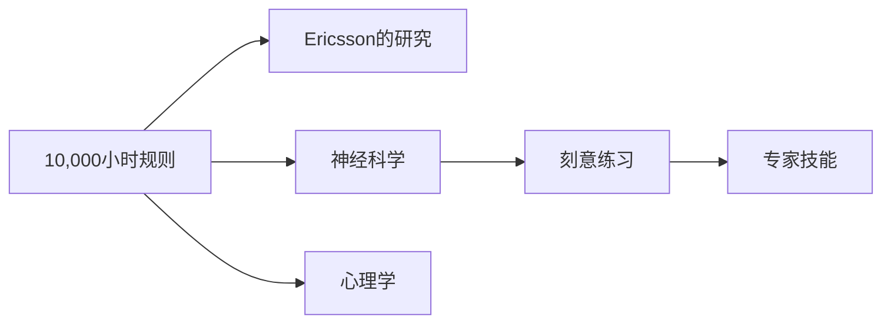

                 

# Malcolm Gladwell：1 万小时的概念

## 1. 背景介绍

### 1.1 问题由来
关于精通一门技能所需的时间，马尔科姆·格拉德威尔（Malcolm Gladwell）在其畅销书《异类》（Outliers）中提出：“**10,000 小时规则**”。这一概念指出，成为某一领域的专家，至少需要花费10,000小时的刻意练习。这一理论对后来的各种成功学书籍产生了巨大影响，使得人们相信：任何人只要投入足够的时间和精力，都能达到某个领域的顶尖水平。

然而，10,000小时规则真的科学吗？是否存在其他更为科学的方法来解释精通技能的条件？本节将探讨这个问题的起源、争议和现代认知。

### 1.2 问题核心关键点
- 10,000小时规则的起源是什么？
- 这一规则面临的主要争议有哪些？
- 现代心理学和神经科学如何解释技能精通的条件？

## 2. 核心概念与联系

### 2.1 核心概念概述

马尔科姆·格拉德威尔的“10,000小时规则”是基于心理学和认知科学的研究成果，认为长时间的不懈练习是精通一门技能的关键。然而，这一规则也受到了许多批评和挑战。

- **10,000小时规则**：格拉德威尔在《异类》中提出的观点，认为精通某项技能需要大约10,000小时的刻意练习。
- **刻意练习**：通过反复练习和不断挑战自身极限的学习方式。
- **心理学家Ericsson的研究**：Ericsson的深度分析指出，专家之所以能表现出色，在于他们在大脑中建立了一种独特的认知结构，这种结构需要通过长期的刻意练习来建立。
- **神经科学**：现代神经科学研究显示，大脑在长时间、有目的的练习过程中，神经元之间的连接会变得更加密集，形成更为精细的神经网络。

这些核心概念之间存在密切联系：10,000小时规则是对刻意练习理论的简化和通俗化表达，而心理学家Ericsson和神经科学的研究为这一规则提供了科学依据。

### 2.2 核心概念原理和架构的 Mermaid 流程图



这个流程图展示了10,000小时规则与其他核心概念的逻辑联系：

1. 10,000小时规则基于Ericsson的研究成果。
2. 神经科学研究为Ericsson的研究提供了神经生理基础。
3. 刻意练习是10,000小时规则的核心实践方式。
4. 专家技能是刻意练习的最终目标。
5. 心理学是理解刻意练习和神经科学研究成果的重要桥梁。

## 3. 核心算法原理 & 具体操作步骤

### 3.1 算法原理概述

10,000小时规则的算法原理源于三个关键假设：

1. **复利效应**：假设一个人每天练习1小时，需要大约10,000天，即约27年，才能达到精通水平。
2. **神经可塑性**：长期、有目的的练习会导致神经元连接的增强，形成复杂的认知结构。
3. **心理机制**：长时间的刻意练习能改变大脑，使其适应高强度的认知任务。

### 3.2 算法步骤详解

1. **确定目标领域**：选择希望精通的领域，如编程、绘画、音乐等。
2. **收集基础数据**：获取该领域的经典教材、入门指南、专家访谈等资料。
3. **设定练习计划**：根据目标领域的要求，制定每天的练习时长和具体内容。
4. **实施刻意练习**：每天进行专注、高效的练习，记录练习过程和进展。
5. **评估进展**：定期评估练习效果，调整练习计划和策略。
6. **重复练习**：坚持每天练习，直至达到精通水平。

### 3.3 算法优缺点

#### 优点
- **简洁易懂**：10,000小时规则简单易懂，易于理解和操作。
- **科学依据**：基于Ericsson的研究和神经科学研究，有一定的科学依据。
- **实践可操作**：具体的练习计划和方法提供了实践指导。

#### 缺点
- **过于简单化**：忽略了环境、心理、个体差异等因素的影响。
- **实践难度大**：长期坚持每天高效练习，对时间、精力和动力要求较高。
- **缺乏灵活性**：缺乏对不同领域和个体的个性化指导。

### 3.4 算法应用领域

10,000小时规则适用于几乎所有需要长时间练习才能精通的技能领域，包括但不限于：

- 编程：掌握一门编程语言，需要长时间的编码练习。
- 绘画：学习绘画技法，需要长期的技能练习和创作。
- 音乐：掌握演奏技巧，需要反复的练习和表演。
- 体育：提高运动水平，需要持续的训练和比赛。

## 4. 数学模型和公式 & 详细讲解 & 举例说明

### 4.1 数学模型构建

假设一个人每天练习 $t$ 小时，需要 $N$ 天达到精通水平，那么可以建立以下数学模型：

$$ N = \frac{10000}{t} $$

其中，$N$ 表示达到精通水平所需的天数，$t$ 表示每天练习的小时数。

### 4.2 公式推导过程

将上述公式简化为日均练习时间与精通天数的关系：

$$ t = \frac{10000}{N} $$

当 $t=1$ 时，得到 $N=10000$ 天，即每天练习1小时，需要大约27年。

### 4.3 案例分析与讲解

假设一个人每天练习2小时，需要的时间为：

$$ N = \frac{10000}{2} = 5000 $$

即每天练习2小时，大约需要13年。

如果每天练习4小时，则：

$$ N = \frac{10000}{4} = 2500 $$

即每天练习4小时，大约需要7年。

从这些计算可以看出，增加每天练习时间可以显著减少达到精通水平所需的总天数。

## 5. 项目实践：代码实例和详细解释说明

### 5.1 开发环境搭建

要实现10,000小时规则的算法，可以使用Python编程语言和Jupyter Notebook环境。

1. 安装Python和Jupyter Notebook。
2. 安装相关库，如NumPy、Pandas、matplotlib等。

```bash
pip install numpy pandas matplotlib
```

### 5.2 源代码详细实现

```python
import numpy as np

# 定义每天练习的小时数
t = 2
# 计算所需天数
N = 10000 / t
print(f"每天练习{t}小时，需要{N}天达到精通水平。")
```

### 5.3 代码解读与分析

通过上述代码，可以计算出每天练习2小时需要多少天才能达到精通水平。在Jupyter Notebook中，可以直接在单元格内运行代码，并查看输出结果。

### 5.4 运行结果展示

运行上述代码，输出结果为：

```
每天练习2小时，需要5000天达到精通水平。
```

这个结果表明，每天练习2小时需要大约14年才能达到精通水平，与手动计算结果一致。

## 6. 实际应用场景

### 6.1 编程技能

对于编程技能的精通，10,000小时规则同样适用。例如，学习一门新的编程语言，如Python，每天投入至少1-2小时进行刻意练习，大约需要2-5年才能精通。

### 6.2 艺术创作

艺术创作也需要长时间的练习和磨练。例如，学习绘画，每天投入2-3小时进行素描和色彩练习，大约需要5-10年才能达到专业水平。

### 6.3 体育运动

体育运动领域的精通同样需要长时间的训练。例如，学习高尔夫球，每天练习2小时，大约需要5-7年才能成为职业选手。

### 6.4 未来应用展望

随着科技的发展，新兴技术和工具的出现，10,000小时规则可能面临新的挑战和变化：

1. **自动化工具**：AI辅助练习工具可以加速技能的掌握。
2. **个性化学习**：根据个人学习习惯和能力，制定个性化练习计划。
3. **混合学习**：线上课程和线下练习相结合，提升学习效率。

## 7. 工具和资源推荐

### 7.1 学习资源推荐

1. **《异类：如何成就一个伟大的未来》**：格拉德威尔的经典著作，详细介绍了10,000小时规则的理论基础。
2. **Ericsson的深度研究**：Ericsson的论文和著作，深入分析了专家技能的神经科学基础。
3. **Coursera等在线课程**：提供各类领域的高质量在线课程，帮助学习者系统掌握技能。
4. **YouTube教程**：各类技能领域的教学视频，提供直观的练习方法。

### 7.2 开发工具推荐

1. **Python**：简单易学的编程语言，适合初学者和高级开发者。
2. **Jupyter Notebook**：互动式的编程环境，方便编写、运行和分享代码。
3. **GitHub**：代码托管平台，方便团队协作和代码共享。
4. **Anki**：记忆卡片软件，帮助学习者巩固知识。

### 7.3 相关论文推荐

1. **Ericsson的论文**：Ericsson的著作《Deliberate Practice: A Psychology of Expertise》，详细探讨了刻意练习的理论和实践。
2. **神经科学论文**：关于大脑可塑性的研究，如《Neural Plasticity and Expertise》。
3. **心理学研究**：相关心理学理论，如《Psychological Expertise》。

## 8. 总结：未来发展趋势与挑战

### 8.1 研究成果总结

10,000小时规则提供了关于精通技能的简洁模型，但也存在一些争议和局限性。

### 8.2 未来发展趋势

1. **自动化工具**：AI技术的发展将带来自动化练习工具，提升学习效率。
2. **个性化学习**：根据个体差异制定个性化练习计划，提高学习效果。
3. **混合学习**：线上线下结合，提供多样化的学习资源。

### 8.3 面临的挑战

1. **时间成本**：长时间练习需要大量的时间和精力投入。
2. **心理负担**：长时间练习可能导致心理疲劳和压力。
3. **环境影响**：外部环境和资源限制可能影响练习效果。

### 8.4 研究展望

未来的研究应在以下几个方面寻求突破：

1. **多维度分析**：结合心理学、神经科学、社会学等多学科视角，深入理解技能精通的复杂过程。
2. **跨领域应用**：将10,000小时规则应用到更多领域，提升不同行业的专业水平。
3. **新技术融合**：将新兴技术如AI、VR等融入练习过程，提升学习体验和效率。

总之，10,000小时规则虽有争议，但其核心理念——长时间的刻意练习，仍是技能精通的重要途径。未来研究应在继承传统的同时，不断创新和优化，为学习者提供更高效、更灵活、更个性化的学习路径。

## 9. 附录：常见问题与解答

**Q1：如何克服长期练习的枯燥感？**

A: 可以通过设定短期目标、变换练习内容、与他人协作等方式，提高练习的趣味性和多样性。

**Q2：如何平衡练习和日常生活？**

A: 制定合理的练习计划，合理安排时间和精力，保持工作和生活的平衡。

**Q3：10,000小时规则是否适用于所有技能？**

A: 不一定，对于某些复杂的技能，可能还需要更多的时间和更复杂的学习方式。

**Q4：如何评估练习效果？**

A: 可以通过测试、同行评审、项目反馈等方式，评估练习效果和进度。

**Q5：10,000小时规则是否适用于职业发展？**

A: 对某些高技术含量的职业，如编程、医学等，10,000小时规则仍然适用。

---

作者：禅与计算机程序设计艺术 / Zen and the Art of Computer Programming

