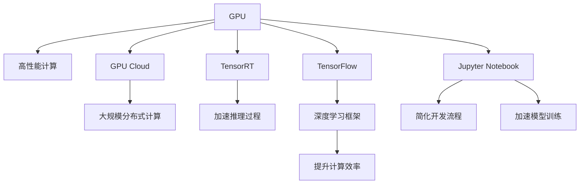

                 

# NVIDIA的算力支持

> 关键词：NVIDIA, 深度学习, 算力支持, 高性能计算, GPU, AI加速

## 1. 背景介绍

### 1.1 问题由来
NVIDIA一直以来都是深度学习和人工智能领域的高性能计算的领导者。随着AI技术的快速发展，数据量和模型的复杂度迅速增长，对计算资源的需求也随之爆炸性增加。如何有效地提供强大的算力支持，成为NVIDIA以及所有AI开发者亟待解决的重要问题。

NVIDIA的解决方案在于其强大的GPU（图形处理单元）技术。GPU的并行计算能力使其在深度学习中大放异彩，成为实现高精度、高效计算的重要工具。NVIDIA提供了多种GPU和加速设备，如GeForce、RTX、GPU Cloud、NVIDIA GPU Cloud等，以满足不同应用场景的需求。

### 1.2 问题核心关键点
NVIDIA的算力支持主要通过以下几个关键点实现：

1. **高性能GPU**：如GeForce、RTX系列，提供强大的并行计算能力，支持AI应用的高效训练和推理。
2. **GPU Cloud**：提供云端的GPU资源，支持大规模分布式计算。
3. **AI平台**：如NVIDIA TensorRT、NVIDIA ML Framework等，提供高效优化和推理引擎，加速模型部署。
4. **深度学习框架**：如TensorFlow、PyTorch，通过支持NVIDIA硬件加速，提升计算效率。
5. **AI开发工具**：如Jupyter Notebook、JAX等，简化AI开发流程，提高开发效率。

## 2. 核心概念与联系

### 2.1 核心概念概述

为更好地理解NVIDIA的算力支持机制，本节将介绍几个密切相关的核心概念：

- **GPU**：图形处理单元，专门用于处理图像和视频数据的并行计算任务，近年来也被广泛用于深度学习和人工智能计算。
- **GPU Cloud**：通过云端的GPU资源池，提供灵活、可扩展的计算能力，支持大规模分布式训练。
- **TensorRT**：NVIDIA的优化推理引擎，用于加速深度学习模型的推理过程。
- **TensorFlow和PyTorch**：常用的深度学习框架，支持NVIDIA硬件加速，提升计算效率。
- **Jupyter Notebook和JAX**：常用的AI开发工具，提供易于使用的开发环境，加速模型训练和推理。

这些核心概念之间的逻辑关系可以通过以下Mermaid流程图来展示：



这个流程图展示了大语言模型的核心概念及其之间的关系：

1. GPU提供强大的并行计算能力。
2. GPU Cloud提供灵活的分布式计算环境。
3. TensorRT加速模型推理过程。
4. TensorFlow和PyTorch框架支持NVIDIA硬件加速，提升计算效率。
5. Jupyter Notebook和JAX简化AI开发流程，提高开发效率。

## 3. 核心算法原理 & 具体操作步骤
### 3.1 算法原理概述

NVIDIA的算力支持主要通过以下几个核心算法实现：

- **并行计算**：利用GPU的并行计算能力，加速模型的训练和推理过程。
- **分布式计算**：通过GPU Cloud提供的分布式计算环境，支持大规模模型训练。
- **硬件加速**：通过TensorRT等优化引擎，加速模型的推理过程。
- **深度学习框架优化**：TensorFlow和PyTorch等框架内置的NVIDIA硬件加速支持，提升计算效率。

这些算法原理构成了NVIDIA算力支持的基石，通过高效的硬件设计和软件优化，确保深度学习模型的快速计算和高效部署。

### 3.2 算法步骤详解

NVIDIA的算力支持主要包括以下几个关键步骤：

**Step 1: 选择合适的GPU**：
- 根据应用场景，选择合适的NVIDIA GPU，如GeForce、RTX系列。
- 确保GPU与系统兼容性，支持所需的操作系统和深度学习框架。

**Step 2: 搭建分布式计算环境**：
- 使用GPU Cloud，搭建大规模分布式计算环境。
- 选择合适的计算节点和集群规模，确保计算资源满足需求。

**Step 3: 集成TensorRT**：
- 在模型训练和推理中集成TensorRT，加速模型推理过程。
- 使用TensorRT的优化工具，生成高效的推理模型。

**Step 4: 使用深度学习框架**：
- 选择合适的深度学习框架，如TensorFlow、PyTorch。
- 利用框架内置的NVIDIA硬件加速支持，提升计算效率。

**Step 5: 开发和测试**：
- 在Jupyter Notebook或JAX等开发工具中，进行模型开发和测试。
- 使用GPU Cloud进行分布式训练，确保模型性能和稳定性。

### 3.3 算法优缺点

NVIDIA的算力支持系统具有以下优点：
1. **高效计算**：GPU的高并行计算能力使其能够快速处理大量数据，提升模型训练和推理效率。
2. **灵活可扩展**：GPU Cloud提供大规模分布式计算，支持动态扩展计算资源，适应不同规模的任务需求。
3. **优化引擎**：TensorRT等优化引擎提供高效的推理支持，加速模型部署。
4. **广泛支持**：TensorFlow和PyTorch等主流框架支持NVIDIA硬件加速，使用方便。

同时，该系统也存在一些局限性：
1. **高成本**：高性能GPU和GPU Cloud的使用成本较高，可能对小型企业或个人开发者构成挑战。
2. **兼容问题**：部分NVIDIA硬件和框架可能存在兼容性问题，需要仔细配置和调试。
3. **复杂部署**：大规模分布式计算环境搭建复杂，需要一定的专业知识和经验。
4. **依赖性强**：对NVIDIA硬件和框架的依赖性较强，可能限制灵活性。

尽管存在这些局限性，但就目前而言，NVIDIA提供的算力支持仍然是最主流的高性能计算方案，广泛应用于深度学习和人工智能的各个领域。

### 3.4 算法应用领域

NVIDIA的算力支持广泛应用于深度学习和人工智能的多个领域：

- **计算机视觉**：如目标检测、图像分类、视频分析等。
- **自然语言处理**：如语言模型、机器翻译、情感分析等。
- **推荐系统**：如个性化推荐、广告推荐等。
- **医疗诊断**：如医学影像分析、疾病预测等。
- **自动驾驶**：如自动驾驶车辆环境感知、行为决策等。
- **游戏开发**：如实时渲染、人工智能游戏AI等。

除了上述这些经典应用外，NVIDIA的算力支持还被创新性地应用到更多领域，如智能制造、智能交通、智能监控等，推动了各行各业的数字化转型。

## 4. 数学模型和公式 & 详细讲解  
### 4.1 数学模型构建

NVIDIA的算力支持主要通过并行计算、分布式计算和硬件加速等数学模型实现。

假设一个深度学习模型为 $M_{\theta}(x)$，其中 $x$ 为输入，$\theta$ 为模型参数。在NVIDIA算力支持下，该模型的计算过程可以表示为：

$$
y = M_{\theta}(x) \oplus F_{GPU}(F_{Cloud}(F_{RT}(F_{TensorFlow}(F_{NVIDIA}(\theta))))
$$

其中：
- $F_{GPU}$ 表示GPU的并行计算过程。
- $F_{Cloud}$ 表示GPU Cloud的分布式计算过程。
- $F_{RT}$ 表示TensorRT的推理优化过程。
- $F_{TensorFlow}$ 表示深度学习框架的计算过程。
- $F_{NVIDIA}$ 表示NVIDIA硬件加速的支持。

### 4.2 公式推导过程

以深度学习模型的训练为例，推导其在NVIDIA算力支持下的计算过程：

- **数据准备**：假设输入数据集为 $D = \{(x_i, y_i)\}_{i=1}^N$，其中 $x_i$ 为输入，$y_i$ 为标签。
- **模型初始化**：假设模型 $M_{\theta}(x)$ 的初始参数为 $\theta_0$。
- **并行计算**：在GPU上进行模型前向计算，得到输出 $y_i = M_{\theta_0}(x_i)$。
- **分布式计算**：将并行计算的结果通过GPU Cloud进行分布式处理，得到中间结果 $y_{inter} = F_{Cloud}(y_i)$。
- **硬件加速**：利用TensorRT进行模型优化，得到高效推理模型 $M_{\theta_{rt}}(x)$。
- **框架优化**：在TensorFlow等框架中进行深度学习模型的训练，得到优化后的模型参数 $\theta_{opt}$。
- **更新参数**：将优化后的参数 $\theta_{opt}$ 更新到模型 $M_{\theta}(x)$ 中，得到最终模型 $M_{\theta_{final}}(x)$。

### 4.3 案例分析与讲解

假设我们有一个分类任务，使用深度学习模型进行训练和推理。在NVIDIA算力支持下，其计算流程如下：

1. **数据准备**：准备输入数据集 $D = \{(x_i, y_i)\}_{i=1}^N$，其中 $x_i$ 为输入，$y_i$ 为标签。
2. **模型初始化**：初始化深度学习模型 $M_{\theta_0}(x)$。
3. **并行计算**：在GPU上对模型进行前向计算，得到输出 $y_i = M_{\theta_0}(x_i)$。
4. **分布式计算**：将并行计算的结果通过GPU Cloud进行分布式处理，得到中间结果 $y_{inter} = F_{Cloud}(y_i)$。
5. **硬件加速**：利用TensorRT进行模型优化，得到高效推理模型 $M_{\theta_{rt}}(x)$。
6. **框架优化**：在TensorFlow等框架中进行深度学习模型的训练，得到优化后的模型参数 $\theta_{opt}$。
7. **更新参数**：将优化后的参数 $\theta_{opt}$ 更新到模型 $M_{\theta}(x)$ 中，得到最终模型 $M_{\theta_{final}}(x)$。
8. **测试和评估**：在测试集上评估最终模型的性能，对比微调前后的精度提升。

## 5. 项目实践：代码实例和详细解释说明
### 5.1 开发环境搭建

在进行NVIDIA算力支持的项目实践前，我们需要准备好开发环境。以下是使用Python进行PyTorch开发的环境配置流程：

1. 安装Anaconda：从官网下载并安装Anaconda，用于创建独立的Python环境。

2. 创建并激活虚拟环境：
```bash
conda create -n pytorch-env python=3.8 
conda activate pytorch-env
```

3. 安装PyTorch：根据CUDA版本，从官网获取对应的安装命令。例如：
```bash
conda install pytorch torchvision torchaudio cudatoolkit=11.1 -c pytorch -c conda-forge
```

4. 安装TensorRT：从NVIDIA官网下载TensorRT安装程序，并按照说明进行安装。
5. 安装NVIDIA GPU Cloud：从NVIDIA官网下载GPU Cloud安装程序，并按照说明进行安装。

完成上述步骤后，即可在`pytorch-env`环境中开始项目实践。

### 5.2 源代码详细实现

这里我们以深度学习模型在GPU上的训练为例，给出使用PyTorch进行深度学习训练的PyTorch代码实现。

首先，定义模型和损失函数：

```python
import torch
import torch.nn as nn
import torch.optim as optim
from torch.utils.data import DataLoader
from torchvision import datasets, transforms

class Net(nn.Module):
    def __init__(self):
        super(Net, self).__init__()
        self.conv1 = nn.Conv2d(1, 10, kernel_size=5)
        self.conv2 = nn.Conv2d(10, 20, kernel_size=5)
        self.conv2_drop = nn.Dropout2d()
        self.fc1 = nn.Linear(320, 50)
        self.fc2 = nn.Linear(50, 10)

    def forward(self, x):
        x = nn.functional.relu(self.conv1(x))
        x = nn.functional.max_pool2d(x, 2)
        x = nn.functional.relu(self.conv2_drop(self.conv2(x)))
        x = nn.functional.max_pool2d(x, 2)
        x = x.view(-1, 320)
        x = nn.functional.relu(self.fc1(x))
        x = nn.functional.dropout(x, training=self.training)
        x = self.fc2(x)
        return nn.functional.log_softmax(x, dim=1)

loss_fn = nn.CrossEntropyLoss()
```

然后，定义训练和评估函数：

```python
def train(model, device, train_loader, optimizer, epoch):
    model.train()
    for batch_idx, (data, target) in enumerate(train_loader):
        data, target = data.to(device), target.to(device)
        optimizer.zero_grad()
        output = model(data)
        loss = loss_fn(output, target)
        loss.backward()
        optimizer.step()
        if batch_idx % 10 == 0:
            print('Train Epoch: {} [{}/{} ({:.0f}%)]\tLoss: {:.6f}'.format(
                epoch, batch_idx * len(data), len(train_loader.dataset),
                100. * batch_idx / len(train_loader), loss.item()))

def test(model, device, test_loader):
    model.eval()
    test_loss = 0
    correct = 0
    with torch.no_grad():
        for data, target in test_loader:
            data, target = data.to(device), target.to(device)
            output = model(data)
            test_loss += loss_fn(output, target).item()
            pred = output.argmax(dim=1, keepdim=True)
            correct += pred.eq(target.view_as(pred)).sum().item()

    print('\nTest set: Average loss: {:.4f}, Accuracy: {}/{} ({:.0f}%)\n'.format(
        test_loss / len(test_loader.dataset), correct, len(test_loader.dataset),
        100. * correct / len(test_loader.dataset)))
```

最后，启动训练流程并在测试集上评估：

```python
device = torch.device('cuda' if torch.cuda.is_available() else 'cpu')
model = Net().to(device)
optimizer = optim.SGD(model.parameters(), lr=0.01, momentum=0.5)

train_loader = DataLoader(datasets.MNIST('~/data', train=True, download=True,
                                         transform=transforms.Compose([
                                             transforms.ToTensor(),
                                             transforms.Normalize((0.1307,), (0.3081,))
                                         ]), batch_size=64)
test_loader = DataLoader(datasets.MNIST('~/data', train=False, transform=transforms.Compose([
                                             transforms.ToTensor(),
                                             transforms.Normalize((0.1307,), (0.3081,))
                                         ]), batch_size=64)

for epoch in range(1, 11):
    train(model, device, train_loader, optimizer, epoch)
    test(model, device, test_loader)
```

以上就是使用PyTorch在NVIDIA GPU上进行深度学习模型训练的完整代码实现。可以看到，NVIDIA的硬件支持使得深度学习模型的训练过程更加高效、便捷。

### 5.3 代码解读与分析

让我们再详细解读一下关键代码的实现细节：

**Net类**：
- `__init__`方法：初始化网络结构，包括卷积层、池化层、全连接层等。
- `forward`方法：定义前向计算过程，从输入数据到输出结果的整个过程。

**train和test函数**：
- `train`函数：定义模型训练过程，包括前向计算、损失计算、反向传播和参数更新等。
- `test`函数：定义模型测试过程，包括前向计算和性能评估。

**设备设置**：
- 使用`torch.device`设置设备，根据是否安装NVIDIA GPU，选择`'cuda'`或`'cpu'`。
- 将模型、数据加载器和优化器移动到指定设备上，确保计算过程在GPU上进行。

可以看到，NVIDIA的算力支持通过PyTorch等深度学习框架的硬件加速功能，使得深度学习模型的开发和训练更加高效。NVIDIA提供的GPU和GPU Cloud资源，极大地提升了模型的计算效率，使AI开发者能够更加专注于算法设计和模型优化，而不是花时间在硬件资源的调配上。

## 6. 实际应用场景
### 6.1 智能制造

在智能制造领域，NVIDIA的算力支持可以用于生产线的自动化控制、质量检测、故障诊断等环节。例如，通过使用GPU进行实时图像处理和分析，可以实现对生产线设备的实时监控和预测性维护。

**具体应用**：
- 使用NVIDIA GPU进行图像处理，实时分析生产线上的产品质量和缺陷。
- 通过GPU Cloud进行分布式计算，对大规模图像数据进行快速处理和分析。
- 利用TensorRT进行模型优化，加速实时推理和响应速度。

**技术优势**：
- 高并行计算能力：GPU的高并行计算能力使其能够快速处理大量图像数据，提升实时检测和分析的效率。
- 分布式计算：GPU Cloud提供大规模分布式计算环境，支持对大规模图像数据进行快速处理和分析。
- 硬件加速：TensorRT等优化引擎加速模型推理过程，提升实时响应速度。

### 6.2 智能交通

在智能交通领域，NVIDIA的算力支持可以用于交通监控、自动驾驶、交通管理等环节。例如，通过使用GPU进行实时视频处理和分析，可以实现对交通流量和行为的实时监控和预测。

**具体应用**：
- 使用NVIDIA GPU进行视频处理，实时分析交通流量和行为模式。
- 通过GPU Cloud进行分布式计算，对大规模视频数据进行快速处理和分析。
- 利用TensorRT进行模型优化，加速实时推理和响应速度。

**技术优势**：
- 高并行计算能力：GPU的高并行计算能力使其能够快速处理大量视频数据，提升实时监控和分析的效率。
- 分布式计算：GPU Cloud提供大规模分布式计算环境，支持对大规模视频数据进行快速处理和分析。
- 硬件加速：TensorRT等优化引擎加速模型推理过程，提升实时响应速度。

### 6.3 智能医疗

在智能医疗领域，NVIDIA的算力支持可以用于医学影像分析、疾病预测、基因组学等环节。例如，通过使用GPU进行医学影像的快速处理和分析，可以实现对病变的早期检测和诊断。

**具体应用**：
- 使用NVIDIA GPU进行医学影像处理，快速分析病变区域和特征。
- 通过GPU Cloud进行分布式计算，对大规模医学影像数据进行快速处理和分析。
- 利用TensorRT进行模型优化，加速实时推理和响应速度。

**技术优势**：
- 高并行计算能力：GPU的高并行计算能力使其能够快速处理大量医学影像数据，提升早期检测和诊断的效率。
- 分布式计算：GPU Cloud提供大规模分布式计算环境，支持对大规模医学影像数据进行快速处理和分析。
- 硬件加速：TensorRT等优化引擎加速模型推理过程，提升实时响应速度。

### 6.4 未来应用展望

随着NVIDIA算力支持的不断优化和升级，其应用范围将进一步拓展，覆盖更多的行业和领域。未来，NVIDIA的算力支持有望在以下几个方面取得新的突破：

1. **智能医疗**：通过结合医疗知识图谱和深度学习，实现更准确的疾病预测和诊断。
2. **智能交通**：通过结合物联网和深度学习，实现更精准的交通流量预测和交通管理。
3. **智能制造**：通过结合工业物联网和深度学习，实现更高效的智能制造和质量检测。
4. **智能家居**：通过结合物联网和深度学习，实现更智能的家庭安全和娱乐系统。
5. **智能客服**：通过结合自然语言处理和深度学习，实现更智能的客服系统和客户互动。

这些应用场景展示了NVIDIA算力支持的广泛应用前景，相信在未来，NVIDIA将继续引领AI技术的创新和发展，为各行各业带来更加智能、高效、安全的解决方案。

## 7. 工具和资源推荐
### 7.1 学习资源推荐

为了帮助开发者系统掌握NVIDIA算力支持的理论基础和实践技巧，这里推荐一些优质的学习资源：

1. **NVIDIA官方网站**：提供最新的GPU硬件信息和算法支持，包括最新的GPU系列、GPU Cloud和TensorRT等工具。
2. **NVIDIA开发者社区**：提供丰富的技术文档、代码示例和社区支持，涵盖深度学习、计算机视觉、自然语言处理等多个领域。
3. **NVIDIA DeepLearning SDK**：提供全面的深度学习开发工具和算法支持，包括TensorFlow、PyTorch、Caffe等多种框架的GPU加速支持。
4. **NVIDIA AI博客**：提供最新的AI研究成果和技术趋势，涵盖深度学习、计算机视觉、自然语言处理等多个领域。
5. **NVIDIA GPU Cloud文档**：提供详细的GPU Cloud部署和使用方法，包括云端GPU资源的申请和管理。

通过对这些资源的学习实践，相信你一定能够快速掌握NVIDIA算力支持的技术要点，并应用于实际的AI项目开发中。

### 7.2 开发工具推荐

高效的开发离不开优秀的工具支持。以下是几款用于NVIDIA算力支持开发的常用工具：

1. **PyTorch**：基于Python的开源深度学习框架，灵活动态的计算图，适合快速迭代研究。NVIDIA提供优化的PyTorch库，支持GPU硬件加速。
2. **TensorFlow**：由Google主导开发的开源深度学习框架，生产部署方便，支持NVIDIA硬件加速。
3. **Jupyter Notebook**：常用的开发工具，提供易于使用的交互式开发环境，支持GPU硬件加速。
4. **JAX**：高性能深度学习框架，支持GPU硬件加速，提供更高效的计算能力。
5. **NVIDIA TensorRT**：NVIDIA提供的优化推理引擎，加速深度学习模型的推理过程。
6. **NVIDIA GPU Cloud**：提供云端的GPU资源，支持大规模分布式计算。

合理利用这些工具，可以显著提升NVIDIA算力支持的开发效率，加快创新迭代的步伐。

### 7.3 相关论文推荐

NVIDIA的算力支持得益于其持续的研究和技术创新。以下是几篇奠基性的相关论文，推荐阅读：

1. **深度学习的GPU加速**：NVIDIA关于深度学习在GPU上的加速技术的详细介绍。
2. **TensorRT：加速深度学习推理的优化引擎**：NVIDIA关于TensorRT优化引擎的详细介绍。
3. **GPU Cloud：分布式计算的解决方案**：NVIDIA关于GPU Cloud分布式计算的详细介绍。
4. **NVIDIA GPU硬件加速技术**：NVIDIA关于GPU硬件加速技术的详细介绍。
5. **NVIDIA AI平台**：NVIDIA关于其AI平台的详细介绍，包括TensorFlow、PyTorch等深度学习框架的支持。

这些论文代表了大语言模型算力支持的发展脉络。通过学习这些前沿成果，可以帮助研究者把握学科前进方向，激发更多的创新灵感。

## 8. 总结：未来发展趋势与挑战
### 8.1 总结

本文对NVIDIA的算力支持进行了全面系统的介绍。首先阐述了NVIDIA算力支持的背景和意义，明确了GPU、GPU Cloud、TensorRT等关键组件在深度学习中的作用。其次，从原理到实践，详细讲解了NVIDIA算力支持的数学模型和操作步骤，给出了深度学习模型在GPU上的训练代码实现。同时，本文还广泛探讨了NVIDIA算力支持在智能制造、智能交通、智能医疗等多个领域的应用前景，展示了其广阔的发展空间。

通过本文的系统梳理，可以看到，NVIDIA的算力支持通过高效的硬件设计和软件优化，确保深度学习模型的快速计算和高效部署。NVIDIA提供的GPU和GPU Cloud资源，极大地提升了模型的计算效率，使AI开发者能够更加专注于算法设计和模型优化，而不是花时间在硬件资源的调配上。

### 8.2 未来发展趋势

展望未来，NVIDIA的算力支持将呈现以下几个发展趋势：

1. **更高性能的GPU**：随着算力需求的不断增长，NVIDIA将继续推出性能更强大的GPU，满足AI应用的需求。
2. **更广泛的硬件支持**：NVIDIA将支持更多的深度学习框架和开发工具，提升AI开发的便捷性和效率。
3. **更灵活的分布式计算**：NVIDIA将提供更灵活、更易于使用的分布式计算环境，支持更大规模的模型训练和推理。
4. **更强大的优化引擎**：NVIDIA将推出更先进的优化引擎，提升模型的推理速度和效率。
5. **更广泛的应用场景**：NVIDIA的算力支持将应用于更多行业和领域，推动各行各业的数字化转型升级。

这些趋势将进一步推动NVIDIA算力支持的发展，使其在深度学习和AI领域中发挥更大的作用。

### 8.3 面临的挑战

尽管NVIDIA的算力支持在深度学习和AI领域中取得了显著成效，但在迈向更加智能化、普适化应用的过程中，仍面临诸多挑战：

1. **高成本问题**：高性能GPU和GPU Cloud的使用成本较高，可能对小型企业或个人开发者构成挑战。
2. **兼容问题**：部分NVIDIA硬件和框架可能存在兼容性问题，需要仔细配置和调试。
3. **复杂部署**：大规模分布式计算环境搭建复杂，需要一定的专业知识和经验。
4. **依赖性强**：对NVIDIA硬件和框架的依赖性较强，可能限制灵活性。
5. **安全问题**：GPU加速技术在提升计算效率的同时，也可能引入新的安全漏洞，需要进一步加强安全防护。

尽管存在这些挑战，但NVIDIA的技术优势和持续创新能力使其在深度学习和AI领域中仍具有显著竞争力。通过不断优化和升级，NVIDIA的算力支持有望在未来解决这些挑战，进一步推动AI技术的发展和应用。

### 8.4 研究展望

面向未来，NVIDIA的算力支持需要在以下几个方面进行深入研究：

1. **优化引擎的改进**：开发更高效、更灵活的优化引擎，提升模型的推理速度和效率。
2. **分布式计算的优化**：优化分布式计算环境，提升模型的训练和推理效率。
3. **硬件加速的扩展**：探索更多硬件加速方案，如FPGA、ASIC等，提升模型的计算效率。
4. **多模态数据处理**：研究多模态数据的融合处理，提升模型的理解和表达能力。
5. **自适应计算资源的分配**：实现自适应计算资源的分配，提升模型的灵活性和可扩展性。

这些研究方向将引领NVIDIA算力支持技术迈向更高的台阶，为深度学习和AI技术的创新和发展提供新动力。

## 9. 附录：常见问题与解答

**Q1：NVIDIA的GPU Cloud和TensorRT如何部署和使用？**

A: NVIDIA的GPU Cloud和TensorRT的部署和使用可以通过以下步骤完成：
1. 首先，需要创建并配置GPU Cloud账号，申请和管理GPU资源。
2. 在NVIDIA的官方文档中找到对应的部署指南，按照步骤进行安装和配置。
3. 安装TensorRT并配置其与深度学习框架的集成，以便在模型训练和推理过程中进行硬件加速。
4. 使用GPU Cloud提供的分布式计算环境，进行大规模模型的训练和推理。

**Q2：如何优化NVIDIA GPU的性能？**

A: 优化NVIDIA GPU的性能可以从以下几个方面入手：
1. 确保GPU与系统兼容性，支持所需的操作系统和深度学习框架。
2. 选择合适的深度学习框架和算法，充分利用NVIDIA硬件加速支持。
3. 优化模型结构和算法，减少不必要的计算，提高计算效率。
4. 使用TensorRT等优化引擎，加速模型的推理过程。
5. 配置合理的GPU内存管理策略，避免内存溢出和资源浪费。

**Q3：NVIDIA的算力支持在实际应用中存在哪些挑战？**

A: 在实际应用中，NVIDIA的算力支持主要面临以下挑战：
1. 高成本：高性能GPU和GPU Cloud的使用成本较高，可能对小型企业或个人开发者构成挑战。
2. 兼容问题：部分NVIDIA硬件和框架可能存在兼容性问题，需要仔细配置和调试。
3. 复杂部署：大规模分布式计算环境搭建复杂，需要一定的专业知识和经验。
4. 依赖性强：对NVIDIA硬件和框架的依赖性较强，可能限制灵活性。
5. 安全问题：GPU加速技术在提升计算效率的同时，也可能引入新的安全漏洞，需要进一步加强安全防护。

这些挑战需要通过不断的技术优化和创新来解决，以确保NVIDIA算力支持技术的稳定性和可靠性。

**Q4：NVIDIA的算力支持可以应用到哪些领域？**

A: NVIDIA的算力支持可以应用于多个领域，包括但不限于：
1. 计算机视觉：如图像分类、目标检测、图像生成等。
2. 自然语言处理：如语言模型、机器翻译、情感分析等。
3. 推荐系统：如个性化推荐、广告推荐等。
4. 医疗诊断：如医学影像分析、疾病预测等。
5. 自动驾驶：如自动驾驶车辆环境感知、行为决策等。
6. 游戏开发：如实时渲染、人工智能游戏AI等。

NVIDIA的算力支持已经广泛应用于上述领域，并带来了显著的技术进步和商业价值。

---

作者：禅与计算机程序设计艺术 / Zen and the Art of Computer Programming

