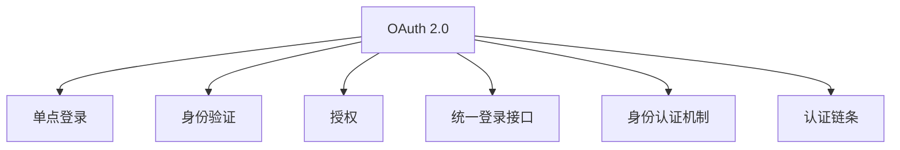

                 

# OAuth 2.0 的单点登录功能

> 关键词：OAuth 2.0, 单点登录(SSO), 身份验证, 授权, 统一登录接口, 用户账户管理, 安全, 身份认证机制, 认证链条

## 1. 背景介绍

### 1.1 问题由来
在当今互联网时代，用户需要在各种网站和应用之间频繁切换身份，输入用户名和密码。这种方式既繁琐又易造成安全问题。例如，用户登录一个网站后，重新登录另一个网站时，需要再次输入用户名和密码，不仅用户体验差，还容易泄露敏感信息。

为了解决这些问题，**单点登录**（Single Sign-On，SSO）应运而生。单点登录允许用户在一个认证站点上完成身份验证后，无需再次登录，即可访问多个信任站点。这种机制大大提升了用户体验，增强了安全性，成为企业级应用广泛采用的身份认证手段。

OAuth 2.0是一种授权框架，旨在使第三方应用程序能够访问用户资源，而不直接涉及用户账户。它由多个角色组成：资源所有者（Resource Owner）、客户端（Client）、授权服务器（Authorization Server）和资源服务器（Resource Server）。本文将重点介绍OAuth 2.0如何在单点登录中使用，以提升用户体验和系统安全性。

### 1.2 问题核心关键点
OAuth 2.0实现单点登录的核心关键点包括：

- **统一登录接口**：用户只需在一个认证站点上完成登录，即可访问多个网站。
- **授权机制**：通过OAuth 2.0的授权流程，资源所有者能够安全地授权第三方应用程序访问其资源。
- **身份验证与授权分离**：用户的身份验证和授权由认证服务器（Identity Server）和授权服务器（Authorization Server）分别处理，提高了系统的安全性。
- **信任链条**：认证服务器和授权服务器之间的信任关系，保障了用户数据的隐私和安全。

## 2. 核心概念与联系

### 2.1 核心概念概述

为了更好地理解OAuth 2.0的单点登录功能，本节将介绍几个密切相关的核心概念：

- **OAuth 2.0**：一个授权框架，旨在使第三方应用程序能够访问用户资源，而不直接涉及用户账户。OAuth 2.0支持四种授权模式：授权码模式、隐式模式、密码模式和客户端凭证模式。

- **单点登录（SSO）**：用户在一个认证站点完成身份验证后，无需再次登录即可访问多个信任站点。单点登录通常通过OAuth 2.0实现。

- **身份验证（Authentication）**：确认用户身份的过程，通常通过用户名和密码或生物识别等方式进行。

- **授权（Authorization）**：用户授权第三方应用程序访问其资源的过程，通过OAuth 2.0的授权流程实现。

- **统一登录接口**：用户只需在一个认证站点完成登录，即可访问多个信任站点。

- **身份认证机制（Identity Authentication Mechanism）**：用于验证用户身份的机制，包括用户名和密码、生物识别等。

- **认证链条（Authentication Chain）**：用户在多个信任站点间切换时，认证服务器和授权服务器之间的信任关系。

这些概念之间的逻辑关系可以通过以下Mermaid流程图来展示：



这个流程图展示了OAuth 2.0的核心概念及其之间的关系：

1. OAuth 2.0通过授权流程实现授权机制，支持多种授权模式。
2. 单点登录依赖OAuth 2.0实现，用户只需在一个认证站点完成身份验证。
3. 身份验证和授权由认证服务器和授权服务器分别处理。
4. 统一登录接口支持用户跨多个信任站点切换。
5. 身份认证机制和认证链条保障了系统的安全性和用户体验。

这些概念共同构成了OAuth 2.0的单点登录功能，使得用户能够在多个站点间无缝切换，同时保障了系统的安全性和可靠性。

## 3. 核心算法原理 & 具体操作步骤
### 3.1 算法原理概述

OAuth 2.0实现单点登录的算法原理主要涉及以下几个步骤：

1. **用户身份验证**：用户在认证服务器（Identity Server）上完成身份验证，获取认证信息。
2. **授权请求**：用户授权第三方应用程序访问其资源。
3. **授权服务器授权**：授权服务器（Authorization Server）根据授权请求，返回授权码或令牌。
4. **第三方应用程序访问**：第三方应用程序使用授权码或令牌访问资源服务器（Resource Server），获取用户资源。

这些步骤通过OAuth 2.0的授权流程实现，保障了用户数据的隐私和安全。

### 3.2 算法步骤详解

**Step 1: 用户身份验证**

用户登录到认证服务器，提交用户名和密码。认证服务器验证用户身份，生成认证信息，如OAuth令牌（Access Token）和刷新令牌（Refresh Token）。认证信息存储在Cookie或Session中。

**Step 2: 授权请求**

用户访问需要使用OAuth 2.0授权的第三方应用程序。应用程序重定向用户到授权服务器，请求授权。用户选择授权选项，并同意应用程序访问其资源。

**Step 3: 授权服务器授权**

授权服务器验证用户的授权请求，返回授权码（Authorization Code）或令牌（Token）。授权码是一个短期的安全代码，用于后续的令牌获取。

**Step 4: 第三方应用程序访问**

应用程序使用授权码请求令牌，令牌用于访问资源服务器上的用户资源。资源服务器验证令牌的有效性，并返回用户资源。

以上步骤通过OAuth 2.0的授权流程实现，保障了用户数据的隐私和安全。

### 3.3 算法优缺点

OAuth 2.0实现单点登录的优势包括：

1. **提升用户体验**：用户只需在一个认证站点上完成身份验证，即可访问多个信任站点。
2. **增强安全性**：通过授权流程，用户授权第三方应用程序访问其资源，保障了用户数据的隐私。
3. **支持多种授权模式**：OAuth 2.0支持授权码模式、隐式模式、密码模式和客户端凭证模式，适用于不同应用场景。
4. **灵活性高**：OAuth 2.0可以与其他身份认证机制（如SAML）结合使用，增强系统的灵活性。

同时，OAuth 2.0也存在一些局限性：

1. **复杂度高**：OAuth 2.0的授权流程较复杂，需要设计和实现多个组件，增加了系统的复杂度。
2. **依赖第三方**：依赖OAuth 2.0的授权服务器和资源服务器，系统扩展性受限。
3. **授权码安全风险**：授权码的有效期有限，且需要传输到第三方应用程序，存在一定的安全风险。

### 3.4 算法应用领域

OAuth 2.0的单点登录功能在企业级应用中广泛应用，如：

- **企业内部应用**：企业内部员工只需在一个认证站点上完成身份验证，即可访问多个内部系统。
- **第三方登录**：用户可以使用第三方身份认证站点（如Google、Facebook）登录应用，避免了多次输入用户名和密码。
- **云服务**：用户在云服务提供商（如AWS、Azure）上完成身份验证，即可访问多个云服务。

这些应用场景都需要提升用户体验和保障系统安全性，OAuth 2.0的单点登录功能提供了高效、安全的解决方案。

## 4. 数学模型和公式 & 详细讲解 & 举例说明

### 4.1 数学模型构建

OAuth 2.0的授权流程涉及多个角色和流程，可以通过数学模型来表示：

1. **认证流程**：用户提交用户名和密码，认证服务器生成认证信息。
2. **授权流程**：用户授权第三方应用程序访问其资源，授权服务器返回授权码或令牌。
3. **令牌获取流程**：第三方应用程序使用授权码请求令牌，资源服务器返回用户资源。

### 4.2 公式推导过程

**认证流程**

假设用户提交的用户名为 $u$，密码为 $p$，认证服务器生成的认证信息为 $(u, p)$。

**授权流程**

假设用户同意第三方应用程序访问其资源，授权服务器生成的授权码为 $c$。

**令牌获取流程**

假设第三方应用程序使用授权码 $c$ 请求令牌，令牌为 $t$，资源服务器返回用户资源 $R$。

### 4.3 案例分析与讲解

**案例1：授权码模式**

授权码模式是最常见的OAuth 2.0授权模式，适用于客户端应用程序。其流程如下：

1. 用户登录到认证服务器，提交用户名和密码。
2. 认证服务器验证用户身份，生成认证信息 $(u, p)$。
3. 认证服务器生成授权码 $c$。
4. 第三方应用程序重定向用户到授权服务器，请求授权。
5. 用户同意授权，授权服务器返回授权码 $c$。
6. 第三方应用程序使用授权码 $c$ 请求令牌 $t$，资源服务器返回用户资源 $R$。

**案例2：隐式模式**

隐式模式适用于无需后端服务器的移动应用程序。其流程如下：

1. 用户登录到认证服务器，提交用户名和密码。
2. 认证服务器验证用户身份，生成认证信息 $(u, p)$。
3. 认证服务器生成令牌 $t$。
4. 第三方应用程序重定向用户到授权服务器，请求授权。
5. 用户同意授权，授权服务器返回令牌 $t$。
6. 第三方应用程序使用令牌 $t$ 访问资源服务器，获取用户资源 $R$。

这些案例展示了OAuth 2.0的授权流程和单点登录功能，通过授权码和令牌，实现了用户的身份验证和授权，保障了用户数据的隐私和安全。

## 5. 项目实践：代码实例和详细解释说明
### 5.1 开发环境搭建

要进行OAuth 2.0的单点登录功能开发，需要先搭建好开发环境。以下是Python环境搭建流程：

1. 安装Python 3.x。建议使用最新版本的Python，确保能兼容最新的OAuth 2.0库。
2. 安装OAuth 2.0库。可以使用pip命令安装OAuthlib库，这是一个支持OAuth 2.0的Python库。
3. 安装Flask框架。Flask是一个轻量级的Python Web框架，适用于构建OAuth 2.0服务器。

### 5.2 源代码详细实现

以下是一个简单的OAuth 2.0服务器实现，用于支持授权码模式：

```python
from flask import Flask, redirect, url_for, request
from oauthlib.oauth2 import BackendApplicationClient
from oauthlib.oauth2.rfc6749 import OAuth2Session

app = Flask(__name__)

# OAuth 2.0客户端
client = BackendApplicationClient(client_id='your_client_id', client_secret='your_client_secret')

# 授权码请求处理函数
@app.route('/oauth2/authorize')
def authorize():
    # 构建OAuth 2.0会话
    oauth = OAuth2Session(client)
    # 请求授权
    authorization_url, state = oauth.authorization_url('https://your_authorization_server.com/oauth2/authorize')
    # 重定向到授权服务器
    return redirect(authorization_url)

# 令牌请求处理函数
@app.route('/oauth2/token', methods=['POST'])
def token():
    # 构建OAuth 2.0会话
    oauth = OAuth2Session(client)
    # 解析请求参数
    code = request.json.get('code')
    # 获取令牌
    token = oauth.fetch_token('https://your_authorization_server.com/oauth2/token', code=code, client_secret='your_client_secret')
    # 返回令牌
    return token

if __name__ == '__main__':
    app.run(debug=True)
```

### 5.3 代码解读与分析

**Flask框架**：
Flask是一个轻量级的Python Web框架，适合用于构建OAuth 2.0服务器。

**OAuth 2.0库**：
OAuth 2.0库提供了一组标准API，用于构建OAuth 2.0客户端和服务器。

**授权码模式**：
授权码模式是OAuth 2.0最常见的授权模式，用户通过授权服务器获得授权码，然后将其交给第三方应用程序，用于请求令牌。

**令牌请求处理函数**：
令牌请求处理函数使用OAuth 2.0库中的fetch_token方法，根据授权码和客户端秘密，获取令牌。

### 5.4 运行结果展示

运行以上代码，启动Flask服务器。用户可以通过浏览器访问授权码请求处理函数，重定向到授权服务器请求授权。授权成功后，用户可以使用令牌请求处理函数获取令牌，进而访问资源服务器上的用户资源。

## 6. 实际应用场景

### 6.1 企业内部应用

企业内部员工只需在一个认证站点上完成身份验证，即可访问多个内部系统。例如，企业员工可以使用单点登录功能访问OA系统、邮件系统、CRM系统等。这种机制大大提升了企业的管理效率，提高了员工的体验。

### 6.2 第三方登录

用户可以使用第三方身份认证站点（如Google、Facebook）登录应用，避免了多次输入用户名和密码。例如，用户可以使用Google登录电商平台，购买商品，无需再次输入用户名和密码，提高了用户体验。

### 6.3 云服务

用户在云服务提供商（如AWS、Azure）上完成身份验证，即可访问多个云服务。例如，用户可以使用单点登录功能访问AWS S3存储桶、Azure虚拟机等。这种机制使得用户可以更加灵活地使用云服务，提高了系统的可用性。

## 7. 工具和资源推荐
### 7.1 学习资源推荐

为了帮助开发者系统掌握OAuth 2.0的单点登录功能，这里推荐一些优质的学习资源：

1. **OAuth 2.0官方文档**：OAuth 2.0官方文档提供了详细的授权流程和API参考，是学习OAuth 2.0的基础。
2. **Flask官方文档**：Flask官方文档提供了如何使用Flask构建OAuth 2.0服务器的指导，适合初学者学习。
3. **OAuth 2.0中文版博客**：OAuth 2.0中文博客提供了大量的实践案例和代码示例，帮助开发者理解OAuth 2.0的实际应用。
4. **OAuth 2.0实战指南**：OAuth 2.0实战指南提供了OAuth 2.0的详细介绍和案例分析，适合进阶学习。

通过对这些资源的学习实践，相信你一定能够快速掌握OAuth 2.0的单点登录功能，并用于解决实际的业务问题。

### 7.2 开发工具推荐

高效的开发离不开优秀的工具支持。以下是几款用于OAuth 2.0单点登录功能开发的常用工具：

1. **Flask框架**：轻量级的Python Web框架，适合用于构建OAuth 2.0服务器。
2. **OAuth 2.0库**：提供了一组标准API，用于构建OAuth 2.0客户端和服务器。
3. **OAuth 2.0测试工具**：如curl、Postman等，用于测试OAuth 2.0的授权流程和令牌获取。
4. **OAuth 2.0监控工具**：如JWT Insight，用于监控和分析OAuth 2.0的授权和令牌使用情况。

合理利用这些工具，可以显著提升OAuth 2.0单点登录功能的开发效率，加快创新迭代的步伐。

### 7.3 相关论文推荐

OAuth 2.0的单点登录功能源于学界的持续研究。以下是几篇奠基性的相关论文，推荐阅读：

1. **OAuth 2.0协议规范**：OAuth 2.0协议规范详细描述了OAuth 2.0的授权流程和API接口，是OAuth 2.0开发的基石。
2. **OAuth 2.0授权机制分析**：OAuth 2.0授权机制分析探讨了OAuth 2.0的各种授权模式和安全性问题，提供了深入的学术视角。
3. **OAuth 2.0单点登录的实现**：OAuth 2.0单点登录的实现提供了OAuth 2.0单点登录的详细实现过程和代码示例，适合开发者学习参考。

这些论文代表了大语言模型微调技术的发展脉络。通过学习这些前沿成果，可以帮助研究者把握学科前进方向，激发更多的创新灵感。

## 8. 总结：未来发展趋势与挑战
### 8.1 总结

本文对OAuth 2.0的单点登录功能进行了全面系统的介绍。首先阐述了OAuth 2.0的单点登录功能和其核心概念，明确了单点登录在提升用户体验和系统安全性方面的独特价值。其次，从原理到实践，详细讲解了OAuth 2.0的单点登录功能的算法原理和具体操作步骤，给出了OAuth 2.0服务器的完整代码实例。同时，本文还广泛探讨了OAuth 2.0单点登录功能在企业内部应用、第三方登录、云服务等多个领域的应用前景，展示了OAuth 2.0单点登录功能的巨大潜力。此外，本文精选了OAuth 2.0的相关学习资源，力求为开发者提供全方位的技术指引。

通过本文的系统梳理，可以看到，OAuth 2.0的单点登录功能已经成为企业级应用广泛采用的身份认证手段，极大地提升了用户体验和系统安全性。未来，伴随OAuth 2.0技术的持续演进，单点登录功能将更加灵活高效，为NLP技术在更多场景中的落地应用提供支持。

### 8.2 未来发展趋势

展望未来，OAuth 2.0的单点登录功能将呈现以下几个发展趋势：

1. **多协议融合**：OAuth 2.0将与其他身份认证协议（如SAML、LDAP）融合，形成更加灵活的身份认证机制。
2. **自动化授权**：通过机器学习等技术，自动分析用户行为，提供智能授权建议。
3. **多因素认证**：引入生物识别、短信验证码等多因素认证方式，增强身份验证的安全性。
4. **分布式认证**：基于区块链等技术，实现分布式身份认证，提升系统的可扩展性和可靠性。
5. **身份数据治理**：通过统一身份数据管理平台，保障用户数据的隐私和安全。

以上趋势凸显了OAuth 2.0单点登录功能的广阔前景。这些方向的探索发展，必将进一步提升系统的安全性和用户体验，推动OAuth 2.0技术在更多场景中的应用。

### 8.3 面临的挑战

尽管OAuth 2.0的单点登录功能已经取得了瞩目成就，但在迈向更加智能化、普适化应用的过程中，它仍面临着诸多挑战：

1. **系统复杂性**：OAuth 2.0的授权流程较复杂，增加了系统的复杂度。如何降低复杂度，提升系统的可维护性，是重要的研究方向。
2. **安全性**：OAuth 2.0的安全性依赖于认证服务器和授权服务器的信任关系，一旦被攻击，可能导致严重的安全问题。如何增强系统的安全性，防止中间人攻击等安全威胁，是重要的研究方向。
3. **跨域问题**：OAuth 2.0的授权流程依赖于跨域通信，如何保证跨域请求的安全性，是重要的研究方向。
4. **授权粒度**：OAuth 2.0的授权流程通常是针对整个应用程序的，如何实现细粒度的授权，提升系统的灵活性，是重要的研究方向。
5. **用户体验**：OAuth 2.0的授权流程通常需要用户多次输入信息，如何提升用户体验，减少用户输入次数，是重要的研究方向。

### 8.4 研究展望

面对OAuth 2.0单点登录功能所面临的种种挑战，未来的研究需要在以下几个方面寻求新的突破：

1. **简化授权流程**：通过改进授权流程，降低系统的复杂度，提升系统的可维护性和可扩展性。
2. **增强安全性**：引入多因素认证、区块链等技术，增强系统的安全性，防止中间人攻击等安全威胁。
3. **解决跨域问题**：引入跨域资源共享（CORS）等技术，解决OAuth 2.0的跨域问题，提高跨域请求的安全性。
4. **细粒度授权**：引入基于角色的访问控制（RBAC）等技术，实现细粒度的授权，提升系统的灵活性。
5. **提升用户体验**：引入单点登录（SSO）等技术，提升用户体验，减少用户输入次数，提高系统的可用性。

这些研究方向的探索，必将引领OAuth 2.0单点登录功能技术迈向更高的台阶，为构建安全、可靠、可解释、可控的智能系统铺平道路。面向未来，OAuth 2.0单点登录功能还需要与其他人工智能技术进行更深入的融合，如知识表示、因果推理、强化学习等，多路径协同发力，共同推动OAuth 2.0技术的进步。只有勇于创新、敢于突破，才能不断拓展单点登录功能的边界，让智能技术更好地造福人类社会。

## 9. 附录：常见问题与解答

**Q1：OAuth 2.0单点登录功能是否适用于所有应用场景？**

A: OAuth 2.0单点登录功能在大多数应用场景上都能取得不错的效果，特别是对于需要跨多个信任站点进行身份验证的应用。但对于一些特定场景，如内部网络或离线应用，可能需要结合其他身份认证机制，才能实现最佳效果。

**Q2：OAuth 2.0单点登录功能在企业内部应用中如何实现？**

A: 在企业内部应用中，OAuth 2.0单点登录功能的实现步骤如下：
1. 选择认证服务器和授权服务器。
2. 在认证服务器上配置OAuth 2.0服务器。
3. 在各个应用系统中配置OAuth 2.0客户端。
4. 用户登录认证服务器，完成身份验证。
5. 用户访问需要OAuth 2.0授权的应用系统，应用程序重定向用户到授权服务器请求授权。
6. 用户同意授权，授权服务器返回授权码或令牌。
7. 应用程序使用授权码或令牌访问资源服务器，获取用户资源。

**Q3：OAuth 2.0单点登录功能在第三方登录中如何实现？**

A: 在第三方登录中，OAuth 2.0单点登录功能的实现步骤如下：
1. 用户登录第三方认证站点（如Google、Facebook），完成身份验证。
2. 第三方认证站点返回OAuth 2.0授权码或令牌。
3. 用户访问需要使用OAuth 2.0授权的应用系统，应用程序重定向用户到授权服务器请求授权。
4. 用户同意授权，授权服务器返回授权码或令牌。
5. 应用程序使用授权码或令牌访问资源服务器，获取用户资源。

**Q4：OAuth 2.0单点登录功能在云服务中的应用场景有哪些？**

A: OAuth 2.0单点登录功能在云服务中的应用场景包括：
1. 用户在云服务提供商（如AWS、Azure）上完成身份验证，即可访问多个云服务。
2. 用户使用第三方认证站点登录云服务，无需多次输入用户名和密码。
3. 用户可以灵活地使用云服务，提升系统的可用性和用户体验。

**Q5：OAuth 2.0单点登录功能有哪些安全性问题？**

A: OAuth 2.0单点登录功能面临以下安全性问题：
1. 中间人攻击：攻击者通过拦截授权码或令牌，获取用户身份验证信息。
2. 跨站请求伪造（CSRF）：攻击者通过伪造请求，诱导用户访问恶意网站。
3. 重放攻击：攻击者重放之前的授权码或令牌，获取用户资源。
4. 会话劫持：攻击者通过会话劫持，获取用户身份验证信息。

应对这些问题，需要在OAuth 2.0的单点登录功能中引入安全的授权流程和令牌管理机制。

---

作者：禅与计算机程序设计艺术 / Zen and the Art of Computer Programming

