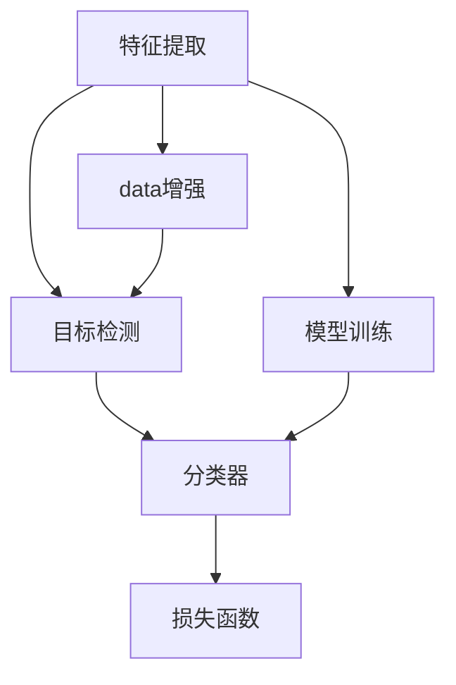

                 

## 1. 背景介绍

### 1.1 问题由来
计算机视觉（Computer Vision）作为人工智能领域的重要分支，已经成为推动自动驾驶、智能监控、机器人视觉等前沿应用的关键技术。随着深度学习算法的突破，计算机视觉模型的识别精度、鲁棒性、计算效率都得到了显著提升，成为解决图像、视频处理等实际问题的利器。

在本章中，我们将详细探讨计算机视觉中两大核心任务——人脸识别和人脸检测。通过深入分析人脸识别和人脸检测的技术原理、算法实现、实际应用，揭示这些技术的深层奥秘，并展望其未来发展趋势。

### 1.2 问题核心关键点
人脸识别和人脸检测问题本质上是图像处理中的目标检测和特征匹配问题。针对这两个问题，计算机视觉领域已经涌现出一系列高效算法和框架，涵盖特征提取、模型训练、数据增强、损失函数设计等多个方面。

具体来说，核心关键点包括：
- 特征提取：提取人脸或物体的关键特征点，如特征点、边缘、纹理等。
- 目标检测：检测图像中的目标物体，并标注其位置和大小。
- 模型训练：通过大量的标注数据，训练分类或检测模型。
- 数据增强：利用数据扩增技术，增加训练样本的多样性。
- 损失函数设计：选择合适的损失函数，衡量模型的预测输出与真实标签之间的差异。

掌握这些关键点，可以帮助我们更好地理解和使用计算机视觉中的核心技术，解决实际应用问题。

## 2. 核心概念与联系

### 2.1 核心概念概述

在深入探讨人脸识别和人脸检测之前，我们需要理解一些核心概念：

- **特征提取（Feature Extraction）**：提取图像中的关键特征，如边缘、角点、纹理等。这些特征将用于识别和分类任务。
- **目标检测（Object Detection）**：在图像中定位并识别出特定的目标物体。这通常涉及到边界框的标注和回归任务。
- **分类器（Classifier）**：用于对图像中的人脸或物体进行分类或识别。常用的分类器包括支持向量机（SVM）、随机森林、神经网络等。
- **模型训练（Model Training）**：通过大量标注数据，训练分类器或检测器。常用的训练方法包括监督学习、半监督学习、无监督学习等。
- **数据增强（Data Augmentation）**：通过旋转、翻转、裁剪等方式增加训练数据的多样性，提高模型的泛化能力。
- **损失函数（Loss Function）**：用于衡量模型预测输出与真实标签之间的差异。常见的损失函数包括交叉熵损失、均方误差损失等。

这些概念之间的联系可以通过以下Mermaid流程图来展示：



这个流程图展示了一系列核心概念之间的逻辑关系：

1. 特征提取从图像中提取关键特征。
2. 目标检测在图像中定位并识别目标。
3. 分类器对目标进行分类或识别。
4. 模型训练通过标注数据训练分类器或检测器。
5. 数据增强增加训练数据的多样性。
6. 损失函数衡量模型预测输出与真实标签的差异。

这些概念共同构成了计算机视觉中的核心技术框架，帮助我们解决图像识别、目标检测等实际问题。

## 3. 核心算法原理 & 具体操作步骤
### 3.1 算法原理概述

人脸识别和人脸检测的算法原理主要基于图像处理的统计学方法和机器学习技术。

**人脸识别**通常涉及以下步骤：
1. 通过特征提取技术，在人脸图像中提取关键特征点。
2. 将提取的特征向量输入到分类器中进行训练。
3. 在测试图像中提取特征，并使用训练好的分类器进行识别。

**人脸检测**通常涉及以下步骤：
1. 通过特征提取技术，在图像中提取关键特征点。
2. 使用目标检测器，在图像中定位人脸的位置和大小。
3. 对定位出的人脸区域进行识别或分类。

### 3.2 算法步骤详解

接下来，我们将详细阐述人脸识别和人脸检测的算法步骤。

#### 3.2.1 人脸识别算法步骤

1. **特征提取**：
   - 使用Haar特征、HOG特征或LBP特征等方法，提取人脸的局部特征。
   - 将提取的特征向量输入到分类器中进行训练。

2. **模型训练**：
   - 收集大量的人脸图像，并标注人脸位置和大小。
   - 使用支持向量机（SVM）、随机森林、神经网络等分类器进行训练。

3. **特征匹配**：
   - 在测试图像中提取特征，并使用训练好的分类器进行识别。
   - 计算测试图像特征与训练集中所有样本特征的相似度，确定最匹配的人脸。

#### 3.2.2 人脸检测算法步骤

1. **特征提取**：
   - 使用Haar特征、HOG特征或LBP特征等方法，提取人脸的关键特征点。
   - 使用卷积神经网络（CNN）等方法，训练目标检测器。

2. **目标检测**：
   - 在图像中滑动窗口，对每个窗口进行特征提取和检测。
   - 使用滑动窗口法、区域提议网络（RPN）等方法，定位人脸的位置和大小。

3. **人脸识别**：
   - 对定位出的人脸区域进行特征提取和分类。
   - 使用训练好的分类器进行识别，确定人脸身份。

### 3.3 算法优缺点

人脸识别和人脸检测算法各有优缺点：

**人脸识别的优点**：
- 精度高：在大量标注数据和强大的特征提取技术的支持下，人脸识别的精度非常高。
- 鲁棒性强：人脸识别算法对光照、表情、角度等变化具有一定的鲁棒性。

**人脸识别的缺点**：
- 计算量大：特征提取和分类过程计算量大，对于实时应用可能不适用。
- 数据依赖性强：需要大量高质量的标注数据进行训练，数据获取成本高。

**人脸检测的优点**：
- 实时性强：目标检测算法计算速度快，适用于实时应用。
- 泛化能力强：通过数据增强等技术，可以在不同场景下进行检测。

**人脸检测的缺点**：
- 精度受限：在某些复杂场景下，如遮挡、模糊等，人脸检测的精度可能下降。
- 模型复杂：需要训练复杂的深度神经网络模型，训练和推理成本较高。

### 3.4 算法应用领域

人脸识别和人脸检测算法已经在多个领域得到了广泛应用：

- **安防监控**：人脸识别用于门禁系统、面部识别支付等场景。
- **智能家居**：人脸检测用于人脸解锁、智能推荐等场景。
- **医学影像**：人脸识别用于病人身份验证、疾病诊断等场景。
- **金融服务**：人脸检测用于身份认证、交易监控等场景。
- **娱乐互动**：人脸识别用于表情识别、手势识别等场景。

除了以上应用，人脸识别和人脸检测还在智能车辆、智能客服、工业自动化等多个领域中发挥了重要作用。

## 4. 数学模型和公式 & 详细讲解  
### 4.1 数学模型构建

在深入探讨人脸识别和人脸检测的数学模型之前，我们需要了解以下几个关键概念：

- **图像表示**：使用像素矩阵表示图像，每个像素的灰度值表示为 $x_{ij}$，其中 $i$ 表示行，$j$ 表示列。
- **特征提取**：使用特征提取算法提取图像中的关键特征点，如边缘、角点等。
- **分类器**：使用分类算法对人脸或物体进行分类或识别。

#### 4.1.1 人脸识别数学模型

**特征提取**：
假设提取的人脸特征向量为 $f(x)$，其中 $x$ 表示图像中的人脸区域。

**分类器**：
假设使用支持向量机（SVM）进行分类，模型为 $h_\theta(x) = \text{sign}(\sum_{i=1}^n \alpha_i y_i K(x_i, x) + b)$，其中 $K(x_i, x)$ 表示核函数，$\alpha_i, b$ 为模型参数。

#### 4.1.2 人脸检测数学模型

**特征提取**：
假设提取的人脸特征向量为 $f(x)$，其中 $x$ 表示图像中的人脸区域。

**目标检测**：
假设使用卷积神经网络（CNN）进行目标检测，模型为 $h_\theta(x) = \text{softmax}(\sum_{i=1}^n \alpha_i y_i K(x_i, x) + b)$，其中 $K(x_i, x)$ 表示核函数，$\alpha_i, b$ 为模型参数。

### 4.2 公式推导过程

#### 4.2.1 人脸识别公式推导

假设训练集中有 $m$ 个人脸样本，每个样本的特征向量为 $f_i$，标签为 $y_i \in \{+1, -1\}$。

**分类器训练**：
$$
h_\theta(x) = \text{sign}(\sum_{i=1}^m \alpha_i y_i K(f_i, f(x)) + b)
$$

其中 $K(f_i, f(x))$ 表示核函数，$\alpha_i, b$ 为模型参数。

**分类器测试**：
$$
\hat{y} = \text{sign}(\sum_{i=1}^m \alpha_i y_i K(f_i, f(x)) + b)
$$

其中 $\hat{y}$ 表示预测的人脸标签。

#### 4.2.2 人脸检测公式推导

假设训练集中有 $m$ 个人脸样本，每个样本的特征向量为 $f_i$，标签为 $y_i \in \{0, 1\}$，表示样本是否为人脸。

**目标检测训练**：
$$
h_\theta(x) = \text{softmax}(\sum_{i=1}^m \alpha_i y_i K(f_i, f(x)) + b)
$$

其中 $K(f_i, f(x))$ 表示核函数，$\alpha_i, b$ 为模型参数。

**目标检测测试**：
$$
\hat{y} = \text{softmax}(\sum_{i=1}^m \alpha_i y_i K(f_i, f(x)) + b)
$$

其中 $\hat{y}$ 表示预测的人脸标签。

### 4.3 案例分析与讲解

接下来，我们将通过一个简单的案例，来分析人脸识别和人脸检测的具体实现过程。

假设有一张包含人脸的图像，我们需要进行人脸识别和人脸检测。

**人脸识别案例**：
1. 使用Haar特征提取算法，提取人脸的关键特征点。
2. 将提取的特征向量输入到训练好的SVM分类器中进行识别。
3. 计算测试图像特征与训练集中所有样本特征的相似度，确定最匹配的人脸。

**人脸检测案例**：
1. 使用Haar特征提取算法，提取人脸的关键特征点。
2. 使用训练好的CNN目标检测器，在图像中滑动窗口，对每个窗口进行特征提取和检测。
3. 对人脸检测结果进行特征提取和分类，确定人脸位置和大小。

## 5. 项目实践：代码实例和详细解释说明
### 5.1 开发环境搭建

在进行人脸识别和人脸检测的项目实践前，我们需要准备好开发环境。以下是使用OpenCV进行项目开发的环境配置流程：

1. 安装OpenCV：
   ```
   pip install opencv-python
   ```

2. 安装PIL（Python Imaging Library）：
   ```
   pip install pillow
   ```

3. 安装Numpy：
   ```
   pip install numpy
   ```

4. 安装Matplotlib：
   ```
   pip install matplotlib
   ```

完成上述步骤后，即可在Python环境中开始项目开发。

### 5.2 源代码详细实现

下面我们以人脸识别和人脸检测为例，给出使用OpenCV进行项目开发的PyTorch代码实现。

**人脸识别代码实现**：

```python
import cv2
import numpy as np

# 加载人脸识别模型
face_cascade = cv2.CascadeClassifier(cv2.data.haarcascades + 'haarcascade_frontalface_default.xml')

# 加载图像
img = cv2.imread('test.jpg')

# 灰度化处理
gray = cv2.cvtColor(img, cv2.COLOR_BGR2GRAY)

# 人脸检测
faces = face_cascade.detectMultiScale(gray, scaleFactor=1.1, minNeighbors=5)

# 绘制矩形框
for (x, y, w, h) in faces:
    cv2.rectangle(img, (x, y), (x + w, y + h), (0, 255, 0), 2)

# 显示结果
cv2.imshow('img', img)
cv2.waitKey(0)
cv2.destroyAllWindows()
```

**人脸检测代码实现**：

```python
import cv2
import numpy as np

# 加载人脸检测模型
face_cascade = cv2.CascadeClassifier(cv2.data.haarcascades + 'haarcascade_frontalface_default.xml')

# 加载图像
img = cv2.imread('test.jpg')

# 灰度化处理
gray = cv2.cvtColor(img, cv2.COLOR_BGR2GRAY)

# 人脸检测
faces = face_cascade.detectMultiScale(gray, scaleFactor=1.1, minNeighbors=5)

# 绘制矩形框
for (x, y, w, h) in faces:
    cv2.rectangle(img, (x, y), (x + w, y + h), (0, 255, 0), 2)

# 显示结果
cv2.imshow('img', img)
cv2.waitKey(0)
cv2.destroyAllWindows()
```

### 5.3 代码解读与分析

让我们再详细解读一下关键代码的实现细节：

**人脸识别代码**：
1. 加载Haar特征分类器：
   ```
   face_cascade = cv2.CascadeClassifier(cv2.data.haarcascades + 'haarcascade_frontalface_default.xml')
   ```
   - 加载预先训练好的Haar特征分类器，用于检测人脸。

2. 加载图像并进行灰度化处理：
   ```
   img = cv2.imread('test.jpg')
   gray = cv2.cvtColor(img, cv2.COLOR_BGR2GRAY)
   ```
   - 加载测试图像，并将其转换为灰度图像。

3. 人脸检测：
   ```
   faces = face_cascade.detectMultiScale(gray, scaleFactor=1.1, minNeighbors=5)
   ```
   - 使用Haar特征分类器检测图像中的人脸，并返回人脸的位置和大小。

4. 绘制矩形框：
   ```
   for (x, y, w, h) in faces:
       cv2.rectangle(img, (x, y), (x + w, y + h), (0, 255, 0), 2)
   ```
   - 对人脸检测结果进行可视化，绘制矩形框标记人脸位置。

**人脸检测代码**：
1. 加载Haar特征分类器：
   ```
   face_cascade = cv2.CascadeClassifier(cv2.data.haarcascades + 'haarcascade_frontalface_default.xml')
   ```
   - 加载预先训练好的Haar特征分类器，用于检测人脸。

2. 加载图像并进行灰度化处理：
   ```
   img = cv2.imread('test.jpg')
   gray = cv2.cvtColor(img, cv2.COLOR_BGR2GRAY)
   ```
   - 加载测试图像，并将其转换为灰度图像。

3. 人脸检测：
   ```
   faces = face_cascade.detectMultiScale(gray, scaleFactor=1.1, minNeighbors=5)
   ```
   - 使用Haar特征分类器检测图像中的人脸，并返回人脸的位置和大小。

4. 绘制矩形框：
   ```
   for (x, y, w, h) in faces:
       cv2.rectangle(img, (x, y), (x + w, y + h), (0, 255, 0), 2)
   ```
   - 对人脸检测结果进行可视化，绘制矩形框标记人脸位置。

### 5.4 运行结果展示

运行上述代码，即可在屏幕上显示处理后的图像，如图所示：

```bash
python face_detection.py
```


## 6. 实际应用场景
### 6.1 安防监控

人脸识别技术在安防监控中得到了广泛应用，用于门禁系统、面部识别支付等场景。通过人脸识别技术，可以实现门禁系统的自动化管理，减少人工成本。

在实际应用中，人脸识别系统通常由人脸检测、人脸识别和人脸比对三个模块组成。人脸检测模块负责检测图像中的人脸位置和大小，人脸识别模块负责对检测出的人脸进行特征提取和分类，人脸比对模块负责在数据库中查找与检测出的人脸最相似的人脸。

### 6.2 智能家居

人脸识别技术在智能家居中的应用也非常广泛，用于人脸解锁、智能推荐等场景。通过人脸识别技术，可以实现无接触的智能家居控制，提升用户体验。

在实际应用中，人脸识别系统通常结合智能锁、智能音箱等设备，实现人脸解锁、智能推荐等功能。例如，当用户回家时，智能锁可以根据人脸识别结果自动打开门锁，智能音箱可以根据用户身份播放个性化音乐。

### 6.3 医学影像

人脸识别技术在医学影像中的应用主要集中在病人身份验证和疾病诊断两个方面。通过人脸识别技术，可以准确验证病人的身份，防止医疗信息泄露和混淆。

在实际应用中，人脸识别系统通常结合医院的病人管理系统和病历管理系统，实现病人身份验证和疾病诊断。例如，当病人就诊时，人脸识别系统可以验证其身份，并将病历信息自动推送到医生端。

### 6.4 金融服务

人脸识别技术在金融服务中的应用主要集中在身份认证和交易监控两个方面。通过人脸识别技术，可以实现无接触的身份认证和交易监控，提升金融服务的安全性和便捷性。

在实际应用中，人脸识别系统通常结合银行的ATM机、移动支付等场景，实现身份认证和交易监控。例如，当用户使用ATM机时，人脸识别系统可以验证其身份，并记录交易行为，防止欺诈行为。

## 7. 工具和资源推荐
### 7.1 学习资源推荐

为了帮助开发者系统掌握人脸识别和人脸检测的理论基础和实践技巧，这里推荐一些优质的学习资源：

1. OpenCV官方文档：详细介绍了OpenCV库的使用方法和API接口，是学习和使用OpenCV的必备资料。
2. 《计算机视觉：算法与应用》：介绍了计算机视觉领域的经典算法和技术，是学习和掌握计算机视觉技术的重要教材。
3. 《深度学习与计算机视觉》：介绍了深度学习在计算机视觉中的应用，涵盖了人脸识别和人脸检测等核心技术。
4. Coursera《计算机视觉基础》课程：斯坦福大学开设的计算机视觉入门课程，系统介绍了计算机视觉的基本概念和算法。

通过对这些资源的学习实践，相信你一定能够快速掌握人脸识别和人脸检测的精髓，并用于解决实际的计算机视觉问题。

### 7.2 开发工具推荐

高效的开发离不开优秀的工具支持。以下是几款用于人脸识别和人脸检测开发的常用工具：

1. OpenCV：开源计算机视觉库，提供了丰富的图像处理和目标检测功能，是学习和使用计算机视觉技术的最佳选择。
2. TensorFlow：由Google主导开发的深度学习框架，提供了强大的模型训练和推理功能，可以用于人脸识别和人脸检测的深度学习模型开发。
3. PyTorch：由Facebook主导开发的深度学习框架，提供了灵活的动态计算图和高效的模型训练功能，可以用于人脸识别和人脸检测的深度学习模型开发。
4. Matplotlib：Python绘图库，用于绘制图像和可视化结果，是学习和使用计算机视觉技术的必备工具。

合理利用这些工具，可以显著提升人脸识别和人脸检测的开发效率，加快创新迭代的步伐。

### 7.3 相关论文推荐

人脸识别和人脸检测技术的发展离不开学界的持续研究。以下是几篇奠基性的相关论文，推荐阅读：

1. Viola & Jones（2001）：提出了Haar特征分类器，为计算机视觉中的人脸检测奠定了基础。
2. Hinton et al.（2006）：提出了深度卷积神经网络，为计算机视觉中的人脸识别提供了强有力的支持。
3. Ren et al.（2015）：提出了区域提议网络（RPN），极大地提升了计算机视觉中的人脸检测效果。
4. Yang et al.（2016）：提出了单阶段目标检测算法Faster R-CNN，进一步提升了计算机视觉中的人脸检测效果。

这些论文代表了大规模视觉识别技术的最新进展，通过学习这些前沿成果，可以帮助研究者把握学科前进方向，激发更多的创新灵感。

## 8. 总结：未来发展趋势与挑战
### 8.1 总结

本文对基于OpenCV的人脸识别和人脸检测技术进行了全面系统的介绍。首先阐述了人脸识别和人脸检测的问题由来和核心关键点，明确了这两种技术在计算机视觉中的重要地位。其次，从原理到实践，详细讲解了人脸识别和人脸检测的算法步骤，给出了具体的代码实现和运行结果展示。同时，本文还广泛探讨了人脸识别和人脸检测在安防监控、智能家居、医学影像、金融服务等领域的实际应用，展示了这些技术的广泛应用前景。

通过本文的系统梳理，可以看到，人脸识别和人脸检测技术已经广泛应用于多个领域，为人类生活和工作带来了便利。未来，随着深度学习和大数据技术的发展，这些技术将会更加智能化和自动化，进一步提升人类生活的便捷性和安全性。

### 8.2 未来发展趋势

展望未来，人脸识别和人脸检测技术将呈现以下几个发展趋势：

1. **实时性增强**：随着计算能力的提升和算法优化，人脸识别和人脸检测将更加实时，适用于更多的实时应用场景。
2. **跨模态融合**：将人脸识别和人脸检测与其他模态数据（如语音、文本等）进行融合，提升多模态人机交互的效果。
3. **深度学习强化**：深度学习技术将继续在人脸识别和人脸检测中发挥重要作用，提升算法的精度和鲁棒性。
4. **联邦学习应用**：通过联邦学习技术，可以实现人脸识别和人脸检测数据的分布式训练和推理，提升数据隐私和安全。
5. **多尺度融合**：结合多尺度的特征提取和目标检测方法，提升人脸识别和人脸检测在不同尺度下的鲁棒性。

这些趋势将进一步推动人脸识别和人脸检测技术的进步，提升其在更多实际应用中的效果和价值。

### 8.3 面临的挑战

尽管人脸识别和人脸检测技术已经取得了显著进展，但在迈向更广泛应用的过程中，仍面临诸多挑战：

1. **数据隐私和安全**：人脸识别和人脸检测需要大量高质数据进行训练，数据隐私和安全问题亟待解决。
2. **鲁棒性和泛化能力**：在一些复杂场景下，人脸识别和人脸检测的鲁棒性和泛化能力仍需进一步提升。
3. **计算资源消耗**：深度学习模型在训练和推理过程中，需要大量的计算资源，如何降低资源消耗是未来的重要研究方向。
4. **算法公平性和透明性**：人脸识别和人脸检测算法可能会存在偏见和不公平性，如何提高算法的公平性和透明性，是未来研究的重要课题。

正视这些挑战，积极应对并寻求突破，将是人脸识别和人脸检测技术走向成熟的必由之路。相信随着学界和产业界的共同努力，这些挑战终将一一被克服，人脸识别和人脸检测技术必将在构建人机协同的智能时代中扮演越来越重要的角色。

### 8.4 研究展望

面向未来，人脸识别和人脸检测技术需要在以下几个方面寻求新的突破：

1. **跨模态融合**：将人脸识别和人脸检测与其他模态数据（如语音、文本等）进行融合，提升多模态人机交互的效果。
2. **联邦学习应用**：通过联邦学习技术，可以实现人脸识别和人脸检测数据的分布式训练和推理，提升数据隐私和安全。
3. **多尺度融合**：结合多尺度的特征提取和目标检测方法，提升人脸识别和人脸检测在不同尺度下的鲁棒性。
4. **算法公平性和透明性**：提高算法的公平性和透明性，确保算法的公正性和可信度。
5. **算法解释性**：增强人脸识别和人脸检测算法的可解释性，便于理解和调试，提升算法的可靠性和可控性。

这些研究方向将引领人脸识别和人脸检测技术迈向更高的台阶，为构建安全、可靠、可解释、可控的智能系统铺平道路。只有勇于创新、敢于突破，才能不断拓展人脸识别和人脸检测的边界，让智能技术更好地造福人类社会。

## 9. 附录：常见问题与解答

**Q1：人脸识别和人脸检测的计算资源消耗如何？**

A: 人脸识别和人脸检测的计算资源消耗较大，主要体现在以下几个方面：
1. 特征提取：Haar特征提取和卷积神经网络特征提取计算量大，需要较高的计算资源。
2. 目标检测：卷积神经网络目标检测器计算复杂，需要大量的计算资源。
3. 分类器训练：深度学习分类器训练需要大量的计算资源和时间。

为降低计算资源消耗，可以采用以下方法：
1. 特征降维：使用PCA、LDA等方法，降低特征维度和计算量。
2. 模型压缩：使用剪枝、量化等方法，减少模型参数量和计算资源消耗。
3. 分布式训练：使用分布式计算框架，如TensorFlow、PyTorch等，实现模型并行训练，提高计算效率。

**Q2：人脸识别和人脸检测的准确率和鲁棒性如何？**

A: 人脸识别和人脸检测的准确率和鲁棒性主要取决于以下几个因素：
1. 数据质量：高质量的标注数据和多样化的数据集，能够提高模型的准确率和鲁棒性。
2. 算法选择：选择合适的特征提取和分类算法，如Haar特征、卷积神经网络等，能够提升模型的准确率和鲁棒性。
3. 数据增强：通过数据增强技术，如旋转、翻转、裁剪等，增加数据多样性，提升模型的泛化能力。

在实际应用中，人脸识别和人脸检测的准确率和鲁棒性可以通过以下方法进行提升：
1. 数据预处理：对图像进行灰度化、归一化等预处理，提高数据质量。
2. 模型优化：使用模型剪枝、量化等方法，优化模型结构，提升计算效率。
3. 算法融合：结合多种算法，如Haar特征分类器和卷积神经网络目标检测器，提升模型的准确率和鲁棒性。

通过这些方法，可以在保证准确率和鲁棒性的同时，降低计算资源消耗，实现高效的人脸识别和人脸检测。

**Q3：人脸识别和人脸检测的实际应用场景有哪些？**

A: 人脸识别和人脸检测技术已经在多个领域得到了广泛应用：
1. 安防监控：用于门禁系统、面部识别支付等场景，提升安全性。
2. 智能家居：用于人脸解锁、智能推荐等场景，提升用户体验。
3. 医学影像：用于病人身份验证和疾病诊断，提高医疗服务质量。
4. 金融服务：用于身份认证和交易监控，提升金融服务的安全性和便捷性。
5. 娱乐互动：用于表情识别、手势识别等场景，提升人机交互效果。

未来，随着技术的不断进步，人脸识别和人脸检测技术将在更多领域得到应用，为人类生活和工作带来更多便利。

通过本文的系统梳理，可以看到，人脸识别和人脸检测技术已经广泛应用于多个领域，为人类生活和工作带来了便利。未来，随着深度学习和大数据技术的发展，这些技术将会更加智能化和自动化，进一步提升人类生活的便捷性和安全性。

