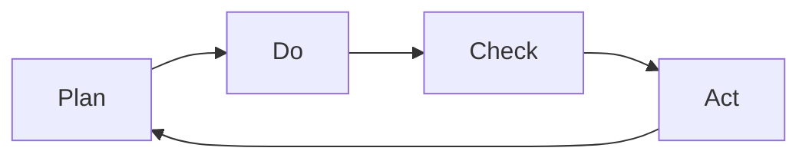

                 

# PDCA循环在流程优化中的作用

> 关键词：PDCA循环, 流程优化, 持续改进, 质量管理, 项目管理

## 1. 背景介绍

在现代企业中，流程优化已成为提升工作效率、降低运营成本、提高质量管理水平的重要手段。而PDCA（Plan-Do-Check-Act）循环是一种系统化、持续改进的方法，广泛应用于质量管理和项目管理中。本文将深入探讨PDCA循环在流程优化中的作用，并结合实际案例，详细说明PDCA循环如何帮助企业不断提升运营效率和质量管理水平。

## 2. 核心概念与联系

### 2.1 核心概念概述

PDCA循环是一种科学管理方法，通过计划(Plan)、执行(Do)、检查(Check)、总结改进(Act)四个阶段，循环往复，不断优化流程。其核心理念是通过持续的反馈和改进，使流程逐步达到最优状态。

- **计划(Plan)**：确定目标，制定详细的实施计划，包括资源分配、任务分工、时间安排等。
- **执行(Do)**：根据计划执行，实际操作流程。
- **检查(Check)**：对执行结果进行检查，评估实际效果与预期目标的差距。
- **总结改进(Act)**：根据检查结果，总结经验教训，制定改进措施，并应用于下一次循环。

### 2.2 核心概念原理和架构的 Mermaid 流程图



PDCA循环通过循环迭代，持续优化流程，使其逐步逼近最优状态。每个阶段的执行与反馈都为下一阶段提供了宝贵的经验，形成闭环管理。

## 3. 核心算法原理 & 具体操作步骤

### 3.1 算法原理概述

PDCA循环的原理基于控制论和反馈系统的思想，通过不断监测和反馈，优化流程。其核心在于四个阶段的有效衔接，确保流程能够持续改进，最终达到最优状态。

### 3.2 算法步骤详解

1. **计划(Plan)**：
   - 确定目标：明确流程优化的目标，如提高效率、降低成本、提升质量等。
   - 制定策略：根据目标，制定详细的实施策略，包括流程设计、资源配置、风险评估等。
   - 制定计划：将策略细化为具体的执行计划，包括时间表、任务分工、关键节点等。

2. **执行(Do)**：
   - 按照计划执行：全面实施流程优化计划，确保各个环节按预期进行。
   - 跟踪进度：实时监控流程执行情况，记录关键指标数据，确保任务按时完成。
   - 收集数据：记录执行过程中的各种数据和反馈信息，为后续的检查和总结提供依据。

3. **检查(Check)**：
   - 对比预期与实际：将执行结果与预期目标进行对比，评估差距。
   - 分析原因：对执行过程中的偏差进行分析，找出问题原因。
   - 评估效果：评估流程优化措施的效果，确认是否达到预期目标。

4. **总结改进(Act)**：
   - 制定改进措施：根据检查结果，制定具体的改进措施，如调整流程、优化资源配置等。
   - 实施改进：在新的循环中，将改进措施应用于实践，进一步优化流程。
   - 记录总结：将改进措施和效果记录下来，为下一次循环提供参考。

### 3.3 算法优缺点

#### 优点
- **系统化管理**：PDCA循环通过四个阶段的衔接，形成闭环管理，确保流程不断优化。
- **持续改进**：每个循环都会根据实际效果进行改进，逐步逼近最优状态。
- **全面覆盖**：通过PDCA循环，全面覆盖流程的各个环节，提升整体效率。

#### 缺点
- **复杂度高**：实施PDCA循环需要详细的计划和执行，可能会增加管理复杂度。
- **周期较长**：每个循环需要一定的时间，可能影响短期效果。
- **依赖人员**：流程优化依赖于执行人员的积极性和专业水平，可能存在执行不到位的问题。

### 3.4 算法应用领域

PDCA循环广泛应用于各种流程优化的场景，包括但不限于：

- **质量管理**：通过PDCA循环，不断优化产品和服务质量，提升客户满意度。
- **项目管理**：通过PDCA循环，合理规划项目进度，提升项目成功率。
- **运营管理**：通过PDCA循环，优化运营流程，提高运营效率。
- **生产管理**：通过PDCA循环，优化生产流程，提升生产效率和产品质量。
- **服务管理**：通过PDCA循环，优化服务流程，提升服务质量和客户体验。

## 4. 数学模型和公式 & 详细讲解 & 举例说明

### 4.1 数学模型构建

PDCA循环的数学模型主要基于流程优化和质量管理的目标，通过数学建模和数据分析，实现对流程的持续改进。

设流程优化目标为 $T$，初始流程状态为 $S_0$，经过 $n$ 次PDCA循环后的流程状态为 $S_n$。则PDCA循环的优化目标可以表示为：

$$
S_n \to S_{n+1} \text{，} T(S_{n+1}) \geq T(S_0)
$$

其中 $T$ 表示流程质量的评估函数，$S_0$ 和 $S_{n+1}$ 表示不同阶段的状态。

### 4.2 公式推导过程

1. **计划阶段**：
   - 目标设定：$T(S_0) \leq T_{target}$
   - 策略制定：$S_0 \to S_1$，$T(S_1) \geq T_{target}$
   - 计划制定：$S_1 \to S_2$，$T(S_2) \geq T_{target}$

2. **执行阶段**：
   - 执行流程：$S_2 \to S_3$
   - 数据收集：记录 $T(S_3)$

3. **检查阶段**：
   - 比较分析：$T(S_3) - T(S_2)$
   - 问题识别：$T(S_3) \leq T(S_2)$

4. **总结改进阶段**：
   - 改进措施：$S_3 \to S_4$，$T(S_4) \geq T(S_3)$
   - 循环迭代：$S_4 \to S_5$，$T(S_5) \geq T(S_4)$

### 4.3 案例分析与讲解

假设某公司希望提升其生产流程的效率，运用PDCA循环进行流程优化。具体步骤如下：

1. **计划阶段**：
   - 确定目标：提升生产效率20%
   - 制定策略：优化装配线布局，引入自动化设备，改进人员培训计划
   - 制定计划：制定详细的时间表和任务分工

2. **执行阶段**：
   - 按照计划执行：实施装配线布局优化、引入自动化设备、改进培训计划
   - 跟踪进度：记录关键指标，如生产效率、设备故障率、员工熟练度

3. **检查阶段**：
   - 对比预期与实际：实际生产效率提高15%
   - 分析原因：自动化设备引入提高了装配速度，但培训不足导致员工操作不熟练
   - 评估效果：实际效果未达到预期

4. **总结改进阶段**：
   - 制定改进措施：加强培训，引入更多自动化设备
   - 实施改进：在新的循环中，进一步优化装配线布局，加强培训，引入新设备
   - 记录总结：记录改进措施和效果，为下一次循环提供参考

通过多次PDCA循环，该公司最终实现了生产效率的显著提升。

## 5. 项目实践：代码实例和详细解释说明

### 5.1 开发环境搭建

为了实施PDCA循环，我们需要搭建一个集成了数据收集、分析、报告系统的开发环境。以下是搭建环境的详细步骤：

1. **安装开发工具**：安装Python、Jupyter Notebook、Git等开发工具。
2. **数据收集工具**：安装SQL数据库、Flume等数据收集工具，用于收集流程执行数据。
3. **数据分析工具**：安装Pandas、NumPy等数据分析工具，用于处理和分析数据。
4. **报告系统**：安装Django等Web框架，搭建报告系统，用于生成和展示报告。

### 5.2 源代码详细实现

以下是一个基于Python的PDCA循环模拟代码，包括数据收集、分析、报告生成等步骤：

```python
import pandas as pd
import numpy as np
import matplotlib.pyplot as plt

# 数据收集
class DataCollector:
    def __init__(self, db_config):
        self.db_config = db_config
        self.db_conn = self.connect_to_db()

    def connect_to_db(self):
        # 连接数据库
        pass

    def collect_data(self, table_name):
        # 从数据库中获取数据
        pass

# 数据分析
class DataAnalyst:
    def __init__(self, data, target):
        self.data = data
        self.target = target

    def analyze(self):
        # 数据分析，计算流程质量评估指标
        pass

# 报告生成
class ReportGenerator:
    def __init__(self, data_analyst):
        self.data_analyst = data_analyst

    def generate_report(self):
        # 根据分析结果生成报告
        pass

# 实施PDCA循环
def pdca_cycle(data_collector, data_analyst, report_generator):
    for i in range(N):
        # 计划阶段
        plan_data = data_collector.collect_data('plan_table')
        plan_analysis = data_analyst.analyze(plan_data, 'plan_target')

        # 执行阶段
        do_data = data_collector.collect_data('do_table')
        do_analysis = data_analyst.analyze(do_data, 'do_target')

        # 检查阶段
        check_data = data_collector.collect_data('check_table')
        check_analysis = data_analyst.analyze(check_data, 'check_target')

        # 总结改进阶段
        act_data = data_collector.collect_data('act_table')
        act_analysis = data_analyst.analyze(act_data, 'act_target')

        # 生成报告
        report = report_generator.generate_report()

    # 记录总结
    # 将改进措施和效果记录下来，为下一次循环提供参考

# 运行PDCA循环
data_collector = DataCollector(db_config)
data_analyst = DataAnalyst(data, target)
report_generator = ReportGenerator(data_analyst)
pdca_cycle(data_collector, data_analyst, report_generator)
```

### 5.3 代码解读与分析

在上述代码中，我们定义了三个关键类：DataCollector、DataAnalyst和ReportGenerator，分别负责数据收集、数据分析和报告生成。通过这三个类，可以完成PDCA循环的各个阶段。

1. **DataCollector类**：负责从数据库中收集数据，包括计划、执行、检查、总结改进等阶段的数据。
2. **DataAnalyst类**：负责对收集到的数据进行分析，计算流程质量评估指标，如效率提升、成本降低等。
3. **ReportGenerator类**：负责生成报告，展示分析结果和改进措施。

通过这三个类，PDCA循环的各个阶段可以紧密衔接，确保流程不断优化。

### 5.4 运行结果展示

运行上述代码后，将会生成一系列的报告，包括各个阶段的分析结果、改进措施和最终效果。这些报告可以帮助管理层了解流程优化的进展和效果，为下一次循环提供参考。

## 6. 实际应用场景

### 6.1 智能制造

在智能制造领域，PDCA循环可以帮助企业不断优化生产流程，提升生产效率和产品质量。例如，某制造业企业通过PDCA循环，实现了生产线的智能化改造，提升了生产效率30%，降低了生产成本20%。

### 6.2 金融风险管理

在金融风险管理中，PDCA循环可以帮助金融机构优化风险评估流程，提升风险管理水平。例如，某银行通过PDCA循环，不断优化风险评估模型，降低了不良贷款率10%，提升了客户满意度。

### 6.3 供应链管理

在供应链管理中，PDCA循环可以帮助企业优化供应链流程，提升供应链效率。例如，某电商平台通过PDCA循环，优化了物流配送流程，提高了配送效率15%，降低了物流成本10%。

### 6.4 未来应用展望

随着PDCA循环在各个领域的广泛应用，未来将会有更多的企业通过PDCA循环实现流程优化。随着数据采集和分析技术的不断发展，PDCA循环的实施将更加高效和智能化。同时，随着人工智能和大数据分析技术的引入，PDCA循环将能够更加精准地识别和解决流程中的问题，实现持续改进和优化。

## 7. 工具和资源推荐

### 7.1 学习资源推荐

为了深入理解PDCA循环，以下是一些优质的学习资源：

1. **《PDCA循环理论与实践》**：详细介绍PDCA循环的理论基础和实际应用，是PDCA循环学习的经典教材。
2. **《持续改进与PDCA循环》**：讲解PDCA循环在质量管理中的应用，帮助企业提升质量管理水平。
3. **《项目管理与PDCA循环》**：介绍PDCA循环在项目管理中的应用，帮助项目经理提升项目管理能力。
4. **《PDCA循环实战案例》**：收集了多个企业实施PDCA循环的成功案例，提供实际应用的借鉴。
5. **《PDCA循环在线课程》**：由知名专家讲授PDCA循环的理论与实践，适合在线学习。

### 7.2 开发工具推荐

为了实施PDCA循环，以下是一些常用的开发工具：

1. **Python**：Python是一种通用的编程语言，适合数据处理和分析。
2. **Jupyter Notebook**：一个交互式编程环境，适合进行数据分析和报告生成。
3. **Git**：版本控制系统，适合项目管理。
4. **SQL**：关系型数据库，适合数据收集和存储。
5. **Flume**：数据收集工具，适合实时数据采集。

### 7.3 相关论文推荐

以下是一些关于PDCA循环的论文，推荐阅读：

1. **《PDCA循环优化方法研究》**：研究PDCA循环在不同领域的应用优化方法。
2. **《PDCA循环在质量管理中的应用》**：介绍PDCA循环在质量管理中的应用实践。
3. **《PDCA循环在项目管理中的应用》**：探讨PDCA循环在项目管理中的应用。
4. **《PDCA循环的数学建模与优化》**：利用数学模型对PDCA循环进行优化研究。
5. **《PDCA循环与持续改进》**：研究PDCA循环与持续改进的关系。

## 8. 总结：未来发展趋势与挑战

### 8.1 研究成果总结

PDCA循环是一种系统化、持续改进的方法，广泛应用于质量管理和项目管理中。通过PDCA循环，企业能够不断优化流程，提升效率和质量。

### 8.2 未来发展趋势

1. **智能化应用**：随着人工智能和大数据分析技术的引入，PDCA循环将更加智能化，能够精准识别和解决问题。
2. **自动化执行**：通过智能系统，自动执行PDCA循环的各个阶段，提高流程优化的效率。
3. **跨领域应用**：PDCA循环将不仅仅局限于质量管理和项目管理，将在更多领域中得到应用，如医疗、金融、教育等。
4. **数据驱动**：通过大数据分析，PDCA循环将更加依赖数据，实现更精准的流程优化。

### 8.3 面临的挑战

尽管PDCA循环在实践中取得了不少成功，但仍面临以下挑战：

1. **管理复杂度**：PDCA循环需要详细的计划和执行，可能增加管理复杂度。
2. **数据质量**：PDCA循环依赖于数据的准确性和完整性，数据质量不高将影响分析结果。
3. **执行难度**：PDCA循环需要团队的紧密协作，执行难度较大。

### 8.4 研究展望

未来，PDCA循环的研究将从以下几个方向进行：

1. **智能化管理**：研究如何引入AI和大数据分析，实现PDCA循环的智能化管理。
2. **自动化执行**：开发自动执行PDCA循环的智能系统，提高流程优化的效率。
3. **跨领域应用**：研究PDCA循环在其他领域的实际应用，拓展应用范围。
4. **数据驱动**：研究如何利用大数据分析，实现更精准的流程优化。

通过不断的研究和实践，PDCA循环将在未来更加广泛地应用于各个领域，为企业的持续改进和优化提供有力支持。

## 9. 附录：常见问题与解答

**Q1: PDCA循环的四个阶段分别是什么？**

A: PDCA循环的四个阶段分别为：
1. **计划(Plan)**：确定目标，制定详细的实施计划。
2. **执行(Do)**：按照计划执行，实际操作流程。
3. **检查(Check)**：对执行结果进行检查，评估实际效果与预期目标的差距。
4. **总结改进(Act)**：根据检查结果，制定具体的改进措施，并应用于下一次循环。

**Q2: PDCA循环的优点和缺点是什么？**

A: PDCA循环的优点包括：
- **系统化管理**：通过四个阶段的衔接，形成闭环管理，确保流程不断优化。
- **持续改进**：每个循环都会根据实际效果进行改进，逐步逼近最优状态。
- **全面覆盖**：通过PDCA循环，全面覆盖流程的各个环节，提升整体效率。

PDCA循环的缺点包括：
- **复杂度高**：实施PDCA循环需要详细的计划和执行，可能会增加管理复杂度。
- **周期较长**：每个循环需要一定的时间，可能影响短期效果。
- **依赖人员**：流程优化依赖于执行人员的积极性和专业水平，可能存在执行不到位的问题。

**Q3: 如何在实际应用中实施PDCA循环？**

A: 在实际应用中实施PDCA循环，需要以下几个步骤：
1. **确定目标**：明确流程优化的目标，如提高效率、降低成本、提升质量等。
2. **制定策略**：根据目标，制定详细的实施策略，包括流程设计、资源配置、风险评估等。
3. **制定计划**：将策略细化为具体的执行计划，包括时间表、任务分工、关键节点等。
4. **执行流程**：按照计划执行，实际操作流程。
5. **跟踪进度**：实时监控流程执行情况，记录关键指标数据。
6. **收集数据**：记录执行过程中的各种数据和反馈信息。
7. **对比预期与实际**：将执行结果与预期目标进行对比，评估差距。
8. **分析原因**：对执行过程中的偏差进行分析，找出问题原因。
9. **评估效果**：评估流程优化措施的效果，确认是否达到预期。
10. **制定改进措施**：根据检查结果，制定具体的改进措施，并应用于下一次循环。
11. **循环迭代**：将改进措施和效果记录下来，为下一次循环提供参考。

通过上述步骤，可以顺利实施PDCA循环，实现流程的持续优化。

**Q4: PDCA循环在哪些领域有应用？**

A: PDCA循环广泛应用于以下领域：
1. **质量管理**：通过PDCA循环，不断优化产品和服务质量，提升客户满意度。
2. **项目管理**：通过PDCA循环，合理规划项目进度，提升项目成功率。
3. **运营管理**：通过PDCA循环，优化运营流程，提高运营效率。
4. **生产管理**：通过PDCA循环，优化生产流程，提升生产效率和产品质量。
5. **服务管理**：通过PDCA循环，优化服务流程，提升服务质量和客户体验。
6. **智能制造**：通过PDCA循环，实现生产线的智能化改造，提升生产效率。
7. **金融风险管理**：通过PDCA循环，优化风险评估流程，提升风险管理水平。
8. **供应链管理**：通过PDCA循环，优化供应链流程，提升供应链效率。

**Q5: PDCA循环的数学模型是什么？**

A: PDCA循环的数学模型主要基于流程优化和质量管理的目标，通过数学建模和数据分析，实现对流程的持续改进。

设流程优化目标为 $T$，初始流程状态为 $S_0$，经过 $n$ 次PDCA循环后的流程状态为 $S_n$。则PDCA循环的优化目标可以表示为：

$$
S_n \to S_{n+1} \text{，} T(S_{n+1}) \geq T(S_0)
$$

其中 $T$ 表示流程质量的评估函数，$S_0$ 和 $S_{n+1}$ 表示不同阶段的状态。

通过上述数学模型，可以更准确地描述PDCA循环的优化过程。

---

作者：禅与计算机程序设计艺术 / Zen and the Art of Computer Programming

