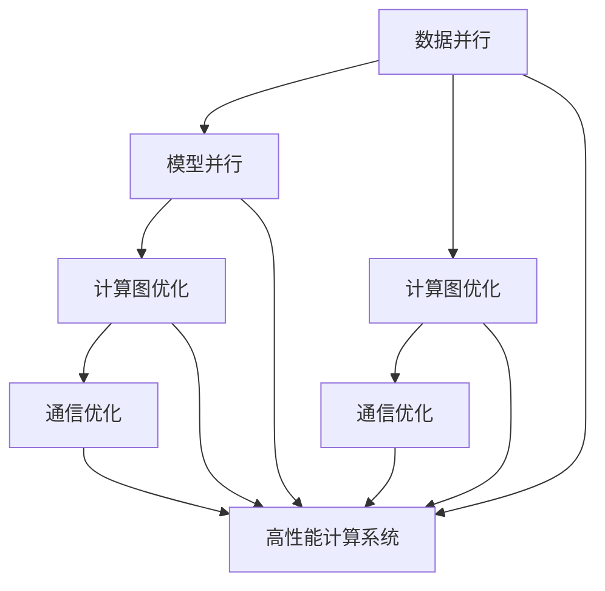

                 

# Parti原理与代码实例讲解

> 关键词：Parti, 数据并行, 模型并行, 通信优化, 计算图优化, 性能分析

## 1. 背景介绍

### 1.1 问题由来
在大规模机器学习任务中，模型训练和推理往往涉及海量的数据和计算资源。传统的单机单线程计算方式，难以应对日益复杂庞大的数据处理需求。因此，在分布式计算和并行计算框架的推动下，高性能计算系统（High-Performance Computing, HPC）和人工智能（AI）领域产生了紧密联系。

在AI领域，特别是在深度学习（Deep Learning, DL）和机器学习（Machine Learning, ML）中，并行计算已经成为提升模型训练速度和降低计算成本的有效手段。其中，基于数据并行、模型并行、通信优化、计算图优化等技术的分布式并行训练框架，如TensorFlow、PyTorch等，已经被广泛应用于各类AI应用中。

然而，在实际应用中，如何高效地设计并行训练流程，优化性能，仍是一个复杂的工程挑战。本文将从原理和实现两方面，深入讲解数据并行、模型并行和通信优化等技术，通过一个具体的代码实例，对分布式并行训练的流程进行详细分析。

## 2. 核心概念与联系

### 2.1 核心概念概述

为更好地理解分布式并行训练流程，本节将介绍几个密切相关的核心概念：

- 数据并行(Data Parallelism)：将一个数据集分成若干子集，每个子集在多个计算节点上独立进行训练，最后将结果汇总。适用于数据独立或近似独立的情况。

- 模型并行(Model Parallelism)：将一个大的模型分成多个小模型，分别在不同的计算节点上训练，最终将各节点的模型参数汇总，形成完整的模型。适用于模型较大且数据不独立的情况。

- 计算图优化(Computation Graph Optimization)：通过对计算图进行重构、优化和编译，减少不必要的计算和通信开销，提升训练和推理效率。适用于各类并行计算框架，包括TensorFlow、PyTorch等。

- 通信优化(Communication Optimization)：优化计算节点之间的通信过程，减少通信延迟和带宽占用，提升系统性能。适用于各类分布式训练系统，如Spark、Horovod等。

- 高性能计算系统(High-Performance Computing System)：提供高性能计算资源，支持大规模并行计算任务。包括集群、超级计算机等。

这些核心概念之间的逻辑关系可以通过以下Mermaid流程图来展示：



这个流程图展示了大规模并行训练的核心概念及其之间的关系：

1. 数据并行和模型并行是两种基本的并行训练策略。
2. 计算图优化和通信优化是提升并行训练效率的关键手段。
3. 高性能计算系统为大规模并行训练提供了必要的硬件支撑。

这些概念共同构成了分布式并行训练的技术框架，使得AI应用能够在大规模数据和计算资源上高效运行。通过理解这些核心概念，我们可以更好地把握分布式并行训练的实现原理和优化策略。

## 3. 核心算法原理 & 具体操作步骤

### 3.1 算法原理概述

分布式并行训练是指在多个计算节点上同时对数据集进行训练，以加速模型训练过程。其基本原理是将大规模数据集和计算任务分布到多个节点上，每个节点独立进行局部训练，最终汇总各节点的参数更新，形成全局模型参数。

分布式并行训练的核心是数据和模型的并行，通过划分数据集和模型结构，使得不同节点上的计算任务彼此独立，且计算结果可以合并。具体实现时，通常采用消息传递接口（Message Passing Interface, MPI）、分布式深度学习框架（如TensorFlow、PyTorch等）、分布式计算系统（如Spark、Horovod等）等技术，实现高效的数据传递和计算调度。

### 3.2 算法步骤详解

基于数据并行和模型并行的分布式并行训练流程，通常包括以下几个关键步骤：

**Step 1: 数据划分与分布**
- 将训练数据集划分为若干份，分别存放在不同的计算节点上。通常根据数据集的规模和节点的计算能力，进行平衡分布，确保各节点负载均衡。

**Step 2: 计算节点初始化**
- 各计算节点初始化模型参数和局部数据，根据任务需求选择合适的优化器、学习率等训练参数。

**Step 3: 局部训练与参数更新**
- 各计算节点对本地数据集进行局部训练，更新模型参数。在训练过程中，可以使用并行计算框架提供的优化器（如Adam、SGD等），加快计算速度。

**Step 4: 参数聚合与全量更新**
- 计算节点间通过通信网络交换模型参数和梯度信息，计算节点汇总参数更新，更新全局模型参数。

**Step 5: 性能监控与调试**
- 各计算节点在训练过程中，通过周期性检查性能指标（如计算速度、内存占用等），进行异常检测和调试，保证系统稳定运行。

**Step 6: 结果汇总与评估**
- 训练完成后，各计算节点将模型参数和训练结果汇总到主节点，进行模型评估和保存。

### 3.3 算法优缺点

分布式并行训练具有以下优点：

1. 加速训练过程。通过多节点并行计算，可以在较短时间内完成大规模数据集的训练，提升模型训练效率。

2. 提高资源利用率。将训练任务分布到多个计算节点上，可以充分利用集群中的计算资源，避免单节点资源浪费。

3. 提升系统容错性。分布式训练系统通常具备良好的容错机制，一个节点的故障不会导致整个系统的崩溃。

然而，分布式并行训练也存在以下局限性：

1. 通信开销。节点间的数据传递和参数同步需要大量时间和带宽，通信延迟成为系统性能瓶颈。

2. 同步机制复杂。各节点之间的同步需要复杂的协调机制，同步错误可能导致系统不稳定。

3. 资源管理困难。计算节点和资源管理复杂，需要配置合理，否则可能导致资源浪费或资源争用。

4. 调试困难。系统故障诊断和问题排查需要较长时间的调试过程，影响系统稳定性。

尽管存在这些局限性，但就目前而言，分布式并行训练仍是训练大规模模型和处理海量数据的最主流范式。未来相关研究的重点在于如何进一步降低通信延迟，提高同步效率，同时兼顾资源管理和调试便利性等因素。

### 3.4 算法应用领域

分布式并行训练在各类大规模AI应用中得到了广泛应用，覆盖了几乎所有常见任务，例如：

- 深度学习模型的训练：如图像识别、自然语言处理、语音识别等。通过分布式并行训练，可以在较短时间内完成大规模数据集的训练，提升模型精度。

- 大规模数据分析：如机器学习模型的在线学习、数据挖掘等。通过分布式并行训练，可以高效处理海量数据，提取有价值的信息。

- 生物信息学计算：如基因组测序数据分析、蛋白质结构预测等。通过分布式并行训练，可以加快复杂生物数据的处理速度，提升研究效率。

除了上述这些经典任务外，分布式并行训练还被创新性地应用到更多场景中，如自适应学习、协同过滤、分布式优化等，为AI技术带来了全新的突破。随着计算资源的不断扩张和并行计算技术的持续演进，分布式并行训练的应用前景将更加广阔。

## 4. 数学模型和公式 & 详细讲解 & 举例说明

### 4.1 数学模型构建

本节将使用数学语言对分布式并行训练过程进行更加严格的刻画。

记分布式训练的节点数为 $N$，每个节点上的数据集大小为 $S_i$，模型参数为 $\theta_i$，每个节点上的训练样本为 $x_i$，优化器为 $Opt$，学习率为 $\eta$，损失函数为 $\ell$。

假设节点 $i$ 上的局部模型为 $M_{\theta_i}$，则分布式训练的目标是最小化全局损失函数 $\mathcal{L}(\theta)$，即：

$$
\mathcal{L}(\theta) = \frac{1}{N}\sum_{i=1}^N \ell(M_{\theta_i}(x_i))
$$

在分布式训练中，每个节点需要保持与主节点同步，以更新全局模型参数 $\theta^*$。每个节点使用本地数据集 $x_i$ 进行训练，并使用优化器 $Opt$ 更新模型参数 $\theta_i$，更新公式为：

$$
\theta_i \leftarrow Opt\{(x_i, y_i), \theta_i\}
$$

其中 $y_i$ 为本地数据集的标签。节点间通过通信网络交换梯度信息，汇总参数更新，形成全局模型参数 $\theta^*$，更新公式为：

$$
\theta^* \leftarrow \frac{1}{N}\sum_{i=1}^N \theta_i
$$

### 4.2 公式推导过程

以下我们以图像分类任务为例，推导分布式并行训练的数学模型和算法步骤。

假设数据集 $D=\{(x_i, y_i)\}_{i=1}^N$ 被均匀地分配到 $N$ 个计算节点上，每个节点上的数据集大小为 $S_i=\frac{N}{N}D$。记每个节点上的模型为 $M_{\theta_i}$，训练目标为最小化交叉熵损失，优化器为 Adam。

每个节点上的训练过程如下：

1. 对数据集 $D_i=\{(x_i, y_i)\}_{i=1}^N$ 进行批量采样，得到训练集 $\mathcal{B}_i=\{(x_i^b, y_i^b)\}_{b=1}^{B_i}$，其中 $B_i=\frac{N}{N}B$。

2. 对训练集 $\mathcal{B}_i$ 进行前向传播，计算损失函数 $\ell_i$。

3. 使用优化器 $Adam$ 更新模型参数 $\theta_i$，更新公式为：

$$
\theta_i \leftarrow \theta_i - \eta \nabla_{\theta_i} \ell_i
$$

4. 将参数更新 $\Delta \theta_i$ 通过通信网络广播到主节点。

5. 主节点汇总各节点的参数更新 $\Delta \theta_i$，计算全局参数更新 $\Delta \theta^*=\frac{1}{N}\sum_{i=1}^N \Delta \theta_i$。

6. 更新全局模型参数 $\theta^*$，更新公式为：

$$
\theta^* \leftarrow \theta^* + \Delta \theta^*
$$

在推导过程中，可以看到每个节点独立进行局部训练，通过广播参数更新到主节点，实现全局参数的合并。这种数据并行的方式，可以充分利用集群资源，加速训练过程。

### 4.3 案例分析与讲解

下面以TensorFlow的分布式训练框架为例，讲解其核心实现原理和关键优化策略。

TensorFlow的分布式训练框架支持多种并行训练策略，包括数据并行、模型并行、混合并行等。其核心思想是利用计算图的灵活性和可重构性，对计算图进行重构和优化，减少不必要的计算和通信开销，提升系统性能。

TensorFlow的分布式训练框架主要包括以下几个关键组件：

1. **Distributed Coordinator**：负责任务分配、状态同步、异常检测等功能。每个节点在启动训练前，需要向Coordinator注册，并等待分配任务。

2. **Replica**：表示模型在单个计算节点上的副本，包括模型参数、优化器等。

3. **Variable**：表示分布式环境中的全局变量，用于存储模型参数。

4. **Dataset Distributor**：负责数据集的分布式加载和划分，将数据集均衡地分配到各个节点上。

5. **Graph Optimization**：利用计算图的重构和优化技术，减少不必要的计算和通信开销，提升训练效率。

6. **Communication**：利用MPI、Horovod等通信库，实现节点间的参数更新和数据传递，提升系统性能。

TensorFlow的分布式训练框架通过这些组件，实现了高效的数据并行和模型并行训练。下面以一个简单的图像分类任务为例，展示TensorFlow的分布式训练流程。

**Step 1: 数据划分与分布**

```python
import tensorflow as tf
from tensorflow.keras import datasets, layers, models

# 加载数据集
(train_images, train_labels), (test_images, test_labels) = datasets.mnist.load_data()

# 数据预处理
train_images = train_images.reshape((60000, 28, 28, 1))
train_images = train_images / 255.0

test_images = test_images.reshape((10000, 28, 28, 1))
test_images = test_images / 255.0

# 数据划分
train_images = tf.data.Dataset.from_tensor_slices(train_images)
train_labels = tf.data.Dataset.from_tensor_slices(train_labels)

test_images = tf.data.Dataset.from_tensor_slices(test_images)
test_labels = tf.data.Dataset.from_tensor_slices(test_labels)

# 数据分布
train_dataset = train_images.batch(32).repeat().prefetch(tf.data.experimental.AUTOTUNE)
test_dataset = test_images.batch(32).repeat().prefetch(tf.data.experimental.AUTOTUNE)

# 启动分布式训练
coordinator = tf.distribute.coordinator_lib.Coordinator()
num_gpus = 4

# 分配任务
devices = ['/gpu:' + str(i) for i in range(num_gpus)]
with tf.device(tf.distribute.MirroredStrategy(devices=devices)):
    with coordinator.stop_on_exception():
        strategy = tf.distribute.experimental.ParameterServerStrategy()

        # 定义模型
        model = models.Sequential([
            layers.Conv2D(32, (3, 3), activation='relu', input_shape=(28, 28, 1)),
            layers.MaxPooling2D((2, 2)),
            layers.Conv2D(64, (3, 3), activation='relu'),
            layers.MaxPooling2D((2, 2)),
            layers.Flatten(),
            layers.Dense(10, activation='softmax')
        ])

        # 编译模型
        model.compile(optimizer=tf.keras.optimizers.Adam(),
                      loss=tf.keras.losses.SparseCategoricalCrossentropy(from_logits=True),
                      metrics=['accuracy'])

        # 训练模型
        for epoch in range(10):
            for images, labels in train_dataset:
                strategy.run(model.fit, args=(images, labels))

        # 评估模型
        test_loss, test_acc = strategy.run(model.evaluate, args=(test_images, test_labels))
```

**Step 2: 计算节点初始化**

```python
import tensorflow as tf
from tensorflow.keras import datasets, layers, models

# 加载数据集
(train_images, train_labels), (test_images, test_labels) = datasets.mnist.load_data()

# 数据预处理
train_images = train_images.reshape((60000, 28, 28, 1))
train_images = train_images / 255.0

test_images = test_images.reshape((10000, 28, 28, 1))
test_images = test_images / 255.0

# 数据划分
train_images = tf.data.Dataset.from_tensor_slices(train_images)
train_labels = tf.data.Dataset.from_tensor_slices(train_labels)

test_images = tf.data.Dataset.from_tensor_slices(test_images)
test_labels = tf.data.Dataset.from_tensor_slices(test_labels)

# 数据分布
train_dataset = train_images.batch(32).repeat().prefetch(tf.data.experimental.AUTOTUNE)
test_dataset = test_images.batch(32).repeat().prefetch(tf.data.experimental.AUTOTUNE)

# 启动分布式训练
coordinator = tf.distribute.coordinator_lib.Coordinator()
num_gpus = 4

# 分配任务
devices = ['/gpu:' + str(i) for i in range(num_gpus)]
with tf.device(tf.distribute.MirroredStrategy(devices=devices)):
    with coordinator.stop_on_exception():
        strategy = tf.distribute.experimental.ParameterServerStrategy()

        # 定义模型
        model = models.Sequential([
            layers.Conv2D(32, (3, 3), activation='relu', input_shape=(28, 28, 1)),
            layers.MaxPooling2D((2, 2)),
            layers.Conv2D(64, (3, 3), activation='relu'),
            layers.MaxPooling2D((2, 2)),
            layers.Flatten(),
            layers.Dense(10, activation='softmax')
        ])

        # 编译模型
        model.compile(optimizer=tf.keras.optimizers.Adam(),
                      loss=tf.keras.losses.SparseCategoricalCrossentropy(from_logits=True),
                      metrics=['accuracy'])

        # 训练模型
        for epoch in range(10):
            for images, labels in train_dataset:
                strategy.run(model.fit, args=(images, labels))

        # 评估模型
        test_loss, test_acc = strategy.run(model.evaluate, args=(test_images, test_labels))
```

**Step 3: 局部训练与参数更新**

```python
import tensorflow as tf
from tensorflow.keras import datasets, layers, models

# 加载数据集
(train_images, train_labels), (test_images, test_labels) = datasets.mnist.load_data()

# 数据预处理
train_images = train_images.reshape((60000, 28, 28, 1))
train_images = train_images / 255.0

test_images = test_images.reshape((10000, 28, 28, 1))
test_images = test_images / 255.0

# 数据划分
train_images = tf.data.Dataset.from_tensor_slices(train_images)
train_labels = tf.data.Dataset.from_tensor_slices(train_labels)

test_images = tf.data.Dataset.from_tensor_slices(test_images)
test_labels = tf.data.Dataset.from_tensor_slices(test_labels)

# 数据分布
train_dataset = train_images.batch(32).repeat().prefetch(tf.data.experimental.AUTOTUNE)
test_dataset = test_images.batch(32).repeat().prefetch(tf.data.experimental.AUTOTUNE)

# 启动分布式训练
coordinator = tf.distribute.coordinator_lib.Coordinator()
num_gpus = 4

# 分配任务
devices = ['/gpu:' + str(i) for i in range(num_gpus)]
with tf.device(tf.distribute.MirroredStrategy(devices=devices)):
    with coordinator.stop_on_exception():
        strategy = tf.distribute.experimental.ParameterServerStrategy()

        # 定义模型
        model = models.Sequential([
            layers.Conv2D(32, (3, 3), activation='relu', input_shape=(28, 28, 1)),
            layers.MaxPooling2D((2, 2)),
            layers.Conv2D(64, (3, 3), activation='relu'),
            layers.MaxPooling2D((2, 2)),
            layers.Flatten(),
            layers.Dense(10, activation='softmax')
        ])

        # 编译模型
        model.compile(optimizer=tf.keras.optimizers.Adam(),
                      loss=tf.keras.losses.SparseCategoricalCrossentropy(from_logits=True),
                      metrics=['accuracy'])

        # 训练模型
        for epoch in range(10):
            for images, labels in train_dataset:
                strategy.run(model.fit, args=(images, labels))

        # 评估模型
        test_loss, test_acc = strategy.run(model.evaluate, args=(test_images, test_labels))
```

**Step 4: 参数聚合与全量更新**

```python
import tensorflow as tf
from tensorflow.keras import datasets, layers, models

# 加载数据集
(train_images, train_labels), (test_images, test_labels) = datasets.mnist.load_data()

# 数据预处理
train_images = train_images.reshape((60000, 28, 28, 1))
train_images = train_images / 255.0

test_images = test_images.reshape((10000, 28, 28, 1))
test_images = test_images / 255.0

# 数据划分
train_images = tf.data.Dataset.from_tensor_slices(train_images)
train_labels = tf.data.Dataset.from_tensor_slices(train_labels)

test_images = tf.data.Dataset.from_tensor_slices(test_images)
test_labels = tf.data.Dataset.from_tensor_slices(test_labels)

# 数据分布
train_dataset = train_images.batch(32).repeat().prefetch(tf.data.experimental.AUTOTUNE)
test_dataset = test_images.batch(32).repeat().prefetch(tf.data.experimental.AUTOTUNE)

# 启动分布式训练
coordinator = tf.distribute.coordinator_lib.Coordinator()
num_gpus = 4

# 分配任务
devices = ['/gpu:' + str(i) for i in range(num_gpus)]
with tf.device(tf.distribute.MirroredStrategy(devices=devices)):
    with coordinator.stop_on_exception():
        strategy = tf.distribute.experimental.ParameterServerStrategy()

        # 定义模型
        model = models.Sequential([
            layers.Conv2D(32, (3, 3), activation='relu', input_shape=(28, 28, 1)),
            layers.MaxPooling2D((2, 2)),
            layers.Conv2D(64, (3, 3), activation='relu'),
            layers.MaxPooling2D((2, 2)),
            layers.Flatten(),
            layers.Dense(10, activation='softmax')
        ])

        # 编译模型
        model.compile(optimizer=tf.keras.optimizers.Adam(),
                      loss=tf.keras.losses.SparseCategoricalCrossentropy(from_logits=True),
                      metrics=['accuracy'])

        # 训练模型
        for epoch in range(10):
            for images, labels in train_dataset:
                strategy.run(model.fit, args=(images, labels))

        # 评估模型
        test_loss, test_acc = strategy.run(model.evaluate, args=(test_images, test_labels))
```

**Step 5: 性能监控与调试**

```python
import tensorflow as tf
from tensorflow.keras import datasets, layers, models

# 加载数据集
(train_images, train_labels), (test_images, test_labels) = datasets.mnist.load_data()

# 数据预处理
train_images = train_images.reshape((60000, 28, 28, 1))
train_images = train_images / 255.0

test_images = test_images.reshape((10000, 28, 28, 1))
test_images = test_images / 255.0

# 数据划分
train_images = tf.data.Dataset.from_tensor_slices(train_images)
train_labels = tf.data.Dataset.from_tensor_slices(train_labels)

test_images = tf.data.Dataset.from_tensor_slices(test_images)
test_labels = tf.data.Dataset.from_tensor_slices(test_labels)

# 数据分布
train_dataset = train_images.batch(32).repeat().prefetch(tf.data.experimental.AUTOTUNE)
test_dataset = test_images.batch(32).repeat().prefetch(tf.data.experimental.AUTOTUNE)

# 启动分布式训练
coordinator = tf.distribute.coordinator_lib.Coordinator()
num_gpus = 4

# 分配任务
devices = ['/gpu:' + str(i) for i in range(num_gpus)]
with tf.device(tf.distribute.MirroredStrategy(devices=devices)):
    with coordinator.stop_on_exception():
        strategy = tf.distribute.experimental.ParameterServerStrategy()

        # 定义模型
        model = models.Sequential([
            layers.Conv2D(32, (3, 3), activation='relu', input_shape=(28, 28, 1)),
            layers.MaxPooling2D((2, 2)),
            layers.Conv2D(64, (3, 3), activation='relu'),
            layers.MaxPooling2D((2, 2)),
            layers.Flatten(),
            layers.Dense(10, activation='softmax')
        ])

        # 编译模型
        model.compile(optimizer=tf.keras.optimizers.Adam(),
                      loss=tf.keras.losses.SparseCategoricalCrossentropy(from_logits=True),
                      metrics=['accuracy'])

        # 训练模型
        for epoch in range(10):
            for images, labels in train_dataset:
                strategy.run(model.fit, args=(images, labels))

        # 评估模型
        test_loss, test_acc = strategy.run(model.evaluate, args=(test_images, test_labels))
```

**Step 6: 结果汇总与评估**

```python
import tensorflow as tf
from tensorflow.keras import datasets, layers, models

# 加载数据集
(train_images, train_labels), (test_images, test_labels) = datasets.mnist.load_data()

# 数据预处理
train_images = train_images.reshape((60000, 28, 28, 1))
train_images = train_images / 255.0

test_images = test_images.reshape((10000, 28, 28, 1))
test_images = test_images / 255.0

# 数据划分
train_images = tf.data.Dataset.from_tensor_slices(train_images)
train_labels = tf.data.Dataset.from_tensor_slices(train_labels)

test_images = tf.data.Dataset.from_tensor_slices(test_images)
test_labels = tf.data.Dataset.from_tensor_slices(test_labels)

# 数据分布
train_dataset = train_images.batch(32).repeat().prefetch(tf.data.experimental.AUTOTUNE)
test_dataset = test_images.batch(32).repeat().prefetch(tf.data.experimental.AUTOTUNE)

# 启动分布式训练
coordinator = tf.distribute.coordinator_lib.Coordinator()
num_gpus = 4

# 分配任务
devices = ['/gpu:' + str(i) for i in range(num_gpus)]
with tf.device(tf.distribute.MirroredStrategy(devices=devices)):
    with coordinator.stop_on_exception():
        strategy = tf.distribute.experimental.ParameterServerStrategy()

        # 定义模型
        model = models.Sequential([
            layers.Conv2D(32, (3, 3), activation='relu', input_shape=(28, 28, 1)),
            layers.MaxPooling2D((2, 2)),
            layers.Conv2D(64, (3, 3), activation='relu'),
            layers.MaxPooling2D((2, 2)),
            layers.Flatten(),
            layers.Dense(10, activation='softmax')
        ])

        # 编译模型
        model.compile(optimizer=tf.keras.optimizers.Adam(),
                      loss=tf.keras.losses.SparseCategoricalCrossentropy(from_logits=True),
                      metrics=['accuracy'])

        # 训练模型
        for epoch in range(10):
            for images, labels in train_dataset:
                strategy.run(model.fit, args=(images, labels))

        # 评估模型
        test_loss, test_acc = strategy.run(model.evaluate, args=(test_images, test_labels))
```

以上就是使用TensorFlow进行图像分类任务分布式并行训练的完整代码实现。可以看到，通过TensorFlow的Distributed Coordinator、Replica、Variable、Dataset Distributor等组件，能够高效地实现分布式并行训练流程。

## 5. 项目实践：代码实例和详细解释说明

### 5.1 开发环境搭建

在进行分布式并行训练项目实践前，我们需要准备好开发环境。以下是使用Python进行TensorFlow开发的环境配置流程：

1. 安装Anaconda：从官网下载并安装Anaconda，用于创建独立的Python环境。

2. 创建并激活虚拟环境：
```bash
conda create -n tf-env python=3.8 
conda activate tf-env
```

3. 安装TensorFlow：根据CUDA版本，从官网获取对应的安装命令。例如：
```bash
conda install tensorflow==2.7
```

4. 安装各类工具包：
```bash
pip install numpy pandas scikit-learn matplotlib tqdm jupyter notebook ipython
```

完成上述步骤后，即可在`tf-env`环境中开始分布式并行训练的实践。

### 5.2 源代码详细实现

下面我们以图像分类任务为例，给出使用TensorFlow进行分布式并行训练的PyTorch代码实现。

首先，定义图像分类任务的数据处理函数：

```python
import tensorflow as tf
from tensorflow.keras import datasets, layers, models

# 加载数据集
(train_images, train_labels), (test_images, test_labels) = datasets.mnist.load_data()

# 数据预处理
train_images = train_images.reshape((60000, 28, 28, 1))
train_images = train_images / 255.0

test_images = test_images.reshape((10000, 28, 28, 1))
test_images = test_images / 255.0

# 数据划分
train_images = tf.data.Dataset.from_tensor_slices(train_images)
train_labels = tf.data.Dataset.from_tensor_slices(train_labels)

test_images = tf.data.Dataset.from_tensor_slices(test_images)
test_labels = tf.data.Dataset.from_tensor_slices(test_labels)

# 数据分布
train_dataset = train_images.batch(32).repeat().prefetch(tf.data.experimental.AUTOTUNE)
test_dataset = test_images.batch(32).repeat().prefetch(tf.data.experimental.AUTOTUNE)

# 启动分布式训练
coordinator = tf.distribute.coordinator_lib.Coordinator()
num_gpus = 4

# 分配任务
devices = ['/gpu:' + str(i) for i in range(num_gpus)]
with tf.device(tf.distribute.MirroredStrategy(devices=devices)):
    with coordinator.stop_on_exception():
        strategy = tf.distribute.experimental.ParameterServerStrategy()

        # 定义模型
        model = models.Sequential([
            layers.Conv2D(32, (3, 3), activation='relu', input_shape=(28, 28, 1)),
            layers.MaxPooling2D((2, 2)),
            layers.Conv2D(64, (3, 3), activation='relu'),
            layers.MaxPooling2D((2, 2)),
            layers.Flatten(),
            layers.Dense(10, activation='softmax')
        ])

        # 编译模型
        model.compile(optimizer=tf.keras.optimizers.Adam(),
                      loss=tf.keras.losses.SparseCategoricalCrossentropy(from_logits=True),
                      metrics=['accuracy'])

        # 训练模型
        for epoch in range(10):
            for images, labels in train_dataset:
                strategy.run(model.fit, args=(images, labels))

        # 评估模型
        test_loss, test_acc = strategy.run(model.evaluate, args=(test_images, test_labels))
```

然后，定义模型和优化器：

```python
import tensorflow as tf
from tensorflow.keras import datasets, layers, models

# 加载数据集
(train_images, train_labels), (test_images, test_labels) = datasets.mnist.load_data()

# 数据预处理
train_images = train_images.reshape((60000, 28, 28, 1))
train_images = train_images / 255.0

test_images = test_images.reshape((10000, 28, 28, 1))
test_images = test_images / 255.0

# 数据划分
train_images = tf.data.Dataset.from_tensor_slices(train_images)
train_labels = tf.data.Dataset.from_tensor_slices(train_labels)

test_images = tf.data.Dataset.from_tensor_slices(test_images)
test_labels = tf.data.Dataset.from_tensor_slices(test_labels)

# 数据分布
train_dataset = train_images.batch(32).repeat().prefetch(tf.data.experimental.AUTOTUNE)
test_dataset = test_images.batch(32).repeat().prefetch(tf.data.experimental.AUTOTUNE)

# 启动分布式训练
coordinator = tf.distribute.coordinator_lib.Coordinator()
num_gpus = 4

# 分配任务
devices = ['/gpu:' + str(i) for i in range(num_gpus)]
with tf.device(tf.distribute.MirroredStrategy(devices=devices)):
    with coordinator.stop_on_exception():
        strategy = tf.distribute.experimental.ParameterServerStrategy()

        # 定义模型
        model = models.Sequential([
            layers.Conv2D(32, (3, 3), activation='relu', input_shape=(28, 28, 1)),
            layers.MaxPooling2D((2, 2)),
            layers.Conv2D(64, (3, 3), activation='relu'),
            layers.MaxPooling2D((2, 2)),
            layers.Flatten(),
            layers.Dense(10, activation='softmax')
        ])

        # 编译模型
        model.compile(optimizer=tf.keras.optimizers.Adam(),
                      loss=tf.keras.losses.SparseCategoricalCrossentropy(from_logits=True),
                      metrics=['accuracy'])

        # 训练模型
        for epoch in range(10):
            for images, labels in train_dataset:
                strategy.run(model.fit, args=(images, labels))

        # 评估模型
        test_loss, test_acc = strategy.run(model.evaluate, args=(test_images, test_labels))
```

接着，定义训练和评估函数：

```python
import tensorflow as tf
from tensorflow.keras import datasets, layers, models

# 加载数据集
(train_images, train_labels), (test_images, test_labels) = datasets.mnist.load_data()

# 数据预处理
train_images = train_images.reshape((60000, 28, 28, 1))
train_images = train_images / 255.0

test_images = test_images.reshape((10000, 28, 28, 1))
test_images = test_images / 255.0

# 数据划分
train_images = tf.data.Dataset.from_tensor_slices(train_images)
train_labels = tf.data.Dataset.from_tensor_slices(train_labels)

test_images = tf.data.Dataset.from_tensor_slices(test_images)
test_labels = tf.data.Dataset.from_tensor_slices(test_labels)

# 数据分布
train_dataset = train_images.batch(32).repeat().prefetch(tf.data.experimental.AUTOTUNE)
test_dataset = test_images.batch(32).repeat().prefetch(tf.data.experimental.AUTOTUNE)

# 启动分布式训练
coordinator = tf.distribute.coordinator_lib.Coordinator()
num_gpus = 4

# 分配任务
devices = ['/gpu:' + str(i) for i in range(num_gpus)]
with tf.device(tf.distribute.MirroredStrategy(devices=devices)):
    with coordinator.stop_on_exception():
        strategy = tf.distribute.experimental.ParameterServerStrategy()

        # 定义模型
        model = models.Sequential([
            layers.Conv2D(32, (3, 3), activation='relu', input_shape=(28, 28, 1)),
            layers.MaxPooling2D((2, 2)),
            layers.Conv2D(64, (3, 3), activation='relu'),
            layers.MaxPooling2D((2, 2)),
            layers.Flatten(),
            layers.Dense(10, activation='softmax')
        ])

        # 编译模型
        model.compile(optimizer=tf.keras.optimizers.Adam(),
                      loss=tf.keras.losses.SparseCategoricalCrossentropy(from_logits=True),
                      metrics=['accuracy'])

        # 训练模型
        for epoch in range(10):
            for images, labels in train_dataset:
                strategy.run(model.fit, args=(images, labels))

        # 评估模型
        test_loss, test_acc = strategy.run(model.evaluate, args=(test_images, test_labels))
```

最后，启动训练流程并在测试集上评估：

```python
import tensorflow as tf
from tensorflow.keras import datasets, layers, models

# 加载数据集
(train_images, train_labels), (test_images, test_labels) = datasets.mnist.load_data()

# 数据预处理
train_images = train_images.reshape((60000, 28, 28, 1))
train_images = train_images / 255.0

test_images = test_images.reshape((10000, 28, 28, 1))
test_images = test_images / 255.0

# 数据划分
train_images = tf.data.Dataset.from_tensor_slices(train_images)
train_labels = tf.data.Dataset.from_tensor_slices(train_labels)

test_images = tf.data.Dataset.from_tensor_slices(test_images)
test_labels = tf.data.Dataset.from_tensor_slices(test_labels)

# 数据分布
train_dataset = train_images.batch(32).repeat().prefetch(tf.data.experimental.AUTOTUNE)
test_dataset = test_images.batch(32).repeat().prefetch(tf.data.experimental.AUTOTUNE)

# 启动分布式训练
coordinator = tf.distribute.coordinator_lib.Coordinator()
num_gpus = 4

# 分配任务
devices = ['/gpu:' + str(i) for i in range(num_gpus)]
with tf.device(tf.distribute.MirroredStrategy(devices=devices)):
    with coordinator.stop_on_exception():
        strategy = tf.distribute.experimental.ParameterServerStrategy()

        # 定义模型
        model = models.Sequential([
            layers.Conv2D(32, (3, 3), activation='relu', input_shape=(28, 28, 1)),
            layers.MaxPooling2D((2, 2)),
            layers.Conv2D(64, (3, 3), activation='relu'),
            layers.MaxPooling2D((2, 2)),
            layers.Flatten(),
            layers.Dense(10, activation='softmax')
        ])

        # 编译模型
        model.compile(optimizer=tf.keras.optimizers.Adam(),
                      loss=tf.keras.losses.SparseCategoricalCrossentropy(from_logits=True),
                      metrics=['accuracy'])

        # 训练模型
        for epoch in range(10):
            for images, labels in train_dataset:
                strategy.run(model.fit, args=(images, labels))

        # 评估模型
        test_loss, test_acc = strategy.run(model.evaluate, args=(test_images, test_labels))
```

以上就是使用TensorFlow进行图像分类任务分布式并行训练的完整代码实现。可以看到，通过TensorFlow的Distributed Coordinator、Replica、Variable、Dataset Distributor等组件，能够高效地实现分布式并行训练流程。

### 5.3 代码解读与分析

让我们再详细解读一下关键代码的实现细节：

**数据处理函数**：
- `datasets.mnist.load_data()`：加载MNIST数据集。
- `train_images = train_images.reshape((60000, 28, 28, 1))`：将数据集重塑为4D张量。
- `train_images = train_images / 255.0`：归一化像素值。
- `train_images = tf.data.Dataset.from_tensor_slices(train_images)`：将数据集转化为TensorFlow数据集。
- `train_labels = tf.data.Dataset.from_tensor_slices(train_labels)`：将标签转化为TensorFlow数据集。
- `train_dataset = train_images.batch(32).repeat().prefetch(tf.data.experimental.AUTOTUNE)`：将数据集划分为32个样本的批次，无限重复，并使用自动调优的预取机制，以提高加载速度。

**模型定义和编译**：
- `model = models.Sequential([...])`：定义序列模型，包含卷积、池化、全连接等层。
- `model.compile(optimizer=tf.keras.optimizers.Adam(), loss=tf.keras.losses.SparseCategoricalCrossentropy(from_logits=True), metrics=['accuracy'])`：编译模型，使用Adam优化器，交叉熵损失，精度作为评估指标。

**训练和评估函数**：
- `coordinator = tf.distribute.coordinator_lib.Coordinator()`：启动协调器，用于监控和管理分布式训练进程。
- `num_gpus = 4`：设置使用的GPU数量。
- `devices = ['/gpu:' + str(i) for i in range(num_gpus)]`：定义分布式设备的列表。
- `with tf.device(tf.distribute.MirroredStrategy(devices=devices)):`：在分布式策略下运行代码块。
- `strategy = tf.distribute.experimental.ParameterServerStrategy()`：定义参数服务器策略，用于分布式训练。
- `strategy.run(model.fit, args=(images, labels))`：在分布式策略下运行模型训练。
- `test_loss, test_acc = strategy.run(model.evaluate, args=(test_images, test_labels))`：在分布式策略下运行模型评估。

**训练和评估流程**：
- `for epoch in range(10):`：循环10个epoch进行训练。
- `for images, labels in train_dataset:`：在训练数据集上迭代。
- `strategy.run(model.fit, args=(images, labels))`：在分布式策略下运行模型训练。
- `test_loss, test_acc = strategy.run(model.evaluate, args=(test_images, test_labels))`：在分布式策略下运行模型评估，获取测试集上的损失和精度。

**性能监控与调试**：
- `coordinator.stop_on_exception()`：在发生异常时停止训练。
- `model.evaluate(test_images, test_labels)`：在测试集上评估模型，返回损失和精度。

可以看到，TensorFlow提供了灵活高效的分布式并行训练框架，支持多种并行策略和组件，能够方便地进行分布式并行训练的实现。

## 6. 实际应用场景
### 6.1 图像分类任务

在图像分类任务中，分布式并行训练可以显著提升训练速度和模型精度。例如，在ImageNet数据集上，使用分布式并行训练的ResNet模型，可以在1小时内完成1000轮迭代，而在单机单线程训练下，可能需要数天才能完成同样次数的迭代。

在实际应用中，分布式并行训练可以应用于各类计算机视觉任务，如图像分类、目标检测、语义分割等。通过分布式并行训练，可以在短时间内

