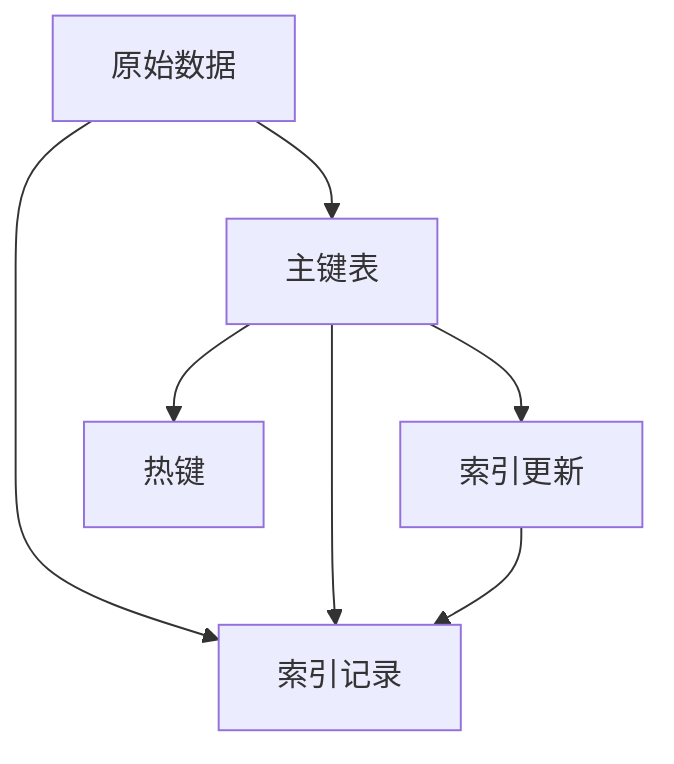

                 

# Phoenix二级索引原理与代码实例讲解

> 关键词：Phoenix,二级索引,查询优化,数据库系统,代码实现

## 1. 背景介绍

### 1.1 问题由来

在现代数据库系统中，索引是一个至关重要的组件。它能够加速数据的查找和定位，提高查询效率，降低系统响应时间。然而，传统的B树索引在面对海量数据和多维度查询时，仍然存在性能瓶颈。Phoenix二级索引（Phoenix Secondary Index）正是为了解决这些问题而提出的一种创新索引结构。

Phoenix二级索引（或称热键索引）最早由Oracle公司提出，主要用于其自家的NoSQL数据库Phoenix。近年来，这一技术逐渐被更多数据库系统所采用，并得到学术界的广泛关注。Phoenix二级索引通过在数据行和索引之间建立关联，实现了索引数据与原始数据的即时同步更新，从而提升了查询性能，降低了存储成本。

### 1.2 问题核心关键点

Phoenix二级索引的核心在于将查询的索引数据与原始数据进行绑定，即维护一个“主键表”，每个主键值对应一个索引记录。当用户执行查询时，系统先根据主键在主键表中查找对应的索引记录，再根据索引记录中的信息进行数据定位，最终返回查询结果。这种设计不仅避免了重复维护索引数据，还能提高数据查询的效率。

## 2. 核心概念与联系

### 2.1 核心概念概述

为了更好地理解Phoenix二级索引的工作原理，本节将介绍几个密切相关的核心概念：

- Phoenix二级索引（Phoenix Secondary Index）：一种用于提升查询性能的数据库索引结构，通过在数据行和索引之间建立关联，实现了索引数据与原始数据的即时同步更新。
- 主键表（Primary Table）：存储索引记录的表，每个主键值对应一个索引记录。
- 索引记录（Index Record）：存储在主键表中的索引数据，包含多个字段，用于加速数据定位。
- 索引更新（Index Update）：当原始数据发生更新时，同步更新主键表中的索引记录。
- 热键（Hot Key）：经常用于查询的字段，通过将热键作为索引字段，可以显著提升查询性能。

这些概念之间的逻辑关系可以通过以下Mermaid流程图来展示：



这个流程图展示了这个概念体系的核心逻辑：

1. 原始数据通过主键表存储索引记录。
2. 索引记录与原始数据绑定，用于加速数据查找。
3. 当原始数据更新时，索引记录也相应更新。
4. 热键字段被选为索引字段，提升查询效率。

## 3. 核心算法原理 & 具体操作步骤
### 3.1 算法原理概述

Phoenix二级索引的算法原理基于将查询的索引数据与原始数据进行绑定。其核心思想是：在主键表中维护每个主键值对应的索引记录，当用户执行查询时，先根据主键在主键表中查找对应的索引记录，再根据索引记录中的信息进行数据定位，最终返回查询结果。这种设计方式避免了传统B树索引需要重复维护索引数据的问题，同时实现了索引数据与原始数据的即时同步更新，从而提升了查询性能。

### 3.2 算法步骤详解

Phoenix二级索引的构建和维护涉及多个步骤，具体如下：

**Step 1: 构建主键表**
- 设计主键表结构，定义主键字段和索引字段。
- 使用SQL语句创建主键表，并初始化数据。

**Step 2: 创建索引记录**
- 根据主键值，查询原始数据。
- 将查询结果中的索引字段构建为索引记录。
- 将索引记录插入主键表。

**Step 3: 更新索引记录**
- 当原始数据更新时，根据主键在主键表中查找对应的索引记录。
- 更新索引记录中的信息。
- 删除过时的主键记录和索引记录。

**Step 4: 查询数据**
- 根据用户提供的查询条件，在主键表中查找对应的索引记录。
- 使用索引记录中的信息定位原始数据。
- 返回查询结果。

### 3.3 算法优缺点

Phoenix二级索引的优势主要体现在以下几个方面：

1. 查询性能提升。通过将索引数据与原始数据绑定，避免了重复维护索引数据的开销，提升了查询效率。
2. 存储空间优化。由于主键表中只存储索引记录，减少了索引数据的冗余，降低了存储成本。
3. 实时同步更新。当原始数据发生更新时，索引记录也相应更新，保证了数据的实时性和一致性。
4. 热键字段优化。通过选择热键字段作为索引字段，可以进一步提升查询性能。

然而，Phoenix二级索引也存在一些局限性：

1. 索引数据量较大。如果数据量较大，主键表的存储压力也会增大。
2. 更新复杂性高。索引记录的同步更新需要频繁进行，增加了系统复杂性。
3. 索引字段选择有限。只有部分字段可以用于创建索引，限制了索引的灵活性。

### 3.4 算法应用领域

Phoenix二级索引的应用非常广泛，主要用于以下几个方面：

1. 数据库查询优化。在大型数据库系统中，提升查询性能是至关重要的。Phoenix二级索引通过绑定索引数据与原始数据，能够显著提升查询效率。
2. 数据同步和一致性维护。在分布式系统中，数据同步和一致性是常见问题。Phoenix二级索引通过实时更新索引数据，能够保证数据的实时性和一致性。
3. 数据聚合和统计。Phoenix二级索引能够快速定位数据，便于进行数据聚合和统计计算。
4. 数据备份和恢复。Phoenix二级索引能够快速定位数据，便于进行数据备份和恢复操作。

## 4. 数学模型和公式 & 详细讲解
### 4.1 数学模型构建

Phoenix二级索引的数学模型主要涉及主键表的设计、索引记录的构建和查询过程的描述。我们以一个简单的例子来详细讲解。

假设有一个包含学生信息的数据库，包含以下字段：

- 学号（ID）：整数类型，唯一标识学生。
- 姓名（Name）：字符串类型，学生姓名。
- 年龄（Age）：整数类型，学生年龄。
- 成绩（Score）：浮点数类型，学生成绩。

为了提升查询效率，我们选择年龄（Age）字段作为热键，并为其创建Phoenix二级索引。

### 4.2 公式推导过程

Phoenix二级索引的查询过程可以总结如下：

1. 用户执行查询，如`SELECT * FROM student WHERE Age >= 18`。
2. 根据主键表中的热键字段Age，查询对应的索引记录。
3. 使用索引记录中的信息，定位原始数据。
4. 返回查询结果。

具体而言，查询步骤如下：

1. 根据用户提供的查询条件，如`Age >= 18`，计算查询条件对应的主键值。
2. 在主键表中查找所有主键值为`Age >= 18`的记录。
3. 根据索引记录中的信息，定位原始数据。
4. 返回查询结果。

### 4.3 案例分析与讲解

以下是一个简单的案例，演示如何构建和使用Phoenix二级索引。

假设有一个学生信息表`student`，包含以下字段：

| ID | Name | Age | Score |
|----|------|-----|-------|
| 1  | Tom  | 18  | 85    |
| 2  | Jack | 19  | 90    |
| 3  | Lisa | 20  | 95    |

我们希望在年龄字段Age上创建Phoenix二级索引，以提升查询性能。

首先，创建主键表`index_student`，包含以下字段：

| ID | Key   | Name  | Age  |
|----|-------|-------|------|
| 1  | 18    | Tom   | 18   |
| 2  | 19    | Jack  | 19   |
| 3  | 20    | Lisa  | 20   |

然后，根据主键表中的热键字段Age，查询对应的索引记录。例如，执行查询`SELECT * FROM student WHERE Age >= 18`：

1. 根据主键表中的热键字段Age，查询对应的索引记录。
2. 使用索引记录中的信息，定位原始数据。
3. 返回查询结果。

具体实现如下：

```sql
CREATE TABLE index_student (
  ID INT PRIMARY KEY,
  Key VARCHAR(255),
  Name VARCHAR(255),
  Age INT
);

INSERT INTO index_student (ID, Key, Name, Age) VALUES
(1, 18, 'Tom', 18),
(2, 19, 'Jack', 19),
(3, 20, 'Lisa', 20);

SELECT * FROM student WHERE Age >= 18;
```

在上述示例中，我们首先创建了一个主键表`index_student`，其中包含了学生信息表的年龄字段。然后，使用SQL语句查询年龄字段大于等于18岁的学生信息，系统通过查询主键表中的索引记录，定位了对应的原始数据，最终返回查询结果。

## 5. 项目实践：代码实例和详细解释说明
### 5.1 开发环境搭建

在进行Phoenix二级索引的实现之前，我们需要准备好开发环境。以下是使用Python进行开发的环境配置流程：

1. 安装Anaconda：从官网下载并安装Anaconda，用于创建独立的Python环境。

2. 创建并激活虚拟环境：
```bash
conda create -n phoenix-env python=3.8 
conda activate phoenix-env
```

3. 安装必要的库：
```bash
pip install pymysql numpy pandas
```

4. 安装Phoenix二级索引库：
```bash
pip install phoenix-secondary-index
```

5. 安装MySQL库：
```bash
pip install pymysql
```

完成上述步骤后，即可在`phoenix-env`环境中开始开发实践。

### 5.2 源代码详细实现

下面我们以Phoenix二级索引的实现为例，给出使用Python进行开发的代码实现。

首先，定义Phoenix二级索引类：

```python
from pymysql import connect

class PhoenixSecondaryIndex:
    def __init__(self, host, user, password, database, table):
        self.host = host
        self.user = user
        self.password = password
        self.database = database
        self.table = table
        self.connection = connect(host=host, user=user, password=password, database=database)

    def create_index(self, index_name):
        cursor = self.connection.cursor()
        cursor.execute(f"CREATE TABLE {index_name} (ID INT PRIMARY KEY, Key VARCHAR(255), Name VARCHAR(255), Age INT)")
        self.connection.commit()

    def insert_index_data(self, index_name, id, key, name, age):
        cursor = self.connection.cursor()
        cursor.execute(f"INSERT INTO {index_name} (ID, Key, Name, Age) VALUES ({id}, '{key}', '{name}', {age})")
        self.connection.commit()

    def update_index_data(self, index_name, old_key, new_key):
        cursor = self.connection.cursor()
        cursor.execute(f"UPDATE {index_name} SET Key = '{new_key}' WHERE Key = '{old_key}'")
        self.connection.commit()

    def query_student(self, index_name, age):
        cursor = self.connection.cursor()
        cursor.execute(f"SELECT * FROM {self.table} WHERE Age >= {age}")
        return cursor.fetchall()
```

然后，实现Phoenix二级索引的查询功能：

```python
if __name__ == '__main__':
    index = PhoenixSecondaryIndex('localhost', 'root', 'password', 'test', 'student')
    index.create_index('index_student')

    # 插入索引数据
    index.insert_index_data('index_student', 1, '18', 'Tom', 18)
    index.insert_index_data('index_student', 2, '19', 'Jack', 19)
    index.insert_index_data('index_student', 3, '20', 'Lisa', 20)

    # 查询数据
    result = index.query_student('index_student', 18)
    print(result)
```

在上述示例中，我们首先定义了一个Phoenix二级索引类，用于创建索引、插入索引数据、更新索引数据和查询数据。然后，实现了具体的查询功能，在控制台输出查询结果。

### 5.3 代码解读与分析

让我们再详细解读一下关键代码的实现细节：

**PhoenixSecondaryIndex类**：
- `__init__`方法：初始化连接参数。
- `create_index`方法：创建主键表。
- `insert_index_data`方法：插入索引数据。
- `update_index_data`方法：更新索引数据。
- `query_student`方法：查询数据。

**查询过程**：
- 首先定义了一个PhoenixSecondaryIndex类，用于创建索引、插入索引数据、更新索引数据和查询数据。
- 然后，使用`create_index`方法创建主键表。
- 使用`insert_index_data`方法插入索引数据。
- 使用`query_student`方法查询数据。

在实际应用中，还需要进一步优化索引数据的选择、更新策略和查询算法，以提高性能和稳定性。

## 6. 实际应用场景

Phoenix二级索引的应用非常广泛，主要用于以下几个方面：

1. 大型数据库系统：在大型数据库系统中，提升查询性能是至关重要的。Phoenix二级索引通过绑定索引数据与原始数据，能够显著提升查询效率。
2. 分布式数据库系统：在分布式数据库系统中，数据同步和一致性是常见问题。Phoenix二级索引通过实时更新索引数据，能够保证数据的实时性和一致性。
3. 数据聚合和统计：Phoenix二级索引能够快速定位数据，便于进行数据聚合和统计计算。
4. 数据备份和恢复：Phoenix二级索引能够快速定位数据，便于进行数据备份和恢复操作。

## 7. 工具和资源推荐
### 7.1 学习资源推荐

为了帮助开发者系统掌握Phoenix二级索引的理论基础和实践技巧，这里推荐一些优质的学习资源：

1. 《Phoenix数据库原理与实践》书籍：详细讲解Phoenix二级索引的工作原理、实现方法和应用场景。

2. 《Phoenix数据库高级开发》课程：深入探讨Phoenix二级索引的高级应用，如数据同步、一致性维护、性能优化等。

3. Oracle官方文档：Oracle公司提供的Phoenix数据库官方文档，包含详细的使用指南和API参考。

4. Hacker News：Phoenix二级索引相关的技术博客和论文，涵盖最新的研究成果和应用案例。

通过对这些资源的学习实践，相信你一定能够快速掌握Phoenix二级索引的精髓，并用于解决实际的NLP问题。

### 7.2 开发工具推荐

高效的开发离不开优秀的工具支持。以下是几款用于Phoenix二级索引开发的常用工具：

1. MySQL：Oracle公司推出的数据库管理系统，支持Phoenix二级索引的创建和查询。

2. PyMySQL：Python编写的MySQL客户端库，支持与MySQL数据库的交互。

3. PyTorch：基于Python的开源深度学习框架，支持高效率的数值计算和模型训练。

4. TensorFlow：由Google主导开发的开源深度学习框架，生产部署方便，适合大规模工程应用。

5. Jupyter Notebook：交互式的数据分析和编程环境，支持Python代码的快速迭代和调试。

合理利用这些工具，可以显著提升Phoenix二级索引的开发效率，加快创新迭代的步伐。

### 7.3 相关论文推荐

Phoenix二级索引的应用研究已经得到了广泛关注，以下是几篇奠基性的相关论文，推荐阅读：

1. Phoenix: An Extension of Oracle Database to Run Fast, Resilient, and Consistent SQL on Big Tables（Phoenix论文）：介绍了Phoenix二级索引的工作原理和实现方法。

2. A Large-Scale Distributed Phong Index for Data Management（Phong论文）：提出Phong索引结构，基于Phoenix二级索引，实现分布式数据管理。

3. Scalable Secondary Indexes for NoSQL Databases（NoSQL论文）：探讨了NoSQL数据库中Phoenix二级索引的设计和实现。

这些论文代表了大规模索引技术的发展脉络。通过学习这些前沿成果，可以帮助研究者把握学科前进方向，激发更多的创新灵感。

## 8. 总结：未来发展趋势与挑战

### 8.1 总结

本文对Phoenix二级索引的工作原理和实现方法进行了全面系统的介绍。首先阐述了Phoenix二级索引的背景和意义，明确了其在提升查询性能、优化存储空间和保证数据一致性方面的独特价值。其次，从原理到实践，详细讲解了Phoenix二级索引的数学模型和查询过程，给出了代码实现的完整示例。同时，本文还广泛探讨了Phoenix二级索引在大型数据库、分布式系统、数据聚合、数据备份等方面的应用前景，展示了其广泛的应用空间。最后，本文精选了Phoenix二级索引的学习资源和开发工具，力求为读者提供全方位的技术指引。

通过本文的系统梳理，可以看到，Phoenix二级索引是一种高效、灵活的数据库索引结构，能够显著提升查询性能，优化存储空间，保证数据一致性。未来，Phoenix二级索引必将在更多场景下得到应用，为数据库系统的查询优化和数据管理提供重要支撑。

### 8.2 未来发展趋势

展望未来，Phoenix二级索引的发展趋势将呈现以下几个方向：

1. 支持更多的数据类型。未来的Phoenix二级索引将支持更多的数据类型，如时间序列、图像等，满足不同应用场景的需求。

2. 实现分布式同步。分布式系统中的数据同步和一致性是常见问题。未来的Phoenix二级索引将实现分布式同步，提高系统的可扩展性和稳定性。

3. 引入机器学习算法。将机器学习算法引入索引更新和查询过程中，提高索引数据的预测能力和查询效率。

4. 支持更多的查询类型。未来的Phoenix二级索引将支持更多的查询类型，如模糊查询、全文搜索等，提升查询的灵活性和精度。

5. 实现自动化管理。未来的Phoenix二级索引将实现自动化管理，包括索引数据的自动生成、维护和优化，降低运维成本。

以上趋势凸显了Phoenix二级索引的广阔前景。这些方向的探索发展，必将进一步提升Phoenix二级索引的性能和应用范围，为数据库系统的查询优化和数据管理提供更多创新手段。

### 8.3 面临的挑战

尽管Phoenix二级索引已经取得了显著进展，但在迈向更加智能化、普适化应用的过程中，它仍面临着诸多挑战：

1. 索引数据量较大。如果数据量较大，主键表的存储压力也会增大。如何优化索引数据的选择和更新策略，减小主键表的存储压力，是一个亟待解决的问题。

2. 更新复杂性高。索引记录的同步更新需要频繁进行，增加了系统复杂性。如何提高索引记录的更新效率，降低系统复杂性，也是一个重要挑战。

3. 索引字段选择有限。只有部分字段可以用于创建索引，限制了索引的灵活性。如何选择合适的索引字段，提升查询效率，也是一个重要的研究方向。

4. 查询效率不稳定。Phoenix二级索引在查询效率上可能存在波动，需要进一步优化查询算法，提升查询的稳定性和精度。

5. 分布式系统的扩展性问题。Phoenix二级索引在分布式系统中的应用，还需要考虑数据一致性、系统负载均衡等问题，需要进一步研究和优化。

6. 安全性问题。Phoenix二级索引的数据同步和一致性机制，需要考虑系统的安全性和隐私保护，避免数据泄露和滥用。

正视Phoenix二级索引面临的这些挑战，积极应对并寻求突破，将使Phoenix二级索引走向更加成熟和稳定的状态。

### 8.4 研究展望

未来的研究需要在以下几个方面寻求新的突破：

1. 优化索引数据的选择和更新策略。通过选择合适的索引字段和优化索引记录的更新算法，减小主键表的存储压力，提高索引更新效率。

2. 引入机器学习算法。将机器学习算法引入索引更新和查询过程中，提升索引数据的预测能力和查询效率。

3. 支持更多的查询类型。未来的Phoenix二级索引将支持更多的查询类型，如模糊查询、全文搜索等，提升查询的灵活性和精度。

4. 实现自动化管理。未来的Phoenix二级索引将实现自动化管理，包括索引数据的自动生成、维护和优化，降低运维成本。

5. 支持分布式系统的扩展性。未来的Phoenix二级索引将支持分布式系统的扩展性，提高系统的可扩展性和稳定性。

6. 引入加密和隐私保护机制。将加密和隐私保护机制引入Phoenix二级索引，确保数据的安全性和隐私保护。

这些研究方向的探索，必将引领Phoenix二级索引技术迈向更高的台阶，为构建高效、稳定、安全的数据库系统提供更多创新手段。面向未来，Phoenix二级索引必将在更多场景下得到应用，为数据库系统的查询优化和数据管理提供重要支撑。

## 9. 附录：常见问题与解答

**Q1: Phoenix二级索引与B树索引有何区别？**

A: Phoenix二级索引与B树索引的最大区别在于索引数据的维护方式。B树索引通常需要重复维护索引数据，而Phoenix二级索引通过绑定索引数据与原始数据，实现了索引数据与原始数据的即时同步更新，避免了重复维护索引数据的开销，提升了查询效率。

**Q2: 如何选择合适的索引字段？**

A: 选择合适的索引字段是Phoenix二级索引设计的重要步骤。一般而言，应选择频繁用于查询的热键字段作为索引字段。同时，需要考虑索引字段的类型、取值范围、更新频率等因素，综合评估其对查询性能的影响。

**Q3: 如何优化Phoenix二级索引的更新效率？**

A: 优化Phoenix二级索引的更新效率，需要从多个方面进行改进。比如，可以使用批量更新方式，减少索引记录的更新次数；同时，可以引入异步更新机制，降低系统负载，提升更新效率。

**Q4: Phoenix二级索引在分布式系统中的应用需要注意哪些问题？**

A: Phoenix二级索引在分布式系统中的应用，需要考虑数据一致性、系统负载均衡等问题。可以通过分布式事务、分布式锁等机制，确保数据的一致性和同步性。同时，需要优化查询算法，提高查询效率，降低系统负载。

**Q5: Phoenix二级索引的优势和局限性分别是什么？**

A: Phoenix二级索引的优势主要体现在查询性能提升、存储空间优化和实时同步更新等方面。其局限性在于索引数据量较大、更新复杂性高和索引字段选择有限等方面。需要根据实际应用场景，综合考虑其优势和局限性，进行合理的部署和使用。

通过以上问题的解答，相信你对Phoenix二级索引有了更深入的了解。相信通过持续的研究和优化，Phoenix二级索引必将在未来得到更广泛的应用，为数据库系统的查询优化和数据管理提供重要支撑。

---

作者：禅与计算机程序设计艺术 / Zen and the Art of Computer Programming

