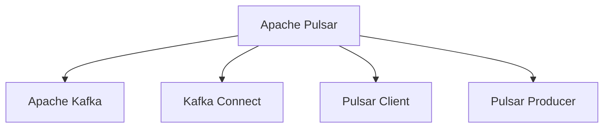

                 

# Pulsar Producer原理与代码实例讲解

> 关键词：Pulsar, Apache Pulsar, Kafka, Producer, 分布式消息系统, 消息队列, 代码实例, Kafka Connect, 日志处理

## 1. 背景介绍

### 1.1 问题由来

随着企业数据量的爆炸性增长，如何高效、可靠地处理和传输数据成为一个迫切的问题。传统的数据传输方式如文件传输、数据库交互等已经无法满足需求。而消息队列作为一种高效、可靠的数据传输方式，逐渐成为主流的解决方案。

Apache Pulsar是一个由Apache软件基金会维护的分布式消息平台，支持高吞吐量、低延迟的消息传递。Pulsar不仅兼容Apache Kafka协议，还提供了更好的性能和扩展性。

Pulsar Producer是Pulsar的核心组件之一，负责将数据发送到Pulsar集群。Pulsar Producer可以处理高并发的消息传输，支持多种数据源和格式，是构建高性能数据流应用的基础。

### 1.2 问题核心关键点

Pulsar Producer的核心关键点包括：

- 高性能：支持高吞吐量、低延迟的消息传递，能够处理大量并发连接。
- 可靠性：支持数据持久化，保证消息的可靠传输和处理。
- 灵活性：支持多种数据源和格式，可以处理文本、二进制、JSON等多种数据类型。
- 扩展性：支持分布式部署，能够动态扩展集群规模，适应数据流量的变化。

这些关键点使得Pulsar Producer成为构建高性能、可靠的数据流应用的理想选择。

## 2. 核心概念与联系

### 2.1 核心概念概述

为了更好地理解Pulsar Producer的工作原理和架构，本节将介绍几个密切相关的核心概念：

- Apache Pulsar：Apache Pulsar是一个分布式消息平台，提供高吞吐量、低延迟的消息传递，支持多种协议和数据格式，适用于分布式数据流应用。
- Apache Kafka：Apache Kafka是另一个流行的分布式消息系统，与Pulsar兼容，是Pulsar的前身。
- Kafka Connect：Kafka Connect是Kafka的数据集成工具，提供各种插件和连接器，可以用于数据流处理、日志收集等场景。
- Pulsar Client：Pulsar Client是Pulsar的客户端，提供各种API和工具，用于消息的生产和消费。
- Pulsar Producer：Pulsar Producer是Pulsar的核心组件之一，负责将数据发送到Pulsar集群。

这些核心概念之间的逻辑关系可以通过以下Mermaid流程图来展示：



这个流程图展示了大数据流应用中各个组件的关联关系：

1. Pulsar平台是消息传输的核心，支持多种协议和数据格式。
2. Kafka作为Pulsar的前身，提供了兼容的API和工具。
3. Kafka Connect用于数据集成，将各种数据源和格式连接到Pulsar平台。
4. Pulsar Client提供了Pulsar的API和工具，用于消息的生产和消费。
5. Pulsar Producer是Pulsar的核心组件之一，负责将数据发送到Pulsar集群。

## 3. 核心算法原理 & 具体操作步骤

### 3.1 算法原理概述

Pulsar Producer的基本工作原理如下：

1. 连接到Pulsar集群：Pulsar Producer首先连接到Pulsar集群，获取集群的相关配置信息。
2. 创建生产者实例：根据配置信息创建生产者实例，设置生产者名称、主题名等关键参数。
3. 发送消息：通过生产者实例发送消息到指定的主题，Pulsar集群会将消息分布式存储在各个分区中。
4. 处理消息确认：Pulsar Producer会根据配置参数处理消息确认机制，确保消息的可靠传输。

Pulsar Producer的算法原理主要基于分布式消息队列的设计思想，通过集群中的多节点分布式存储和处理，实现高吞吐量、高可靠性、高可扩展性的消息传递。

### 3.2 算法步骤详解

Pulsar Producer的实现步骤包括以下几个关键步骤：

**Step 1: 连接到Pulsar集群**

Pulsar Producer首先需要连接到Pulsar集群，获取集群的相关配置信息，如集群地址、认证信息、主题名等。可以使用Pulsar的官方SDK或Kafka Connect等工具进行连接。

```python
from pulsar import PulsarClient

client = PulsarClient('pulsar://localhost:6650', authentication_config={'username': 'root', 'password': 'root'})
```

**Step 2: 创建生产者实例**

根据Pulsar集群的信息，创建生产者实例。可以设置生产者名称、主题名、消息的生产策略等参数。

```python
producer = client.create_producer('test-topic', deliveryGuarantee='at-least-once', message_format='json')
```

**Step 3: 发送消息**

使用生产者实例发送消息到指定的主题。可以使用`send()`方法批量发送消息，也可以使用`send_message()`方法发送单个消息。

```python
producer.send_message('{"name": "John", "age": 30, "city": "New York"}')
```

**Step 4: 处理消息确认**

根据配置参数，Pulsar Producer会自动处理消息的确认机制。可以设置确认策略为`acknowledgement`，确保消息的可靠传输。

```python
producer.ack ack.mode='ackTimeout', ack.timeout=5000
```

**Step 5: 关闭生产者实例**

发送完所有消息后，需要关闭生产者实例，释放资源。

```python
producer.close()
```

以上是Pulsar Producer的基本实现步骤。开发者可以根据实际需求，灵活调整配置参数，实现更高效、可靠的数据传输。

### 3.3 算法优缺点

Pulsar Producer具有以下优点：

1. 高性能：支持高吞吐量、低延迟的消息传递，能够处理大量并发连接。
2. 可靠性：支持数据持久化，保证消息的可靠传输和处理。
3. 灵活性：支持多种数据源和格式，可以处理文本、二进制、JSON等多种数据类型。
4. 扩展性：支持分布式部署，能够动态扩展集群规模，适应数据流量的变化。

同时，Pulsar Producer也存在一些缺点：

1. 配置复杂：配置参数较多，需要仔细调整，才能达到最优性能。
2. 学习曲线陡峭：需要一定的学习成本，才能熟练掌握其使用方法。
3. 部署成本高：需要搭建和维护Pulsar集群，成本较高。

尽管存在这些缺点，但就目前而言，Pulsar Producer仍然是构建高性能、可靠的数据流应用的最佳选择。

### 3.4 算法应用领域

Pulsar Producer的应用领域非常广泛，以下是几个典型的应用场景：

- 数据采集：从各种数据源采集数据，如日志、事件、告警等。
- 消息队列：构建分布式消息队列，支持高吞吐量、低延迟的消息传递。
- 数据存储：将数据存储在Pulsar集群中，方便后续的查询和处理。
- 数据集成：通过Kafka Connect等工具，将各种数据源和格式连接到Pulsar平台。
- 日志处理：将日志数据发送到Pulsar集群，方便实时监控和分析。

此外，Pulsar Producer还被广泛应用于大数据流处理、分布式存储、实时数据同步等诸多场景中，为数据流应用提供坚实的技术基础。

## 4. 数学模型和公式 & 详细讲解 & 举例说明

### 4.1 数学模型构建

Pulsar Producer的数学模型主要涉及消息的生产、传输和确认等过程。假设生产者向主题发送了N条消息，每条消息的大小为m字节，消息的生产速率和传输速率分别为r和t，消息的确认策略为`ackGuarantee`，那么生产者发送N条消息所需的总时间T可以表示为：

$$
T = \frac{N}{r} + \frac{Nm}{t} + \frac{N}{ackGuarantee}
$$

其中，生产速率r和传输速率t的单位为字节/秒，消息的确认策略`ackGuarantee`表示生产者等待消息确认的策略，可以是`none`、`one`、`two`等，`none`表示不等待确认，`one`表示等待一次确认，`two`表示等待两次确认。

### 4.2 公式推导过程

根据上述数学模型，我们可以进一步推导生产者发送N条消息所需的总时间T的公式。

1. 生产时间：生产N条消息所需的总时间为$\frac{N}{r}$。
2. 传输时间：每条消息的大小为m字节，传输速率为t字节/秒，因此传输N条消息所需的总时间为$\frac{Nm}{t}$。
3. 确认时间：根据确认策略`ackGuarantee`，生产者等待消息确认的时间不同，具体为$\frac{N}{ackGuarantee}$。

将以上三部分相加，即可得到生产者发送N条消息所需的总时间T的公式。

### 4.3 案例分析与讲解

假设生产者向主题发送了1000条消息，每条消息的大小为100字节，生产速率和传输速率分别为1KB/s和10MB/s，确认策略为`two`，那么生产者发送1000条消息所需的总时间为：

$$
T = \frac{1000}{1000} + \frac{1000 \times 100}{10 \times 1024} + \frac{1000}{2} = 2.5s
$$

在实际应用中，生产者发送消息的时间取决于多个因素，如消息大小、生产速率、传输速率、确认策略等。开发者可以根据实际需求，调整这些参数，以获得最优性能。

## 5. 项目实践：代码实例和详细解释说明

### 5.1 开发环境搭建

在进行Pulsar Producer实践前，我们需要准备好开发环境。以下是使用Python进行Pulsar开发的环境配置流程：

1. 安装Pulsar SDK：从官方文档下载并安装Pulsar SDK。
2. 安装Pulsar Python客户端：使用pip安装Pulsar Python客户端。
3. 安装必要的依赖库：如pykafka、pyarrow等。

```bash
pip install pulsar python-kafka-python pyarrow
```

完成上述步骤后，即可在本地搭建Pulsar Producer的开发环境。

### 5.2 源代码详细实现

以下是使用Python实现Pulsar Producer的代码示例：

```python
from pulsar import PulsarClient

# 创建PulsarClient实例
client = PulsarClient('pulsar://localhost:6650', authentication_config={'username': 'root', 'password': 'root'})

# 创建生产者实例
producer = client.create_producer('test-topic', deliveryGuarantee='at-least-once', message_format='json')

# 发送消息
producer.send_message('{"name": "John", "age": 30, "city": "New York"}')

# 关闭生产者实例
producer.close()
```

以上代码实现了基本的Pulsar Producer功能，包括连接到Pulsar集群、创建生产者实例、发送消息、关闭生产者实例等步骤。开发者可以根据实际需求，添加更多的功能模块，如错误处理、日志记录、监控告警等。

### 5.3 代码解读与分析

让我们再详细解读一下关键代码的实现细节：

**PulsarClient类**：
- `__init__`方法：初始化PulsarClient实例，设置集群地址、认证信息等关键参数。
- `create_producer`方法：创建生产者实例，设置生产者名称、主题名、消息的生产策略等参数。
- `send_message`方法：发送消息到指定的主题。
- `close`方法：关闭生产者实例，释放资源。

**生产者实例**：
- 生产者实例是Pulsar Producer的核心组件，负责将消息发送到Pulsar集群。
- 在创建生产者实例时，可以设置多个参数，如生产者名称、主题名、消息的生产策略、消息的生产速率、消息的传输速率等。

**消息发送**：
- 生产者实例可以使用`send_message`方法发送消息到指定的主题。
- `send_message`方法接受一个字典作为参数，表示要发送的消息内容。

**生产者关闭**：
- 发送完所有消息后，需要调用`close`方法关闭生产者实例，释放资源。
- `close`方法可以异步关闭生产者实例，释放资源。

以上代码示例展示了Pulsar Producer的基本实现过程。开发者可以根据实际需求，扩展功能模块，实现更灵活、高效的数据流应用。

## 6. 实际应用场景

### 6.1 数据采集

Pulsar Producer可以用于从各种数据源采集数据，如日志、事件、告警等。例如，可以将日志数据发送到Pulsar集群，方便后续的实时监控和分析。

### 6.2 消息队列

Pulsar Producer可以构建分布式消息队列，支持高吞吐量、低延迟的消息传递。例如，可以将订单信息、交易数据等高并发的数据发送到Pulsar集群，进行消息队列管理和分布式处理。

### 6.3 数据存储

Pulsar Producer可以将数据存储在Pulsar集群中，方便后续的查询和处理。例如，可以将用户数据、产品信息等数据发送到Pulsar集群，进行分布式存储和管理。

### 6.4 数据集成

Pulsar Producer可以通过Kafka Connect等工具，将各种数据源和格式连接到Pulsar平台。例如，可以将结构化数据、非结构化数据、图像数据等通过Kafka Connect连接到Pulsar集群，进行数据集成和处理。

### 6.5 日志处理

Pulsar Producer可以将日志数据发送到Pulsar集群，方便实时监控和分析。例如，可以将服务器日志、应用程序日志等发送到Pulsar集群，进行日志收集和处理。

## 7. 工具和资源推荐

### 7.1 学习资源推荐

为了帮助开发者系统掌握Pulsar Producer的理论基础和实践技巧，这里推荐一些优质的学习资源：

1. Apache Pulsar官方文档：官方文档详细介绍了Pulsar的产生背景、基本概念、开发指南等内容，是学习和使用的必备资料。
2. Pulsar in Action书籍：本书由Pulsar的创建者之一撰写，详细介绍了Pulsar的产生背景、基本概念、开发实践等内容，是深入学习Pulsar的推荐书籍。
3. Pulsar社区：Pulsar社区提供了丰富的学习资源，包括官方博客、技术论坛、社区讨论等内容，可以及时获取Pulsar的最新动态和技术分享。
4. Kafka Connect官方文档：Kafka Connect是Kafka的数据集成工具，提供了各种插件和连接器，可以用于数据流处理、日志收集等场景。
5. Pulsar Python客户端API文档：Pulsar Python客户端提供了丰富的API和工具，用于消息的生产和消费。

通过对这些资源的学习实践，相信你一定能够快速掌握Pulsar Producer的精髓，并用于解决实际的Pulsar问题。

### 7.2 开发工具推荐

高效的开发离不开优秀的工具支持。以下是几款用于Pulsar Producer开发的常用工具：

1. Pulsar SDK：Pulsar SDK是Pulsar的官方开发工具，提供了丰富的API和工具，用于消息的生产和消费。
2. Kafka Connect：Kafka Connect是Kafka的数据集成工具，提供各种插件和连接器，可以用于数据流处理、日志收集等场景。
3. Jupyter Notebook：Jupyter Notebook是免费的Python开发工具，支持代码编辑、代码运行、代码调试等功能，适合Python开发者的使用。
4. Visual Studio Code：Visual Studio Code是免费的跨平台代码编辑器，支持Python、Java、C++等多种语言，支持Git、Docker等开发工具的集成。
5. PyCharm：PyCharm是官方的Python IDE，支持Python、Java、Kotlin等多种语言，支持丰富的插件和工具，是开发Pulsar Producer的好帮手。

合理利用这些工具，可以显著提升Pulsar Producer的开发效率，加快创新迭代的步伐。

### 7.3 相关论文推荐

Pulsar Producer的应用和发展离不开学界的持续研究。以下是几篇奠基性的相关论文，推荐阅读：

1. Apache Pulsar: A Distributed Streaming Platform：提出Apache Pulsar的分布式消息处理架构，介绍了Pulsar的产生背景、基本概念、功能特点等内容。
2. Pulsar for the Internet of Things：研究Pulsar在物联网场景中的应用，提出了Pulsar的分布式消息处理方案，并进行了实验验证。
3. Building Distributed Streaming Systems with Apache Pulsar：研究如何构建分布式消息处理系统，并详细介绍了Pulsar的分布式消息处理方案。
4. Apache Pulsar：A Distributed Streaming Platform for IoT, Analytics and Cloud-Native Applications：介绍Pulsar的分布式消息处理方案，并进行了实验验证。
5. Apache Pulsar in Action：详细介绍了Pulsar的产生背景、基本概念、开发实践等内容，是深入学习Pulsar的推荐书籍。

这些论文代表了大数据流应用的最新进展，通过学习这些前沿成果，可以帮助研究者把握学科前进方向，激发更多的创新灵感。

## 8. 总结：未来发展趋势与挑战

### 8.1 研究成果总结

本文对Pulsar Producer的原理与代码实例进行了全面系统的介绍。首先阐述了Pulsar Producer的产生背景和意义，明确了Pulsar Producer在数据流应用中的重要价值。其次，从原理到实践，详细讲解了Pulsar Producer的数学模型和实现步骤，给出了Pulsar Producer代码实现的完整示例。同时，本文还广泛探讨了Pulsar Producer在数据采集、消息队列、数据存储、数据集成、日志处理等诸多场景中的应用前景，展示了Pulsar Producer的广阔前景。

### 8.2 未来发展趋势

展望未来，Pulsar Producer将呈现以下几个发展趋势：

1. 性能优化：随着硬件和软件技术的进步，Pulsar Producer的性能将进一步提升，能够处理更大规模、更高并发的消息传递。
2. 功能扩展：Pulsar Producer将支持更多的数据格式和协议，满足不同场景的需求。
3. 管理优化：Pulsar Producer的管理界面将更加友好，提供更多的可视化和监控功能，方便用户管理和维护。
4. 生态系统：Pulsar Producer将与其他Pulsar组件进行更深度的集成，形成一个完整的分布式消息处理生态系统。
5. 安全保障：Pulsar Producer将加强安全保障，支持数据加密、身份验证等安全机制，保证数据安全。

这些趋势将进一步提升Pulsar Producer的性能和可靠性，满足更多场景的需求。

### 8.3 面临的挑战

尽管Pulsar Producer已经取得了一定的进展，但在迈向更加智能化、普适化应用的过程中，它仍面临着诸多挑战：

1. 性能瓶颈：随着数据量的增加，Pulsar Producer的性能瓶颈将逐渐显现，需要进一步优化。
2. 资源消耗：Pulsar Producer的资源消耗较大，需要更多的硬件和软件支持。
3. 生态系统：Pulsar Producer的生态系统相对较弱，需要更多的工具和插件支持。
4. 安全问题：Pulsar Producer的数据安全问题需要进一步加强，防止数据泄露和攻击。
5. 维护成本：Pulsar Producer的维护成本较高，需要更多的技术支持和培训。

尽管存在这些挑战，但相信随着技术的进步和社区的持续努力，这些挑战终将逐步克服，Pulsar Producer必将在未来的数据流应用中发挥更大的作用。

### 8.4 研究展望

未来的研究需要在以下几个方面寻求新的突破：

1. 性能优化：优化Pulsar Producer的性能，提升其处理大规模、高并发的消息传递能力。
2. 功能扩展：扩展Pulsar Producer的功能，支持更多的数据格式和协议，满足更多场景的需求。
3. 管理优化：优化Pulsar Producer的管理界面，提供更多的可视化和监控功能，方便用户管理和维护。
4. 生态系统：加强Pulsar Producer的生态系统建设，提供更多的工具和插件支持。
5. 安全保障：加强Pulsar Producer的安全保障，支持数据加密、身份验证等安全机制。

这些研究方向的探索将引领Pulsar Producer技术的发展，为数据流应用提供更加高效、可靠、安全的解决方案。

## 9. 附录：常见问题与解答

**Q1：如何选择合适的生产者实例参数？**

A: 选择合适的生产者实例参数需要考虑多个因素，如生产者名称、主题名、消息的生产策略、消息的生产速率、消息的传输速率等。一般来说，生产者名称和主题名应该具有唯一性，方便后续的查询和处理。消息的生产策略可以根据实际需求选择合适的`ackGuarantee`，如`none`、`one`、`two`等。消息的生产速率和传输速率可以根据集群规模和数据流量进行调整，以满足实际需求。

**Q2：生产者实例如何处理消息确认？**

A: 生产者实例可以通过设置`ackGuarantee`参数来处理消息确认。`ackGuarantee`参数表示生产者等待消息确认的策略，可以是`none`、`one`、`two`等。`none`表示不等待确认，`one`表示等待一次确认，`two`表示等待两次确认。生产者会根据设置的`ackGuarantee`参数，自动处理消息确认，确保消息的可靠传输。

**Q3：Pulsar Producer的性能瓶颈有哪些？**

A: Pulsar Producer的性能瓶颈主要包括生产速率、传输速率和确认时间。生产速率和传输速率决定了生产者发送消息的效率，而确认时间则决定了消息的可靠性和处理时间。如果生产速率和传输速率过高，而确认时间过长，可能会导致消息丢失或处理延迟。因此，需要根据实际需求，调整这些参数，以达到最优性能。

**Q4：Pulsar Producer的资源消耗有哪些？**

A: Pulsar Producer的资源消耗主要包括内存、CPU和网络带宽。内存用于存储消息缓冲区，CPU用于处理消息的生产和确认，网络带宽用于消息的传输。随着数据量的增加，Pulsar Producer的资源消耗会逐渐增大，需要根据实际需求进行优化。

**Q5：Pulsar Producer的生态系统有哪些？**

A: Pulsar Producer的生态系统主要包括Pulsar SDK、Kafka Connect、Pulsar Python客户端等工具。Pulsar SDK提供了丰富的API和工具，用于消息的生产和消费。Kafka Connect是Kafka的数据集成工具，提供各种插件和连接器，可以用于数据流处理、日志收集等场景。Pulsar Python客户端提供了丰富的API和工具，用于消息的生产和消费。

以上是Pulsar Producer的常见问题和解答，通过学习这些知识点，相信你一定能够更好地掌握Pulsar Producer的实现原理和应用场景。

---

作者：禅与计算机程序设计艺术 / Zen and the Art of Computer Programming

