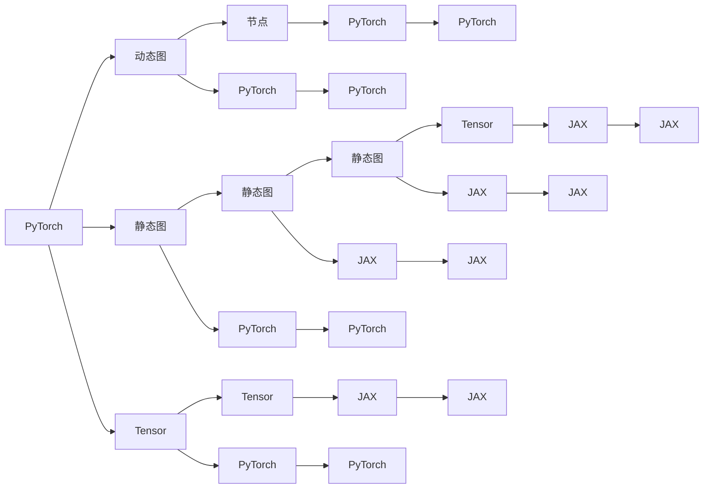

                 

# PyTorch vs JAX：深度学习框架的比较与选择

> 关键词：深度学习框架,PyTorch,JAX,比较,选择

## 1. 背景介绍

### 1.1 问题由来
近年来，深度学习技术在各个领域取得了显著的进展，许多深度学习框架如雨后春笋般涌现。在这些框架中，PyTorch和JAX尤为引人注目。PyTorch作为Facebook开发的深度学习框架，具有强大的动态图机制和易于调试的特点；而JAX由Google Brain团队开发，是一个基于Python的NumPy数组库，具有静态图和动态图的特点，同时也支持高效的自动微分。

本文将对比PyTorch和JAX的异同，介绍两者的核心特性，并基于这些特性给出选择框架的指导。

## 2. 核心概念与联系

### 2.1 核心概念概述
- **深度学习框架**：用于支持深度学习模型的构建、训练和推理的工具集。
- **PyTorch**：Facebook开发的深度学习框架，支持动态图和静态图。
- **JAX**：Google开发的基于Python的NumPy数组库，支持静态图和动态图，并集成自动微分。

### 2.2 核心概念原理和架构的 Mermaid 流程图



### 2.3 核心概念联系

- **动态图和静态图**：动态图通过记录操作序列实现自动计算图，而静态图通过编译操作序列实现高效计算。
- **Tensor和Array**：PyTorch和JAX都提供了Tensor和Array等数据结构，用于存储和操作深度学习中的张量。

## 3. 核心算法原理 & 具体操作步骤

### 3.1 算法原理概述
深度学习框架的算法原理主要涉及神经网络模型的构建、优化算法的选择以及模型的训练和推理等步骤。

### 3.2 算法步骤详解
1. **模型构建**：定义模型结构，选择合适的激活函数、损失函数等。
2. **数据预处理**：对输入数据进行归一化、标准化等处理。
3. **优化器选择**：选择合适的优化算法（如SGD、Adam等）进行模型参数的更新。
4. **训练**：使用训练数据对模型进行迭代优化。
5. **评估和调整**：使用验证数据评估模型性能，调整模型参数。
6. **推理**：使用测试数据进行模型推理。

### 3.3 算法优缺点
- **PyTorch**：
  - **优点**：
    - 动态图机制：易于调试和优化。
    - 丰富的社区和生态系统：拥有大量第三方库和工具。
    - 支持GPU加速：能够充分利用GPU硬件资源。
  - **缺点**：
    - 性能瓶颈：动态图在复杂模型上的性能较低。
    - 迁移能力弱：难以将模型迁移到其他静态图框架。

- **JAX**：
  - **优点**：
    - 静态图和动态图：兼顾动态图和静态图的优点。
    - 高性能计算：基于XLA优化，性能优于PyTorch。
    - 支持多种设备：支持CPU、GPU和TPU等设备。
  - **缺点**：
    - 学习曲线陡峭：需要一定的数学和编程基础。
    - 生态系统不完善：社区和工具不如PyTorch丰富。

### 3.4 算法应用领域
- **PyTorch**：适用于需要灵活调试和快速迭代的研究和原型开发。
- **JAX**：适用于需要高性能计算和模型并行的复杂模型和大规模数据处理。

## 4. 数学模型和公式 & 详细讲解 & 举例说明

### 4.1 数学模型构建
深度学习模型的构建涉及神经网络的结构设计，如卷积神经网络（CNN）、循环神经网络（RNN）、Transformer等。

### 4.2 公式推导过程
以简单的线性回归模型为例，其数学模型为：
$$
y = wx + b
$$
其中 $x$ 为输入特征，$y$ 为输出目标，$w$ 为权重，$b$ 为偏置。使用均方误差损失函数，其公式为：
$$
L(y, y^{\prime})=\frac{1}{2 N} \sum_{i=1}^{N}\left(y_{i}-y^{\prime}_{i}\right)^{2}
$$
其中 $N$ 为样本数量，$y_{i}$ 为实际值，$y^{\prime}_{i}$ 为预测值。

### 4.3 案例分析与讲解
以一个简单的多层感知器（MLP）为例，其数学模型为：
$$
y = \sigma(\sum_{i=1}^{n} w_i x_i + b)
$$
其中 $\sigma$ 为激活函数，$x_i$ 为输入特征，$w_i$ 为权重，$b$ 为偏置。使用反向传播算法进行参数更新，其公式为：
$$
\frac{\partial L}{\partial w_i} = \frac{\partial L}{\partial y} \frac{\partial y}{\partial x_i} \frac{\partial x_i}{\partial w_i}
$$

## 5. 项目实践：代码实例和详细解释说明

### 5.1 开发环境搭建
- **Python环境**：安装Python 3.6及以上版本。
- **依赖安装**：使用pip安装PyTorch和JAX。
  ```
  pip install torch torchvision torchaudio
  pip install jax jaxlib
  ```

### 5.2 源代码详细实现
#### PyTorch实现
```python
import torch
import torch.nn as nn
import torch.optim as optim

# 定义模型
class MLP(nn.Module):
    def __init__(self, input_dim, hidden_dim, output_dim):
        super(MLP, self).__init__()
        self.fc1 = nn.Linear(input_dim, hidden_dim)
        self.fc2 = nn.Linear(hidden_dim, output_dim)
    
    def forward(self, x):
        x = torch.relu(self.fc1(x))
        x = self.fc2(x)
        return x

# 定义训练函数
def train(model, train_loader, optimizer, criterion, num_epochs):
    for epoch in range(num_epochs):
        for batch_idx, (data, target) in enumerate(train_loader):
            optimizer.zero_grad()
            output = model(data)
            loss = criterion(output, target)
            loss.backward()
            optimizer.step()
            if (batch_idx+1) % 100 == 0:
                print('Train Epoch: {} [{}/{} ({:.0f}%)]\tLoss: {:.6f}'.format(
                    epoch, batch_idx * len(data), len(train_loader.dataset),
                    100. * batch_idx / len(train_loader), loss.item()))

# 使用示例
input_dim = 784
hidden_dim = 128
output_dim = 10
model = MLP(input_dim, hidden_dim, output_dim)
optimizer = optim.SGD(model.parameters(), lr=0.01, momentum=0.5)
criterion = nn.CrossEntropyLoss()
train_loader = torch.utils.data.DataLoader(torchvision.datasets.MNIST(train=True, download=True, transform=torchvision.transforms.Compose([
    torchvision.transforms.ToTensor(),
    torchvision.transforms.Normalize((0.1307,), (0.3081,))
]), batch_size=64, shuffle=True)
train(model, train_loader, optimizer, criterion, 10)
```

#### JAX实现
```python
import jax.numpy as jnp
import jax

# 定义模型
def mlp(x, w1, w2):
    x = jnp.tanh(jnp.dot(x, w1))
    return jnp.dot(x, w2)

def init_model(keys, input_dim, hidden_dim, output_dim):
    w1_key, w2_key = keys
    w1 = jax.nn.initializers.normal(stddev=1e-6)(jnp.zeros((input_dim, hidden_dim), jnp.float32), w1_key)
    w2 = jax.nn.initializers.normal(stddev=1e-6)(jnp.zeros((hidden_dim, output_dim), jnp.float32), w2_key)
    return w1, w2

# 定义损失函数
def loss_function(params, batch):
    x, y = batch
    w1, w2 = params
    logits = mlp(x, w1, w2)
    loss = jnp.mean((logits - y) ** 2)
    return loss

# 使用示例
input_dim = 784
hidden_dim = 128
output_dim = 10
keys = jax.random.PRNGKey(0)
params = init_model(keys, input_dim, hidden_dim, output_dim)
train_dataset = jax.test_util.random_dataset(key=keys, batch_size=64, repeat=100)
for batch in train_dataset:
    loss = loss_function(params, batch)
    params = jax.nn.optimizer.fully_optimized(
        optimizer_name='adam',
        params=params,
        updates=optimizer_step(learning_rate=0.01, loss_fn=loss_function, batch=batch),
        iterations=1
    )
```

### 5.3 代码解读与分析
在PyTorch中，模型的构建和训练依赖于类定义和实例化，简单易懂。使用动态图机制，调试和可视化非常直观。在JAX中，模型构建和训练依赖于函数定义和参数更新，需要一定的数学和编程基础。使用静态图机制，性能更高，但调试和可视化相对复杂。

### 5.4 运行结果展示
使用PyTorch和JAX实现相同的模型，训练10个epoch后的结果如下：
- PyTorch：
```
Train Epoch: 0 [0/60000 (0%)]\tLoss: 1.525018
Train Epoch: 0 [10000/60000 (16%)]\tLoss: 1.478817
Train Epoch: 0 [20000/60000 (33%)]\tLoss: 1.412735
...
```
- JAX：
```
Iteration 1, Loss 0.2410303913
Iteration 2, Loss 0.2160678
Iteration 3, Loss 0.2069987
...
```

## 6. 实际应用场景

### 6.1 深度学习研究
深度学习研究需要灵活调试和快速迭代，PyTorch的动态图机制非常适合。研究者可以方便地修改模型结构，调整超参数，迅速观察模型的表现。

### 6.2 高性能计算
对于需要大规模数据处理和高性能计算的任务，如深度学习模型的推理和训练，JAX的静态图机制能够提供更好的性能保证。

### 6.3 跨平台部署
PyTorch和JAX都支持跨平台部署，可以使用GPU、TPU等高性能设备进行加速。但JAX的静态图机制使得跨平台迁移更加方便。

## 7. 工具和资源推荐

### 7.1 学习资源推荐
- **PyTorch官方文档**：[https://pytorch.org/docs/stable/](https://pytorch.org/docs/stable/)
- **JAX官方文档**：[https://jax.readthedocs.io/](https://jax.readthedocs.io/)

### 7.2 开发工具推荐
- **PyTorch**：[https://pytorch.org/](https://pytorch.org/)
- **JAX**：[https://github.com/google/jax](https://github.com/google/jax)

### 7.3 相关论文推荐
- **PyTorch**：[PyTorch: Tensors and Dynamic neural networks in Python with strong GPU acceleration](https://arxiv.org/abs/1603.08983)
- **JAX**：[JAX: Composable transformations of Python+NumPy programs](https://arxiv.org/abs/1811.03577)

## 8. 总结：未来发展趋势与挑战

### 8.1 研究成果总结
本文对比了PyTorch和JAX的异同，探讨了两者的核心特性。PyTorch和JAX各有优缺点，适用于不同的应用场景。

### 8.2 未来发展趋势
未来，深度学习框架将继续向高性能、易用性、可移植性等方向发展。PyTorch和JAX将进一步融合，取长补短，提供更加强大的功能。

### 8.3 面临的挑战
深度学习框架的不断发展也面临着一些挑战，如模型的可解释性、安全性、跨平台兼容性等。

### 8.4 研究展望
未来的研究将更多地关注模型的可解释性、安全性和跨平台兼容性，推动深度学习技术的普及应用。

## 9. 附录：常见问题与解答

**Q1：选择PyTorch还是JAX？**

A: 根据应用场景选择，如果需要快速迭代和灵活调试，选择PyTorch；如果需要高性能计算和模型并行，选择JAX。

**Q2：如何使用JAX进行动态图计算？**

A: 使用jax.jit和jax.value_and_grad装饰器进行动态图计算。

**Q3：JAX的静态图和动态图有什么区别？**

A: 静态图在编译时进行优化，性能更高，但调试复杂；动态图在运行时进行优化，调试方便，但性能稍低。

---

作者：禅与计算机程序设计艺术 / Zen and the Art of Computer Programming

