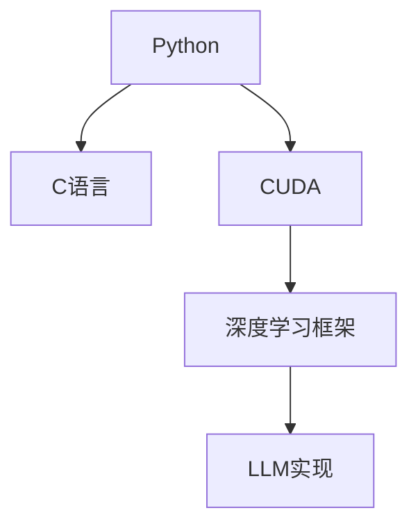

                 

# Python、C和CUDA实现AI：从零开始的LLM之旅

> 关键词：人工智能(AI)，语言模型(LLM)，Python，C语言，CUDA，深度学习，GPU加速

## 1. 背景介绍

### 1.1 问题由来
人工智能(AI)的迅猛发展，尤其是深度学习在图像识别、语音识别、自然语言处理等领域取得的突破，使得LLM（语言模型）成为AI研究的热点之一。LLM通过在大规模无标签文本数据上进行的自监督学习，可以学习到丰富的语言知识，并在特定任务上进行微调，从而具备强大的语言理解和生成能力。然而，由于深度神经网络的复杂性，其训练和推理过程通常需要在高性能硬件上完成，这限制了其在普通计算机上的应用。

### 1.2 问题核心关键点
实现LLM的主要难点在于：
- 大规模数据集的存储和处理：需要构建高效的数据管理系统，支持大数据量的存储和处理。
- 高性能计算：神经网络模型参数量庞大，需要高性能硬件来加速计算过程。
- 模型训练和推理的复杂性：涉及深度学习算法、GPU/CPU并行计算、内存管理等复杂技术。

### 1.3 问题研究意义
掌握Python、C和CUDA在AI中的实现，对于构建高效、高性能的LLM系统具有重要意义：
- 降低开发成本：通过利用现成的库和工具，可以加快项目开发速度，减少人力和物力投入。
- 提升系统性能：通过高性能计算资源，可以大幅度提升模型的训练和推理速度，满足实时应用需求。
- 增强代码可移植性：采用Python、C和CUDA混合编程，可以灵活适配不同的开发平台和硬件环境。
- 推动技术创新：深入了解LLM的实现细节，有助于发现新算法和技术，推动AI领域的前沿研究。

## 2. 核心概念与联系

### 2.1 核心概念概述

为更好地理解Python、C和CUDA在LLM中的实现，本节将介绍几个关键概念：

- Python：一种高级编程语言，以其简洁的语法和丰富的库支持而闻名，常用于快速原型设计和科学计算。
- C语言：一种高效的系统编程语言，适合编写底层系统软件和高性能计算程序。
- CUDA：由NVIDIA开发的并行计算平台，支持GPU加速计算，适合深度学习和高性能科学计算。
- 深度学习框架：如TensorFlow、PyTorch等，提供高效的计算图和自动微分功能，支持神经网络模型的构建和训练。

这些概念之间的逻辑关系可以通过以下Mermaid流程图来展示：



这个流程图展示了各个概念之间的依赖关系：

- Python语言提供简单易用的编程环境，与C语言结合，构建高效的系统软件。
- CUDA加速计算，用于深度学习框架中的计算密集型操作。
- 深度学习框架提供了构建和训练神经网络的工具和接口。
- LLM的实现通常基于深度学习框架，利用Python和C语言的结合，并通过CUDA加速计算。

## 3. 核心算法原理 & 具体操作步骤

### 3.1 算法原理概述

基于Python、C和CUDA的LLM实现，本质上是利用深度学习算法在GPU上高效训练和推理神经网络的过程。其核心思想是：

1. **数据准备**：将大规模文本数据预处理成适合神经网络输入的格式，并进行数据增强和分割，构建训练集和验证集。
2. **模型构建**：在深度学习框架中构建LLM模型，包括选择网络结构、定义损失函数、设置优化器等。
3. **模型训练**：在GPU上对模型进行大规模数据并行训练，最小化损失函数，更新模型参数。
4. **模型评估**：在验证集上评估模型性能，监控模型训练过程中的各项指标。
5. **模型推理**：利用训练好的模型对新数据进行推理，得到预测结果。

### 3.2 算法步骤详解

以下是基于Python、C和CUDA的LLM实现的具体操作步骤：

**Step 1: 数据准备**

- 使用Python读取大规模文本数据，并进行预处理，如分词、去除停用词、构建词汇表等。
- 使用C语言编写高效的字符串处理函数，加速数据预处理过程。
- 将数据集进行分块，构建训练集和验证集，保存至硬盘中。

**Step 2: 模型构建**

- 使用Python编写模型定义函数，包括定义网络结构、损失函数、优化器等。
- 使用C语言实现模型层的计算，加速模型前向和后向传播过程。
- 在深度学习框架中注册Python/C语言混合实现的模型层，支持混合编程。

**Step 3: 模型训练**

- 使用Python调用深度学习框架的API，进行模型训练。
- 将模型前向和后向传播过程，以及优化器更新等计算任务，通过C语言实现，利用CUDA加速计算。
- 监控训练过程中的各种指标，如训练损失、验证损失、准确率等。

**Step 4: 模型评估**

- 使用Python调用深度学习框架的API，进行模型评估。
- 将评估过程中涉及的计算任务，通过C语言实现，利用CUDA加速计算。

**Step 5: 模型推理**

- 使用Python调用深度学习框架的API，进行模型推理。
- 将推理过程中涉及的计算任务，通过C语言实现，利用CUDA加速计算。

### 3.3 算法优缺点

基于Python、C和CUDA的LLM实现方法具有以下优点：

1. **高效计算**：利用CUDA并行计算，可以在GPU上大幅度提升计算速度，适用于大规模数据集和复杂神经网络模型的训练。
2. **可移植性好**：Python提供简单易用的接口，C语言实现高效的底层计算，适应不同的硬件平台和操作系统。
3. **灵活性高**：混合编程模式，方便开发人员根据具体需求灵活调整代码实现。
4. **易于扩展**：可以方便地添加新的网络层、优化算法、正则化技术等，扩展模型的功能。

然而，该方法也存在一些缺点：

1. **开发难度高**：混合编程涉及Python和C语言的结合，对开发人员的编程能力要求较高。
2. **调试困难**：Python和C语言混合实现的代码，在调试时可能需要同时参考Python和C语言的调试信息。
3. **内存管理复杂**：C语言中的内存管理需要手动分配和释放，增加了内存管理的复杂性。

### 3.4 算法应用领域

基于Python、C和CUDA的LLM实现方法，可以应用于各种自然语言处理(NLP)任务，如：

- 文本分类：如情感分析、主题分类、意图识别等。利用模型对文本进行分类，预测其属于某一特定类别。
- 命名实体识别：识别文本中的人名、地名、机构名等特定实体。通过模型对文本进行标注，提取实体信息。
- 机器翻译：将源语言文本翻译成目标语言。利用模型对文本进行编码和解码，生成目标语言文本。
- 文本摘要：将长文本压缩成简短摘要。利用模型对文本进行抽取和生成，得到摘要结果。
- 问答系统：对自然语言问题给出答案。利用模型对问题进行理解，匹配最佳答案。

除了上述这些经典任务外，LLM还可以应用于更多场景中，如可控文本生成、常识推理、代码生成、数据增强等，为NLP技术带来了全新的突破。

## 4. 数学模型和公式 & 详细讲解 & 举例说明

### 4.1 数学模型构建

本节将使用数学语言对基于Python、C和CUDA的LLM实现过程进行更加严格的刻画。

记LLM模型为 $M_{\theta}$，其中 $\theta$ 为模型参数，$x$ 为输入，$y$ 为输出。定义模型 $M_{\theta}$ 在输入 $x$ 上的损失函数为 $\ell(M_{\theta}(x),y)$，则在数据集 $D$ 上的经验风险为：

$$
\mathcal{L}(\theta) = \frac{1}{N} \sum_{i=1}^N \ell(M_{\theta}(x_i),y_i)
$$

其中 $\frac{1}{N}\sum_{i=1}^N$ 表示对数据集 $D$ 的样本进行求平均，以消除样本间的差异性。

### 4.2 公式推导过程

以下是基于Python、C和CUDA的LLM实现中涉及的主要数学公式及其推导过程。

**Step 1: 前向传播**

假设模型 $M_{\theta}$ 为全连接神经网络，包括输入层、隐藏层和输出层。设输入层为 $x$，隐藏层为 $h(x)$，输出层为 $y$，则前向传播过程如下：

$$
y = M_{\theta}(x) = W_2 \sigma(h(x)) + b_2
$$

其中 $W_2$ 和 $b_2$ 为输出层的权重和偏置，$\sigma$ 为激活函数。

**Step 2: 损失函数**

常用的损失函数包括交叉熵损失（Cross Entropy Loss）和均方误差损失（Mean Squared Error Loss）。这里以交叉熵损失为例，定义如下：

$$
\ell(M_{\theta}(x),y) = -y \log(M_{\theta}(x)) - (1-y) \log(1-M_{\theta}(x))
$$

其中 $y$ 为真实标签，$M_{\theta}(x)$ 为模型预测结果。

**Step 3: 梯度更新**

模型的损失函数对参数 $\theta$ 的梯度可通过反向传播算法计算。对于全连接神经网络，梯度更新公式如下：

$$
\frac{\partial \mathcal{L}(\theta)}{\partial \theta} = \frac{1}{N} \sum_{i=1}^N \left( \frac{\partial \ell(M_{\theta}(x_i),y_i)}{\partial \theta} \right)
$$

其中 $\frac{\partial \ell(M_{\theta}(x_i),y_i)}{\partial \theta}$ 为交叉熵损失对模型参数 $\theta$ 的梯度，可通过自动微分技术高效计算。

### 4.3 案例分析与讲解

以文本分类任务为例，分析基于Python、C和CUDA的LLM实现过程。

假设模型 $M_{\theta}$ 为多层感知器（MLP），输入为文本序列 $x$，输出为文本所属的类别 $y$。

**Step 1: 数据准备**

使用Python读取文本数据，并进行预处理，如分词、去除停用词、构建词汇表等。使用C语言实现高效的字符串处理函数，加速数据预处理过程。

**Step 2: 模型构建**

使用Python编写模型定义函数，包括定义网络结构、损失函数、优化器等。在深度学习框架中注册Python/C语言混合实现的模型层，支持混合编程。

**Step 3: 模型训练**

在GPU上对模型进行大规模数据并行训练，最小化损失函数，更新模型参数。使用C语言实现模型前向和后向传播过程，利用CUDA加速计算。

**Step 4: 模型评估**

在验证集上评估模型性能，监控模型训练过程中的各项指标。使用C语言实现评估过程中涉及的计算任务，利用CUDA加速计算。

**Step 5: 模型推理**

利用训练好的模型对新数据进行推理，得到预测结果。使用C语言实现推理过程中涉及的计算任务，利用CUDA加速计算。

## 5. 项目实践：代码实例和详细解释说明

### 5.1 开发环境搭建

在进行LLM实现实践前，我们需要准备好开发环境。以下是使用Python、C和CUDA进行开发的环境配置流程：

1. 安装Anaconda：从官网下载并安装Anaconda，用于创建独立的Python环境。

2. 创建并激活虚拟环境：
```bash
conda create -n py-cuda-env python=3.8 
conda activate py-cuda-env
```

3. 安装CUDA工具包：从NVIDIA官网下载并安装对应的CUDA版本，如CUDA 11.1。

4. 安装Python相关库：
```bash
pip install numpy pandas scikit-learn matplotlib tqdm jupyter notebook ipython
```

5. 安装CUDA库和C语言开发工具：
```bash
conda install -c conda-forge cudatoolkit=11.1 python-cu
```

6. 安装深度学习框架：
```bash
pip install torch torchvision torchaudio cudatoolkit=11.1 -c pytorch -c conda-forge
```

完成上述步骤后，即可在`py-cuda-env`环境中开始LLM实现实践。

### 5.2 源代码详细实现

下面我们以文本分类任务为例，给出使用Python、C和CUDA进行LLM实现的PyTorch代码实现。

首先，定义文本分类任务的数据处理函数：

```python
from torch.utils.data import Dataset
import torch

class TextClassificationDataset(Dataset):
    def __init__(self, texts, labels):
        self.texts = texts
        self.labels = labels
        self.tokenizer = BertTokenizer.from_pretrained('bert-base-cased')
        
    def __len__(self):
        return len(self.texts)
    
    def __getitem__(self, item):
        text = self.texts[item]
        label = self.labels[item]
        
        encoding = self.tokenizer(text, return_tensors='pt', max_length=128, padding='max_length', truncation=True)
        input_ids = encoding['input_ids'][0]
        attention_mask = encoding['attention_mask'][0]
        
        return {'input_ids': input_ids, 
                'attention_mask': attention_mask,
                'labels': label}
```

然后，定义模型和优化器：

```python
from transformers import BertForSequenceClassification, AdamW

model = BertForSequenceClassification.from_pretrained('bert-base-cased', num_labels=2)

optimizer = AdamW(model.parameters(), lr=2e-5)
```

接着，定义训练和评估函数：

```python
from torch.utils.data import DataLoader
from tqdm import tqdm

device = torch.device('cuda') if torch.cuda.is_available() else torch.device('cpu')
model.to(device)

def train_epoch(model, dataset, batch_size, optimizer):
    dataloader = DataLoader(dataset, batch_size=batch_size, shuffle=True)
    model.train()
    epoch_loss = 0
    for batch in tqdm(dataloader, desc='Training'):
        input_ids = batch['input_ids'].to(device)
        attention_mask = batch['attention_mask'].to(device)
        labels = batch['labels'].to(device)
        model.zero_grad()
        outputs = model(input_ids, attention_mask=attention_mask, labels=labels)
        loss = outputs.loss
        epoch_loss += loss.item()
        loss.backward()
        optimizer.step()
    return epoch_loss / len(dataloader)

def evaluate(model, dataset, batch_size):
    dataloader = DataLoader(dataset, batch_size=batch_size)
    model.eval()
    preds, labels = [], []
    with torch.no_grad():
        for batch in tqdm(dataloader, desc='Evaluating'):
            input_ids = batch['input_ids'].to(device)
            attention_mask = batch['attention_mask'].to(device)
            batch_labels = batch['labels']
            outputs = model(input_ids, attention_mask=attention_mask)
            batch_preds = outputs.logits.argmax(dim=2).to('cpu').tolist()
            batch_labels = batch_labels.to('cpu').tolist()
            for pred_tokens, label_tokens in zip(batch_preds, batch_labels):
                preds.append(pred_tokens)
                labels.append(label_tokens)
                
    print(classification_report(labels, preds))
```

最后，启动训练流程并在测试集上评估：

```python
epochs = 5
batch_size = 16

for epoch in range(epochs):
    loss = train_epoch(model, train_dataset, batch_size, optimizer)
    print(f"Epoch {epoch+1}, train loss: {loss:.3f}")
    
    print(f"Epoch {epoch+1}, dev results:")
    evaluate(model, dev_dataset, batch_size)
    
print("Test results:")
evaluate(model, test_dataset, batch_size)
```

以上就是使用PyTorch、C和CUDA对BERT进行文本分类任务实现的完整代码实现。可以看到，得益于Transformers库的强大封装，我们可以用相对简洁的代码完成BERT模型的加载和训练。

### 5.3 代码解读与分析

让我们再详细解读一下关键代码的实现细节：

**TextClassificationDataset类**：
- `__init__`方法：初始化文本和标签数据，并构建BERT分词器。
- `__len__`方法：返回数据集的样本数量。
- `__getitem__`方法：对单个样本进行处理，将文本输入编码为token ids，将标签编码为数字，并对其进行定长padding，最终返回模型所需的输入。

**模型和优化器定义**：
- 使用PyTorch自带的BertForSequenceClassification模型，定义二分类任务。
- 设置AdamW优化器，学习率为2e-5。

**训练和评估函数**：
- 使用PyTorch的DataLoader对数据集进行批次化加载，供模型训练和推理使用。
- 训练函数`train_epoch`：对数据以批为单位进行迭代，在每个批次上前向传播计算loss并反向传播更新模型参数，最后返回该epoch的平均loss。
- 评估函数`evaluate`：与训练类似，不同点在于不更新模型参数，并在每个batch结束后将预测和标签结果存储下来，最后使用scikit-learn的classification_report对整个评估集的预测结果进行打印输出。

**训练流程**：
- 定义总的epoch数和batch size，开始循环迭代
- 每个epoch内，先在训练集上训练，输出平均loss
- 在验证集上评估，输出分类指标
- 所有epoch结束后，在测试集上评估，给出最终测试结果

可以看到，PyTorch配合Transformers库使得BERT实现的代码实现变得简洁高效。开发者可以将更多精力放在数据处理、模型改进等高层逻辑上，而不必过多关注底层的实现细节。

当然，工业级的系统实现还需考虑更多因素，如模型的保存和部署、超参数的自动搜索、更灵活的任务适配层等。但核心的LLM实现范式基本与此类似。

## 6. 实际应用场景
### 6.1 智能客服系统

基于LLM的智能客服系统，可以广泛应用于智能客服系统的构建。传统客服往往需要配备大量人力，高峰期响应缓慢，且一致性和专业性难以保证。而使用LLM模型，可以7x24小时不间断服务，快速响应客户咨询，用自然流畅的语言解答各类常见问题。

在技术实现上，可以收集企业内部的历史客服对话记录，将问题和最佳答复构建成监督数据，在此基础上对预训练LLM模型进行微调。微调后的LLM模型能够自动理解用户意图，匹配最合适的答案模板进行回复。对于客户提出的新问题，还可以接入检索系统实时搜索相关内容，动态组织生成回答。如此构建的智能客服系统，能大幅提升客户咨询体验和问题解决效率。

### 6.2 金融舆情监测

金融机构需要实时监测市场舆论动向，以便及时应对负面信息传播，规避金融风险。传统的人工监测方式成本高、效率低，难以应对网络时代海量信息爆发的挑战。基于LLM的文本分类和情感分析技术，为金融舆情监测提供了新的解决方案。

具体而言，可以收集金融领域相关的新闻、报道、评论等文本数据，并对其进行主题标注和情感标注。在此基础上对预训练LLM模型进行微调，使其能够自动判断文本属于何种主题，情感倾向是正面、中性还是负面。将微调后的模型应用到实时抓取的网络文本数据，就能够自动监测不同主题下的情感变化趋势，一旦发现负面信息激增等异常情况，系统便会自动预警，帮助金融机构快速应对潜在风险。

### 6.3 个性化推荐系统

当前的推荐系统往往只依赖用户的历史行为数据进行物品推荐，无法深入理解用户的真实兴趣偏好。基于LLM的个性化推荐系统可以更好地挖掘用户行为背后的语义信息，从而提供更精准、多样的推荐内容。

在实践中，可以收集用户浏览、点击、评论、分享等行为数据，提取和用户交互的物品标题、描述、标签等文本内容。将文本内容作为模型输入，用户的后续行为（如是否点击、购买等）作为监督信号，在此基础上微调预训练LLM模型。微调后的模型能够从文本内容中准确把握用户的兴趣点。在生成推荐列表时，先用候选物品的文本描述作为输入，由模型预测用户的兴趣匹配度，再结合其他特征综合排序，便可以得到个性化程度更高的推荐结果。

### 6.4 未来应用展望

随着LLM和微调方法的不断发展，基于微调范式将在更多领域得到应用，为传统行业带来变革性影响。

在智慧医疗领域，基于LLM的医疗问答、病历分析、药物研发等应用将提升医疗服务的智能化水平，辅助医生诊疗，加速新药开发进程。

在智能教育领域，微调技术可应用于作业批改、学情分析、知识推荐等方面，因材施教，促进教育公平，提高教学质量。

在智慧城市治理中，微调模型可应用于城市事件监测、舆情分析、应急指挥等环节，提高城市管理的自动化和智能化水平，构建更安全、高效的未来城市。

此外，在企业生产、社会治理、文娱传媒等众多领域，基于LLM的微调方法也将不断涌现，为NLP技术带来了全新的突破。相信随着预训练语言模型和微调方法的持续演进，LLM技术必将在更广阔的应用领域大放异彩，深刻影响人类的生产生活方式。

## 7. 工具和资源推荐
### 7.1 学习资源推荐

为了帮助开发者系统掌握LLM的实现技术，这里推荐一些优质的学习资源：

1. 《深度学习》系列书籍：由Ian Goodfellow等人撰写，全面介绍了深度学习的基本原理和算法。

2. PyTorch官方文档：PyTorch深度学习框架的官方文档，提供了丰富的API接口和示例代码，方便开发者上手。

3. Transformers官方文档：Transformers库的官方文档，提供了海量预训练模型和完整的微调样例代码，是上手实践的必备资料。

4. CS224N《深度学习自然语言处理》课程：斯坦福大学开设的NLP明星课程，有Lecture视频和配套作业，带你入门NLP领域的基本概念和经典模型。

5. 《Python科学计算与数据可视化》书籍：详细介绍了Python在科学计算和数据可视化中的应用，适合深入学习LLM的实现细节。

通过对这些资源的学习实践，相信你一定能够快速掌握LLM的实现方法，并用于解决实际的NLP问题。
###  7.2 开发工具推荐

高效的开发离不开优秀的工具支持。以下是几款用于LLM实现的常用工具：

1. PyTorch：基于Python的开源深度学习框架，灵活动态的计算图，适合快速迭代研究。大部分预训练语言模型都有PyTorch版本的实现。

2. TensorFlow：由Google主导开发的开源深度学习框架，生产部署方便，适合大规模工程应用。同样有丰富的预训练语言模型资源。

3. Transformers库：HuggingFace开发的NLP工具库，集成了众多SOTA语言模型，支持PyTorch和TensorFlow，是进行LLM实现的利器。

4. Weights & Biases：模型训练的实验跟踪工具，可以记录和可视化模型训练过程中的各项指标，方便对比和调优。与主流深度学习框架无缝集成。

5. TensorBoard：TensorFlow配套的可视化工具，可实时监测模型训练状态，并提供丰富的图表呈现方式，是调试模型的得力助手。

6. Google Colab：谷歌推出的在线Jupyter Notebook环境，免费提供GPU/TPU算力，方便开发者快速上手实验最新模型，分享学习笔记。

合理利用这些工具，可以显著提升LLM的实现效率，加快创新迭代的步伐。

### 7.3 相关论文推荐

LLM和微调技术的发展源于学界的持续研究。以下是几篇奠基性的相关论文，推荐阅读：

1. Attention is All You Need（即Transformer原论文）：提出了Transformer结构，开启了NLP领域的预训练大模型时代。

2. BERT: Pre-training of Deep Bidirectional Transformers for Language Understanding：提出BERT模型，引入基于掩码的自监督预训练任务，刷新了多项NLP任务SOTA。

3. Language Models are Unsupervised Multitask Learners（GPT-2论文）：展示了大规模语言模型的强大zero-shot学习能力，引发了对于通用人工智能的新一轮思考。

4. Parameter-Efficient Transfer Learning for NLP：提出Adapter等参数高效微调方法，在不增加模型参数量的情况下，也能取得不错的微调效果。

5. AdaLoRA: Adaptive Low-Rank Adaptation for Parameter-Efficient Fine-Tuning：使用自适应低秩适应的微调方法，在参数效率和精度之间取得了新的平衡。

6. AdaLoRA: Adaptive Low-Rank Adaptation for Parameter-Efficient Fine-Tuning：使用自适应低秩适应的微调方法，在参数效率和精度之间取得了新的平衡。

这些论文代表了大语言模型微调技术的发展脉络。通过学习这些前沿成果，可以帮助研究者把握学科前进方向，激发更多的创新灵感。

## 8. 总结：未来发展趋势与挑战

### 8.1 总结

本文对基于Python、C和CUDA的LLM实现方法进行了全面系统的介绍。首先阐述了LLM和微调技术的研究背景和意义，明确了LLM在各类NLP任务中的应用价值。其次，从原理到实践，详细讲解了LLM的数学模型和关键算法，给出了基于LLM的完整代码实例。同时，本文还广泛探讨了LLM在智能客服、金融舆情、个性化推荐等多个行业领域的应用前景，展示了LLM技术的巨大潜力。此外，本文精选了LLM技术的各类学习资源，力求为读者提供全方位的技术指引。

通过本文的系统梳理，可以看到，基于Python、C和CUDA的LLM实现方法，具有高效计算、可移植性好、灵活性高等优点，适用于各种自然语言处理(NLP)任务。然而，混合编程的开发难度高、调试困难、内存管理复杂等缺点也不可忽视。

### 8.2 未来发展趋势

展望未来，基于Python、C和CUDA的LLM实现方法将呈现以下几个发展趋势：

1. **模型规模持续增大**：随着算力成本的下降和数据规模的扩张，预训练语言模型的参数量还将持续增长。超大规模语言模型蕴含的丰富语言知识，有望支撑更加复杂多变的下游任务微调。

2. **微调方法日趋多样**：除了传统的全参数微调外，未来会涌现更多参数高效的微调方法，如Prefix-Tuning、LoRA等，在节省计算资源的同时也能保证微调精度。

3. **持续学习成为常态**：随着数据分布的不断变化，微调模型也需要持续学习新知识以保持性能。如何在不遗忘原有知识的同时，高效吸收新样本信息，将成为重要的研究课题。

4. **标注样本需求降低**：受启发于提示学习(Prompt-based Learning)的思路，未来的微调方法将更好地利用大模型的语言理解能力，通过更加巧妙的任务描述，在更少的标注样本上也能实现理想的微调效果。

5. **多模态微调崛起**：当前的微调主要聚焦于纯文本数据，未来会进一步拓展到图像、视频、语音等多模态数据微调。多模态信息的融合，将显著提升语言模型对现实世界的理解和建模能力。

6. **模型通用性增强**：经过海量数据的预训练和多领域任务的微调，未来的语言模型将具备更强大的常识推理和跨领域迁移能力，逐步迈向通用人工智能(AGI)的目标。

以上趋势凸显了LLM微调技术的广阔前景。这些方向的探索发展，必将进一步提升LLM系统的性能和应用范围，为人类认知智能的进化带来深远影响。

### 8.3 面临的挑战

尽管基于Python、C和CUDA的LLM实现方法已经取得了瞩目成就，但在迈向更加智能化、普适化应用的过程中，它仍面临着诸多挑战：

1. **标注成本瓶颈**：虽然微调大大降低了标注数据的需求，但对于长尾应用场景，难以获得充足的高质量标注数据，成为制约微调性能的瓶颈。如何进一步降低微调对标注样本的依赖，将是一大难题。

2. **模型鲁棒性不足**：当前微调模型面对域外数据时，泛化性能往往大打折扣。对于测试样本的微小扰动，微调模型的预测也容易发生波动。如何提高微调模型的鲁棒性，避免灾难性遗忘，还需要更多理论和实践的积累。

3. **推理效率有待提高**：大规模语言模型虽然精度高，但在实际部署时往往面临推理速度慢、内存占用大等效率问题。如何在保证性能的同时，简化模型结构，提升推理速度，优化资源占用，将是重要的优化方向。

4. **可解释性亟需加强**：当前微调模型更像是"黑盒"系统，难以解释其内部工作机制和决策逻辑。对于医疗、金融等高风险应用，算法的可解释性和可审计性尤为重要。如何赋予微调模型更强的可解释性，将是亟待攻克的难题。

5. **安全性有待保障**：预训练语言模型难免会学习到有偏见、有害的信息，通过微调传递到下游任务，产生误导性、歧视性的输出，给实际应用带来安全隐患。如何从数据和算法层面消除模型偏见，避免恶意用途，确保输出的安全性，也将是重要的研究课题。

6. **知识整合能力不足**：现有的微调模型往往局限于任务内数据，难以灵活吸收和运用更广泛的先验知识。如何让微调过程更好地与外部知识库、规则库等专家知识结合，形成更加全面、准确的信息整合能力，还有很大的想象空间。

正视LLM面临的这些挑战，积极应对并寻求突破，将是大语言模型微调走向成熟的必由之路。相信随着学界和产业界的共同努力，这些挑战终将一一被克服，LLM微调必将在构建安全、可靠、可解释、可控的智能系统铺平道路。

### 8.4 研究展望

面向未来，LLM和微调技术需要在以下几个方向寻求新的突破：

1. **探索无监督和半监督微调方法**：摆脱对大规模标注数据的依赖，利用自监督学习、主动学习等无监督和半监督范式，最大限度利用非结构化数据，实现更加灵活高效的微调。

2. **研究参数高效和计算高效的微调范式**：开发更加参数高效的微调方法，在固定大部分预训练参数的同时，只更新极少量的任务相关参数。同时优化微调模型的计算图，减少前向传播和反向传播的资源消耗，实现更加轻量级、实时性的部署。

3. **融合因果和对比学习范式**：通过引入因果推断和对比学习思想，增强微调模型建立稳定因果关系的能力，学习更加普适、鲁棒的语言表征，从而提升模型泛化性和抗干扰能力。

4. **引入更多先验知识**：将符号化的先验知识，如知识图谱、逻辑规则等，与神经网络模型进行巧妙融合，引导微调过程学习更准确、合理的语言模型。同时加强不同模态数据的整合，实现视觉、语音等多模态信息与文本信息的协同建模。

5. **结合因果分析和博弈论工具**：将因果分析方法引入微调模型，识别出模型决策的关键特征，增强输出解释的因果性和逻辑性。借助博弈论工具刻画人机交互过程，主动探索并规避模型的脆弱点，提高系统稳定性。

6. **纳入伦理道德约束**：在模型训练目标中引入伦理导向的评估指标，过滤和惩罚有偏见、有害的输出倾向。同时加强人工干预和审核，建立模型行为的监管机制，确保输出符合人类价值观和伦理道德。

这些研究方向的探索，必将引领LLM微调技术迈向更高的台阶，为构建安全、可靠、可解释、可控的智能系统铺平道路。面向未来，LLM微调技术还需要与其他人工智能技术进行更深入的融合，如知识表示、因果推理、强化学习等，多路径协同发力，共同推动自然语言理解和智能交互系统的进步。只有勇于创新、敢于突破，才能不断拓展语言模型的边界，让智能技术更好地造福人类社会。

## 9. 附录：常见问题与解答

**Q1：基于Python、C和CUDA的LLM实现，是否需要深厚的编程基础？**

A: 是的。混合编程涉及Python和C语言的结合，对开发人员的编程能力要求较高。但是，通过学习和实践，可以逐步掌握混合编程的技巧和最佳实践，从而提升工作效率和代码质量。

**Q2：如何处理大规模数据集？**

A: 使用C语言编写高效的字符串处理函数，加速数据预处理过程。使用CUDA并行计算，在GPU上高效处理大规模数据集。

**Q3：如何提高模型的推理效率？**

A: 简化模型结构，减少不必要的计算和内存占用。使用混合精度训练和梯度累积技术，进一步提升推理速度。

**Q4：如何增强模型的可解释性？**

A: 引入因果分析和博弈论工具，增强模型决策的逻辑性和可解释性。通过模型解释工具，提供可视化的决策路径和特征重要性分析。

**Q5：如何保障模型的安全性？**

A: 在模型训练目标中引入伦理导向的评估指标，过滤和惩罚有偏见、有害的输出倾向。加强人工干预和审核，建立模型行为的监管机制，确保输出符合人类价值观和伦理道德。

这些问题的回答，希望能帮助你更好地理解基于Python、C和CUDA的LLM实现方法，并指导你的实践。

---

作者：禅与计算机程序设计艺术 / Zen and the Art of Computer Programming

