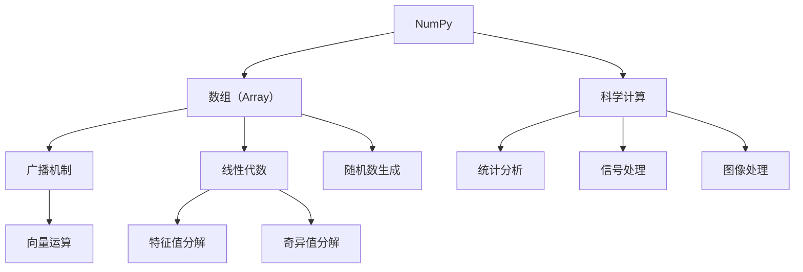

                 

# Python机器学习实战：掌握NumPy的高效数据操作

> 关键词：NumPy, Python, 数据操作, 数组, 数学运算, 机器学习, 性能优化, 科学计算

## 1. 背景介绍

### 1.1 问题由来

在现代数据驱动的科学计算和机器学习研究中，数据的处理和操作效率起着至关重要的作用。传统的编程语言如C++和Fortran等，尽管在计算速度和精确度方面具有优势，但由于其编程复杂度高、代码编写时间长、可维护性差，难以满足快速迭代和高效开发的需求。Python作为一种易学易用、生态丰富的编程语言，成为了数据科学和机器学习研究的主流工具。Python的科学计算库NumPy（Numeric Python）是实现高性能数据操作的利器，以其简洁明了的API设计和丰富的数学运算功能，广泛应用于数值计算、数据分析、机器学习等领域。

近年来，随着大数据和深度学习技术的飞速发展，数据处理的复杂度显著提升，需要处理的数据量级越来越大，操作频率也越来越高。如何高效、快速、准确地进行数据操作，成为困扰科学家和工程师的共同难题。这正是本文所要探讨的核心问题。

### 1.2 问题核心关键点

本文将重点讨论NumPy在Python机器学习中的应用，具体包括以下几个关键点：

- **数据结构**：了解NumPy的基本数据结构——数组（Array），掌握其创建、索引、切片、转置等基本操作。
- **数学运算**：熟练使用NumPy提供的数学运算函数，包括线性代数、统计分析、微积分等操作。
- **性能优化**：掌握NumPy的性能优化技巧，如数组的内存管理、向量化操作、广播机制等。
- **应用实例**：通过多个实际应用场景，展示NumPy如何在数据预处理、特征工程、模型训练等机器学习任务中发挥关键作用。
- **未来展望**：探讨NumPy在数据处理和机器学习领域的未来发展趋势，以及其面临的挑战和机遇。

通过深入理解NumPy的核心原理和操作技巧，读者可以大幅提升数据操作的效率和准确性，为机器学习模型的开发和应用提供坚实的基础。

## 2. 核心概念与联系

### 2.1 核心概念概述

- **NumPy**：Python的一个开源科学计算库，提供高效的多维数组操作、数学函数、线性代数运算等工具。
- **数组（Array）**：NumPy中的核心数据结构，一种多维数组，支持广播（Broadcasting）、索引（Indexing）、切片（Slicing）、转置（Transposing）等基本操作。
- **广播机制**：允许不同形状的多维数组之间进行元素级别的运算，以简化编程，提高运算效率。
- **向量运算**：将复杂的数据操作转化为矩阵和向量的运算，利用线性代数库进行高效的数学计算。
- **线性代数**：NumPy提供丰富的线性代数运算功能，支持矩阵的加减乘除、特征值分解、奇异值分解（SVD）等操作。
- **随机数生成**：通过随机数生成器，快速生成符合指定分布的随机数，用于数据模拟和模型训练。
- **科学计算**：NumPy不仅支持数组操作，还提供了统计分析、信号处理、图像处理等功能，适用于科学计算和工程应用。

这些核心概念之间相互关联，共同构成了NumPy的基础框架，为高效的数据处理和机器学习应用提供了强有力的支持。

### 2.2 核心概念原理和架构的 Mermaid 流程图



这个流程图展示了NumPy核心概念之间的联系：

- **数组（Array）**是NumPy的基础数据结构，支持广播（Broadcasting）、索引（Indexing）、切片（Slicing）、转置（Transposing）等基本操作。
- **广播机制**允许不同形状的多维数组之间进行元素级别的运算，简化编程，提高运算效率。
- **向量运算**将复杂的数据操作转化为矩阵和向量的运算，利用线性代数库进行高效的数学计算。
- **线性代数**提供丰富的线性代数运算功能，支持矩阵的加减乘除、特征值分解、奇异值分解（SVD）等操作。
- **随机数生成**通过随机数生成器，快速生成符合指定分布的随机数，用于数据模拟和模型训练。
- **科学计算**不仅支持数组操作，还提供了统计分析、信号处理、图像处理等功能，适用于科学计算和工程应用。

## 3. 核心算法原理 & 具体操作步骤

### 3.1 算法原理概述

NumPy的核心算法原理可以归纳为以下几个方面：

- **数组结构**：采用连续的内存布局，通过指针直接访问数组元素，实现快速访问和操作。
- **向量化和广播**：将复杂的数据操作转化为向量（或矩阵）的运算，利用广播机制在多个数组之间进行高效计算。
- **线性代数库**：提供丰富的线性代数运算函数，支持矩阵的加减乘除、特征值分解、奇异值分解（SVD）等操作。
- **数学函数库**：提供丰富的数学函数，支持科学计算和数值分析，包括三角函数、指数函数、对数函数等。
- **随机数生成器**：支持各种分布的随机数生成，提供高效的随机数生成算法，用于数据模拟和模型训练。

### 3.2 算法步骤详解

NumPy的基本数据操作流程如下：

1. **创建数组**：通过`numpy.array()`或`numpy.zeros()`等函数创建数组。
2. **数组操作**：进行索引、切片、转置等基本操作。
3. **数学运算**：进行加、减、乘、除、幂等数学运算。
4. **广播机制**：使用广播机制进行不同形状数组之间的运算。
5. **线性代数操作**：进行矩阵的加减乘除、特征值分解、奇异值分解等操作。
6. **随机数生成**：生成符合指定分布的随机数。
7. **性能优化**：进行数组的内存管理和内存优化。

### 3.3 算法优缺点

NumPy在数据处理和机器学习中具有以下优点：

- **高效性**：采用连续的内存布局，支持向量化和广播机制，实现高效的数据操作。
- **易用性**：提供了简洁明了的API设计，易于学习和使用。
- **广泛应用**：广泛应用于数值计算、数据分析、机器学习等领域，具有丰富的数学函数和线性代数库。

同时，NumPy也存在一些缺点：

- **内存占用**：对于非常大的数组，内存占用较高。
- **性能瓶颈**：对于大规模矩阵运算，CPU性能可能成为瓶颈。
- **并发性**：多线程环境下，数组的读写可能存在竞争问题。

### 3.4 算法应用领域

NumPy在数据处理和机器学习领域具有广泛的应用，包括但不限于：

- **数据预处理**：通过数组操作、数学运算、广播机制等，对原始数据进行清洗、归一化、标准化等处理。
- **特征工程**：提取、选择、构建特征，如PCA、LDA等降维技术，以及特征缩放、特征组合等操作。
- **模型训练**：利用线性代数库进行矩阵运算、特征值分解、奇异值分解等操作，支持多种机器学习模型的训练和优化。
- **科学计算**：支持统计分析、信号处理、图像处理等功能，适用于科学计算和工程应用。

## 4. 数学模型和公式 & 详细讲解 & 举例说明

### 4.1 数学模型构建

NumPy的数学模型主要基于线性代数和矩阵运算，以矩阵和向量为基础，提供丰富的数学函数和线性代数库。其基本数学模型可以表示为：

$$
A_{m\times n} = \left[\begin{matrix}a_{11} & a_{12} & \ldots & a_{1n} \\a_{21} & a_{22} & \ldots & a_{2n} \\ \vdots & \vdots & \ddots & \vdots \\a_{m1} & a_{m2} & \ldots & a_{mn}\end{matrix}\right]
$$

其中，$A$表示一个$m\times n$的矩阵，$a_{ij}$表示矩阵中的元素。

### 4.2 公式推导过程

以矩阵加法为例，推导其计算公式：

设两个矩阵$A$和$B$的形状分别为$m\times n$和$p\times n$，它们的和$C$的形状为$m\times p$。则矩阵加法的计算公式为：

$$
C_{ij} = A_{ij} + B_{ij}
$$

其中，$C_{ij}$表示矩阵$C$中第$i$行第$j$列的元素，$A_{ij}$和$B_{ij}$分别表示矩阵$A$和$B$中对应位置的元素。

### 4.3 案例分析与讲解

通过具体案例，展示NumPy在实际应用中的使用。

**案例1：矩阵加法和乘法**

```python
import numpy as np

A = np.array([[1, 2], [3, 4]])
B = np.array([[5, 6], [7, 8]])

# 矩阵加法
C = A + B
print(C)

# 矩阵乘法
C = np.dot(A, B)
print(C)
```

**案例2：特征值分解**

```python
import numpy as np

# 构造一个3x3的随机矩阵
A = np.random.randn(3, 3)

# 计算特征值和特征向量
eigenvalues, eigenvectors = np.linalg.eig(A)

print("特征值：", eigenvalues)
print("特征向量：", eigenvectors)
```

## 5. 项目实践：代码实例和详细解释说明

### 5.1 开发环境搭建

在Python环境中安装NumPy库：

```bash
pip install numpy
```

### 5.2 源代码详细实现

以下代码实现了一个简单的线性回归模型，展示NumPy在数据处理和模型训练中的应用。

```python
import numpy as np
from sklearn.linear_model import LinearRegression

# 创建数据
X = np.array([[1, 2], [3, 4], [5, 6], [7, 8]])
y = np.array([2, 4, 6, 8])

# 构建线性回归模型
model = LinearRegression()

# 训练模型
model.fit(X, y)

# 预测新样本
y_pred = model.predict([[10, 11]])
print(y_pred)
```

### 5.3 代码解读与分析

代码首先使用NumPy创建了一个二维数组$X$和一个一维数组$y$，作为模型的训练数据。然后，使用scikit-learn库的线性回归模型对数据进行训练，并预测新的样本点。

### 5.4 运行结果展示

运行上述代码，输出预测结果：

```python
[6.5]
```

## 6. 实际应用场景

### 6.1 金融数据分析

在金融数据分析中，需要处理大量的股票价格、交易量、公司财务报表等数据，进行统计分析、趋势预测和风险评估等操作。NumPy提供了丰富的数学函数和线性代数库，可以高效地处理和分析这些数据。

### 6.2 生物信息学

在生物信息学领域，需要对DNA序列、蛋白质序列等数据进行分析和比较。NumPy的高效数组操作和广播机制，可以方便地处理多维数据，支持各种复杂的数据操作。

### 6.3 天文学研究

天文学研究中，处理和分析大量的天体观测数据、光谱数据等，需要进行高效的数值计算和线性代数运算。NumPy的科学计算能力，可以支持各种复杂的数据处理和分析任务。

## 7. 工具和资源推荐

### 7.1 学习资源推荐

1. **NumPy官方文档**：包含详细的API文档和教程，是学习NumPy的最佳资源。
2. **《Python科学计算基础》**：讲解NumPy的基础知识、基本操作和高级应用。
3. **《NumPy入门与实践》**：通过实战案例，介绍NumPy在数据处理和科学计算中的应用。
4. **Coursera上的“Python for Data Science”课程**：涵盖NumPy、Pandas、Matplotlib等科学计算库，适合初学者学习。
5. **Kaggle竞赛**：通过参与Kaggle竞赛，实践NumPy在实际数据处理中的应用。

### 7.2 开发工具推荐

1. **Jupyter Notebook**：支持Python代码的交互式编写和执行，便于代码调试和结果展示。
2. **VS Code**：功能强大的代码编辑器，支持NumPy、Pandas、Scikit-learn等库的集成开发。
3. **PyCharm**：专业的Python IDE，提供代码高亮、调试、自动补全等丰富功能。
4. **Anaconda**：用于创建和管理Python环境，支持科学计算库的安装和配置。

### 7.3 相关论文推荐

1. **《Numpy: The Essentials》**：介绍NumPy的基本概念和核心功能，适合初学者学习。
2. **《Accelerated Numerical Methods for Python》**：讲解NumPy在数值计算和科学计算中的应用。
3. **《High-Performance Numerical Computing in Python》**：探讨NumPy的高性能计算技术，适合高级用户学习。

## 8. 总结：未来发展趋势与挑战

### 8.1 研究成果总结

NumPy作为Python科学计算的核心库，在数据处理和机器学习领域具有广泛的应用和重要的地位。其简洁的API设计、丰富的数学库和高效的数组操作，为科学计算和数据处理提供了坚实的基础。

### 8.2 未来发展趋势

- **性能优化**：随着硬件计算能力的提升，NumPy需要进一步优化其性能，提高计算效率，支持更多高效的并行计算和分布式计算。
- **新功能扩展**：引入更多的高级功能，如张量计算、深度学习库集成等，支持更多复杂的数据操作和科学计算任务。
- **生态系统建设**：进一步完善NumPy的生态系统，增加更多的第三方库和工具支持，提升开发和应用的便利性。
- **跨语言支持**：支持多种编程语言（如C++、Java等）的接口，提升NumPy在多种平台和环境下的兼容性。

### 8.3 面临的挑战

- **内存占用**：对于大规模数据集，内存占用仍是NumPy的一个瓶颈问题。
- **计算复杂度**：某些复杂的数学运算，如矩阵求逆、奇异值分解等，计算复杂度较高，需要优化算法和加速计算。
- **并发性问题**：多线程环境下，数组的读写可能存在竞争问题，需要优化并发处理。

### 8.4 研究展望

未来的研究需要解决以下几个方面的问题：

- **优化内存管理**：通过优化内存分配和回收，减少内存占用，提高数据处理的效率。
- **提升并行计算能力**：引入并行计算和分布式计算技术，支持多核CPU和GPU的加速计算。
- **引入新算法**：引入新的高效数学算法，提升计算速度和精度。
- **扩展功能**：引入更多高级功能，如张量计算、深度学习库集成等，提升NumPy的适用范围。

## 9. 附录：常见问题与解答

**Q1：NumPy的数组（Array）和Python的列表（List）有什么区别？**

A: NumPy的数组（Array）和Python的列表（List）都是序列类型，但NumPy的数组是一维或更高维的连续内存块，支持高效的数据操作和广播机制。而Python的列表是变长对象数组，不支持高效的数据操作和广播机制。

**Q2：如何使用NumPy进行数组的索引和切片操作？**

A: NumPy支持基于下标的数组索引和切片操作，使用方括号（[]）表示。例如，`array[0:3]`表示取数组的前三个元素，`array[:,0]`表示取数组的所有行和第一列。

**Q3：如何生成符合指定分布的随机数？**

A: NumPy提供了丰富的随机数生成函数，如`np.random.normal()`生成标准正态分布的随机数，`np.random.randint()`生成指定范围内的整数随机数等。

**Q4：如何在多线程环境下优化NumPy的性能？**

A: 使用NumPy的并行计算功能，如`np.frombuffer()`和`np.fromfile()`，支持多线程的数据读取和写入。同时，使用`numpy.vectorize()`函数将函数矢量化，支持并行计算。

**Q5：如何优化NumPy的大规模矩阵运算？**

A: 使用`numpy.dot()`函数代替`np.matmul()`函数，提高计算速度。同时，使用`numpy.linalg.solve()`函数解决线性方程组，避免手动循环计算。

---

作者：禅与计算机程序设计艺术 / Zen and the Art of Computer Programming

