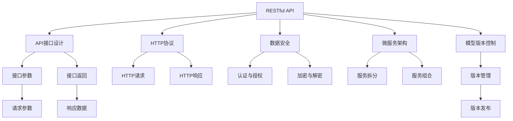

                 

# RESTful API设计：AI模型服务化的最佳实践

> 关键词：RESTful API, AI模型服务化, 数据安全, 微服务架构, HTTP协议, 模型版本控制

## 1. 背景介绍

在人工智能（AI）和机器学习（ML）模型在企业中的应用逐渐普及，模型的开发和部署成为主要挑战。传统的机器学习开发流程涉及大量的计算资源和算法调优，需要企业投入大量的时间和金钱。同时，在部署模型时，需要考虑模型的性能、可扩展性、可维护性和安全性等方面，这给模型的部署带来了额外的复杂性。

为了解决这些问题，API设计已经成为AI模型服务化的重要组成部分。RESTful API设计能够提供一种灵活、可扩展和易于维护的方式，使AI模型能够在不同的环境下被调用和使用。本文将详细介绍RESTful API设计的最佳实践，以确保AI模型服务化的高效和可靠。

## 2. 核心概念与联系

### 2.1 核心概念概述

要理解RESTful API设计的最佳实践，需要首先了解一些核心概念：

- **RESTful API**：基于REST（Representational State Transfer）架构风格的API，它通过HTTP协议进行数据传输和交互，遵循无状态、可缓存、可扩展等原则。
- **AI模型服务化**：将AI模型作为服务进行封装和部署，提供模型预测接口，使得模型可以方便地在不同系统中使用。
- **数据安全**：保护API接口和数据传输的安全性，防止未授权访问和数据泄露。
- **微服务架构**：将系统拆分为多个小服务，每个服务负责不同的功能模块，提高系统的可扩展性和可维护性。
- **HTTP协议**：RESTful API设计的基石，基于HTTP协议实现数据的请求和响应。
- **模型版本控制**：管理不同版本的AI模型，方便更新和维护。

这些概念相互关联，共同构成了RESTful API设计的基础。

### 2.2 核心概念原理和架构的 Mermaid 流程图



上述流程图中，各概念之间的联系如下：

- API接口设计（B）是RESTful API设计的核心，包括接口参数（G）和接口返回（H）。
- HTTP协议（C）是API接口实现的基础，包括HTTP请求（I）和HTTP响应（J）。
- 数据安全（D）确保API接口和数据传输的安全性，包括认证与授权（K）和加密与解密（L）。
- 微服务架构（E）将系统拆分为多个小服务，包括服务拆分（M）和服务组合（N）。
- 模型版本控制（F）管理不同版本的AI模型，包括版本管理（O）和版本发布（P）。

## 3. 核心算法原理 & 具体操作步骤

### 3.1 算法原理概述

RESTful API设计的核心算法原理基于REST架构风格，包括以下几个方面：

- **无状态**：每个请求都是独立的，不依赖于之前的请求。
- **可缓存**：响应可以被缓存，减少重复请求的负担。
- **客户端-服务器结构**：客户端和服务器明确区分，使得系统更加灵活和易于维护。
- **统一接口**：使用统一的接口风格和语义，方便开发和调用。

这些原则使得RESTful API设计能够提供高效、可扩展和易于维护的API接口。

### 3.2 算法步骤详解

RESTful API设计的具体操作步骤如下：

**Step 1: 定义API接口**

1. **接口目标**：明确API接口的目标和功能，包括数据输入输出格式、请求参数和响应数据等。
2. **接口路径**：根据业务需求，设计API接口的路径，通常使用名词作为路径。
3. **HTTP方法**：确定API接口使用的HTTP方法，包括GET、POST、PUT、DELETE等。

**Step 2: 实现API接口**

1. **接口实现**：根据API接口设计，使用编程语言和框架实现API接口的逻辑。
2. **数据处理**：处理API接口的数据输入输出，包括数据校验、转换和处理等。
3. **业务逻辑**：实现API接口的业务逻辑，包括数据查询、处理和返回等。

**Step 3: 测试API接口**

1. **单元测试**：对API接口的各个组件进行单元测试，确保每个组件的功能正确。
2. **集成测试**：对API接口的整体流程进行集成测试，确保各个组件之间的协作正常。
3. **负载测试**：对API接口进行负载测试，确保系统在高并发环境下的稳定性。

**Step 4: 部署API接口**

1. **环境配置**：在生产环境中配置API接口所需的环境变量和配置文件。
2. **容器化**：使用Docker等容器技术，将API接口打包为可移植的容器镜像。
3. **部署和监控**：将API接口部署到服务器上，并使用监控工具实时监控API接口的运行状态。

**Step 5: 版本控制**

1. **版本管理**：使用版本控制系统（如Git）管理不同版本的AI模型和API接口。
2. **版本发布**：根据业务需求，发布不同版本的API接口，确保每个版本的功能独立。
3. **版本回滚**：在必要时，回滚到之前的版本，避免影响现有系统的稳定运行。

### 3.3 算法优缺点

RESTful API设计的优点包括：

- **灵活性高**：可以通过API接口实现不同业务功能，灵活性高。
- **易于维护**：每个API接口相对独立，便于维护和更新。
- **可扩展性强**：支持API接口的横向扩展，可以处理更多的请求。

RESTful API设计的主要缺点包括：

- **性能问题**：在大数据量和高并发环境下，性能可能成为瓶颈。
- **安全性问题**：API接口和数据传输的安全性需要额外设计和维护。
- **版本控制复杂**：不同版本的API接口和模型版本控制需要仔细设计和维护。

### 3.4 算法应用领域

RESTful API设计在AI模型服务化中得到广泛应用，以下是几个典型应用场景：

1. **机器学习模型服务**：将机器学习模型封装为API接口，方便不同系统调用和使用。
2. **自然语言处理服务**：将自然语言处理模型封装为API接口，实现文本分析、情感分析等任务。
3. **计算机视觉服务**：将计算机视觉模型封装为API接口，实现图像识别、人脸识别等任务。
4. **推荐系统服务**：将推荐系统模型封装为API接口，实现个性化推荐等任务。

## 4. 数学模型和公式 & 详细讲解 & 举例说明

### 4.1 数学模型构建

RESTful API设计的数学模型构建主要涉及API接口的设计和数据传输的格式。常用的数据格式包括JSON、XML等，以下是JSON格式的示例：

```json
{
  "id": 1,
  "name": "RESTful API",
  "version": "1.0",
  "paths": [
    {
      "name": "/model/predict",
      "methods": ["POST"],
      "summary": "预测API接口",
      "description": "使用模型进行预测",
      "parameters": [
        {
          "name": "input_data",
          "in": "body",
          "required": true,
          "schema": {
            "type": "string",
            "format": "json"
          }
        }
      ],
      "responses": {
        "200": {
          "description": "预测结果"
        }
      }
    }
  ]
}
```

### 4.2 公式推导过程

RESTful API设计的核心公式推导涉及HTTP请求和响应的数据传输格式。以下是JSON格式的请求和响应示例：

```json
# 请求
{
  "input_data": "example_data"
}

# 响应
{
  "result": "example_result"
}
```

### 4.3 案例分析与讲解

以下是一个简单的案例，展示如何设计和使用RESTful API接口：

**案例1: 预测API接口**

1. **API接口定义**：
   - 路径：/predict
   - HTTP方法：POST
   - 参数：input_data
   - 响应：result

2. **API接口实现**：
   - 使用Python Flask框架实现API接口逻辑。
   - 数据处理：将input_data进行解析和处理。
   - 业务逻辑：使用机器学习模型进行预测，返回result。

3. **API接口测试**：
   - 编写单元测试和集成测试用例，确保API接口的正确性。
   - 进行负载测试，确保API接口在高并发环境下的稳定性。

4. **API接口部署**：
   - 配置环境变量和配置文件，确保API接口在生产环境中的正常运行。
   - 使用Docker容器技术，将API接口打包为可移植的容器镜像。
   - 部署API接口到服务器上，并使用监控工具实时监控API接口的运行状态。

## 5. 项目实践：代码实例和详细解释说明

### 5.1 开发环境搭建

在进行RESTful API设计时，需要搭建相应的开发环境。以下是使用Python Flask进行RESTful API开发的流程：

1. **安装Python**：下载并安装Python 3.x版本。
2. **安装Flask**：使用pip命令安装Flask框架。
3. **创建项目目录**：创建一个新的项目目录，并初始化项目。
4. **编写代码**：在项目目录下编写Python代码，实现API接口的逻辑。
5. **运行代码**：使用Flask命令启动API接口的服务器。

### 5.2 源代码详细实现

以下是一个简单的Python Flask代码实现，展示如何定义和使用RESTful API接口：

```python
from flask import Flask, request, jsonify

app = Flask(__name__)

@app.route('/predict', methods=['POST'])
def predict():
    data = request.json['input_data']
    result = model.predict(data)
    return jsonify({'result': result})

if __name__ == '__main__':
    app.run()
```

### 5.3 代码解读与分析

以上代码实现了一个简单的预测API接口，主要步骤如下：

1. **导入Flask**：导入Flask框架，用于实现API接口。
2. **创建应用实例**：创建一个Flask应用实例，并指定API接口的路径和HTTP方法。
3. **定义API接口**：定义API接口的逻辑，包括数据处理和业务逻辑。
4. **处理请求**：处理API接口的请求，解析输入数据并返回结果。
5. **运行API接口**：启动API接口的服务器，监听指定端口。

## 6. 实际应用场景

### 6.1 金融风险管理

在金融领域，使用RESTful API设计的AI模型可以实时监控和预测金融市场风险。具体而言，可以设计一个预测API接口，使用机器学习模型对市场数据进行预测和分析，及时发现异常情况，并进行风险预警。

### 6.2 智能客服系统

在智能客服系统中，使用RESTful API设计的AI模型可以实现自动问答和对话功能。具体而言，可以设计一个问答API接口，使用自然语言处理模型对用户提问进行处理和回答，提高客服效率和用户体验。

### 6.3 智能推荐系统

在智能推荐系统中，使用RESTful API设计的AI模型可以实现个性化推荐功能。具体而言，可以设计一个推荐API接口，使用推荐算法对用户行为数据进行分析和推荐，提高推荐效果和用户满意度。

### 6.4 未来应用展望

随着RESTful API设计的不断成熟，AI模型服务化将得到更广泛的应用。未来，AI模型将更加灵活、可扩展和易于维护，使得各行各业可以更加高效地利用AI技术。

## 7. 工具和资源推荐

### 7.1 学习资源推荐

要深入学习RESTful API设计，可以参考以下资源：

1. **RESTful API设计指南**：这是一本介绍RESTful API设计的经典书籍，涵盖了REST架构风格的各个方面。
2. **RESTful Web Services**：这是一门介绍RESTful API设计的在线课程，涵盖REST架构风格的各个方面。
3. **Flask官方文档**：Flask框架的官方文档，提供了详细的API接口设计和实现指南。
4. **Postman API测试工具**：用于测试API接口的工具，支持各种HTTP请求和响应格式。

### 7.2 开发工具推荐

要高效开发RESTful API接口，可以使用以下工具：

1. **Python Flask框架**：一个轻量级的Web框架，适合实现API接口的逻辑。
2. **Docker容器技术**：用于将API接口打包为可移植的容器镜像，方便部署和管理。
3. **Postman API测试工具**：用于测试API接口的请求和响应，确保API接口的正确性。

### 7.3 相关论文推荐

以下是几篇介绍RESTful API设计的经典论文，供参考：

1. **Representational State Transfer (REST)**：这是一篇介绍REST架构风格的经典论文，阐述了REST架构风格的基本原则和应用场景。
2. **RESTful Web Services**：这是一篇介绍RESTful API设计的经典论文，涵盖了REST架构风格的各个方面。
3. **RESTful API Design**：这是一篇介绍RESTful API设计的经典论文，详细介绍了RESTful API设计的最佳实践。

## 8. 总结：未来发展趋势与挑战

### 8.1 研究成果总结

本文详细介绍了RESTful API设计的最佳实践，涵盖API接口设计、API接口实现、API接口测试、API接口部署、版本控制等多个方面。RESTful API设计通过无状态、可缓存、客户端-服务器结构等原则，提供了高效、可扩展和易于维护的API接口。

### 8.2 未来发展趋势

RESTful API设计的未来发展趋势包括：

1. **微服务架构**：微服务架构将进一步普及，使得RESTful API设计更加灵活和可扩展。
2. **容器化技术**：容器化技术将进一步普及，使得RESTful API接口的部署和管理更加便捷。
3. **自动化测试**：自动化测试将进一步普及，使得RESTful API接口的测试更加高效和可靠。
4. **安全性增强**：安全性将进一步增强，使得RESTful API接口更加安全可靠。
5. **版本控制优化**：版本控制将进一步优化，使得RESTful API接口的版本管理更加高效和可靠。

### 8.3 面临的挑战

RESTful API设计虽然已经得到广泛应用，但仍面临一些挑战：

1. **性能问题**：在大数据量和高并发环境下，性能可能成为瓶颈。
2. **安全性问题**：API接口和数据传输的安全性需要额外设计和维护。
3. **版本控制复杂**：不同版本的API接口和模型版本控制需要仔细设计和维护。
4. **跨平台问题**：不同平台之间的兼容性问题需要额外设计和维护。

### 8.4 研究展望

未来，RESTful API设计的研究方向包括：

1. **微服务架构优化**：进一步优化微服务架构，提高系统的可扩展性和可维护性。
2. **容器化技术优化**：进一步优化容器化技术，提高API接口的部署和管理效率。
3. **自动化测试优化**：进一步优化自动化测试，提高API接口的测试效率和可靠性。
4. **安全性增强**：进一步增强API接口的安全性，确保数据传输和访问的安全性。
5. **版本控制优化**：进一步优化版本控制，提高API接口的版本管理效率和可靠性。

## 9. 附录：常见问题与解答

**Q1: RESTful API接口设计有哪些最佳实践？**

A: RESTful API接口设计应遵循无状态、可缓存、客户端-服务器结构等原则。具体的最佳实践包括：
- **命名规范**：使用名词作为API接口的路径，使用动词作为HTTP方法。
- **参数规范**：使用JSON、XML等格式，明确请求和响应的参数和返回值。
- **错误处理**：使用HTTP状态码和错误码，清晰地处理错误和异常情况。
- **文档规范**：使用Swagger等工具，编写API接口的文档，方便开发者和用户使用。

**Q2: 如何使用Docker容器技术部署RESTful API接口？**

A: 使用Docker容器技术部署RESTful API接口的流程如下：
1. **创建Docker镜像**：编写Dockerfile，定义API接口的配置和依赖。
2. **构建Docker镜像**：使用Docker命令构建Docker镜像。
3. **部署Docker镜像**：将Docker镜像部署到服务器上，启动API接口的容器实例。

**Q3: RESTful API接口安全性如何保证？**

A: RESTful API接口安全性可以通过以下措施保障：
- **认证与授权**：使用OAuth等认证和授权机制，确保API接口的访问权限。
- **加密与解密**：使用HTTPS协议，确保数据传输的安全性。
- **访问控制**：使用IP白名单、黑名单等措施，限制API接口的访问。

**Q4: 如何管理RESTful API接口的版本？**

A: RESTful API接口的版本管理可以通过以下措施保障：
- **版本编号**：使用版本号管理API接口的版本，确保不同版本的API接口独立。
- **版本发布**：使用Git等版本控制系统，管理API接口的版本发布和回滚。
- **版本控制**：使用RESTful API接口的版本控制工具，方便API接口的更新和维护。

---

作者：禅与计算机程序设计艺术 / Zen and the Art of Computer Programming

