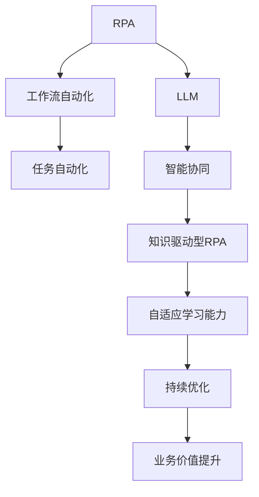

                 

# RPA软件引入LLM的新趋势

> 关键词：RPA, 大语言模型(LLM), 工作流自动化, 任务自动化, 智能协同, 知识驱动型RPA

## 1. 背景介绍

### 1.1 问题由来
随着企业数字化转型的加速推进，流程自动化(Process Automation, RPA)正成为提升工作效率、降低人力成本的重要手段。传统RPA通常依赖预设规则和脚本，对复杂多变的业务场景适应性不足。如何提升RPA系统的智能化水平，使系统能够理解、学习和适应用户的动态需求，成为当前RPA技术发展的新方向。

### 1.2 问题核心关键点
RPA引入大语言模型(LLM)，实质上是通过引入先进的语言理解和生成技术，提升系统的智能化水平。大语言模型能够理解自然语言指令，执行复杂任务，辅助RPA系统实现自动化的持续改进。这种新趋势带来的优势在于：
- 系统可理解自然语言输入，适应复杂多变的需求。
- 系统具备知识学习与推理能力，能够不断自我优化。
- 系统可处理非结构化数据，拓展应用场景。
- 系统更高效、灵活，提升自动化水平。

### 1.3 问题研究意义
RPA引入LLM的新趋势，对于拓展RPA系统的智能化边界，提升系统对多变业务的适应能力，具有重要意义：

1. 提升RPA系统自动化水平。LLM增强了RPA系统的智能化决策能力，使其能快速适应新任务，处理复杂数据，实现更高级别的自动化。
2. 降低RPA系统维护成本。系统可通过持续学习，自我调整与优化，减少人工干预和维护，提升系统的长期稳定性和可用性。
3. 增强RPA系统的灵活性和可扩展性。LLM带来了强大的自然语言处理能力，使系统能应对更多样化的业务场景。
4. 推动RPA技术与各行业深度融合。LLM将带来更广泛的应用场景，促进RPA技术在更多垂直领域的落地应用。
5. 提升RPA系统的业务价值。通过知识驱动型RPA，系统能够理解并执行更多高级别、高价值的业务任务，带来更大的业务效益。

## 2. 核心概念与联系

### 2.1 核心概念概述

为更好地理解RPA系统引入LLM的新趋势，本节将介绍几个密切相关的核心概念：

- **RPA（Robotic Process Automation）**：流程自动化技术，利用软件机器人自动执行规则化、重复性的业务任务。RPA系统通常包含任务定义、任务执行、任务监控等模块。

- **LLM（Large Language Model）**：大语言模型，如GPT、BERT等，是一种能够理解和生成自然语言文本的深度学习模型，具备强大的语言处理能力。

- **工作流自动化**：通过自动化技术，将业务流程中的重复性、规则性任务自动化，提升效率和准确性。

- **任务自动化**：利用自动化技术，对特定任务进行流程化、标准化的处理，实现高效率、高精度的执行。

- **智能协同**：通过引入人工智能技术，如大语言模型，使系统具备学习、理解和适应用户需求的能力，实现更高效、更智能的协同工作。

- **知识驱动型RPA**：结合大语言模型等知识库，使RPA系统具备更强的逻辑推理、知识整合和任务适应能力。

这些核心概念之间的逻辑关系可以通过以下Mermaid流程图来展示：



这个流程图展示了大语言模型在RPA系统中的应用路径：

1. RPA系统通过引入大语言模型，提升了系统的智能化水平。
2. 通过自动化工作流，系统实现了任务的标准化和执行的自动化。
3. 知识驱动型RPA通过引入大语言模型，提升了系统的逻辑推理和知识整合能力。
4. 智能协同使系统具备自适应学习能力和持续优化能力，提升系统的灵活性和应用场景。
5. 最终，系统实现业务价值的提升，助力企业数字化转型。

## 3. 核心算法原理 & 具体操作步骤
### 3.1 算法原理概述

RPA系统引入LLM的新趋势，本质上是一种融合自然语言处理和流程自动化的混合智能应用。其核心思想是：利用大语言模型处理自然语言输入，提取任务逻辑，并将其转化为可执行的操作指令，驱动RPA系统完成任务自动化。

形式化地，假设RPA系统接收到用户输入的自然语言指令 $N$，大语言模型可以将其转化为内部表示 $Z$，通过执行 $Z$ 实现任务 $T$。微调后的LLM能够理解指令 $N$ 的含义，并根据预定义的规则库和知识库，生成任务 $T$ 所需的指令序列。

具体流程如下：
1. **自然语言理解**：大语言模型将自然语言输入转换为机器可读的向量表示。
2. **任务规划**：根据向量表示，模型生成具体的任务执行流程，规划任务步骤。
3. **执行指令**：将任务步骤转换为RPA系统可执行的操作指令，驱动系统执行。
4. **反馈学习**：系统根据执行结果和反馈信息，调整模型的任务规划和执行策略，实现持续优化。

### 3.2 算法步骤详解

RPA系统引入LLM的详细操作步骤如下：

**Step 1: 构建自然语言理解模块**
- 选择一个预训练大语言模型，如BERT、GPT-3等，作为自然语言理解的基础。
- 准备自然语言指令数据集 $D_{NL}$，用于训练模型。
- 定义损失函数 $\mathcal{L}_{NL}$，用于衡量模型生成的向量表示与真实指令表示的差异。
- 在标注数据集上对模型进行微调，优化其向量生成能力。

**Step 2: 任务规划与执行**
- 根据自然语言理解模块生成的向量表示 $Z$，设计任务规划算法，将 $Z$ 转换为具体的任务执行步骤。
- 使用任务规划模块生成操作指令序列。
- 将操作指令序列转换为RPA系统的执行脚本。
- 在执行过程中，实时收集反馈信息，对任务规划进行优化调整。

**Step 3: 系统集成与部署**
- 将RPA系统与LLM模块进行集成，使系统能够理解并执行自然语言指令。
- 对系统进行单元测试和性能测试，确保系统的正确性和稳定性。
- 将系统部署到实际生产环境中，进行业务验证和用户反馈收集。

**Step 4: 持续优化**
- 通过不断积累用户反馈和任务执行结果，对模型进行持续微调，提升系统适应性和任务执行能力。
- 利用知识库和规则库，对任务规划算法进行优化，提升系统执行效率和准确性。

### 3.3 算法优缺点

RPA引入LLM的新趋势，带来了以下优点：
1. **提升任务执行能力**：LLM增强了RPA系统的智能化决策能力，使其能快速适应新任务，处理复杂数据。
2. **降低维护成本**：系统通过持续学习，自我调整与优化，减少人工干预和维护，提升系统的长期稳定性和可用性。
3. **增强系统灵活性**：LLM带来了强大的自然语言处理能力，使系统能应对更多样化的业务场景。
4. **提高业务价值**：通过知识驱动型RPA，系统能够理解并执行更多高级别、高价值的业务任务，带来更大的业务效益。

同时，该方法也存在一定的局限性：
1. **数据依赖性高**：RPA系统引入LLM需要大量的自然语言指令数据，标注成本较高。
2. **系统复杂度高**：需要构建自然语言理解、任务规划、执行反馈等多个模块，系统集成难度大。
3. **模型泛化能力**：模型对特定任务的理解和执行能力较强，但对任务多样性和复杂性的适应性需要进一步提升。
4. **安全性和可靠性**：系统对输入的自然语言指令有依赖，错误或不规范的输入可能导致系统执行错误。
5. **性能开销大**：大语言模型的计算开销较大，系统需要考虑性能优化问题。

尽管存在这些局限性，但就目前而言，RPA引入LLM的新趋势仍是大数据、人工智能与流程自动化深度融合的重要方向。未来相关研究的重点在于如何进一步降低数据依赖，提高模型的泛化能力和安全性，优化系统性能，并在更多的业务场景中推广应用。

### 3.4 算法应用领域

RPA引入LLM的新趋势已经在多个领域得到了初步应用，包括但不限于：

- **金融服务**：自动进行账户管理、报表生成、贷款审批等。
- **医疗健康**：自动生成病历、诊断报告，辅助医生决策。
- **人力资源管理**：自动化简历筛选、员工绩效评估。
- **供应链管理**：自动化订单处理、库存管理。
- **客户服务**：自动化客户服务咨询、投诉处理。

这些领域的应用展示了RPA引入LLM在提升业务效率、降低运营成本方面的潜力。随着技术的不断成熟和推广，LLM将进一步拓展RPA系统的应用范围，带来更广泛的影响力。

## 4. 数学模型和公式 & 详细讲解  
### 4.1 数学模型构建

RPA引入LLM的数学模型主要涉及自然语言处理、任务规划和任务执行等几个部分。以下是具体的数学模型构建：

**自然语言理解模块**
- 将自然语言指令 $N$ 转换为向量表示 $Z$。假设模型为 $f_{NL}$，则向量表示 $Z = f_{NL}(N)$。

**任务规划与执行**
- 假设任务规划算法为 $f_{TP}$，将向量表示 $Z$ 转换为任务执行步骤 $T$。则 $T = f_{TP}(Z)$。
- 将任务执行步骤 $T$ 转换为操作指令序列 $I$。操作指令序列 $I$ 可以表示为 $I = g_{TP}(T)$。

**任务执行反馈**
- 假设任务执行反馈为 $F$，根据执行结果 $R$ 和操作指令 $I$，调整任务规划算法 $f_{TP}$。则 $f_{TP} = h_{TP}(F, I, R)$。

**系统集成与部署**
- 将RPA系统与LLM模块集成，实现自然语言理解、任务规划和执行。
- 系统部署后，根据业务验证和用户反馈，持续优化模型和任务规划算法。

### 4.2 公式推导过程

以下以金融服务领域的应用为例，推导RPA引入LLM的数学模型：

假设RPA系统用于自动化生成财务报表，自然语言指令为 $N = "根据以下数据生成上月财务报表" \text{, } 数据集为 $D_{data} = \{(a_1, b_1), (a_2, b_2), ..., (a_n, b_n)\}$。
1. **自然语言理解模块**
   - 模型 $f_{NL}$ 将指令 $N$ 转换为向量表示 $Z = f_{NL}(N)$。
   - 假设 $f_{NL}$ 为BERT模型，其输出表示为 $Z \in \mathbb{R}^d$。
2. **任务规划与执行**
   - 任务规划算法 $f_{TP}$ 将向量表示 $Z$ 转换为任务执行步骤 $T = f_{TP}(Z)$。
   - 假设 $f_{TP}$ 为线性回归模型，其输出为 $T \in \mathbb{R}^m$，其中 $m$ 为任务步骤数。
   - 将任务执行步骤 $T$ 转换为操作指令序列 $I = g_{TP}(T)$。
3. **任务执行反馈**
   - 任务执行结果 $R$ 为财务报表 $R = (r_1, r_2, ..., r_m)$。
   - 假设 $F$ 为执行反馈，包括报表生成的时间、准确性等指标。
   - 任务规划算法 $f_{TP}$ 根据反馈 $F$ 和操作指令 $I$ 进行优化，得到 $f_{TP} = h_{TP}(F, I, R)$。

### 4.3 案例分析与讲解

**案例：智能招聘系统**
- 假设自然语言指令为 $N = "请根据以下简历筛选候选人，优先选择经验丰富的求职者" \text{, } 数据集为 $D_{data} = \{(r_1, c_1), (r_2, c_2), ..., (r_n, c_n)\}$。
- 自然语言理解模块 $f_{NL}$ 将指令 $N$ 转换为向量表示 $Z = f_{NL}(N)$。
- 任务规划算法 $f_{TP}$ 将向量表示 $Z$ 转换为任务执行步骤 $T = f_{TP}(Z)$。
- 根据执行步骤 $T$，操作指令序列 $I = g_{TP}(T)$ 转换为RPA系统可执行的招聘任务。
- 任务执行结果 $R$ 为筛选出的候选人列表。
- 根据反馈 $F$ 和执行结果 $R$，任务规划算法 $f_{TP}$ 进行优化，得到 $f_{TP} = h_{TP}(F, I, R)$。

通过以上分析，可以看出RPA引入LLM的过程涉及自然语言处理、任务规划和任务执行等多个环节，需要通过精确的数学模型和算法设计来实现。

## 5. 项目实践：代码实例和详细解释说明
### 5.1 开发环境搭建

在进行RPA引入LLM的实践前，我们需要准备好开发环境。以下是使用Python进行PyTorch和RPA软件开发的常见环境配置流程：

1. 安装Anaconda：从官网下载并安装Anaconda，用于创建独立的Python环境。

2. 创建并激活虚拟环境：
```bash
conda create -n pytorch-env python=3.8 
conda activate pytorch-env
```

3. 安装PyTorch和RPA软件：
```bash
conda install pytorch torchvision torchaudio cudatoolkit=11.1 -c pytorch -c conda-forge
pip install pyro-pdf
```

4. 安装自然语言处理库：
```bash
pip install spacy textblob nltk
```

5. 安装RPA软件框架：
```bash
pip install UiPath-Activiti-BPM
```

完成上述步骤后，即可在`pytorch-env`环境中开始开发实践。

### 5.2 源代码详细实现

下面以智能招聘系统的开发为例，给出RPA引入LLM的PyTorch代码实现。

**自然语言理解模块**
- 使用BERT模型，对自然语言指令进行编码。

```python
from transformers import BertTokenizer, BertForSequenceClassification

tokenizer = BertTokenizer.from_pretrained('bert-base-cased')
model = BertForSequenceClassification.from_pretrained('bert-base-cased', num_labels=2)

def encode_instruction(instruction):
    input_ids = tokenizer.encode(instruction, max_length=64, truncation=True, padding='max_length')
    input_ids = input_ids.unsqueeze(0)
    input_mask = torch.tensor([1] * len(input_ids)).unsqueeze(0)
    return input_ids, input_mask
```

**任务规划与执行**
- 根据自然语言理解模块生成的向量表示，设计任务规划算法。

```python
import pandas as pd

def task_planning(encoded_input, data):
    # 根据向量表示，生成任务执行步骤
    # 假设任务为筛选候选人，数据集为简历数据
    df = pd.DataFrame(data)
    candidate_columns = df.columns
    candidate_labels = df[candidate_columns].tolist()
    selected_candidate_labels = []
    for row in candidate_labels:
        # 假设筛选条件为经验丰富的求职者，计算匹配度
        match_score = model(encoded_input, candidate_labels=torch.tensor(row, dtype=torch.long))
        if match_score > 0.5:
            selected_candidate_labels.append(row)
    return selected_candidate_labels
```

**RPA系统集成**
- 将任务执行步骤转换为RPA系统的执行脚本。

```python
from UiPathActiviti.BPM import Process
from UiPathActiviti.BPM import Activity

def execute_task(data):
    # 创建RPA执行流程
    process = Process(name="招聘筛选")
    activity = Activity(name="筛选候选人")
    process.add(activity)

    # 设置筛选条件
    screen = activity.getScreen("选择条件")
    screen.setInputData("匹配度", match_score)
    screen.setInputData("候选人", selected_candidate_labels)

    # 启动流程
    process.start()
```

**任务执行反馈**
- 收集任务执行结果，对任务规划算法进行优化。

```python
def feedback_collection(data):
    # 获取执行结果
    screen = activity.getScreen("反馈信息")
    screen.setOutputData("筛选结果", selected_candidate_labels)
    screen.setOutputData("匹配度", match_score)

    # 根据反馈信息，优化任务规划算法
    new_model = BertForSequenceClassification.from_pretrained('bert-base-cased', num_labels=2)
    model.load_state_dict(new_model.state_dict())
    new_model.save_pretrained('new_model')
```

### 5.3 代码解读与分析

让我们再详细解读一下关键代码的实现细节：

**自然语言理解模块**
- `encode_instruction`函数：将自然语言指令编码为BERT模型可用的向量表示。
- `tokenizer`和`model`对象：分别为BERT模型的分词器和分类器，用于处理和预测指令。

**任务规划与执行**
- `task_planning`函数：根据自然语言理解模块生成的向量表示，生成任务执行步骤。
- `df`和`candidate_columns`：分别为简历数据和候选人的特征列。
- `match_score`：计算筛选条件与简历匹配度，并返回筛选结果。

**RPA系统集成**
- `execute_task`函数：将任务执行步骤转换为RPA系统的执行脚本。
- `process`和`activity`对象：分别为RPA执行流程和任务活动。
- `screen`对象：用于设置任务筛选条件和显示结果。

**任务执行反馈**
- `feedback_collection`函数：收集任务执行结果，对任务规划算法进行优化。
- `screen`对象：用于获取反馈信息和优化任务规划算法。
- `new_model`对象：优化后的模型，用于更新任务规划算法。

这些代码实现了RPA引入LLM的基本流程，包括自然语言理解、任务规划、执行和反馈优化。开发者可以在此基础上，根据具体任务的需求，灵活设计任务执行步骤和反馈收集机制。

## 6. 实际应用场景
### 6.1 智能客服系统

RPA引入LLM的新趋势，可以应用于智能客服系统的构建。传统客服往往需要配备大量人力，高峰期响应缓慢，且一致性和专业性难以保证。通过引入大语言模型，智能客服系统可以实现7x24小时不间断服务，快速响应客户咨询，用自然流畅的语言解答各类常见问题。

在技术实现上，可以收集企业内部的历史客服对话记录，将问题和最佳答复构建成监督数据，在此基础上对预训练对话模型进行微调。微调后的对话模型能够自动理解用户意图，匹配最合适的答案模板进行回复。对于客户提出的新问题，还可以接入检索系统实时搜索相关内容，动态组织生成回答。如此构建的智能客服系统，能大幅提升客户咨询体验和问题解决效率。

### 6.2 金融舆情监测

金融机构需要实时监测市场舆论动向，以便及时应对负面信息传播，规避金融风险。传统的人工监测方式成本高、效率低，难以应对网络时代海量信息爆发的挑战。通过引入大语言模型，文本分类和情感分析技术，为金融舆情监测提供了新的解决方案。

具体而言，可以收集金融领域相关的新闻、报道、评论等文本数据，并对其进行主题标注和情感标注。在此基础上对预训练语言模型进行微调，使其能够自动判断文本属于何种主题，情感倾向是正面、中性还是负面。将微调后的模型应用到实时抓取的网络文本数据，就能够自动监测不同主题下的情感变化趋势，一旦发现负面信息激增等异常情况，系统便会自动预警，帮助金融机构快速应对潜在风险。

### 6.3 个性化推荐系统

当前的推荐系统往往只依赖用户的历史行为数据进行物品推荐，无法深入理解用户的真实兴趣偏好。通过引入大语言模型，个性化推荐系统可以更好地挖掘用户行为背后的语义信息，从而提供更精准、多样的推荐内容。

在实践中，可以收集用户浏览、点击、评论、分享等行为数据，提取和用户交互的物品标题、描述、标签等文本内容。将文本内容作为模型输入，用户的后续行为（如是否点击、购买等）作为监督信号，在此基础上微调预训练语言模型。微调后的模型能够从文本内容中准确把握用户的兴趣点。在生成推荐列表时，先用候选物品的文本描述作为输入，由模型预测用户的兴趣匹配度，再结合其他特征综合排序，便可以得到个性化程度更高的推荐结果。

### 6.4 未来应用展望

随着大语言模型和微调方法的不断发展，基于微调范式将在更多领域得到应用，为传统行业带来变革性影响。

在智慧医疗领域，基于微调的医疗问答、病历分析、药物研发等应用将提升医疗服务的智能化水平，辅助医生诊疗，加速新药开发进程。

在智能教育领域，微调技术可应用于作业批改、学情分析、知识推荐等方面，因材施教，促进教育公平，提高教学质量。

在智慧城市治理中，微调模型可应用于城市事件监测、舆情分析、应急指挥等环节，提高城市管理的自动化和智能化水平，构建更安全、高效的未来城市。

此外，在企业生产、社会治理、文娱传媒等众多领域，基于大模型微调的人工智能应用也将不断涌现，为经济社会发展注入新的动力。相信随着技术的日益成熟，微调方法将成为人工智能落地应用的重要范式，推动人工智能技术在垂直行业的规模化落地。

## 7. 工具和资源推荐
### 7.1 学习资源推荐

为了帮助开发者系统掌握大语言模型和RPA引入LLM的理论基础和实践技巧，这里推荐一些优质的学习资源：

1. **《深度学习基础》**：斯坦福大学机器学习课程，全面介绍深度学习的基本概念和前沿技术。
2. **《自然语言处理综述》**：NLP领域的经典教材，详细讲解自然语言处理的基本原理和最新进展。
3. **《Python自然语言处理》**：实战书籍，介绍自然语言处理的常用工具和库，包括NLTK、spaCy等。
4. **《UiPath Orchestrator》官方文档**：UiPath Orchestrator的详细文档，帮助理解RPA系统的搭建和管理。
5. **Kaggle自然语言处理竞赛**：通过参与自然语言处理竞赛，积累实战经验，提升技术水平。

通过对这些资源的学习实践，相信你一定能够快速掌握RPA引入LLM的精髓，并用于解决实际的NLP问题。

### 7.2 开发工具推荐

高效的开发离不开优秀的工具支持。以下是几款用于RPA引入LLM开发的常用工具：

1. **PyTorch**：基于Python的开源深度学习框架，灵活动态的计算图，适合快速迭代研究。
2. **TensorFlow**：由Google主导开发的开源深度学习框架，生产部署方便，适合大规模工程应用。
3. **Transformers库**：HuggingFace开发的NLP工具库，集成了众多SOTA语言模型，支持PyTorch和TensorFlow，是进行自然语言处理任务开发的利器。
4. **UiPath Orchestrator**：UiPath提供的RPA执行管理平台，支持任务编排、执行监控、自动化配置等功能。
5. **UiPath Studio**：UiPath提供的RPA开发环境，支持可视化设计、调试和部署。
6. **UiPath RoboticOps**：UiPath提供的RPA运营管理工具，支持任务调度、监控告警、性能优化等功能。

合理利用这些工具，可以显著提升RPA引入LLM的开发效率，加快创新迭代的步伐。

### 7.3 相关论文推荐

大语言模型和RPA引入LLM的研究源于学界的持续研究。以下是几篇奠基性的相关论文，推荐阅读：

1. **Attention is All You Need**：提出Transformer结构，开启了NLP领域的预训练大模型时代。
2. **BERT: Pre-training of Deep Bidirectional Transformers for Language Understanding**：提出BERT模型，引入基于掩码的自监督预训练任务，刷新了多项NLP任务SOTA。
3. **Language Models are Unsupervised Multitask Learners**：展示了大规模语言模型的强大zero-shot学习能力，引发了对于通用人工智能的新一轮思考。
4. **Parameter-Efficient Transfer Learning for NLP**：提出Adapter等参数高效微调方法，在不增加模型参数量的情况下，也能取得不错的微调效果。
5. **Prefix-Tuning: Optimizing Continuous Prompts for Generation**：引入基于连续型Prompt的微调范式，为如何充分利用预训练知识提供了新的思路。
6. **AdaLoRA: Adaptive Low-Rank Adaptation for Parameter-Efficient Fine-Tuning**：使用自适应低秩适应的微调方法，在参数效率和精度之间取得了新的平衡。

这些论文代表了大语言模型和RPA引入LLM的发展脉络。通过学习这些前沿成果，可以帮助研究者把握学科前进方向，激发更多的创新灵感。

## 8. 总结：未来发展趋势与挑战

### 8.1 总结

本文对RPA引入LLM的新趋势进行了全面系统的介绍。首先阐述了RPA引入LLM的背景和意义，明确了该新趋势在提升系统智能化、灵活性和业务价值方面的独特价值。其次，从原理到实践，详细讲解了RPA引入LLM的数学模型和操作步骤，给出了微调任务开发的完整代码实例。同时，本文还广泛探讨了RPA引入LLM在智能客服、金融舆情、个性化推荐等多个行业领域的应用前景，展示了新趋势的广泛影响。此外，本文精选了RPA引入LLM的技术资源，力求为开发者提供全方位的技术指引。

通过本文的系统梳理，可以看到，RPA引入LLM的新趋势正在改变传统RPA系统的智能化边界，提升系统的适应性和业务价值。得益于大语言模型的语言理解和生成能力，RPA系统能够理解自然语言输入，执行复杂任务，实现更高效、更智能的协同工作。未来，伴随技术的不断成熟和推广，RPA引入LLM将在更多领域带来变革性影响，拓展AI技术的应用范围。

### 8.2 未来发展趋势

展望未来，RPA引入LLM的新趋势将呈现以下几个发展趋势：

1. **智能化水平提升**：通过持续学习，RPA系统将具备更强的自主决策和任务执行能力。
2. **系统灵活性增强**：系统能够根据不同业务需求，动态调整执行策略，提升适应性和泛化能力。
3. **跨领域应用扩展**：RPA引入LLM的新趋势将拓展到更多垂直领域，如医疗、金融、教育等，带来更多落地场景。
4. **知识库与规则库的整合**：结合领域知识库和规则库，提升系统的任务理解和执行能力。
5. **多模态融合**：引入图像、视频等多模态数据，拓展系统的处理能力，提升业务价值。
6. **协同智能增强**：通过引入人工智能技术，实现系统间的协同智能，提升整体业务效能。

以上趋势凸显了RPA引入LLM的新趋势的广阔前景。这些方向的探索发展，必将进一步提升RPA系统的智能化水平，拓展其应用边界，带来更大的业务效益。

### 8.3 面临的挑战

尽管RPA引入LLM的新趋势已经取得了初步成果，但在迈向更广泛应用的过程中，仍面临诸多挑战：

1. **数据依赖性高**：RPA系统引入LLM需要大量的自然语言指令数据，标注成本较高。
2. **系统复杂度高**：需要构建自然语言理解、任务规划、执行反馈等多个模块，系统集成难度大。
3. **模型泛化能力**：模型对特定任务的理解和执行能力较强，但对任务多样性和复杂性的适应性需要进一步提升。
4. **安全性和可靠性**：系统对输入的自然语言指令有依赖，错误或不规范的输入可能导致系统执行错误。
5. **性能开销大**：大语言模型的计算开销较大，系统需要考虑性能优化问题。

尽管存在这些局限性，但就目前而言，RPA引入LLM的新趋势仍是大数据、人工智能与流程自动化深度融合的重要方向。未来相关研究的重点在于如何进一步降低数据依赖，提高模型的泛化能力和安全性，优化系统性能，并在更多的业务场景中推广应用。

### 8.4 研究展望

面对RPA引入LLM所面临的种种挑战，未来的研究需要在以下几个方面寻求新的突破：

1. **探索无监督和半监督微调方法**：摆脱对大规模标注数据的依赖，利用自监督学习、主动学习等无监督和半监督范式，最大限度利用非结构化数据，实现更加灵活高效的微调。
2. **研究参数高效和计算高效的微调范式**：开发更加参数高效的微调方法，在固定大部分预训练参数的同时，只更新极少量的任务相关参数。同时优化微调模型的计算图，减少前向传播和反向传播的资源消耗，实现更加轻量级、实时性的部署。
3. **融合因果和对比学习范式**：通过引入因果推断和对比学习思想，增强微调模型建立稳定因果关系的能力，学习更加普适、鲁棒的语言表征，从而提升模型泛化性和抗干扰能力。
4. **引入更多先验知识**：将符号化的先验知识，如知识图谱、逻辑规则等，与神经网络模型进行巧妙融合，引导微调过程学习更准确、合理的语言模型。同时加强不同模态数据的整合，实现视觉、语音等多模态信息与文本信息的协同建模。
5. **结合因果分析和博弈论工具**：将因果分析方法引入微调模型，识别出模型决策的关键特征，增强输出解释的因果性和逻辑性。借助博弈论工具刻画人机交互过程，主动探索并规避模型的脆弱点，提高系统稳定性。
6. **纳入伦理道德约束**：在模型训练目标中引入伦理导向的评估指标，过滤和惩罚有偏见、有害的输出倾向。同时加强人工干预和审核，建立模型行为的监管机制，确保输出符合人类价值观和伦理道德。

这些研究方向的探索，必将引领RPA引入LLM技术迈向更高的台阶，为构建安全、可靠、可解释、可控的智能系统铺平道路。面向未来，RPA引入LLM技术还需要与其他人工智能技术进行更深入的融合，如知识表示、因果推理、强化学习等，多路径协同发力，共同推动自然语言理解和智能交互系统的进步。只有勇于创新、敢于突破，才能不断拓展语言模型的边界，让智能技术更好地造福人类社会。

## 9. 附录：常见问题与解答

**Q1：RPA引入LLM是否适用于所有NLP任务？**

A: RPA引入LLM在大多数NLP任务上都能取得不错的效果，特别是对于数据量较小的任务。但对于一些特定领域的任务，如医学、法律等，仅仅依靠通用语料预训练的模型可能难以很好地适应。此时需要在特定领域语料上进一步预训练，再进行微调，才能获得理想效果。此外，对于一些需要时效性、个性化很强的任务，如对话、推荐等，微调方法也需要针对性的改进优化。

**Q2：微调过程中如何选择合适的学习率？**

A: RPA引入LLM的新趋势中，微调的学习率一般要比预训练时小1-2个数量级，如果使用过大的学习率，容易破坏预训练权重，导致过拟合。一般建议从1e-5开始调参，逐步减小学习率，直至收敛。也可以使用warmup策略，在开始阶段使用较小的学习率，再逐渐过渡到预设值。需要注意的是，不同的优化器(如AdamW、Adafactor等)以及不同的学习率调度策略，可能需要设置不同的学习率阈值。

**Q3：采用大模型微调时会面临哪些资源瓶颈？**

A: 目前主流的预训练大模型动辄以亿计的参数规模，对算力、内存、存储都提出了很高的要求。GPU/TPU等高性能设备是必不可少的，但即便如此，超大批次的训练和推理也可能遇到显存不足的问题。因此需要采用一些资源优化技术，如梯度积累、混合精度训练、模型并行等，来突破硬件瓶颈。同时，模型的存储和读取也可能占用大量时间和空间，需要采用模型压缩、稀疏化存储等方法进行优化。

**Q4：如何缓解微调过程中的过拟合问题？**

A: 微调过程中的过拟合问题需要通过数据增强、正则化、对抗训练等方法缓解。RPA引入LLM的新趋势中，可以通过数据增强技术，如回译、近义替换等方式扩充训练集。同时应用正则化技术，如L2正则、Dropout、Early Stopping等，防止模型过度适应小规模训练集。还可以引入对抗训练，加入对抗样本，提高模型鲁棒性。

**Q5：RPA引入LLM的系统如何处理异常输入？**

A: RPA引入LLM的系统通过引入大语言模型，能够理解自然语言输入，具备一定的异常输入处理能力。系统可以设置异常输入的识别和处理机制，如输入语法检查、异常关键词识别等。同时，通过引入人工干预和审核机制，确保系统的稳定性和安全性。

**Q6：RPA引入LLM的系统如何优化任务执行效率？**

A: 系统可以通过参数高效微调、多任务联合训练等方法优化任务执行效率。参数高效微调通过只更新极少量的任务相关参数，减小计算开销。多任务联合训练通过同时训练多个相关任务，提高模型的泛化能力，提升执行效率。

这些问题的解答，可以帮助开发者更好地理解和应用RPA引入LLM的新趋势，确保系统高效、稳定、可靠的运行。通过持续优化和改进，相信RPA引入LLM将为更多行业带来变革性影响，推动企业数字化转型的进程。

---

作者：禅与计算机程序设计艺术 / Zen and the Art of Computer Programming

