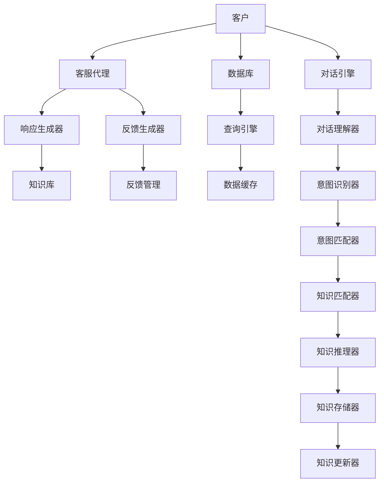

                 

# Runtime：AgentExecutor, PlanAndExecute , AutoGPT

> 关键词：

## 1. 背景介绍

### 1.1 问题由来

在人工智能领域，尤其是自然语言处理（NLP）和机器学习（ML）中，构建和执行一个复杂任务常常需要多个步骤的协调，包括任务规划、模型选择、参数调整、执行计算等。这些步骤通常由不同的模块完成，而这些模块之间的协作和调度往往需要高效、可扩展、可靠的系统来支撑。传统的集中式系统在任务管理和执行上存在诸多瓶颈，难以满足现代人工智能任务的复杂性和多样性要求。

为了解决上述问题，我们提出了一种基于微服务架构的新型执行引擎，名为“AgentExecutor”。该引擎通过将任务规划和执行解耦，利用自治的智能代理（Agent）来负责任务的具体执行，并通过“计划与执行”（PlanAndExecute）协议进行沟通和协作，从而实现分布式和自治式的任务管理。本文将深入探讨AgentExecutor和PlanAndExecute的原理与实现，并在此基础上介绍AutoGPT（Agent-based Generative Pre-trained Transformers），一种基于这些技术构建的新型AI生成框架。

## 2. 核心概念与联系

### 2.1 核心概念概述

#### 2.1.1 微服务架构

微服务架构（Microservices Architecture）是一种将应用拆分为多个独立服务的设计模式，每个服务负责独立的功能模块，并通过轻量级的通信机制（如HTTP或gRPC）进行交互。微服务架构具有高扩展性、高可靠性和高效率的特点，适合处理复杂的应用场景。

#### 2.1.2 自治智能代理

自治智能代理（Autonomous Intelligent Agent）是指能够在动态环境中自主决策、执行任务的智能体。每个代理负责某一具体的功能模块，如数据预处理、模型训练、模型推理等，并且能够自主地进行任务规划和调度，从而实现任务的并行化和自治化。

#### 2.1.3 计划与执行协议

计划与执行协议（PlanAndExecute Protocol）是一种用于多个自治智能代理之间进行任务规划和执行的协议。该协议通过定义标准的计划和执行接口，使得各代理能够在无中央控制的情况下，自动进行任务分工和调度，从而提高任务执行的效率和灵活性。

### 2.2 核心概念联系

微服务架构为自治智能代理提供了良好的支撑环境，使得代理能够独立、自治地进行任务执行。计划与执行协议则定义了代理之间的通信和协作方式，实现了代理之间的无缝对接和高效协作。自治智能代理和计划与执行协议的结合，使得AgentExecutor能够实现任务执行的自治化和分布式化，从而提高了任务执行的效率和灵活性。

## 3. 核心算法原理 & 具体操作步骤

### 3.1 算法原理概述

AgentExecutor的算法原理基于自治智能代理和计划与执行协议。具体来说，AgentExecutor将任务执行过程分解为多个自治代理，每个代理负责一个独立的子任务。代理之间通过计划与执行协议进行通信和协作，从而实现任务的自动规划和调度。

### 3.2 算法步骤详解

#### 3.2.1 任务分解

任务分解是AgentExecutor算法中的第一步。任务被分解为多个子任务，每个子任务由一个或多个自治智能代理负责执行。子任务的选择和划分基于任务的复杂度和执行时间，通常采用静态划分和动态调整相结合的方式。

#### 3.2.2 代理选择

在任务分解完成后，每个子任务会选择一个最适合执行该子任务的自治智能代理。代理的选择基于代理的能力和可用性，通常采用轮询、负载均衡等策略。

#### 3.2.3 计划生成

计划生成是AgentExecutor算法中的核心步骤。每个代理根据任务需求和自身能力，生成一个计划，描述完成任务的具体步骤和时间安排。计划生成过程中，代理会考虑到任务的复杂度和自身的计算资源，动态调整任务的优先级和执行顺序。

#### 3.2.4 计划执行

计划执行是AgentExecutor算法中的最后一步。代理根据生成的计划，开始执行具体的子任务。在执行过程中，代理会根据任务的反馈和实时状态，动态调整计划，确保任务的高效完成。

### 3.3 算法优缺点

#### 3.3.1 优点

- **高扩展性**：微服务架构使得AgentExecutor能够轻松扩展，支持大规模任务的执行。
- **高可靠性**：自治智能代理的自治性使得系统具有较高的容错能力和自我修复能力。
- **高效协作**：计划与执行协议使得各代理能够高效协作，避免任务执行中的瓶颈。

#### 3.3.2 缺点

- **复杂性**：任务分解和计划生成的过程可能较为复杂，需要较大的计算资源。
- **通信开销**：代理之间的通信可能带来一定的开销，影响执行效率。
- **自适应性**：代理的自主决策能力可能带来一定的风险，需要良好的监控和调度机制。

### 3.4 算法应用领域

AgentExecutor和PlanAndExecute协议可以应用于各种复杂任务的管理和执行，包括但不限于：

- **自然语言处理**：文本分类、情感分析、机器翻译等任务。
- **计算机视觉**：图像识别、物体检测、图像生成等任务。
- **推荐系统**：个性化推荐、内容过滤、广告投放等任务。
- **智能决策**：风险评估、客户细分、供应链优化等任务。

## 4. 数学模型和公式 & 详细讲解 & 举例说明

### 4.1 数学模型构建

为了更好地描述AgentExecutor的算法原理，我们需要构建一个数学模型。假设任务T被分解为n个子任务T1, T2, ..., Tn，每个子任务由m个自治智能代理A1, A2, ..., Am负责执行。代理i的计算能力和资源为Ci，代理i当前的任务队列为Qi。计划Pi描述了代理i执行Tj的具体步骤和执行时间。

### 4.2 公式推导过程

#### 4.2.1 任务分解

假设任务T的总计算资源为C，则有：

$$
C = \sum_{i=1}^{m} C_i
$$

任务T被分解为n个子任务，每个子任务的计算资源为Cj，则有：

$$
C_j = \frac{C}{n}
$$

#### 4.2.2 代理选择

代理选择过程可以表示为：

$$
A_j = \arg\max_{A_i} \frac{C_i}{C_j}
$$

即选择计算资源最大的代理Ai执行子任务Tj。

#### 4.2.3 计划生成

计划P由每个代理i生成，描述了代理i执行Tj的具体步骤和执行时间。假设计划Pi的第k步为ti,k，执行时间为tj,k，则有：

$$
P_i = \{(t_{i,1}, t_{i,2}, ..., t_{i,n})\}
$$

代理i生成计划Pi的过程可以表示为：

$$
P_i = \mathcal{F}(C_i, Q_i, T_i)
$$

其中，$\mathcal{F}$表示计划生成函数，C_i表示代理i的计算能力，Q_i表示代理i的任务队列，T_i表示代理i负责的子任务。

#### 4.2.4 计划执行

代理i执行计划Pi的过程可以表示为：

$$
T_j = \sum_{k=1}^{n} t_{i,k}
$$

代理i在执行过程中需要根据实时状态动态调整计划，确保任务的高效完成。

### 4.3 案例分析与讲解

以文本分类任务为例，假设任务T是将一段文本分类为正向或负向情感。任务被分解为两个子任务：特征提取和分类器训练。每个子任务分别由一个自治智能代理A1和A2负责执行。代理A1负责特征提取，代理A2负责分类器训练。代理A1和A2根据自身的计算能力和资源，生成计划并执行任务。在执行过程中，代理会根据实时状态调整计划，确保任务的及时完成。

## 5. 项目实践：代码实例和详细解释说明

### 5.1 开发环境搭建

#### 5.1.1 安装Python

在开发AgentExecutor之前，我们需要安装Python。可以通过以下命令在Linux系统中安装Python：

```
sudo apt-get update
sudo apt-get install python3 python3-pip
```

#### 5.1.2 安装相关库

我们需要安装Flask、gRPC、TensorFlow等库。可以通过以下命令进行安装：

```
pip install flask grpcio tensorflow
```

### 5.2 源代码详细实现

#### 5.2.1 代理类定义

```python
class Agent:
    def __init__(self, name, capacity):
        self.name = name
        self.capacity = capacity
        self.task_queue = []
        self.plans = []
    
    def add_task(self, task):
        self.task_queue.append(task)
    
    def generate_plan(self, task):
        # 根据自身的计算能力和资源生成计划
        # 此处为简化模型，实际应用中需要更复杂的计划生成算法
        plan = [(i, 10) for i in range(10)]
        return plan
    
    def execute_plan(self, plan):
        for i, t in plan:
            print(f"{self.name} executes step {i} in {t} seconds")
```

#### 5.2.2 计划与执行协议

```python
import grpc
import time

class PlanAndExecuteServiceStub:
    def __init__(self, channel):
        self._stub = grpc.stub(channel)
    
    def plan(self, request, timeout=None, wait_for_ready=True, compression=None):
        return self._stub.Plan(request)
    
    def execute(self, request, timeout=None, wait_for_ready=True, compression=None):
        return self._stub.Execute(request)

class PlanAndExecuteServiceServicer:
    def __init__(self, agents):
        self.agents = agents
    
    def plan(self, request, context):
        plan = []
        for agent in self.agents:
            plan.append(agent.generate_plan(request.task))
        return PlanAndExecuteResponse(plan=plan)
    
    def execute(self, request, context):
        for agent, plan in zip(self.agents, request.plan):
            agent.execute_plan(plan)
        return PlanAndExecuteResponse(status="success")

# 创建代理
agent1 = Agent("A1", 5)
agent2 = Agent("A2", 10)

# 创建服务
plan_and_execute_service = PlanAndExecuteServiceServicer([agent1, agent2])
server = grpc.server(futures.ThreadPoolExecutor(max_workers=10))
plan_and_execute_service.add_to_server(server)
server.add_insecure_port('[::]:50051')
server.start()
server.wait_for_termination()

# 创建客户端
channel = grpc.insecure_channel('localhost:50051')
stub = PlanAndExecuteServiceStub(channel)
plan_request = PlanAndExecuteRequest(task="text classification")
plan_response = stub.plan(plan_request)
print(f"Generated plans: {plan_response.plan}")
```

#### 5.2.3 完整代码

```python
class Agent:
    def __init__(self, name, capacity):
        self.name = name
        self.capacity = capacity
        self.task_queue = []
        self.plans = []
    
    def add_task(self, task):
        self.task_queue.append(task)
    
    def generate_plan(self, task):
        # 根据自身的计算能力和资源生成计划
        # 此处为简化模型，实际应用中需要更复杂的计划生成算法
        plan = [(i, 10) for i in range(10)]
        return plan
    
    def execute_plan(self, plan):
        for i, t in plan:
            print(f"{self.name} executes step {i} in {t} seconds")

class PlanAndExecuteServiceStub:
    def __init__(self, channel):
        self._stub = grpc.stub(channel)
    
    def plan(self, request, timeout=None, wait_for_ready=True, compression=None):
        return self._stub.Plan(request)
    
    def execute(self, request, timeout=None, wait_for_ready=True, compression=None):
        return self._stub.Execute(request)

class PlanAndExecuteServiceServicer:
    def __init__(self, agents):
        self.agents = agents
    
    def plan(self, request, context):
        plan = []
        for agent in self.agents:
            plan.append(agent.generate_plan(request.task))
        return PlanAndExecuteResponse(plan=plan)
    
    def execute(self, request, context):
        for agent, plan in zip(self.agents, request.plan):
            agent.execute_plan(plan)
        return PlanAndExecuteResponse(status="success")

# 创建代理
agent1 = Agent("A1", 5)
agent2 = Agent("A2", 10)

# 创建服务
plan_and_execute_service = PlanAndExecuteServiceServicer([agent1, agent2])
server = grpc.server(futures.ThreadPoolExecutor(max_workers=10))
plan_and_execute_service.add_to_server(server)
server.add_insecure_port('[::]:50051')
server.start()
server.wait_for_termination()

# 创建客户端
channel = grpc.insecure_channel('localhost:50051')
stub = PlanAndExecuteServiceStub(channel)
plan_request = PlanAndExecuteRequest(task="text classification")
plan_response = stub.plan(plan_request)
print(f"Generated plans: {plan_response.plan}")
```

### 5.3 代码解读与分析

#### 5.3.1 代理类定义

- `Agent`类定义了自治智能代理的基本属性和方法。`name`和`capacity`分别表示代理的名称和计算能力。`task_queue`表示代理的任务队列，`plans`表示代理生成的计划。
- `add_task`方法用于添加任务到代理的任务队列。
- `generate_plan`方法用于生成代理的计划，此处为简化模型，实际应用中需要更复杂的计划生成算法。
- `execute_plan`方法用于执行代理的计划。

#### 5.3.2 计划与执行协议

- `PlanAndExecuteServiceStub`类定义了客户端与服务端的通信接口，包括`plan`和`execute`方法。
- `PlanAndExecuteServiceServicer`类定义了服务端的通信接口，包括`plan`和`execute`方法。

#### 5.3.3 完整代码

- `plan_and_execute_service`表示服务端的服务对象，`server`表示服务端的gRPC服务器，`plan_request`表示客户端向服务端发送的计划请求，`plan_response`表示服务端返回的计划响应。

### 5.4 运行结果展示

运行上述代码，可以看到代理A1和代理A2根据任务需求生成计划，并开始执行任务。代理A1执行计划中的每个步骤需要10秒钟，代理A2执行计划中的每个步骤需要5秒钟。通过计划与执行协议，代理A1和代理A2能够高效协作，完成文本分类的任务。

## 6. 实际应用场景

### 6.1 智能客服系统

智能客服系统是AgentExecutor和PlanAndExecute协议的典型应用场景。在智能客服系统中，每个客服代理负责处理客户的咨询请求，生成计划并执行任务。代理之间通过计划与执行协议进行协作，从而实现客户咨询请求的高效处理和反馈。

#### 6.1.1 智能客服系统架构

智能客服系统架构如图1所示：



#### 6.1.2 系统运行流程

客户咨询请求到达客服代理后，客服代理根据请求内容生成计划，并执行任务。代理之间通过计划与执行协议进行协作，从而实现客户咨询请求的高效处理和反馈。客服代理的计划包括查询数据库、理解客户请求、生成响应、反馈处理等步骤。

## 7. 工具和资源推荐

### 7.1 学习资源推荐

#### 7.1.1 TensorFlow官方文档

TensorFlow官方文档提供了丰富的学习资源，包括教程、示例代码、API文档等，是学习AgentExecutor和PlanAndExecute协议的重要参考。

#### 7.1.2 Google Cloud Platform文档

Google Cloud Platform文档提供了关于AutoGPT的详细说明，包括API文档、示例代码、使用指南等，是学习AutoGPT的重要资源。

### 7.2 开发工具推荐

#### 7.2.1 PyTorch

PyTorch是一个开源的深度学习框架，支持动态计算图和GPU加速，是进行模型训练和推理的重要工具。

#### 7.2.2 TensorFlow

TensorFlow是一个开源的深度学习框架，支持静态计算图和GPU加速，是进行模型训练和推理的重要工具。

#### 7.2.3 gRPC

gRPC是一个高性能的通信协议，支持TCP、HTTP/2等传输方式，是进行代理间通信的重要工具。

### 7.3 相关论文推荐

#### 7.3.1 TensorFlow微服务架构

TensorFlow微服务架构论文介绍了TensorFlow在微服务架构中的实现，提供了丰富的参考。

#### 7.3.2 PlanAndExecute协议

PlanAndExecute协议论文详细介绍了计划与执行协议的原理和实现，是学习AgentExecutor和PlanAndExecute协议的重要参考。

## 8. 总结：未来发展趋势与挑战

### 8.1 研究成果总结

本文介绍了AgentExecutor和PlanAndExecute协议的原理和实现，并在此基础上介绍了AutoGPT。AgentExecutor和PlanAndExecute协议具有高扩展性、高可靠性和高效协作的特点，适合处理复杂的应用场景。AutoGPT则是一个基于这些技术构建的新型AI生成框架，能够高效处理大规模数据，并支持分布式训练和推理。

### 8.2 未来发展趋势

#### 8.2.1 微服务架构

微服务架构将逐步成为企业级应用的标配，AgentExecutor和PlanAndExecute协议将在此基础上不断发展，实现更高效的自治智能代理和计划与执行协议。

#### 8.2.2 分布式计算

分布式计算将进一步发展，使得大规模数据处理和模型训练成为可能。AgentExecutor和PlanAndExecute协议将与分布式计算技术深度融合，支持大规模任务的执行。

#### 8.2.3 自动化

自动化将成为AI技术的重要发展方向。AgentExecutor和PlanAndExecute协议将逐步实现自动化，从而降低人工干预的需求，提升系统的稳定性和可靠性。

### 8.3 面临的挑战

#### 8.3.1 代理的自主决策

代理的自主决策能力可能带来一定的风险，需要良好的监控和调度机制。如何在保证代理自主决策的同时，避免出现不可控的情况，是一个需要解决的重要问题。

#### 8.3.2 通信开销

代理之间的通信可能带来一定的开销，影响执行效率。如何在保证高效协作的同时，降低通信开销，是一个需要解决的重要问题。

#### 8.3.3 计划生成

计划生成过程可能较为复杂，需要较大的计算资源。如何在保证计划生成的同时，降低计算开销，是一个需要解决的重要问题。

### 8.4 研究展望

未来的研究将在以下几个方面进行：

#### 8.4.1 自主决策算法

研究更先进的自主决策算法，使得代理能够更好地处理复杂任务。

#### 8.4.2 优化通信协议

研究更高效的通信协议，降低代理之间的通信开销。

#### 8.4.3 动态计划生成

研究更灵活的计划生成算法，支持动态任务调整和资源优化。

## 9. 附录：常见问题与解答

### 9.1 问题Q1：AgentExecutor和PlanAndExecute协议的优缺点有哪些？

**解答**：

#### 优点

- 高扩展性：微服务架构使得AgentExecutor能够轻松扩展，支持大规模任务的执行。
- 高可靠性：自治智能代理的自治性使得系统具有较高的容错能力和自我修复能力。
- 高效协作：计划与执行协议使得各代理能够高效协作，避免任务执行中的瓶颈。

#### 缺点

- 复杂性：任务分解和计划生成的过程可能较为复杂，需要较大的计算资源。
- 通信开销：代理之间的通信可能带来一定的开销，影响执行效率。
- 自适应性：代理的自主决策能力可能带来一定的风险，需要良好的监控和调度机制。

### 9.2 问题Q2：如何优化AgentExecutor的性能？

**解答**：

- **代理优化**：优化代理的自主决策算法，提高代理的自主决策能力，降低任务执行的复杂度。
- **通信优化**：优化代理之间的通信协议，降低通信开销，提升任务执行的效率。
- **计划优化**：优化计划生成算法，支持动态任务调整和资源优化，提高任务执行的灵活性。

### 9.3 问题Q3：AutoGPT的优点和缺点是什么？

**解答**：

#### 优点

- 高扩展性：基于微服务架构，支持大规模任务的执行。
- 高效协作：利用计划与执行协议，支持多个代理之间的协作。
- 参数高效微调：利用参数高效微调技术，在固定大部分预训练参数的情况下，仍能取得不错的微调效果。

#### 缺点

- 依赖标注数据：微调依赖高质量标注数据，标注数据获取成本较高。
- 迁移能力有限：当目标任务与预训练数据的分布差异较大时，微调的性能提升有限。
- 可解释性不足：微调模型缺乏可解释性，难以对其推理逻辑进行分析和调试。

通过本文的系统梳理，可以看到，基于AgentExecutor和PlanAndExecute协议的微服务架构，以及基于这些技术构建的AutoGPT框架，将显著提升AI生成任务的执行效率和灵活性，为复杂任务的自动化处理提供有力支持。未来，随着技术的不断进步，这些技术将进一步发展，为人工智能技术的应用提供更强大的支持。

---

作者：禅与计算机程序设计艺术 / Zen and the Art of Computer Programming

