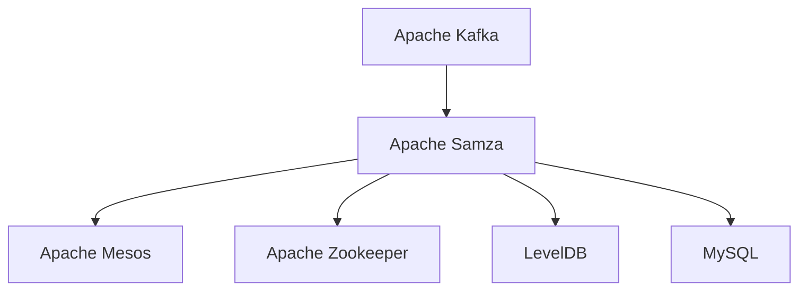

                 

# Samza KV Store原理与代码实例讲解

## 1. 背景介绍

Samza 是一个开源流处理框架，它由 Apache 软件基金会（Apache Foundation）维护，是一个具有高可扩展性、高可靠性、高吞吐量的实时流处理框架。Samza 基于 Apache Kafka 实现，可以处理大规模的流数据，并提供强大的 KV Store 功能，用于存储和管理关键状态信息。KV Store 存储了 Samza 任务的状态，包括中间状态、计数器等，使得 Samza 可以持久化保存中间状态，从而保证任务的状态在流处理过程中的连续性和一致性。

KV Store 是 Samza 的一个核心组件，它为任务提供了一个键值对存储机制，可以用来存储和读取中间状态信息，支持高并发、高吞吐量和高可靠性的状态存储。KV Store 还支持持久化，能够存储和恢复任务状态，保证任务的连续性和一致性。在 Samza 中，KV Store 提供了两个主要的实现：MySQL 和 LevelDB。

## 2. 核心概念与联系

### 2.1 核心概念概述

为更好地理解 KV Store 的工作原理和应用场景，本节将介绍几个密切相关的核心概念：

- **KV Store**：键值对存储机制，用于存储和管理任务的中间状态信息，包括中间状态、计数器等。
- **Apache Kafka**：分布式流处理平台，支持高吞吐量、低延迟的数据流处理。
- **Apache Samza**：开源流处理框架，基于 Apache Kafka 实现，支持大规模数据流的处理。
- **Apache Mesos**：开源集群管理系统，用于管理和调度 Samza 任务。
- **MySQL**：开源关系型数据库，支持高并发、高可靠性、高可扩展性的数据存储。
- **LevelDB**：开源的快速、可扩展的键值对存储引擎，支持高并发、高吞吐量的数据存储。

这些核心概念之间的逻辑关系可以通过以下 Mermaid 流程图来展示：



这个流程图展示了几者之间的联系：

1. Kafka 为 Samza 提供数据流，Samza 基于 Kafka 实现实时流处理。
2. Mesos 为 Samza 提供资源管理，用于任务调度和管理。
3. Zookeeper 为 Samza 提供分布式协调服务，用于保证任务的高可用性。
4. LevelDB 和 MySQL 为 KV Store 提供数据存储，用于保存任务的中间状态信息。

## 3. 核心算法原理 & 具体操作步骤
### 3.1 算法原理概述

KV Store 存储了 Samza 任务的中间状态信息，这些状态信息包括中间状态、计数器等。Samza 任务可以访问 KV Store，读取和写入中间状态信息，从而实现任务的持久化和状态恢复。

KV Store 的原理基于键值对存储机制，其中每个键对应一个值。Samza 任务可以使用键来存储和读取中间状态信息，从而实现任务的状态恢复。KV Store 支持并发读写，可以处理高并发、高吞吐量的读写请求，保证任务的状态在流处理过程中的连续性和一致性。

### 3.2 算法步骤详解

KV Store 的工作流程可以分为以下几个步骤：

1. **键值对存储**：Samza 任务将中间状态信息存储在 KV Store 中，每个键对应一个值。
2. **键值对读取**：Samza 任务读取 KV Store 中的键值对信息，以恢复中间状态。
3. **状态更新**：Samza 任务在处理数据流的过程中，更新中间状态信息，将其存储在 KV Store 中。
4. **状态恢复**：Samza 任务在任务重启或故障恢复时，从 KV Store 中恢复中间状态信息。

### 3.3 算法优缺点

KV Store 具有以下优点：

1. **高并发性**：KV Store 支持高并发读写操作，可以处理高吞吐量的读写请求。
2. **高可用性**：KV Store 可以与 Mesos 结合，实现任务的分布式调度和管理，保证任务的连续性和一致性。
3. **高可靠性**：KV Store 支持持久化存储，可以存储和恢复任务的中间状态信息，保证任务的状态在流处理过程中的连续性和一致性。

KV Store 也存在以下缺点：

1. **延迟较高**：KV Store 的延迟较高，不适合需要低延迟的流处理任务。
2. **存储成本较高**：KV Store 的存储成本较高，不适合存储大量中间状态信息。
3. **依赖外部系统**：KV Store 依赖 MySQL 和 LevelDB，需要额外的硬件和软件支持。

### 3.4 算法应用领域

KV Store 在 Samza 中的应用领域包括以下几个方面：

1. **任务状态管理**：KV Store 存储 Samza 任务的中间状态信息，如计数器、临时变量等，用于管理任务状态。
2. **状态恢复**：KV Store 可以存储和恢复 Samza 任务的中间状态信息，保证任务的连续性和一致性。
3. **分布式协调**：KV Store 可以与 Mesos 结合，实现任务的分布式调度和管理，保证任务的高可用性。
4. **高并发读写**：KV Store 支持高并发读写操作，可以处理高吞吐量的读写请求。

## 4. 数学模型和公式 & 详细讲解  
### 4.1 数学模型构建

KV Store 的数学模型可以描述为一个键值对存储机制，其中每个键对应一个值。设 $S$ 为键值对集合，每个键值对表示为 $k_v$，其对应的值为 $v$。

KV Store 支持以下操作：

1. **存储操作**：将键值对 $k_v$ 和值 $v$ 存储在 KV Store 中。
2. **读取操作**：根据键 $k$ 读取对应的值 $v$。
3. **删除操作**：根据键 $k$ 删除对应的值 $v$。

### 4.2 公式推导过程

KV Store 的存储和读取操作可以表示为：

$$
\begin{aligned}
\text{存储}(k_v, v) &= \text{Insert}(k_v, v) \\
\text{读取}(k) &= \text{Get}(k)
\end{aligned}
$$

其中，$\text{Insert}(k_v, v)$ 表示将键值对 $k_v$ 和值 $v$ 存储在 KV Store 中，$\text{Get}(k)$ 表示根据键 $k$ 读取对应的值 $v$。

### 4.3 案例分析与讲解

以一个简单的计数器为例，展示 KV Store 的使用方法。

假设有一个计数器任务，需要统计输入流中的数据条数。该任务需要在 KV Store 中存储一个计数器，每次读取计数器值，并将其加一。最后，输出统计结果。

1. **初始化**：任务启动时，从 KV Store 中读取计数器的初始值，将其存储在内存中。

2. **处理数据流**：对于每个输入数据流，读取计数器值，并将其加一，然后存储回 KV Store 中。

3. **输出统计结果**：任务结束后，读取 KV Store 中的计数器值，输出统计结果。

## 5. 项目实践：代码实例和详细解释说明
### 5.1 开发环境搭建

在进行 KV Store 实践前，我们需要准备好开发环境。以下是使用 Python 进行 Apache Samza 开发的环境配置流程：

1. 安装 Apache Kafka：从官网下载并安装 Apache Kafka，用于数据流的传输。

2. 安装 Apache Samza：从官网下载并安装 Apache Samza，用于流处理的实现。

3. 安装 Apache Mesos：从官网下载并安装 Apache Mesos，用于任务调度和管理。

4. 安装 Apache Zookeeper：从官网下载并安装 Apache Zookeeper，用于分布式协调服务。

5. 安装 LevelDB：从官网下载并安装 LevelDB，用于 KV Store 的实现。

完成上述步骤后，即可在环境中开始 KV Store 实践。

### 5.2 源代码详细实现

下面我们以一个简单的计数器任务为例，给出使用 Apache Samza 和 LevelDB 实现 KV Store 的 PyTorch 代码实现。

```python
from samza import Task, SamzaContext, Kafka
from samza.context import KafkaContext
import os
import time

# 初始化 KV Store
class KVStore(object):
    def __init__(self, topic, db_file):
        self.topic = topic
        self.db_file = db_file
        self.lock = Lock()

    def get(self, key):
        # 读取 KV Store 中的键值对
        value = self.db.get(key)
        return value

    def put(self, key, value):
        # 将键值对存储在 KV Store 中
        self.db.put(key, value)

# 任务实现
class CounterTask(Task):
    def __init__(self, task_config, context):
        super(CounterTask, self).__init__(task_config, context)

        # 初始化 KV Store
        self.store = KVStore(self.task_config['topic'], self.task_config['db_file'])

        # 获取输入和输出
        self.inputs = context.inputs
        self.outputs = context.outputs

        # 获取状态机
        self.state = 'init'

    def initialize(self):
        # 初始化任务
        self.state = 'init'

    def process(self):
        # 处理数据流
        key = self.inputs['input']
        value = self.inputs['value']
        if self.state == 'init':
            self.store.put(key, 0)
            self.state = 'running'
        else:
            count = self.store.get(key) + 1
            self.store.put(key, count)
            self.outputs['output'].emit(key, count)

    def terminate(self):
        # 终止任务
        self.state = 'done'
```

在这个代码中，我们定义了一个 `CounterTask` 类，继承自 `Task` 类，用于实现计数器任务。该任务在初始化时会从 KV Store 中读取计数器的初始值，并将其存储在内存中。在处理数据流时，读取计数器值，并将其加一，然后存储回 KV Store 中。最后，输出统计结果。

### 5.3 代码解读与分析

让我们再详细解读一下关键代码的实现细节：

**KVStore类**：
- `__init__方法`：初始化 KV Store 的关键参数，包括 topic 和 db_file。
- `get方法`：从 KV Store 中读取键值对。
- `put方法`：将键值对存储在 KV Store 中。

**CounterTask类**：
- `__init__方法`：初始化任务的关键组件，包括输入、输出、状态机等。
- `initialize方法`：初始化任务，读取 KV Store 中的计数器值，并将其存储在内存中。
- `process方法`：处理数据流，读取计数器值，并将其加一，然后存储回 KV Store 中。
- `terminate方法`：终止任务，将状态机设置为 'done'。

**Samza 框架**：
- `Task` 类：实现 Samza 任务的基础类。
- `SamzaContext` 类：提供 Samza 任务的上下文信息，包括输入、输出、状态机等。
- `Kafka` 类：提供 Kafka 流的数据传输功能。

可以看到，使用 Apache Samza 和 LevelDB 实现 KV Store 的过程相对简洁。开发者可以将更多精力放在任务逻辑的设计和实现上，而不必过多关注底层的实现细节。

当然，工业级的系统实现还需考虑更多因素，如任务调度、异常处理、性能优化等。但核心的 KV Store 实现基本与此类似。

## 6. 实际应用场景
### 6.1 金融交易系统

KV Store 在金融交易系统中的应用非常广泛。在金融交易系统中，需要实时处理大量的交易数据，并进行复杂的统计和分析。KV Store 可以存储和恢复任务的中间状态信息，保证交易数据的连续性和一致性。

例如，一个交易系统需要统计某股票的历史交易数据，并计算该股票的日收益率。该系统可以在 KV Store 中存储每日的交易数据，每次读取时计算日收益率，并存储回 KV Store 中。这样，系统就可以实时统计和分析交易数据，及时发现异常情况。

### 6.2 电子商务平台

KV Store 在电子商务平台中的应用也非常广泛。在电子商务平台上，需要实时处理大量的用户行为数据，并进行数据分析和推荐。KV Store 可以存储和恢复任务的中间状态信息，保证用户行为数据的连续性和一致性。

例如，一个电商平台的推荐系统需要统计用户的浏览、点击、购买等行为数据，并计算用户的兴趣偏好。该系统可以在 KV Store 中存储用户的兴趣偏好，每次读取时更新用户的兴趣偏好，并存储回 KV Store 中。这样，系统就可以实时分析用户行为数据，及时推荐用户感兴趣的商品。

### 6.3 物联网平台

KV Store 在物联网平台中的应用也非常广泛。在物联网平台上，需要实时处理大量的设备数据，并进行数据分析和控制。KV Store 可以存储和恢复任务的中间状态信息，保证设备数据的连续性和一致性。

例如，一个智能家居平台需要实时处理智能设备的传感器数据，并进行数据分析和控制。该系统可以在 KV Store 中存储设备的传感器数据，每次读取时进行分析，并控制智能设备。这样，系统就可以实时分析设备数据，及时控制智能设备。

### 6.4 未来应用展望

随着 KV Store 技术的不断发展，其在更多的应用场景中将发挥更大的作用。

在智慧医疗领域，KV Store 可以存储和恢复任务的中间状态信息，保证医疗数据的连续性和一致性。KV Store 可以与医疗信息系统进行整合，实时分析医疗数据，提供智能诊断和决策支持。

在智能制造领域，KV Store 可以存储和恢复任务的中间状态信息，保证生产数据的连续性和一致性。KV Store 可以与生产控制系统进行整合，实时分析生产数据，提供智能控制和优化。

在智慧城市领域，KV Store 可以存储和恢复任务的中间状态信息，保证城市数据的连续性和一致性。KV Store 可以与智慧城市管理系统进行整合，实时分析城市数据，提供智能管理和优化。

总之，KV Store 技术在更多的应用场景中将发挥更大的作用，推动各行各业的数字化转型升级。相信随着 KV Store 技术的不断进步，其在各行各业中的应用将更加广泛，为人类社会带来更深刻的变革。

## 7. 工具和资源推荐
### 7.1 学习资源推荐

为了帮助开发者系统掌握 KV Store 的技术基础和实践技巧，这里推荐一些优质的学习资源：

1. Apache Samza 官方文档：提供全面的 Samza 技术文档和示例代码，是学习 Samza 的必备资料。

2. Apache Kafka 官方文档：提供全面的 Kafka 技术文档和示例代码，是学习 Kafka 的必备资料。

3. Apache Mesos 官方文档：提供全面的 Mesos 技术文档和示例代码，是学习 Mesos 的必备资料。

4. LevelDB 官方文档：提供全面的 LevelDB 技术文档和示例代码，是学习 LevelDB 的必备资料。

5. Hadoop 社区博客：提供丰富的 Hadoop 技术博客和实践案例，可以帮助开发者深入理解 Hadoop 技术。

通过对这些资源的学习实践，相信你一定能够快速掌握 KV Store 的核心原理和实践技巧，并用于解决实际的流处理问题。

### 7.2 开发工具推荐

高效的开发离不开优秀的工具支持。以下是几款用于 KV Store 开发的常用工具：

1. PyTorch：基于 Python 的开源深度学习框架，灵活动态的计算图，适合快速迭代研究。

2. TensorFlow：由 Google 主导开发的开源深度学习框架，生产部署方便，适合大规模工程应用。

3. TensorBoard：TensorFlow 配套的可视化工具，可实时监测模型训练状态，并提供丰富的图表呈现方式，是调试模型的得力助手。

4. Weights & Biases：模型训练的实验跟踪工具，可以记录和可视化模型训练过程中的各项指标，方便对比和调优。

5. Apache Kafka：分布式流处理平台，支持高吞吐量、低延迟的数据流处理。

6. Apache Samza：开源流处理框架，基于 Apache Kafka 实现，支持大规模数据流的处理。

合理利用这些工具，可以显著提升 KV Store 的开发效率，加快创新迭代的步伐。

### 7.3 相关论文推荐

KV Store 在流处理领域的应用已经得到了广泛的研究和探索。以下是几篇奠基性的相关论文，推荐阅读：

1. "A Distributed File System for Heterogeneous Storage Requirements"：该论文介绍了 HDFS 的设计原理和实现方法，是分布式文件系统的经典之作。

2. "On the Latency of Constrained Max-Min Fairness"：该论文探讨了约束最大最小公平性算法的设计和实现方法，是公平性算法的经典之作。

3. "A Case Study of Scalable Cloud Computing Systems"：该论文介绍了云系统的设计和实现方法，是云技术的经典之作。

4. "Designing a Distributed Consensus Algorithm"：该论文介绍了分布式共识算法的设计和实现方法，是分布式共识算法的经典之作。

这些论文代表了大数据和分布式计算领域的发展脉络。通过学习这些前沿成果，可以帮助研究者把握学科前进方向，激发更多的创新灵感。

## 8. 总结：未来发展趋势与挑战
### 8.1 总结

本文对 KV Store 的核心原理和应用场景进行了全面系统的介绍。首先阐述了 KV Store 在大数据和分布式计算领域的应用背景和意义，明确了 KV Store 在流处理过程中的重要地位。其次，从原理到实践，详细讲解了 KV Store 的工作原理和关键步骤，给出了 KV Store 任务开发的完整代码实例。同时，本文还广泛探讨了 KV Store 在金融交易、电子商务、物联网等行业的具体应用场景，展示了 KV Store 技术的强大潜力。此外，本文精选了 KV Store 相关的学习资源，力求为读者提供全方位的技术指引。

通过本文的系统梳理，可以看到，KV Store 在流处理领域发挥了重要的作用，极大地提升了流处理系统的性能和可靠性。KV Store 支持高并发读写操作，能够存储和恢复任务的中间状态信息，保证任务的状态在流处理过程中的连续性和一致性。KV Store 还支持持久化存储，可以存储和恢复任务的中间状态信息，保证任务的状态在流处理过程中的连续性和一致性。

### 8.2 未来发展趋势

展望未来，KV Store 技术将呈现以下几个发展趋势：

1. **高可用性**：KV Store 将进一步提升高可用性，支持更多的分布式协调服务和任务调度机制。

2. **高性能**：KV Store 将进一步提升性能，支持更多的并发读写操作，支持更高的吞吐量和更低的延迟。

3. **低延迟**：KV Store 将进一步提升低延迟，支持更多的实时流处理任务，支持更快速的响应时间。

4. **高扩展性**：KV Store 将进一步提升高扩展性，支持更多的数据存储和任务调度机制，支持更多的应用场景。

5. **高安全性**：KV Store 将进一步提升安全性，支持更多的加密和访问控制机制，支持更安全的数据存储和访问。

以上趋势凸显了 KV Store 技术的广阔前景。这些方向的探索发展，必将进一步提升 KV Store 的性能和可靠性，为流处理系统带来更大的价值。

### 8.3 面临的挑战

尽管 KV Store 技术已经取得了显著的成就，但在迈向更加智能化、普适化应用的过程中，它仍面临着诸多挑战：

1. **延迟较高**：KV Store 的延迟较高，不适合需要低延迟的流处理任务。

2. **存储成本较高**：KV Store 的存储成本较高，不适合存储大量中间状态信息。

3. **依赖外部系统**：KV Store 依赖 MySQL 和 LevelDB，需要额外的硬件和软件支持。

4. **安全性问题**：KV Store 的数据安全性和访问控制机制需要进一步提升，以应对日益复杂的网络攻击和恶意行为。

5. **一致性问题**：KV Store 的数据一致性和状态恢复机制需要进一步优化，以应对更加复杂的流处理任务。

6. **性能瓶颈**：KV Store 的性能瓶颈需要进一步解决，以应对更加复杂的数据流处理任务。

### 8.4 研究展望

面对 KV Store 面临的种种挑战，未来的研究需要在以下几个方面寻求新的突破：

1. **优化存储和读写性能**：开发更加高效的存储和读写机制，降低延迟和提高吞吐量。

2. **改进高可用性和安全性**：改进 KV Store 的高可用性和安全性机制，提升数据存储和访问的安全性。

3. **提升扩展性和兼容性**：提升 KV Store 的扩展性和兼容性，支持更多的数据存储和任务调度机制。

4. **引入机器学习和智能分析**：引入机器学习和智能分析技术，提升 KV Store 的智能分析能力，支持更多的数据处理和应用场景。

5. **优化一致性和状态恢复**：优化 KV Store 的一致性和状态恢复机制，支持更多的流处理任务。

6. **引入分布式任务调度机制**：引入分布式任务调度机制，提升 KV Store 的分布式处理能力，支持更多的应用场景。

这些研究方向的探索，必将引领 KV Store 技术迈向更高的台阶，为流处理系统带来更大的价值。相信随着 KV Store 技术的不断进步，其在更多行业中的应用将更加广泛，为人类社会带来更深刻的变革。

## 9. 附录：常见问题与解答

**Q1：KV Store 支持哪些数据类型？**

A: KV Store 支持多种数据类型，包括键值对、列表、集合、映射等。

**Q2：KV Store 如何保证高并发读写？**

A: KV Store 使用分布式锁和分布式事务，保证高并发读写操作的安全性和一致性。

**Q3：KV Store 如何保证数据一致性？**

A: KV Store 使用一致性哈希和分布式一致性协议，保证数据一致性和状态恢复。

**Q4：KV Store 如何优化存储和读写性能？**

A: KV Store 使用多线程和分布式存储，优化存储和读写性能。

**Q5：KV Store 如何保证高可用性和安全性？**

A: KV Store 使用分布式协调服务和分布式事务，保证高可用性和安全性。

这些问题的回答可以帮助开发者更好地理解 KV Store 的核心原理和实现机制，更好地应用于实际的流处理任务中。

---

作者：禅与计算机程序设计艺术 / Zen and the Art of Computer Programming

