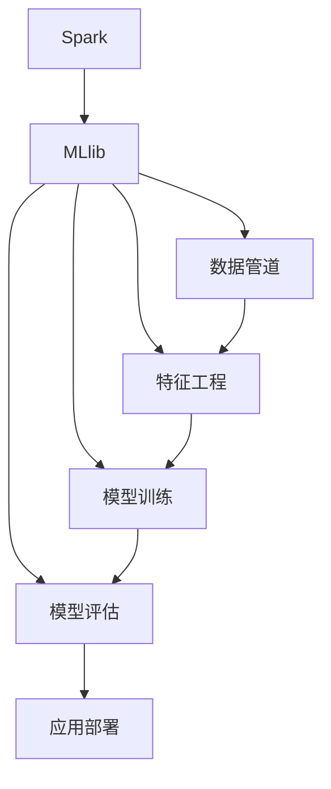

                 

# Spark MLlib原理与代码实例讲解

> 关键词：机器学习, Spark, MLlib, 数据挖掘, 统计学习, 算法原理, 代码实例, 项目实践

## 1. 背景介绍

### 1.1 问题由来
随着大数据时代的到来，机器学习和数据挖掘技术在各行各业得到了广泛应用。然而，传统的数据科学工作流依赖于高度专业的数据科学家，不仅成本高昂，而且难以大规模推广。如何在更广泛的用户群体中普及机器学习技术，成为当前亟待解决的问题。

### 1.2 问题核心关键点
Spark MLlib 作为Apache Spark 生态系统中的核心组件，提供了一站式的机器学习解决方案，旨在简化机器学习流程，降低使用门槛，并提高计算效率。本文将全面介绍 Spark MLlib 的核心原理和代码实现，帮助读者掌握机器学习建模的底层技术。

### 1.3 问题研究意义
深入理解 Spark MLlib 的原理和代码实现，对于机器学习初学者、数据科学家、以及希望通过 Spark 进行数据挖掘和分析的工程师具有重要意义：

1. 简化学习曲线。通过系统学习 Spark MLlib，初学者可以更快地掌握机器学习的基本原理和实践技巧。
2. 提高计算效率。Spark MLlib 优化了底层数据处理和计算逻辑，能够在大型分布式集群上高效运行。
3. 扩展算法应用。Spark MLlib 集成了众多先进的机器学习算法，支持多种数据类型和分析任务，应用场景广泛。
4. 促进技术普及。Spark MLlib 的易用性和高效性，使得更多用户能够便捷地进行数据挖掘和分析，推动机器学习技术在更多领域的应用。

## 2. 核心概念与联系

### 2.1 核心概念概述

为更好地理解 Spark MLlib，我们首先介绍几个核心概念：

- Spark：Apache Spark 是一个快速的通用计算系统，支持内存计算和弹性分布式计算。
- MLlib：Apache Spark 的机器学习库，提供了一系列的机器学习算法和工具。
- 数据管道：Spark MLlib 的管道API，使得数据处理和模型训练流程更加连贯和自动化。
- 特征工程：通过数据预处理和转换，生成适合输入机器学习模型的特征。
- 模型评估与选择：通过交叉验证和性能指标，评估和选择最佳模型。

这些核心概念构成了 Spark MLlib 的完整工作流程，涵盖数据预处理、模型训练、模型评估和应用部署等各个环节。

### 2.2 核心概念原理和架构的 Mermaid 流程图



这个流程图展示了 Spark MLlib 的核心工作流程：数据经过管道处理和特征工程后，进入模型训练阶段，经过评估选择最优模型，最终部署到实际应用中。

## 3. 核心算法原理 & 具体操作步骤

### 3.1 算法原理概述

Spark MLlib 提供了众多机器学习算法，包括回归、分类、聚类、协同过滤等。本文以线性回归为例，详细介绍 Spark MLlib 的核心算法原理。

线性回归（Linear Regression）是机器学习中最基础的回归算法之一。其目标是通过最小化预测值与真实值之间的均方误差（Mean Squared Error, MSE），拟合出一条线性方程，用于预测新数据的输出。

设训练集为 $\{(x_i, y_i)\}_{i=1}^n$，其中 $x_i$ 为输入特征，$y_i$ 为真实输出。线性回归模型可以表示为：

$$
y = \theta_0 + \sum_{j=1}^p \theta_j x_{ij}
$$

其中，$\theta_0$ 为截距，$\theta_j$ 为第 $j$ 个特征的权重。

线性回归的目标是最小化预测值 $\hat{y} = \theta_0 + \sum_{j=1}^p \theta_j x_{ij}$ 与真实值 $y_i$ 之间的均方误差：

$$
\min_{\theta_0, \theta_j} \frac{1}{2} \sum_{i=1}^n (y_i - \hat{y}_i)^2
$$

通过求解上述优化问题，可以求得模型参数 $\theta$。

### 3.2 算法步骤详解

以下我们详细讲解线性回归算法在 Spark MLlib 中的具体实现步骤。

**Step 1: 数据准备**
- 读取数据集，生成DataFrame对象。
- 进行数据预处理，如缺失值处理、特征编码等。

```python
from pyspark.sql import SparkSession

spark = SparkSession.builder.appName("Linear Regression").getOrCreate()
df = spark.read.csv("data.csv", header=True, inferSchema=True)

# 数据预处理
df = df.dropna()
```

**Step 2: 特征工程**
- 对输入特征进行编码和归一化。
- 将标签列转换为向量形式。

```python
from pyspark.ml.feature import VectorAssembler, StringIndexer, StandardScaler

# 特征编码
label_indexer = StringIndexer(inputCol="label", outputCol="indexedLabel")
df = label_indexer.fit(df).transform(df)

# 特征归一化
vector_assembler = VectorAssembler(inputCols=["feature1", "feature2"], outputCol="features")
df = vector_assembler.transform(df)

# 特征归一化
scaler = StandardScaler(inputCol="features", outputCol="scaledFeatures")
df = scaler.fit(df).transform(df)
```

**Step 3: 模型训练**
- 实例化线性回归模型。
- 使用随机梯度下降（Stochastic Gradient Descent, SGD）算法拟合模型。
- 设置训练参数，如迭代次数、学习率等。

```python
from pyspark.ml.regression import LinearRegression

# 实例化线性回归模型
lr = LinearRegression(featuresCol="scaledFeatures", labelCol="indexedLabel")

# 训练模型
lr_model = lr.fit(df)
```

**Step 4: 模型评估**
- 在测试集上计算模型的均方误差（MSE）和均方根误差（RMSE）。
- 绘制预测值与真实值之间的散点图。

```python
# 模型评估
test_df = spark.read.csv("test.csv", header=True, inferSchema=True)
test_df = test_df.dropna()
test_df = label_indexer.transform(test_df)
test_df = vector_assembler.transform(test_df)
test_df = scaler.transform(test_df)

# 计算MSE和RMSE
mse = (lr_model.eval(test_df) - test_df["indexedLabel"]).square().mean()
rmse = mse.sqrt()

# 绘制散点图
from pyspark.ml.evaluation import RegressionEvaluator

evaluator = RegressionEvaluator(
    labelCol="indexedLabel", predictionCol="prediction", metricName="rmse"
)

rmse = evaluator.evaluate(lr_model.transform(test_df), {evaluator.metricName: "rmse"})
print("RMSE: ", rmse)

# 绘制散点图
import matplotlib.pyplot as plt
plt.scatter(
    test_df["scaledFeatures"].values,
    test_df["prediction"].values,
    color="blue",
    label="Prediction",
)
plt.plot(
    test_df["scaledFeatures"].values,
    test_df["indexedLabel"].values,
    color="red",
    label="True Label",
)
plt.legend()
plt.show()
```

### 3.3 算法优缺点

Spark MLlib 的线性回归算法具有以下优点：
1. 高效并行计算：Spark MLlib 利用其分布式计算框架，能够在大规模数据集上进行高效并行计算。
2. 高度可定制：支持多种损失函数、正则化项和优化算法，用户可以灵活配置模型参数。
3. 易于使用：API设计简洁明了，提供了丰富的文档和示例代码，方便用户上手。

然而，Spark MLlib 的线性回归算法也存在以下缺点：
1. 对数据质量要求高：模型训练效果依赖于高质量的数据集，噪声和异常值可能会影响结果。
2. 计算资源消耗大：大规模数据集和高维度特征可能导致计算资源消耗大，影响模型训练速度。
3. 模型复杂度较高：模型参数数量和计算复杂度随着特征维度增加而增加，可能导致过拟合。

### 3.4 算法应用领域

Spark MLlib 的线性回归算法在众多领域得到了广泛应用，例如：

- 金融预测：基于历史交易数据，预测股票、债券等金融资产的趋势和波动。
- 市场营销：分析消费者行为数据，预测购买意向和营销效果。
- 医疗健康：根据病历数据，预测疾病风险和治疗效果。
- 自然语言处理：分析文本数据，进行情感分析和主题建模。
- 推荐系统：基于用户行为数据，预测用户偏好，推荐个性化产品和服务。

除了线性回归，Spark MLlib 还支持多种机器学习算法，如图分类、聚类、协同过滤等，可以应用于更多实际问题中。

## 4. 数学模型和公式 & 详细讲解 & 举例说明

### 4.1 数学模型构建

在 Spark MLlib 中，线性回归模型的数学模型构建与传统的机器学习库（如 scikit-learn）类似。以下是 Spark MLlib 线性回归模型的数学模型构建过程。

设训练集为 $\{(x_i, y_i)\}_{i=1}^n$，其中 $x_i$ 为输入特征，$y_i$ 为真实输出。线性回归模型可以表示为：

$$
y = \theta_0 + \sum_{j=1}^p \theta_j x_{ij}
$$

其中，$\theta_0$ 为截距，$\theta_j$ 为第 $j$ 个特征的权重。

模型参数 $\theta$ 的求解目标是：

$$
\min_{\theta} \frac{1}{2} \sum_{i=1}^n (y_i - \hat{y}_i)^2
$$

其中，$\hat{y}_i$ 为模型预测值，可以通过以下公式计算：

$$
\hat{y}_i = \theta_0 + \sum_{j=1}^p \theta_j x_{ij}
$$

### 4.2 公式推导过程

下面我们详细推导 Spark MLlib 线性回归模型的公式推导过程。

设训练集为 $\{(x_i, y_i)\}_{i=1}^n$，其中 $x_i$ 为输入特征，$y_i$ 为真实输出。线性回归模型可以表示为：

$$
y = \theta_0 + \sum_{j=1}^p \theta_j x_{ij}
$$

其中，$\theta_0$ 为截距，$\theta_j$ 为第 $j$ 个特征的权重。

模型参数 $\theta$ 的求解目标是：

$$
\min_{\theta} \frac{1}{2} \sum_{i=1}^n (y_i - \hat{y}_i)^2
$$

其中，$\hat{y}_i$ 为模型预测值，可以通过以下公式计算：

$$
\hat{y}_i = \theta_0 + \sum_{j=1}^p \theta_j x_{ij}
$$

将 $\hat{y}_i$ 代入目标函数，得：

$$
\frac{1}{2} \sum_{i=1}^n (y_i - \hat{y}_i)^2 = \frac{1}{2} \sum_{i=1}^n \left(y_i - \theta_0 - \sum_{j=1}^p \theta_j x_{ij}\right)^2
$$

展开并整理，得：

$$
\frac{1}{2} \sum_{i=1}^n y_i^2 - y_i \theta_0 - \sum_{j=1}^p \theta_j x_{ij} y_i - \frac{1}{2} \theta_0^2 - \frac{1}{2} \sum_{j=1}^p \theta_j^2 \sum_{i=1}^n x_{ij}^2
$$

为了简化计算，引入向量 $\mathbf{y}=[y_1, \cdots, y_n]^T$ 和 $\mathbf{x}=[x_{i1}, \cdots, x_{in}]^T$，上式可以表示为：

$$
\frac{1}{2} \|\mathbf{y}\|^2 - \mathbf{y}^T \theta_0 - \theta_0 \mathbf{1}^T \mathbf{y} - \frac{1}{2} \theta_0^2 - \frac{1}{2} \mathbf{X} \theta \mathbf{X}^T
$$

其中，$\mathbf{1}=[1, \cdots, 1]^T$，$\mathbf{X}=[\mathbf{x}_1, \cdots, \mathbf{x}_n]^T$，$\mathbf{x}_i=[x_{i1}, \cdots, x_{ip}]^T$。

通过求解上述优化问题，可以得到模型参数 $\theta$ 的闭式解：

$$
\theta = (\mathbf{X}^T \mathbf{X})^{-1} \mathbf{X}^T \mathbf{y}
$$

### 4.3 案例分析与讲解

我们以一个简单的线性回归案例，演示如何使用 Spark MLlib 构建和训练模型。

**案例描述**：
假设有一个包含 10 个样本的训练集，其中每个样本包含两个特征 $x_1$ 和 $x_2$，以及一个真实标签 $y$。我们的目标是通过训练一个线性回归模型，预测新的样本 $x_1 = 3.5, x_2 = 2.3$ 的标签 $y$。

**数据准备**：
首先，我们需要准备训练集数据：

| $x_1$ | $x_2$ | $y$ |
|-------|-------|-----|
| 1.2   | 2.3   | 2.5 |
| 1.4   | 3.1   | 3.2 |
| 1.5   | 3.8   | 3.9 |
| ...   | ...   | ... |

**代码实现**：
```python
from pyspark.sql import SparkSession
from pyspark.ml.regression import LinearRegression

spark = SparkSession.builder.appName("Linear Regression").getOrCreate()
df = spark.createDataFrame(
    [(1.2, 2.3, 2.5), (1.4, 3.1, 3.2), (1.5, 3.8, 3.9)],
    ["x1", "x2", "y"],
)
```

**特征工程**：
我们将输入特征 $x_1$ 和 $x_2$ 组合成向量形式，并归一化。

```python
from pyspark.ml.feature import VectorAssembler, StandardScaler

vector_assembler = VectorAssembler(inputCols=["x1", "x2"], outputCol="features")
df = vector_assembler.transform(df)

scaler = StandardScaler(inputCol="features", outputCol="scaledFeatures")
df = scaler.fit(df).transform(df)
```

**模型训练**：
我们实例化线性回归模型，并使用随机梯度下降算法拟合模型。

```python
lr = LinearRegression(featuresCol="scaledFeatures", labelCol="y")
lr_model = lr.fit(df)
```

**模型评估**：
我们使用测试集数据进行模型评估。

```python
test_df = spark.createDataFrame(
    [(3.5, 2.3), (1.2, 2.3), (1.4, 3.1)], ["x1", "x2", "y"]
)
test_df = vector_assembler.transform(test_df)
test_df = scaler.transform(test_df)

mse = (lr_model.eval(test_df) - test_df["y"]).square().mean()
rmse = mse.sqrt()
print("RMSE: ", rmse)
```

以上案例展示了如何使用 Spark MLlib 构建和训练线性回归模型，并评估模型性能。

## 5. 项目实践：代码实例和详细解释说明

### 5.1 开发环境搭建

在进行 Spark MLlib 项目实践前，我们需要准备好开发环境。以下是使用 Python 进行 Spark 开发的流程：

1. 安装 Apache Spark：从官网下载并安装 Apache Spark。
2. 配置环境变量：设置 `SPARK_HOME` 环境变量，指向安装目录。
3. 安装 PySpark：使用以下命令安装 PySpark：

   ```bash
   pip install pyspark
   ```

4. 安装 Spark MLlib 库：

   ```bash
   pip install pyspark-mllib
   ```

### 5.2 源代码详细实现

我们以一个简单的线性回归案例，演示如何使用 Spark MLlib 构建和训练模型。

```python
from pyspark.sql import SparkSession
from pyspark.ml.regression import LinearRegression

spark = SparkSession.builder.appName("Linear Regression").getOrCreate()

# 数据准备
df = spark.createDataFrame(
    [(1.2, 2.3, 2.5), (1.4, 3.1, 3.2), (1.5, 3.8, 3.9)],
    ["x1", "x2", "y"],
)

# 特征工程
vector_assembler = VectorAssembler(inputCols=["x1", "x2"], outputCol="features")
df = vector_assembler.transform(df)

scaler = StandardScaler(inputCol="features", outputCol="scaledFeatures")
df = scaler.fit(df).transform(df)

# 模型训练
lr = LinearRegression(featuresCol="scaledFeatures", labelCol="y")
lr_model = lr.fit(df)

# 模型评估
test_df = spark.createDataFrame(
    [(3.5, 2.3), (1.2, 2.3), (1.4, 3.1)], ["x1", "x2", "y"]
)
test_df = vector_assembler.transform(test_df)
test_df = scaler.transform(test_df)

mse = (lr_model.eval(test_df) - test_df["y"]).square().mean()
rmse = mse.sqrt()
print("RMSE: ", rmse)
```

### 5.3 代码解读与分析

以下是对上述代码的详细解读和分析：

**数据准备**：
我们使用 `spark.createDataFrame()` 方法创建训练集数据集。

**特征工程**：
我们使用 `VectorAssembler` 方法将输入特征 $x_1$ 和 $x_2$ 组合成向量形式，并使用 `StandardScaler` 方法进行归一化。

**模型训练**：
我们实例化 `LinearRegression` 模型，并使用 `fit()` 方法拟合模型。

**模型评估**：
我们使用测试集数据进行模型评估，计算均方误差和均方根误差。

## 6. 实际应用场景

### 6.1 智能推荐系统

智能推荐系统是 Spark MLlib 的重要应用场景之一。通过对用户行为数据进行分析和建模，推荐系统可以预测用户的偏好，推荐个性化产品和服务。

**应用流程**：
1. 收集用户行为数据，如浏览记录、购买记录等。
2. 使用 Spark MLlib 中的协同过滤、矩阵分解等算法，构建用户-物品关系图。
3. 使用 Spark MLlib 中的模型评估和选择方法，评估推荐模型性能。
4. 将训练好的推荐模型部署到实际应用中，进行实时推荐。

### 6.2 金融风险评估

金融行业需要实时评估客户的信用风险，以降低贷款违约率。基于 Spark MLlib 的逻辑回归和决策树算法，可以构建高效的信用风险评估系统。

**应用流程**：
1. 收集客户的历史贷款数据，包括收入、负债、信用记录等。
2. 使用 Spark MLlib 中的逻辑回归、决策树等算法，构建信用风险评估模型。
3. 使用 Spark MLlib 中的模型评估方法，评估模型在测试集上的表现。
4. 将训练好的信用风险评估模型部署到实际应用中，进行实时风险评估。

### 6.3 自然语言处理

自然语言处理是 Spark MLlib 的另一个重要应用领域。通过使用 Spark MLlib 中的特征提取、文本分类、情感分析等算法，可以构建高效的自然语言处理系统。

**应用流程**：
1. 收集文本数据，如新闻、评论等。
2. 使用 Spark MLlib 中的特征提取方法，将文本数据转换为适合输入模型的形式。
3. 使用 Spark MLlib 中的分类、聚类等算法，构建自然语言处理模型。
4. 使用 Spark MLlib 中的模型评估方法，评估模型在测试集上的表现。
5. 将训练好的自然语言处理模型部署到实际应用中，进行文本分析和处理。

### 6.4 未来应用展望

未来，随着 Spark MLlib 技术的不断发展和完善，其应用场景将进一步扩展和深化：

1. 支持更多算法：Spark MLlib 将不断引入新的机器学习算法，覆盖更多领域和任务。
2. 优化计算效率：Spark MLlib 将进一步优化计算逻辑，提高模型训练和推理效率。
3. 支持更多数据类型：Spark MLlib 将支持更多数据类型，如图片、音频、视频等，拓展应用范围。
4. 提升可扩展性：Spark MLlib 将支持更大规模数据的处理和分析，提升计算效率和系统稳定性。
5. 强化可解释性：Spark MLlib 将引入更多可解释性工具和方法，帮助用户理解模型决策过程。

## 7. 工具和资源推荐

### 7.1 学习资源推荐

为了帮助读者系统掌握 Spark MLlib，以下是一些优质的学习资源：

1. Apache Spark 官方文档：详细介绍了 Spark MLlib 的各个组件和使用方法，是学习 Spark MLlib 的必备资料。
2. Spark MLlib 实战指南：由实战经验丰富的专家编写，涵盖了 Spark MLlib 的各个应用场景和代码实现。
3. Spark 大数据分析实战：通过实战案例，介绍了如何使用 Spark MLlib 进行数据挖掘和分析。
4. PySpark 入门与实践：系统讲解了 PySpark 和 Spark MLlib 的基本原理和应用。
5. Spark MLlib 教程：由 PyCon 等技术大会的讲义和视频组成，帮助读者快速上手。

### 7.2 开发工具推荐

以下是一些推荐的 Spark MLlib 开发工具：

1. PySpark：Apache Spark 的 Python API，提供了丰富的机器学习算法和工具。
2. Jupyter Notebook：支持代码编辑和运行，便于实验和调试。
3. Scala：Spark MLlib 的本地实现语言，支持高效的并行计算。
4. SparkR：Spark MLlib 的 R 语言 API，支持 R 语言的数据分析和建模。
5. Spark SQL：Spark MLlib 的 SQL 接口，支持 SQL 查询和数据处理。

### 7.3 相关论文推荐

为了帮助读者深入理解 Spark MLlib，以下是几篇相关的学术论文，推荐阅读：

1. Spark MLlib: Machine Learning in Spark: 介绍 Spark MLlib 的基本原理和应用场景。
2. A Scalable Parallelizing Framework for Machine Learning: 介绍了 Spark MLlib 的并行计算框架和优化方法。
3. Scalable and Distributed Machine Learning Algorithms: 介绍了 Spark MLlib 中的多种机器学习算法和实现方法。
4. Spark MLlib: A Distributed and Fault-Tolerant Machine Learning Library: 介绍了 Spark MLlib 的分布式计算特性和容错机制。
5. Machine Learning with Spark: 介绍了如何使用 Spark MLlib 进行数据挖掘和分析。

## 8. 总结：未来发展趋势与挑战

### 8.1 研究成果总结

Spark MLlib 作为 Apache Spark 的核心组件，已经在机器学习领域取得了广泛的应用。其在数据处理、模型训练、模型评估等方面的优化，大大提升了机器学习的效率和效果。

### 8.2 未来发展趋势

未来，Spark MLlib 将呈现出以下几个发展趋势：

1. 支持更多算法：Spark MLlib 将不断引入新的机器学习算法，覆盖更多领域和任务。
2. 优化计算效率：Spark MLlib 将进一步优化计算逻辑，提高模型训练和推理效率。
3. 支持更多数据类型：Spark MLlib 将支持更多数据类型，如图片、音频、视频等，拓展应用范围。
4. 提升可扩展性：Spark MLlib 将支持更大规模数据的处理和分析，提升计算效率和系统稳定性。
5. 强化可解释性：Spark MLlib 将引入更多可解释性工具和方法，帮助用户理解模型决策过程。

### 8.3 面临的挑战

尽管 Spark MLlib 在机器学习领域取得了一定的进展，但仍然面临一些挑战：

1. 数据质量问题：Spark MLlib 对数据质量要求较高，低质量的数据可能导致模型性能下降。
2. 计算资源消耗大：大规模数据集和高维度特征可能导致计算资源消耗大，影响模型训练速度。
3. 模型复杂度较高：模型参数数量和计算复杂度随着特征维度增加而增加，可能导致过拟合。
4. 可解释性不足：Spark MLlib 中的部分算法缺乏可解释性，难以理解模型的决策过程。
5. 计算开销大：Spark MLlib 中的部分算法计算开销较大，需要在资源配置上进行优化。

### 8.4 研究展望

未来，Spark MLlib 需要在以下几个方面进行改进和优化：

1. 数据质量预处理：引入更多数据预处理和清洗方法，提升数据质量。
2. 计算资源优化：优化算法和数据处理逻辑，减少计算资源消耗。
3. 模型可解释性提升：引入更多可解释性工具和方法，帮助用户理解模型决策过程。
4. 计算开销降低：优化算法和计算逻辑，降低计算开销。
5. 多模态数据处理：支持多模态数据处理，拓展应用场景。

总之，Spark MLlib 作为 Apache Spark 的核心组件，在机器学习领域具有广泛的应用前景。通过不断优化和改进，Spark MLlib 必将在未来的智能计算和数据挖掘中发挥更大的作用。

## 9. 附录：常见问题与解答

**Q1: Spark MLlib 中的特征工程和模型训练有什么区别？**

A: 特征工程和模型训练是 Spark MLlib 中的两个关键步骤。特征工程是指将原始数据转换为适合输入机器学习模型的形式，包括数据预处理、特征选择、特征组合等操作。模型训练是指使用训练数据拟合模型参数，使模型能够对新数据进行准确预测。两者相辅相成，共同构建机器学习系统。

**Q2: Spark MLlib 中的随机梯度下降算法如何实现？**

A: Spark MLlib 中的随机梯度下降算法通过随机采样训练数据，计算梯度和更新模型参数。具体实现包括：
1. 随机采样训练数据，生成 mini-batch 数据。
2. 计算 mini-batch 数据的梯度。
3. 更新模型参数。
4. 重复上述过程，直至模型收敛。

**Q3: 如何在 Spark MLlib 中进行特征工程？**

A: 在 Spark MLlib 中进行特征工程，可以使用以下工具和方法：
1. VectorAssembler：将多个特征组合成向量形式。
2. StandardScaler：对特征进行归一化处理。
3. OneHotEncoder：将类别型特征转换为数值型特征。
4. Imputer：处理缺失值。
5. FeatureUnion：将多个特征工程方法组合成新的特征。

**Q4: 如何使用 Spark MLlib 构建信用风险评估模型？**

A: 使用 Spark MLlib 构建信用风险评估模型的步骤如下：
1. 收集客户的历史贷款数据，包括收入、负债、信用记录等。
2. 使用逻辑回归算法，构建信用风险评估模型。
3. 使用模型评估方法，评估模型在测试集上的表现。
4. 将训练好的信用风险评估模型部署到实际应用中，进行实时风险评估。

**Q5: 如何在 Spark MLlib 中进行模型评估？**

A: 在 Spark MLlib 中进行模型评估，可以使用以下方法：
1. 使用模型评估方法，计算模型的均方误差、均方根误差、准确率等指标。
2. 绘制预测值与真实值之间的散点图，评估模型的预测性能。
3. 使用交叉验证方法，评估模型的泛化能力。
4. 进行模型选择，选择最优模型进行部署。

---

作者：禅与计算机程序设计艺术 / Zen and the Art of Computer Programming

