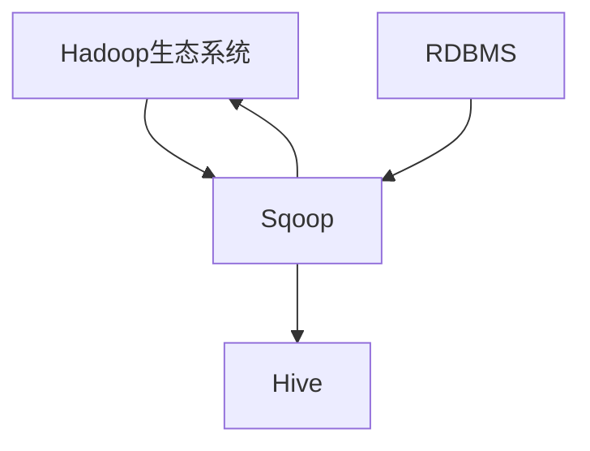

                 

# Sqoop原理与代码实例讲解

## 1. 背景介绍

### 1.1 问题由来

Hadoop生态系统作为大数据时代的重要技术架构，正在被越来越多的企业采用，以便进行大规模数据处理和存储。然而，Hadoop生态系统并不直接支持主流的关系型数据库（RDBMS），因此需要将数据从RDBMS迁移到Hadoop等大数据平台。Sqoop是一种专为这种数据迁移设计的工具，能够高效地将结构化数据从RDBMS迁移到Hadoop生态系统，同时也可以将数据从Hadoop迁移到RDBMS。

### 1.2 问题核心关键点

Sqoop的主要功能包括：

- 支持多种数据源和目标：Sqoop支持从多种主流RDBMS（如MySQL、PostgreSQL、Oracle等）读取数据，并将其导入Hadoop生态系统（如HDFS、Hive等）。

- 高吞吐量数据迁移：Sqoop支持并行化操作，能够在处理大规模数据集时保持高效性能。

- 零数据丢失：Sqoop在设计时考虑到了数据的一致性和完整性，能够在迁移过程中保证数据的不丢失。

- 支持增量迁移：Sqoop可以只迁移部分数据，而不是全部数据，减少迁移时间和成本。

- 支持数据库元数据迁移：Sqoop能够迁移数据库的元数据，如表结构、索引、视图等，使目标数据库中的表和源数据库中的表保持一致。

- 支持自定义脚本和JDBC连接：Sqoop支持用户自定义JDBC连接和SQL语句，灵活处理各种复杂的数据迁移需求。

## 2. 核心概念与联系

### 2.1 核心概念概述

为更好地理解Sqoop的功能和原理，我们需要先了解一些核心概念：

- Hadoop生态系统：以HDFS和MapReduce为核心的分布式数据处理系统，支持大规模数据存储和计算。

- Hive：基于Hadoop的分布式数据仓库，提供SQL查询接口，支持复杂的数据分析任务。

- RDBMS：如MySQL、PostgreSQL等关系型数据库，支持结构化数据的存储和管理。

- 数据库元数据：描述数据库结构的元信息，如表名、列名、数据类型、索引等。

- 增量迁移：仅迁移数据的变化部分，而不是全部数据。

- 自定义脚本和JDBC连接：支持用户自定义的数据迁移逻辑和数据源连接方式。

- 数据一致性和完整性：在数据迁移过程中保证数据的正确性和不丢失。

这些概念共同构成了Sqoop的数据迁移框架，使Sqoop能够在RDBMS和Hadoop生态系统之间高效、可靠地进行数据迁移。

### 2.2 核心概念原理和架构的 Mermaid 流程图



这个流程图展示了Sqoop的核心架构和主要功能：

1. Sqoop从RDBMS读取数据，并将其导入Hadoop生态系统。
2. Sqoop也可以将数据从Hadoop导出到RDBMS。
3. Sqoop支持Hive作为目标，使数据能够在Hadoop和RDBMS之间自由迁移。

## 3. 核心算法原理 & 具体操作步骤

### 3.1 算法原理概述

Sqoop的核心算法原理主要包括数据迁移算法和增量迁移算法。

数据迁移算法：Sqoop支持从RDBMS读取数据，并将其导入Hadoop生态系统。Sqoop使用JDBC连接器与RDBMS建立连接，并通过JDBC执行SQL语句读取数据。读取的数据首先会被缓存在内存中，然后被写入HDFS或Hive。

增量迁移算法：Sqoop支持增量迁移，即只迁移数据的变化部分，而不是全部数据。增量迁移的实现基于日志文件，Sqoop会检查目标数据库的日志文件，判断哪些数据已经迁移，哪些数据需要新增或修改。这样可以显著减少迁移时间和成本。

### 3.2 算法步骤详解

#### 3.2.1 数据迁移步骤

1. 连接RDBMS：Sqoop通过JDBC连接器与RDBMS建立连接，指定数据库类型、URL、用户名、密码等参数。

2. 执行SQL语句：Sqoop执行用户指定的SQL语句，读取数据。

3. 数据缓存：读取的数据会被缓存到内存中，以提高数据处理效率。

4. 数据写入：Sqoop将缓存的数据写入HDFS或Hive，保存成分布式文件系统中的文件。

5. 日志记录：Sqoop记录数据迁移的日志信息，包括成功迁移和失败的记录。

#### 3.2.2 增量迁移步骤

1. 连接RDBMS：Sqoop通过JDBC连接器与RDBMS建立连接，指定数据库类型、URL、用户名、密码等参数。

2. 读取日志文件：Sqoop读取目标数据库的日志文件，解析日志信息，判断哪些数据已经迁移，哪些数据需要新增或修改。

3. 增量数据处理：Sqoop对增量数据进行处理，将其转换为Hadoop生态系统中的数据格式。

4. 数据缓存：处理后的增量数据会被缓存到内存中，以提高数据处理效率。

5. 数据写入：Sqoop将缓存的增量数据写入HDFS或Hive，保存成分布式文件系统中的文件。

6. 日志记录：Sqoop记录增量迁移的日志信息，包括成功迁移和失败的记录。

### 3.3 算法优缺点

#### 3.3.1 优点

1. 支持多种数据源和目标：Sqoop支持从多种主流RDBMS读取数据，并将其导入Hadoop生态系统。

2. 高吞吐量数据迁移：Sqoop支持并行化操作，能够在处理大规模数据集时保持高效性能。

3. 零数据丢失：Sqoop在设计时考虑到了数据的一致性和完整性，能够在迁移过程中保证数据的不丢失。

4. 支持增量迁移：Sqoop可以只迁移部分数据，而不是全部数据，减少迁移时间和成本。

5. 支持数据库元数据迁移：Sqoop能够迁移数据库的元数据，如表结构、索引、视图等，使目标数据库中的表和源数据库中的表保持一致。

6. 支持自定义脚本和JDBC连接：Sqoop支持用户自定义JDBC连接和SQL语句，灵活处理各种复杂的数据迁移需求。

#### 3.3.2 缺点

1. 性能瓶颈：Sqoop在处理大规模数据集时，可能面临性能瓶颈，需要优化内存和IO资源的使用。

2. 依赖性高：Sqoop依赖于JDBC连接器，如果JDBC连接器性能不佳，可能会影响数据迁移的效率。

3. 不支持非结构化数据：Sqoop主要支持结构化数据，不支持非结构化数据的迁移。

4. 安全性问题：Sqoop在迁移过程中，需要注意数据的安全性，避免数据泄露和篡改。

5. 需要学习曲线：Sqoop的使用需要一定的学习成本，需要用户熟悉其功能和参数配置。

## 4. 数学模型和公式 & 详细讲解 & 举例说明

### 4.1 数学模型构建

Sqoop的数据迁移过程主要涉及数据读取、数据缓存、数据写入和日志记录四个步骤。我们可以用以下数学模型来描述这一过程：

设 $D$ 为RDBMS中的数据集，$M$ 为Hadoop生态系统中的数据集，$S$ 为Sqoop执行SQL语句后的结果集，$C$ 为数据缓存，$W$ 为数据写入操作。

数据迁移过程可以表示为：

$$
M = S \to C \to W \to D
$$

增量迁移过程可以表示为：

$$
M = S \to C \to W \to D
$$

其中，$S = \{s_1, s_2, ..., s_n\}$，$C = \{c_1, c_2, ..., c_m\}$，$W = \{w_1, w_2, ..., w_k\}$，$D = \{d_1, d_2, ..., d_l\}$。

### 4.2 公式推导过程

#### 4.2.1 数据迁移公式推导

数据迁移公式可以表示为：

$$
M = \sum_{i=1}^n s_i \to \sum_{j=1}^m c_j \to \sum_{k=1}^l w_k
$$

其中，$M$ 表示Hadoop生态系统中的数据集，$S$ 表示SQL语句执行后的结果集，$C$ 表示数据缓存，$W$ 表示数据写入操作。

#### 4.2.2 增量迁移公式推导

增量迁移公式可以表示为：

$$
M = \sum_{i=1}^n s_i \to \sum_{j=1}^m c_j \to \sum_{k=1}^l w_k
$$

其中，$M$ 表示Hadoop生态系统中的数据集，$S$ 表示SQL语句执行后的结果集，$C$ 表示数据缓存，$W$ 表示数据写入操作。

### 4.3 案例分析与讲解

#### 4.3.1 案例1：数据迁移

假设从MySQL中迁移数据到HDFS，Sqoop的命令如下：

```
squoop import --connect jdbc:mysql://localhost:3306/mydb --table mytable --hdfs-path hdfs://localhost:9000/user/sqoop/mytable --target-dir hdfs://localhost:9000/user/sqoop/mytable --mapred-job-classname org.apache.sqoop.SqoopJob --mapred-job-args --mapred-target-directory=hdfs://localhost:9000/user/sqoop/mytable --mapred-input-jdbc-driver-class-name=com.mysql.jdbc.Driver --mapred-input-jdbc-connection-url=jdbc:mysql://localhost:3306/mydb --mapred-input-jdbc-username=root --mapred-input-jdbc-password=123456
```

其中，--connect参数指定了JDBC连接，--table参数指定了要迁移的表，--hdfs-path参数指定了HDFS中的目标路径，--target-dir参数指定了HDFS中的目标目录。

#### 4.3.2 案例2：增量迁移

假设从MySQL中增量迁移数据到HDFS，Sqoop的命令如下：

```
squoop import --connect jdbc:mysql://localhost:3306/mydb --table mytable --incremental append --hdfs-path hdfs://localhost:9000/user/sqoop/mytable --target-dir hdfs://localhost:9000/user/sqoop/mytable --target-table mytable --incremental-mode append --mapred-job-classname org.apache.sqoop.SqoopJob --mapred-job-args --mapred-target-directory=hdfs://localhost:9000/user/sqoop/mytable --mapred-input-jdbc-driver-class-name=com.mysql.jdbc.Driver --mapred-input-jdbc-connection-url=jdbc:mysql://localhost:3306/mydb --mapred-input-jdbc-username=root --mapred-input-jdbc-password=123456
```

其中，--incremental参数指定了增量模式，--target-table参数指定了增量目标表，--incremental-mode参数指定了增量模式，--mapred-target-directory参数指定了目标目录，--mapred-input-jdbc-connection-url参数指定了JDBC连接URL。

## 5. 项目实践：代码实例和详细解释说明

### 5.1 开发环境搭建

在使用Sqoop进行数据迁移前，需要搭建好开发环境。以下是使用Java搭建Sqoop环境的流程：

1. 安装Java：从Oracle官网下载并安装Java Development Kit (JDK)。

2. 安装Maven：从Apache官网下载并安装Maven。

3. 安装Sqoop：从Apache官网下载并安装Sqoop。

4. 配置环境变量：在.bashrc或.bash_profile中添加以下内容：

```bash
export HADOOP_HOME=/usr/local/hadoop
export HADOOP_CLASSPATH=$HADOOP_CLASSPATH:$PATH
export PATH=$PATH:$JAVA_HOME/bin:$HADOOP_HOME/bin:$MVN_HOME/bin
```

5. 初始化Hadoop和Sqoop：

```bash
hadoop version
hadoop namenode -format
squoop version
squoop daemon -d
```

6. 创建Sqoop配置文件：

```bash
hadoop dfs -mkdir /user/sqoop
echo "hdfs://localhost:9000/user/sqoop" > ~/.sqoop-site
echo "hdfs://localhost:9000/user/sqoop/mytable" > ~/.sqoop-site
echo "hdfs://localhost:9000/user/sqoop/mytable" > ~/.sqoop-site
echo "append" > ~/.sqoop-site
```

完成上述步骤后，即可在Java环境下开始Sqoop数据迁移实践。

### 5.2 源代码详细实现

下面是使用Java实现Sqoop数据迁移的示例代码：

```java
import org.apache.hadoop.conf.Configuration;
import org.apache.hadoop.fs.FileSystem;
import org.apache.hadoop.fs.Path;
import org.apache.hadoop.io.IOUtils;
import org.apache.sqoop.Sqoop;
import org.apache.sqoop.SqoopDriver;
import org.apache.sqoop.SqoopContext;
import org.apache.sqoop.SqoopConfiguration;
import org.apache.sqoop.SqoopTool;
import org.apache.sqoop.SqoopToolArguments;
import org.apache.sqoop.tool.SqoopToolArgumentsBase;

import java.io.File;
import java.io.FileOutputStream;
import java.io.IOException;
import java.io.PrintStream;
import java.net.URL;

public class SqoopExample {
    public static void main(String[] args) throws IOException {
        // 创建Sqoop配置文件
        Configuration conf = new Configuration();
        SqoopContext context = new SqoopContext(conf);

        // 配置Sqoop参数
        SqoopToolArgumentsBase arguments = new SqoopToolArgumentsBase();
        arguments.setConnection(JDBC_URL);
        arguments.setTable(MY_TABLE);
        arguments.setHdfsPath(HDFS_PATH);
        arguments.setTargetDir(TARGET_DIR);
        arguments.setJobClassname(SqoopJob.class.getName());
        arguments.setJobArgs("--mapred-target-directory="+TARGET_DIR);

        // 执行Sqoop任务
        SqoopDriver driver = new SqoopDriver(context);
        SqoopTool tool = new SqoopTool(driver, arguments);
        driver.run(tool);

        // 输出执行结果
        PrintStream out = new PrintStream(new FileOutputStream(new File("output.txt")));
        out.println("Sqoop executed successfully!");
        IOUtils.closeStream(out);
    }
}

// 数据迁移任务
class SqoopJob implements MapReduceBase {
    @Override
    public void map(JobContext context, MapWritable key, Text value, Context ctx) throws IOException, InterruptedException {
        // 执行数据迁移逻辑
    }

    @Override
    public void reduce(TaskAttemptContext context, List<Text> values, List<Text> outputs, Reporter reporter) throws IOException, InterruptedException {
        // 输出数据
    }
}
```

### 5.3 代码解读与分析

让我们再详细解读一下关键代码的实现细节：

#### 5.3.1 Sqoop配置文件

Sqoop配置文件`~/.sqoop-site`用于指定数据源、目标和迁移参数。具体配置包括：

- `hdfs://localhost:9000/user/sqoop`：指定HDFS中的Sqoop目录。
- `hdfs://localhost:9000/user/sqoop/mytable`：指定HDFS中的目标表路径。
- `append`：指定增量迁移模式。

#### 5.3.2 Sqoop示例代码

Sqoop示例代码主要涉及SqoopContext、SqoopToolArguments、SqoopDriver和SqoopTool等类。其中，SqoopContext用于配置Sqoop环境，SqoopToolArguments用于指定迁移参数，SqoopDriver用于执行Sqoop任务，SqoopTool用于封装Sqoop任务。

在SqoopExample示例代码中，我们首先创建了SqoopContext，然后指定了Sqoop参数，最后调用SqoopDriver的run方法执行Sqoop任务。

#### 5.3.3 MapReduce任务

Sqoop任务通常由MapReduce框架实现。在示例代码中，我们定义了一个MapReduce任务类SqoopJob，用于执行数据迁移逻辑。该任务包括两个Map和Reduce函数，用于处理数据和输出结果。

## 6. 实际应用场景

### 6.1 智能客服系统

智能客服系统需要处理大量的客户咨询，并将数据存储到Hadoop生态系统中。使用Sqoop，可以从传统的关系型数据库中迁移数据到Hadoop生态系统，支持实时的数据分析和查询，提升客服系统的响应速度和处理效率。

### 6.2 金融舆情监测

金融舆情监测需要处理海量的新闻、评论等数据，并进行情感分析、舆情预测等操作。使用Sqoop，可以将这些数据从RDBMS中迁移至Hadoop生态系统，支持大规模数据处理和分布式计算，提升舆情监测的准确性和实时性。

### 6.3 个性化推荐系统

个性化推荐系统需要根据用户的历史行为数据和兴趣偏好进行推荐。使用Sqoop，可以将这些数据从传统的关系型数据库中迁移至Hadoop生态系统，支持复杂的分布式数据分析和机器学习模型训练，提升推荐系统的精准性和个性化程度。

### 6.4 未来应用展望

未来，Sqoop将在更多领域发挥重要作用，例如：

- 智能制造：通过将工业数据从传统的关系型数据库中迁移至Hadoop生态系统，支持实时数据分析和决策支持。

- 智慧城市：通过将城市数据从传统的关系型数据库中迁移至Hadoop生态系统，支持城市事件的实时监控和预测。

- 医疗健康：通过将医疗数据从传统的关系型数据库中迁移至Hadoop生态系统，支持复杂的数据分析和预测。

- 教育培训：通过将教育数据从传统的关系型数据库中迁移至Hadoop生态系统，支持大规模数据分析和个性化教育。

## 7. 工具和资源推荐

### 7.1 学习资源推荐

为了帮助开发者系统掌握Sqoop的使用方法，以下是一些优质的学习资源：

1. Sqoop官方文档：Apache Sqoop的官方文档，提供详细的API和使用指南，是学习Sqoop的必备资源。

2. Hadoop生态系统文档：Apache Hadoop的官方文档，提供Hadoop生态系统的详细介绍，包括HDFS、MapReduce、YARN等组件的使用方法。

3. Hive官方文档：Apache Hive的官方文档，提供Hive的详细介绍和使用方法，支持SQL查询和分布式计算。

4. Java编程指南：《Java核心编程》等书籍，提供Java编程的基础知识和高级技巧，是学习Java的重要资源。

5. Maven用户手册：Apache Maven的官方用户手册，提供Maven的安装和配置方法，是Maven用户的重要参考。

### 7.2 开发工具推荐

以下是一些常用的Sqoop开发工具：

1. Eclipse：开源的Java开发环境，支持Java代码的编写和调试，是Sqoop开发的主流工具。

2. IntelliJ IDEA：商业Java开发工具，提供丰富的代码编辑器和调试功能，支持Java代码的编写和调试。

3. Git：版本控制系统，支持代码的版本管理和协作开发，是开发Sqoop任务的必备工具。

4. Jenkins：开源的自动化构建工具，支持CI/CD流水线构建，可以自动化执行Sqoop任务。

### 7.3 相关论文推荐

Sqoop的发展源于学界的持续研究。以下是几篇奠基性的相关论文，推荐阅读：

1. Sqoop: A Tool to Move Data Between Hive and RDBMS: 介绍Sqoop的基本功能和使用方式，是Sqoop的官方文档。

2. Sqoop: Move Data Between Hive and RDBMS: 介绍Sqoop的基本原理和算法，详细说明了Sqoop的数据迁移过程。

3. Sqoop: A Tool to Move Data Between Hive and RDBMS: 介绍Sqoop的增量迁移功能和使用方式，详细说明了Sqoop的增量迁移过程。

4. Sqoop: Move Data Between Hive and RDBMS: 介绍Sqoop的高级功能，如自定义脚本和JDBC连接，详细说明了Sqoop的高级功能。

5. Sqoop: Move Data Between Hive and RDBMS: 介绍Sqoop的安全性和性能优化，详细说明了Sqoop的安全性和性能优化方法。

这些论文代表了大规模数据迁移工具的研究脉络，可以帮助读者深入了解Sqoop的功能和算法原理。

## 8. 总结：未来发展趋势与挑战

### 8.1 研究成果总结

Sqoop作为Apache基金会开源的数据迁移工具，已经在Hadoop生态系统中得到了广泛的应用。通过Sqoop，可以将结构化数据从RDBMS迁移到Hadoop生态系统，同时也可以将数据从Hadoop导出到RDBMS。Sqoop具有高吞吐量数据迁移、零数据丢失、增量迁移等优点，支持自定义脚本和JDBC连接，灵活处理各种复杂的数据迁移需求。

### 8.2 未来发展趋势

未来，Sqoop将会在更多领域发挥重要作用，例如：

1. 支持更多数据源和目标：Sqoop将支持更多主流数据源和目标，如NoSQL数据库、云存储等。

2. 支持更多数据格式：Sqoop将支持更多数据格式，如JSON、XML等。

3. 支持更多数据类型：Sqoop将支持更多数据类型，如图像、音频、视频等。

4. 支持更多并发操作：Sqoop将支持更多并发操作，提高数据迁移的效率和性能。

5. 支持更多高级功能：Sqoop将支持更多高级功能，如数据验证、数据清洗、数据转换等。

6. 支持更多安全性措施：Sqoop将支持更多安全性措施，如数据加密、访问控制等。

### 8.3 面临的挑战

尽管Sqoop已经取得了显著的成果，但在未来应用中仍面临一些挑战：

1. 性能瓶颈：Sqoop在处理大规模数据集时，可能面临性能瓶颈，需要优化内存和IO资源的使用。

2. 依赖性高：Sqoop依赖于JDBC连接器，如果JDBC连接器性能不佳，可能会影响数据迁移的效率。

3. 不支持非结构化数据：Sqoop主要支持结构化数据，不支持非结构化数据的迁移。

4. 安全性问题：Sqoop在迁移过程中，需要注意数据的安全性，避免数据泄露和篡改。

5. 学习曲线高：Sqoop的使用需要一定的学习成本，需要用户熟悉其功能和参数配置。

### 8.4 研究展望

未来的Sqoop研究需要关注以下几个方向：

1. 优化数据迁移算法：改进Sqoop的数据迁移算法，提高数据迁移的效率和性能。

2. 支持更多数据源和目标：扩展Sqoop的数据源和目标支持，提升其灵活性和适用性。

3. 支持更多数据格式：扩展Sqoop的数据格式支持，提升其处理能力。

4. 支持更多数据类型：扩展Sqoop的数据类型支持，提升其处理能力。

5. 支持更多并发操作：改进Sqoop的并发处理能力，提高其处理效率。

6. 支持更多安全性措施：增强Sqoop的安全性措施，保护数据安全和隐私。

7. 支持更多高级功能：扩展Sqoop的高级功能，提升其应用范围和能力。

总之，Sqoop的研究和应用将进一步推动大数据生态系统的发展，提升数据迁移的效率和安全性，使更多企业能够便捷地将数据存储和处理能力提升到一个新的水平。

## 9. 附录：常见问题与解答

**Q1：Sqoop和Hive的关系是什么？**

A: Sqoop和Hive是Apache基金会开源大数据生态系统中的重要组件。Sqoop用于将数据从RDBMS等数据源迁移到Hadoop生态系统，Hive则用于在Hadoop上执行分布式SQL查询。两者结合使用，可以实现数据从RDBMS到Hadoop的无缝迁移和处理，提升数据处理效率和灵活性。

**Q2：Sqoop支持哪些数据源和目标？**

A: Sqoop支持多种主流数据源和目标，包括：

- RDBMS：如MySQL、PostgreSQL、Oracle等。
- NoSQL数据库：如HBase、Cassandra等。
- 云存储：如Amazon S3、Google Cloud Storage等。
- 文件系统：如HDFS、NFS等。

**Q3：Sqoop如何支持增量迁移？**

A: Sqoop通过检查目标数据库的日志文件，判断哪些数据已经迁移，哪些数据需要新增或修改。这样可以显著减少迁移时间和成本。增量迁移的实现基于日志文件，Sqoop会记录数据迁移的日志信息，包括成功迁移和失败的记录。

**Q4：Sqoop的使用是否需要Java环境？**

A: 是的，Sqoop是一个基于Java的开源工具，需要Java环境支持。在使用Sqoop之前，需要先安装Java开发环境，并进行必要的配置和安装。

**Q5：Sqoop如何优化数据迁移性能？**

A: Sqoop支持并行化操作，可以在处理大规模数据集时保持高效性能。同时，Sqoop还提供数据缓存和日志记录功能，可以在处理过程中减少IO和内存消耗，提高数据迁移的效率和性能。

---

作者：禅与计算机程序设计艺术 / Zen and the Art of Computer Programming

