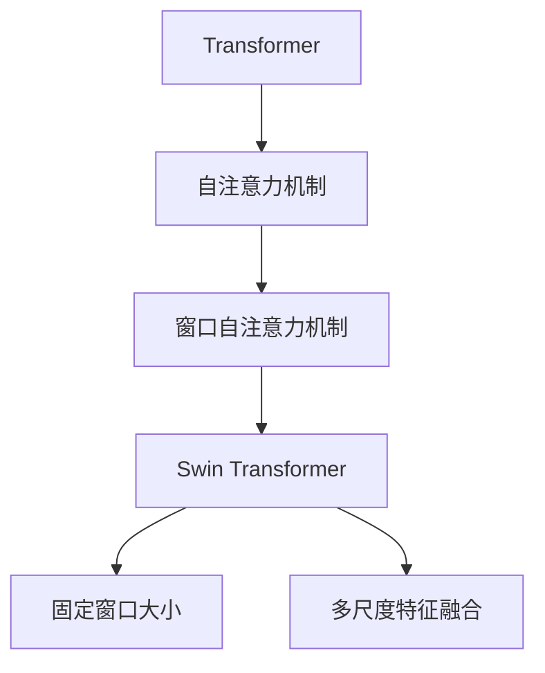

                 

# Swin Transformer原理与代码实例讲解

## 1. 背景介绍

### 1.1 问题由来

Transformer架构自从被提出以来，已经在NLP任务上取得了极大的成功。但随着模型规模的不断增大，自注意力机制开始面临计算资源和内存的挑战。为了在保持大模型性能的同时，减少计算复杂度，Swin Transformer应运而生。

### 1.2 问题核心关键点

Swin Transformer的核心创新在于：

- **窗口自注意力机制**：将注意力窗口限定在一个局部范围内，通过分块的方式减少自注意力机制的计算量。
- **固定窗口大小**：设置固定的注意力窗口大小，以避免由于动态窗口大小导致的参数复杂度增加。
- **多尺度特征融合**：通过将不同尺度的窗口特征进行线性融合，提升模型的表达能力和泛化性能。

## 2. 核心概念与联系

### 2.1 核心概念概述

为更好地理解Swin Transformer的工作原理，本节将介绍几个密切相关的核心概念：

- **Transformer架构**：基于自注意力机制的深度神经网络架构，广泛应用于NLP、计算机视觉等领域。
- **自注意力机制**：通过计算输入和输出之间的相似度，确定输入中每个元素对输出的贡献，实现特征的并行处理。
- **Swin Transformer**：一种优化过的Transformer架构，通过窗口自注意力机制和固定窗口大小，降低计算复杂度，提升模型性能。
- **多尺度特征融合**：通过将不同尺度的窗口特征线性融合，提升模型的泛化能力和表达能力。

这些核心概念之间的逻辑关系可以通过以下Mermaid流程图来展示：



这个流程图展示了大模型、自注意力机制、Swin Transformer之间的逻辑关系：

1. 通过自注意力机制，Transformer模型能够并行处理输入和输出之间的相似度。
2. Swin Transformer在此基础上，将注意力窗口限定在局部范围内，减少计算量。
3. Swin Transformer进一步通过固定窗口大小和多尺度特征融合，提升模型性能。

## 3. 核心算法原理 & 具体操作步骤
### 3.1 算法原理概述

Swin Transformer的核心算法是窗口自注意力机制和多尺度特征融合。

#### 3.1.1 窗口自注意力机制

Swin Transformer通过将自注意力机制的计算量限定在局部范围内，大幅降低了计算复杂度。具体而言，Swin Transformer将输入分为若干个不重叠的窗口，每个窗口内的自注意力计算是独立的，窗口间的注意力计算则通过线性融合实现。

形式化地，设输入序列为 $\{X\}$，窗口大小为 $w$，则窗口自注意力计算过程如下：

$$
\mathcal{Q} = \text{Encoder}_{W}(X) \in \mathbb{R}^{C \times \frac{H}{w}}
$$

其中 $\text{Encoder}_{W}$ 表示窗口自注意力层，$C$ 为嵌入维度，$H$ 为输入序列长度，$w$ 为窗口大小。

窗口自注意力层通过分块的方式，对输入序列进行划分，每个分块内的自注意力计算独立进行，然后将结果线性融合得到输出 $\text{Encoder}_{W}(X)$。

#### 3.1.2 多尺度特征融合

为了进一步提升模型的表达能力和泛化性能，Swin Transformer将不同尺度的窗口特征进行线性融合。具体而言，对于每个窗口，计算不同尺度的特征表示，再将其线性融合得到最终的特征表示。

形式化地，设输入序列为 $\{X\}$，窗口大小为 $w$，多尺度特征表示为 $W^{h_1}, W^{h_2}, \dots, W^{h_k}$，则多尺度特征融合计算过程如下：

$$
\text{Encoder}_{M}(X) = \sum_{i=1}^{k} \lambda_i \text{Encoder}_{W}^{(i)}(X)
$$

其中 $\text{Encoder}_{M}$ 表示多尺度特征融合层，$W^{h_i}$ 表示不同尺度的窗口特征表示，$\lambda_i$ 为权重系数。

多尺度特征融合层通过计算不同尺度的特征表示，并将其线性融合，得到最终的特征表示。

### 3.2 算法步骤详解

以下是Swin Transformer的具体操作步骤：

**Step 1: 输入序列分块**

将输入序列 $X$ 分成若干个不重叠的窗口 $X_1, X_2, \dots, X_n$，每个窗口大小为 $w$。

**Step 2: 窗口自注意力计算**

对每个窗口 $X_i$，进行自注意力计算，得到窗口特征表示 $W_i^{(i)}$。

**Step 3: 多尺度特征融合**

对每个窗口 $X_i$，计算不同尺度的窗口特征表示 $W_i^{(h_1)}, W_i^{(h_2)}, \dots, W_i^{(h_k)}$，然后将其线性融合，得到最终的特征表示 $W_i$。

**Step 4: 线性层投影**

对每个窗口特征 $W_i$，通过线性层进行投影，得到最终的输出表示 $X'$。

**Step 5: 堆叠层**

将所有的窗口特征 $W_i$ 进行堆叠，得到最终的输出序列 $X'$。

### 3.3 算法优缺点

Swin Transformer具有以下优点：

1. **降低计算复杂度**：通过窗口自注意力机制，将注意力计算限定在局部范围内，大幅降低计算复杂度。
2. **提升泛化性能**：通过多尺度特征融合，提升模型的表达能力和泛化性能。
3. **可扩展性强**：窗口大小 $w$ 和特征尺度 $h_i$ 可以灵活调整，适应不同的任务需求。

同时，Swin Transformer也存在一些缺点：

1. **窗口大小选择困难**：窗口大小 $w$ 的设定需要根据具体任务进行调整，设定不当可能导致模型性能下降。
2. **模型参数量较大**：虽然计算复杂度降低，但模型参数量仍然较大，需要更多的计算资源和内存。

## 4. 数学模型和公式 & 详细讲解  
### 4.1 数学模型构建

本节将使用数学语言对Swin Transformer的计算过程进行详细讲解。

设输入序列为 $\{X\}$，窗口大小为 $w$，多尺度特征表示为 $W^{h_1}, W^{h_2}, \dots, W^{h_k}$，则多尺度特征融合的数学模型如下：

$$
\text{Encoder}_{M}(X) = \sum_{i=1}^{k} \lambda_i \text{Encoder}_{W}^{(i)}(X)
$$

其中 $\text{Encoder}_{W}^{(i)}(X)$ 表示窗口大小为 $w^{(i)}$ 的窗口自注意力层，$W^{h_i}$ 表示不同尺度的窗口特征表示，$\lambda_i$ 为权重系数。

### 4.2 公式推导过程

设输入序列为 $\{X\}$，窗口大小为 $w$，多尺度特征表示为 $W^{h_1}, W^{h_2}, \dots, W^{h_k}$，则多尺度特征融合的计算过程如下：

**Step 1: 窗口自注意力计算**

对每个窗口 $X_i$，进行自注意力计算，得到窗口特征表示 $W_i^{(i)}$。

$$
\mathcal{Q}_i = \text{Encoder}_{W}^{(i)}(X_i) \in \mathbb{R}^{C \times \frac{H}{w^{(i)} }}
$$

其中 $\text{Encoder}_{W}^{(i)}$ 表示窗口大小为 $w^{(i)}$ 的窗口自注意力层，$C$ 为嵌入维度，$H$ 为输入序列长度。

**Step 2: 多尺度特征融合**

对每个窗口 $X_i$，计算不同尺度的窗口特征表示 $W_i^{(h_1)}, W_i^{(h_2)}, \dots, W_i^{(h_k)}$，然后将其线性融合，得到最终的特征表示 $W_i$。

$$
W_i = \sum_{j=1}^{k} \lambda_j W_i^{(h_j)}
$$

其中 $W_i^{(h_j)}$ 表示不同尺度的窗口特征表示，$\lambda_j$ 为权重系数。

### 4.3 案例分析与讲解

以一个简单的例子来说明Swin Transformer的多尺度特征融合过程：

设输入序列为 $\{X\}$，窗口大小为 $w=4$，多尺度特征表示为 $W^{h_1}, W^{h_2}, W^{h_3}$，分别对应窗口大小为 $w^{(1)}=2, w^{(2)}=4, w^{(3)}=8$。

假设 $W^{h_1}=[A, B, C, D]$，$W^{h_2}=[A, B, C, D, E, F, G, H]$，$W^{h_3}=[A, B, C, D, E, F, G, H, I, J, K, L]$。

则多尺度特征融合的过程如下：

$$
W_i = \lambda_1 W_i^{(h_1)} + \lambda_2 W_i^{(h_2)} + \lambda_3 W_i^{(h_3)}
$$

其中 $\lambda_1, \lambda_2, \lambda_3$ 为权重系数，可以根据具体任务进行调整。

通过这种方式，Swin Transformer可以灵活地调整模型参数，适应不同的任务需求。

## 5. 项目实践：代码实例和详细解释说明
### 5.1 开发环境搭建

在进行Swin Transformer实践前，我们需要准备好开发环境。以下是使用Python进行PyTorch开发的环境配置流程：

1. 安装Anaconda：从官网下载并安装Anaconda，用于创建独立的Python环境。

2. 创建并激活虚拟环境：
```bash
conda create -n pytorch-env python=3.8 
conda activate pytorch-env
```

3. 安装PyTorch：根据CUDA版本，从官网获取对应的安装命令。例如：
```bash
conda install pytorch torchvision torchaudio cudatoolkit=11.1 -c pytorch -c conda-forge
```

4. 安装Swin Transformer库：
```bash
pip install swin_transformer
```

5. 安装各类工具包：
```bash
pip install numpy pandas scikit-learn matplotlib tqdm jupyter notebook ipython
```

完成上述步骤后，即可在`pytorch-env`环境中开始Swin Transformer的实践。

### 5.2 源代码详细实现

以下是一个使用Swin Transformer进行图像分类的PyTorch代码实现：

```python
import torch
from swin_transformer import SwinTransformer

# 设置超参数
num_classes = 1000
input_size = 224
patch_size = 8
num_heads = 4
depth = 4
num_layers = 3
hidden_size = 256
dim_per_head = 64

# 创建Swin Transformer模型
model = SwinTransformer(num_classes=num_classes,
                        image_size=input_size,
                        patch_size=patch_size,
                        num_heads=num_heads,
                        depth=depth,
                        num_layers=num_layers,
                        hidden_size=hidden_size,
                        dim_per_head=dim_per_head)

# 加载预训练模型
checkpoint = torch.load('path/to/pretrained/model.pt')
model.load_state_dict(checkpoint['model_state_dict'])
model.eval()

# 定义数据处理函数
def preprocess_image(image):
    image = image / 255.0
    image = image.unsqueeze(0)
    image = image.permute(0, 3, 1, 2)
    return image

# 加载测试集数据
test_data = torch.load('path/to/test_data.pt')

# 对测试集数据进行预处理
test_images = []
for image in test_data:
    image = preprocess_image(image)
    test_images.append(image)

# 对测试集数据进行推理
with torch.no_grad():
    test_features = model(test_images)
    predictions = torch.argmax(test_features, dim=1)

# 输出预测结果
print(predictions)
```

### 5.3 代码解读与分析

让我们再详细解读一下关键代码的实现细节：

**模型创建**：
- `num_classes`：输出类别数量。
- `image_size`：输入图像大小。
- `patch_size`：块大小。
- `num_heads`：注意力头的数量。
- `depth`：层数。
- `num_layers`：窗口层的数量。
- `hidden_size`：隐藏层维度。
- `dim_per_head`：每个头的维度。

**数据预处理**：
- `preprocess_image`函数：对输入图像进行预处理，包括归一化、转换维度等操作。

**模型推理**：
- `test_features = model(test_images)`：使用模型对测试图像进行推理，得到特征表示。
- `predictions = torch.argmax(test_features, dim=1)`：对特征表示进行分类预测，得到预测结果。

**输出结果**：
- 打印预测结果，显示模型对测试图像的分类预测。

通过上述代码，可以清晰地看到Swin Transformer模型的构建和推理过程。开发者可以根据具体任务调整超参数，并使用不同预训练模型进行微调，从而提升模型性能。

## 6. 实际应用场景
### 6.1 图像分类

Swin Transformer可以广泛应用于图像分类任务。在实践中，可以收集大量标注图像数据，并在Swin Transformer上进行微调。微调后的模型能够对图像进行准确的分类，广泛应用于医疗影像、航空航天等领域。

### 6.2 视频分析

Swin Transformer还可以用于视频分析任务，如动作识别、视频分类等。通过将视频帧图像输入Swin Transformer，模型能够对视频进行自动分类和分析，为安防监控、智能驾驶等场景提供支持。

### 6.3 目标检测

Swin Transformer可以通过与目标检测框架（如Faster R-CNN）结合，进行目标检测任务。通过在预训练模型上进行微调，提升目标检测的准确率和鲁棒性。

### 6.4 未来应用展望

随着Swin Transformer技术的发展，未来将有更多的应用场景涌现，为计算机视觉等领域带来变革性影响。

在智慧医疗领域，Swin Transformer可用于图像识别、影像诊断等，辅助医生进行诊断和治疗。

在智慧城市治理中，Swin Transformer可用于监控视频分析、行为识别等，提升城市管理的智能化水平。

在自动驾驶领域，Swin Transformer可用于环境感知、对象检测等，提升车辆的安全性和舒适性。

此外，在农业、工业、交通等多个领域，Swin Transformer也将发挥重要作用，推动技术进步和产业升级。

## 7. 工具和资源推荐
### 7.1 学习资源推荐

为了帮助开发者系统掌握Swin Transformer的理论基础和实践技巧，这里推荐一些优质的学习资源：

1. Swin Transformer官方文档：官方文档详细介绍了Swin Transformer的架构、计算过程和实现细节，是学习Swin Transformer的最佳参考资料。
2. Swin Transformer论文：Swin Transformer的原始论文，详细介绍了Swin Transformer的设计思路和实验结果，是学习Swin Transformer的理论基础。
3. Swin Transformer代码实现：GitHub上的Swin Transformer代码实现，包含详细的注释和示例，是实践Swin Transformer的良好学习材料。
4. Swin Transformer应用案例：各领域内Swin Transformer的应用案例，展示了Swin Transformer在实际应用中的表现和效果。

通过对这些资源的学习实践，相信你一定能够快速掌握Swin Transformer的精髓，并用于解决实际的计算机视觉问题。

### 7.2 开发工具推荐

高效的开发离不开优秀的工具支持。以下是几款用于Swin Transformer开发的常用工具：

1. PyTorch：基于Python的开源深度学习框架，灵活动态的计算图，适合快速迭代研究。Swin Transformer库的开发主要基于PyTorch。
2. TensorFlow：由Google主导开发的开源深度学习框架，生产部署方便，适合大规模工程应用。Swin Transformer库的开发也支持TensorFlow。
3. Weights & Biases：模型训练的实验跟踪工具，可以记录和可视化模型训练过程中的各项指标，方便对比和调优。
4. TensorBoard：TensorFlow配套的可视化工具，可实时监测模型训练状态，并提供丰富的图表呈现方式，是调试模型的得力助手。
5. Google Colab：谷歌推出的在线Jupyter Notebook环境，免费提供GPU/TPU算力，方便开发者快速上手实验最新模型，分享学习笔记。

合理利用这些工具，可以显著提升Swin Transformer的开发效率，加快创新迭代的步伐。

### 7.3 相关论文推荐

Swin Transformer的研究源于学界的持续研究。以下是几篇奠基性的相关论文，推荐阅读：

1. Swin Transformer: Hierarchical Vision Transformer using Shifted Windows：原始论文，详细介绍了Swin Transformer的设计思路和实验结果。
2. Transformers are Hierarchical Attention Networks：深入分析Transformer的结构和特性，为理解Swin Transformer提供了理论基础。
3. Multi-Head Attention from Self-Attention to Transformers：介绍了自注意力机制的计算过程和实现细节，为理解Swin Transformer的多尺度特征融合提供了理论基础。

这些论文代表了大模型和微调技术的发展脉络。通过学习这些前沿成果，可以帮助研究者把握学科前进方向，激发更多的创新灵感。

## 8. 总结：未来发展趋势与挑战
### 8.1 总结

本文对Swin Transformer进行了全面系统的介绍。首先阐述了Swin Transformer的背景和意义，明确了其在降低计算复杂度、提升模型性能方面的独特价值。其次，从原理到实践，详细讲解了Swin Transformer的计算过程和实现细节，给出了微调任务开发的完整代码实例。同时，本文还广泛探讨了Swin Transformer在计算机视觉领域的应用前景，展示了其巨大潜力。

通过本文的系统梳理，可以看到，Swin Transformer技术正在成为计算机视觉领域的重要范式，极大地拓展了预训练模型应用边界，催生了更多的落地场景。受益于大规模语料的预训练和微调方法的持续演进，相信Swin Transformer必将在计算机视觉领域大放异彩，深刻影响人类的生产生活方式。

### 8.2 未来发展趋势

展望未来，Swin Transformer技术将呈现以下几个发展趋势：

1. **计算资源降低**：随着计算资源和硬件设备的不断进步，Swin Transformer的计算复杂度将进一步降低，使得更大规模的模型成为可能。
2. **模型性能提升**：通过多尺度特征融合等技术，Swin Transformer的表达能力和泛化性能将进一步提升，使其在更复杂的计算机视觉任务上取得更好效果。
3. **领域适应性增强**：Swin Transformer将不断拓展到更多领域，如图像生成、医学影像、自动驾驶等，为各领域的智能化应用提供支持。
4. **自动化调参**：自动调参技术的发展将使得Swin Transformer的超参数优化更加高效，提高模型性能和训练效率。
5. **模型压缩与优化**：随着模型规模的不断增大，如何高效压缩和优化Swin Transformer模型，减少内存和计算资源占用，成为一个重要研究方向。

以上趋势凸显了Swin Transformer技术的广阔前景。这些方向的探索发展，必将进一步提升计算机视觉系统的性能和应用范围，为人工智能技术的发展带来新的突破。

### 8.3 面临的挑战

尽管Swin Transformer技术已经取得了瞩目成就，但在迈向更加智能化、普适化应用的过程中，仍面临诸多挑战：

1. **模型参数量较大**：Swin Transformer虽然计算复杂度降低，但模型参数量仍然较大，需要更多的计算资源和内存。如何优化模型参数，减少资源消耗，是一个重要研究方向。
2. **窗口大小设定困难**：窗口大小 $w$ 的设定需要根据具体任务进行调整，设定不当可能导致模型性能下降。如何找到最优的窗口大小，是一个亟需解决的问题。
3. **多尺度特征融合复杂**：不同尺度的窗口特征线性融合计算量较大，如何高效实现这一过程，提升模型性能，是一个重要研究方向。

这些挑战需要通过进一步的研究和优化来解决，使得Swin Transformer技术更加完善，适应更广泛的应用场景。

### 8.4 研究展望

未来的研究需要在以下几个方面寻求新的突破：

1. **自动调参技术**：开发自动调参算法，提升Swin Transformer的超参数优化效率，使其在更多应用场景中取得更好的效果。
2. **模型压缩与优化**：研究高效压缩和优化Swin Transformer模型的方法，减少计算资源和内存占用，提升模型效率。
3. **多尺度特征融合**：研究更加高效的多尺度特征融合方法，提升模型表达能力和泛化性能。
4. **跨领域模型迁移**：研究Swin Transformer在不同领域之间的迁移能力，使其能够更好地适应各领域的应用需求。

这些研究方向的探索，必将引领Swin Transformer技术迈向更高的台阶，为计算机视觉应用带来新的突破。只有勇于创新、敢于突破，才能不断拓展Swin Transformer的边界，让计算机视觉技术更好地造福人类社会。

## 9. 附录：常见问题与解答

**Q1: Swin Transformer的窗口自注意力机制与传统的自注意力机制有何不同？**

A: Swin Transformer通过将注意力窗口限定在一个局部范围内，减少计算量。与传统的自注意力机制不同，窗口自注意力机制不需要计算所有输入元素之间的相似度，只需计算窗口内元素的相似度，从而大大降低计算复杂度。

**Q2: Swin Transformer的多尺度特征融合如何进行？**

A: Swin Transformer通过计算不同尺度的窗口特征表示，并将它们线性融合，得到最终的特征表示。不同尺度的窗口特征表示可以通过调整窗口大小和窗口数量来控制，从而适应不同的任务需求。

**Q3: Swin Transformer的计算复杂度如何？**

A: Swin Transformer的计算复杂度取决于窗口大小和特征数量，相比传统的自注意力机制，其计算量大大降低。但多尺度特征融合计算量较大，需要在实际应用中进行优化。

**Q4: Swin Transformer适用于哪些计算机视觉任务？**

A: Swin Transformer适用于图像分类、目标检测、视频分析等多种计算机视觉任务。其窗口自注意力机制和多尺度特征融合特性，使得模型能够处理不同尺度的输入数据，提升模型性能和泛化能力。

**Q5: Swin Transformer的参数量较大，如何优化？**

A: Swin Transformer的参数量较大，可以通过模型压缩、量化加速等技术进行优化，减少内存和计算资源占用。同时，可以通过自动调参等技术，优化模型参数，提升模型性能。

---

作者：禅与计算机程序设计艺术 / Zen and the Art of Computer Programming

